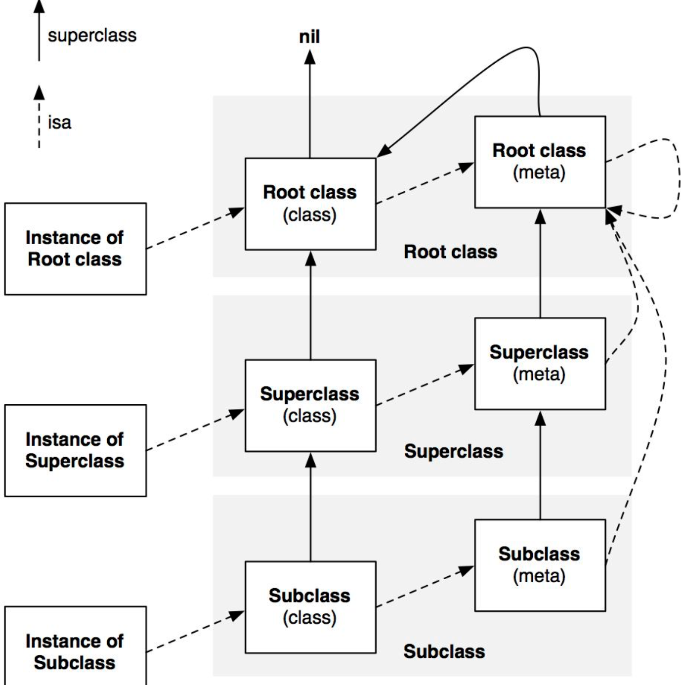

## 面试集锦

1、什么情况使用 weak 关键字，相比 assign 有什么不同？

什么情况使用 weak 关键字？

- 在 ARC 中，在有可能出现循环引用的时候，往往要通过让其中一端使用 weak 来解决，比如: delegate、block。
- 自身已经对它进行一次强引用，没有必要再强引用一次，此时也会使用 weak，自定义 IBOutlet 控件属性一般也使用 weak，使用 storyboard（xib 不行）创建的 vc，会有一个叫 `_topLevelObjectsToKeepAliveFromStoryboard` 的私有数组强引用所有 top level 的对象，所以这时即便 outlet 声明成 weak 也没关系。当然，也可以使用 strong。

weak 和 assign 的不同点：

- weak、assign 修饰的属性指向一个对象时都不会增加对象的引用计数。然而在所指的对象被释放时，weak 属性值会被置为 nil，而 assign 属性不会。
- assign 可以用非 OC 对象以及基本类型，而 weak 必须用于 OC 对象。


2、runtime 如何实现 weak 属性？

weak 此特质表明该属性定义了一种「非拥有关系」(nonowning relationship)。为这种属性设置新值时，设置方法既不持有新值（新指向的对象），也不释放旧值（原来指向的对象）。

runtime 对注册的类，会进行内存布局，从一个粗粒度的概念上来讲，这时候会有一个 hash 表，这是一个全局表，表中是用 weak 指向的对象内存地址作为 key，用所有指向该对象的 weak 指针表作为 value。当此对象的引用计数为 0 的时候会 dealloc，假如该对象内存地址是 a，那么就会以 a 为 key，在这个 weak 表中搜索，找到所有以 a 为键的 weak 对象，从而设置为 nil。

runtime 如何实现 weak 属性具体流程大致分为 3 步：

- 1、初始化时：runtime 会调用 objc_initWeak 函数，初始化一个新的 weak 指针指向对象的地址。
- 2、添加引用时：objc_initWeak 函数会调用 objc_storeWeak() 函数，objc_storeWeak() 的作用是更新指针指向（指针可能原来指向着其他对象），创建对应的弱引用表。在这个过程中，为了防止多线程中竞争冲突，会有一些锁的操作。
- 3、释放时：调用 clearDeallocating 函数，clearDeallocating 函数首先根据对象地址获取所有 weak 指针地址的数组，然后遍历这个数组把其中的数据设为 nil，最后把这个 entry 从 weak 表中删除，最后清理对象的记录。


更详细的内容参见：[iOS 底层解析 weak 的实现原理][3]


3、怎么用 copy 关键字？

copy 的语义是将对象拷贝一份给新的引用，通过新的引用对它的修改不影响原来那个被拷贝的对象。

- NSString、NSArray、NSDictionary 等等经常使用 copy 关键字，是因为他们有对应的可变类型：NSMutableString、NSMutableArray、NSMutableDictionary。
- block 也经常使用 copy 关键字。block 使用 copy 是从 MRC 遗留下来的传统，在 MRC 中，方法内部的 block 是在栈区的，使用 copy 可以把它放到堆区。在 ARC 中写不写都行，对于 block 使用 copy 还是 strong 效果是一样的，但写上 copy 也无伤大雅，还能时刻提醒我们：编译器自动对 block 进行了 copy 操作。


4、用 @property 声明的 NSString（或 NSArray，NSDictionary）经常使用 copy 关键字，为什么？如果改用 strong 关键字，可能造成什么问题？

- 使用 copy 无论给我传入是一个可变对象还是不可对象，我本身持有的就是一个不可变的副本。
- 如果使用 strong，那么这个属性就有可能指向一个可变对象，如果这个可变对象在外部被修改了，那么会影响该属性。

```
@property (nonatomic, readwrite, strong) NSArray *myArray;

NSArray *array = @[@1, @2, @3, @4];

//NSMutableArray *invalidMutableArray = array; // Warning.
//[invalidMutableArray removeAllObjects]; // Crash.

NSMutableArray *mutableArray = [NSMutableArray arrayWithArray:array];

self.myArray = mutableArray;
[mutableArray removeAllObjects];;
NSLog(@"%@", self.myArray); // ()

[mutableArray addObjectsFromArray:array];
self.myArray = [mutableArray copy];
[mutableArray removeAllObjects];;
NSLog(@"%@", self.myArray); // (1,2,3,4)
```


5、怎么理解浅拷贝与深拷贝？

不论是非集合类对象还是集合类对象：

- copy 返回的是 imutable 对象；所以，如果对 copy 返回值使用 mutable 对象接口就会 crash。
- mutableCopy 返回 mutable 对象。

对非集合类对象：

- [immutableObject copy] // 浅复制
- [immutableObject mutableCopy] // 深复制
- [mutableObject copy] // 深复制
- [mutableObject mutableCopy] // 深复制

对集合类对象：

- [immutableObject copy] // 浅复制
- [immutableObject mutableCopy] // 单层深复制
- [mutableObject copy] // 单层深复制
- [mutableObject mutableCopy] // 单层深复制

浅复制(shallow copy)：在浅复制操作时，对于被复制对象的每一层都是指针复制。
单层深复制(one-level-deep copy)：在单层深复制操作时，对于被复制对象，至少有一层是深复制。
深复制(real-deep copy)：在深复制操作时，对于被复制对象的每一层都是对象复制。

参考：[iOS 集合的深复制与浅复制](https://www.zybuluo.com/MicroCai/note/50592)


6、如何让自己的类用 copy 修饰符？

想让自己所写的对象具有拷贝功能，则需实现 NSCopying 协议。如果自定义的对象分为可变版本与不可变版本，那么就要同时实现 NSCopying 与 NSMutableCopying 协议。

实现 NSCopying 协议。该协议只有一个方法：`- (id)copyWithZone:(NSZone *)zone;`。

实现 NSMutableCopying 协议。该协议只有一个方法：`- (id)mutableCopyWithZone:(nullable NSZone *)zone;`


7、@property 的本质是什么？

@property = ivar + getter + setter;

属性(property)有两大概念：ivar（实例变量）、存取方法（access method ＝ getter + setter）。


8、@protocol 和 category 中如何使用 @property？

在 protocol 中使用 property 只会生成 setter 和 getter 方法声明，我们使用属性的目的，是希望遵守我协议的对象能实现该属性。在实现 protocol 的类中如果要使用 property 对应的实例变量，则需要做一下 `@synthesize var = _var;`。

在 category 中增加属性的目的主要为了解耦，在很多第三方框架中会使用。在 category 中使用 @property 只会生成 setter 和 getter 方法的声明，并不会自动生成实例变量以及存取方法，Xcode 会警告需要手动实现 setter 和 getter 方法。为什么这样呢？这是因为 category 它是在运行时决定的。在编译时，对象的内存布局已经确定，如果添加实例变量就会破坏类的内部布局，这对编译型语言来说是灾难性的。所以一般使用 runtime 中的关联对象为已经存在的类添加属性。关联对象类似于成员变量，不过是在运行时添加的。在 runtime 中所有的关联对象都由 AssociationsManager 管理。AssociationsManager 里面是由一个静态 AssociationsHashMap 来存储所有的关联对象的。这相当于把所有对象的关联对象都存在一个全局 map 里面。而 map 的 key 是这个对象的指针地址（任意两个不同对象的指针地址一定是不同的），而这个 map 的 value 又是另外一个 AssociationsHashMap，里面保存了关联对象的 KV 对。runtime 的销毁对象函数 `objc_destructInstance` 里面会判断这个对象有没有关联对象，如果有，会调用 `_object_remove_assocations` 做关联对象的清理工作。如果我们真的需要给 category 增加属性的实现，需要借助于运行时的两个函数：

- objc_setAssociatedObject
- objc_getAssociatedObject


示例：

```
// MyView+MyCategory.h
#import "MyView.h"

@interface MyView (MyCategory)

// 在 Category 中定义属性：
@property (assign, nonatomic) int32_t viewIndex;

@end


// MyView+MyCategory.m
#import "MyView+MyCategory.h"
#import <objc/runtime.h>

// 标记属性的 Key：
static const void *ViewIndexKey = &ViewIndexKey;

@implementation MyView (MyCategory)

@dynamic viewIndex;

- (void)setViewIndex:(int32_t)viewIndex {
    objc_setAssociatedObject(self, ViewIndexKey, @(viewIndex), OBJC_ASSOCIATION_ASSIGN);
}

- (int32_t)viewIndex {
    return [objc_getAssociatedObject(self, ViewIndexKey) intValue];
}

@end
```

更多信息参考：[深入理解 Objective-C：Category][4]


9、category 和 extension 有什么区别？category 是如何加载的？category 的方法覆盖是怎么处理的？

extension 在编译期决定，它就是类的一部分，在编译期和头文件里的 @interface 以及实现文件里的 @implement 一起形成一个完整的类，它伴随类的产生而产生，亦随之一起消亡。extension 一般用来隐藏类的私有信息，你必须有一个类的源码才能为一个类添加 extension，所以你无法为系统的类比如 NSString 添加 extension。

但是 category 则完全不一样，它是在运行期决定的。就 category 和 extension 的区别来看，我们可以推导出一个明显的事实，extension 可以添加实例变量，而 category 是无法添加实例变量的（因为在运行期，对象的内存布局已经确定，如果添加实例变量就会破坏类的内部布局，这对编译型语言来说是灾难性的）。


category 的加载是发生在运行时，加载 category 的过程：

- 1) 把 category 的实例方法、协议以及属性添加到类上。
- 2) 把 category 的类方法和协议添加到类的 metaclass 上。

其中需要注意的是：

- 1) category 的方法没有「完全替换掉」原来类已经有的方法，也就是说如果 category 和原来类都有 methodA，那么 category 附加完成之后，类的方法列表里会有两个 methodA。
- 2) category 的方法被放到了新方法列表的前面，而原来类的方法被放到了新方法列表的后面，这也就是我们平常所说的category 的方法会「覆盖」掉原来类的同名方法，这是因为运行时在查找方法的时候是顺着方法列表的顺序查找的，它只要一找到对应名字的方法，就会返回，不会管后面可能还有一样名字的方法。


在类和 category 中都可以有 `+load` 方法，那么有两个问题：

- 1) 在类的 `+load` 方法调用的时候，我们可以调用 category 中声明的方法么？答案是：可以调用，因为附加 category 到类的工作会先于 `+load` 方法的执行。
- 2) 这么些个 `+load` 方法，调用顺序是咋样的呢？答案是：`+load` 的执行顺序是先类，后 category，而 category 的 `+load` 执行顺序是根据编译顺序决定的。虽然对于 `+load` 的执行顺序是这样，但是对于「覆盖」掉的方法，则会先找到最后一个编译的 category 里的对应方法。


上面讲到的方法覆盖，还有一个补充问题：怎么调用到原来类中被 category 覆盖掉的方法？对于这个问题，我们已经知道 category 其实并不是完全替换掉原来类的同名方法，只是 category 在方法列表的前面而已，所以我们只要顺着方法列表找到最后一个对应名字的方法，就可以调用原来类的方法：

```
// 假设被覆盖的方法名叫 printName。
Class currentClass = [MyClass class];
MyClass *my = [[MyClass alloc] init];

if (currentClass) {
    unsigned int methodCount;
    Method *methodList = class_copyMethodList(currentClass, &methodCount);
    IMP lastImp = NULL;
    SEL lastSel = NULL;
    for (NSInteger i = 0; i < methodCount; i++) {
        Method method = methodList[i];
        NSString *methodName = [NSString stringWithCString:sel_getName(method_getName(method)) encoding:NSUTF8StringEncoding];
        if ([@"printName" isEqualToString:methodName]) {
            lastImp = method_getImplementation(method);
            lastSel = method_getName(method);
        }
    }
    typedef void (*fn)(id,SEL);

    if (lastImp != NULL) {
        fn f = (fn) lastImp;
        f(my, lastSel);
    }
    free(methodList);
}
```


更多信息参考：[深入理解 Objective-C：Category][4]


10、@synthesize 和 @dynamic 分别有什么作用？

- @property 有两个对应的词，一个是 @synthesize，一个是 @dynamic。如果 @synthesize 和 @dynamic 都没写，那么默认的就是 `@syntheszie var = _var;`。
- @synthesize 的语义是如果你没有手动实现 setter 方法和 getter 方法，那么编译器会自动为你加上这两个方法。
- @dynamic 告诉编译器：属性的 setter 与 getter 方法由用户自己实现，不自动生成。（当然对于 readonly 的属性只需提供 getter 即可）。假如一个属性被声明为 @dynamic var，然后你没有提供 @setter 方法和 @getter 方法，编译的时候没问题，但是当程序运行到 instance.var = someVar，由于缺 setter 方法会导致程序崩溃；或者当运行到 someVar = var 时，由于缺 getter 方法同样会导致崩溃。编译时没问题，运行时才执行相应的方法，这就是所谓的动态绑定。


11、ARC 下，不显式指定任何属性关键字时，默认的关键字都有哪些？

对应基本数据类型默认关键字是：atomic, readwrite, assign。

对于普通的 Objective-C 对象默认关键字是：atomic, readwrite, strong。


12、在有了自动合成属性实例变量之后，@synthesize 还有哪些使用场景？


总结下 @synthesize 合成实例变量的规则，有以下几点：

- 如果指定了成员变量的名称，会生成一个指定的名称的成员变量 `@synthesize foo = _foo;`。如果这个成员已经存在了就不再生成了。
- 如果是 `@synthesize foo;` 会生成一个名称为 foo 的成员变量，也就是说：如果没有指定成员变量的名称会自动生成一个属性同名的成员变量，
- 假如 property 名为 foo，同时还存在一个名为 `_foo` 的实例变量，则不会自动合成新变量。


回答这个问题前，我们要搞清楚一个问题：什么情况下不会 autosynthesis（自动合成）？

- 同时重写了 setter 和 getter 时
- 重写了只读属性的 getter 时
- 使用了 @dynamic 时
- 在 @protocol 中定义的所有属性
- 在 category 中定义的所有属性
- 重载的属性


13、一个 objc 对象如何进行内存布局（考虑有父类的情况）？

- 每一个对象内部都有一个 isa 指针，指向他的类对象，类对象中存放着本对象的：
	- 对象方法列表（对象能够接收的消息列表，保存在它所对应的类对象中）。
	- 成员变量的列表。
	- 属性列表。
	- 类对象内部也有一个 isa 指针指向元对象(meta class)，元对象内部存放的是类方法列表。
	- 类对象内部还有一个 superclass 的指针，指向他的父类对象。
- 所有父类的成员变量和自己的成员变量都会存放在该对象所对应的存储空间中。


Objective-C 对象的结构图：

- isa 指针
- 根类的实例变量
- 倒数第二层父类的实例变量
- ...
- 父类的实例变量
- 类的实例变量




14、runtime 如何通过 selector 找到对应的 IMP 地址（分别考虑实例方法和类方法）？Selector、Method 和 IMP 的有什么区别与联系？

对于实例方法，每个实例的 isa 指针指向着对应类对象，而每一个类对象中都一个对象方法列表。对于类方法，每个类对象的 isa 指针都指向着对应的元对象，而每一个元对象中都有一个类方法列表。方法列表中记录着方法的名称，方法实现，以及参数类型，其实 selector 本质就是方法名称，通过这个方法名称就可以在方法列表中找到对应的方法实现。


Selector、Method 和 IMP 的关系可以这样描述：在运行期分发消息，方法列表中的每一个实体都是一个方法（Method），它的名字叫做选择器（SEL），对应着一种方法实现（IMP）。

```
/// An opaque type that represents a method in a class definition.
typedef struct objc_method *Method;

struct objc_method {
    SEL method_name; // 方法选择器。
    char *method_types; // 存储着方法的参数类型和返回值类型。
    IMP method_imp; // 函数指针。
} 

```


15、objc 中的类方法和实例方法有什么本质区别和联系？

类方法：

- 类方法是属于类对象的
- 类方法只能通过类对象调用
- 类方法中的 self 是类对象
- 类方法可以调用其他的类方法
- 类方法中不能访问成员变量
- 类方法中不能直接调用对象方法

实例方法：

- 实例方法是属于实例对象的
- 实例方法只能通过实例对象调用
- 实例方法中的 self 是实例对象
- 实例方法中可以访问成员变量
- 实例方法中直接调用实例方法
- 实例方法中也可以调用类方法（通过类名）


16、`objc_msgSend`、`_objc_msgForward` 都是做什么的？OC 中的消息调用流程是怎样的？

`objc_msgSend` 是用来做消息发送的。在 OC 中，对方法的调用都会被转换成内部的消息发送执行对 `objc_msgSend` 方法的调用。示例如下：

```
// 1、创建对象。
// 给 MessageSendTest 类发送消息，创建对象，这句话等同于：MessageSendTest *test = [MessageSendTest alloc];。
MessageSendTest *test = ((MessageSendTest * (*)(id,SEL)) objc_msgSend)((id) [MessageSendTest class], @selector(alloc));

// 2、初始化对象。
// 给 test 对象发送消息进行初始化，这句话等同于：[test init];。
test = ((MessageSendTest *(*)(id,SEL))objc_msgSend)((id) test, @selector(init));
NSLog(@"test:%@", test);

// 3、调用无参无返回值方法。
((void(*)(id, SEL))objc_msgSend)((id) test, @selector(noArgumentsAndNoReturnValue));

// 4、调用带一个参数但无返回值的方法。
((void(*)(id, SEL, NSString *))objc_msgSend)((id) test, @selector(hasArguments:), @"带一个参数但是没有返回值");

// 5、调用带参数带返回值的方法。
int returnInt = ((int *(id, SEL, NSString *, int))objc_msgSend)((id) test, @selector(hasArguments:andReturnValue:), @"参数1", 1024);
```

`_objc_msgForward` 是 IMP 类型（函数指针），用于消息转发的：当向一个对象发送一条消息，但它并没有实现的时候，`_objc_msgForward` 会尝试做消息转发。


在消息调用的过程中，`objc_msgSend` 的动作比较清晰：首先在 Class 中的缓存查找 IMP （没缓存则初始化缓存），如果没找到，则向父类的 Class 查找。如果一直查找到根类仍旧没有实现，则用 `_objc_msgForward` 函数指针代替 IMP。最后，执行这个 IMP。

当调用一个 NSObject 对象不存在的方法时，并不会马上抛出异常，而是会经过多层转发，层层调用对象的 `-resolveInstanceMethod:`、`-forwardingTargetForSelector:`、`-methodSignatureForSelector:`、`-forwardInvocation:` 等方法。其中最后 `-forwardInvocation:` 是会有一个 NSInvocation 对象，这个 NSInvocation 对象保存了这个方法调用的所有信息，包括 Selector 名，参数和返回值类型，最重要的是有所有参数值，可以从这个 NSInvocation 对象里拿到调用的所有参数值。我们可以想办法让每个需要被 JS 替换的方法调用最后都调到 `-forwardInvocation:`，就可以解决无法拿到参数值的问题了。

这里以 JSPatch 实现 hotpatch 替换 UIViewController 的 `-viewWillAppear:` 方法为例：

- 把 UIViewController 的 `-viewWillAppear:` 方法通过 `class_replaceMethod()` 接口指向一个不存在的 IMP: `class_getMethodImplementation(cls, @selector(__JPNONImplementSelector))`，这样调用这个方法时就会走到 `-forwardInvocation:`。
- 为 UIViewController 添加 `-ORIGviewWillAppear:` 和 `-_JPviewWillAppear:` 两个方法，前者指向原来的 IMP 实现，后者是新的实现，稍后会在这个实现里回调 JS 函数。
- 改写 UIViewController 的 `-forwardInvocation:` 方法为自定义实现。一旦 OC 里调用 UIViewController 的 `-viewWillAppear:` 方法，经过上面的处理会把这个调用转发到 `-forwardInvocation:`，这时已经组装好了一个 NSInvocation，包含了这个调用的参数。在这里把参数从 NSInvocation 反解出来，带着参数调用上述新增加的方法 `-JPviewWillAppear:`，在这个新方法里取到参数传给 JS，调用 JS 的实现函数。整个调用过程就结束了。


17、能否向编译后得到的类中增加实例变量？能否向运行时创建的类中添加实例变量？为什么？

- 不能向编译后得到的类中增加实例变量。
- 能向运行时创建的类中添加实例变量。

解释下：

- 因为编译后的类已经注册在 runtime 中，类结构体中的 objc_ivar_list 实例变量的链表和 instance_size 实例变量的内存大小已经确定，同时 runtime 会调用 class_setIvarLayout 或 class_setWeakIvarLayout 来处理 strong weak 引用。所以不能向存在的类中添加实例变量。
- 运行时创建的类是可以添加实例变量，调用 class_addIvar 函数。但是得在调用 objc_allocateClassPair 之后，objc_registerClassPair 之前，原因同上。

动态构建类的代码示例：

```
#pragma mark - Runtime Class Construct
int32_t testRuntimeMethodIMP(id self, SEL _cmd, NSDictionary *dic) {
    NSLog(@"testRuntimeMethodIMP: %@", dic);
    // Print:
    // testRuntimeMethodIMP: {
    //     a = "para_a";
    //     b = "para_b";
    // }
    
    return 99;
}

- (void)runtimeConstruct {
#pragma clang diagnostic push
#pragma clang diagnostic ignored "-Wundeclared-selector"

    Class cls = objc_allocateClassPair(SuperClass.class, "RuntimeSubClass", 0);
    // Method returns: "int32_t"; accepts: "id self", "SEL _cmd", "NSDictionary *dic". So use "i@:@" here.
    class_addMethod(cls, @selector(testRuntimeMethod), (IMP) testRuntimeMethodIMP, "i@:@");
    // You can only register a class once.
    objc_registerClassPair(cls);
    

    id sub = [[cls alloc] init];
    NSLog(@"%@, %@", object_getClass(sub), class_getSuperclass(object_getClass(sub))); // Print: RuntimeSubClass, SuperClass
    Class metaCls = objc_getMetaClass("RuntimeSubClass");
    if (class_isMetaClass(metaCls)) {
        NSLog(@"YES, %@, %@, %@", metaCls, class_getSuperclass(metaCls), object_getClass(metaCls)); // Print: YES, RuntimeSubClass, SuperClass, NSObject
    } else {
        NSLog(@"NO");
    }
    
    
    unsigned int outCount = 0;
    Method *methods = class_copyMethodList(cls, &outCount);
    for (int32_t i = 0; i < outCount; i++) {
        Method method = methods[i];
        NSLog(@"%@, %s", NSStringFromSelector(method_getName(method)), method_getTypeEncoding(method));
    }
    // Print: testRuntimeMethod, i@:@
    free(methods);
    
    
    int32_t result = (int) [sub performSelector:@selector(testRuntimeMethod) withObject:@{@"a":@"para_a", @"b":@"para_b"}];
    NSLog(@"%d", result); // Print: 99
    
    
    // Destroy instances of cls class before destroy cls class.
    sub = nil;
    // Do not call this function if instances of the cls class or any subclass exist.
    objc_disposeClassPair(cls);
    
#pragma clang diagnostic pop
}

#pragma mark - Runtime Ivar&Property Construct
NSString * runtimePropertyGetterIMP(id self, SEL _cmd) {
    Ivar ivar = class_getInstanceVariable([self class], "_runtimeProperty");
    
    return object_getIvar(self, ivar);
}

void runtimePropertySetterIMP(id self, SEL _cmd, NSString *s) {
    Ivar ivar = class_getInstanceVariable([self class], "_runtimeProperty");
    NSString *old = (NSString *) object_getIvar(self, ivar);
    if (![old isEqualToString:s]) {
        object_setIvar(self, ivar, s);
    }
}

- (void)aboutIvarAndProperty {
    
    
#pragma clang diagnostic push
#pragma clang diagnostic ignored "-Wundeclared-selector"

    // 1: Add property and getter/setter.
    Class cls = objc_allocateClassPair(SuperClass.class, "RuntimePropertySubClass", 0);

    BOOL b = class_addIvar(cls, "_runtimeProperty", sizeof(cls), log2(sizeof(cls)), @encode(NSString));
    NSLog(@"%@", b ? @"YES" : @"NO"); // Print: YES
    
    objc_property_attribute_t type = {"T", "@\"NSString\""};
    objc_property_attribute_t ownership = {"C", ""}; // C = copy
    objc_property_attribute_t isAtomic = {"N", ""}; // N = nonatomic
    objc_property_attribute_t backingivar  = {"V", "_runtimeProperty"};
    objc_property_attribute_t attrs[] = {type, ownership, isAtomic, backingivar};
    class_addProperty(cls, "runtimeProperty", attrs, 4);
    class_addMethod(cls, @selector(runtimeProperty), (IMP) runtimePropertyGetterIMP, "@@:");
    class_addMethod(cls, @selector(setRuntimeProperty), (IMP) runtimePropertySetterIMP, "v@:@");
    
    // You can only register a class once.
    objc_registerClassPair(cls);

    
    // 2: Print all properties.
    unsigned int outCount = 0;
    objc_property_t *properties = class_copyPropertyList(cls, &outCount);
    for (int32_t i = 0; i < outCount; i++) {
        objc_property_t property = properties[i];
        NSLog(@"%s, %s\n", property_getName(property), property_getAttributes(property));
    }
    // Print:
    // runtimeProperty, T@"NSString",C,N,V_runtimeProperty
    free(properties);
    
    
    // 3: Print all ivars.
    Ivar *ivars = class_copyIvarList(cls, &outCount);
    for (int32_t i = 0; i < outCount; i++) {
        Ivar ivar = ivars[i];
        NSLog(@"%s, %s\n", ivar_getName(ivar), ivar_getTypeEncoding(ivar));
    }
    // Print:
    // _runtimeProperty, {NSString=#}
    free(ivars);
    
    
    // 4: Use runtime property.
    id sub = [[cls alloc] init];
    [sub performSelector:@selector(setRuntimeProperty) withObject:@"It-is-a-runtime-property."];
    NSString *s = [sub performSelector:@selector(runtimeProperty)]; //[sub valueForKey:@"runtimeProperty"];
    NSLog(@"%@", s); // Print: It-is-a-runtime-property.
    
    
    // 5: Clear.
    // Destroy instances of cls class before destroy cls class.
    sub = nil;
    // Do not call this function if instances of the cls class or any subclass exist.
    objc_disposeClassPair(cls);

#pragma clang diagnostic pop
}
```


18、run loop 和线程有什么关系？

首先，iOS 开发中能遇到两个线程对象: pthread_t 和 NSThread。过去苹果有份文档标明了 NSThread 只是 pthread_t 的封装，但那份文档已经失效了，现在它们也有可能都是直接包装自最底层的 mach thread。苹果并没有提供这两个对象相互转换的接口，但不管怎么样，可以肯定的是 pthread_t 和 NSThread 是一一对应的。比如，你可以通过 `pthread_main_thread_np()` 或 `[NSThread mainThread]` 来获取主线程；也可以通过 `pthread_self()` 或 `[NSThread currentThread]` 来获取当前线程。CFRunLoop 是基于 pthread 来管理的。

苹果不允许直接创建 RunLoop，它只提供了两个自动获取的函数：`CFRunLoopGetMain()` 和 `CFRunLoopGetCurrent()`。 这两个函数内部的逻辑大概是下面这样:

```
/// 全局的Dictionary，key 是 pthread_t， value 是 CFRunLoopRef
static CFMutableDictionaryRef loopsDic;
/// 访问 loopsDic 时的锁
static CFSpinLock_t loopsLock;
 
/// 获取一个 pthread 对应的 RunLoop。
CFRunLoopRef _CFRunLoopGet(pthread_t thread) {
    OSSpinLockLock(&loopsLock);
    
    if (!loopsDic) {
        // 第一次进入时，初始化全局Dic，并先为主线程创建一个 RunLoop。
        loopsDic = CFDictionaryCreateMutable();
        CFRunLoopRef mainLoop = _CFRunLoopCreate();
        CFDictionarySetValue(loopsDic, pthread_main_thread_np(), mainLoop);
    }
    
    /// 直接从 Dictionary 里获取。
    CFRunLoopRef loop = CFDictionaryGetValue(loopsDic, thread));
    
    if (!loop) {
        /// 取不到时，创建一个
        loop = _CFRunLoopCreate();
        CFDictionarySetValue(loopsDic, thread, loop);
        /// 注册一个回调，当线程销毁时，顺便也销毁其对应的 RunLoop。
        _CFSetTSD(..., thread, loop, __CFFinalizeRunLoop);
    }
    
    OSSpinLockUnLock(&loopsLock);
    return loop;
}
 
CFRunLoopRef CFRunLoopGetMain() {
    return _CFRunLoopGet(pthread_main_thread_np());
}
 
CFRunLoopRef CFRunLoopGetCurrent() {
    return _CFRunLoopGet(pthread_self());
}
```

从上面的代码可以看出，线程和 RunLoop 之间是一一对应的，其关系是保存在一个全局的 Dictionary 里。线程刚创建时并没有 RunLoop，如果你不主动获取，那它一直都不会有。RunLoop 的创建是发生在第一次获取时，RunLoop 的销毁是发生在线程结束时。你只能在一个线程的内部获取其 RunLoop（主线程除外）。

更多信息可以参考：[深入理解 RunLoop][6]


19、run loop 的 mode 作用是什么？

线程的运行的过程中需要去响应各种不同的事件和处理不同情境，mode 则是这个情景模式，告诉当前应该响应哪些事件，忽略哪些事件。mode 主要是用来指定事件在运行循环中的优先级的。

CFRunLoopMode 和 CFRunLoop 的结构大致如下：

```
struct __CFRunLoopMode {
    CFStringRef _name;            // Mode Name, 例如 @"kCFRunLoopDefaultMode"
    CFMutableSetRef _sources0;    // Set
    CFMutableSetRef _sources1;    // Set
    CFMutableArrayRef _observers; // Array
    CFMutableArrayRef _timers;    // Array
    ...
};
 
struct __CFRunLoop {
    CFMutableSetRef _commonModes;     // Set
    CFMutableSetRef _commonModeItems; // Set<Source/Observer/Timer>
    CFRunLoopModeRef _currentMode;    // Current Runloop Mode
    CFMutableSetRef _modes;           // Set
    ...
};
```

这里有个概念叫 CommonModes：一个 Mode 可以将自己标记为 Common 属性（通过将其 ModeName 添加到 RunLoop 的 commonModes 中）。每当 RunLoop 的内容发生变化时，RunLoop 都会自动将 `_commonModeItems` 里的 Source/Observer/Timer 同步到具有 Common 标记的所有 Mode 里。

应用场景举例：主线程的 RunLoop 里有两个预置的 Mode：kCFRunLoopDefaultMode 和 UITrackingRunLoopMode。这两个 Mode 都已经被标记为 Common 属性。DefaultMode 是 App 平时所处的状态，TrackingRunLoopMode 是追踪 ScrollView 滑动时的状态。当你创建一个 Timer 并加到 DefaultMode 时，Timer 会得到重复回调，但此时滑动一个 TableView 时，RunLoop 会将 mode 切换为 TrackingRunLoopMode，这时 Timer 就不会被回调，并且也不会影响到滑动操作。

有时你需要一个 Timer，在两个 Mode 中都能得到回调，一种办法就是将这个 Timer 分别加入这两个 Mode。还有一种方式，就是将 Timer 加入到顶层的 RunLoop 的 commonModeItems 中。commonModeItems 被 RunLoop 自动更新到所有具有 Common 属性的 Mode 里去。


CFRunLoop 对外暴露的管理 Mode 接口只有下面 2 个：

```
CFRunLoopAddCommonMode(CFRunLoopRef runloop, CFStringRef modeName);
CFRunLoopRunInMode(CFStringRef modeName, ...);
```

Mode 暴露的管理 mode item 的接口有下面几个：

```
CFRunLoopAddSource(CFRunLoopRef rl, CFRunLoopSourceRef source, CFStringRef modeName);
CFRunLoopAddObserver(CFRunLoopRef rl, CFRunLoopObserverRef observer, CFStringRef modeName);
CFRunLoopAddTimer(CFRunLoopRef rl, CFRunLoopTimerRef timer, CFStringRef mode);
CFRunLoopRemoveSource(CFRunLoopRef rl, CFRunLoopSourceRef source, CFStringRef modeName);
CFRunLoopRemoveObserver(CFRunLoopRef rl, CFRunLoopObserverRef observer, CFStringRef modeName);
CFRunLoopRemoveTimer(CFRunLoopRef rl, CFRunLoopTimerRef timer, CFStringRef mode);
```

你只能通过 mode name 来操作内部的 mode，当你传入一个新的 mode name 但 RunLoop 内部没有对应 mode 时，RunLoop会自动帮你创建对应的 CFRunLoopModeRef。对于一个 RunLoop 来说，其内部的 mode 只能增加不能删除。

苹果公开提供的 Mode 有两个，你可以用这两个 Mode Name 来操作其对应的 Mode：

- kCFRunLoopDefaultMode (NSDefaultRunLoopMode)
- UITrackingRunLoopMode

同时苹果还提供了一个操作 Common 标记的字符串：kCFRunLoopCommonModes (NSRunLoopCommonModes)，你可以用这个字符串来操作 Common Items，或标记一个 Mode 为 Common。使用时注意区分这个字符串和其他 mode name。


20、以 `+ scheduledTimerWithTimeInterval...` 的方式触发的 timer，在滑动页面上的列表时，timer 会暂定回调，为什么？如何解决？


RunLoop 只能运行在一种 mode 下，如果要换 mode，当前的 loop 也需要停下重启成新的。利用这个机制，ScrollView 滚动过程中 NSDefaultRunLoopMode（kCFRunLoopDefaultMode）的 mode 会切换到 UITrackingRunLoopMode 来保证 ScrollView 的流畅滑动：只能在 NSDefaultRunLoopMode 模式下处理的事件会影响 ScrollView 的滑动。

如果我们把一个 NSTimer 对象以 NSDefaultRunLoopMode（kCFRunLoopDefaultMode）添加到主运行循环中的时候, ScrollView 滚动过程中会因为 mode 的切换，而导致 NSTimer 将不再被调度。

Timer 计时会被 scrollView 的滑动影响的问题可以通过将 timer 添加到 NSRunLoopCommonModes（kCFRunLoopCommonModes）来解决。

```
// 默认情况：将 timer 添加到 NSDefaultRunLoopMode 中：
[NSTimer scheduledTimerWithTimeInterval:1.0
     target:self
     selector:@selector(timerTick:)
     userInfo:nil
     repeats:YES];

// 手动将 timer 添加到 NSRunLoopCommonModes 里：
NSTimer *timer = [NSTimer timerWithTimeInterval:1.0
     target:self
     selector:@selector(timerTick:)
     userInfo:nil
     repeats:YES];
[[NSRunLoop currentRunLoop] addTimer:timer forMode:NSRunLoopCommonModes];
```


21、猜想 run loop 内部是如何实现的？

一般来讲，一个线程一次只能执行一个任务，执行完成后线程就会退出。如果我们需要一个机制，让线程能随时处理事件但并不退出，通常的代码逻辑 是这样的：

```
function loop() {
    initialize();
    do {
        var message = get_next_message();
        process_message(message);
    } while (message != quit);
}
```


22、objc 使用什么机制管理对象内存？

通过 retainCount 的机制来决定对象是否需要释放。 每次 run loop 的时候，都会检查对象的 retainCount，如果 retainCount 为 0，说明该对象没有地方需要继续使用了，可以释放掉了。


23、ARC 通过什么方式帮助开发者管理内存？

ARC 相对于 MRC，不是在编译时添加 retain/release/autorelease 这么简单。应该是编译期和运行期两部分共同帮助开发者管理内存。

在编译期，ARC 用的是更底层的 C 接口实现的 retain/release/autorelease，这样做性能更好，也是为什么不能在 ARC 环境下手动 retain/release/autorelease，同时对同一上下文的同一对象的成对 retain/release 操作进行优化（即忽略掉不必要的操作）；ARC 也包含运行期组件，这个地方做的优化比较复杂，但也不能被忽略。


24、一个 autorealese 对象在什么时刻释放？

分两种情况：手动干预释放时机、系统自动去释放。

- 手动干预释放时机：手动指定 autoreleasepool 的 autorelease 对象，在当前作用域大括号结束时释放。
- 系统自动去释放：不手动指定 autoreleasepool 的 autorelease 对象出了作用域之后，会被添加到最近一次创建的自动释放池中，并会在当前的 runloop 迭代结束时释放。而它能够释放的原因是系统在每个 runloop 迭代中都加入了自动释放池 Push 和 Pop。

例子：

```
__weak id reference = nil;
- (void)viewDidLoad {
    [super viewDidLoad];
    NSString *str = [NSString stringWithFormat:@"aaa"];
    // str 是一个 autorelease 对象，设置一个 weak 的引用来观察它。
    reference = str;
}
- (void)viewWillAppear:(BOOL)animated {
    [super viewWillAppear:animated];
    NSLog(@"%@", reference); // Console: aaa
}
- (void)viewDidAppear:(BOOL)animated {
    [super viewDidAppear:animated];
    NSLog(@"%@", reference); // Console: (null)
}
```

由于这个 vc 在 loadView 之后便 add 到了 window 层级上，所以 viewDidLoad 和 viewWillAppear 是在同一个 runloop 调用的，因此在 viewWillAppear 中，这个 autorelease 的变量依然有值。而在 viewDidAppear 执行之前这个 autorelease 的变量已经被释放了。


从程序启动到加载完成是一个完整的 runloop，然后会停下来，等待用户交互，用户的每一次交互都会启动一次运行循环，来处理用户所有的点击事件、触摸事件。

我们都知道：所有 autorelease 的对象，在出了作用域之后，会被自动添加到最近创建的自动释放池中。

但是如果每次都放进应用程序的 main.m 中的 autoreleasepool 中，迟早有被撑满的一刻。所以在每一次完整的 runloop 结束之前，对于的自动释放池里面的 autorelease 对象会被销毁。那这个自动释放池是什么时候创建的呢？答案是，在 runloop 检测到事件并启动后，就会创建对应的自动释放池。


子线程的 runloop 默认是不工作，无法主动创建，必须手动创建。

自定义的 NSOperation 和 NSThread 需要手动创建自动释放池。比如： 自定义的 NSOperation 类中的 main 方法里就必须添加自动释放池。否则出了作用域后，自动释放对象会因为没有自动释放池去处理它，而造成内存泄露。但对于 blockOperation 和 invocationOperation 这种默认的 Operation ，系统已经帮我们封装好了，不需要手动创建自动释放池。

@autoreleasepool 当自动释放池被销毁或者耗尽时，会向自动释放池中的所有对象发送 release 消息，释放自动释放池中的所有对象。


25、如何实现 autoreleasepool 的？


autoreleasepool 以一个队列数组的形式实现，主要通过下列三个函数完成.

- objc_autoreleasepoolPush
- objc_autoreleasepoolPop
- objc_autorelease


26、如何用 GCD 同步若干个异步调用？

使用 Dispatch Group 追加 block 到 Global Group Queue，这些 block 如果全部执行完毕，就会执行 Main Dispatch Queue 中的结束处理的 block。

```
dispatch_queue_t queue = dispatch_get_global_queue(DISPATCH_QUEUE_PRIORITY_DEFAULT, 0);
dispatch_group_t group = dispatch_group_create();
dispatch_group_async(group, queue, ^{ /*加载图片1 */ });
dispatch_group_async(group, queue, ^{ /*加载图片2 */ });
dispatch_group_async(group, queue, ^{ /*加载图片3 */ }); 
dispatch_group_notify(group, dispatch_get_main_queue(), ^{
    // 合并图片
});
```


27、dispatch_barrier_async 的作用是什么？

dispatch_barrier_async 函数配合 Concurrent Dispatch Queue 一起使用可以在并行的任务中插入中间任务。

```
dispatch_queue_t queue = dispatch_queue_create("com.example.gcd.ForBarrier", DISPATCH_QUEUE_CONCURRENT);
dispatch_async(queue, blk0_for_reading);
dispatch_async(queue, blk1_for_reading);
dispatch_async(queue, blk2_for_reading);
dispatch_async(queue, blk3_for_reading);
dispatch_barrier_async(queue, blk_for_writing);
dispatch_async(queue, blk4_for_reading);
dispatch_async(queue, blk5_for_reading);
dispatch_async(queue, blk6_for_reading);
dispatch_async(queue, blk7_for_reading);
```

dispatch_barrier_async 函数会等待当前 Concurrent Dispatch Queue 中并行执行的读取任务(blk0-3_for_reading)都结束后，再将指定的 blk_for_writing 任务添加到 Concurrent Dispatch Queue 中，然后只有在这个任务执行完毕后，后面添加到 Concurrent Dispatch Queue 的任务(blk4-7_for_reading)才恢复正常的并行执行的模式。可见，Concurrent Dispatch Queue 和 dispatch_barrier_async 搭配使用可以使编码非常清晰，同时可以实现高效率的数据库访问和文件访问。


28、苹果为什么要废弃 dispatch_get_current_queue？

dispatch_get_current_queue 容易造成死锁。

```
- (void)viewDidLoad
{
    [super viewDidLoad];
    NSLog(@"1");
    dispatch_sync(dispatch_get_main_queue(), ^{
        NSLog(@"2");
    });
    NSLog(@"3");
}
```

只输出：1。发生主线程锁死。

dispatch_sync 函数用于将一个 block 提交到队列中同步执行，同步（sync）操作会阻塞当前线程并等待 block 中的任务执行完毕才会返回。dispatch_get_main_queue() 得到的是一个串行队列，串行队列的特点：一次只调度一个任务，队列中的任务一个接着一个地执行（一个任务执行完毕后，再执行下一个任务）。所以就锁死了。


29、如何手动触发一个 value 的 KVO？

KVC，即是指 NSKeyValueCoding，一个非正式的 Protocol，提供一种机制来间接访问对象的属性。KVO 就是基于 KVC 实现的关键技术之一。

键值观察通知依赖于 NSObject 的两个方法: `willChangeValueForKey:` 和 `didChangevlueForKey:`。在一个被观察属性发生改变之前，`willChangeValueForKey:` 一定会被调用，这就会记录旧的值。而当改变发生后，`observeValueForKey:ofObject:change:context:` 和 `didChangeValueForKey:` 也会被调用。如果可以手动实现这些调用，就可以实现“手动触发”了。

```
@property (nonatomic, strong) NSDate *now;

- (void)viewDidLoad {
   [super viewDidLoad];
   _now = [NSDate date];
   [self addObserver:self forKeyPath:@"now" options:NSKeyValueObservingOptionNew context:nil];
   NSLog(@"1");
   [self willChangeValueForKey:@"now"]; // 手动触发 self.now 的 KVO，必写。
   NSLog(@"2");
   [self didChangeValueForKey:@"now"]; // 手动触发 self.now 的 KVO，必写。
   NSLog(@"4");
}

- (void)observeValueForKeyPath:(NSString *)keyPath ofObject:(id)object change:(NSDictionary<NSString *,id> *)change context:(void *)context {
   NSLog(@"3");
}
```

打印顺序是：1 2 3 4。从这里看顺序似乎是 `wilChangeValueForKey:`、`observeValueForKeyPath:ofObject:change:context:`、`didChangeValueForKey:`。其实，实际情况是：`wilChangeValueForKey:` 先调用，接着是调用 `didChangeValueForKey:`，在 `didChangeValueForKey:` 内部调用了 `observeValueForKeyPath:ofObject:change:context:`。你可以注释掉 `[self didChangeValueForKey:@"now"];` 试试。

但是平时我们一般不会这么干，我们都是等系统去“自动触发”。“自动触发”的实现原理：

比如调用 setNow: 时，系统还会以某种方式在中间插入 `wilChangeValueForKey:`、`didChangeValueForKey:` 和 `observeValueForKeyPath:ofObject:change:context:` 的调用。

大致表现如下：

```
- (void)setNow:(NSDate *)aDate {
   [self willChangeValueForKey:@"now"];
   [super setValue:aDate forKey:@"now"];
   [self didChangeValueForKey:@"now"];
}
```

Apple 使用了 isa 混写（isa-swizzling）来实现 KVO，这种继承和方法注入是在运行时而不是编译时实现的。这就是正确命名如此重要的原因。只有在使用 KVC 命名约定时，KVO 才能做到这一点。KVO 在实现中通过 isa 混写（isa-swizzling）把这个对象的 isa 指针（isa 指针告诉 Runtime 系统这个对象的类是什么）指向这个新创建的子类，对象就神奇的变成了新创建的子类的实例。Apple 还重写、覆盖了 -class 方法并返回原来的类，企图欺骗我们：这个类没有变，就是原本那个类。


30、BAD_ACCESS 在什么情况下出现？

- 访问了野指针。比如对一个已经释放的对象执行了 release，访问已经释放对象的成员变量或者发消息。
- 死循环。


31、如何调试 BAD_ACCESS 错误？

- 重写 object 的 respondsToSelector 方法，现实出现 EXEC_BAD_ACCESS 前访问的最后一个 object。
- 通过 Zombie。
- 设置全局断点快速定位问题代码所在行。
- Xcode 7 已经集成了 BAD_ACCESS 捕获功能：Address Sanitizer。用法如下：在配置中勾选 Enable Address Sanitizer。


32、动态计算文本高度的时候需要注意什么？

```
+ (CGSize)contentSizeForContent:(NSString *)content withFixedWidth:(CGFloat)width {
    CGSize maxSize = CGSizeMake(width, MAXFLOAT);

    UIFont *font = [UIFont systemFontOfSize:14.0];

    NSMutableParagraphStyle *paragraphStyle = [[NSMutableParagraphStyle alloc] init];
    paragraphStyle.alignment = NSTextAlignmentLeft;

    CGRect suggestRect = [content boundingRectWithSize:maxSize options:NSStringDrawingUsesLineFragmentOrigin attributes:@{NSFontAttributeName: font, NSParagraphStyleAttributeName: paragraphStyle} context:nil];
    
    CGSize resultSize = CGSizeMake(width, ceil(suggestRect.size.height));
    
    return resultSize;
}

```

如上代码，需要注意算完高度需要用 `ceil` 来处理一下做向上取整。


## 其他参考

- [笔试面试知识整理][5]


[SamirChen]: http://www.samirchen.com "SamirChen"
[1]: {{ page.url }} ({{ page.title }})
[2]: http://www.samirchen.com/ios-interview
[3]: http://www.cocoachina.com/ios/20170328/18962.html
[4]: https://tech.meituan.com/DiveIntoCategory.html
[5]: https://hit-alibaba.github.io/interview/
[6]: https://blog.ibireme.com/2015/05/18/runloop/
