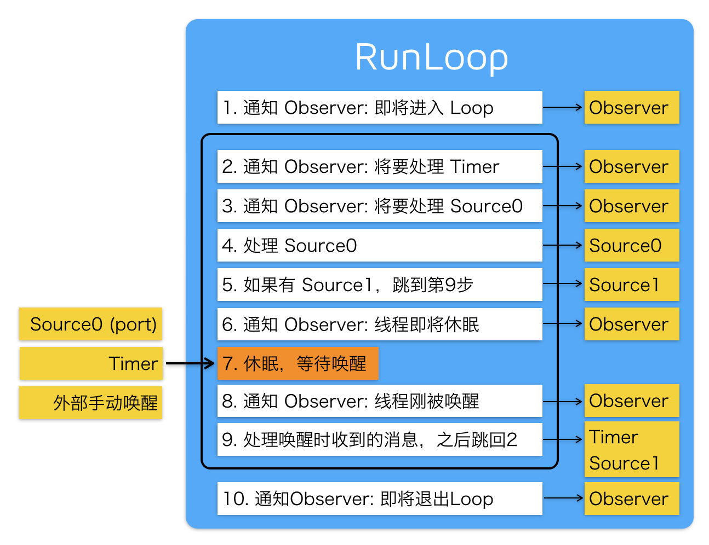
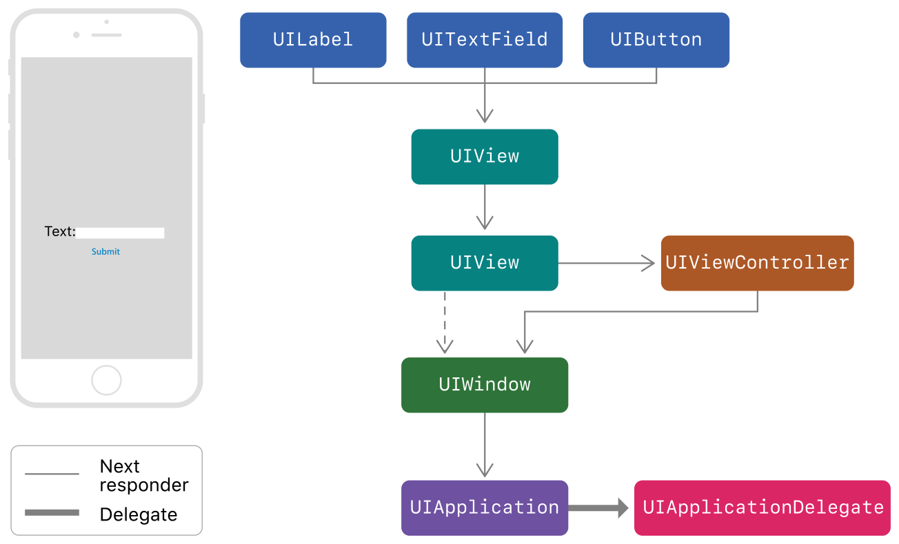
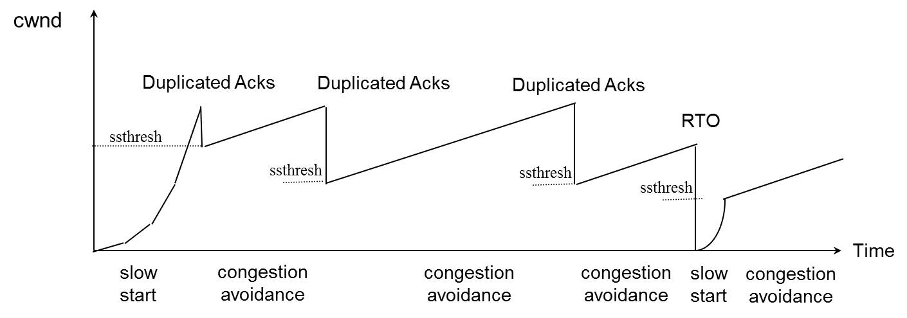

## 面试集锦

1、什么情况使用 weak 关键字，相比 assign 有什么不同？

什么情况使用 weak 关键字？

- 在 ARC 中，在有可能出现循环引用的时候，往往要通过让其中一端使用 weak 来解决，比如: delegate、block。
- 自身已经对它进行一次强引用，没有必要再强引用一次，此时也会使用 weak，自定义 IBOutlet 控件属性一般也使用 weak，使用 storyboard（xib 不行）创建的 vc，会有一个叫 `_topLevelObjectsToKeepAliveFromStoryboard` 的私有数组强引用所有 top level 的对象，所以这时即便 outlet 声明成 weak 也没关系。当然，也可以使用 strong。

weak 和 assign 的不同点：

- weak、assign 修饰的属性指向一个对象时都不会增加对象的引用计数。然而在所指的对象被释放时，weak 属性值会被置为 nil，而 assign 属性不会。
- assign 可以用非 OC 对象以及基本类型，而 weak 必须用于 OC 对象。


2、runtime 如何实现 weak 属性？

weak 此特质表明该属性定义了一种「非拥有关系」(nonowning relationship)。为这种属性设置新值时，设置方法既不持有新值（新指向的对象），也不释放旧值（原来指向的对象）。

runtime 对注册的类，会进行内存布局，从一个粗粒度的概念上来讲，这时候会有一个 hash 表，这是一个全局表，表中是用 weak 指向的对象内存地址作为 key，用所有指向该对象的 weak 指针表作为 value。当此对象的引用计数为 0 的时候会 dealloc，假如该对象内存地址是 a，那么就会以 a 为 key，在这个 weak 表中搜索，找到所有以 a 为键的 weak 对象，从而设置为 nil。

runtime 如何实现 weak 属性具体流程大致分为 3 步：

- 1、初始化时：runtime 会调用 objc_initWeak 函数，初始化一个新的 weak 指针指向对象的地址。
- 2、添加引用时：objc_initWeak 函数会调用 objc_storeWeak() 函数，objc_storeWeak() 的作用是更新指针指向（指针可能原来指向着其他对象，这时候需要将该 weak 指针与旧对象解除绑定，会调用到 `weak_unregister_no_lock`），如果指针指向的新对象非空，则创建对应的弱引用表，将 weak 指针与新对象进行绑定，会调用到 `weak_register_no_lock`。在这个过程中，为了防止多线程中竞争冲突，会有一些锁的操作。
- 3、释放时：调用 clearDeallocating 函数，clearDeallocating 函数首先根据对象地址获取所有 weak 指针地址的数组，然后遍历这个数组把其中的数据设为 nil，最后把这个 entry 从 weak 表中删除，最后清理对象的记录。


更详细的内容参见：[iOS 底层解析 weak 的实现原理][3]


3、怎么用 copy 关键字？

copy 的语义是将对象拷贝一份给新的引用，通过新的引用对它的修改不影响原来那个被拷贝的对象。

- NSString、NSArray、NSDictionary 等等经常使用 copy 关键字，是因为他们有对应的可变类型：NSMutableString、NSMutableArray、NSMutableDictionary。
- block 也经常使用 copy 关键字。block 使用 copy 是从 MRC 遗留下来的传统，在 MRC 中，方法内部的 block 是在栈区的，使用 copy 可以把它放到堆区。在 ARC 中写不写都行，对于 block 使用 copy 还是 strong 效果是一样的，但写上 copy 也无伤大雅，还能时刻提醒我们：编译器自动对 block 进行了 copy 操作。


4、用 @property 声明的 NSString（或 NSArray，NSDictionary）经常使用 copy 关键字，为什么？如果改用 strong 关键字，可能造成什么问题？

- 使用 copy 无论给我传入是一个可变对象还是不可对象，我本身持有的就是一个不可变的副本。
- 如果使用 strong，那么这个属性就有可能指向一个可变对象，如果这个可变对象在外部被修改了，那么会影响该属性。

```
@property (nonatomic, readwrite, strong) NSArray *myArray;

NSArray *array = @[@1, @2, @3, @4];

//NSMutableArray *invalidMutableArray = array; // Warning.
//[invalidMutableArray removeAllObjects]; // Crash.

NSMutableArray *mutableArray = [NSMutableArray arrayWithArray:array];

self.myArray = mutableArray;
[mutableArray removeAllObjects];;
NSLog(@"%@", self.myArray); // ()

[mutableArray addObjectsFromArray:array];
self.myArray = [mutableArray copy];
[mutableArray removeAllObjects];;
NSLog(@"%@", self.myArray); // (1,2,3,4)
```


5、怎么理解浅拷贝与深拷贝？

不论是非集合类对象还是集合类对象：

- copy 返回的是 imutable 对象；所以，如果对 copy 返回值使用 mutable 对象接口就会 crash。
- mutableCopy 返回 mutable 对象。

对非集合类对象：

- [immutableObject copy] // 浅复制
- [immutableObject mutableCopy] // 深复制
- [mutableObject copy] // 深复制
- [mutableObject mutableCopy] // 深复制

对集合类对象：

- [immutableObject copy] // 浅复制
- [immutableObject mutableCopy] // 单层深复制
- [mutableObject copy] // 单层深复制
- [mutableObject mutableCopy] // 单层深复制

浅复制(shallow copy)：在浅复制操作时，对于被复制对象的每一层都是指针复制。
单层深复制(one-level-deep copy)：在单层深复制操作时，对于被复制对象，至少有一层是深复制。
深复制(real-deep copy)：在深复制操作时，对于被复制对象的每一层都是对象复制。

参考：[iOS 集合的深复制与浅复制](https://www.zybuluo.com/MicroCai/note/50592)


6、如何让自己的类用 copy 修饰符？

想让自己所写的对象具有拷贝功能，则需实现 NSCopying 协议。如果自定义的对象分为可变版本与不可变版本，那么就要同时实现 NSCopying 与 NSMutableCopying 协议。

实现 NSCopying 协议。该协议只有一个方法：`- (id)copyWithZone:(NSZone *)zone;`。

实现 NSMutableCopying 协议。该协议只有一个方法：`- (id)mutableCopyWithZone:(nullable NSZone *)zone;`


7、@property 的本质是什么？

@property = ivar + getter + setter;

属性(property)有两大概念：ivar（实例变量）、存取方法（access method ＝ getter + setter）。


8、@protocol 和 category 中如何使用 @property？

在 protocol 中使用 property 只会生成 setter 和 getter 方法声明，我们使用属性的目的，是希望遵守我协议的对象能实现该属性。在实现 protocol 的类中如果要使用 property 对应的实例变量，则需要做一下 `@synthesize var = _var;`。

在 category 中增加属性的目的主要为了解耦，在很多第三方框架中会使用。在 category 中使用 @property 只会生成 setter 和 getter 方法的声明，并不会自动生成实例变量以及存取方法，Xcode 会警告需要手动实现 setter 和 getter 方法。为什么这样呢？这是因为 category 它是在运行时决定的。在编译时，对象的内存布局已经确定，如果添加实例变量就会破坏类的内部布局，这对编译型语言来说是灾难性的。所以一般使用 runtime 中的关联对象为已经存在的类添加属性。关联对象类似于成员变量，不过是在运行时添加的。在 runtime 中所有的关联对象都由 AssociationsManager 管理。AssociationsManager 里面是由一个静态 AssociationsHashMap 来存储所有的关联对象的。这相当于把所有对象的关联对象都存在一个全局 map 里面。而 map 的 key 是这个对象的指针地址（任意两个不同对象的指针地址一定是不同的），而这个 map 的 value 又是另外一个 AssociationsHashMap，里面保存了关联对象的 KV 对。runtime 的销毁对象函数 `objc_destructInstance` 里面会判断这个对象有没有关联对象，如果有，会调用 `_object_remove_assocations` 做关联对象的清理工作。如果我们真的需要给 category 增加属性的实现，需要借助于运行时的两个函数：

- objc_setAssociatedObject
- objc_getAssociatedObject


示例：

```
// MyView+MyCategory.h
#import "MyView.h"

@interface MyView (MyCategory)

// 在 Category 中定义属性：
@property (assign, nonatomic) int32_t viewIndex;

@end


// MyView+MyCategory.m
#import "MyView+MyCategory.h"
#import <objc/runtime.h>

// 标记属性的 Key：
static const void *ViewIndexKey = &ViewIndexKey;

@implementation MyView (MyCategory)

@dynamic viewIndex;

- (void)setViewIndex:(int32_t)viewIndex {
    objc_setAssociatedObject(self, ViewIndexKey, @(viewIndex), OBJC_ASSOCIATION_ASSIGN);
}

- (int32_t)viewIndex {
    return [objc_getAssociatedObject(self, ViewIndexKey) intValue];
}

@end
```

更多信息参考：[深入理解 Objective-C：Category][4]


9、category 和 extension 有什么区别？category 是如何加载的？category 的方法覆盖是怎么处理的？

extension 在编译期决定，它就是类的一部分，在编译期和头文件里的 @interface 以及实现文件里的 @implement 一起形成一个完整的类，它伴随类的产生而产生，亦随之一起消亡。extension 一般用来隐藏类的私有信息，你必须有一个类的源码才能为一个类添加 extension，所以你无法为系统的类比如 NSString 添加 extension。

但是 category 则完全不一样，它是在运行期决定的。就 category 和 extension 的区别来看，我们可以推导出一个明显的事实，extension 可以添加实例变量，而 category 是无法添加实例变量的（因为在运行期，对象的内存布局已经确定，如果添加实例变量就会破坏类的内部布局，这对编译型语言来说是灾难性的）。


category 的加载是发生在运行时，加载 category 的过程：

- 1) 把 category 的实例方法、协议以及属性添加到类上。
- 2) 把 category 的类方法和协议添加到类的 metaclass 上。

其中需要注意的是：

- 1) category 的方法没有「完全替换掉」原来类已经有的方法，也就是说如果 category 和原来类都有 methodA，那么 category 附加完成之后，类的方法列表里会有两个 methodA。
- 2) category 的方法被放到了新方法列表的前面，而原来类的方法被放到了新方法列表的后面，这也就是我们平常所说的category 的方法会「覆盖」掉原来类的同名方法，这是因为运行时在查找方法的时候是顺着方法列表的顺序查找的，它只要一找到对应名字的方法，就会返回，不会管后面可能还有一样名字的方法。


在类和 category 中都可以有 `+load` 方法，那么有两个问题：

- 1) 在类的 `+load` 方法调用的时候，我们可以调用 category 中声明的方法么？答案是：可以调用，因为附加 category 到类的工作会先于 `+load` 方法的执行。
- 2) 这么些个 `+load` 方法，调用顺序是咋样的呢？答案是：`+load` 的执行顺序是先类，后 category，而 category 的 `+load` 执行顺序是根据编译顺序决定的。虽然对于 `+load` 的执行顺序是这样，但是对于「覆盖」掉的方法，则会先找到最后一个编译的 category 里的对应方法。


上面讲到的方法覆盖，还有一个补充问题：怎么调用到原来类中被 category 覆盖掉的方法？对于这个问题，我们已经知道 category 其实并不是完全替换掉原来类的同名方法，只是 category 在方法列表的前面而已，所以我们只要顺着方法列表找到最后一个对应名字的方法，就可以调用原来类的方法：

```
// 假设被覆盖的方法名叫 printName。
Class currentClass = [MyClass class];
MyClass *my = [[MyClass alloc] init];

if (currentClass) {
    unsigned int methodCount;
    Method *methodList = class_copyMethodList(currentClass, &methodCount);
    IMP lastImp = NULL;
    SEL lastSel = NULL;
    for (NSInteger i = 0; i < methodCount; i++) {
        Method method = methodList[i];
        NSString *methodName = [NSString stringWithCString:sel_getName(method_getName(method)) encoding:NSUTF8StringEncoding];
        if ([@"printName" isEqualToString:methodName]) {
            lastImp = method_getImplementation(method);
            lastSel = method_getName(method);
        }
    }
    typedef void (*fn)(id,SEL);

    if (lastImp != NULL) {
        fn f = (fn) lastImp;
        f(my, lastSel);
    }
    free(methodList);
}
```


更多信息参考：[深入理解 Objective-C：Category][4]


10、@synthesize 和 @dynamic 分别有什么作用？

- @property 有两个对应的词，一个是 @synthesize，一个是 @dynamic。如果 @synthesize 和 @dynamic 都没写，那么默认的就是 `@syntheszie var = _var;`。
- @synthesize 的语义是如果你没有手动实现 setter 方法和 getter 方法，那么编译器会自动为你加上这两个方法。
- @dynamic 告诉编译器：属性的 setter 与 getter 方法由用户自己实现，不自动生成。（当然对于 readonly 的属性只需提供 getter 即可）。假如一个属性被声明为 @dynamic var，然后你没有提供 @setter 方法和 @getter 方法，编译的时候没问题，但是当程序运行到 instance.var = someVar，由于缺 setter 方法会导致程序崩溃；或者当运行到 someVar = var 时，由于缺 getter 方法同样会导致崩溃。编译时没问题，运行时才执行相应的方法，这就是所谓的动态绑定。


11、ARC 下，不显式指定任何属性关键字时，默认的关键字都有哪些？

对应基本数据类型默认关键字是：atomic, readwrite, assign。

对于普通的 Objective-C 对象默认关键字是：atomic, readwrite, strong。


12、在有了自动合成属性实例变量之后，@synthesize 还有哪些使用场景？


总结下 @synthesize 合成实例变量的规则，有以下几点：

- 如果指定了成员变量的名称，会生成一个指定的名称的成员变量 `@synthesize foo = _foo;`。如果这个成员已经存在了就不再生成了。
- 如果是 `@synthesize foo;` 会生成一个名称为 foo 的成员变量，也就是说：如果没有指定成员变量的名称会自动生成一个属性同名的成员变量，
- 假如 property 名为 foo，同时还存在一个名为 `_foo` 的实例变量，则不会自动合成新变量。


回答这个问题前，我们要搞清楚一个问题：什么情况下不会 autosynthesis（自动合成）？

- 同时重写了 setter 和 getter 时
- 重写了只读属性的 getter 时
- 使用了 @dynamic 时
- 在 @protocol 中定义的所有属性
- 在 category 中定义的所有属性
- 重载的属性


13、一个 objc 对象如何进行内存布局（考虑有父类的情况）？

- 每一个对象内部都有一个 isa 指针，指向他的类对象，类对象中存放着本对象的：
	- 对象方法列表（对象能够接收的消息列表，保存在它所对应的类对象中）。
	- 成员变量的列表。
	- 属性列表。
	- 类对象内部也有一个 isa 指针指向元对象(meta class)，元对象内部存放的是类方法列表。
	- 类对象内部还有一个 superclass 的指针，指向他的父类对象。
- 所有父类的成员变量和自己的成员变量都会存放在该对象所对应的存储空间中。


Objective-C 对象的结构图：

- isa 指针
- 根类的实例变量
- 倒数第二层父类的实例变量
- ...
- 父类的实例变量
- 类的实例变量


14、runtime 如何通过 selector 找到对应的 IMP 地址（分别考虑实例方法和类方法）？Selector、Method 和 IMP 的有什么区别与联系？

对于实例方法，每个实例的 isa 指针指向着对应类对象，而每一个类对象中都一个对象方法列表。对于类方法，每个类对象的 isa 指针都指向着对应的元对象，而每一个元对象中都有一个类方法列表。方法列表中记录着方法的名称，方法实现，以及参数类型，其实 selector 本质就是方法名称，通过这个方法名称就可以在方法列表中找到对应的方法实现。


Selector、Method 和 IMP 的关系可以这样描述：在运行期分发消息，方法列表中的每一个实体都是一个方法（Method），它的名字叫做选择器（SEL），对应着一种方法实现（IMP）。

```
/// An opaque type that represents a method in a class definition.
typedef struct objc_method *Method;

struct objc_method {
    SEL method_name; // 方法选择器。
    char *method_types; // 存储着方法的参数类型和返回值类型。
    IMP method_imp; // 函数指针。
} 

```


15、objc 中的类方法和实例方法有什么本质区别和联系？

类方法：

- 类方法是属于类对象的
- 类方法只能通过类对象调用
- 类方法中的 self 是类对象
- 类方法可以调用其他的类方法
- 类方法中不能访问成员变量
- 类方法中不能直接调用对象方法

实例方法：

- 实例方法是属于实例对象的
- 实例方法只能通过实例对象调用
- 实例方法中的 self 是实例对象
- 实例方法中可以访问成员变量
- 实例方法中直接调用实例方法
- 实例方法中也可以调用类方法（通过类名）


16、`objc_msgSend`、`_objc_msgForward` 都是做什么的？OC 中的消息调用流程是怎样的？

`objc_msgSend` 是用来做消息发送的。在 OC 中，对方法的调用都会被转换成内部的消息发送执行对 `objc_msgSend` 方法的调用。示例如下：

```
// 1、创建对象。
// 给 MessageSendTest 类发送消息，创建对象，这句话等同于：MessageSendTest *test = [MessageSendTest alloc];。
MessageSendTest *test = ((MessageSendTest * (*)(id,SEL)) objc_msgSend)((id) [MessageSendTest class], @selector(alloc));

// 2、初始化对象。
// 给 test 对象发送消息进行初始化，这句话等同于：[test init];。
test = ((MessageSendTest *(*)(id,SEL))objc_msgSend)((id) test, @selector(init));
NSLog(@"test:%@", test);

// 3、调用无参无返回值方法。
((void(*)(id, SEL))objc_msgSend)((id) test, @selector(noArgumentsAndNoReturnValue));

// 4、调用带一个参数但无返回值的方法。
((void(*)(id, SEL, NSString *))objc_msgSend)((id) test, @selector(hasArguments:), @"带一个参数但是没有返回值");

// 5、调用带参数带返回值的方法。
int returnInt = ((int *(id, SEL, NSString *, int))objc_msgSend)((id) test, @selector(hasArguments:andReturnValue:), @"参数1", 1024);
```

`_objc_msgForward` 是 IMP 类型（函数指针），用于消息转发的：当向一个对象发送一条消息，但它并没有实现的时候，`_objc_msgForward` 会尝试做消息转发。


在消息调用的过程中，`objc_msgSend` 的动作比较清晰：首先在 Class 中的缓存查找 IMP （没缓存则初始化缓存），如果没找到，则向父类的 Class 查找。如果一直查找到根类仍旧没有实现，则用 `_objc_msgForward` 函数指针代替 IMP。最后，执行这个 IMP。

当调用一个 NSObject 对象不存在的方法时，并不会马上抛出异常，而是会经过多层转发，层层调用对象的 `-resolveInstanceMethod:`、`-forwardingTargetForSelector:`、`-methodSignatureForSelector:`、`-forwardInvocation:` 等方法。其中最后 `-forwardInvocation:` 是会有一个 NSInvocation 对象，这个 NSInvocation 对象保存了这个方法调用的所有信息，包括 Selector 名，参数和返回值类型，最重要的是有所有参数值，可以从这个 NSInvocation 对象里拿到调用的所有参数值。我们可以想办法让每个需要被 JS 替换的方法调用最后都调到 `-forwardInvocation:`，就可以解决无法拿到参数值的问题了。

这里以 JSPatch 实现 hotpatch 替换 UIViewController 的 `-viewWillAppear:` 方法为例：

- 把 UIViewController 的 `-viewWillAppear:` 方法通过 `class_replaceMethod()` 接口指向一个不存在的 IMP: `class_getMethodImplementation(cls, @selector(__JPNONImplementSelector))`，这样调用这个方法时就会走到 `-forwardInvocation:`。
- 为 UIViewController 添加 `-ORIGviewWillAppear:` 和 `-_JPviewWillAppear:` 两个方法，前者指向原来的 IMP 实现，后者是新的实现，稍后会在这个实现里回调 JS 函数。
- 改写 UIViewController 的 `-forwardInvocation:` 方法为自定义实现。一旦 OC 里调用 UIViewController 的 `-viewWillAppear:` 方法，经过上面的处理会把这个调用转发到 `-forwardInvocation:`，这时已经组装好了一个 NSInvocation，包含了这个调用的参数。在这里把参数从 NSInvocation 反解出来，带着参数调用上述新增加的方法 `-JPviewWillAppear:`，在这个新方法里取到参数传给 JS，调用 JS 的实现函数。整个调用过程就结束了。


17、能否向编译后得到的类中增加实例变量？能否向运行时创建的类中添加实例变量？为什么？

- 不能向编译后得到的类中增加实例变量。
- 能向运行时创建的类中添加实例变量。

解释下：

- 因为编译后的类已经注册在 runtime 中，类结构体中的 objc_ivar_list 实例变量的链表和 instance_size 实例变量的内存大小已经确定，同时 runtime 会调用 class_setIvarLayout 或 class_setWeakIvarLayout 来处理 strong weak 引用。所以不能向存在的类中添加实例变量。
- 运行时创建的类是可以添加实例变量，调用 class_addIvar 函数。但是得在调用 objc_allocateClassPair 之后，objc_registerClassPair 之前，原因同上。

动态构建类的代码示例：

```
#pragma mark - Runtime Class Construct
int32_t testRuntimeMethodIMP(id self, SEL _cmd, NSDictionary *dic) {
    NSLog(@"testRuntimeMethodIMP: %@", dic);
    // Print:
    // testRuntimeMethodIMP: {
    //     a = "para_a";
    //     b = "para_b";
    // }
    
    return 99;
}

- (void)runtimeConstruct {
#pragma clang diagnostic push
#pragma clang diagnostic ignored "-Wundeclared-selector"

    Class cls = objc_allocateClassPair(SuperClass.class, "RuntimeSubClass", 0);
    // Method returns: "int32_t"; accepts: "id self", "SEL _cmd", "NSDictionary *dic". So use "i@:@" here.
    class_addMethod(cls, @selector(testRuntimeMethod), (IMP) testRuntimeMethodIMP, "i@:@");
    // You can only register a class once.
    objc_registerClassPair(cls);
    

    id sub = [[cls alloc] init];
    NSLog(@"%@, %@", object_getClass(sub), class_getSuperclass(object_getClass(sub))); // Print: RuntimeSubClass, SuperClass
    Class metaCls = objc_getMetaClass("RuntimeSubClass");
    if (class_isMetaClass(metaCls)) {
        NSLog(@"YES, %@, %@, %@", metaCls, class_getSuperclass(metaCls), object_getClass(metaCls)); // Print: YES, RuntimeSubClass, SuperClass, NSObject
    } else {
        NSLog(@"NO");
    }
    
    
    unsigned int outCount = 0;
    Method *methods = class_copyMethodList(cls, &outCount);
    for (int32_t i = 0; i < outCount; i++) {
        Method method = methods[i];
        NSLog(@"%@, %s", NSStringFromSelector(method_getName(method)), method_getTypeEncoding(method));
    }
    // Print: testRuntimeMethod, i@:@
    free(methods);
    
    
    int32_t result = (int) [sub performSelector:@selector(testRuntimeMethod) withObject:@{@"a":@"para_a", @"b":@"para_b"}];
    NSLog(@"%d", result); // Print: 99
    
    
    // Destroy instances of cls class before destroy cls class.
    sub = nil;
    // Do not call this function if instances of the cls class or any subclass exist.
    objc_disposeClassPair(cls);
    
#pragma clang diagnostic pop
}

#pragma mark - Runtime Ivar&Property Construct
NSString * runtimePropertyGetterIMP(id self, SEL _cmd) {
    Ivar ivar = class_getInstanceVariable([self class], "_runtimeProperty");
    
    return object_getIvar(self, ivar);
}

void runtimePropertySetterIMP(id self, SEL _cmd, NSString *s) {
    Ivar ivar = class_getInstanceVariable([self class], "_runtimeProperty");
    NSString *old = (NSString *) object_getIvar(self, ivar);
    if (![old isEqualToString:s]) {
        object_setIvar(self, ivar, s);
    }
}

- (void)aboutIvarAndProperty {
    
    
#pragma clang diagnostic push
#pragma clang diagnostic ignored "-Wundeclared-selector"

    // 1: Add property and getter/setter.
    Class cls = objc_allocateClassPair(SuperClass.class, "RuntimePropertySubClass", 0);

    BOOL b = class_addIvar(cls, "_runtimeProperty", sizeof(cls), log2(sizeof(cls)), @encode(NSString));
    NSLog(@"%@", b ? @"YES" : @"NO"); // Print: YES
    
    objc_property_attribute_t type = {"T", "@\"NSString\""};
    objc_property_attribute_t ownership = {"C", ""}; // C = copy
    objc_property_attribute_t isAtomic = {"N", ""}; // N = nonatomic
    objc_property_attribute_t backingivar  = {"V", "_runtimeProperty"};
    objc_property_attribute_t attrs[] = {type, ownership, isAtomic, backingivar};
    class_addProperty(cls, "runtimeProperty", attrs, 4);
    class_addMethod(cls, @selector(runtimeProperty), (IMP) runtimePropertyGetterIMP, "@@:");
    class_addMethod(cls, @selector(setRuntimeProperty), (IMP) runtimePropertySetterIMP, "v@:@");
    
    // You can only register a class once.
    objc_registerClassPair(cls);

    
    // 2: Print all properties.
    unsigned int outCount = 0;
    objc_property_t *properties = class_copyPropertyList(cls, &outCount);
    for (int32_t i = 0; i < outCount; i++) {
        objc_property_t property = properties[i];
        NSLog(@"%s, %s\n", property_getName(property), property_getAttributes(property));
    }
    // Print:
    // runtimeProperty, T@"NSString",C,N,V_runtimeProperty
    free(properties);
    
    
    // 3: Print all ivars.
    Ivar *ivars = class_copyIvarList(cls, &outCount);
    for (int32_t i = 0; i < outCount; i++) {
        Ivar ivar = ivars[i];
        NSLog(@"%s, %s\n", ivar_getName(ivar), ivar_getTypeEncoding(ivar));
    }
    // Print:
    // _runtimeProperty, {NSString=#}
    free(ivars);
    
    
    // 4: Use runtime property.
    id sub = [[cls alloc] init];
    [sub performSelector:@selector(setRuntimeProperty) withObject:@"It-is-a-runtime-property."];
    NSString *s = [sub performSelector:@selector(runtimeProperty)]; //[sub valueForKey:@"runtimeProperty"];
    NSLog(@"%@", s); // Print: It-is-a-runtime-property.
    
    
    // 5: Clear.
    // Destroy instances of cls class before destroy cls class.
    sub = nil;
    // Do not call this function if instances of the cls class or any subclass exist.
    objc_disposeClassPair(cls);

#pragma clang diagnostic pop
}
```


18、run loop 和线程有什么关系？

首先，iOS 开发中能遇到两个线程对象: pthread_t 和 NSThread。过去苹果有份文档标明了 NSThread 只是 pthread_t 的封装，但那份文档已经失效了，现在它们也有可能都是直接包装自最底层的 mach thread。苹果并没有提供这两个对象相互转换的接口，但不管怎么样，可以肯定的是 pthread_t 和 NSThread 是一一对应的。比如，你可以通过 `pthread_main_thread_np()` 或 `[NSThread mainThread]` 来获取主线程；也可以通过 `pthread_self()` 或 `[NSThread currentThread]` 来获取当前线程。CFRunLoop 是基于 pthread 来管理的。

苹果不允许直接创建 RunLoop，它只提供了两个自动获取的函数：`CFRunLoopGetMain()` 和 `CFRunLoopGetCurrent()`。 这两个函数内部的逻辑大概是下面这样:

```
/// 全局的Dictionary，key 是 pthread_t， value 是 CFRunLoopRef
static CFMutableDictionaryRef loopsDic;
/// 访问 loopsDic 时的锁
static CFSpinLock_t loopsLock;
 
/// 获取一个 pthread 对应的 RunLoop。
CFRunLoopRef _CFRunLoopGet(pthread_t thread) {
    OSSpinLockLock(&loopsLock);
    
    if (!loopsDic) {
        // 第一次进入时，初始化全局Dic，并先为主线程创建一个 RunLoop。
        loopsDic = CFDictionaryCreateMutable();
        CFRunLoopRef mainLoop = _CFRunLoopCreate();
        CFDictionarySetValue(loopsDic, pthread_main_thread_np(), mainLoop);
    }
    
    /// 直接从 Dictionary 里获取。
    CFRunLoopRef loop = CFDictionaryGetValue(loopsDic, thread));
    
    if (!loop) {
        /// 取不到时，创建一个
        loop = _CFRunLoopCreate();
        CFDictionarySetValue(loopsDic, thread, loop);
        /// 注册一个回调，当线程销毁时，顺便也销毁其对应的 RunLoop。
        _CFSetTSD(..., thread, loop, __CFFinalizeRunLoop);
    }
    
    OSSpinLockUnLock(&loopsLock);
    return loop;
}
 
CFRunLoopRef CFRunLoopGetMain() {
    return _CFRunLoopGet(pthread_main_thread_np());
}
 
CFRunLoopRef CFRunLoopGetCurrent() {
    return _CFRunLoopGet(pthread_self());
}
```

从上面的代码可以看出，**线程和 RunLoop 之间是一一对应的，其关系是保存在一个全局的 Dictionary 里。线程刚创建时并没有 RunLoop，如果你不主动获取，那它一直都不会有。RunLoop 的创建是发生在第一次获取时，RunLoop 的销毁是发生在线程结束时。你只能在一个线程的内部获取其 RunLoop（主线程除外）。**

更多信息可以参考：[深入理解 RunLoop][6]


19、run loop 的 mode 作用是什么？

在 CoreFoundation 里面关于 RunLoop 有 5 个类，分别对应不同的概念：

- CFRunLoopRef，对应 runloop。
- CFRunLoopModeRef，对应 runloop mode。CFRunLoopModeRef 类并没有对外暴露，只是通过 CFRunLoopRef 的接口进行了封装
- CFRunLoopSourceRef，对应 source，表示事件产生的地方。Source 有两个版本：Source0 和 Source1。Source0 只包含了一个回调（函数指针），它并不能主动触发事件。使用时，你需要先调用 CFRunLoopSourceSignal(source)，将这个 Source 标记为待处理，然后手动调用 CFRunLoopWakeUp(runloop) 来唤醒 RunLoop，让其处理这个事件。Source1 包含了一个 mach_port 和一个回调（函数指针），被用于通过内核和其他线程相互发送消息。这种 Source 能主动唤醒 RunLoop 的线程。
- CFRunLoopTimerRef，对应 timer，是基于时间的触发器。它和 NSTimer 是 toll-free bridged 的，可以混用。其包含一个时间长度和一个回调（函数指针）。当其加入到 RunLoop 时，RunLoop 会注册对应的时间点，当时间点到时，RunLoop 会被唤醒以执行那个回调。
- CFRunLoopObserverRef，对应 observer，表示观察者。每个 Observer 都包含了一个回调（函数指针），当 RunLoop 的状态发生变化时，观察者就能通过回调接受到这个变化。可以观测的时间点有以下几个：
    - kCFRunLoopEntry，即将进入Loop
    - kCFRunLoopBeforeTimers，即将处理 Timer
    - kCFRunLoopBeforeSources，即将处理 Source
    - kCFRunLoopBeforeWaiting，即将进入休眠
    - kCFRunLoopAfterWaiting，刚从休眠中唤醒
    - kCFRunLoopExit，即将退出Loop

上面的 Source/Timer/Observer 被统称为 mode item，一个 item 可以被同时加入多个 mode。但一个 item 被重复加入同一个 mode 时是不会有效果的。如果一个 mode 中一个 item 都没有，则 RunLoop 会直接退出，不进入循环。

这些概念的包含关系如下图所示：


**线程的运行的过程中需要去处理不同情境的不同事件，mode 则是这个情景的标识，告诉当前应该响应哪些事件。一个 RunLoop 包含若干个 Mode，每个 Mode 又包含若干个 Source/Timer/Observer。每次调用 RunLoop 的主函数时，只能指定其中一个 Mode，这个 Mode 被称作 CurrentMode。如果需要切换 Mode，只能退出 Loop，再重新指定一个 Mode 进入。这样做主要是为了分隔开不同组的 Source/Timer/Observer，让其互不影响。**


CFRunLoopMode 和 CFRunLoop 的结构大致如下：

```
struct __CFRunLoopMode {
    CFStringRef _name;            // Mode Name, 例如 @"kCFRunLoopDefaultMode"
    CFMutableSetRef _sources0;    // Set
    CFMutableSetRef _sources1;    // Set
    CFMutableArrayRef _observers; // Array
    CFMutableArrayRef _timers;    // Array
    ...
};
 
struct __CFRunLoop {
    CFMutableSetRef _commonModes;     // Set
    CFMutableSetRef _commonModeItems; // Set<Source/Observer/Timer>
    CFRunLoopModeRef _currentMode;    // Current Runloop Mode
    CFMutableSetRef _modes;           // Set
    ...
};
```

这里有个概念叫 CommonModes：一个 Mode 可以将自己标记为 Common 属性（通过将其 ModeName 添加到 RunLoop 的 commonModes 中）。每当 RunLoop 的内容发生变化时，RunLoop 都会自动将 `_commonModeItems` 里的 Source/Observer/Timer 同步到具有 Common 标记的所有 Mode 里。

应用场景举例：主线程的 RunLoop 里有两个预置的 Mode：kCFRunLoopDefaultMode 和 UITrackingRunLoopMode。这两个 Mode 都已经被标记为 Common 属性。DefaultMode 是 App 平时所处的状态，TrackingRunLoopMode 是追踪 ScrollView 滑动时的状态。当你创建一个 Timer 并加到 DefaultMode 时，Timer 会得到重复回调，但此时滑动一个 TableView 时，RunLoop 会将 mode 切换为 TrackingRunLoopMode，这时 Timer 就不会被回调，并且也不会影响到滑动操作，因为这个 Timer 作为一个 mode item 并没有被添加到 commonModeItems 里，所以它不会被同步到其他 Common Mode 里。

有时你需要一个 Timer，在两个 Mode 中都能得到回调，一种办法就是将这个 Timer 分别加入这两个 Mode。还有一种方式，就是将 Timer 加入到顶层的 RunLoop 的 commonModeItems 中。commonModeItems 被 RunLoop 自动更新到所有具有 Common 属性的 Mode 里去。


CFRunLoop 对外暴露的管理 Mode 接口只有下面 2 个：

```
CFRunLoopAddCommonMode(CFRunLoopRef runloop, CFStringRef modeName);
CFRunLoopRunInMode(CFStringRef modeName, ...);
```

Mode 暴露的管理 mode item 的接口有下面几个：

```
CFRunLoopAddSource(CFRunLoopRef rl, CFRunLoopSourceRef source, CFStringRef modeName);
CFRunLoopAddObserver(CFRunLoopRef rl, CFRunLoopObserverRef observer, CFStringRef modeName);
CFRunLoopAddTimer(CFRunLoopRef rl, CFRunLoopTimerRef timer, CFStringRef mode);
CFRunLoopRemoveSource(CFRunLoopRef rl, CFRunLoopSourceRef source, CFStringRef modeName);
CFRunLoopRemoveObserver(CFRunLoopRef rl, CFRunLoopObserverRef observer, CFStringRef modeName);
CFRunLoopRemoveTimer(CFRunLoopRef rl, CFRunLoopTimerRef timer, CFStringRef mode);
```

你只能通过 mode name 来操作内部的 mode，当你传入一个新的 mode name 但 RunLoop 内部没有对应 mode 时，RunLoop会自动帮你创建对应的 CFRunLoopModeRef。对于一个 RunLoop 来说，其内部的 mode 只能增加不能删除。

苹果公开提供的 Mode 有两个，你可以用这两个 Mode Name 来操作其对应的 Mode：

- kCFRunLoopDefaultMode (NSDefaultRunLoopMode)
- UITrackingRunLoopMode

同时苹果还提供了一个操作 Common 标记的字符串：kCFRunLoopCommonModes (NSRunLoopCommonModes)，你可以用这个字符串来操作 Common Items，或标记一个 Mode 为 Common。使用时注意区分这个字符串和其他 mode name。


20、以 `+ scheduledTimerWithTimeInterval...` 的方式触发的 timer，在滑动页面上的列表时，timer 会暂定回调，为什么？如何解决？


RunLoop 只能运行在一种 mode 下，如果要换 mode，当前的 loop 也需要停下重启成新的。利用这个机制，ScrollView 滚动过程中 NSDefaultRunLoopMode（kCFRunLoopDefaultMode）的 mode 会切换到 UITrackingRunLoopMode 来保证 ScrollView 的流畅滑动：只能在 NSDefaultRunLoopMode 模式下处理的事件会影响 ScrollView 的滑动。

如果我们把一个 NSTimer 对象以 NSDefaultRunLoopMode（kCFRunLoopDefaultMode）添加到主运行循环中的时候, ScrollView 滚动过程中会因为 mode 的切换，而导致 NSTimer 将不再被调度。

Timer 计时会被 scrollView 的滑动影响的问题可以通过将 timer 添加到 NSRunLoopCommonModes（kCFRunLoopCommonModes）来解决。

```
// 默认情况：将 timer 添加到 NSDefaultRunLoopMode 中：
[NSTimer scheduledTimerWithTimeInterval:1.0
     target:self
     selector:@selector(timerTick:)
     userInfo:nil
     repeats:YES];

// 手动将 timer 添加到 NSRunLoopCommonModes 里：
NSTimer *timer = [NSTimer timerWithTimeInterval:1.0
     target:self
     selector:@selector(timerTick:)
     userInfo:nil
     repeats:YES];
[[NSRunLoop currentRunLoop] addTimer:timer forMode:NSRunLoopCommonModes];
```


21、猜想 run loop 内部是如何实现的？

一般来讲，一个线程一次只能执行一个任务，执行完成后线程就会退出。如果我们需要一个机制，让线程能随时处理事件但并不退出，通常的代码逻辑 是这样的：

```
function loop() {
    initialize();
    do {
        var message = get_next_message();
        process_message(message);
    } while (message != quit);
}
```

其内容运行的逻辑大致如图所示：



可以看到，实际上 RunLoop 就是这样一个函数，其内部是一个 do-while 循环。当你调用 CFRunLoopRun() 时，线程就会一直停留在这个循环里；直到超时或被手动停止，该函数才会返回。


首先我们可以看一下 App 启动后 RunLoop 的状态：


```
CFRunLoop {
    current mode = kCFRunLoopDefaultMode
    common modes = {
        UITrackingRunLoopMode
        kCFRunLoopDefaultMode
    }
 
    common mode items = {
 
        // source0 (manual)
        CFRunLoopSource {order =-1, {
            callout = _UIApplicationHandleEventQueue}}
        CFRunLoopSource {order =-1, {
            callout = PurpleEventSignalCallback }}
        CFRunLoopSource {order = 0, {
            callout = FBSSerialQueueRunLoopSourceHandler}}
 
        // source1 (mach port)
        CFRunLoopSource {order = 0,  {port = 17923}}
        CFRunLoopSource {order = 0,  {port = 12039}}
        CFRunLoopSource {order = 0,  {port = 16647}}
        CFRunLoopSource {order =-1, {
            callout = PurpleEventCallback}}
        CFRunLoopSource {order = 0, {port = 2407,
            callout = _ZL20notify_port_callbackP12__CFMachPortPvlS1_}}
        CFRunLoopSource {order = 0, {port = 1c03,
            callout = __IOHIDEventSystemClientAvailabilityCallback}}
        CFRunLoopSource {order = 0, {port = 1b03,
            callout = __IOHIDEventSystemClientQueueCallback}}
        CFRunLoopSource {order = 1, {port = 1903,
            callout = __IOMIGMachPortPortCallback}}
 
        // Ovserver
        CFRunLoopObserver {order = -2147483647, activities = 0x1, // Entry
            callout = _wrapRunLoopWithAutoreleasePoolHandler}
        CFRunLoopObserver {order = 0, activities = 0x20,          // BeforeWaiting
            callout = _UIGestureRecognizerUpdateObserver}
        CFRunLoopObserver {order = 1999000, activities = 0xa0,    // BeforeWaiting | Exit
            callout = _afterCACommitHandler}
        CFRunLoopObserver {order = 2000000, activities = 0xa0,    // BeforeWaiting | Exit
            callout = _ZN2CA11Transaction17observer_callbackEP19__CFRunLoopObservermPv}
        CFRunLoopObserver {order = 2147483647, activities = 0xa0, // BeforeWaiting | Exit
            callout = _wrapRunLoopWithAutoreleasePoolHandler}
 
        // Timer
        CFRunLoopTimer {firing = No, interval = 3.1536e+09, tolerance = 0,
            next fire date = 453098071 (-4421.76019 @ 96223387169499),
            callout = _ZN2CAL14timer_callbackEP16__CFRunLoopTimerPv (QuartzCore.framework)}
    },
 
    modes ＝ {
        CFRunLoopMode  {
            sources0 =  { /* same as 'common mode items' */ },
            sources1 =  { /* same as 'common mode items' */ },
            observers = { /* same as 'common mode items' */ },
            timers =    { /* same as 'common mode items' */ },
        },
 
        CFRunLoopMode  {
            sources0 =  { /* same as 'common mode items' */ },
            sources1 =  { /* same as 'common mode items' */ },
            observers = { /* same as 'common mode items' */ },
            timers =    { /* same as 'common mode items' */ },
        },
 
        CFRunLoopMode  {
            sources0 = {
                CFRunLoopSource {order = 0, {
                    callout = FBSSerialQueueRunLoopSourceHandler}}
            },
            sources1 = (null),
            observers = {
                CFRunLoopObserver >{activities = 0xa0, order = 2000000,
                    callout = _ZN2CA11Transaction17observer_callbackEP19__CFRunLoopObservermPv}
            )},
            timers = (null),
        },
 
        CFRunLoopMode  {
            sources0 = {
                CFRunLoopSource {order = -1, {
                    callout = PurpleEventSignalCallback}}
            },
            sources1 = {
                CFRunLoopSource {order = -1, {
                    callout = PurpleEventCallback}}
            },
            observers = (null),
            timers = (null),
        },
        
        CFRunLoopMode  {
            sources0 = (null),
            sources1 = (null),
            observers = (null),
            timers = (null),
        }
    }
}
```

可以看到，系统默认注册了 5 个 Mode：

- 1、kCFRunLoopDefaultMode: App的默认 Mode，通常主线程是在这个 Mode 下运行的。
2、UITrackingRunLoopMode: 界面跟踪 Mode，用于 ScrollView 追踪触摸滑动，保证界面滑动时不受其他 Mode 影响。
- 3、UIInitializationRunLoopMode: 在刚启动 App 时第进入的第一个 Mode，启动完成后就不再使用。
- 4、GSEventReceiveRunLoopMode: 接受系统事件的内部 Mode，通常用不到。
- 5、kCFRunLoopCommonModes: 这是一个占位的 Mode，没有实际作用。

当 RunLoop 进行回调时，一般都是通过一个很长的函数调用出去 (call out), 当你在你的代码中下断点调试时，通常能在调用栈上看到这些函数。下面是这几个函数的整理版本，如果你在调用栈中看到这些长函数名，在这里查找一下就能定位到具体的调用地点了：

```
{
    /// 1. 通知Observers，即将进入RunLoop
    /// 此处有Observer会创建AutoreleasePool: _objc_autoreleasePoolPush();
    __CFRUNLOOP_IS_CALLING_OUT_TO_AN_OBSERVER_CALLBACK_FUNCTION__(kCFRunLoopEntry);
    do {
 
        /// 2. 通知 Observers: 即将触发 Timer 回调。
        __CFRUNLOOP_IS_CALLING_OUT_TO_AN_OBSERVER_CALLBACK_FUNCTION__(kCFRunLoopBeforeTimers);
        /// 3. 通知 Observers: 即将触发 Source (非基于port的,Source0) 回调。
        __CFRUNLOOP_IS_CALLING_OUT_TO_AN_OBSERVER_CALLBACK_FUNCTION__(kCFRunLoopBeforeSources);
        __CFRUNLOOP_IS_CALLING_OUT_TO_A_BLOCK__(block);
 
        /// 4. 触发 Source0 (非基于port的) 回调。
        __CFRUNLOOP_IS_CALLING_OUT_TO_A_SOURCE0_PERFORM_FUNCTION__(source0);
        __CFRUNLOOP_IS_CALLING_OUT_TO_A_BLOCK__(block);
 
        /// 6. 通知Observers，即将进入休眠
        /// 此处有Observer释放并新建AutoreleasePool: _objc_autoreleasePoolPop(); _objc_autoreleasePoolPush();
        __CFRUNLOOP_IS_CALLING_OUT_TO_AN_OBSERVER_CALLBACK_FUNCTION__(kCFRunLoopBeforeWaiting);
 
        /// 7. sleep to wait msg.
        mach_msg() -> mach_msg_trap();
        
 
        /// 8. 通知Observers，线程被唤醒
        __CFRUNLOOP_IS_CALLING_OUT_TO_AN_OBSERVER_CALLBACK_FUNCTION__(kCFRunLoopAfterWaiting);
 
        /// 9. 如果是被Timer唤醒的，回调Timer
        __CFRUNLOOP_IS_CALLING_OUT_TO_A_TIMER_CALLBACK_FUNCTION__(timer);
 
        /// 9. 如果是被dispatch唤醒的，执行所有调用 dispatch_async 等方法放入main queue 的 block
        __CFRUNLOOP_IS_SERVICING_THE_MAIN_DISPATCH_QUEUE__(dispatched_block);
 
        /// 9. 如果如果Runloop是被 Source1 (基于port的) 的事件唤醒了，处理这个事件
        __CFRUNLOOP_IS_CALLING_OUT_TO_A_SOURCE1_PERFORM_FUNCTION__(source1);
 
 
    } while (...);
 
    /// 10. 通知Observers，即将退出RunLoop
    /// 此处有Observer释放AutoreleasePool: _objc_autoreleasePoolPop();
    __CFRUNLOOP_IS_CALLING_OUT_TO_AN_OBSERVER_CALLBACK_FUNCTION__(kCFRunLoopExit);
}
```


几个相关特性的实现：

#### AutoreleasePool

App启动后，苹果在主线程 RunLoop 里注册了两个 Observer，其回调都是 `_wrapRunLoopWithAutoreleasePoolHandler()`。

第一个 Observer 监视的事件是 Entry(即将进入 Loop)，其回调内会调用 `_objc_autoreleasePoolPush()` 创建自动释放池。其 order 是 `-2147483647`，优先级最高，保证创建释放池发生在其他所有回调之前。

第二个 Observer 监视了两个事件： BeforeWaiting(准备进入休眠) 时调用 `_objc_autoreleasePoolPop()` 和 `_objc_autoreleasePoolPush()` 释放旧的池并创建新池；Exit(即将退出 Loop) 时调用 `_objc_autoreleasePoolPop()` 来释放自动释放池。这个 Observer 的 order 是 `2147483647`，优先级最低，保证其释放池子发生在其他所有回调之后。

在主线程执行的代码，通常是写在诸如事件回调、Timer 回调内的。这些回调会被 RunLoop 创建好的 AutoreleasePool 环绕着，所以不会出现内存泄漏，开发者也不必显示创建 Pool 了。


#### 事件响应


苹果注册了一个 Source1 (基于 mach port 的) 用来接收系统事件，其回调函数为 `__IOHIDEventSystemClientQueueCallback()`。

当一个硬件事件(触摸/锁屏/摇晃等)发生后，首先由 IOKit.framework 生成一个 IOHIDEvent 事件并由 SpringBoard 接收。这个过程的详细情况可以参考[这里][7]。SpringBoard 只接收按键(锁屏/静音等)，触摸，加速，接近传感器等几种 Event，随后用 mach port 转发给需要的App进程。随后苹果注册的那个 Source1 就会触发回调，并调用 `_UIApplicationHandleEventQueue()` 进行应用内部的分发。

`_UIApplicationHandleEventQueue()` 会把 IOHIDEvent 处理并包装成 UIEvent 进行处理或分发，其中包括识别 UIGesture/处理屏幕旋转/发送给 UIWindow 等。通常事件比如 UIButton 点击、touchesBegin/Move/End/Cancel 事件都是在这个回调中完成的。


#### 手势识别


当上面的 `_UIApplicationHandleEventQueue()` 识别了一个手势时，其首先会调用 Cancel 将当前的 touchesBegin/Move/End 系列回调打断。随后系统将对应的 UIGestureRecognizer 标记为待处理。

苹果注册了一个 Observer 监测 BeforeWaiting (Loop 即将进入休眠) 事件，这个 Observer 的回调函数是 `_UIGestureRecognizerUpdateObserver()`，其内部会获取所有刚被标记为待处理的 GestureRecognizer，并执行 GestureRecognizer 的回调。

当有 UIGestureRecognizer 的变化(创建/销毁/状态改变)时，这个回调都会进行相应处理。


#### 界面更新


当在操作 UI 时，比如改变了 Frame、更新了 UIView/CALayer 的层次时，或者手动调用了 UIView/CALayer 的 setNeedsLayout/setNeedsDisplay方法后，这个 UIView/CALayer 就被标记为待处理，并被提交到一个全局的容器去。

苹果注册了一个 Observer 监听 BeforeWaiting(即将进入休眠) 和 Exit (即将退出 Loop) 事件，回调去执行一个很长的函数：
`_ZN2CA11Transaction17observer_callbackEP19__CFRunLoopObservermPv()`。这个函数里会遍历所有待处理的 UIView/CAlayer 以执行实际的绘制和调整，并更新 UI 界面。

这个函数内部的调用栈大概是这样的：


```
_ZN2CA11Transaction17observer_callbackEP19__CFRunLoopObservermPv()
    QuartzCore:CA::Transaction::observer_callback:
        CA::Transaction::commit();
            CA::Context::commit_transaction();
                CA::Layer::layout_and_display_if_needed();
                    CA::Layer::layout_if_needed();
                        [CALayer layoutSublayers];
                            [UIView layoutSubviews];
                    CA::Layer::display_if_needed();
                        [CALayer display];
                            [UIView drawRect];
```


#### 定时器


NSTimer 其实就是 CFRunLoopTimerRef，他们之间是 toll-free bridged 的。NSTimer 是用了 XNU 内核的 mk_timer 驱动，而非 GCD 驱动的。


一个 NSTimer 注册到 RunLoop 后，RunLoop 会为其重复的时间点注册好事件。例如 10:00, 10:10, 10:20 这几个时间点。RunLoop 为了节省资源，并不会在非常准确的时间点回调这个 Timer。Timer 有个属性叫做 Tolerance (宽容度)，标示了当时间点到后，容许有多少最大误差。

如果某个时间点被错过了，例如执行了一个很长的任务，则那个时间点的回调也会跳过去，不会延后执行。就比如等公交，如果 10:10 时我忙着玩手机错过了那个点的公交，那我只能等 10:20 这一趟了。

CADisplayLink 是一个和屏幕刷新率一致的定时器（但实际实现原理更复杂，和 NSTimer 并不一样，其内部实际是操作了一个 Source）。如果在两次屏幕刷新之间执行了一个长任务，那其中就会有一帧被跳过去（和 NSTimer 相似），造成界面卡顿的感觉。在快速滑动 TableView时，即使一帧的卡顿也会让用户有所察觉。Facebook 开源的 AsyncDisplayLink 就是为了解决界面卡顿的问题，其内部也用到了 RunLoop。


#### PerformSelector

当调用 NSObject 的 `performSelector:afterDelay:` 后，实际上其内部会创建一个 Timer 并添加到当前线程的 RunLoop 中。所以如果当前线程没有 RunLoop，则这个方法会失效。

当调用 `performSelector:onThread:` 时，实际上其会创建一个 Timer 加到对应的线程去，同样的，如果对应线程没有 RunLoop 该方法也会失效。


#### 关于 GCD


实际上 RunLoop 底层也会用到 GCD 的东西。但同时 GCD 提供的某些接口也用到了 RunLoop，例如 `dispatch_async()`。

当调用 `dispatch_async(dispatch_get_main_queue(), block)` 时，libDispatch 会向主线程的 RunLoop 发送消息，RunLoop 会被唤醒，并从消息中取得这个 block，并在回调 `__CFRUNLOOP_IS_SERVICING_THE_MAIN_DISPATCH_QUEUE__()` 里执行这个 block。但这个逻辑仅限于 dispatch 到主线程，dispatch 到其他线程仍然是由 libDispatch 处理的。


#### 关于网络请求

iOS 中，关于网络请求的接口自下至上有如下几层:

- CFSocket，是最底层的接口，只负责 socket 通信。
- CFNetwork，是基于 CFSocket 等接口的上层封装，ASIHttpRequest 工作于这一层。
- NSURLConnection，是基于 CFNetwork 的更高层的封装，提供面向对象的接口，AFNetworking 工作于这一层。
- NSURLSession，是 iOS7 中新增的接口，表面上是和 NSURLConnection 并列的，但底层仍然用到了 NSURLConnection 的部分功能 (比如 com.apple.NSURLConnectionLoader 线程)，AFNetworking2 和 Alamofire 工作于这一层。


NSURLConnection 的工作过程：

通常使用 NSURLConnection 时，你会传入一个 Delegate，当调用了 [connection start] 后，这个 Delegate 就会不停收到事件回调。实际上，start 这个函数的内部会会获取 CurrentRunLoop，然后在其中的 DefaultMode 添加了 4 个 Source0 (即需要手动触发的Source)。CFMultiplexerSource 是负责各种 Delegate 回调的，CFHTTPCookieStorage 是处理各种 Cookie 的。

当开始网络传输时，我们可以看到 NSURLConnection 创建了两个新线程：com.apple.NSURLConnectionLoader 和 com.apple.CFSocket.private。其中 CFSocket 线程是处理底层 socket 连接的。NSURLConnectionLoader 这个线程内部会使用 RunLoop 来接收底层 socket 的事件，并通过之前添加的 Source0 通知到上层的 Delegate。


NSURLConnectionLoader 中的 RunLoop 通过一些基于 mach port 的 Source 接收来自底层 CFSocket 的通知。当收到通知后，其会在合适的时机向 CFMultiplexerSource 等 Source0 发送通知，同时唤醒 Delegate 线程的 RunLoop 来让其处理这些通知。CFMultiplexerSource 会在 Delegate 线程的 RunLoop 对 Delegate 执行实际的回调。


#### RunLoop 的实际应用举例

1）[AFNetworking][11]

AFNetworking 中的 [AFURLConnectionOperation][10] 这个类是基于 NSURLConnection 构建的，其希望能在后台线程接收 Delegate 回调。为此 AFNetworking 单独创建了一个线程，并在这个线程中启动了一个 RunLoop：

```
+ (void)networkRequestThreadEntryPoint:(id)__unused object {
    @autoreleasepool {
        [[NSThread currentThread] setName:@"AFNetworking"];
        NSRunLoop *runLoop = [NSRunLoop currentRunLoop];
        [runLoop addPort:[NSMachPort port] forMode:NSDefaultRunLoopMode];
        [runLoop run];
    }
}
 
+ (NSThread *)networkRequestThread {
    static NSThread *_networkRequestThread = nil;
    static dispatch_once_t oncePredicate;
    dispatch_once(&oncePredicate, ^{
        _networkRequestThread = [[NSThread alloc] initWithTarget:self selector:@selector(networkRequestThreadEntryPoint:) object:nil];
        [_networkRequestThread start];
    });
    return _networkRequestThread;
}
```

RunLoop 启动前内部必须要有至少一个 Timer/Observer/Source，所以 AFNetworking 在 `[runLoop run]` 之前先创建了一个新的 NSMachPort 添加进去了。通常情况下，调用者需要持有这个 NSMachPort (mach_port) 并在外部线程通过这个 port 发送消息到 loop 内；但此处添加 port 只是为了让 RunLoop 不至于退出，并没有用于实际的发送消息。

当需要这个后台线程执行任务时，AFNetworking 通过调用 `[NSObject performSelector:onThread:..]` 将这个任务扔到了后台线程的 RunLoop 中。


2）[AsyncDisplayKit][9]

AsyncDisplayKit 是 Facebook 推出的用于保持界面流畅性的框架，其原理大致如下：

UI 线程中一旦出现繁重的任务就会导致界面卡顿，这类任务通常分为3类：排版，绘制，UI对象操作。

排版通常包括计算视图大小、计算文本高度、重新计算子式图的排版等操作。
绘制一般有文本绘制 (例如 CoreText)、图片绘制 (例如预先解压)、元素绘制 (Quartz)等操作。
UI对象操作通常包括 UIView/CALayer 等 UI 对象的创建、设置属性和销毁。

其中前两类操作可以通过各种方法扔到后台线程执行，而最后一类操作只能在主线程完成，并且有时后面的操作需要依赖前面操作的结果 （例如TextView创建时可能需要提前计算出文本的大小）。ASDK 所做的，就是尽量将能放入后台的任务放入后台，不能的则尽量推迟 (例如视图的创建、属性的调整)。

为此，ASDK 创建了一个名为 ASDisplayNode 的对象，并在内部封装了 UIView/CALayer，它具有和 UIView/CALayer 相似的属性，例如 frame、backgroundColor等。所有这些属性都可以在后台线程更改，开发者可以只通过 Node 来操作其内部的 UIView/CALayer，这样就可以将排版和绘制放入了后台线程。但是无论怎么操作，这些属性总需要在某个时刻同步到主线程的 UIView/CALayer 去。

ASDK 仿照 QuartzCore/UIKit 框架的模式，实现了一套类似的界面更新的机制：即在主线程的 RunLoop 中添加一个 Observer，监听了 kCFRunLoopBeforeWaiting 和 kCFRunLoopExit 事件，在收到回调时，遍历所有之前放入队列的待处理的任务，然后一一执行。
具体的代码可以看这里：[ASAsyncTransactionGroup][8]。


22、objc 使用什么机制管理对象内存？

用的是引用计数的机制。通过 retainCount 的机制来决定对象是否需要释放。每次 run loop 的时候，都会检查对象的 retainCount，如果 retainCount 为 0，说明该对象没有地方需要继续使用了，可以释放掉了。


关于 iOS 内存管理更多的内容，参见 [iOS Memory Deep Dive][22]。


23、ARC 通过什么方式帮助开发者管理内存？

ARC 相对于 MRC，不是在编译时添加 retain/release/autorelease 这么简单。应该是编译期和运行期两部分共同帮助开发者管理内存。

在编译期，ARC 用的是更底层的 C 接口实现的 retain/release/autorelease，这样做性能更好，也是为什么不能在 ARC 环境下手动 retain/release/autorelease，同时对同一上下文的同一对象的成对 retain/release 操作进行优化（即忽略掉不必要的操作）；ARC 也包含运行期组件，这个地方做的优化比较复杂，但也不能被忽略。


24、iOS 开发中常见的内存问题有哪些？

内存问题主要包括两个部分，一个是iOS中常见循环引用导致的内存泄露 ，另外就是大量数据加载及使用导致的内存警告。

#### mmap

虽然苹果并没有明确每个 App 在运行期间可以使用的内存最大值，但是有开发者进行了实验和统计，一般在占用系统内存超过 20% 的时候会有内存警告，而超过 50% 的时候，就很容易 Crash 了，所以内存使用率还是尽量要少，对于数据量比较大的应用，可以采用分步加载数据的方式，或者采用 mmap 方式。mmap 是使用逻辑内存对磁盘文件进行映射，中间只是进行映射没有任何拷贝操作，避免了写文件的数据拷贝。 操作内存就相当于在操作文件，避免了内核空间和用户空间的频繁切换。


#### 循环引用

循环引用是 iOS 开发中经常遇到的问题，尤其对于新手来说是个头疼的问题。循环引用对 App 有潜在的危害，会使内存消耗过高，性能变差和 Crash 等，iOS 常见的内存主要以下三种情况：

1）Delegate

代理协议是一个最典型的场景，需要你使用弱引用来避免循环引用。ARC 时代，需要将代理声明为 weak 是一个即好又安全的做法：

```
@property (nonatomic, weak) id <MyCustomDelegate> delegate;
```


2）block

Block 的循环引用，主要是发生在 ViewController 中持有了 block，比如：

```
@property (nonatomic, copy) LFCallbackBlock callbackBlock;
```

同时在对 callbackBlock 进行赋值的时候又调用了 ViewController 的方法，比如：

```
self.callbackBlock = ^{
    [self doSomething];
}];
```


就会发生循环引用，因为：ViewController -> 强引用了 callback -> 强引用了 ViewController，解决方法也很简单：


```
__weak __typeof(self) weakSelf = self;
self.callbackBlock = ^{
  [weakSelf doSomething];
}];
```

原因是使用 MRC 管理内存时，Block 的内存管理需要区分是 Global(全局)、Stack(栈)还是 Heap(堆)，而在使用了 ARC 之后，苹果自动会将所有原本应该放在栈中的 Block 全部放到堆中。全局的 Block 比较简单，凡是没有引用到 Block 作用域外面的参数的 Block 都会放到全局内存块中，在全局内存块的 Block 不用考虑内存管理问题。(放在全局内存块是为了在之后再次调用该 Block 时能快速反应，当然没有调用外部参数的 Block 根本不会出现内存管理问题)。

所以 Block 的内存管理出现问题的，绝大部分都是在堆内存中的 Block 出现了问题。默认情况下，Block 初始化都是在栈上的，但可能随时被收回，通过将 Block 类型声明为 copy 类型，这样对 Block 赋值的时候，会进行 copy 操作，copy 到堆上，如果里面有对 self 的引用，则会有一个强引用的指针指向 self，就会发生循环引用，如果采用 weakSelf，内部不会有强类型的指针，所以可以解决循环引用问题。

那是不是所有的 block 都会发生循环引用呢？其实不然，比如 UIView 的类方法 Block 动画，NSArray 等的类的遍历方法，也都不会发生循环引用，因为当前控制器一般不会强引用一个类。


此外，还有一种情况是在 self.callbackBlock 中使用了 ivar，也会造成循环引用。因为对 ivar 变量的直接访问还是会依赖 self 的编译地址再进行偏移。详情可以参考：[谈谈 ivar 的直接访问][24]。


3）NSTimer

NSTimer 我们开发中会用到很多，比如下面一段代码：

```
- (void)viewDidLoad {
    [super viewDidLoad];

    self.myTimer = [NSTimer scheduledTimerWithTimeInterval:1 target:self selector:@selector(doSomeThing) userInfo:nil repeats:YES];
}

- (void)doSomeThing {
}

- (void)dealloc {
     [self.timer invalidate];
     self.timer = nil;
}
```

这是典型的循环引用，因为 timer 会强引用 self，而 self 又持有了 timer，所有就造成了循环引用。那有人可能会说，我使用一个 weak 指针，比如：

```
__weak typeof(self) weakSelf = self;
self.myTimer = [NSTimer scheduledTimerWithTimeInterval:1 target:weakSelf selector:@selector(doSomeThing) userInfo:nil repeats:YES];
```

但是其实并没有用，因为不管是 weakSelf 还是 strongSelf，最终在 NSTimer 内部都会重新生成一个新的指针指向 self，这是一个强引用的指针，结果就会导致循环引用。那怎么解决呢？主要有如下三种方式：


3.1）使用中间类

创建一个继承 NSObject 的子类 MyTimerTarget，并创建开启计时器的方法。


```
// MyTimerTarget.h

#import <Foundation/Foundation.h>

@interface MyTimerTarget : NSObject

+ (NSTimer *)scheduledTimerWithTimeInterval:(NSTimeInterval)interval target:(id)target selector:(SEL)selector userInfo:(id)userInfo repeats:(BOOL)repeats;

@end


// MyTimerTarget.m

#import "MyTimerTarget.h"

@interface MyTimerTarget ()
@property (assign, nonatomic) SEL outSelector;
@property (weak, nonatomic) id outTarget;
@end

@implementation MyTimerTarget

+ (NSTimer *)scheduledTimerWithTimeInterval:(NSTimeInterval)interval target:(id)target selector:(SEL)selector userInfo:(id)userInfo repeats:(BOOL)repeats {
    MyTimerTarget *timerTarget = [[MyTimerTarget alloc] init];
    timerTarget.outTarget = target;
    timerTarget.outSelector = selector;
    NSTimer *timer = [NSTimer scheduledTimerWithTimeInterval:interval target:timerTarget selector:@selector(timerSelector:) userInfo:userInfo repeats:repeats];
    return timer;
}

- (void)timerSelector:(NSTimer *)timer {
    if (self.outTarget && [self.outTarget respondsToSelector:self.outSelector]) {
        [self.outTarget performSelector:self.outSelector withObject:timer.userInfo];
    } else {
        [timer invalidate];
    }
}

@end


// 调用方
@property (strong, nonatomic) NSTimer *myTimer;

- (void)viewDidLoad {
    [super viewDidLoad];

    self.myTimer = [MyTimerTarget scheduledTimerWithTimeInterval:1 target:self selector:@selector(doSomething) userInfo:nil repeats:YES];
}

- (void)doSomeThing {

}

- (void)dealloc {
    NSLog(@"MyViewController dealloc");
}
```

VC 强引用 timer，因为 timer 的 target 是 MyTimerTarget 实例，所以 timer 强引用 MyTimerTarget 实例，而 MyTimerTarget 实例弱引用 VC，解除循环引用。这种方案 VC 在退出时都不用管 timer，因为自己释放后自然会触发 `timerSelector:` 中的 `[timer invalidate]` 逻辑，timer 也会被释放。


3.2）使用类方法

我们还可以对 NSTimer 做一个 category，通过 block 将 timer 的 target 和 selector 绑定到一个类方法上，来实现解除循环引用。

```
// NSTimer+MyUtil.h

#import <Foundation/Foundation.h>

@interface NSTimer (MyUtil)
+ (NSTimer *)MyUtil_scheduledTimerWithTimeInterval:(NSTimeInterval)interval block:(void(^)())block repeats:(BOOL)repeats;
@end


// NSTimer+MyUtil.m

#import "NSTimer+MyUtil.h"

@implementation NSTimer (MyUtil)
+ (NSTimer *)MyUtil_scheduledTimerWithTimeInterval:(NSTimeInterval)interval block:(void(^)())block repeats:(BOOL)repeats {
    return [self scheduledTimerWithTimeInterval:interval target:self selector:@selector(MyUtil_blockInvoke:) userInfo:[block copy] repeats:repeats];
}

+ (void)MyUtil_blockInvoke:(NSTimer *)timer {
    void (^block)() = timer.userInfo;
    if (block) {
        block();
    }
}
@end


// 调用方

@property (strong, nonatomic) NSTimer *myTimer;

- (void)viewDidLoad {
    [super viewDidLoad];

    self.myTimer = [NSTimer MyUtil_scheduledTimerWithTimeInterval:1 block:^{
        NSLog(@"doSomething");
    } repeats:YES];
}

- (void)dealloc {
    if (_myTimer) {
        [_myTimer invalidate];
    }
    NSLog(@"MyViewController dealloc");
}
```

这种方案下，VC 强引用 timer，但是不会被 timer 强引用，但有个问题是 VC 退出被释放时，如果要停掉 timer 需要自己调用一下 timer 的 invalidate 方法。


3.2）使用 weakProxy

创建一个继承 NSProxy 的子类 MyProxy，并实现消息转发的相关方法。NSProxy 是 iOS 开发中一个消息转发的基类，它不继承自 NSObject。因为他也是 Foundation 框架中的基类, 通常用来实现消息转发, 我们可以用它来包装 NSTimer 的 target, 达到弱引用的效果。


```
// MyProxy.h

#import <Foundation/Foundation.h>

@interface MyProxy : NSProxy
+ (instancetype)proxyWithTarget:(id)target;
@end


// MyProxy.m

#import "MyProxy.h"

@interface MyProxy ()
@property (weak, readonly, nonatomic) id weakTarget;
@end

@implementation MyProxy

+ (instancetype)proxyWithTarget:(id)target {
    return [[MyProxy alloc] initWithTarget:target];
}

- (instancetype)initWithTarget:(id)target {
    _weakTarget = target;
    return self;
}

- (void)forwardInvocation:(NSInvocation *)invocation {
    SEL sel = [invocation selector];
    if (_weakTarget && [self.weakTarget respondsToSelector:sel]) {
        [invocation invokeWithTarget:self.weakTarget];
    }
}

- (NSMethodSignature *)methodSignatureForSelector:(SEL)sel {
    return [self.weakTarget methodSignatureForSelector:sel];
}

- (BOOL)respondsToSelector:(SEL)aSelector {
    return [self.weakTarget respondsToSelector:aSelector];
}

@end


// 调用方
@property (strong, nonatomic) NSTimer *myTimer;

- (void)viewDidLoad {
    [super viewDidLoad];

    self.myTimer = [NSTimer scheduledTimerWithTimeInterval:1 target:[MyProxy proxyWithTarget:self] selector:@selector(doSomething) userInfo:nil repeats:YES];
}

- (void)dealloc {
    if (_myTimer) {
        [_myTimer invalidate];
    }
    NSLog(@"MyViewController dealloc");
}
```

上面的代码中，了解一下消息转发的过程就可以知道 `-forwardInvocation:` 是会有一个 NSInvocation 对象，这个 NSInvocation 对象保存了这个方法调用的所有信息，包括 Selector 名，参数和返回值类型，最重要的是有所有参数值，可以从这个 NSInvocation 对象里拿到调用的所有参数值。这时候我们把转发过来的消息和 weakTarget 的 selector 信息做对比，然后转发过去即可。

这里需要注意的是，在调用方的 dealloc 中一定要调用 timer 的 invalidate 方法，因为如果这里不清理 timer，这个调用方 dealloc 被释放后，消息转发就找不到接收方了，就会 crash。


3.3）使用 GCD timer

GCD 提供的定时器叫 dispatch_source_t。使用方式如下：

```
// 调用方
@property (strong, nonatomic) dispatch_source_t myGCDTimer;

- (void)viewDidLoad {
    [super viewDidLoad];

    dispatch_source_t timer = dispatch_source_create(DISPATCH_SOURCE_TYPE_TIMER, 0, 0, dispatch_get_global_queue(DISPATCH_QUEUE_PRIORITY_DEFAULT, 0));
    if (timer) {
        self.myGCDTimer = timer;
        dispatch_source_set_timer(timer, dispatch_walltime(NULL, 0), 1 * NSEC_PER_SEC, 1ull * NSEC_PER_SEC);
        dispatch_source_set_event_handler(timer, ^ {
            NSLog(@"doSomething");
        });
        dispatch_resume(timer);
    }
}

- (void)dealloc {
    if (_myGCDTimer) {
        dispatch_cancel(_myGCDTimer);
    }
    NSLog(@"MyViewController dealloc");
}
```


更多详情见：[NSTimer 循环引用解决方案][15]


#### 其他内存问题


- NSNotification addObserver 之后，记得在 dealloc 里面添加 remove。
- 动画的 repeat count 无限大，而且也不主动停止动画，基本就等于无限循环了。
- forwardingTargetForSelector 返回了 self。


#### 高性能地使用内存的建议

- 熟读 [ARC 机制原理][23]。
- 使用 `weak` 修饰替换 `unsafe_unretain`。
- 小心方法中的 self，在 Objective-C 的方法中隐含的 self 是 `__unsafed_unretain` 的。
- 使用 Autorelease Pool 来降低循环中的内存峰值，避免 OOM。
- 要处理 Memory Warning。
- 需要在收到内存警告的时候释放的缓存类数据，在选用数据结构时，用 NSCache 代替 NSDictionary，使用 NSPurgableData 代替 NSData。在其他常见的操作系统上，由于局部性原理，OS 会将不常用的内存页面写回磁盘，频繁的写磁盘会缩短磁盘或闪存的生命，iOS 为了提升闪存的生命周期，所以没有交换空间，取而代之的是内存压缩技术，iOS 将不常用到的 dirty 页面压缩以减少页面占用量，在再次访问到的时候重新解压缩。这些都在操作系统层面实现，对进程无感知。倘若在使用 NSDictionary 的时候收到内存警告，然后去释放这个 NSDictionary，如果占据的内存过大，很可能在内存解压的过程中造成内存压力更大而导致 App 就被 JetSem 给 Kill 掉了，如果你的内存只是缓存或者是可重建的数据，就把 NSCache 当初 NSDictionary 用。同理 NSPurableData 也是。
- UITableView/UICollectionView 的重用不单单是 cell 重用，cell 使用的子 view 也要重用。
- `[UIImage imageNamed:]` 适合于 UI 界面中的贴图的读取，较大的资源文件应该尽量避免使用。
- WKWebView 是跨进程通信的，不会占用我们的 APP 使用的物理内存量。
- try、catch、finally 一定要清理资源。
- 对大的内存对象进行懒加载，但是要注意线程安全。


关于 iOS 内存管理更多的内容，参见 [iOS Memory Deep Dive][22]。


#### 内存解决思路

- 通过 Instruments 来查看 leaks。
- 集成 Facebook 开源的 [FBRetainCycleDetector][13]。
- 集成 [MLeaksFinder][14]。


更多信息参加：[iOS App 稳定性指标及监测][12]


25、一个 autorealese 对象在什么时刻释放？

分两种情况：手动干预释放时机、系统自动去释放。

- 手动干预释放时机：手动指定 autoreleasepool 的 autorelease 对象，在当前作用域大括号结束时释放。
- 系统自动去释放：不手动指定 autoreleasepool 的 autorelease 对象出了作用域之后，会被添加到最近一次创建的自动释放池中，并会在当前的 runloop 迭代结束时释放。而它能够释放的原因是系统在每个 runloop 迭代中都加入了自动释放池 Push 和 Pop。

例子：

```
__weak id reference = nil;
- (void)viewDidLoad {
    [super viewDidLoad];
    NSString *str = [NSString stringWithFormat:@"aaa"];
    // str 是一个 autorelease 对象，设置一个 weak 的引用来观察它。
    reference = str;
}
- (void)viewWillAppear:(BOOL)animated {
    [super viewWillAppear:animated];
    NSLog(@"%@", reference); // Console: aaa
}
- (void)viewDidAppear:(BOOL)animated {
    [super viewDidAppear:animated];
    NSLog(@"%@", reference); // Console: (null)
}
```

由于这个 vc 在 loadView 之后便 add 到了 window 层级上，所以 viewDidLoad 和 viewWillAppear 是在同一个 runloop 调用的，因此在 viewWillAppear 中，这个 autorelease 的变量依然有值。而在 viewDidAppear 执行之前这个 autorelease 的变量已经被释放了。


从程序启动到加载完成是一个完整的 runloop，然后会停下来，等待用户交互，用户的每一次交互都会启动一次 runloop，来处理用户所有的点击事件、触摸事件。

我们都知道：所有 autorelease 的对象，在出了作用域之后，会被自动添加到最近创建的自动释放池中。

但是如果每次都放进应用程序的 main.m 中的 autoreleasepool 中，迟早有被撑满的一刻。所以在每一次完整的 runloop 结束之前，对于的自动释放池里面的 autorelease 对象会被销毁。那这个自动释放池是什么时候创建的呢？答案是，在 runloop 检测到事件并启动后，就会创建对应的自动释放池。


子线程的 runloop 默认是不工作，无法主动创建，必须手动创建。

自定义的 NSOperation 和 NSThread 需要手动创建自动释放池。比如：自定义的 NSOperation 类中的 main 方法里就必须添加自动释放池。否则出了作用域后，自动释放对象会因为没有自动释放池去处理它，而造成内存泄露。但对于 blockOperation 和 invocationOperation 这种默认的 Operation ，系统已经帮我们封装好了，不需要手动创建自动释放池。

@autoreleasepool 当自动释放池被销毁或者耗尽时，会向自动释放池中的所有对象发送 release 消息，释放自动释放池中的所有对象。


25、如何实现 autoreleasepool 的？


autoreleasepool 以一个队列数组的形式实现，主要通过下列三个函数完成.

- objc_autoreleasepoolPush
- objc_autoreleasepoolPop
- objc_autorelease


27、如何用 GCD 同步若干个异步调用？

使用 Dispatch Group 追加 block 到 Global Group Queue，这些 block 如果全部执行完毕，就会执行 Main Dispatch Queue 中的结束处理的 block。

```
dispatch_queue_t queue = dispatch_get_global_queue(DISPATCH_QUEUE_PRIORITY_DEFAULT, 0);
dispatch_group_t group = dispatch_group_create();
dispatch_group_async(group, queue, ^{ /*加载图片1 */ });
dispatch_group_async(group, queue, ^{ /*加载图片2 */ });
dispatch_group_async(group, queue, ^{ /*加载图片3 */ }); 
dispatch_group_notify(group, dispatch_get_main_queue(), ^{
    // 合并图片
});
```


28、dispatch_barrier_async 的作用是什么？

dispatch_barrier_async 函数配合 Concurrent Dispatch Queue 一起使用可以在并行的任务中插入中间任务。

```
dispatch_queue_t queue = dispatch_queue_create("com.example.gcd.ForBarrier", DISPATCH_QUEUE_CONCURRENT);
dispatch_async(queue, blk0_for_reading);
dispatch_async(queue, blk1_for_reading);
dispatch_async(queue, blk2_for_reading);
dispatch_async(queue, blk3_for_reading);
dispatch_barrier_async(queue, blk_for_writing);
dispatch_async(queue, blk4_for_reading);
dispatch_async(queue, blk5_for_reading);
dispatch_async(queue, blk6_for_reading);
dispatch_async(queue, blk7_for_reading);
```

dispatch_barrier_async 函数会等待当前 Concurrent Dispatch Queue 中并行执行的读取任务(blk0-3_for_reading)都结束后，再将指定的 blk_for_writing 任务添加到 Concurrent Dispatch Queue 中，然后只有在这个任务执行完毕后，后面添加到 Concurrent Dispatch Queue 的任务(blk4-7_for_reading)才恢复正常的并行执行的模式。可见，Concurrent Dispatch Queue 和 dispatch_barrier_async 搭配使用可以使编码非常清晰，同时可以实现高效率的数据库访问和文件访问。


29、苹果为什么要废弃 dispatch_get_current_queue？


1）派发队列其实是按照层级结构来组织的，如下图所示：


无论是串行还是并发队列，只要有 targetq，都会一层一层地往上扔，直到线程池。所以无法单用某个队列对象来描述「当前队列」这一概念的。


2）可能会死锁。如下代码:

```
dispatch_set_target_queue(queueB, queueA);
dispatch_sync(queueB, ^{
    dispatch_sync(queueA, ^{ /* deadlock! */ });
});
```

设置了 B 的 target queue 为 A，那么以上代码中 A 和 B 都可以看成是当前队列。当在同步执行任务时，执行以上方法，可能会导致死锁。`dispatch_sync` 函数用于将一个 block 提交到队列中同步执行，同步（sync）操作会阻塞当前线程并等待 block 中的任务执行完毕才会返回。


3）此外，由于队列的层级特性，`dispatch_get_current_queue` 返回结果可能与预期不一致。

```
void executeOnQueueSync(dispatch_queue_t queue , dispatch_block_t block) {
    if (dispatch_get_current_queue() == queue) {
        block();
    } else {
        dispatch_sync(queue, block);
    }
}
```

4）如果想判断判断当前队列是否为指定队列，可以使用 `dispatch_queue_set_specific` 和 `dispatch_get_specific` 系列函数。示例如下：

```
static const void * const SpecificKey = (const void*)&SpecificKey;

void executeOnQueueSync(dispatch_queue_t queue , dispatch_block_t block) {
    if (dispatch_get_specific(SpecificKey) == (__bridge void *)(queue)) {
        block();
    } else {
        dispatch_sync(queue, block);
    }
}

- (void)test {
    dispatch_queue_t queue = dispatch_queue_create("com.test.queue", DISPATCH_QUEUE_SERIAL);
    dispatch_queue_set_specific(queue, SpecificKey, (__bridge void *)(queue), NULL);
    dispatch_sync(queue, ^{
        executeOnQueueSync(queue,  ^{NSLog(@"test");});
    });
}
```


可以看看 `dispatch_get_specific` 的源码：


```
void * dispatch_get_specific(const void *key)
{
    if (slowpath(!key)) {
        return NULL;
    }

    void *ctxt = NULL;
  
    dispatch_queue_t dq = _dispatch_queue_get_current();
  
    while (slowpath(dq)) {
        if (slowpath(dq->dq_specific_q)) {
            ctxt = (void *)key;
            dispatch_sync_f(dq->dq_specific_q, &ctxt,
                    _dispatch_queue_get_specific);
            if (ctxt) break;
        }
        dq = dq->do_targetq;
    }
    return ctxt;
}
```


`dispatch_get_specific` 这里也调用了 `_dispatch_queue_get_current` 函数，得到一个当前队列，然后遍历队列的 targetq，匹配到 targetq 的 specific 和参数提供的 specific 相等就返回，它的重要之处就在于如果根据指定的 key 获取不到关联数据，就会沿着层级体系向上查找，直到找到数据或到达根队列为止，`dispatch_set_specific` 正是设置队列的 specific data，其过程可参考源码不再赘述。


30、如何手动触发一个 value 的 KVO？

KVC，即是指 NSKeyValueCoding，一个非正式的 Protocol，提供一种机制来间接访问对象的属性。KVO 就是基于 KVC 实现的关键技术之一。

键值观察通知依赖于 NSObject 的两个方法: `willChangeValueForKey:` 和 `didChangevlueForKey:`。在一个被观察属性发生改变之前，`willChangeValueForKey:` 一定会被调用，这就会记录旧的值。而当改变发生后，`observeValueForKey:ofObject:change:context:` 和 `didChangeValueForKey:` 也会被调用。如果可以手动实现这些调用，就可以实现“手动触发”了。

```
@property (nonatomic, strong) NSDate *now;

- (void)viewDidLoad {
   [super viewDidLoad];
   _now = [NSDate date];
   [self addObserver:self forKeyPath:@"now" options:NSKeyValueObservingOptionNew context:nil];
   NSLog(@"1");
   [self willChangeValueForKey:@"now"]; // 手动触发 self.now 的 KVO，必写。
   NSLog(@"2");
   [self didChangeValueForKey:@"now"]; // 手动触发 self.now 的 KVO，必写。
   NSLog(@"4");
}

- (void)observeValueForKeyPath:(NSString *)keyPath ofObject:(id)object change:(NSDictionary<NSString *,id> *)change context:(void *)context {
   NSLog(@"3");
}
```

打印顺序是：1 2 3 4。从这里看顺序似乎是 `wilChangeValueForKey:`、`observeValueForKeyPath:ofObject:change:context:`、`didChangeValueForKey:`。其实，实际情况是：`wilChangeValueForKey:` 先调用，接着是调用 `didChangeValueForKey:`，在 `didChangeValueForKey:` 内部调用了 `observeValueForKeyPath:ofObject:change:context:`。你可以注释掉 `[self didChangeValueForKey:@"now"];` 试试。

但是平时我们一般不会这么干，我们都是等系统去“自动触发”。“自动触发”的实现原理：

比如调用 setNow: 时，系统还会以某种方式在中间插入 `wilChangeValueForKey:`、`didChangeValueForKey:` 和 `observeValueForKeyPath:ofObject:change:context:` 的调用。

大致表现如下：

```
- (void)setNow:(NSDate *)aDate {
   [self willChangeValueForKey:@"now"];
   [super setValue:aDate forKey:@"now"];
   [self didChangeValueForKey:@"now"];
}
```

Apple 使用了 isa 混写（isa-swizzling）来实现 KVO，这种继承和方法注入是在运行时而不是编译时实现的。这就是正确命名如此重要的原因。只有在使用 KVC 命名约定时，KVO 才能做到这一点。KVO 在实现中通过 isa 混写（isa-swizzling）把这个对象的 isa 指针（isa 指针告诉 Runtime 系统这个对象的类是什么）指向这个新创建的子类，对象就神奇的变成了新创建的子类的实例。Apple 还重写、覆盖了 -class 方法并返回原来的类，企图欺骗我们：这个类没有变，就是原本那个类。


31、BAD_ACCESS 在什么情况下出现？

- 访问了野指针。比如对一个已经释放的对象执行了 release，访问已经释放对象的成员变量或者发消息。
- 死循环。


32、如何调试 BAD_ACCESS 错误？

- 重写 object 的 respondsToSelector 方法，现实出现 EXEC_BAD_ACCESS 前访问的最后一个 object。
- 通过 Zombie。
- 设置全局断点快速定位问题代码所在行。
- Xcode 7 已经集成了 BAD_ACCESS 捕获功能：Address Sanitizer。用法如下：在配置中勾选 Enable Address Sanitizer。


33、动态计算文本高度的时候需要注意什么？

```
+ (CGSize)contentSizeForContent:(NSString *)content withFixedWidth:(CGFloat)width {
    CGSize maxSize = CGSizeMake(width, MAXFLOAT);

    UIFont *font = [UIFont systemFontOfSize:14.0];

    NSMutableParagraphStyle *paragraphStyle = [[NSMutableParagraphStyle alloc] init];
    paragraphStyle.alignment = NSTextAlignmentLeft;

    CGRect suggestRect = [content boundingRectWithSize:maxSize options:NSStringDrawingUsesLineFragmentOrigin attributes:@{NSFontAttributeName: font, NSParagraphStyleAttributeName: paragraphStyle} context:nil];
    
    CGSize resultSize = CGSizeMake(width, ceil(suggestRect.size.height));
    
    return resultSize;
}

```

如上代码，需要注意算完高度需要用 `ceil` 来处理一下做向上取整。


34、如何优化 App 的启动耗时？


iOS 的 App 启动主要分为以下步骤：

- **打开 App，系统内核进行初始化跳转到 dyld 执行。**这个过程包括这些步骤：1）分配虚拟内存空间；2）fork 进程；3）加载 MachO （自身所有的可执行 MachO 文件的集合）到进程空间；4）加载动态链接器 dyld 并将控制权交给 dyld 处理。在这个过程中内核会产生 ASLR(Address space layout randomization) 随机数值，这个值用于加载的 MachO 起始地址在内存中的偏移，随机的地址可防止 MachO 代码扫描并被 hack，提升安全性。通过 ASLR 虽然可随机化各内存区基地址，但无法将程序内的代码段和数据段随机化，如果绕过（bypass） ASLR 依然可进行篡改，就需要结合 PIE(Position Independent Executable) 共同使用。与之相似的还有 PIC(Position Independent Code)，位置无关代码，作用于共享库代码。PIE/PIC 技术需要在编译阶段开启。顾名思义，PIC 可将程序代码装载到任意地址，这样就内部的指针不能靠固定的绝对地址访问，而通过相对地址指令如 adrp 来获取代码和数据。
- **进入 dyld 动态链接器，它负责将一个 App 处理为一个可运行的状态，包含：**
    - **加载 MachO 的依赖库（这些依赖库也是 MachO 格式的文件）。**dyld 从可执行 MachO 文件的依赖开始, 递归加载所有依赖的动态库。 
动态库包括：iOS 中用到的所有系统动态库：加载 OC runtime 方法的 libobjc，系统级别的 libSystem（例如 libdispatch(GCD) 和 libsystem_blocks(Block)）；其他 App 自己的动态库。根据 Apple 的描述，大部分 App 所加载的库在 100~400 个。不过 iOS 系统库已经被特殊优化过，如提前加入共享缓存，提前做好地址修正等。
    - **Fix-ups（地址修正），包括 rebasing 和 binding 等。**ASLR + PIE 技术增强了程序的安全性，使得依赖固定地址进行攻击的方法失效，但也增加了程序自身的复杂度，MachO 文件的 rebase 和 bind info 等部分以及启动时的 fix-ups 地址修正阶段就是配合它而产生的。
    - **ObjC 环境配置。**经过了 MachO 程序和依赖库的加载以及地址修正之后，dyld 所做的大部分事情已经完成了。在这一阶段，dyld 开始对主程序的依赖库进行初始化工作，而初始化的执行部分会回调到依赖库内部执行，如 ObjC 的运行时环境所在的 libobjc.A.dylib 以及 libdispatch.dylib 等。ObjC Setup 的过程，主要是对 ObjC 数据进行关联注册：1）dyld 将主程序 MachO 基址指针和包含的 ObjC 相关类信息传递到 libobjc；2）ObjC Runtime 从 `__DATA` 段中获取 ObjC 类信息，由于 ObjC 是动态语言，可以通过类名获取其实例，所以 Runtime 维护了一个映射所有类的全局类名表。当加载的数据包含了类的定义，类的名字就需要注册到全局表中；3）获取 protocol、category 等类相关属性并与对应类进行关联；4）ObjC 的调用都是基于 selector 的，所以需要对 selector 全局唯一性进行处理。以上步骤由 dyld 启动 libSystem.dylib 统一对基础库进行调用执行，这里面就包含了 libobjc 的 Runtime，同时 Runtime 会在 dyld 绑定回调，当 dyld 处理完相关数据后就会调用 ObjC Runtime 执行 Setup 工作。
    - **执行各模块初始化器。**从这一步就开始接近上（业务）层：1）通过 ObjC Runtime 在 dyld 注册的通知，当 MachO 镜像准备完毕后，dyld 会回调到 ObjC 中执行 `+load()` 方法，包括以下步骤：a）获取所有 non-lazy class 列表；b)按继承以及 category 的顺序将类排入待加载列表；c）对待加载列表中的类进行方法判断并调用 `+load()` 方法。2）执行 C/C++ 初始化构造器，如通过 `attribute((constructor))` 注解的函数。3）如果包含 C++，则 dyld 同样会回调到 libc++ 库中对全局静态变量、隐式初始化等进行调用。
    - **查找并跳转到 main() 函数入口。**到了最后，dyld 回到 Load command，找到 LC_MAIN，拿到 entryoff 再加上 MachO 在内存的加载首地址（首地址就是内核传来的 slide 偏移）就得到了 main() 的入口地址，从而进入我们显式的程序逻辑。
- **进入 main() -> UIApplicationMain -> 初始化回调 -> 显示UI。**

iOS 的 App 启动时长大概可以这样计算：

t(App 总启动时间) = t1(main 调用之前的加载时间) + t2(main 调用之后的加载时间)。

t1 = 系统 dylib(动态链接库)和自身 App 可执行文件的加载。

t2 = main 方法执行之后到 AppDelegate 类中的 `application:didFinishLaunchingWithOptions:`方法执行结束前这段时间，主要是构建第一个界面，并完成渲染展示。


在 t1 阶段加快 App 启动的建议：

- 尽量使用静态库，减少动态库的使用，动态链接比较耗时。
- 如果要用动态库，尽量将多个 dylib 动态库合并成一个。
- 尽量避免对系统库使用 optional linking，如果 App 用到的系统库在你所有支持的系统版本上都有，就设置为 required，因为 optional 会有些额外的检查。
- 减少 Objective-C Class、Selector、Category 的数量。可以合并或者删减一些 OC 类。
- 删减一些无用的静态变量，删减没有被调用到或者已经废弃的方法。
- 将不必须在 `+load` 中做的事情尽量挪到 `+initialize` 中，`+initialize` 是在第一次初始化这个类之前被调用，`+load` 在加载类的时候就被调用。尽量将 `+load` 里的代码延后调用。
- 尽量不要用 C++ 虚函数，创建虚函数表有开销。
- 不要使用 `__atribute__((constructor))` 将方法显式标记为初始化器，而是让初始化方法调用时才执行。比如使用 `dispatch_once()`，`pthread_once()` 或 `std::once()`。
- 在初始化方法中不调用 `dlopen()`，`dlopen()` 有性能和死锁的可能性。
- 在初始化方法中不创建线程。


在 t2 阶段加快 App 启动的建议：

- 尽量不要使用 xib/storyboard，而是用纯代码作为首页 UI。
- 如果要用 xib/storyboard，不要在 xib/storyboard 中存放太多的视图。
- 对 `application:didFinishLaunchingWithOptions:` 里的任务尽量延迟加载或懒加载。
- 不要在 NSUserDefaults 中存放太多的数据，NSUserDefaults 是一个 plist 文件，plist 文件被反序列化一次。
- 避免在启动时打印过多的 log。
- 少用 NSLog，因为每一次 NSLog 的调用都会创建一个新的 NSCalendar 实例。
- 每一段 SQLite 语句都是一个段被编译的程序，调用 sqlite3_prepare 将编译 SQLite 查询到字节码，使用 `sqlite_bind_int` 绑定参数到 SQLite 语句。
- 为了防止使用 GCD 创建过多的线程，解决方法是创建串行队列, 或者使用带有最大并发数限制的 NSOperationQueue。
- 线程安全：UIKit只能在主线程执行，除了 UIGraphics、UIBezierPath 之外，UIImage、CG、CA、Foundation 都不能从两个线程同时访问。
- 不要在主线程执行磁盘、网络、Lock 或者 dispatch_sync、发送消息给其他线程等操作。


更多信息见：

- [今日头条 iOS 客户端启动速度优化][16]
- [WWDC 2016:Optimizing App Startup Time][17]


35、如何优化 App 的的包大小？

直接上建议：

- 资源优化
    - 删除无用图片
        - 使用 [LSUnusedResources][18] 查找无用图片。注意 `[UIImage imageNamed:[NSString stringWithFormat:"icon_%d.png",index]];` 这种使用图片的方式，可能会被误删。
    - 删除重复资源
    - 压缩图片资源
        - 使用 [ImageOptim][19] 无损压缩图片。
        - 使用 [TinyPNG][20] 有损压缩图片。使用的时候直接执行 `tinypng *.png -k token` 脚本即可。
    - 其他技巧（选用）
        - 用 LaunchScreen.storyboard 替换启动图片。
        - 本地大图片都使用 webp。
        - 资源按需加载，非必要资源都等到使用时再从服务端拉取。
- 编译选项优化
    - Optimization Level 在 release 状态设置为 Fastest/Smallest。
    - Strip Debug Symbols During Copy 在 release 状态设置为 YES。
    - Strip Linked Product 在 release 状态设为 YES。
    - Make String Read-Only 在 release 状态设为 YES。
    - Dead Code Stripping 在 release 状态设为 YES。
    - Deployment PostProcessing 在 release 状态设为 YES。
    - Symbols hidden by default 在 release 状态设为 YES。
- 可执行文件优化
    - 使用 [LinkMap][21] 分析库的使用情况
    - 三方库优化
        - 删除不使用的三方库。
        - 功能用的少但是体积大的三方库可以考虑自己重写。
        - 合并功能重复的三方库。
    - 代码分析
        - 用 AppCode 进行代码扫描。
        - 去掉无用的类及文件。
        - 清理 import。
        - 去掉空方法。
        - 去掉无用的 log。
        - 去掉无用的变量。
    - 其他技巧（选用）
        - 将业务打包成动态库。如果动态库的加载时机不控制好，会影响 App 的启动速度，权衡使用。
        - 动态化。将一部分 Native 界面用 RN/Weex 重写。
        - 去除 Swift 代码，Swift 的标准库是打包在安装包里的，一般都有 10M+。然后苹果官方说等到 Swift Runtime 稳定之后会合并到 iOS 系统里，那时候使用 Swift 就不会显著增加包大小了。
        - 在 target -> Build Settings -> Other Link Flags 里添加如下指令，会把 TEXT 字段的部分内容转移到 RODATA 字段，避免苹果对 TEXT 字段的审核限制。当然其实跟安装包瘦身好像没有什么关系，所以除非快不行了否则不建议操作。`-Wl,-rename_section,__TEXT,__cstring,__RODATA,__cstring -Wl,-rename_section,__TEXT,__gcc_except_tab,__RODATA,__gcc_except_tab -Wl,-rename_section,__TEXT,__const,__RODATA,__const -Wl,-rename_section,__TEXT,__objc_methname,__RODATA,__objc_methname -Wl,-rename_section,__TEXT,__objc_classname,__RODATA,__objc_classname -Wl,-rename_section,__TEXT,__objc_methtype,__RODATA,__objc_methtype`
    - 苹果官方的策略
        - App Thinning
            - 使用 xcasset 管理图片。
        - 开启 BitCode


36、什么是事件响应链？

对于 iOS 设备用户来说，他们操作设备的方式主要有三种：触摸屏幕、晃动设备、通过遥控设施控制设备。对应的事件类型有以下三种：

- 1、触屏事件（Touch Event）
- 2、运动事件（Motion Event）
- 3、远端控制事件（Remote-Control Event）

响应者对象（Responder Object），指的是有响应和处理上述事件能力的对象。响应者链就是由一系列的响应者对象构成的一个层次结构。

UIResponder 是所有响应对象的基类，在 UIResponder 类中定义了处理上述各种事件的接口。我们熟悉的 UIApplication、UIWindow、UIViewController、UIView 都直接或间接继承自 UIResponder，所以它们的实例都是可以构成响应者链的响应者对象。

一个 App 的响应链如图所示：





当用户点击屏幕时响应链是如何工作的呢？

iOS 系统检测到手指触摸操作时会将其打包成一个 UIEvent 对象，并放入当前活动 Application 的事件队列，单例的 UIApplication 会从事件队列中取出触摸事件并传递给单例的 UIWindow 来处理，UIWindow 对象首先会使用 `hitTest:withEvent:` 方法寻找此次 touch 操作初始点所在的视图(View)，即需要将触摸事件传递给其处理的视图，这个过程称之为 hit-test。

UIWindow 实例对象会首先在它的内容视图上调用 `hitTest:withEvent:`，此方法会在其视图层级结构中的每个视图上调用 `pointInside:withEvent:`（该方法用来判断点击事件发生的位置是否处于当前视图范围内，以确定用户是否点击的是当前视图），如果 `pointInside:withEvent:` 返回 YES，则继续在其子视图中逐级调用，直到找到 touch 操作发生的位置，这个视图也就是要找的 hit-test view。

 `hitTest:withEvent:` 方法的处理流程如下：首先调用当前视图的 `pointInside:withEvent:` 方法判断触摸点是否在当前视图内，若返回 NO，则 `hitTest:withEvent:` 返回 nil；若返回 YES，则向当前视图的所有子视图(subviews)发送 `hitTest:withEvent:` 消息，所有子视图的遍历顺序是从最顶层视图一直到到最底层视图，即从 subviews 数组的末尾向前遍历，直到有子视图返回非空对象或者全部子视图遍历完毕；若第一次有子视图返回非空对象，则 `hitTest:withEvent:` 方法返回此对象，处理结束；如所有子视图都返回 nil，则 `hitTest:withEvent:` 方法返回该视图自身。


 这里有一个场景实践：[实现 iOS UIView 及其 Subview 透明区域的事件穿透][25]


36、当我们要做一些基于 CALayer 的动画时，有时需要设置 layer 的锚点来配合动画，这时候我们需要注意什么？

需要注意的是设置锚点会引起原来 position 的变化，可能会发生不符合预期的行为，所以要做一下转化，示例代码如下：

```
// 为 layer 的动画设置不同的 anchor point，但是又不想改变 view 原来的 position，则需要做一些转换。
- (void)setAnchorPoint:(CGPoint)anchorPoint forView:(UIView *)view {
    // 分别计算原来锚点和将更新的锚点对应的坐标点，这些坐标点是相对该 view 内部坐标系的。
    CGPoint oldPoint = CGPointMake(view.bounds.size.width * view.layer.anchorPoint.x,
                                   view.bounds.size.height * view.layer.anchorPoint.y);
    CGPoint newPoint = CGPointMake(view.bounds.size.width * anchorPoint.x,
                                   view.bounds.size.height * anchorPoint.y);
    
    // 如果当前 view 有做过 transform，这里要同步计算。
    oldPoint = CGPointApplyAffineTransform(oldPoint, view.transform);
    newPoint = CGPointApplyAffineTransform(newPoint, view.transform);
    
    // position 是当前 view 的 anchor point 在其父 view 的位置。
    CGPoint position = view.layer.position;
    // anchor point 的改变会造成 position 的改变，从而影响 view 在其父 view 的位置，这里把这个位移给计算回来。
    position.x = position.x + newPoint.x - oldPoint.x;
    position.y = position.y + newPoint.y - oldPoint.y;
    
    view.translatesAutoresizingMaskIntoConstraints = YES;
    view.layer.anchorPoint = anchorPoint; // 设置了新的 anchor point 会改变位置。
    view.layer.position = position; // 通过在 position 上做逆向偏移，把位置给移回来。
}
```


37、聊一聊加密和数字签名的区别？


加密分为对称加密和非对称加密。这个在[李永乐老师讲 RSA 加密算法][26]中讲的挺形象的。


对称加密采用了对称密码编码技术，它的特点是加密和解密使用相同的密钥。

对称加密算法在过程中存在几个问题：

- 要求提供一条安全的渠道使通讯双方在首次通讯时协商一个共同的密钥。直接的面对面协商可能是不现实而且难于实施的，所以双方可能需要借助于邮件和电话等其它相对不够安全的手段来进行协商。
- 密钥的数目难于管理。因为对于每一个合作者都需要使用不同的密钥，很难适应开放社会中大量的信息交流。
- 对称加密算法一般不能提供信息完整性的鉴别。它无法验证发送者和接受者的身份。
- 对称密钥的管理和分发工作是一件具有潜在危险的和烦琐的过程。对称加密是基于共同保守秘密来实现的，采用对称加密技术的贸易双方必须保证采用的是相同的密钥，保证彼此密钥的交换是安全可靠的，同时还要设定防止密钥泄密和更改密钥的程序。


非对称加密算法需要两个密钥：公开密钥和私有密钥。公开密钥与私有密钥是一对，如果用公开密钥对数据进行加密，只有用对应的私有密钥才能解密；如果用私有密钥对数据进行加密，那么只有用对应的公开密钥才能解密。因为加密和解密使用的是两个不同的密钥，所以这种算法叫作非对称加密算法。


非对称加密算法实现机密信息交换的基本过程是：甲方生成一对密钥并将其中的一把作为公用密钥向其它方公开；得到该公用密钥的乙方使用该密钥对机密信息进行加密后再发送给甲方；甲方再用自己保存的另一把专用密钥对加密后的信息进行解密。甲方只能用其专用密钥解密由其公用密钥加密后的任何信息。


数字签名在[数字签名是如何保证信息安全的][27]中讲的挺形象的。


数字签名是非对称加密的一种典型应用。这个过程中将摘要信息用发送者的私钥加密，与原文一起传送给接收者。接收者只有用发送者的公钥才能解密被加密的摘要信息，然后用 Hash 函数对收到的原文产生一个摘要信息，与解密的摘要信息对比。如果相同，则说明收到的信息是完整的，在传输过程中没有被修改，否则说明信息被修改过，因此数字签名能够验证信息的完整性。
数字签名是个加密的过程，数字签名验证是个解密的过程。


38、聊一聊 TCP 的滑动窗口协议？

TCP 引入了一些技术和设计来做网络流控，Sliding Window 是其中一个技术。前面我们说过，TCP 头里有一个字段叫 Window，又叫 Advertised-Window，这个字段是接收端告诉发送端自己还有多少缓冲区可以接收数据。于是发送端就可以根据这个接收端的处理能力来发送数据，而不会导致接收端处理不过来。


39、聊一聊 TCP 的拥塞控制相关过程？

TCP 的拥塞控制主要是四个算法：1）慢启动；2）拥塞避免；3）拥塞发生；4）快速恢复。

整个拥塞控制的过程大致如下图所示：




#### 慢启动算法

慢启动的算法如下(cwnd 全称 Congestion Window)：

- 1）连接建好的开始先初始化 cwnd = 1，表明可以传一个 MSS（Max Segment Size）大小的数据。
- 2）每当收到一个 ACK，`cwnd++;` 呈线性上升。
- 3）每当过了一个 RTT，`cwnd = cwnd*2;` 呈指数上升。
- 4）还有一个 ssthresh（slow start threshold），是一个上限，当 `cwnd >= ssthresh` 时，就会进入「拥塞避免算法」。

所以，我们可以看到，如果网速很快的话，ACK 也会返回得快，RTT 也会短，那么，这个慢启动就一点也不慢。


#### 拥塞避免算法

前面说过，还有一个 ssthresh（slow start threshold），是一个上限，当 `cwnd >= ssthresh` 时，就会进入拥塞避免算法。一般来说 ssthresh 的值是 65535 字节，当 cwnd 达到这个值时后，算法如下：

- 1）收到一个 ACK 时，`cwnd = cwnd + 1/cwnd`。
- 2）当每过一个 RTT 时，`cwnd = cwnd + 1`。

这样就可以避免增长过快导致网络拥塞，慢慢的增加调整到网络的最佳值。很明显，是一个线性上升的算法。


#### 拥塞状态时的算法

当丢包的时候，会有两种情况：

- 1）等到 RTO 超时，重传数据包。TCP 认为这种情况太糟糕，反应也很强烈。
    - `sshthresh = cwnd/2`。
    - cwnd 重置为 1。
    - 进入慢启动过程。
- 2）快速重传（Fast Retransmit）算法，也就是在收到 3 个 duplicate ACK 时就开启重传，而不用等到 RTO 超时。
    - TCP Tahoe 的实现和 RTO 超时一样。
    - TCP Reno的实现是：
        - `cwnd = cwnd/2`。
        - `sshthresh = cwnd`。
        - 进入快速恢复算法（Fast Recovery）。


上面我们可以看到 RTO 超时后，sshthresh 会变成 cwnd 的一半，这意味着，如果 `cwnd<=sshthresh` 时出现的丢包，那么 TCP 的 sshthresh 就会减了一半，然后等 cwnd 又很快地以指数级增涨爬到这个地方时，就会成慢慢的线性增涨。我们可以看到，TCP 是怎么通过这种强烈地震荡快速而小心得找到网站流量的平衡点的。


#### 快速恢复算法

TCP Reno 这个算法定义在 RFC5681。快速重传和快速恢复算法一般同时使用。快速恢复算法是认为，你还有 3 个 Duplicated Acks 说明网络也不那么糟糕，所以没有必要像 RTO 超时那么强烈。注意，正如前面所说，进入 Fast Recovery 之前，cwnd 和 sshthresh 已被更新：

- cwnd = cwnd /2
- sshthresh = cwnd

然后，真正的 Fast Recovery 算法如下：

- `cwnd = sshthresh  + 3 * MSS` （3 的意思是确认有 3 个数据包被收到了）。
- 重传 Duplicated ACKs 指定的数据包。
- 如果再收到 duplicated ACKs，那么 `cwnd = cwnd + 1`。
- 如果收到了新的 ACK，那么 `cwnd = sshthresh`，然后就进入了拥塞避免的算法了。

如果你仔细思考一下上面的这个算法，你就会知道，上面这个算法也有问题，那就是它依赖于 3 个重复的 ACKs。注意，3 个重复的 ACKs 并不代表只丢了一个数据包，很有可能是丢了好多包。但这个算法只会重传一个，而剩下的那些包只能等到 RTO 超时。于是，进入了恶梦模式：超时一个窗口就减半一下。多个超时会超成 TCP 的传输速度呈级数下降，而且也不会触发 Fast Recovery 算法了。


1995 年，TCP New Reno（参见 RFC 6582 ）算法提出来，主要就是在没有 SACK 的支持下改进 Fast Recovery 算法：

- 当 sender 这边收到了 3 个 Duplicated ACKs，进入 Fast Retransimit 模式，开发重传重复 ACKs 指示的那个包。如果只有这一个包丢了，那么，重传这个包后回来的 ACK 会把整个已经被 sender 传输出去的数据 ACK 回来。如果没有的话，说明有多个包丢了。我们叫这个 ACK 为 Partial ACK。
- 一旦 Sender 这边发现了 Partial ACK 出现，那么，sender 就可以推理出来有多个包被丢了，于是乎继续重传 sliding window 里未被 ack 的第一个包。直到再也收不到了 Partial ACK，才真正结束 Fast Recovery 这个过程。

这个 Fast Recovery 的变更是一个非常激进的玩法，他同时延长了 Fast Retransmit 和 Fast Recovery 的过程。


更多信息参见：[TCP 的那些事儿][28]


39、聊一聊你知道的几种查找树？


- 二叉搜索树：查找的时间复杂度是 O(log(n))，最坏情况下的时间复杂度是 O(n)。二叉搜索树有一个缺点就是，树的结构是无法预料的，随意性很大，它只与节点的值和插入的顺序有关系，往往得到的是一个不平衡的二叉树。在最坏的情况下，可能得到的是一个单支二叉树，其高度和节点数相同，相当于一个单链表，对其正常的时间复杂度有 O(log(n)) 变成了 O(n)。

- AVL 树：平衡二叉搜索树。它的平衡度也最好，左右高度差可以保证在「-1，0，1」，基于它的平衡性，它的查询时间复杂度可以保证是 O(log(n))。但每个节点要额外保存一个平衡值，或者说是高度差。这种树是二叉树的经典应用，现在最主要是出现在教科书中。AVL 的平衡算法比较麻烦，需要左右两种 rotate 交替使用。

- 红黑树：平衡二叉搜索树。也就是说，如果从高度差来说，红黑树是大于 AVL 的，其实也就代表着它的实际查询时间（最坏情况）略逊于 AVL 的。数学证明红黑树的最大深度是 2log(n+1)。其实最差情况它从根到叶子的最长路可以是最短路的两倍，但也不是很差，所以它的查询时间复杂度也是 O(log(n))。从实现角度来说，保存红黑状态，每个节点只需要一位二进制，也就是一个 bit。红黑树是工业界最主要使用的二叉搜索平衡树：Java 用它来实现 TreeMap；C++ 用它来实现 std::set/map/multimap；著名的 Linux 进程调度 Completely Fair Scheduler，用红黑树管理进程控制块；epoll 在内核中的实现，用红黑树管理事件块；nginx 中，用红黑树管理 timer。


以上是平衡二叉搜索树，平衡二叉搜索树的问题在于每次插入和删除都有很大可能需要进行重新平衡，数据就要不停的搬来搬去，在内存中这问题不是特别大，可如果在磁盘中，这个开销可能就大了。


- B/B+ 树：N 叉平衡树。每个节点可以有更多的孩子，新的值可以插在已有的节点里，而不需要改变树的高度，从而大量减少重新平衡和数据迁移的次数，这非常适合做数据库索引这种需要持久化在磁盘，同时需要大量查询和插入操作的应用。

以上几种树都是有序的，如果你采用合适的算法遍历整个数，可以得到一个有序的列表。这也是为什么如果有数据库索引的情况下，你 order by 你索引的值，就会速度特别快，因为它并没有给你真的排序，只是遍历树而已。

- Trie 树：Trie 树并不是平衡树，也不一定非要有序。查询和插入时间复杂度都是 O(n)。是一种以空间换时间的方法。当节点树较多的时候，Trie 树占用的内存会很大。它主要用于前缀匹配，比如字符串。如果字符串长度是固定或者说有限的，那么 Trie 树的深度是可控制的，你可以得到很好的搜索效果，而且插入新数据后不用平衡。比如 IP 选路，也是前缀匹配，一定程度会用到 Trie 树。


## 其他参考

- [笔试面试知识整理][5]


[SamirChen]: http://www.samirchen.com "SamirChen"
[1]: {{ page.url }} ({{ page.title }})
[2]: http://www.samirchen.com/ios-interview
[3]: http://www.cocoachina.com/ios/20170328/18962.html
[4]: https://tech.meituan.com/DiveIntoCategory.html
[5]: https://hit-alibaba.github.io/interview/
[6]: https://blog.ibireme.com/2015/05/18/runloop/
[7]: http://iphonedevwiki.net/index.php/IOHIDFamily
[8]: https://github.com/facebook/AsyncDisplayKit/blob/master/AsyncDisplayKit%2FDetails%2FTransactions%2F_ASAsyncTransactionGroup.m
[9]: https://github.com/facebook/AsyncDisplayKit
[10]: https://github.com/AFNetworking/AFNetworking/blob/master/AFNetworking%2FAFURLConnectionOperation.m
[11]: https://github.com/AFNetworking/AFNetworking
[12]: https://juejin.im/post/58ca0832a22b9d006418fe43
[13]: https://github.com/facebook/FBRetainCycleDetector
[14]: https://github.com/Tencent/MLeaksFinder
[15]: https://www.jianshu.com/p/aaf7b13864d9
[16]: https://techblog.toutiao.com/2017/01/17/iosspeed/
[17]: https://developer.apple.com/library/archive/documentation/DeveloperTools/Conceptual/MachOTopics/0-Introduction/introduction.html#//apple_ref/doc/uid/TP40001827-SW1
[18]: https://github.com/tinymind/LSUnusedResources/
[19]: https://imageoptim.com/
[20]: https://tinypng.com/
[21]: https://github.com/huanxsd/LinkMap
[22]: https://mp.weixin.qq.com/s/WQ7rrTJm-cn3Cb6e_zZ4cA
[23]: http://clang.llvm.org/docs/AutomaticReferenceCounting.html
[24]: https://satanwoo.github.io/2018/02/04/iOS-iVar/
[25]: http://www.samirchen.com/view-gesture-responser/
[26]: https://v.qq.com/x/page/y06414rp1lq.html
[27]: https://tv.sohu.com/v/dXMvMjA5NTQ2MzcwLzEwMjgzMDMyMy5zaHRtbA==.html
[28]: https://coolshell.cn/articles/11609.html
