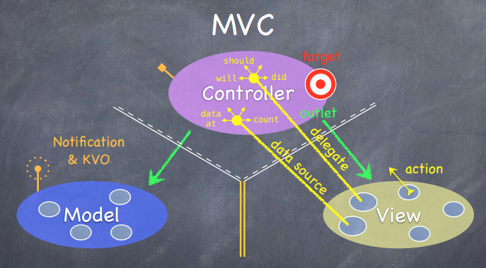
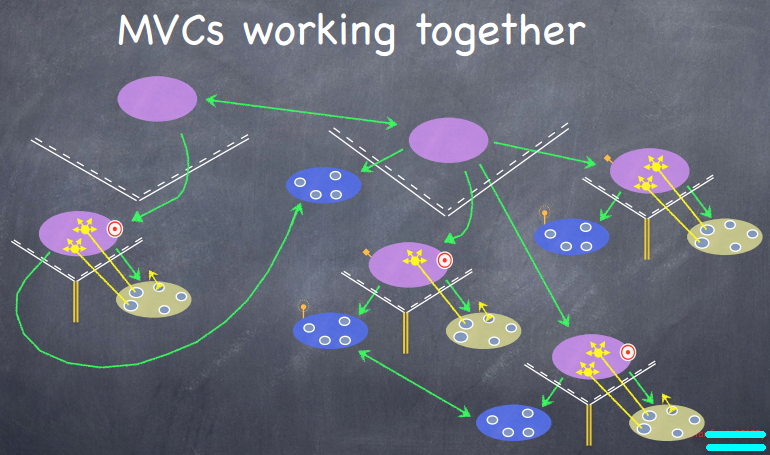
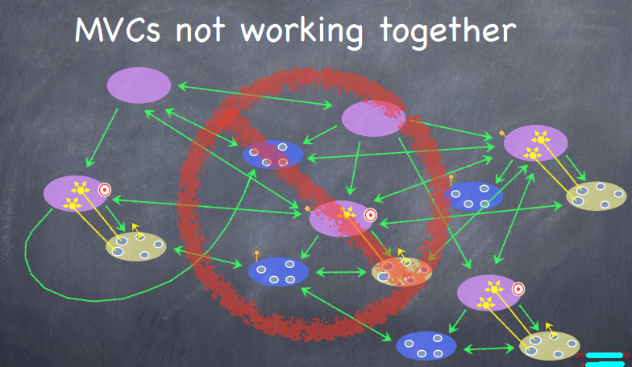

[MVC][3] 的概念其实都已经听到耳朵起茧了，不过最近看了斯坦福的iOS开发公开课，还是觉得挺有收获的，所以再在这里总结一下。

##MVC都是些啥
###Model
`Model` 是 `What your application is(but not how it is desplayed)`，各种数据以及它们之间的逻辑等都是Model，Model是独立于UI的。

###Controller
`Controller` 是 `How your Model is presented to the user (UI logic)`，即UI逻辑，Controller来把Mode的数据和逻辑表达出来，绘制、展示到屏幕上。

###View
`View` 是 `Your Controller's minions`，是Controller要用到的各种基础性的UI元素（Genetic UI Element），是Controller表达Model数据和逻辑用到的工具。

总的来说，就是 `Controller` 用 `View` 来把 `Model` 表达到屏幕上。

##M、V、C之间如何对话
###Controller ---> Model (OK)
`Controller` 对相应的 `Model` 说话是很正常的。

###Controller ---> Vew (OK)
`Controller` 对相应的 `View` 说话也是很正常的。

###Model <---> View (Never)
`Model` 和 `View` 之间则永远不要对话！

###View ---> Controller (Limited)
`View` 一般不要对 `Controller` 直接说话。但有时候，确实有这个需要，所以有以下几种方式让`View`对`Controller`说话：

- action - target
	
	Controller 在自己上面放了 target 明确告诉 View 的 action 去和这个 target 对话。比如一个 button 的 touch 动作触发时去告诉 Controller 的 target 这个 action，让 Controller 在这个 action 中做点什么。其实 View 这时候是不知道关于这个 target 背后的这个 Controller 的任何信息的。所以

	It is a blind, simple, structured way for the view to communicate with the controller.

- delegate
	
	View 和 Controller 对话还有更复杂的方式，比如当一个 ScrollView 被滑动了，滑动停止时，View 需要告诉 Controller 滑动停止了，像我们常见的 will，should，did 类的方法，它们就是在 Controller 里设置了代理 Delegate 去响应这些消息，对 View 来说，它也不知道 Controller 的具体信息，它只是知道 Controller 能响应它的那些 will，should，did 类的消息。要使用 Delegate 模式，就涉及到 protocal。

	A protocal is a blind way to talk to another object.

- datasource
	
	View 不持有它所显示的数据，这些数据应该是属于 Model 的。View 常常通过 datasource 来询问数据，它通常会向 datasource 询问 count，data at * index 之类的消息，其实 datasource 就是另一种 delegate，很明显 Controller 应该作为 View 的 datasource delegate，而不是 Model。当 View 询问数据相关的消息时，Controller 则先去询问 Model 然后再作为 datasource delegate 来响应 View。

	Data source is just a kind of delegate, it's a specific kind of delegate for getting data.

###Model ---> Controller (Limited)
`Model` 一般也不要对 `Controller` 直接对话。但有时候也有需求，所以提供了一些机制来满足这些需求：

- Notification & KVO(Key Value Observing)

	有时候 Model 中的某些东西改变了，比如数据改变了、网络连通了等，它需要告诉 Controller。这时候我们用 "radio station"，类似广播机制去通知任何对这信息感兴趣的对象，这就是常用的 Notification(通知中心) & KVO(Key Value Observing，键值观察)。这就相当于 Model 在广播里吼 “我Model这某时某刻某些东东发生变动了，大家快来看啊！”，这时 Controller 就调到那个广播频道听到了，知道 Model 那某些东东发生变化了，然后它对此感兴趣就通过 Control--->Model 这个途径去 Model 那取那些发生变化的数据。

###MVC对话示意图

##一大波MVCs
通过组装很多个 MVCs 我们就能构建更复杂的程序。在这里面我们可能会用到分层式的 MVC 的概念，比如把一个 MVC 当做另一个 MVC 的 View 的一部分。原理其实都是一样的。

合理的多层 MVCs 结构应该如图：

不合理的则是这样的：

[SamirChen]: http://samirchen.com "SamirChen"
[1]: {{ page.url }} ({{ page.title }})
[2]: http://samirchen/mvc-in-ios
[3]: http://zh.wikipedia.org/wiki/MVC