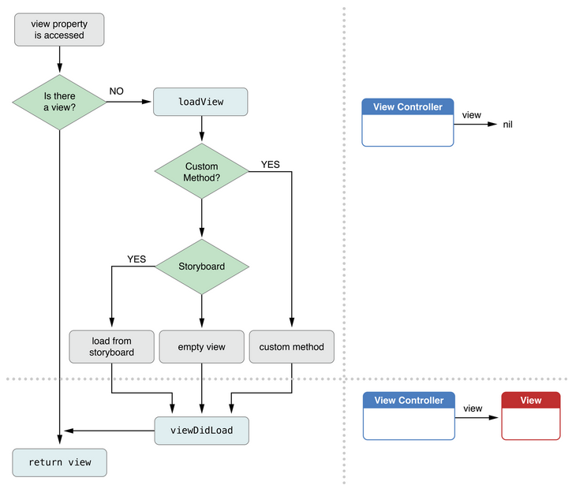
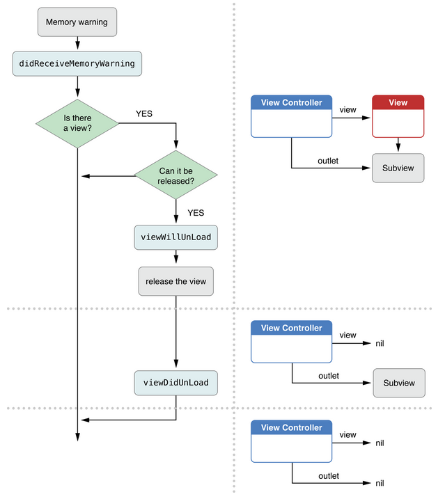

##引言
在 iOS 不断更新的过程中，很多东西也在变化。开发 App 时，最好尽量去拥抱这些变化，去及时跟进。有人喜欢使用原来的 Nib 的方式，有人喜欢纯代码的方式，我觉得在 iOS 7 中应该更积极地去使用 Storyboard。首先，如果能熟练掌握，确实能够更高效地开发；此外，由于苹果控制着这个生态环境，我们只能去积极适应，要不然等到旧的机制被完全抛弃再去更新成本就更高了。本文将要介绍的 View Controller Lifecycle 相关的内容，难免会有纰漏，欢迎大家批评指正，想要理解 View Controller Lifecycle 最好的办法就是自己去动手写代码验证。

在本文中，讨论 View Controller Lifecycle 会主要提到这些方法：

- [initWithNibName:bundle:][6]
- [awakeFromNib][4]
- [loadView][5]
- [viewDidLoad][7]
- [viewWillAppear][8]
- [viewDidAppear][14]
- [viewWillDisappear][13]
- [viewDidDisappear][15]
- [viewWillLayoutSubviews][11] 
- [viewDidLayoutSubviews][12]
- [didReceiveMemoryWarning][16]

##View Controller的初始化
当一个 View Controller 第一次被初始化的时候，它会`创建或者加载`它的生命周期中需要的对象。在这里不应该去创建它的 `view hierarchy` 或者跟显示内容相关的对象（这些东西应该在后面需要访问 View Controller 的 view 时再创建(`Lazy Initialization`)），而应该去创建跟数据相关的 `data objects` 以及需要实现其关键操作的对象。

几种初始化 View Controller 的方式:

- 从 Storyboard 中加载

	如果是从 Storyboard 中加载 View Controller，当 View Controller 被初始化的时候，`archive` （在 Storyboard 中用 Interface Builder 中创建的 View Controller 的各种属性会被序列化为归档文件（`archive`））会被加载到内存进行处理，这个过程是通过自动调用 View Controller 的 [initWithCoder:][3] 方法来实现的。
	
	App 启动时，首先自动加载其 rootViewController（`self.window.rootViewController`），这个过程是自动调用 [instantiateInitialViewController][10] 来完成的。此后 Storyboard 中 View Controller 之间的跳转是通过 segue，navigation 等机制来实现的。通常我们在 App 启动后，想要初始化 Storyboard 中其他的 View Controller 时，可以调用 [instantiateViewControllerWithIdentifier:][9]，比如：
	
	
		YourViewController *vc = [self.storyboard instantiateViewControllerWithIdentifier:@"Your_VC_Storyboard_ID"];
	
	[initWithNibName:bundle:][6] 方法是不会被调用的，不需要我们关注它。加载过程中，会去访问 View Controller 的 view 属性，这时会自动调用 [loadView][5]，在这种情况下我们不应该重载 [loadView][5]，所以也不需要我们关注它。
	
	这个 View Controller 的 [awakeFromNib][4] 方法，以及它的各个 SubViews 的 [awakeFromNib][4] 方法都会被调用。**接着，需要关注的是 View Controller 及其 Subviews 的 [awakeFromNib][4] 方法。**

- 从 Nib 文件中加载

	View Controller 指定的初始化方法是 [initWithNibName:bundle:][6]。 如果指定了该方法的 nib，那么会自动从对应的 nib 文件去加载 View Controller。比如：
	
		YourViewController *vc = [YourViewController initWithNibName:@"YourViewController" bundle:nil];
	
	加载过程中，会去访问 View Controller 的 view 属性，这时会自动调用 [loadView][5]，在这种情况下我们不应该重载 [loadView][5]，所以也不需要我们关注它。
	
	这个 View Controller 的 [awakeFromNib][4] 方法**不会**被调用，这个不需要我们关注，但是它的各个 SubViews 的 [awakeFromNib][4] 方法都会被调用。所以**接着，需要关注的是 View Controller 的 Subviews 的 [awakeFromNib][4] 方法。**

- 从代码中创建

	如果你使用指定的初始化方法 [initWithNibName:bundle:][6] 并且传递两个参数为 nil，或者你自己定义 View Controller 的 `init` 类似的方法，这时需要在初始化方法中自己实现相关的代码，当然在这个方法中，你需要调用你的父类的 `init` 类似的方法。一般不要实现过于复杂的初始化方法，你只用提供出 View Controller 的相关属性让客户在后面调用时再配置它的行为即可。
	
	在这种情况下创建的 View Controller ，是不会自动调用 [awakeFromNib][4] 方法的，所以不需要我们关注它。但是，在这种情况下，我们通常需要去重载 [loadView][5] 方法，所以**接着需要关注的是 [loadView][5] 方法。**

##awakeFromNib
通过上一节的内容我们可以知道，如果是从 Storyboard 加载 View Controller，那么所有从 Storyboard 被创建出来的 View Controller 及其 Subviews 的 [awakeFromNib][4] 方法会在它们被加载完成并初始化后被调用；如果是用 [initWithNibName:bundle:][6] 方法从 Nib 文件中加载 View Controller，那么它的 Subviews 的 [awakeFromNib][4] 会在它们被加载完成并初始化后被调用。收到 [awakeFromNib][4] 消息的对象的所有 outlet 和 action connection 都已经在此时被确保建立起来了。

如果可以的话，我们可以把代码尽量放在后面的 [viewDidLoad][7] 或 [viewWillAppear][8] 方法中。不过，有时候我们还是需要在 [awakeFromNib][4] 中去写代码干一些在 [viewDidLoad][7] 之前必须要干的事。比如，在这里你可以设置一些用户自定义的控件的属性（如按钮的颜色、字体的大小、文本框的默认值等），还可以在这里载入控件的一些状态等。

注意，所有在 View Controller 的 `init` 类似方法中写的代码都需要在 [awakeFromNib][4] 里写一遍，因为如果我们从上面的内容可以知道 `init` 和 [awakeFromNib][4] 基本上是互斥的，自己 `init` 的话则不会调用 [awakeFromNib][4]，如果调用 [awakeFromNib][4] 则说明是从 Storyboard 加载的则不会调用 `init`。所以我们常用的代码范式是这样的：

	-(void)setup {
		// do something which can’ t wait until viewDidLoad
		// ...
	}

	-(void)awakeFromNib { 
		[super awakeFromNib];
		[self setup]; 
	} 
	
	// UIViewController’s designated initializer is initWithNibName:bundle:(ugh!) 这个是 UIViewController 指定的初始化方法
	-(instancetype)initWithNibName:(NSString *)name bundle:(NSBundle *)bundle 
	{ 
		self = [super initWithNibName:name bundle:bundle]; 
		if (self) {
			[self setup]; 
		}
		return self; 
	}

##loadView
永远不要直接调用该方法。

当代码访问 View Controller 的 view 时，如果 view 存在，是非 nil 的，那么会直接返回这个 view；如果 view 不存在于内存中，是 nil 的，那么 View Controller 会调用它的 [loadView][5] 方法来加载 `view hierarchy` 到内存并把对象赋值给 view。

通过上面的内容，我们可以知道如果是从 Storyboard 或 Nib 文件中加载 View Controller，我们都不要去重载 [loadView][5]，它会自动加载 view 属性以及它的各个 Subviews。只有当我们自己代码创建 View Controller 的时候，我们可能需要去重载 [loadView][5]。当然，如果我们不重载，那么默认情况下 [loadView][5] 会创建一个光秃秃的 UIView 对象赋给 view 属性。

如果选择重载 [loadView][5] 这个方法，这时候需要我们做如下几步：

- 必须要创建一个 `root view` 赋值给 View Controller 的 view 属性；
- 可以创建其他的 Subviews，并添加到 `root view` 中；
- 如果你使用 auto layout，可以在这里添加足够的 constraints。当然我们最好在 [viewWillLayoutSubviews][11] 和 [viewDidLayoutSubviews][12] 中去做这些工作。

在这里创建的各种 views 必须是独立唯一的实例，不能和其他的 View Controller 对象共享，在重载的代码中也不要去调用 super。当然，我们很少去重载这个方法。示例代码如下：

	-(void)loadView
	{
	    CGRect applicationFrame = [[UIScreen mainScreen] applicationFrame];
	    UIView* contentView = [[UIView alloc] initWithFrame:applicationFrame];
	    contentView.backgroundColor = [UIColor blackColor];
	    self.view = contentView;
	 
	    LevelView* levelView = [[LevelView alloc] initWithFrame:applicationFrame viewController:self];
	    [self.view addSubview:levelView];
	}

**接着往下，我们需要关注的就是 [viewDidLoad][7] 方法了。**

##viewDidLoad
在初始化 instantiation 和 outlet-setting 后，viewDidLoad 就会被调用。

	-(void) viewDidLoad {
	     [super viewDidLoad]; // 不要忘了 super。
	     // do some setup of my MVC
	}

但是要记住不要在 viewDidLoad 里设置跟 view 的几何特性相关的东西，比如 bounds。在这里，你还无法知道你的屏幕是 iPhone-5 还是 iPhone-4 或者 iPad。view 只会 `load` 一次，但是可能会 `appear & disappear` 很多次，所以在这里适合做一次性初始化的工作。 

说到这里，就提一句，在 Navigation Stack 中，一个个的 View Controller 被压栈或弹出栈，如果一个 View Controller 已经在栈中，它上面的别的 View Controller 被弹出，等它到栈顶的时候 viewDidLoad 是不会被调用的；如果它被弹出栈，下一次再被压栈的时候，[viewDidLoad][7] 会被调用。所以我们可以看到在 Navigation Stack 中新压入栈的 View Controller 会被 `load`，弹出栈的 View Controller 会被 `dealloc`。

##viewWillAppear & viewDidAppear
在 view 即将出现在屏幕时，[viewWillAppear][8] 会被调用。view 只会 `load` 一次，但是可能会 `appear & disappear` 很多次，所以放在 [viewWillAppear][8] 的代码会一次又一次的执行，这可能是不必要的。比如说一次性初始化的代码就不该放在这里。

如果当你的 MVC 在后台做了某些改变，且跟 View 的显示相关的话，可以在这里写对应的代码。我们还可以在这里优化代码，比如把比较耗时数据加载或网络连接的操作放到另外的线程里面去，而不是让代码在 [viewWillAppear][8] 里等待，这样界面就只能等耗时的数据加载或网络连接完成后才能出现了。我们可以把设置 View 的几何属性的代码（geometry-based initialization）放在这里，但是有更好的地方（[viewWillLayoutSubviews][11] 和 [viewDidLayoutSubviews][12]）。

[viewDidAppear][14] 没什么多说的，view 已经出现了后，调用这个方法。

##viewWillDisappear & viewDidDisappear

当 view 将要从屏幕消失时，会调用 [viewWillDisappear][13] 。

	-(void) viewWillDisappear:(BOOL)animated {
		[super viewWillDisappear:animated];  // call superin all the viewWill/Did... methods
		// let’s be nice to the user and remember the scroll position they were at ...
		[self rememberScrollPosition];  // we’ll have to implement this, of course
		// do some other clean up now that we’ve been removed from the screen
		[self saveDataToPermanentStore]; // maybe do in did instead?
		// but be careful not to do anything time-consuming here, or app will be sluggish
		// maybe even kick off a thread to do what needs doing here (again, we’ll cover threads later)
	}

在这里记住一些该记住的东西，持久化该持久化的数据。但是不要做一些太耗时的事情，可以把耗时的事情丢给别的线程做。

[viewDidDisappear][15] 没什么多说的，view 已经消失了后，调用这个方法。

##viewWillLayoutSubviews & viewDidLayoutSubviews
将在 view 的 frame 改变的时候被调用，它的 subviews 也会被 re-layed out。比如， autorotation 的时候。我们可以在这里设置 subviews 的 frame 或其他几何相关的属性。

很多时候，UI 几何改变可以很好的被 iOS 的 [Autolayout][17] 机制处理，但有些时候，一些 UI 几何改变的逻辑需要我们自己写代码去实现，这时候就需要考虑到这两个方法里去实现相关代码了。
在 [Autolayout][17] 机制被调用之前，[viewWillLayoutSubviews][11] 会被调用，在 Autolayout 机制被调用之后，[viewDidLayoutSubviews][12] 会被调用。即在 [viewWillLayoutSubviews][11] 和 [viewDidLayoutSubviews][12] 之间，[Autolayout][17] 机制会被调用。

##didReceiveMemoryWarning 

当在低内存的情况下，[didReceiveMemoryWarning][16] 会被调用。很少会发生这样的情况，但是，耗内存大的代码通常会用到这个方法。比如 图片、声音、视频等 相关的代码。所里在这里，所有能够 recreated 的大东东应该被释放掉，即 set strong pointer to nil。比如一个图片展示的应用，当前在屏幕上的图片当然不能被释放掉，但是可以用较小的图片去替代它，或者把当前不在屏幕显示范围里的图片给释放掉，等到要显示它们的时候再重新创建它们。

示例代码：

	-(void)didReceiveMemoryWarning {
	    [super didReceiveMemoryWarning];
	    // Add code to clean up any of your own resources that are no longer necessary.
	    if ([self.view window] == nil) {
	        // Add code to preserve data stored in the views that might be needed later.
	        // Add code to clean up other strong references to the view in the view hierarchy.

	        self.view = nil;
	    }
	}

等到下次 view 属性被访问的时候，view 会被重新加载。

##总结

我们再大概总结一下从 Storyboard 中加载 View Controller 所经历的过程：

	Instantiated
	
	awakeFromNib
	
	outlets get set
	
	viewDidLoad
	
	(when geometry is determined)
	viewWillLayoutSubviews and viewDidLayoutSubviews
	
	(next group can happen repeatedly as your MVC appears and disappears from the screen ...)
	viewWillAppear and viewDidAppear
		(whenever geometry changes again while visible, e.g. device rotation)
		viewWillLayoutSubviews and viewDidLayoutSubviews
		(if it is autorotation, then you also get will/didRotateTo/From messages--rare to use these)
	viewWillDisappear and viewDidDisappear
	
	(possibly if memory gets low ...)
	didReceiveMemoryWarning
	
	(there is no “unload” anymore, so that’s all there is) // 在iOS7中，没有 unload 方法了。

更多详情当然应该去参考[苹果的文档][99]了。

[SamirChen]: http://samirchen.com "SamirChen"
[1]: {{ page.url }} ({{ page.title }})
[2]: http://samirchen/view-controller-lifecycle-in-ios
[3]: https://developer.apple.com/library/ios/documentation/Cocoa/Reference/Foundation/Protocols/NSCoding_Protocol/Reference/Reference.html#//apple_ref/occ/intfm/NSCoding/initWithCoder:
[4]: https://developer.apple.com/library/ios/documentation/UIKit/Reference/NSObject_UIKitAdditions/Introduction/Introduction.html#//apple_ref/occ/instm/NSObject/awakeFromNib
[5]: https://developer.apple.com/library/ios/documentation/UIKit/Reference/UIViewController_Class/Reference/Reference.html#//apple_ref/occ/instm/UIViewController/loadView
[6]: https://developer.apple.com/library/ios/documentation/uikit/reference/UIViewController_Class/Reference/Reference.html#//apple_ref/occ/instm/UIViewController/initWithNibName:bundle:
[7]: https://developer.apple.com/library/ios/documentation/UIKit/Reference/UIViewController_Class/Reference/Reference.html#//apple_ref/occ/instm/UIViewController/viewDidLoad
[8]: https://developer.apple.com/library/ios/documentation/UIKit/Reference/UIViewController_Class/Reference/Reference.html#//apple_ref/occ/instm/UIViewController/viewWillAppear:
[9]: https://developer.apple.com/library/ios/documentation/UIKit/Reference/UIStoryboard_Class/Reference/Reference.html#//apple_ref/occ/instm/UIStoryboard/instantiateViewControllerWithIdentifier:
[10]: https://developer.apple.com/library/ios/documentation/UIKit/Reference/UIStoryboard_Class/Reference/Reference.html#//apple_ref/occ/instm/UIStoryboard/instantiateInitialViewController
[11]: https://developer.apple.com/library/ios/documentation/UIKit/Reference/UIViewController_Class/Reference/Reference.html#//apple_ref/occ/instm/UIViewController/viewWillLayoutSubviews
[12]: https://developer.apple.com/library/ios/documentation/UIKit/Reference/UIViewController_Class/Reference/Reference.html#//apple_ref/occ/instm/UIViewController/viewDidLayoutSubviews
[13]: https://developer.apple.com/library/ios/documentation/UIKit/Reference/UIViewController_Class/Reference/Reference.html#//apple_ref/occ/instm/UIViewController/viewWillDisappear:
[14]: https://developer.apple.com/library/ios/documentation/UIKit/Reference/UIViewController_Class/Reference/Reference.html#//apple_ref/occ/instm/UIViewController/viewDidAppear:
[15]: https://developer.apple.com/library/ios/documentation/UIKit/Reference/UIViewController_Class/Reference/Reference.html#//apple_ref/occ/instm/UIViewController/viewDidDisappear:
[16]: https://developer.apple.com/library/ios/documentation/UIKit/Reference/UIViewController_Class/Reference/Reference.html#//apple_ref/occ/instm/UIViewController/didReceiveMemoryWarning
[17]: https://developer.apple.com/library/ios/documentation/UserExperience/Conceptual/AutolayoutPG/Introduction/Introduction.html
[99]: https://developer.apple.com/library/ios/featuredarticles/ViewControllerPGforiPhoneOS/ViewLoadingandUnloading/ViewLoadingandUnloading.html