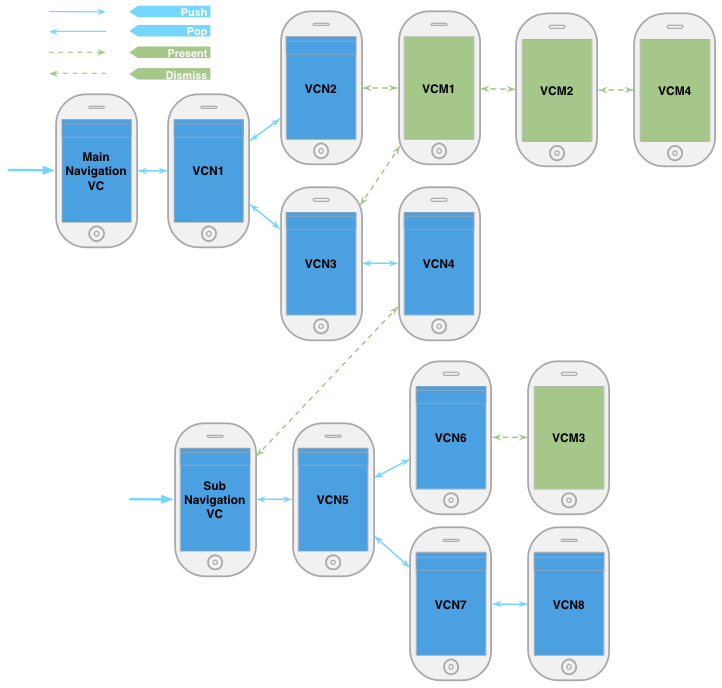

## 引言

自己学着做[iOS][2]开发其实有一段时间了，还记得当初第一次在[Xcode][3]中写 `Hello, iOS!` 的时候，就开始在想[iOS][2]中页面之间的跳转和传参该如何控制的事情了。从那时候开始，由于急冲冲地上手没读多少[Apple][4]的官方文档，尝试过不少“野路子”，其中用的挺多的方式包括：自己定义一个中心的 VC(View Controller) 来通过 `[ControlVC.view addSubview:OtherVC.view]` 的方式管理所有其他的 VC 的之间的跳转，这样很灵活，但是也会带来很多的问题。后来随着不断在项目中的实践，以及对[iOS][2]和[Xcode][3]的更深入的了解，最终我总结了一套能够比较优雅地（自认为的，求拍砖，求讨论^_^）实现整个项目页面跳转和传参的方式。当然，从本文的题目就能看出，这里所有的页面跳转和传参都是纯代码管理的，这和使用[Storyboard][5]还是是有一些区别的，关于基于[Storyboard][5]来实现页面跳转和传参的方式多是基于[Segue][6]来实现的，我会在稍后再加以总结，敬请关注。

## 页面流

话不多说，先上图：

一个手机上的app，通常会有多个页面，我们从页面A跳转到页面B，再从页面B跳到页面C，然后我们从页面C跳回到B，或者直接从页面C跳回到页面A，这些跳转，就是我们页面流的逻辑。看看上面的图，可以知道，我们这里主要讨论的是[iOS][2]中基于 [`Navigation方式`][7] `+` [`Modal方式`][8] 的页面流逻辑。

那么什么是 [`Navigation式`][7] 的跳转？什么又是 [`Modal式`][8] 的跳转呢？

- [`Navigation式`][7] 的跳转就是上图中蓝色的实线箭头所表示的跳转方式，它所推动的整个视图流就如同一个树状结构，非常清晰，多用于主干视图的展现。[iOS][2] 在管理它们时用到了 [`UINavigationController`][7]，其机制就如同`栈`一样。在图中所有被 [`Navigation式`][7] 地管理着的 View Controller 我都把背景标为了蓝色。
- [`Modal式`][8] 的跳转就是上图中绿色的虚线箭头所表示的跳转方式，它多用于场景式的视图的展现，所以作为 [`Modal`][8] 跳转的目的 VC 通常是用于展示数据的视图或者功能性视图等等，这样的视图可能会在主干中的多种情况下被调用，就比如图中的 VCM1 被 VCN2 和 VCN3 都用到了。在我们实际使用中，通常拍照页面对应的VC就会被用作是[`Modal式`][8]的。在图中所有被 [`Modal式`][8] 地管理着的 View Controller 我都把背景标为了绿色。

在我们上图的结构中，其实做的稍微复杂了一些，是想在这里覆盖多一点的应用场景。比如在上面，我们就用到了两个 Navigation式页面流，一个是 `MainNavigationVC`，一个是 `SubNavigationVC`，其中后者是从前者的 VCN4 作为一个 Modal 式的分支创建出来的。所以可以看到，在一个应用内还能用 Modal 的形式把不同的 Navigation式页面流 连接起来，这对于分模块开发会有一些帮助，此外，如果 MainNavigation 这一主干的页面流都是用纯代码写的，就算 SubNavigation 这一分支的页面流用 [Storyboard][5] 来实现，他们也可以这样衔接起来。

## 页面之间的跳转与传参

了解了[`Navigation方式`][7] 和 [`Modal方式`][8]，接下来就看看它们具体对应的代码是怎样的。

### NavigationController的初始化

在图中，我们的入口是先创建一个 `UINavigationController`，并把它的初始VC设置为 VCN1，同时可以在这里传参，代码如下：

	// 在 AppDelegate.m 中
	- (BOOL)application:(UIApplication *)application didFinishLaunchingWithOptions:(NSDictionary *)launchOptions
	{
    	VCN1* vcn1 = [[VCN1 alloc] init];
    	vcn1.stringPara = @"value"; // 传参
    	UINavigationController* mainNavigationController = [[UINavigationController alloc] initWithRootViewController:vcn1];
    	[mainNavigationController setNavigationBarHidden:YES];
    	[self.window setRootViewController:mainNavigationController];
    	self.window.backgroundColor = [UIColor whiteColor];
    	[self.window makeKeyAndVisible];
    
    	return YES;
	}

### Navigation-Push

在图中，蓝色实线正向的箭头就表示的是 Navigation 的 Push 动作，比如：VCN1->VCN2; VCN1->VCN3->VCN4; VCN5->VCN6; VCN5->VCN7->VCN8 等跳转。一般来说，我们都是一级一级往前Push的，不应该有 VCN1->VCN4 这样的正向跳跃式Push的需求，要不然图就不这样画了，页面流就不这样设计了。在Push动作中传参是非常简单直接的，因为你这里创建了你要跳达的VC，直接设置其参数属性就可以了。

例如，VCN1->VCN2 的跳转代码

	// 在 VCN1.m 中
	-(void) goVCN2:(id)sender {
		VCN2* vcn2 = [[VCN2 alloc] init];
		vcn2.stringPara = @"value"; // 传参
		[self.navigationController pushViewController:vcn2 animated:YES]; // 这里的self.navigationController就是MainNavigationController。
	}

在做了以上Push后，VCN2 就会被`压到由MainNavigationController管理的栈的栈顶`。这个栈就是 `self.navigationController.viewControllers`。

Push动作是很简单的，基本上所有的Push代码都类似上面这样写。

### Navigation-Pop

在图中，蓝色实线反向的箭头就表示的是 Navigation 的 Pop 动作，比如：VCN2->VCN1; VCN4->VCN3 等跳转，Pop的跳转需求相对Push就复杂一点了，因为我们还可能有类似 VCN4->VCN1; VCN8->VCN5 这样的反向跳跃式Pop的需求，这种需求是合理的。比如：我们由“设置页面”进入“登陆页面”，由“登陆页面”进入“注册页面”，等注册完成了，我们想从“注册页面”直接跳回“登陆页面”这是合理的。所以这里Pop动作就分为：

- 1）逐级Pop

逐级Pop是很简单，但是要往回传参就没Push那样方便了，你需要去 `self.navigationController.viewControllers` 中去找到你要跳达的VC，然后设置其参数。例如，VCN2->VCN1 的跳转代码
	
	// 在 VCN2.m 中
	-(void) back:(id)sender {
		if ([[self.navigationController.viewControllers lastObject] isKindOfClass:[VCN1 class]]) {
        	VCN1* vcn1 = (VCN1*) [self.navigationController.viewControllers lastObject];
        	vcn1.stringPara = @"value"; // 传参
    	}
    	[self.navigationController popViewControllerAnimated:YES];
	}

做了以上的Pop后，VCN2 就会被弹出由MainNavigationController管理的栈。

- 2）跳跃式Pop

要完成跳跃式Pop，可以去遍历 `self.navigationController.viewControllers` 找到你想跳达的页面，然后Pop过去就可以了，传参也在这时设置即可。例如，VCN4->VCN1 的跳转代码

	// 在 VCN4.m 中
	-(void) backToVCN1:(id)sender {
		// 这里要稍微复杂一点
		for (UIViewController* vc in self.navigationController.viewControllers) {
        	if ([vc isKindOfClass:[VCN1 class]]) {
        		vcn1.stringPara = @"value"; // 传参
            	[self.navigationController popToViewController:vc animated:YES];
        	}
    	}
	}

做了以上的跳跃式Pop后，`self.navigationController.viewControllers` 这个栈中所有在 VCN1 上面的 VC 都会被弹出。通过这种方式，可以跳到栈中任意的页面。

如果你想直接回到栈底，比如在我们的图中 VCN4->VCN1 就是回到栈底的情况，你还可以这样做：

	// 在 VCN4.m 中
	-(void) backToVCN1:(id)sender {
		if ([[self.navigationController.viewControllers firstObject] isKindOfClass:[VCN1 class]]) {
        	VCN1* vcn1 = (VCN1*) [self.navigationController.viewControllers firstObject];
        	vcn1.stringPara = @"value"; // 传参
    	}
		[self.navigationController popToRootViewControllerAnimated:YES];
	}

### Modal-Present

在图中，绿色虚线正向的箭头就表示的是 Modal 的 Present 动作，比如：VCN2->VCM1; VCM1->VCM2; VCN4->VCN5; VCN6->VCM3 等跳转。Present 也是一级一级往前的。在Present动作中传参，也跟Push类似，因为在这里你要创建你想要展示的页面，这时候设置其参数属性即可。但是在我们的图中出现了几种不同Present的情况：

- 1）Navigation页面流中的某个页面Present一个Modal的页面

例如，VCN2->VCM1 的跳转代码：

	// 在 VCN2.m 中
	-(void) goVCM1:(id)sender {
		VCM1* vcm1 = [[VCM1 alloc] init];
    	[vcm1 setModalTransitionStyle:UIModalTransitionStyleCoverVertical];
    	vcm1.stringPara = @"value"; // 传参
    	[self.navigationController presentViewController:vcm1 animated:YES completion:nil]; // Present modal vc, not pop. 这里用 self.navigationController present 和 用 self present 的效果都是一样的。但是倾向与用前者，后面说明为什么。
    }

- 2）一个Modal的页面Present另一个Modal的页面

例如，VCM1->VCM2 的跳转代码：
    
    // 在 VCM1.m 中
    -(void) goVCM2:(id)sender {
		VCM2* vcm2 = [[VCM2 alloc] init];
    	[vcm2 setModalTransitionStyle:UIModalTransitionStyleCoverVertical];
    	vcm2.stringPara = @"value"; // 传参
    	[self presentViewController:vcm2 animated:YES completion:nil]; // Present modal vc, not pop. 这里只能用 self present 了。
    }

- 3）一个Navigation页面流中的某个页面Present另一个Navigation页面流

这个过程其实就是再创建一个`UINavigationController`，指定它的 root vc，然后 Present 出来即可，但是注意这里Present的是这个新创建的 `UINavigationController`。

例如，VCN4->SubNavigationVC.VCN5 的跳转代码：

	// 在 VCN4.m 中
	-(void) goSubNavigationVC:(id)sender {
		VCN5* vcn5 = [[VCN5 alloc] init]; // 这个是 subNavigationController 的 root vc。
		vcn5.stringPara = @"value"; // 传参
    	UINavigationController* subNavigationController = [[UINavigationController alloc] initWithRootViewController:vcn5];
    	subNavigationController.navigationBarHidden = YES;
    	[self.navigationController presentViewController:subNavigationController animated:YES completion:nil]; // 这里 present 的是 subNavigationController。
    }

### Modal-Dismiss

在图中，绿色虚线反向的箭头就表示的是 Modal 的 Dismiss 动作，比如：VCM1->VCN2; VCM2->VCM1; VCM3->VCN6 等跳转。Dismiss 这个动作其实写起来是很简单的，但是想要往回传参通常就会复杂一点了，尤其是在不同的情况下。这里的关键点就在于搞清楚当前所在VC的 [presentingViewController][9] 这个属性到底指向着谁。

在[Apple][4] 的官方文档里是这样说明这个属性的：

> presentingViewController
> 
> The view controller that presented this view controller. (read-only)
> 
> @property(nonatomic, readonly) UIViewController *presentingViewController

>Discussion

>If the view controller that received this message is presented by another view controller, this property holds the view controller that is presenting it. If the view controller is not presented, but one of its ancestors is being presented, this property holds the view controller presenting the nearest ancestor. If neither the view controller nor any of its ancestors are being presented, this property holds nil.

也就是说，当前的VC1如果是被另一个VC2给Present出来的，那么VC1中`self.presentingViewController`就是VC2。如果当前的VC1不是被谁Present出来的，但是VC1的某个`祖先VC`是被另一个VC给Present出来的，那么VC1中`self.presentingViewController`就是Present当前这个VC1的最近的祖先的那个VC。

那么下面，我们就根据`self.presentingViewController`这个属性含义，结合我们图中的几种情况做一下具体的说明：

- 1）Navigation页面流中的某个页面Present一个Modal的页面后Dismiss

在 VCM1->VCN2 这种情况下，在VCM1中，`self.presentingViewController`是谁呢？一般，我们会认为是 VCN2，但事实上不是VCN2 而是 MainNavigationVC，这是很容易弄错的地方。所以这里想要传参回去的话，就要去 MainNavigationVC 的 viewContollers 栈中找到 VCN2，设置其参数属性。这里就要提到我们在上面介绍 `Modal-Present` 的时候提到的 VCN2->VCM1 的跳转代码，在那段代码里我们是用 `self.navigationController present...`，其实这里不管用 `self.navigationController present...` 还是用 `self present...`，到VCM1后，VCM1的`presentingViewController`都是MainNavigationVC，所以我们选择写清楚点，用前者。

VCM1->VCN2 的跳转代码：

	// 在 VCM1.m 中
	-(void) back:(id)sender {
		// self.presentingViewController是MainNavigationVC
		if ([self.presentingViewController isKindOfClass:[UINavigationController class]]) {
        	UINavigationController* mainNavigationController = (UINavigationController*) self.presentingViewController;
        	if ([[mainNavigationController.viewControllers lastObject] isKindOfClass:[VCN2 class]]) {
            	VCN2* vcn2 = (VCN2*) [mainNavigationController.viewControllers lastObject];
            	vcn2.stringPara = @"value"; // 传参
        	}
    	}
		[self.presentingViewController dismissViewControllerAnimated:YES completion:nil];
	}

在我们的图中还有 VCM3->VCN6 这种场景，那么 VCM3 的 `presentingViewController` 应该是 SubNavigationVC。

- 2）一个Modal的页面Present另一个Modal的页面后Dismiss

在 VCM2->VCM1 这种情况下，VCM1是被VCM2Present出来的，所以VCM2 的 `presentingViewController` 就是 VCM1，所以跳转代码如下：

	// 在 VCM2.m 中
	-(void) back:(id)sender {
		if ([self.presentingViewController isKindOfClass:[VCM1 class]]) {
			VCM1* vcm1 = (VCM1*) [self.presentingViewController isKindOfClass:[VCM1 class]];
			vcm1.stringPara = @"value"; // 传参
		}
		[self.presentingViewController dismissViewControllerAnimated:YES completion:nil];
	}

如果我们Present了多层的Modal式VC，而我们想直接跳跃式地Dismiss返回，比如：VCM4->VCM1 这种情况，VCM4 的 `presentingViewController` 是 VCM2，而 VCM2 的 `presentingViewController` 是 VCM1，所以 VCM4->VCM1 的跳转代码：

	// 在 VCM4.m 中
	-(void) backToVCM1:(id)sender {
		if ([self.presentingViewController.presentingViewController isKindOfClass:[VCM1 class]]) {
			VCM1* vcm1 = (VCM1*) [self.presentingViewController.presentingViewController isKindOfClass:[VCM1 class]];
			vcm1.stringPara = @"value"; // 传参
		}
		[self.presentingViewController.presentingViewController dismissViewControllerAnimated:YES completion:nil];
	}

这样写其实是比较不美观的，尤其是当层次更多更深的时候，如果真有那种情况，那就建议把多层次的Modal式页面流直接改成Navigation式管理更好。

- 3）一个Navigation页面流中的某个页面Present另一个Navigation页面流后Dismiss

在 SubNavigationVC.VCN5->VCN4 的情况下，VCN5 其实不是被谁Present出来的，但是它的`父VC(self.parentViewController)`是SubNavigationVC，而SubNavigationVC是被MainNavigationVC给Prsent出来的，所以VCN5的`presentingViewController`就是MainNavigationVC。

SubNavigationVC.VCN5->VCN4 的跳转代码：

	// 在 VCN5.m 中
	-(void) back:(id)sender {
		// self.presentingViewController是MainNavigationVC
		if ([self.presentingViewController isKindOfClass:[UINavigationController class]]) {
        	UINavigationController* mainNavigationController = (UINavigationController*) self.presentingViewController;
        	if ([[mainNavigationController.viewControllers lastObject] isKindOfClass:[VCN4 class]]) {
            	VCN4* vcn4 = (VCN2*) [mainNavigationController.viewControllers lastObject];
            	vcn4.stringPara = @"value"; // 传参
        	}
    	}
		[self.presentingViewController dismissViewControllerAnimated:YES completion:nil];
	}

其实所有由SubNavigationVC管理的这些VC(包括VCN5，VCN6，VCN7，VCN8)的`presentingViewController`都是MainNavigationVC。所以我们可以直接从这些VC中任意一个直接跳到MainNavigationVC的栈顶的VCN4页面。

## 其他页面跳转和传参方式

除了上面所讲的 `Navigation方式+Modal方式` 的页面流逻辑，其实还可以用到：

- `TabBar方式` 的页面流逻辑。需要注意的是我们可以把 `UINavigationController` 嵌入到 `UITabBarController` 中，但是反过来是不行的。

此外为了达到反向页面跳转时的传参，我们还可以使用下列机制：

- Delegate机制
- 广播机制，即设置Observer来监听Notifications

## 小结

上面说了这么多，其实总结起来也就是需要注意这几点：

- `Navigation方式+Modal方式` 的页面流逻辑其实已经能够满足我们大多时候的使用场景，如果你发现仍然不能满足，那建议首先考虑考虑项目的视图流的设计是不是合理。
- `Navigation`式的跳转只要牢牢盯住所在 VC 的 `self.navigationController`，理解其像栈一样管理页面流的方式，然后好好使用 `self.navigationController.viewControllers` 这个 `VC栈` 就好了。
- `Modal`式的跳转只要牢牢盯住所在 VC 的 `self.presentingViewController` 就好了，一定要搞清楚它是哪个，这里是很容易弄混而造成代码逻辑错误的。从`Navigation`页面流Present出来的`Modal`页面，这个`Modal`页面的`presentingViewController`是对应的的`UINavigationController`，而不是其中的那个具体的页面。

=== 文章完，转载请注明出处 ===

[SamirChen]: http://www.samirchen.com "SamirChen"
[1]: {{ page.url }} ({{ page.title }})
[2]: http://zh.wikipedia.org/zh-cn/IOS
[3]: http://zh.wikipedia.org/wiki/Xcode
[4]: http://www.apple.com
[5]: https://developer.apple.com/library/ios/documentation/general/conceptual/Devpedia-CocoaApp/Storyboard.html
[6]: https://developer.apple.com/library/ios/documentation/uikit/reference/UIStoryboardSegue_Class/Reference/Reference.html
[7]: https://developer.apple.com/library/ios/Documentation/UIKit/Reference/UINavigationController_Class/Reference/Reference.html
[8]: https://developer.apple.com/library/ios/featuredarticles/ViewControllerPGforiPhoneOS/ModalViewControllers/ModalViewControllers.html
[9]: http://www.samirchen.com/view-controller-flow-in-ios
[9]: https://developer.apple.com/library/ios/documentation/UIKit/Reference/UIViewController_Class/Reference/Reference.html#//apple_ref/occ/instp/UIViewController/presentedViewController