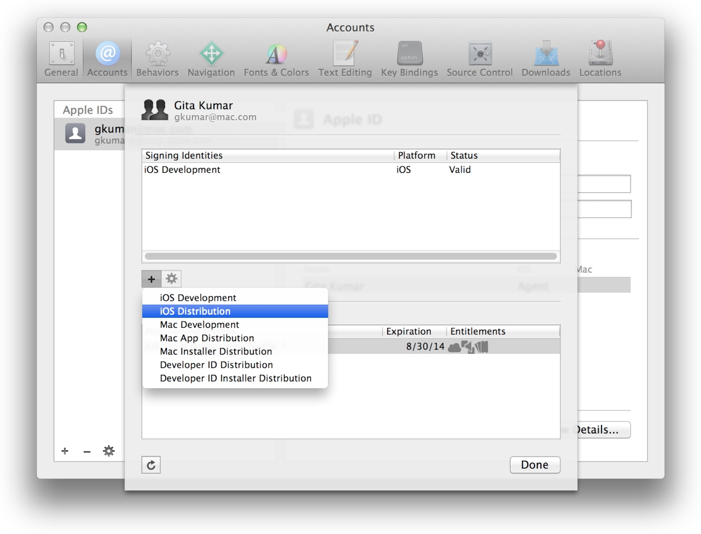

##公钥和私钥
先简单的介绍一下公钥和私钥。我们常见的加密算法有两类：对称加密算法(Symmetric Cryptographic Algorithm) 和 非对称加密算法(asymmetric cryptographic algorithm)。

对于对称加密算法，一般只有一个秘钥。通过这个秘钥对一份数据进行加密，那么有这个秘钥的人才可以用它解密这份数据。

对于非对称加密算法，一般有两个秘钥：公钥和私钥。比如你通过私钥对一份数据进行加密，那么收到这份加密过的数据的人，可以通过这个私钥对应的公钥对数据进行解密。这时他可以确认，这个数据是从你那来的（至少是你加密的）。这个私钥就相当于一个“签名”（你加的密，就是你签的字）。而这个就是iOS中Code Signing背后的原理。

##Certificates

###Intermediate Certificate
这个证书叫做 `Worldwide Developer Relations Certificate Authority`，通过这个链接可以下载：[https://developer.apple.com/certificationauthority/AppleWWDRCA.cer][4]，一般下载下来的文件名为：`AppleWWDRCA.cer`。

为了确保你能使用其他的 iOS 开发或者发布证书，你需要下载这个证书并双击打开，它会被存储在你电脑上的 `Keychain Access` 中。这个证书可以认为是类似于根证书的东西，用来确定你的 iOS 开发或发布的各种证书是与苹果的开发者关联的，而不是在别的什么地方生成的。通常情况下，这个证书是由 Xcode 自动安装的。

###iOS App Certificates
这里的证书一般都是 `.cer` 类型，分为 `Development` 和 `Distribution` 用途。一般在 Xcode 中制作即可：

当然，也可以手动制作。在苹果的 Certificates, Identifier & Profiles 网站上按照提示一步一步来：

To manually generate a Certificate, you need a Certificate Signing Request (CSR) file from your Mac. To create a CSR file, follow the instructions below to create one using Keychain Access.
Create a CSR file.
In the Applications folder on your Mac, open the Utilities folder and launch Keychain Access.

Within the Keychain Access drop down menu, select Keychain Access > Certificate Assistant > Request a Certificate from a Certificate Authority.

* In the Certificate Information window, enter the following information:
     - In the User Email Address field, enter your email address.
     - In the Common Name field, create a name for your private key (e.g., John Doe Dev Key).
     - The CA Email Address field should be left empty.
     - In the "Request is" group, select the "Saved to disk" option.
* Click Continue within Keychain Access to complete the CSR generating process.

大致步骤就是在自己的电脑上用 `Keychain Access` 生成一个 `Certificate Signing Request` 文件，这会在本地创建一对 公钥/私钥，按提示步骤上传文件，苹果接收这个文件后会验证信息，然后给你创建一个认证文件供你下载，这个文件就是 `.cer` 格式的。这时候你双击这个 `.cer` 文件，那么就可以在 `Keychain Access` 中打开，在 `Certificates` 选项栏中可以看到它是有私钥的，同时在 `Keys` 选项栏中可以看到对应的 私钥 和 公钥。

但是如果你删除掉 私钥 和 公钥，然后再双击那个 `.cer` 文件，就会发现此时在 `Keychain Access` 中打开，在 `Certificates` 选项栏中的这个证书没有私钥了。在其他的电脑上下载这个 `.cer` 文件也是同样的道理，都会没有对应的私钥，那是不能使用的。那怎么办呢？可以把私钥证书导出来传到别的电脑上双击打开即可，私钥证书一般是 `.p12` 格式的。

###APNs Certificates
这里的证书一般也是 `.cer` 类型的，要制作的话，按照苹果 Certificates, Identifier & Profiles 网站上的提示一步一步来做，跟上一节是一样的。

对于`Certificates`这块，需要注意的就是私钥证书(.p12)一定要保存好，这样当你换电脑开发或者多人开发的时候，只需要重新下载一下 `.cer` 文件，然后再双击导入一下 `.p12` 即可。

##Identifiers

###App ID
不多讲了，就是一个 App 对应一个 ID，通常是 com.company-name.app-name 的命名方式。

##Devices
在这里添加测试设备的 UDID。

##Provisioning Profiles
把前面的东西合起来：

* Certificates (开发者认证)
* App ID
* Device UDID

就是 `Provisioning Profile`。

`Provisioning Profile` 会通过 Xcode 或者 iTunes 导入到设备中，或者打包到一个的 `.ipa` 安装包文件中。

更多内容可以参考：
[证书相关文档][3]

[SamirChen]: http://samirchen.com "SamirChen"
[1]: {{ page.url }} {{ page.title }}
[2]: http://www.raywenderlich.com/2915/ios-code-signing-under-the-hood
[3]: https://developer.apple.com/library/ios/documentation/IDEs/Conceptual/AppDistributionGuide/MaintainingCertificates/MaintainingCertificates.html
[4]: https://developer.apple.com/certificationauthority/AppleWWDRCA.cer 
