##Quartz 2D与CTM
###Quartz 2D
####Quartz 2D简介
[Quartz 2D][4]是 iPhone OS 和 Mac OS X 环境下的二维绘图引擎。借用 Quartz 2D API，你可以接触到这样一些特性：基于路径的绘图，透明度绘图，遮盖，阴影，透明层，颜色管理，防锯齿渲染，生成 PDF，以及 PDF 元数据相关处理。可能的时候，Quartz 2D 会借助硬件的力量。

在 Mac OS X 下，Quartz 2D 能与其它图形图像技术相结合——Core Image，Core Video，OpenGL，以及Quick Time。

类似的，在 iPhone OS 下的 Quartz 2D 也能与其它的图像和动画技术相结合——Core Animation，OpenGL ES，以及 UIKit 类。

Quartz 2D 是二维画图引擎，使用画笔模型(painter’s model)，每次画图操作都是在画布(canvas)上添加一层，称之为页(Page)，后面画的页会覆盖前面画的页，所以要控制操作顺序。

####Graphics Context
[`graphics context`][5] 是 Quartz 2D 中一个十分重要的概念，它对应的数据结构即 `CGContextRef`，其中包含了Quartz 将图形绘制到输出设备（比如：PDF文件、bitmap、显示窗口）需要的信息。所有 Quartz 中的对象都是画到或是包含在 `graphics context` 中。

你可以认为 `graphics context` 是一个图形绘制的目的地，通过在 Quartz 图形绘制的那一套逻辑上提供不同的 graphics context 类型就可以将同样图像绘制到不同的输出设备，而一套图形绘制的逻辑是不用改变的，Quartz 会为你做好输出到不同的设备所需要的适配计算。

现有的 `graphics context`：

* Bitmap graphics context
* PDF graphics context
* Window graphics context 
* Layer context
* PostScript graphics contex

这些类型针对不同的输出目标而定，详细信息参见 [苹果文档：Drawing Destinations: The Graphics Context][5]。

####Quartz 2D Opaque Data Types
Quartz 2D API 在上面介绍的 graphics context 的基础上还添加了这些数据类型（Quartz 2D Opaque Data Types）：

* CGPathRef
* CGImageRef
* CGLayerRef
* CGPatternRef
* CGShadingRef and CGGradientRef
* CGFunctionRef
* CGColorRef and CGColorSpaceRef
* CGImageSourceRef and CGImageDestinationRef
* CGFontRef
* CGPDFDictionaryRef, CGPDFObjectRef, CGPDFPageRef, CGPDFStream, CGPDFStringRef, and CGPDFArrayRef
* CGPDFScannerRef and CGPDFContentStreamRef
* CGPSConverterRef

想要绘制不同的对象，则根据需求选择不同的 API 来使用，详细信息参见：[苹果文档：Quartz 2D Opaque Data Types][6]。

####Graphics State
Quartz 2D 是通过修改参数 **`current graphics state`** 来修改绘图操作的结果。`graphics context` 中用一个栈来管理 `graphics state`，当你用 Quartz 创建一个 `graphics context` 时，这个栈为空；当你调用 `CGContextSaveGState` 方法保存 `graphics state` 时，Quartz 会向栈内压入一个 **`current graphics state`** 的拷贝；当你调用 `CGContextRestoreGState` 方法来恢复 `graphics state` 时，Quartz 会从栈顶弹出一个 `graphics state` 来作为 **`current graphics state`**。

但是需要注意的是，并不是所有的当前绘图环境的参数都是 `graphics state` 的元素，比如 `current path` 就不是 `graphics state` 的一部分，因此即使你调用 `CGContextSaveGState` 也不会保存 `current path` 的信息。

详细信息参见 [苹果文档：Graphics State][7]。

####Quartz 2D Coordinate Systems
Quartz 2D 默认的坐标系是这样的，原点 (0, 0) 在左下角：

但并不是所有的API里都是使用相同的坐标系统，比如 UIKit 中图像绘制常用到的就是 `modified coordinate system` ，其原点 (0, 0) 在左下角：

####一些案例
`CGContextRef` 有很多种，其中一种为位图上下文（bitmap graphics context)，位图上下文可用于绘制彩色或灰度图像，其可使用 Quartz 本身 `CGBitmapContextCreate` 函数创建，也可使用高级UIKit框架中的方法创建。

* **在 UIView 的 `drawRect:` 方法中，UIView对象自动建立绘图环境**，使用UIKit框架的 `UIGraphicsGetCurrentContext` 方法即可获取当前的图形上下文。

* 需要创建图像时，可使用UIKit框架的 `UIGraphicsBeginImageContextWithOptions` 或 `UIGraphicsBeginImageContext` 方法创建图形上下文。

代码：

	UIGraphicsBeginImageContext(size);
	CGContextRef con = UIGraphicsGetCurrentContext();
	// 各种绘制操作...
	UIImage *replaceImage = UIGraphicsGetImageFromCurrentImageContext();
	UIGraphicsEndImageContext();

使用UIKit框架返回的 `CGContextRef` 与使用Quartz低级函数返回的 `CGContextRef` 坐标系不同，在Quartz坐标系中原点为左下角，而UIKit返回的 `CGContextRef` 使用的坐标系做了修改，称之为 `modified coordinate system`，修改后的坐标系原点为左上角，和UIKit其他操作所使用的坐标系相同。

**可见，UIKit的API和Quartz在一定程度上是打通的，但是他们使用的坐标系统又不一样，所以一定要搞清楚你使用的API是什么，所对应的绘图环境是什么。**

###CTM
由于不同的设备有着不同的图像处理能力和处理方式，所以图形的位置和大小必须独立于设备来定义---这就由`变换矩阵（CTM：current transform matrix`）来完成。CTM矩阵类型为仿射变换(CGAffineTransform)，可使用 `CGContextGetCTM` 获取当前图形上下文的仿射变换，也可用`CGContextConcatCTM` 将参数中的 CGAffineTransform 应用于图形上下文。

为了实现图形位置和大小相对设备的独立， Quartz 2D 绘图模型的设计了两种空间：`用户空间(user space)`和`设备空间(device space)`。用户空间表示当前需绘制的文档页(document page)，设备空间表示原始分辨率的设备。设备空间与用户空间的概念，可理解为两张纸，设备空间为一张纸，固定着不动，代表着屏幕；用户空间也是一张纸，实际绘图在用户空间这张纸上画，但最终需要贴到设备空间那张纸上，怎么贴就是CTM描述的问题，我可能将用户空间的纸平移一些距离再贴，也可能放大缩小一些再贴，也可能旋转一定的角度再贴。用户空间的纸对应与绘画过程中的每一page,不同的page可能用不同的用户空间，即每次绘制时的CTM可能都不一样。

Quartz 2D使用变换矩阵CTM将用户空间映射到设备空间。CTM存储在图形上下文(graphics context)中，初始值为identity matrix。在绘制过程中可进行修改。

修改当前CTM的API有：

* CGContextRotateCTM，用于旋转
* CGContextScaleCTM，用于缩放
* CGContextTranslateCTM，用于平移

使用上面的API的时候，需要注意：

**rotate 是以原点为中心旋转，Quartz 创建的图形上下文旋转中心为左下角，角度值正数为逆时针旋转，负数为顺时针旋转；而UIKit 创建的图像上下文旋转中心为左上角，角度值正数为顺时针旋转，负数为逆时针旋转。**

代码：

	- (void)drawRect:(CGRect)rect {
		// Drawing code
		CGContextRef context = UIGraphicsGetCurrentContext(); // 用UIKit的API，旋转中心为左上角
		CGContextTranslateCTM(context, 60, 140); // Translate
		CGContextScaleCTM(context, 0.5, 0.5); // Scale
		CGContextRotateCTM(context,radians(60)); // Rotate
		[[UIColor blackColor] setStroke];
		[[UIColor blueColor] setFill];
		UIBezierPath *path = [UIBezierPath bezierPathWithRect:CGRectMake(0,0,200,200)];
		[path fill];
		[path stroke];
	}

##UIView的变换

###UIView的bounds、frame和center属性
UIView 中有 3 个跟其位置和尺寸相关的属性：

* `@property CGRect bounds;`  // your view’s internal drawing space’s origin and size

	- The bounds property is what you use inside your view’s own implementation.
It is up to your implementation as to how to interpret the meaning of bounds.origin.
bounds 这个属性是 UIView 自己内部的实际边界。在自己的坐标系统内，99%的情况下都是从origin为 (0, 0) 作为起始位置，当然你也可以自己定义这个origin不为 (0, 0)，你可以自己来解释它。

* `@property CGPoint center;`  // the center of your view in your superview’s coordinate space

	- center 这个属性是指 UIView 在其 superview 的坐标系统中的中心位置。

* `@property CGRect frame;`  // a rectangle in your superview’s coordinate space which entirely contains your view’s bounds.size

	- frame 这个属性是指在 UIView 的 superview 的坐标系统中能完整覆盖这个 UIView 的 bounds 的矩形区域。
	
我们通常用center和frame属性来改变view的位置和大小，但是如果你只是想改变view的位置时，最好坚持用center而不是frame，因为center会是一直有效的，而frame只有当view的transform是identity transform时才有效。我们主要在绘图的时候使用bounds，因为bounds表示的是view自己的坐标系统，初始化的bounds是大小等于frame的大小。

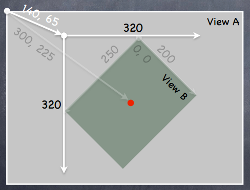

看着上图，对照一下就很清楚了

View B’s bounds= ((0,0),(200,250))

View B’s frame= ((140,65),(320,320))

View B’s center= (300,225)

View B’s middle in its own coordinate space is (bound.size.width/2+bounds.origin.x, bounds.size.height/2+bounds.origin.y) which is (100,125) in this case.

**尤其需要注意的一点是**，对于 UIView 的 `frame` 属性，苹果文档中可以看到这样一些描述：

> // If the transform property is not the identity transform, the value of this property is undefined and therefore should be ignored.
> 
> // animatable. do not use frame if view is transformed since it will not correctly reflect the actual location of the view. use bounds + center instead.

即说明当 view 的 `transform` 属性值不是 **identify transform**，即 

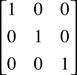

时，那么 `frame` 属性的值是 **undefined** 的，不要使用它，所以不要在对 view 进行 transform 后使用 `frame`，因为它不能正确的反映出 view 的真实尺寸和位置，这里应该用 `bounds`+`center` 属性来调整其尺寸和位置。此外，`frame` 属性是 animatable 的，也就是说，对这个属性的改变是可以用动画效果展示的，但是依然要遵循前面的原则，transform 后不要使用它。

###UIView的transform
UIView 的 `transform` 属性就是一个 CGAffineTransform 类型的数据，

	@property (nonatomic) CGAffineTransform transform;

初始默认值是 CGAffineTransformIdentify，即：

**需要注意的是，UIView 的 `transform` 表示的是 UIView 的图形变换的数据结构，其变换的原点是该 UIView 的 `center` （实际上是 UIView.`layer`.`anchorPoint`，默认是 {0.5, 0.5}, 即 UIView 的几何中心），这个跟 Quartz 的变换原点是不一样的。其变换的基础坐标系是该 UIView 自己的坐标系，而不是其 superView 的坐标系。对 UIView 进行图形变换的过程，其过程是对 UIView 的 `transform` 从 `CGAffineTransformIdentify` 开始进行累计计算的过程，至于 transform 是如何计算的，我们在下一节中将详细讨论。**

如果想要变换整个view，就改变view的transform。如果只改变view的特定部分，就在view的drawRect:方法中修改相关内容的affine transform。

你通常应该用transform这个属性来做动画效果，比如让view围绕它的中心点旋转等等。如果你想在view的superview的坐标系统中永久改变view的位置和大小，那么你应该去改变view的frame矩形而不是transform矩阵。

CGAffineTransform的用法：

	UIView* testView = [[UIView alloc] init];
	
	// Translate.
	CGFloat tx = 2.0;
	CGFloat ty = 3.0;
	CGAffineTransform translationTransform = CGAffineTransformTranslate(testView.transform, tx, ty);
	[testView setTransform:translationTransform];

	// Rotate.
	CGFloat r = 1.0;
    CGAffineTransform rotationTransform = CGAffineTransformRotate(testView.transform, r);
    [testView setTransform:rotationTransform];
	
	// Scale.
	CGFloat sx = 1.1;
	CGFloat sy = 1.2;
	CGAffineTransform scaleTransform = CGAffineTransformScale(testView.transform, sx, sy);
    [testView setTransform:scaleTransform];

上面的 `CGAffineTransformTranslate` `CGAffineTransformRotate` `CGAffineTransformScale` 方法分别是对 testView 进行移动、旋转和缩放。

**如上面所说是 transform 都是基于 view 自己的坐标系进行变换。**那么就可能会发生这样的情况：当把 viewA 添加到 viewB 中，对 viewA 进行 CGAffineTransformRotate 变换后，再对其进行 CGAffineTransformTranslate 变换的时候，其平移向量所在的坐标系是 viewA 的坐标系，而不是在 viewB 的坐标系，这时候如果你设置 viewA 的平移向量(tx, ty)时，需要想清楚这点。比如说，你将 viewA 旋转了180°，然后你调用代码：

	// Translate.
	CGFloat tx = 10.0;
	CGFloat ty = 10.0;
	CGAffineTransform translationTransform = CGAffineTransformTranslate(testView.transform, tx, ty);
	[testView setTransform:translationTransform];

这时候， viewA 会往其 viewB(viewA的superView) 的 (-x, -y) 方向移动，而不是 (x, y) 方向。因为之前 viewA 的坐标系旋转了 180°，跟 viewB 的坐标系翻了个个，完全反过来了。即 viewA 在自己的坐标系内的移动向量是 (10, 10)，而映射到 viewB 的坐标系其移动向量就是 (-10, -10)。

那么怎么去得到正确的平移向量呢？先看看下面这段代码：
	
	// In View Controller.
	// TestViewController.m
	
	// Property.
	@property (nonatomic, strong) UIView* testView;
	
	// Add testView ad subview.
	-(void) addView {
	    self.testView = [[UIView alloc] initWithFrame:CGRectMake(0, 0, 200, 100)];
	    [self.testView setBackgroundColor:[UIColor brownColor]];
	    UIPanGestureRecognizer* panRecognizer = [[UIPanGestureRecognizer alloc] initWithTarget:self action:@selector(pan:)];
	    panRecognizer.minimumNumberOfTouches = 1;
	    panRecognizer.maximumNumberOfTouches = 1;
	    [self.testView addGestureRecognizer:panRecognizer];
	    [self.view addSubview:self.testView];
	}
	
	// Translate testView.
	- (void)pan:(UIPanGestureRecognizer *)recognizer {
	    if ((recognizer.state == UIGestureRecognizerStateChanged) || (recognizer.state == UIGestureRecognizerStateEnded)) {
	        CGPoint translation = [recognizer translationInView:self.testView];
	        
	        CGAffineTransform translationTransform = CGAffineTransformTranslate(self.testView.transform, translation.x, translation.y);
	        [self.testView setTransform:translationTransform];
	        
	        [recognizer setTranslation:CGPointZero inView:self.testView]; // clean translation.
	    }
	}
	
	// Rotate testView.
	// ...
	
	// Scale testView.
	// ...
	
	// Go back.
	-(void) backToOrigin {
		[self.testView setTransform:CGAffineTransformIdentity];
	}

这里，`CGPoint translation = [recognizer translationInView:self.testView];` 我们是从 testView 中得到其 translation 的，所以用这个平移向量去计算 testView 的 transform 前后是一致的，这样得到的结果是我们想要的。另外，比较好玩的是，我们上面的 `backToOrigin` 方法，它会让 testView 直接回到原位置原大小，因为上面的变换代码都是基于 testView 的 transform 来变换的，这里把 testView 的 transform 值直接还原为默认值了，那就一切回到原始状态了。

对于 rotate 和 scale 也同样要想清楚。

[一个使用CGAffineTransform的Demo。][11]

###CGAffineTransform的理解

`CGAffineTransform` 的数据结构表示的是用于仿射变换的矩阵。详细内容可以参考：[苹果文档：CGAffineTransform][2]

	struct CGAffineTransform {
	   CGFloat a;
	   CGFloat b;
	   CGFloat c;
	   CGFloat d;
	   CGFloat tx;
	   CGFloat ty;
	};
	typedef struct CGAffineTransform CGAffineTransform;

它表示了如下的矩阵：

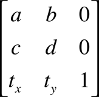

由于在该矩阵中，第三列将总是 `0 0 1`，所以 CGAffineTransform 数据结构只返回前两列的值。

一个点 (x, y) 经过一个仿射变换得到的点 (x', y') 的计算过程和计算表达式为：

下面介绍一下移动、旋转、缩放这几种图形变换本质对应的仿射变换过程。

####CGAffineTransformMakeTranslate

	CGAffineTransform CGAffineTransformMakeTranslation(CGFloat tx, CGFloat ty);

这个方法的参数 tx，ty 分别是在X轴和Y轴的移动位移。
CGAffineTransformMakeTranslation(tx, ty) 得到的矩阵是：

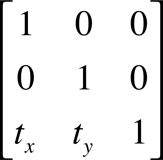

那么对 (x, y) 使用上面的变换后得到的结果 (x', y') 的计算表达式为：

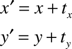

####CGAffineTransformMakeRotation

	CGAffineTransform CGAffineTransformMakeRotation(CGFloat angle);
	
这个方法的参数 angle 的单位是弧度。这个方法将对指定的 UIView 的坐标轴进行旋转。CGAffineTransformMakeRotation(a) 得到的矩阵是：

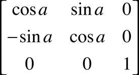

那么对 (x, y) 使用上面的变换后得到的结果 (x', y') 的计算表达式为：

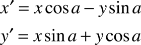

上面的计算过程可以很容易的用几何知识就行证明。参见：

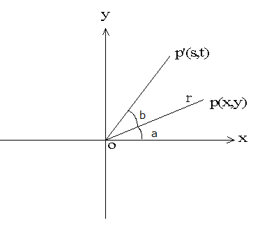

	s = r*cos(a + b) = r*cos(a)cos(b) – r*sin(a)sin(b)  (1.1)
	t = r*sin(a + b) = r*sin(a)cos(b) + r*cos(a)sin(b)  (1.2)
	其中 x = r*cos(a)  , y = r*sin(a)
	代入(1.1), (1.2)，得：
	s = x*cos(b) – y*sin(b)    (1.3)
	t = x*sin(b) + y*cos(b)    (1.4)
	
由于在 iOS 中的坐标系统是X轴正方向朝右，Y轴朝下，所以得到的计算表达式有所不同，但是证明的思路是一致的。

或者，把目标放在坐标轴上，即旋转坐标轴，然后计算同一个点在旋转前后坐标系里对应的坐标，那么我们也可以证明如下：

在原坐标系xoy中,  绕原点沿逆时针方向旋转θ度， 变成座标系 sot。
设有某点p，在原坐标系中的坐标为 (x, y)，旋转后的新坐标为(s, t)。

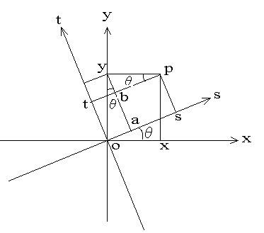

	oa = y*sin(θ)   (2.1)
	as = x*cos(θ)   (2.2)
	综合(2.1)，(2.2)，得：
	s = os = oa + as = x*cos(θ) + y*sin(θ) 
	t = ot = ay – ab = y*cos(θ) – x*sin(θ)

####CGAffineTransformMakeScale

	CGAffineTransform CGAffineTransformMakeScale(CGFloat sx, CGFloat sy);

这个方法的参数 sx，sy 分别是X轴和Y轴的缩放值。CGAffineTransformMakeScale(sx, sy) 得到的矩阵是：

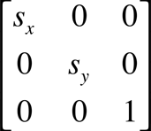

那么对 (x, y) 使用上面的变换后得到的结果 (x', y') 的计算表达式为：

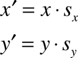

##CALayer的变换

###UIView的layer属性
在 iOS 中，我们经常接触到 CALayer 的地方可能就是它作为 UIView 的一个属性 `layer`。

In iOS, if the layer is associated with a UIView object, this property must be set to the view that owns the layer.
Because the view is the layer’s delegate, never make the view the delegate of another CALayer object. Additionally, never change the delegate of this layer object.

* 在 iOS 中，layer如果是和一个 UIView 对象绑定在一起的，那么 CALayer 的 delegate 属性必须设定为这个 UIView。
* 当UIView需要显示时，它内部的 layer 会准备好一个 CGContextRef(图形上下文)，然后调用delegate(这里就是UIView)的 `drawLayer:inContext:` 方法，并且传入已经准备好的CGContextRef对象。而UIView在 `drawLayer:inContext:` 方法中又会调用自己的`drawRect:` 方法。
* 平时在 `drawRect:` 中通过 `UIGraphicsGetCurrentContext()` 获取的就是由层传入的CGContextRef对象，在 `drawRect:` 中完成的所有绘图都会填入层的CGContextRef中，然后被拷贝至屏幕。
* 对比CALayer，UIView多了一个事件处理的功能。也就是说，CALayer不能处理用户的触摸事件，而UIView可以。所以，如果显示出来的东西需要跟用户进行交互的话，用UIView；如果不需要跟用户进行交互，用UIView或者CALayer都可以。当然，CALayer的性能会高一些，因为它少了事件处理的功能，更加轻量级。
* 如果两个UIView是父子关系，那么它们内部的CALayer也是父子关系。

###CALayer的frame、bounds、position和anchorPoint属性

####anchorPoint
CALayer 的 `anchorPoint` 属性值是用一种相对bounds的比例值来确定的，取值范围是 (0, 0) 到 (1, 1)。`anchorPoint` 主要的作用就是用来作为变换的支点，旋转就是一种变换，类似的还有平移、缩放。比如在下图中，`anchorPoint` 不一样，那么旋转的形态就不一样了。

图1
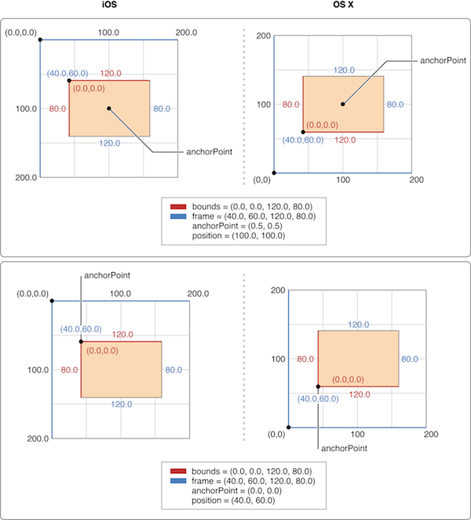

图2
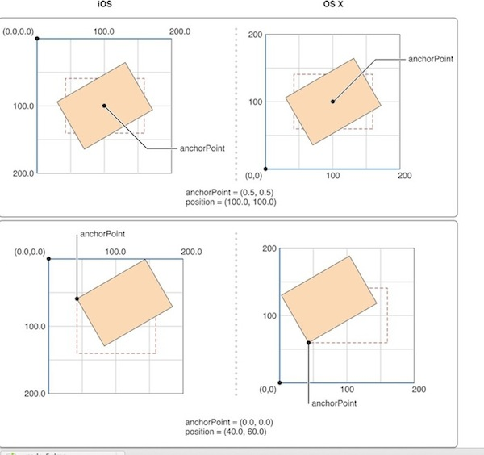

* 改变 `anchorPoint` 值会对 `frame.origin` 值产生影响。

####position
就像 UIView 有 superView 和 subView 一样，CALayer 也有 superLayer 和 layer。

CALayer 的 `position` 属性值其实是 CALayer 的 `anchorPoint` 点在其 `superLayer` 中的位置坐标。看看position的原始定义：`The layer’s position in its superlayer’s coordinate space.`中文可以理解成为 `position` 是 CALayer 相对 `superLayer` 坐标空间的位置，很显然，这里的位置是根据 `anchorPoint` 来确定的。

所以在上图中，我们可以计算验证一下：在图1中，CALayer 的 anchorPoint={0.5, 0.5} 时，position={100, 100}，position 刚好是 anchorPoint 在 superLayer 中的位置坐标；CALayer 的 anchorPoint={0, 0} 时，position={40, 60}，position 也刚好是 anchorPoint 在 superLayer 中的位置坐标。

一般通过 `addSublayer` 添加 CALayer 时，如果知道 CALayer 的 `frame` 值，那么我们可以通过如下公式计算 CALayer 的 `position` 值：

	position.x = frame.origin.x + anchorPoint.x * bounds.size.width;  
	position.y = frame.origin.y + anchorPoint.y * bounds.size.height;
	
* 改变 `position` 值会对 `frame.origin` 值产生影响。

####frame
下面再来看另外两个问题，如果单方面修改CALayer的 `position` 位置，会对 `anchorPoint` 有什么影响呢？修改 `anchorPoint` 又如何影响 `position`呢？代码测试，这两个属性修改其中一个不会对另一个产生影响。受影响的只会是 `frame.origin`。所以基于上面的公式，可以得到 CALayer 的 `frame` 值计算公式为：
	
	frame.origin.x = position.x - anchorPoint.x * bounds.size.width;
	frame.origin.y = position.y - anchorPoint.y * bounds.size.height;
	frame.size.width = bounds.size.width;
	frame.size.height = bounds.size.height;
	
Apple Doc中还有一句描述是这样的：

> When you specify the frame of a layer, position is set relative to the anchor point. When you specify the position of the layer, bounds is set relative to the anchor point.

当你设置图层的frame属性的时候，position点的位置（也就是position坐标）根据锚点（anchorPoint）的值来确定，而当你设置图层的position属性的时候，bounds的位置（也就是frame的orgin坐标）会根据锚点(anchorPoint)来确定。

在实际情况中，可能还有这样一种需求，我需要修改anchorPoint，但又不想要移动layer也就是不想修改frame.origin，最简单的做法就是在修改anchorPoint后再重新设置一遍frame就可以达到目的。
	
* 改变 `frame.origin` 会对 `position` 值产生影响。
* 改变 `frame.size` 会对 `bounds.size`，`position` 值产生影响。

####bounds
一般都是在初始化 CALayer 的时候设置。改变 `bounds.origin` 值对其他值没什么变化，基本上可以认为 `bounds.origin` 没啥用。但是改变 `bounds.size` 值时，CALayer 的 frame 值就要变了，这个变法也遵循上面的公式。设置 `frame.size` 会引起 `bounds.size` 的变化，遵循公式：
	
	bounds.size.width = frame.size.width;
	bounds.size.height = frame.size.height;
	
* 改变 `bounds.origin` 无意义。
* 改变 `bounds.size` 会对 `frame.size`，`frame.origin` 值产生影响，从而对 `position` 值产生影响。

####小结

上面有点绕了，简单点就记住这些：

* 改变 `anchorPoint` 值会对 `frame.origin` 值产生影响。
* 改变 `position` 值会对 `frame.origin` 值产生影响。
* 改变 `frame.origin` 会对 `position` 值产生影响。
* 改变 `frame.size` 会对 `bounds.size`，`position` 值产生影响。
* 改变 `bounds.origin` 无意义。
* 改变 `bounds.size` 会对 `frame.size`，`frame.origin` 值产生影响，从而对 `position` 值产生影响。

当某属性会被改变时，其计算公式：

	// position
	position.x = frame.origin.x + anchorPoint.x * bounds.size.width;  
	position.y = frame.origin.y + anchorPoint.y * bounds.size.height;
	// frame
	frame.origin.x = position.x - anchorPoint.x * bounds.size.width;
	frame.origin.y = position.y - anchorPoint.y * bounds.size.height;
	frame.size.width = bounds.size.width;
	frame.size.height = bounds.size.height;
	// bounds
	bounds.size.width = frame.size.width;
	bounds.size.height = frame.size.height;
	

###CALayer的transform
CALayer的 `transform` 属性是是 CATransform3D 类型的数据。就是 3D 版的变换矩阵，当 z 为 0 时，可以转换为 CGAffineTransform。

	struct CATransform3D
	{
		CGFloat m11, m12, m13, m14;
		CGFloat m21, m22, m23, m24;
		CGFloat m31, m32, m33, m34;
		CGFloat m41, m42, m43, m44;
	};
	typedef struct CATransform3D CATransform3D;

赋值方式：

* [layer setTransform:CATransform3DIdentity];

创建CATransform3D的API：

* CATransform3DMakeTranslation 
* CATransform3DMakeScale
* CATransform3DMakeRotatation

修改CATransform3D的API：

* CATransform3DTranslate 
* CATransform3DScale 
* CATransform3DRotate 
* CATransform3DInvert 
* CATransform3DConcat

与AffineTransform的相互转换的API：

* CATransform3DGetAffineTransform 
* CATransform3DMakeAffineTransform

[SamirChen]: http://samirchen.com "SamirChen"
[1]: {{ page.url }} ({{ page.title }})
[2]: https://developer.apple.com/library/ios/documentation/graphicsimaging/reference/CGAffineTransform/Reference/reference.html
[3]: http://blog.csdn.net/yu0089/article/details/8299323
[4]: https://developer.apple.com/library/ios/documentation/GraphicsImaging/Conceptual/drawingwithquartz2d/dq_overview/dq_overview.html
[5]: https://developer.apple.com/library/ios/documentation/GraphicsImaging/Conceptual/drawingwithquartz2d/dq_overview/dq_overview.html#//apple_ref/doc/uid/TP30001066-CH202-TPXREF131
[6]: https://developer.apple.com/library/ios/documentation/GraphicsImaging/Conceptual/drawingwithquartz2d/dq_overview/dq_overview.html#//apple_ref/doc/uid/TP30001066-CH202-BBCGCGBA
[7]: https://developer.apple.com/library/ios/documentation/GraphicsImaging/Conceptual/drawingwithquartz2d/dq_overview/dq_overview.html#//apple_ref/doc/uid/TP30001066-CH202-TPXREF132
[8]: http://wonderffee.github.io/blog/2013/10/13/understand-anchorpoint-and-position/
[9]: https://dl.dropboxusercontent.com/u/108108523/CocoaConf%20PDX/Enter%20The%20Matrix.pdf
[10]: https://github.com/mpospese/EnterTheMatrix
[11]: https://github.com/samirchen/TransformDemo