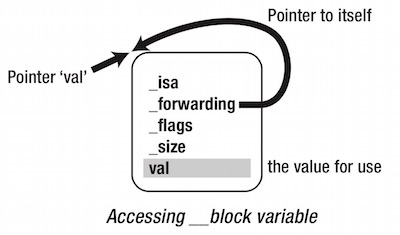
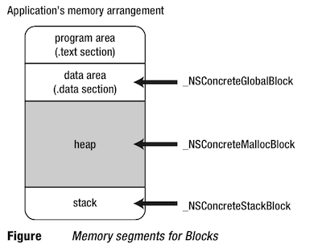
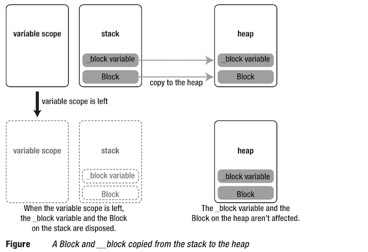
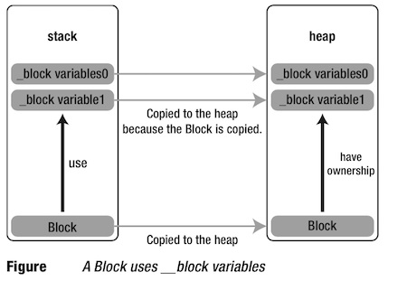
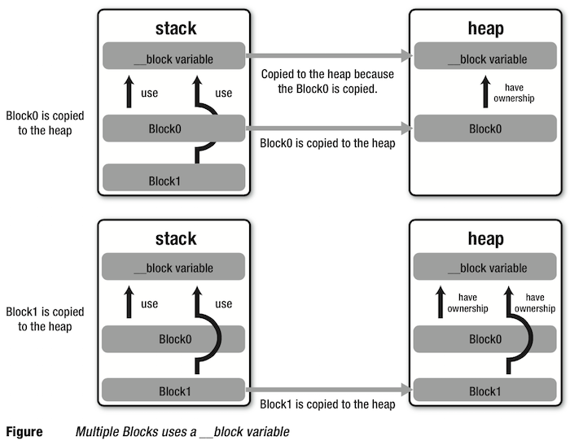
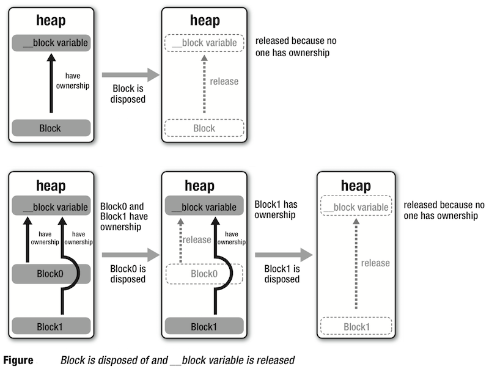
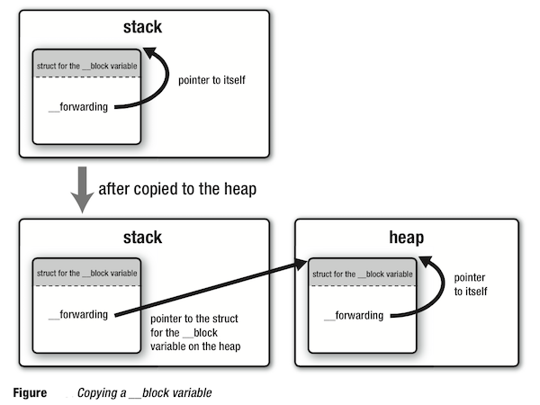

本文介绍了 Block 的基本语法知识以及相关的使用场景，并进一步探索了 Block 的底层实现机制和内存管理机制，还总结了使用 Block 时应该注意的各种问题。这篇文章写的很长，是为了把关于 Block 的种种问题探索的更清晰，如果在阅读时觉得太累可以根据文章的目录结构寻找自己想要了解的部分。

##Block 是什么
Block 是 Apple 在 C 语言的基础上添加的扩展功能，由于 Ojective-C、C++ 都是源自于 C，所以这三种语言都能够使用它。对于 Block 的功能，可以用一句话概括：**能持有作用域变量的匿名函数。**

`匿名函数`就是没有名称的函数，C 语言的标准不允许存在这样的函数，而通过 Block，源代码中就可以使用匿名函数了。

`能持有作用域变量`就是指 Block 能够获得其所在作用域的变量。其中其所在作用域的变量就包括：局部变量（自动变量）、函数的参数、静态局部变量、静态全局变量、全局变量。

Block 能够让我们创建明显的代码片段，并且可以像参数那样传递给方法或函数。在 Objective-C 中，Block 就像对象一样，能够被添加到集合中（比如：NSArray、NSDictionary）。Block 能够获得其所在作用域的变量，就如同其他语言里`闭包（Closure）`或者`lambda 计算`的概念。

##Block 语法形式
Block 的语法遵循如下形式：

- `^` `返回值类型` `参数列表` `表达式`

其中`返回值类型`是可以省略的，但需要保证`表达式`中的所有 return 语句的返回值类型相同。`参数列表`在为空的情况下也是可以省略的。

一些示例：

	// 一个最简单的 block：
	^{
    	NSLog(@"This is a block");
    }
    
    // 不省略的 block：
    ^void (void) {
    	NSLog(@"This is a block");
    }
    
    // 普通的 block：
    ^int (int a, int b) {
    	NSLog(@"a is %d, b is %d", a, b);
    	return a + b;
    }
    
可见，Block 语法从形式上来看除了没有名字以及带有 `^` 外，其他都和 C 语言的函数定义相同。

##Block 类型变量的使用
在 C 语言中，可以把一个函数的地址赋值给函数指针类型的变量，如下：

	int func(int a) {
		return a + 1;
	}
	int (*func_pointer)(int) = &func;
	
同样，在 Block 语法中，也可以把一个 Block 赋值给 Block 类型的变量。

###最简单的 Block
声明和定义一个不返回任何值，不接受任何参数的 Block：
    
	// 完整的写法：
	//// 声明
	void (^simpleBlock)(void); 
	//// 定义
	simpleBlock = ^{
        NSLog(@"This is a block");
    };
    //// 声明、定义一起
    void (^simpleBlock)(void) = ^{
        NSLog(@"This is a block");
    };
    // 调用 block
    simpleBlock();

###带参数和返回值的 Block
下面的 Block，接受两个 double 参数，返回一个 double 值：

	// 声明
	double (^multiplyTwoValues)(double, double);
	// 定义
	double (^multiplyTwoValues)(double, double) =
                              ^(double firstValue, double secondValue) {
                                  return firstValue * secondValue;
                              };
	// 调用
    double result = multiplyTwoValues(2,4);
    NSLog(@"The result is %f", result);

###Block 作为参数时的缩写

Block 作为参数时的缩写如 Block 语法规则所约定那样。

	// Block 没有参数，则 `()` 可以省略：
	[UIView animateViewDuration:5.0 animation:^() { // 这个 block 没有参数，这里的 () 就可以省略。
		view.opacity = 0.5;
	}];

	// 如果 Block 中返回值的类型根据 return 后的内容能明显推出，那么可以省略：
	NSSet* mySet = ...;
	NSSet* matches = [mySet objectsPassingTest:^BOOL(id obj, ...) { // 根据return语句，这个block的返回值明显是BOOL，所以这里可以省略BOOL。
		return [obj isKindOfClass:[UIView class]]; // 返回值是 BOOL，很明显。
	}];

###把 Block 传递给方法或函数

	// 调用带 block 参数的方法：
	- (IBAction)fetchRemoteInformation:(id)sender {
	    [self showProgressIndicator];
	 
	    XYZWebTask *task = ...
	 
	    [task beginTaskWithCallbackBlock:^{
	        [self hideProgressIndicator];
	    }];
	}
	
	// 声明带 block 参数的方法：
	- (void)beginTaskWithCallbackBlock:(void (^)(void))callbackBlock;
	
	// 方法的具体实现：
	- (void)beginTaskWithCallbackBlock:(void (^)(void))callbackBlock {
    	...
    	callbackBlock();
	}

苹果的建议是在一个方法中最好只使用一个 block 变量，并且如果这个方法如果还带有其他非 block 变量，那么 block 变量应该放在最后一个。

###使用 typedef 来简化 Block 定义

上面的 Block 类型的变量在使用时，记述方式会一眼看上去有点不够简洁，这时候我们也可以用 typedef 来解决这个问题。

	// typedef 一个 block
	typedef void (^XYZSimpleBlock)(void);
    // 使用 1
	XYZSimpleBlock anotherBlock = ^{
        ...
    };
    // 使用 2
    - (void)beginFetchWithCallbackBlock:(XYZSimpleBlock)callbackBlock {
    	...
    	callbackBlock();
	}
    
来看一个用 typedef 简化复杂 Block 定义的例子，下面的定义的名为 complexBlock 的变量是一个 block，这个 block 接受一个 block 作为参数，并且返回一个 block：

	// 简化前：
	void (^(^complexBlock)(void (^)(void)))(void) = ^ (void (^aBlock)(void)) {
    	...
    	return ^{
        	...
    	};
	};
	// 使用上面 typedef 的 XYZSimpleBlock 简化后：
	XYZSimpleBlock (^betterBlock)(XYZSimpleBlock) = ^ (XYZSimpleBlock aBlock) {
	    ...
	    return ^{
	        ...
	    };
	};

###定义属性来持有 Block
使用 `copy`，因为 Block 要持有它原本所在作用域的其他外面的变量：

	@interface XYZObject : NSObject
	@property (copy) void (^blockProperty)(void);
	@end

	// setter 方法和调用
	self.blockProperty = ^{
        ...
    };
    self.blockProperty();
    
    // 使用 typedef 简化
    typedef void (^XYZSimpleBlock)(void);
 
	@interface XYZObject : NSObject
	@property (copy) XYZSimpleBlock blockProperty;
	@end

###Block 的指针类型变量
我们还可以使用指向 Block 类型变量的指针，即 Block 的指针类型变量。

	typedef int (^MyBlock)(int);
	MyBlock aBlock = ^int(int a) {
		return a + 1;
	};
	
	MyBlock* aBlockPointer = &aBlock;
	int result = (*aBlockPointer)(10); // result = 11.
	
可见 Block 类型变量可像 C 语言中其他类型变量一样使用。

##Block 的使用场景

###Block 简化枚举

	// NSArray 的一个方法，接受一个 block 作为参数，这个 block 会在该方法里每枚举一个对象时被调用一次：
	- (void)enumerateObjectsUsingBlock:(void (^)(id obj, NSUInteger idx, BOOL *stop))block;
	// 这个 block 接受三个参数，前两个是当前的对象和其 index，后面的 BOOL 值可以用来控制什么时候停止该枚举。
	NSArray *array = ...
    [array enumerateObjectsUsingBlock:^ (id obj, NSUInteger idx, BOOL *stop) {
        NSLog(@"Object at index %lu is %@", idx, obj);
    }];
    [array enumerateObjectsUsingBlock:^ (id obj, NSUInteger idx, BOOL *stop) {
        if (...) {
            *stop = YES;
        }
    }];

###Block 简化并发调用
####Block 和 Operation Queue 一起用

	NSBlockOperation *operation = [NSBlockOperation blockOperationWithBlock:^{
	    ...
	}];

####Block 和 GCD 一起用

	dispatch_queue_t queue = dispatch_get_global_queue(DISPATCH_QUEUE_PRIORITY_DEFAULT, 0);
	dispatch_async(queue, ^{
	    NSLog(@"Block for asynchronous execution");
	});

###Block 的使用场景小结

* Enumeration (像我们上面看到的 NSArray 的枚举接口)
* View Animations (animations)
* Sorting (在排序时在 Block 中实现比较逻辑)
* Notification (当某些事件被触发时，执行对应的 Block)
* Error handlers (作为错误事件的 Handler)
* Completion handlers (作为某个任务完成时的 Handler)
* Multithreading (在 Grand Central Dispatch (GCD) API 中使用)

##Block 的实现
在前面的内容中，我们知道了 Block 是「能持有作用域变量的匿名函数」，还介绍了使用 Block 的相关内容，那么 Block 究竟是如何实现的呢？我们可以用 clang（LLVM 编译器）把带 Block 语法的源代码代码转换为我们能够理解的源代码来初探一下。这里我们可以使用 `clang -rewrite-objc <source-code-file>` 把含有 Block 语法的源代码转换成 C++ 的源代码（这里其实就是使用了 struct 结构的 C 代码）。 

###最简单的Block
包含 Block 语法的源代码 test_block.m：

	#include <stdio.h>
	
	int main() {
		void (^blk)(void) = ^{
			int tag = 8;
			printf("Block, %d\n", tag);
		};
	
		blk();
	
		return 0;
	}
	
	
使用 `clang -rewrite-objc test_block.m` 编译后得到了 test_block.cpp 代码，从里面截取相关的代码如下：

	struct __block_impl {
		void *isa;
		int Flags;
		int Reserved;
		void *FuncPtr;
	};

	struct __main_block_impl_0 {
		struct __block_impl impl;
		struct __main_block_desc_0* Desc;
		__main_block_impl_0(void *fp, struct __main_block_desc_0 *desc, int flags=0) {
			impl.isa = &_NSConcreteStackBlock;
			impl.Flags = flags;
			impl.FuncPtr = fp;
			Desc = desc;
		}
	};
	
	// 这里对应的就是 block 的匿名函数。参数 __cself 为指向 block 值的指针，类似 Objective-C 中实例方法中指向对象自身的变量 self。
	static void __main_block_func_0(struct __main_block_impl_0 *__cself) {
		int tag = 0;
		printf("Block, %d\n", tag);
	 }
	
	static struct __main_block_desc_0 {
		size_t reserved;
		size_t Block_size;
	} __main_block_desc_0_DATA = { 0, sizeof(struct __main_block_impl_0)};

	int main() {
		void (*blk)(void) = (void (*)())&__main_block_impl_0((void *)__main_block_func_0, &__main_block_desc_0_DATA);
	
		((void (*)(__block_impl *))((__block_impl *)blk)->FuncPtr)((__block_impl *)blk);
	
		return 0;
	}

如转换后的代码所示，Block 使用的匿名代码被转换为 C 语言函数，其函数名 \_\_main_block_func_0 则根据 Block 语法所属的函数名（这里是 main）和该 Block 语法在该函数出现的顺序值（这里是 0）来命名。`((void (*)(__block_impl *))((__block_impl *)blk)->FuncPtr)((__block_impl *)blk);` 最终简化后其实就是用函数指针实现对函数的调用。根据 `impl.isa = &_NSConcreteStackBlock;` 这里用 _NSConcreteStackBlock 来初始化 \_\_block_impl 结构体的 isa 成员。

分析这些代码，我们最后能得出的结论是：

- Block 转换后的形式就是简单地使用函数指针来调用函数。
- Block 其实就是 Objective-C 对象。

###Block 截获自动变量
我们对 test_block.m 代码稍作修改。其中在 Block 中用到了自动变量。

	#include <stdio.h>
	
	int main() {
		int dummy = 256;
		int tag = 10;
		const char *say = "tag = %d\n";
	
	    void (^blk)(void) = ^{
	        printf(say, tag);
	    };
	    
	    blk();
	    
	    return 0;
	}

使用 `clang -rewrite-objc test_block.m` 转换代码后，截取相关片段如下：

	struct __block_impl {
	    void *isa;
	    int Flags;
	    int Reserved;
	    void *FuncPtr;
	};

	struct __main_block_impl_0 {
	    struct __block_impl impl;
	    struct __main_block_desc_0* Desc;
	    // 这里可以看到，这里的两个 Block 结构体的成员变量与外面的两个自动变量完全相同，这是等会要来拷贝用的。
	    const char *say;
	    int tag;
	    // 下面是结构体的构造函数。
	    __main_block_impl_0(void *fp, struct __main_block_desc_0 *desc, const char *_say, int _tag, int flags=0) : say(_say), tag(_tag) {
	        impl.isa = &_NSConcreteStackBlock;
	        impl.Flags = flags;
	        impl.FuncPtr = fp;
	        Desc = desc;
	    }
	};
	// 这里可以看到，只是把自动变量的值拷贝进来了，并且只拷贝了 Block 里用到的自动变量，如：say 和 tag，并没有拷贝 dummy。
	static void __main_block_func_0(struct __main_block_impl_0 *__cself) {
	    const char *say = __cself->say; // bound by copy
	    int tag = __cself->tag; // bound by copy
	    
	    printf(say, tag);
	}
	
	static struct __main_block_desc_0 {
	    size_t reserved;
	    size_t Block_size;
	} __main_block_desc_0_DATA = { 0, sizeof(struct __main_block_impl_0)};
	
	int main() {
	    int dummy = 256;
	    int tag = 10;
	    const char *say = "tag = %d\n";
	    
	    void (*blk)(void) = (void (*)())&__main_block_impl_0((void *)__main_block_func_0, &__main_block_desc_0_DATA, say, tag);
	    
	    ((void (*)(__block_impl *))((__block_impl *)blk)->FuncPtr)((__block_impl *)blk);
	    
	    return 0;
	}

分析上面的代码，我们可以得到的结论是：

- Block 只会截获它里面使用到的自动变量。
- Block 被转换后的结构体内声明的成员变量与它将截获的自动变量的类型完全相同。
- 所谓的「自动变量的截获」就是在执行 Block 时，将 Block 用到的自动变量的值拷贝到 Block 实例对应的成员变量上。

说到这里，我们就能理解为什么使用 C 语言的数组时会有问题了。

	// 这样是有问题的：
	const char text[] = "hello";
	void (^blk)(void) = {
		printf("%c\n", text[2]);
	}
	// 这样是没问题的：
	const char* text = "hello";
	void (^blk)(void) = {
		printf("%c\n", text[2]);
	}
	
上面有问题的那种使用方式，可能被转换后得到的代码形式是类似这样的：

	void func(const char text[]) {
		const char text2[] = text; // 这种赋值方式是不符合 C 语言规范的。
		printf("%c\n", text[2]);
	}
	int main() {
		cosnt char text[] = "hello";
		func(text);
	}

而这种赋值方式是不符合 C 语言规范的。而使用指针就没问题了。

###Block 使用静态、全局变量
下面的代码中，用到了静态变量、全局变量、全局静态变量，并在 Block 中改变了他们的值。

	#include <stdio.h>

	int global_val = 1;
	static int static_global_val = 2;
	
	int main() {
		static int static_val = 3;
	
	
	    void (^blk)(void) = ^{
	        global_val = 100;
	        static_global_val = 200;
	        static_val = 300;
	    };
	    
	    blk();
	    
	    return 0;
	}

使用 `clang -rewrite-objc test_block.m` 转换代码后，截取相关片段如下：

	struct __block_impl {
	    void *isa;
	    int Flags;
	    int Reserved;
	    void *FuncPtr;
	};

	struct __main_block_impl_0 {
	    struct __block_impl impl;
	    struct __main_block_desc_0* Desc;
	    // 可以看到，对于静态变量，在 Block 中是用其指针，所以改变其值也是没问题的。
	    int *static_val;
	    __main_block_impl_0(void *fp, struct __main_block_desc_0 *desc, int *_static_val, int flags=0) : static_val(_static_val) {
	        impl.isa = &_NSConcreteStackBlock;
	        impl.Flags = flags;
	        impl.FuncPtr = fp;
	        Desc = desc;
	    }
	};
	static void __main_block_func_0(struct __main_block_impl_0 *__cself) {
	    int *static_val = __cself->static_val; // bound by copy
	    // 可以看到，对于全局的变量（静态或非静态），不用截获，直接用就行了。对于局部静态变量，用到了指针，改变其值是没问题的。因为静态变量是存储在静态存储区，生命周期是整体程序运行期间，所以可以这样用。
	    global_val = 100;
	    static_global_val = 200;
	    (*static_val) = 300;
	}
	
	static struct __main_block_desc_0 {
	    size_t reserved;
	    size_t Block_size;
	} __main_block_desc_0_DATA = { 0, sizeof(struct __main_block_impl_0)};
	int main() {
	    static int static_val = 3;
	    
	    
	    void (*blk)(void) = (void (*)())&__main_block_impl_0((void *)__main_block_func_0, &__main_block_desc_0_DATA, &static_val);
	    
	    ((void (*)(__block_impl *))((__block_impl *)blk)->FuncPtr)((__block_impl *)blk);
	    
	    return 0;
	}

分析上面上面的代码，可以得出的结论是：

- 在 Block 中使用全局变量、全局静态变量与 C 语言中无区别，直接使用就好。
- 在 Block 中使用局部静态变量时，由于转换后的函数 __main_block_func_0 原本就设置在含有 Block 语法的函数(也就是在含有静态变量的函数)之外，所以无法从变量的作用域去访问。这里是通过静态变量的指针来对其进行访问。
- 按说采用指针的方式也适用于普通自动变量，但是不能这样用，因为转换后的函数 \_\_main_block_func_0 在含有 Block 语法的函数外，变量的作用域结束后，自动变量的生命周期就结束了，不能再使用了。而静态变量的作用域虽然是在函数内，但是它是被存储在静态区域，生命周期是整个程序运行期间，所以可以通过指针去访问，有了指针自然也能修改了。

###\_\_block 说明符
上面展示了 Block 截获自动变量以及使用静态变量、全局变量和全局静态变量的实现，接下来，再来看看当需要在 Block 里面改变自动变量时的情况，也就是使用 \_\_block 说明符时 Block 的实现。这里需要关注的问题是：**当使用了 \_\_block 说明符后，对变量做了什么处理，才使得不在变量作用域的 Block 可以去访问修改变量呢？**

`__block` 说明符更准确的表述是：**__block 存储域类说明符**。在 C 语言中还有这些存储域类说明符：typedef、extern、static、auto、register。这些说明符用于指定将变量值设置到哪个存储域中。例如，auto 表示作为自动变量存储在栈上，static 表示作为静态变量存储在数据区等。下面来看看 \_\_block。

	#include <stdio.h>
	
	int main() {
		int __block val = 3;
	
	    void (^blk)(void) = ^{
			val = 300;
		};
	    
	    blk();
	    
	    return 0;
	}

使用 `clang -rewrite-objc test_block.m` 转换代码后，截取相关片段如下：

	struct __block_impl {
	    void *isa;
	    int Flags;
	    int Reserved;
	    void *FuncPtr;
	};
	
	// 这个结构体是用来定义原来的自动变量 val 的。
	struct __Block_byref_val_0 {
	    void *__isa;
	    __Block_byref_val_0 *__forwarding; // 这个成员变量是一个指向自己实例的指针。
	    int __flags;
	    int __size;
	    int val; // 这个成员变量将用来存原来自动变量的值。
	};
	
	struct __main_block_impl_0 {
	    struct __block_impl impl;
	    struct __main_block_desc_0* Desc;
	    // 原来的自动变量被重新定义成了一个结构体，val 成了指向这个结构体的一个实例的指针。
	    __Block_byref_val_0 *val; // by ref
	    __main_block_impl_0(void *fp, struct __main_block_desc_0 *desc, __Block_byref_val_0 *_val, int flags=0) : val(_val->__forwarding) {
	        impl.isa = &_NSConcreteStackBlock;
	        impl.Flags = flags;
	        impl.FuncPtr = fp;
	        Desc = desc;
	    }
	};
	
	static void __main_block_func_0(struct __main_block_impl_0 *__cself) {
	    __Block_byref_val_0 *val = __cself->val; // bound by ref
	    
	    // 下面的赋值可以看出，是把原自动变量变成了 __main_block_impl_0 结构体的实例的指针。再通过指针去访问这个实例的成员变量。其中成员变量 __forwarding 指向实例自己，成员变量 __val 存储值。
	    (val->__forwarding->val) = 300;
	}
	
	static void __main_block_copy_0(struct __main_block_impl_0*dst, struct __main_block_impl_0*src) {_Block_object_assign((void*)&dst->val, (void*)src->val, 8/*BLOCK_FIELD_IS_BYREF*/);}
	
	static void __main_block_dispose_0(struct __main_block_impl_0*src) {_Block_object_dispose((void*)src->val, 8/*BLOCK_FIELD_IS_BYREF*/);}
	
	static struct __main_block_desc_0 {
	    size_t reserved;
	    size_t Block_size;
	    void (*copy)(struct __main_block_impl_0*, struct __main_block_impl_0*);
	    void (*dispose)(struct __main_block_impl_0*);
	} __main_block_desc_0_DATA = { 0, sizeof(struct __main_block_impl_0), __main_block_copy_0, __main_block_dispose_0};
	int main() {
		// 可以看到，变量 val 竟然成为了结构体 __Block_byref_val_0 的实例。
	    __attribute__((__blocks__(byref))) __Block_byref_val_0 val = {(void*)0,(__Block_byref_val_0 *)&val, 0, sizeof(__Block_byref_val_0), 3};
	    
	    void (*blk)(void) = (void (*)())&__main_block_impl_0((void *)__main_block_func_0, &__main_block_desc_0_DATA, (__Block_byref_val_0 *)&val, 570425344);
	    
	    ((void (*)(__block_impl *))((__block_impl *)blk)->FuncPtr)((__block_impl *)blk);
	    
	    return 0;
	}
	
	
上面的代码有两个函数需要说明一下：`_Block_object_assign` 函数实现把 Block 从栈上拷贝到堆上；`_Block_object_dispose` 函数实现把 Block 从堆上释放。

结合上面的代码，我们可以知道这里解答了本节开头的问题：怎么处理使得可以不在变量作用域(Block 被实现为自动变量作用域之外的一个函数了)的 Block 中访问修改 \_\_block 类型的变量？答案简单来说就是用指针，不过做了一些包装：\_\_block 描述的自动变量被重新定义为了结构体 `__Block_byref_val_0`，原自动变量 val 变成了这个结构体的成员变量 val，并且在 Block 中使用的是这个结构体实例的指针 val。但是，用指针，这其实跟前面讲到 Block 修改静态局部变量的方式一样，这并没有展示出 \_\_block 类型变量的真正核心意义。

那 \_\_block 说明符的核心意义究竟是什么呢？这要回到当初设计 Block 的初衷上去看，Block 是「能截获自动变量的匿名函数」，既然是函数，那就有在某处被调用的需求了，比如说自动变量的作用域之外（我们转换代码已经看到，Block 转换后确实是实现成作用域之外的函数）。我们上面也看到了用指针来截获和修改自动变量的手段，但是超过了作用域调用 Block 时，它去修改被它截获的、**过期的**自动变量是会崩溃的，所以 **\_\_block 的核心要解决的是超过自动变量作用域来调用 Block 的场景，并且这个 Block 要能截获和修改这个自动变量**。解释这个问题需要先了解与 \_\_block 对应的内存管理方式，这个在下节说明。

\_\_block 类型变量被转换后的结构体如下图所示。这里同时引出了一个问题：用指针 val 指向变量转变后的结构体实例就好了，**为什么结构体里还有一个指向自己实例的 \_\_forwarding 指针？**这个问题将放在后面讲解。
>

此外，Block 的实现中使用的是 `__Block_byref_val_0` 结构体的实例的指针，这样可以做到在多个 Block 中使用同一个 \_\_block 变量。当然在一个 Block 中使用多个 \_\_block 变量也是可以的，只要增加 Block 结构体的成员变量与构造函数的参数即可。

在这节，我们遗留了两个问题：

- 超过自动变量作用域来调用一个可以截获和修改这个自动变量的 Block 是怎么实现的？
- \_\_block 变量转变后的结构体中为什么还需要一个 \_\_forwarding 指针指向自己？

这两个问题是关于 \_\_block 自动变量的，但是我们还要先看看 Block 内存管理相关的知识后再来解答。

###Block 存储域
Block 有 3 种类型：

- `_NSConcreteStackBlock`，这种类型的 Block 存储在栈上。
- `_NSConcreteGlobalBlock`，这种类型的 Block 存储在程序的数据区。跟全局变量一样。
- `_NSConcreteMallocBlock`，这种类型的 Block 存储在堆上。

####1）NSConcreteGlobalBlock

在下面两种情况下，我们得到的 Block 是 `_NSConcreteGlobalBlock` 类型的：

- 在记述全局变量的地方有 Block 语法时。
- Block 语法中不使用任何自动变量时。

####2）NSConcreteStackBlock

除上面两种情况创建的 Block 以外，其他 Block 语法生成的 Block 均为 `_NSConcreteStackBlock` 类型，存储在栈上。

下面看几个例子：

	// 此 Block 是 _NSConcreteGlobalBlock 类型的。此 Block 结构体实例的内容不会依赖执行时的状态，所以整个程序中只需要一个实例。因此将其放在与全局变量相同的数据区域即可。
	void (^blk)(void) = ^{printf("Global Block\n");};
	int main() {}
	
	// 此 Block 需要截获自动变量，截获的自动变量的值会根据执行时的状态变化，下面每次 for 循环 Block 截获的自动变量的值都不一样。所以需要把对应的 Block 结构体的实例放在调用栈中，让其对应不同调用上下文的状态。
	typedef int (^MyBlock)(int);
	for (int i = 0; i < 10; i++) {
		MyBlock blk = ^(int c) {
			return i * c;
		};
	}
	
	// 此 Block 虽然不是放在全局代码位置，但是它在实现中没有使用任何自动变量，Block 结构体的实例在每次循环中都是一个。虽然通过 clang 转换代码看到的是 _NSConcreteStackBlock 类型，但实现上却有不同。它还是会被放在全局数据区域。
	typedef int (^MyBlock)(int);
	for (int i = 0; i < 10; i++) {
		MyBlock blk = ^(int c) {
			return c;
		};
	}
	
####3）NSConcreteMallocBlock

那么问题来了，什么时候会用到存储在堆上的 `_NSConcreteMallocBlock` 类型的 Block 呢？

Block 语法机制提供了将 Block 和 \_\_block 变量从栈上复制到堆上的方法来解决这个问题。将存储在栈上的 Block 复制到堆上，即使 Block 语法记述的变量作用域生命周期结束，堆上的 Block 还是可以继续存在。复制到堆上的 Block 将 `_NSConcreteMallocBlock` 类对象写入 Block 结构体实例的 isa 成员变量，而 \_\_forwarding 成员变量就可以实现无论 \_\_block 变量存储在栈上还是堆上都能准确的被访问。

所以总结起来，NSConcreteGlobalBlock 和 NSConcreteStackBlock 两种类型从语法上就能判断，而 NSConcreteMallocBlock 则更像是一种运行时的类型，在是在程序执行时，当 Block 被 copy 到堆上的时候将 Block 的类型设置为了 NSConcreteMallocBlock 类型。

看到这里，上节遗留的两个问题的答案已经初见端倪，不过，这里还是集中精神先说 Block 的内存管理，还没深入到解答那两个问题，只是突然扯出了答案的尾巴，先不管，还是先关注 Block 吧。

####Block 内存管理需要注意的问题

在 ARC 的情况下，编译器在大多时候会做出恰当的判断，自动生成把 Block 从栈上拷贝到堆上的代码。比如：

	typedef int (^blk_t)(int);
	blk_t func(int rate) {
	    return ^(int count){return rate * count;};
	}

上面的代码通过对应 ARC 的编译器可转换如下：

	blk_t func(int rate) {
	    blk_t tmp = &__func_block_impl_0(__func_block_func_0, &__func_block_desc_0_DATA, rate);
	    tmp = objc_retainBlock(tmp);
	    return objc_autoreleaseReturnValue(tmp); 
	}

其大致意思就是将 Block 作为函数返回值返回时，编译器会自动生成复制到堆上的代码。

但有时候编译器是无法判断的，这时候需要我们手动过调用 Block 的 copy 方法来将 Block 从栈上复制到堆上。比如：

	- (id)getBlockArray {
	    int val = 10;
	    return [[NSArray alloc] initWithObjects: 
	                            ^{NSLog(@"blk0:%d", val);}, 
	                            ^{NSLog(@"blk1:%d", val);}, nil];
	}
	
	int main() {
		id obj = getBlockArray();
		typedef void (^blk_t)(void);
		blk_t blk = (blk_t)[obj objectAtIndex:0];
		
		blk(); // 执行时发生异常。
	}
	
blk() 在执行时发生异常，这时由于 getBlockArray 函数执行结束时，栈上的 Block 被废弃的缘故。可惜此时编译器不能判断是否需要自动复制。将代码像下面这样改一下就可以正常运行了：
	
	// 将 getBlockArray 改为下面代码即可（手动 copy 数组中的 Block）：
	- (id)getBlockArray {
	    int val = 10;
	    return [[NSArray alloc] initWithObjects: 
	                            [^{NSLog(@"blk0:%d", val);} copy], 
	                            [^{NSLog(@"blk1:%d", val);} copy], nil];
	}

也可以不让编译器判断，在任何时候都使用复制，但是将 Block 从栈上复制到堆上是很消耗 CPU 的，所以我们需要了解哪些时候编译器能判断出来并自动处理，哪些时候不能判断处理需要我们手动 copy。

在下面这些情况下，编译器判断不出究竟是什么情况：

- 向方法或函数的参数中传递 Block 时

但是如果在方法或函数中适当地复制了传递过来的参数，那么就不必在调用该方法或函数前手动复制了。以下方法或函数就不需要手动复制：

- Cocoa 框架的方法且方法名中含有 usingBlock 等时
- GCD 的 API

关于 Block 的拷贝操作可以用一张表总结下：

| Block 的类              | 副本源的存储域  | copy 效果  |
| ---------------------- |:-------------:| ---------:|
| _NSConcreteStackBlock  | 栈            | 从栈复制到堆 |
| _NSConcreteGlobalBlock | 程序的数据区域  | 什么也不做  |
| _NSConcreteMallocBlock | 堆            | 引用计数增加 |

所以，**不管 Block 存储在何处，用 copy 方法复制都不会引起任何问题。在不确定时调用 copy 方法即可。**在 ARC 中不能显式的 release，但是即使多次调用了 copy 方法进行复制也不会有问题。

####小结

- 1）本节讲了 Block 的 3 种类型：NSConcreteStackBlock、NSConcreteGlobalBlock、NSConcreteMallocBlock。介绍了它们的内存管理方式。Block 的内存管理设计解决了 Block 离开作用域被使用的问题（被 copy 到堆上）。
- 2）在 ARC 特性下，在方法中返回 Block 时将不再需要手动调用 copy 了。
>Blocks “just work” when you pass blocks up the stack in ARC mode, such as in a return. You don’t have to call Block Copy any more.

- 3）注意使用 Block 时，向方法或函数传递 Block 作为参数时，传的时候调用一下 copy 方法。除非在方法或函数体中，对传进来的 Block 参数做了 copy ，比如 Cocoa 框架中名字含有 usingBlock 的方法和 GCD 的 API。

>
	- (void)testBlock {
	    NSArray *blkArray = [self getBlockArray];
	    typedef void (^blk_t)(void);
	    for (blk_t blk in blkArray) {
	        blk();
	    }
	    blk_t singleBlk = [self getBlock];
	    singleBlk();
	}
	// 在方法中返回 Block 不需要 copy 了。
	- (id)getBlock {
	    int val = 88;
	    return ^{NSLog(@"blk:%d", val);};
	}
	// 在方法中传递 Block 作为参数时，还是需要 copy 的。
	- (NSArray *)getBlockArray {
	    int val = 10;
	    return [[NSArray alloc] initWithObjects:
	            [^{NSLog(@"blk0:%d", val);} copy],
	            [^{NSLog(@"blk1:%d", val);} copy], nil];
	}
	

###\_\_block 变量存储域
讲完对 Block 的处理后，我们知道了通过把 Block 拷贝到堆上，使得 Block 离开作用域也可以被使用，**但是，Block 自己还有使用作用域里的自动变量的需求**。所以接下来要解答这个问题，开讲 Block 机制对 \_\_block 变量的处理。

使用 \_\_block 变量的 Block 从栈上复制到堆上时，\_\_block 也会受到影响：

| \_\_block 变量原来的存储区域 | Block 从栈复制到堆对其截获的 \_\_block 变量的影响  | 
|:-------------------------:|:----------------------------------------------|
| 栈                        | 从栈上复制到堆上并被 Block 持有                    | 
| 堆                        | 被 Block 持有                                   | 

接下来看几个具体的场景：

- 在一个 Block 中使用 \_\_block 变量时，当 Block 从栈上复制到堆上，它所使用的 \_\_block 变量也会一起拷贝到堆上，Block 会持有这些变量。值得注意的是，已经拷贝到堆上的 Block 如果再被拷贝，那么此时对 \_\_block 变量已经没有影响了。如下图：
>

	
- 在多个 Block 中使用 \_\_block 变量时，当任意一个 Block 从栈复制到堆上时，\_\_block 变量也会一并从栈复制到堆上并被这个 Block 持有。当剩下的 Block 从栈拷贝到堆上时，被复制的 Block 持有已经在堆上的 \_\_block 变量并增加 \_\_block 变量的引用计数。如下图：
>

- 当堆上的 Block 被废弃时，那么它所使用的 \_\_block 变量也会被释放。
>

到这里我们可以看到，上面的内存管理方式跟 Objective-C 引用计数式的内存管理完全相同。

回顾一下前面的问题：

- 超过自动变量作用域来调用一个可以截获和修改这个自动变量的 Block 是怎么实现的？
- \_\_block 变量转变后的结构体中为什么还需要一个 \_\_forwarding 指针指向自己？

所以这两个问题的答案简单来讲其实就是：把 Block 和 \_\_block 变量拷贝到堆上，来实现在超过自动变量作用域的地方调用 Block 时，不用担心自动变量过期的问题。而 \_\_forwarding 正是用来解决 \_\_block 变量拷贝到堆上还能被正确访问这件事的。这样我们就更能理解，转换代码后显示的 Block 和 \_\_block 变量被封装成了结构体的实例，这也是为了拷贝上堆服务的。 

下面这个例子进一步说明一下 \_\_block 变量转换后要用 \_\_forwarding 指针的原因：

	void func() {
	    int __block val = 0;
	    
	    // Block 从栈上复制到堆上，它使用的 __block 变量 val 也被复制到堆上。
	    void (^blk)(void) = [^{++val;} copy]; 
	    NSLog(@"%d", val); // 打印：0
	    ++val;
	    NSLog(@"%d", val); // 打印：1
	    blk();
	    NSLog(@"%d", val); // 打印：2
	}

可以看到，`++val;` 这句代码使用的是与 Block 无关的栈上的变量 val。`blk();` 这句代码调用后，其实现 `^{++val;}` 使用的是拷贝到堆上的 \_\_block 变量 val。最后打印出来的结果是我们想要的。其实这两处的 `++val;` 都可以翻译为 `++(val._forwarding->val);` 结合前面转换代码里看到的 \_\_block 变量的结构，可以知道这里的 \_\_block 变量的内存状态大致如图：

这里，\_\_forwarding 指针的意义显而易见了吧。

###总结
这节的内容讲的东西还是比较多的，看着看着可能就失去焦点，陷入细节之中了，在这里，我梳理了一下这节内容的逻辑链条以 Why-How-When 的顺序展开以方便理解。

####Why
「Block 的实现」这节是在我们明确了「Block 是能持有作用域变量的匿名函数」这个定义后，来探索它究竟是如何实现这个定义的。那么首先我们需要搞清楚的是 Block 这个定义背后的设计目标(**Why**)：

- Block 能够持有作用域变量，那必然会有对这些变量进行读写操作的需求，那要采用什么样的机制保证 Block 正确读写所持有的变量呢？
- Block 是匿名函数，那么作为函数，它就天然带着能够在各个地方被正确调用的属性，那么 Block 的作用域和生命周期机制应该如何设计从而来保证它能在各种地方被正确调用呢？
- Block 存在作用域和生命周期的问题，那么需要一套怎样的机制来保证 Block 所持有的变量的作用域和生命周期能够与之相匹配，从而保证 Block 的正确使用呢？

####How
接下来我们分为下面几个步骤来探讨怎么实现上述的设计目标(**How**)：

- 1）我们需要根据变量的不同的**作用域**和**生命周期**来分别讨论，这样就包括了：`全局变量`、`全局静态变量`、`局部静态变量`和`自动变量`。
	- 对于全局变量、全局静态变量，因为生命周期和作用域是全局的，读写随意。
	- 对于局部静态变量，生命周期是全局，但是作用域是局部，那么 Block 语法被转换为外部函数时，则需要用指向静态局部变量的指针来对其进行读写操作。
	- 对于自动变量，生命周期和作用域都是局部的，只读的话，还好办，拷贝一下它的值就行了。但是想修改的话，咋整呢？首先，不能效仿静态变量那样的做法，因为你在外面修改它时，没准它已经被销毁了，这是会闹崩溃的。所以从这就引出了解决方案，用 `__block` 修饰自动变量就能写了，也就是说 `__block` 修饰符使得变量能够超出作用域被读写了。从而引出了问题：其内部实现又是怎样的呢？
- 2）跟着上面的问题，我们介绍了 \_\_block 说明符的相关知识。它把自动变量进行了一层封装，并且提供了把自动变量拷贝到堆上的机制。这样**\_\_block 自动变量能够超出作用域被读写**这个问题的解决方案初见端倪，但是我们还需要了解一下 Block 本身的内存管理机制，从而更好的去了解 Block 本身和其使用的自动变量在内存管理上的协作。
- 3）所以接下来，我们开始探讨 Block 存储域相关的知识。介绍了 Block 的三种存储相关类型以及使用时需要注意的问题。
- 4）介绍完 Block 存储域相关的东西后，就接着说了 \_\_block 变量与 Block 协作时的内存管理机制。从而解释清楚了对「Block 是能持有作用域变量的匿名函数」这个定义的实现方式。

####When
通过上面的内容，我们可以理解 Block 的能力的实现机制，但是在具体使用时**在怎样的场景下会触发这些机制**是我们接下来需要搞清楚的(**When**)：

- 首先是 Block 自身的内存管理的情况。比如什么场景下编译器能帮你自动把 Block 给拷贝到堆上，什么情况下你得手动调用 copy 方法去把 Block 拷贝到堆上的问题。对于这些问题，在本节内容中零零散散的提到了，我会一并总结到后面的「使用Block需要注意的问题」那节。
- 其次是 Block 与其使用的变量的协作。上面我们基本上都是以基本类型的的自动变量来举例说明 Block 以及 \_\_block 变量的内存管理，已经比较清晰了。但是当对象掺活进来，事情又变得不一样了，因为对象本身的存储域、生命周期和作用域涉及到 Objective-C 的内存管理机制，比如：weak、strong 等修饰的对象在 Block 中是如何工作的这些内容也会在后面「使用Block需要注意的问题」那节总结。

##使用 Block 需要注意的问题

###使用 Block 时需要手动 copy 的情况
总结一下在 ARC 下使用 Block 时需要手动 copy 和不需要手动 copy 的情况：

- 不需要手动 copy 的情况：
	1. Block 作为函数返回值返回时，不需要手动 copy。
	2. 将 Block 赋值给类的：`1）__strong 修饰的 id 类型的成员变量`；`2）Block 类型成员变量`时，不需要手动 copy。
	3. 向 GCD 的 API 中或方法名中含有 usingBlock 的 Cocoa 框架方法传递 Block 作为参数时，不需要手动 copy。
- 需要手动 copy 的情况：
	1. 在向一般方法或函数传递 Block 作为参数时，传的时候要调用一下 Block 的 copy 方法。除非在方法或函数体中，对传进来的 Block 参数做了 copy 处理（比如上述不需要手动 copy 的第 3 种的情况，就是那些 API 对传进来的 Block 参数做了 copy 处理）。
	2. 其他情况，如果不明确情况，也推荐手动调用 copy。

###Block 截获作用域变量的行为

####基本类型变量
- 局部变量（local varible）在 Block 里是只读的。如果想在 Block 中读写局部变量，那么需要在局部变量前加 `__block`。

>
	// 不能改变局部变量：
	int anInteger = 42;
    void (^testBlock)(void) = ^{
        NSLog(@"Integer is: %i", anInteger);
    };
    anInteger = 84;
    testBlock(); // 输出：Integer is: 42
    // 加了 __block 后可以改变局部变量：
	int __block anInteger = 42;
    void (^testBlock)(void) = ^{
        NSLog(@"Integer is: %i", anInteger);
    };
    anInteger = 84;
    testBlock(); // 输出：Integer is: 84
    // 还可以这样：
	int __block anInteger = 42;
    void (^testBlock)(void) = ^{
        NSLog(@"Integer is: %i", anInteger);
        anInteger = 100;
    };
    testBlock(); // 输出：Integer is: 42
    NSLog(@"Value of original variable is now: %i", anInteger); // 输出：Value of original variable is now: 100

>
如果获得对象（在堆上），调用变更该对象的方法是没问题的（存储对象的空间在堆上），而直接向截获的变量赋值则会产生编译错误（这个对象的指针是在栈上的）。
>
	// 这样是没问题的：
	id array = [[NSMutableArray alloc] init];
	void (^blk)(void) = ^{
		id obj = [[NSObject alloc] init];
		[array addObject:obj];
	};
	// 这样是不对的：
	id array = [[NSMutableArray alloc] init];
	void (^blk)(void) = ^{
		array = [[NSMutableArray alloc] init];
	};

>
在 Block 中使用 C 语言的数组时必须小心使用其指针。在现在的 Block 中，截获自动变量的方法并没有实现对 C 语言数组的截获，使用指针可以解决该问题。
>
	// 这样是有问题的：
	const char text[] = "hello";
	void (^blk)(void) = {
		printf("%c\n", text[2]);
	}
	// 这样是没问题的：
	const char* text = "hello";
	void (^blk)(void) = {
		printf("%c\n", text[2]);
	}

- 实例变量 instance varible，在 Block 里是可读可写的。
- 静态变量在 Block 里是可读可写的。
- 全局变量在 Block 里是可读可写的。

####对象
在 ARC 环境下，我们来讨论下 Block 对 `__weak`、`__strong`、`__block` 修饰的对象的截获行为。

为了测试，先自定义一个类 MyObject，含一个属性 text，重写 description 方法。如下：

	// MyObject.h
	#import <Foundation/Foundation.h>
	@interface MyObject : NSObject
	@property (nonatomic, strong) NSString *text;
	@end

	// MyObject.m
	#import "MyObject.h"
	@implementation MyObject
	#pragma mark - Property
	- (NSString *)description {
	    return _text;
	}
	@end

1）先来看看 `__weak` 指针：

	// ViewController.m
	#define PrintObject(prefix, obj) { NSLog(@"%@: (指针内存地址: %p, 指针值: %p, 指向的对象值: %@)", prefix, &obj, obj, obj); }

	- (void)viewDidAppear:(BOOL)animated {
	    [super viewDidAppear:animated];
	    
	    typedef void (^MyBlock)();
	    
	    MyBlock blk;
	    
	    {
	        MyObject *obj = [[MyObject alloc] init];
	        obj.text = @"I-am-an-obj.";
	        PrintObject(@"obj", obj);
	        
	        typeof(obj) __weak weakObj = obj;
	        PrintObject(@"weakObj", weakObj);
	        
	        blk = ^() {
	            PrintObject(@"weakObj in Block", weakObj);
	        };
	        
	        blk();
	    } // obj、weakObj 的作用域结束。
	    
	    blk();	    
	}

程序的打印信息如下：

	obj: (指针的内存地址: 0x7fff5e514120, 指针值: 0x7ff56c1003e0, 指向的对象值: I-am-an-obj.)
	weakObj: (指针的内存地址: 0x7fff5e514118, 指针值: 0x7ff56c1003e0, 指向的对象值: I-weakObj in Block: (指针的内存地址: 0x7ff56bf1cce0, 指针值: 0x7ff56c1003e0, 指向的对象值: I-am-an-obj.)
	weakObj in Block: (指针的内存地址: 0x7ff56bf1cce0, 指针值: 0x0, 指向的对象值: (null))

结论：

- `obj`、`Block 外部的 weakObj`、`Block 内部的 weakObj` 是 3 个不同的指针变量，但它们都指向了同样的对象。
- Block 捕获 `weakObj` 指向的对象时是对其进行**弱引用持有**，这是因为 `weakObj` 是用 `__weak` 修饰的。当 `obj` 的作用域结束时，它指向的对象没有被其他强引用持有，所以立即被释放，这时 Block 内部持有的弱引用 `weakObj` 也被设置为 nil。

2）再来看看 `__strong` 指针：

	- (void)viewDidAppear:(BOOL)animated {
	    [super viewDidAppear:animated];
	    typedef void (^MyBlock)();
	    
	    MyBlock blk;
	    
	    {
	        MyObject *obj = [[MyObject alloc] init];
	        obj.text = @"I-am-an-obj.";
	        PrintObject(@"obj", obj);
	        
	        typeof(obj) __strong strongObj = obj;
	        PrintObject(@"strongObj", strongObj);
	        
	        blk = ^() {
	            PrintObject(@"strongObj in Block", strongObj);	        };
	        
	        blk();
	    } // obj、strongObj 的作用域结束。
	    
	    blk();
    }

程序打印的信息如下：

	obj: (指针的内存地址: 0x7fff54284120, 指针值: 0x7f9012c23e70, 指向的对象值: I-am-an-obj.)
	strongObj: (指针的内存地址: 0x7fff54284118, 指针值: 0x7f9012c23e70, 指向的对象值: I-am-an-obj.)
	strongObj in Block: (指针的内存地址: 0x7f9012d1cc20, 指针值: 0x7f9012c23e70, 指向的对象值: I-am-an-obj.)
	strongObj in Block: (指针的内存地址: 0x7f9012d1cc20, 指针值: 0x7f9012c23e70, 指向的对象值: I-am-an-obj.)
	
结论：

- `obj`、`Block 外部的 strongObj`、`Block 内部的 strongObj` 是 3 个不同的指针变量，但它们都指向了同样的对象。
- Block 捕获 `strongObj` 指向的对象时是对其进行**强引用持有**，这是因为 `strongObj` 是用 `__strong` 修饰的。当 `obj`、`Block 外部的 strongObj` 的作用域结束时，它们指向的对象依然被 Block 强引用持有了，所以不会立即释放。

3）接着看 `__block`：

	- (void)viewDidAppear:(BOOL)animated {
	    [super viewDidAppear:animated];
	    
	    typedef void (^MyBlock)();

	    MyBlock blk;
	    
	    {
	        MyObject *obj = [[MyObject alloc] init];
	        obj.text = @"I-am-an-obj.";
	        PrintObject(@"obj", obj);
	        
	        typeof(obj) __block blockObj = obj;
	        PrintObject(@"blockObj", blockObj);
	        
	        blk = ^() {
	            PrintObject(@"blockObj in Block", blockObj);
	        };
	        
	        blk();
	    } // obj、blockObj 的作用域结束。
	    
	    blk();
	    
	    
	}

程序打印的信息：
	
	obj: (指针的内存地址: 0x7fff57581120, 指针值: 0x7f9eac800440, 指向的对象值: I-am-an-obj.)
	blockObj: (指针的内存地址: 0x7fff57581118, 指针值: 0x7f9eac800440, 指向的对象值: I-am-an-obj.)
	blockObj in Block: (指针的内存地址: 0x7f9eac800e28, 指针值: 0x7f9eac800440, 指向的对象值: I-am-an-obj.)
	blockObj in Block: (指针的内存地址: 0x7f9eac800e28, 指针值: 0x7f9eac800440, 指向的对象值: I-am-an-obj.)

结论：

- 在 ARC 环境下，`__block` 的表现看起来跟 `__strong` 没有什么区别，在 Block 中都对对象做了**强引用持有**。但是需要注意的是在 MRC 环境下，`__block` 的表现是不一样的，在 Block 中不会对对象进行 retain。

4）来看一种有意思的混搭，在 Block 内部使用 \_\_strong 类型的引用持有外部的 \_\_weak 对象：

	- (void)viewDidAppear:(BOOL)animated {
	    [super viewDidAppear:animated];

	    typedef void (^MyBlock)();
	    
	    MyBlock blk;
	    
	    {
	        MyObject *obj = [[MyObject alloc] init];
	        obj.text = @"I-am-an-obj.";
	        PrintObject(@"obj", obj);
	        
	        typeof(obj) __weak weakObj = obj;
	        PrintObject(@"weakObj", weakObj);
	        
	        blk = ^() {
	            typeof(weakObj) __strong strongObj = weakObj;
	            PrintObject(@"weakObj in Block", weakObj);
	            PrintObject(@"strongObj in Block", strongObj);
	        };
	        
	        blk();
	    } // obj、weakObj 的作用域结束。
	    
	    blk();
	}

程序打印的信息：

	obj: (指针的内存地址: 0x7fff54625120, 指针值: 0x7fb832210110, 指向的对象值: I-am-an-obj.)
	weakObj: (指针的内存地址: 0x7fff54625118, 指针值: 0x7fb832210110, 指向的对象值: I-am-an-obj.)
	weakObj in Block: (指针的内存地址: 0x7fb832210010, 指针值: 0x7fb832210110, 指向的对象值: I-am-an-obj.)
	strongObj in Block: (指针的内存地址: 0x7fff54625048, 指针值: 0x7fb832210110, 指向的对象值: I-am-an-obj.)
	weakObj in Block: (指针的内存地址: 0x7fb832210010, 指针值: 0x0, 指向的对象值: (null))
	strongObj in Block: (指针的内存地址: 0x7fff54625048, 指针值: 0x0, 指向的对象值: (null))

结论：

- `obj`、`Block 外部的 weakObj`、`Block 内部的 weakObj`、`Block 内部的 strongObj` 是 4 个不同的指针变量，但它们都指向了同样的对象。
- Block 捕获 `weakObj` 指向的对象时是对其进行**弱引用持有**，这是因为 `weakObj` 是用 `__weak` 修饰的。这与上面第 1） 种情况是一样的，但是这里在 Block 的实现中，又通过 `typeof(weakObj) __strong strongObj = weakObj;` 这句代码想要去强引用持有 `weakObj` 指向的对象，但是在执行这句代码之前，如果 `weakObj` 已经被置为 nil，那么这里的 `strongObj` 也并不能强引用持有住对象而延长对象的生命周期。这里很有意思的一点是，这句代码在 `weakObj` 这个中间人的作用下并没有一开始就强引用持有 `obj` 指向的对象，而是等到代码执行到这句才开始，并且这里是通过一个**局部变量** `strongObje` 来强引用持有对象，当局部变量作用域结束，它和它所持有的对象就都会被释放，不会造成内存泄露的问题。这点非常有用，即它不会造成强引用循环，这在后面「避免 Block 使用的对象被提前释放」那节会有用到。

###避免强引用循环
每次向 Block 里的对象发送消息（方法调用）的时候，将会创建一个 strong 指针指向这个对象，直到 Block 结束。所以像下面的代码，self strong 持有 Block，而在 Block 里又 strong 持有了 self，这样谁也不能被释放：

	// .h
	@interface XYZBlockKeeper : NSObject
	@property (copy) void (^block)(void);
	@end
	// .m
	@implementation XYZBlockKeeper
	- (void)configureBlock {
	    self.block = ^{
	    	// capturing a strong reference to self, creates a strong reference cycle
	        [self doSomething];
	    };
	}
	...
	@end

可以这样处理：

	- (void)configureBlock {
	    XYZBlockKeeper * __weak weakSelf = self;
	    self.block = ^{
	    	// capture the weak reference to avoid the reference cycle
	        [weakSelf doSomething];
	    }
	}

为了解决强引用循环的问题，上面我们用到了 `__weak`，但是为了考虑对于早期版本的兼容以及 ARC 和 MRC 环境下的使用，我们还需要了解：

- **在 ARC 环境下且 iOS 5.0 以上的版本**，用 `__weak` 解决强引用循环的问题。\_\_weak 修饰的变量在被释放时，对应的指针会被自动设为 nil。这点很好，所以推荐使用。
- **在 ARC 环境下但是要兼容 iOS 4.x 的版本**，用 `__unsafe_unretained` 解决强引用循环的问题。\_\_unsafe_unretained 修饰的变量就相当于一个普通的指针，但是需要注意的是它指向的对象被释放时，这个指针不会被设置 nil，就成了野指针，就不能再用它了，会崩溃的。所以，除非是要兼容 4.x 系统，否则就别用了。
- **在 MRC 环境下**，用 `__block` 解决强引用循环的问题。因为在 ARC 下，\_\_block 修饰的变量在 Block 块中会被 retain，而在 MRC 下，不会 retain。

###避免Block使用的对象被提前释放
上面提到了使用 weak 引用的方式解决 retain cycle 的方案，但随着应用场景的改变，又会带来新的问题，比如：在 Block 中用异步的方式使用了外部对象，当对象被释放后，异步方法回调时访问该对象则会为空，这时就可能造成程序崩溃了。解决这个问题的方式则是 weak/strong 化，示例代码如下：

TestBlockViewController.m

	#import "TestBlockViewController.h"
	#import "TestService.h"
	
	@interface TestBlockViewController ()
	@property (nonatomic, strong) NSString *tag;
	@property (nonatomic, copy) void (^myBlock)(void);
	@end
	
	@implementation TestBlockViewController
	
	- (void)viewDidLoad {
	    [super viewDidLoad];
	    
	    // Init properties.
	    self.tag = @"tag is OK.";
	    
	    // Init TestService's block.
        typeof(self) __weak weakSelf = self;
	    self.myBlock = ^{
	        typeof(weakSelf) __strong strongSelf = weakSelf;
	        
	        dispatch_after(dispatch_time(DISPATCH_TIME_NOW, (int64_t)(5 * NSEC_PER_SEC)), dispatch_get_main_queue(), ^{
                NSLog(@"strongSelf is OK.");
                NSLog(@"%@", strongSelf.tag);
                //NSLog(@"%@", self.tag); // Retain cycle.
	        });
	    };
	    
	}
	
	- (IBAction)callService:(id)sender {    
	    self.myBlock();
	    [self.navigationController popViewControllerAnimated:YES];
	}
	
	- (void)dealloc {
	    NSLog(@"TestBlockViewController dealloc.");
	}
	
	@end

这样即使当前的 TestBlockViewController 被 pop 后，block 中也由于强引用了 weakSelf 所以延长了其生命周期，最后打印的结果是：

	strongSelf is OK.
	tag is OK.
	TestBlockViewController dealloc.

我们在前面「Block 截获作用域变量的行为」那节已经提到过这种用法，这里我们看到了具体的实例了。这里需要关注的是两点：

- 这种用法不会造成强引用循环。在 self.myBlock 中，是通过**弱引用持有**的方式截获 `weakSelf`，所以 self.myBlock 不会阻碍 `weakSelf` 指向的对象的释放。所以，虽然这里 `weakSelf` 指向的对象(self)强引用持有着 self.myBlock，但是 self.myBlock 中并没有强引用持有这个对象(self)。
- 这种用法可以延长 Block 中使用的对象的生命周期来保证回调时访问对象的合法性。在 self.myBlock 中，通过 `typeof(weakSelf) __strong strongSelf = weakSelf;` 去用一个**局部变量** `strongSelf` 强引用持有对象(self)，如果这时候对象还没释放，那么就局部变量 `strongSelf` 就可以延长对象的生命周期直到局部变量的作用域结束，那时候局部变量被释放，对象也相应被释放。一切都很完美。

##参考

- [Apple 的官方文档：Working with Blocks][2]
- [《Objective-C 高级编程：iOS 与 OS X 多线程和内存管理》][3]

[SamirChen]: http://samirchen.com "SamirChen"
[1]: {{ page.url }} ({{ page.title }})
[2]: https://developer.apple.com/library/ios/documentation/Cocoa/Conceptual/ProgrammingWithObjectiveC/WorkingwithBlocks/WorkingwithBlocks.html
[3]: https://book.douban.com/subject/24720270/
[4]: http://samirchen.com/block-in-objc/