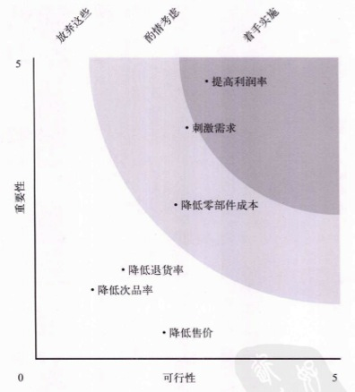
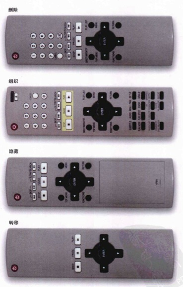
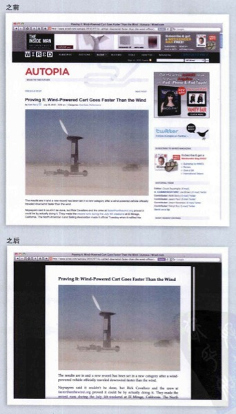
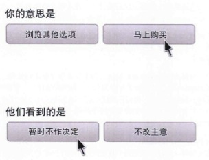
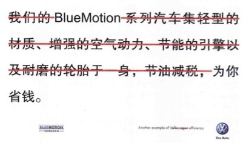
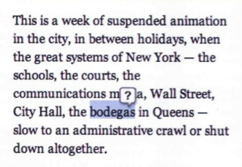

##话说简单

1、简单并不意味着最少化。朴素的设计仍然具有自身的特征和个性。简单并不意味着欠缺或低劣，也不意味着不注重装饰或完全赤裸裸。而是说装饰应该紧贴设计本身，任何无关的要素都应该予以剔除。换句话说，抛开极简主义，也能够成就简单。简单的特征和个性应该源自你使用的方法、所要表现的产品以及用户执行的任务。

自行车有两个轮子，为了简单把它精简为一个轮子，那它还是自行车吗？你骑着试试？

2、“一个汽车公司的主管的工作就是简化产品功能，但是只要他说去掉某项功能，总有销售人员会对说：我的一个客户极为看重那项功能。即使这个客户对公司的整体销售量没什么影响，但销售人员仍然会说：没办法，那可是我最重要的客户啊。”

要解决这样的矛盾，必须搞清楚简化用户体验会如何影响公司运作的每一项。比如大多数公司是这样运作的：汽车销售量 * 汽车单价 - 成本 = 利润。那么简化产品后，公司能卖出更多车（例如，更符合用户的需要），还是能够提高价格（因为能给人更先进的感觉），还是能降低成本（因为零部件采购价格更便宜）？然后还要将这些排出先后次序，比价好的做法是对每项的重要性和可行性做出评估。

##明确认识

3、三种用户。

- 专家型用户：愿意探索你的产品或服务，并且会给你剔除各种改进建议。他们希望看到为他们量身定做的前所未有的技术。他们舍得花时间研究新产品，探索产品的新功能。这一类用户总体上占少数。
- 随意型用户：他们可能使用过类似的产品或服务，他们有兴趣使用更高级更复杂的产品，但却不愿意接触全新的东西---要想让他们认可新功能，那么新功能必须足够简单。比如说，他们可能会对更先进的手机感兴趣，但是必须保证能够轻松地导入他们宝贵的联系人。这一类用户比你想象的少，而且他们的学习意愿不强烈。
- 主流用户：他们自己不会因为你的技术而使用你的产品，使用你产品的目的是完成某项任务。他们会掌握一些重要功能的使用方法，但永远不会产生学会所有功能的想法。这些人的口头禅就是：“我的手机只要能打电话、能发短信就行了”。大多数人属于这一类。

其中一类人几乎不可能会升级为另一类人，即使一个产品用了很多年，用户类型的标签也是不会变的。

4、忽略专家型用户，也不要中庸地选择随意型用户为目标，要为主流用户而设计。专家用户想要的功能往往会吓倒主流用户。随意型用户数量有限，而且他们技术水平相对较好，也比主流用户更具有忍耐力。如果你想设计简单的产品，记住为主流用户而设计。

5、主流用户想要什么？

- 主流用户最感兴趣的是立即把工作做完，专家则喜欢首先设定自己的偏好。
- 主流用户认为容易操控最有价值，专家则在乎操控得是不是很精确。
- 主流用户想得到靠谱的结果，专家则希望看到完美的结果。
- 主流用户害怕弄坏什么，专家则有拆解一切刨根问底的冲动。
- 主流用户觉得只要合适就行了，专家则想着必须精确匹配。
- 主流用户想看到示例和故事，专家想看到则是原理。

不要指望你能教会用户多少东西，或者认为说明书可以帮助他们。在面临压力的时候，他们很容易忘记已经掌握的知识。**简单的用户体验是初学者、新手的体验，或者是压力之下的主流用户的体验。**

6、人是有感情的动物，理解感情需求能够帮助你把握设计重点。从简单这个角度来看，最重要的是满足**让用户感到自己在掌控一切**的感情需求。

首先，用户希望感觉是在掌控自己使用的技术。

专家希望控制和定制技术。而你需要的是站在主流用户的角度来思考“掌控”的含义：掌握结果。他们才不管什么软件或技术，也不想让产品告诉自己该做什么，主流用户希望自己掌控起来容易、可靠、迅速。

其次，用户希望感觉是在掌控自己的生活。

有时候，掌控的感觉意味着要完成一个任务：女人买裙子时想要感觉掌控着自己的形象。有时候又意味着获取信息：男人看新闻就是要了解世界上发生了什么事，从而感觉自己对世界局势有所掌控。

7、用户在做什么？

通常，由于设计过程中忽略某些重要的步骤，会导致问题复杂化。比如说，大多数摄像机好像都是用来拍影像的，但是在拍摄了一段视频后，你想的是尽可能快地把他分享给朋友们，而这正是大多数摄像机的软肋。之所以人们会觉得Flip摄像机方便，就是因为它能够把两件事做得同样好。

对于用户在做什么，要关注主要的行动，并通过用户的语言来描述行动的经过。比如，对于摄像机，一开始可以写“拍摄并分享视频”，然后列出用户行动的每一个步骤，详细程度要前后一致。

##简约四策略

8、简约四策略，以简化 DVD 遥控器为例：

- 删除：去掉所有不必要的按钮，直至减到不能再减。
- 组织：按照有意义的标准将按钮划分成组。
- 隐藏：把那些不是最重要的按钮安排在活动仓盖之下，避免分散用户注意力。
- 转移：只在遥控器上保留具备最基本功能的按钮，将其他控制转移到电视屏幕上的菜单里，从而将复杂性从遥控器转移到电视。

##合理删除

9、简化设计最明显的方式是删除不必要的功能。

10、删除功能时要避免错删，而把一切难于实现的功能统统抹杀就是典型的错误做法。

11、增加价值始于改进核心体验。与新增功能相比，客户更关注基本功能的改进。

12、删掉实现得不够理想的功能。

有人可能说，删除不完整的功能或内容会导致已经付出的时间和努力白白地浪费。经济学把这种现象称为“沉没成本误区”，事实上，用于创建这部分功能的成本是不可能收回来的，因此**判定这种功能的唯一方式是看它能够发挥几分作用，看保留它会额外导致多少成本**。所以，问题绝非是“为什么应该去掉它”，而是“为什么要留着它”。因为“去掉是一种浪费”而抓住残缺的功能不放会妨碍你成功。

13、假如用户...

在一群人讨论产品的时候，通常会有人提出“假如用户想...”。这种“假如”常常会刺激人们的求全的心理，担心自己漏掉了什么需求，为了寄托这份担忧，就要有人付出时间、精力和金钱增加新功能了。如果你发现自己或别人说：“假如用户需要...”，那么只有一个答案：搞清楚这个功能对用户是否真的重要，问一问：“我们的目标用户经常会遇到这个问题吗？”如果回答是“几乎没有遇到过”，那么，请放弃这个想法，继续前进。不要再“假如”了，还是去发现问题吧。

14、不要简单地因为客户要求就增加功能。功能多了之后，通常会导致在其他某些方面做出一些牺牲，而客户不会考虑这方面的问题。增加功能不一定会让用户体验更简单，反而经常会导致更多的迷惑。

对于客户要求增加功能的需求，一种建议是去做逆向工程---搞清楚用户到底遇到了神马问题，仔细斟酌这个问题是不是应该由我们的软件来解决。

倾听客户的意见，但一定不要盲从。

15、在想要设计一款引人注意的产品时，删除功能表面上看会冒一定的风险，但是却能获得长期的收益。

2006年，罗兰.T.若斯特等人组织了一项检验功能和可用性哪一个更受用户关注的实验，结论是：功能多对于没有机会试用的消费者有吸引力，但是，在消费者使用了产品之后，他们的偏好就会改变，一下子从重视功能，变成了更重视可用性。今天，口碑、用户评论、个人推荐以及产品使用的重要性已经远远超过了大众媒体广告，消费者在选择产品之前都要听一听用户的意见，他们是已经对产品的可用性有了了解的人。因此，痛下决心，砍掉不必要的功能，要强于无意义地堆砌功能。你设计的产品如果承载更多的功能，更有可能降低主流用户的满意度。

16、删除功能会造成影响，但最开始应该考虑的是哪项功能最接近用户的核心需求。想在任何时候取悦所有用户是不可能的，应该专注于目标客户的核心任务。

17、在确定保留和删除功能时，要遵循以下原则：

- 确定用户想要达到的目的，并排定优先次序。对于DVD遥控器而言，主要目的是看DVD，其次是使用DVD的附加功能，还有一个不那么重要的目的是播放其他媒体，如音乐CD、MP3等。
- 专注于寻找能够完全满足优先级最高的用户需求的解决方案。找到之后再考虑满足用户的其他目标。
- 确定用户在使用产品过程中最常见的干扰源，并将解决这些问题的功能按难易程度排出优先次序。例如，看电视的时候来电话是一个常见的干扰，而DVD遥控器上的暂停按键就是把这种干扰降至最低程度的一个解决方案。
- 要知道能够满足主流用户的“足够好”的设计与只有专家才能看得上眼的“精准的”遥控器有什么区别。比如，一个“精准的”遥控器提供了4个直接控制快进的按钮，而绝大多数情况下，只提供两个（快进和跳到曲目末尾）足矣。
- 不要以功能的多少来认定产品的价值，应该看产品能否满足用户最高优先级的目标。

18、界面中的各种小细节会增加用户的负担，降低用户的效率。去掉哪些可有可无的选项、内容和分散人们注意力的玩意儿。去掉分散注意力的视觉元素，可以让用户感觉速度更快，而且更加有安全感。

19、选择更少，用户反而更喜欢。

2000年，希娜.S.艾扬格博士等人实验，摆摊卖果酱，一个周末，他们摆出了24种不同口味的果酱，另一个周末，他们只摆出了6种，结果证明，提供的选择多了，销售业绩反而更差。第一个周末2%的过路人买果酱，第二个周末12%的人买。

20、不要让用户分心。

21、选择聪明的默认值可以减少用户的选择。

22、主流用户不喜欢为设置选项和首选项费心劳神。

23、在用户的行为流程中，有时候，即使一个选项都嫌多，主流用户希望“够好了就行，快点”，而专家则希望“尽可能地完美，等多长时间都愿意”。所以请考虑，向用户提供的选项会不会因为追求完美而牺牲速度和简单。

24、删除视觉混乱就意味着人们必须处理的信息变少了，能够把注意力集中到真正重要的内容上。一些减少视觉混乱的方法：

- 使用空白或轻微的背景色来划分页面，而不要使用线条。因为线条在前景中，而空白和颜色在背景上，前景会更多地吸引人的注意力。
- 尽可能少使用强调。如果仅加粗就行了，就不必又加粗、又放大、又变成红色。
- 不适用粗黑线，匀称、浅色的线更好。
- 控制信息的层次。如果页面中信息的层次超过了两或三个层次，就会导致用户迷惑。比如说，少用数字、大字体或粗体字，最好总共不超过三个层次：标题、子标题和正文。
- 减少元素大小的变化。比如，在网页中，有一大块放置头条新闻，另有5小块放置次要新闻，千万不要让版面上出现大小都不同的6个区块。
- 减少元素种类的变化、整个界面中最好只使用一种按钮样式，使用三或四种就太花哨了。

25、删除文字，精简句子，减少不必要的说明。

26、“删除”策略的核心就是干掉那些分散注意力的因素，聚焦于项目。

- 聚焦于对用户有价值的功能。这意味着专注于承载用户核心体验的功能，也意味着交付的功能必须能够消除用户的挫折感，能够消除他们的焦虑。
- 聚焦于可用资源，通过删除残缺的功能、不切题的元素和花里胡哨的东西为用户提供价值。
- 聚焦于达成用户的目标。纠结于流程会陷入细节的泥潭而无法自拔。
- 删除那些干扰性的、增加用户负担的“减速带”：错误信息、不知所云的文字、不必要的选项和造成视觉混乱的元素。

##分层组织

27、画出用户的行为有助于理解如何组织你的软件产品。

28、在对一组性质相同的产品（如网上书店的书）进行分类时，确定清晰的分类标准对用户非常重要。简单的组织模式具有清晰的界限---是非分明。可以调研多一些用户，询问他们的分类标准。有时会遇到同属于两个类别的东西，太多的重叠会导致困惑，但有时候确实无法避免。

29、无论是设计还是使用，搜索都比浏览困难得多。

30、按照时间来组织活动是一种简单又通用的方式。对于一些实体对象，比如酒店和国家之类的，全都可以按照空间来组织。

31、分层：

- 尽可能使用较少的层。内容越复杂，所需的分层反而能少些。
- 考虑把某些基本元素放在常规背景层，因为一个元素很难放在两层里。
- 尽量让任意两层之间的差别最大化。
- 对于相对重要的类别，使用明亮、高饱和度的颜色，可以让它们在页面上更加突出。
- 对于同等重要的类别，利用感知分层技术，使用相同的亮度和大小，只是色调要有所区别。

##适时隐藏

32、不常用但不能少的功能通常是适合隐藏的功能。在寻找要隐藏的功能时，“设置”通常都是首选。

- 事关细节。
- 选项和偏好。
- 特定于地区的信息。

33、渐进展示。通常，一项功能会包含少数核心的供主流用户使用的控制部件，另有一些为专家级用户准备的扩展性精确的控制部件，隐藏这些精确的控制部件是保持设计简单的不错选择。比如，计算机中按鼠标左键可以执行操作调出更多选项；谷歌的高级搜索供包括更多选项。对于用户期望的功能，要在正确的环境下给出明确的提示。

34、阶段展示。随着用户的逐步深入界面而展示相应的功能。比如，把一个复杂的表单分为几个阶段一步一步展示给用户来填写。在流程中的每一步都符合用户心理预期的情况下，阶段展示的效果最好。

35、适时出现。尽可能彻底地隐藏所有需要隐藏的功能，只在合适的时机、合适的位置上显示相应的功能。过分强调隐藏功能可能会导致混乱。

36、提示和线索。为隐藏的功能选择一个标签，比如“更多”、“高级”等，这些方案虽然常见，但并不理想。Adobe Illustrator的解决方案很巧妙：有些具备高级特性的绘图工具在工具箱中会以一个小三角形图标表示。单击一次选择基本工具，单击并按住鼠标不妨就会看到高级选项。优点在于它采用了应邀探索设计模式，而非一个试图介绍更多功能的标签。

37、把标签放在哪里比把标签做多大要重要得多。根据实践表明：就算标签再大，如果把它放到了用户关注点之外，用户也看不到，即使一个非常小的标签，只要把它放在用户关注点上，也会收到良好的效果。

38、保证用户在前进的过程中能够遇到提示，但，不要挡住他们的去路。

39、隐藏策略需要做到以下几点：

- 隐藏一次性设计和选项。
- 隐藏精确控制选项，但专家 用户必须能够让这些选项始终保持可见。
- 不可强迫或寄希望于主流用户使用自定义功能，不过可以给专家提供这个选项。
- 巧妙地隐藏。换句话说，首先是彻底隐藏，其实是适时出现。

##巧妙转移

40、有些功能在有的平台上简单，而在其他平台上就会变得复杂。

比如，在网站上输入数据比较容易，填入详细的表单比较合适。但是在手机上输入太多信息就相对比较麻烦了。

41、移动平台与桌面平台对比：

- 可以拍摄任何景物 vs 只能拍到用户
- 输入少量文本 vs 输入大量文本
- 很难加快数据传输速度 vs 能适当加快数据传输速度
- 显示少量信息 vs 显示大量信息
- 保存适量信息 vs 保存大量信息
- 随时随地使用 vs 只能坐下来使用
- 能够精确识别位置和方向 vs 只能在某种程度上标识位置
- 通过无线网络连接到其他设备 vs 通过有线网络连接到其他设备

42、把复杂性向用户转移。

做了一个智能旅行规划程序，从一张地图开始，让用户选择心仪的地点，停留的时间，然后把选中的地点放在行程中，还可以重排旅行顺序，提供就餐、住宿等信息。结果用户反馈很差，觉得限制太多。
后来改进为，把复杂的行程安排工作交给用户自己处理，他们可以自己创建文件夹，任意起名，在里面放他们想要的任何东西。

计算机擅长精确地保存各种信息，而人不适合记忆细节信息。所以记忆任务交给计算机。计算机善于精确地计算，而旅行规划需要的是估算以及如何安排一天的行程，这两件事最适合人来做，所以把这些工作留给用户。

**让用户感觉简单的一个重要前提，就是先搞清楚把什么工作交给计算机，把什么工作留给用户。**

- 人适合设定目标和制定规划 vs 计算机适合执行程序
- 人适合估算 vs 计算机适合精确计算
- 人适合辨别信息 vs 计算机适合存储和检索信息
- 人适合做图表 vs 计算机适合复制
- 人适合在包含少数项的列表中选择 vs 计算机适合对大型列表排序
- 人适合做预算 vs 计算机适合度量
- 人适合想象 vs 计算机适合交叉引用详细信息

**用户指挥，计算机操作，就会给人简单的感觉。**

43、在有些汽车中，给后挡风玻璃加热的电阻丝，同时也是收音机天线。这是一种简化设计的方法。在软件设计中，让某项功能具有多种用途也是一种简化之道。把相似的功能绑定到一起，这种简化方式非常巧妙。虽然多合一的功能不一定能完美实现各种用途，但却具有明显的优点。找一个功能总比在几个类似功能中选择容易，学习一个功能也比学习多个功能容易。

44、简单界面的最高境界，应该是专家和主流用户都会感觉它非常好用。无论是专家还是新手都感觉用起来很简单，让用户自己定义成功很重要。我们要做的，就是为他们提供一个简单的工具，让他们恩能够自由发挥想象力，最终帮他们达成目标。想想菜刀和钢琴。

45、简单的体验需要信任。计算机之所以搞得用户不舒服，就是因为它们总是控制和指挥用户。

##最后
46、到了设计简单用户体验的最后，往往不是问“怎样才能把这个功能设计得更简单”，而是问“到底应该把这个复杂性放到哪里”。

- 这个任务应该是自动化的（像Flip的自动对焦功能），还是应该由用户来控制（如iPhone中通过触摸屏幕来对准相机焦距）？
- 界面中是应该包含很多功能特定的按钮（像高保真音响），还是只放一些通用的按钮（像iPod）？
- 这个任务是应该一次完成（如登陆Facebook），还是应该分几段时间来完成（像定制Tumblr博客）？
- 这个任务是应该让用户有意识地去处理（如使用屏幕上的控件来筛选搜索结果），还是应该在无意间完成（如查看伦敦地铁图中的绿色线路）？

**创造简单用户体验的秘诀就在于把复杂性转移到正确的地方，让用户每时每刻都能感受到简单之美。**

47、细节。一个地铁线路查询软件规划好了线路，计算好了时间，却没告诉用户到了地铁站该往哪个方向坐。

48、让软件具有可用性，意思就是绝不能超出用户的能力范围。可是，用户总是想拥有更详细的信息、更多的选择、更多的功能---这是人的本性。但是，设计简单体验不能朝着最大化的方向努力，这种设计思想会导致用户手里大量的功能闲置。

49、简单的体验应该为用户留出足够的空间，让他们能够想象到当前正在做的事情同样也是自己生活的一部分。

50、不要让你的设计干扰用户的思绪。简单的设计能够为用户留出足够的空间，他们会自己用自己的生活来填充这些空间，从而创造出更丰富、更有意义的体验。

[SamirChen]: http://samirchen.com "SamirChen"
[1]: {{ page.url }} ({{ page.title }})
[2]: http://samirchen/reading-notes-suwmid/