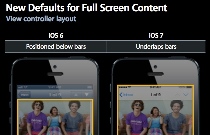

自 iOS 7 以后苹果开始默认对 View Controller 采用全屏布局，全屏布局的意思就是 View Controller 的 layout 是填满整个屏幕的，这在 View Controller 界面中有 Status Bar(20）、Navigation Bar(44)、Tab Bar(49)、Tool Bar(44) 的时候与以往的布局方式有着明显的差异。全屏布局的情况下，View Controller 的 layout(self.view) 会被盖在这些 Bar 下面。

伴随着全屏布局，iOS 7 以后 View Controller 添加了几个相关的属性来方便我们来做页面布局：

	@property (nonatomic,assign) UIRectEdge edgesForExtendedLayout NS_AVAILABLE_IOS(7_0); // Defaults to UIRectEdgeAll
	@property (nonatomic,assign) BOOL extendedLayoutIncludesOpaqueBars NS_AVAILABLE_IOS(7_0); // Defaults to NO, but bars are translucent by default on 7_0.  
	@property (nonatomic,assign) BOOL automaticallyAdjustsScrollViewInsets NS_AVAILABLE_IOS(7_0); // Defaults to YES

## edgesForExtendedLayout

通过 `edgesForExtendedLayout` 这个属性来设置你的 View Controller 页面的哪一侧会延伸至屏幕边缘。可选值有：UIRectEdgeNone、UIRectEdgeTop、UIRectEdgeLeft、UIRectEdgeBottom、UIRectEdgeRight、UIRectEdgeAll。默认值是 UIRectEdgeAll，即 View Controller 的布局是全屏填满。

在有 NavigationBar、TabBar、TooBar 等系统 Bar 的情况下，该属性设置为 UIRectEdgeAll 时，View Controller 的页面会被这些 Bar 盖住部分；而当该属性设为 UIRectEdgeNone 的时候，View Controller 的页面布局会限制在这些 Bar 之间。

我们可以在 View Controller 的 `- (void)viewWillLayoutSubviews` 方法中打印出 self.view 的 frame 来观察这个属性带来的影响。我们以 iPhone 4s 的 320*480 的屏幕尺寸为例：

- 设置 edgesForExtendedLayout 为 UIRectEdgeAll，不管是有 NavigationBar、TabBar、TooBar 哪一种 Bar，self.view 的 frame 均为 (0, 0, 320, 480)。
- 设置 edgesForExtendedLayout 为 UIRectEdgeNone：
	- 有 NavigationBar 和 TabBar，self.view 的 frame 为 (0, 64, 320, 367)。即 self.view 的布局的起点从 NavigationBar 下开始，高度去掉了 StatusBar、NavigationBar 和 TabBar 的高度：20、44、49。
	- 有 NavigationBar 和 ToolBar，self.view 的 frame 为 (0, 64, 320, 372)。即 self.view 的布局的起点从 NavigationBar 下开始，高度去掉了 StatusBar、NavigationBar 和 ToolBar 的高度：20、44、44。

需要注意的是：如果你在 `- (void)viewDidLoad` 方法中观察 self.view 的 frame 得到的结果始终是 (0, 0, 320, 480)，可见这个值的不对的，所以当我们需要对页面进行布局时正确的方式是在 `- (void)viewWillLayoutSubviews` 中处理。

## extendedLayoutIncludesOpaqueBars

`extendedLayoutIncludesOpaqueBars` 这个属性是对 `edgesForExtendedLayout` 的补充。它的意思当 NavigationBar、TabBar、TooBar 这些 Bar 不是半透明时(Bar 的 translucent 属性值为 NO)，如果设置 extendedLayoutIncludesOpaqueBars 为 NO，则不会将 View Controller 的页面布局延伸至全屏，如果设置为 YES，则坚持延伸至全屏。

从 iOS 7 开始，NavigationBar、TabBar、TooBar 这些 Bar 默认都是半透明的，这时这个属性不会起到效果。

## automaticallyAdjustsScrollViewInsets

当我们采用全屏布局设置了 edgesForExtendedLayout 为 UIRectEdgeAll，而此时 View Controller 的 self.view 的第一个 Subview 是 UIScrollView 类型或其子类型(如：UITableView 等)时，`automaticallyAdjustsScrollViewInsets` 这个属性就会被用来辅助我们对 UIScrollView 类的视图进行布局。automaticallyAdjustsScrollViewInsets 默认值即为 YES。

拿 UITableView 来举例，你希望你的 UITableView 的内容从 NavigationBar 底部开始展示(因为不这样的话就会被 NavigationBar 遮住一部分)，同时还需要在滑动时，UITableView 的布局又能填满全屏。这时你只需要设置 automaticallyAdjustsScrollViewInsets 为 YES 即可，系统会帮你调整 UITableView 的 contentInset 来实现效果使其中的内容不会被 NavigationBar、TabBar、TooBar 挡住。你可以同样在 `- (void)viewWillLayoutSubviews` 观察 UITableView 的 contentInset 的值。

当你设置它为 NO 时，UITableView 的 contentInset 则不会被被设置。

[SamirChen]: http://www.samirchen.com "SamirChen"
[1]: {{ page.url }} ({{ page.title }})
[2]: http://samirchen.com/ios-view-controller-full-screen-layout/
