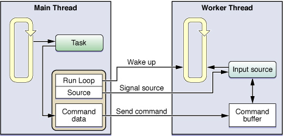

文章的主要内容源自苹果的官方文档：[Run Loops][3]

## Run Loop概念

通过某种设计设计，使得当一个线程运行的同时，还可以从其它线程里往它里面随意增加或去掉不同的计算任务，这就是 NSRunLoop 的初衷。Run Loop是和线程相关的基础框架的一部分。一个Run Loop就是一个**事件处理的循环**，用来不停地调度和协调接收到的各种事件。使用Run Loop的目的就是调度好线程让其有活干活，没活休息。

Run Loop的管理**不是完全自动的**，所以需要我们自己设计线程代码在合适的时候去启动它并正确地响应输入事件。为此，Cocoa和Core Foundation提供了Run Loop Objects来帮助我们配置和管理线程的Run Loop，每个线程都有对应的Run Loop Objects。通常，在我们的代码里需要**提供while或for循环这些控制语句来驱动Run Loop**，在我们的循环中，我们使用Run Loop Objects来运行事件处理代码，它们响应接收到的事件并运行对应的处理代码。

在Carbon和Cocoa程序中，**主线程**会自动创建并运行它的Run Loop，作为一般应用程序启动过程的一部分，而**辅助线程**需要显式地运行它的Run Loop。

## Run Loop事件源

Run Loop对象处理的事件源分为两种：**input sources**和**timer sources**。

* input sources：用分发异步事件，通常是用于其他线程或程序的消息，比如：`performSelector:onThread:...`。

* timer sources：用分发同步事件，通常这些事件发生在特定时间或者重复的时间间隔上，比如：`[NSTimer scheduledTimerWithTimeInterval:target:selector:...]`。

上面图中展示了Run Loop的概念结构及各种事件源。其中**input source**分发异步事件给相应的处理程序并且调用`runUntilDate:`方法（这个方法会在该线程关联的`NSRunLoop`对象上被调用）来退出其Run Loop。**timer source**分发事件到相应的处理程序，但不会引起Run Loop退出。

Run Loop除了处理各种事件外，同时会**生成关于Run Loop行为相关的通知(Notifications)**，注册**run-loop observers**可以接收到这些通知并根据情况去在线程上做相应的处理。

### Run Loop Mode

Run Loop Mode是指**要被监听的事件源(包括input sources和timer sources)的集合 + 要被通知的run-loop observers的集合**。

在你运行一个Run Loop时，你会为它显示或隐式地指定一个mode。这之后，在这个Run Loop中，只有与这个mode关联的事件源才会被监听并被允许分发事件，同理，也只有与这个mode关联的observer才会被通知。和其他mode关联的事件源只有当Run Loop运行在对应的mode下才会分发相应的事件过来，否则就处于暂停状态。

在我们的代码中，我们需要通过名字指定mode，Cocoa和Core Foundation定义了一个默认的mode和一些常用mode，比如：`NSDefaultRunLoopMode(Cocoa)、kCFRunLoopDefaultMode (Core Foundation)、NSEventTrackingRunLoopMode(Cocoa)`等等，你通常可以用上它们。当然，你也可以自定义一个mode，名字随便设置，但是里面的内容就要讲究些了：要正确添加一个或多个input sources或timer sources和对应的run-loop observers，让它能正常工作起来。在一次Run Loop循环中，我们使用mode来从sources中筛选事件。

要注意的是：**mode是基于事件的源来做区别的，而不是事件的类型。****事件的源**这个概念比**事件的类型**这个概念更细，比如：我们可以让一个mode只匹配鼠标点击事件，或者只匹配键盘事件，尽管它们的事件类型有可能都是外设输入事件，但是它们的事件源不一样，mode也能区分开。再比如：我们可以用不同的mode区监听不同的端口，尽管它们都是端口事件，但是源不同，就也能由mode区分开。

下图列出了Cocoa和Core Foundation中定义的一些modes：

### Input Sources

上面已经说过了，input sources用异步的方式分发事件到你的线程。一共有两种input sources：**基于端口的input source**和**自定义的input source**。

基于端口的input source监听程序的Mach Ports，由系统内核来自动通知它。自定义的input source则需要手动从其他线程通知它。

#### 基于端口的input source

Cocoa和Core Foundation中直接用端口相关的对象和函数就能创建基于端口的input source。值得一提的是，在Cocoa中，你不需要自己直接创建input source，你只用创建一个port对象，并NSPort的相关方法将这个port添加到对应的run loop中就可以了，这个port对象会自己创建和配置所需要的input source。在Core Foundation中，则需要你自己创建port对象和其需要的run loop source。

##### 配置基于port的input source的例子(Cocoa)

先来看看在main thread中实现的代码：

在下面的代码中，在主线程创建了一个port对象并把它添加到主线程的run loop。当启动附属线程时，把这个port对象同时传递给附属线程，这样附属线程就能使用这个port对象给主线程发回消息了。也就是说worker thread到main thread的单向通信是没问题了。

	// Main thread launch method
	-(void)launchThread {
	    NSPort* myPort = [NSMachPort port];
	    if (myPort) {
	        // This class handles incoming port messages.
	        [myPort setDelegate:self];
	 
	        // Install the port as an input source on the current run loop.
	        [[NSRunLoop currentRunLoop] addPort:myPort forMode:NSDefaultRunLoopMode];
	 
	        // Detach the thread. Let the worker release the port.
	        [NSThread detachNewThreadSelector:@selector(LaunchThreadWithPort:)
	               toTarget:[MyWorkerClass class] withObject:myPort];
	    }
	}

为了建立起不同线程双方的通信通道，我们还需要在上面的基础上建立起main thread到worker thread方向的通信，这就需要我们把worker thread的本地port在check-in消息中传回给main thread。这里的check-in信息是很重要的，它可以让main thread知道启动worker thread的过程都一切正常，并且可以拿到workder thread的本地port用来发送下一步的消息给worker thread。

下面的`handlePortMessage:`方法会在数据到达线程自己的本地port时被调用(还记得上面已经在主线程的run loop中添加port这件事吧)。这里是在主线程中实现的，也就是说worker thread回发check-in消息给主线程的那个port时，会调用这个方法。此外，关于`kCheckinMessage`这个消息id后面worker thread拿着它有用。

	#define kCheckinMessage 100
	 
	// Handle responses from the worker thread.
	- (void)handlePortMessage:(NSPortMessage *)portMessage {
	    unsigned int message = [portMessage msgid];
	    NSPort* distantPort = nil;
	 
	    if (message == kCheckinMessage) {
	        // Get the worker thread’s communications port.
	        distantPort = [portMessage sendPort];
	 
	        // Retain and save the worker port for later use.
	        [self storeDistantPort:distantPort];
	    }
	    else {
	        // Handle other messages.
	    }
	}

下面接着说说在worker thread中要实现的代码：

`LaunchThreadWithPort:`方法中主要就是配置这个线程，包括创建这个线程的**autorelease pool**，并创建一个实例来使用主线程传过来的port对象给主线程回发check-in消息。关于`sendCheckinMessage:`方法，接着往下看吧。

	+(void)LaunchThreadWithPort:(id)inData {
	    NSAutoreleasePool*  pool = [[NSAutoreleasePool alloc] init];
	 
	    // Set up the connection between this thread and the main thread.
	    NSPort* distantPort = (NSPort*)inData;
	 
	    MyWorkerClass*  workerObj = [[self alloc] init];
	    [workerObj sendCheckinMessage:distantPort];
	    [distantPort release];
	 
	    // Let the run loop process things.
	    do {
	        [[NSRunLoop currentRunLoop] runMode:NSDefaultRunLoopMode
	                            beforeDate:[NSDate distantFuture]];
	    }
	    while (![workerObj shouldExit]);
	 
	    [workerObj release];
	    [pool release];
	}

`sendCheckinMessage`方法创建了worker thread的本地port，并把它一起带着check-in消息回发给主线程了。这里看到`kCheckinMessage`这个消息id被用到了吧。再回去看看主线程中实现的`handlePortMessage:`方法，应该就能理解main thread和worker thread之间是怎么基于port来勾搭了。

	// Worker thread check-in method
	- (void)sendCheckinMessage:(NSPort*)outPort {
	    // Retain and save the remote port for future use.
	    [self setRemotePort:outPort];
	 
	    // Create and configure the worker thread port.
	    NSPort* myPort = [NSMachPort port];
	    [myPort setDelegate:self];
	    [[NSRunLoop currentRunLoop] addPort:myPort forMode:NSDefaultRunLoopMode];
	 
	    // Create the check-in message.
	    NSPortMessage* messageObj = [[NSPortMessage alloc] initWithSendPort:outPort
	                                         receivePort:myPort components:nil];
	 
	    if (messageObj) {
	        // Finish configuring the message and send it immediately.
	        [messageObj setMsgid:kCheckinMessage];
	        [messageObj sendBeforeDate:[NSDate date]];
	    }
	}

可以看到，NSPort提供了一个挺清晰的线程间通信的方案。但是在iOS中，这个用的并不多，因为大多数情况，我们都可以用系统提供给我们的`performSelector:onThread:...`来搞定了，关于**Cocoa Perform Selector Sources**，在后面的**自定义的input source**中会提到。

##### 配置一个NSMessagePort对象

`NSMessagePort`主要用于本机分布式连接通信。它的解释是这样的：

- NSMessagePort is a subclass of NSPort that can be used as an endpoint for distributed object connections (or raw messaging). NSMessagePort allows for local (on the same machine) communication only. A companion class, NSSocketPort, allows for both local and remote communication, but may be more expensive than NSMessagePort for the local case.

题外话：没怎么用过，看起来好像可以拿这个可以做App之间的通信。不过不知道在哪看过说iOS下只能用NSMachPort。

对于`NSMessagePort`，那就不能简单的在线程间直接传来传去了，远程的message port需要用名字来获取，所以Cocoa中是要用一个名字来注册本地message port的，然后把名字传给remote thread来获得对应的port对象进而进行通信。大体代码如下：

	NSPort* localPort = [[NSMessagePort alloc] init];
	 
	// Configure the object and add it to the current run loop.
	[localPort setDelegate:self];
	[[NSRunLoop currentRunLoop] addPort:localPort forMode:NSDefaultRunLoopMode];
	 
	// Register the port using a specific name. The name must be unique.
	NSString* localPortName = [NSString stringWithFormat:@"MyPortName"];
	[[NSMessagePortNameServer sharedInstance] registerPort:localPort name:localPortName];

回头看看上面的代码，对port这个东西的概念多多少少清晰些了，但是其实没多少对input source的感觉，因为前面已经说了，Cocoa不用我们自己直接创建input source，直接拿port对象来用就可以了。接下来来看看在Core Foundation中是如何配置基于port的input source的，这里应该可以感受下input source。

##### 配置基于port的input source的例子(Core Foundation)

这里主要展示如何在Core Foundation中创建main thread和worker thread之间的双向通信机制。

在`MySpawnThread()`中是主线程启动worker thread的代码。首先是创建了**CFMessagePortRef**的这样一个port来监听worker thread的消息，而worker thread需要这个port的名字来建立连接，所以port的名字被传递给worker thread的入口函数了。注意这个port名字要是唯一的。

	// Attaching a Core Foundation message port to a new thread
	#define kThreadStackSize        (8 *4096)
	 
	OSStatus MySpawnThread() {
	    // Create a local port for receiving responses.
	    CFStringRef myPortName;
	    CFMessagePortRef myPort;
	    CFRunLoopSourceRef rlSource;
	    CFMessagePortContext context = {0, NULL, NULL, NULL, NULL};
	    Boolean shouldFreeInfo;
	 
	    // Create a string with the port name.
	    myPortName = CFStringCreateWithFormat(NULL, NULL, CFSTR("com.myapp.MainThread"));
	 
	    // Create the port.
	    myPort = CFMessagePortCreateLocal(NULL,
	                myPortName,
	                &MainThreadResponseHandler,
	                &context,
	                &shouldFreeInfo);
	 
	    if (myPort != NULL) {
	        // The port was successfully created.
	        // Now create a run loop source for it.
	        rlSource = CFMessagePortCreateRunLoopSource(NULL, myPort, 0);
	 
	        if (rlSource) {
	            // Add the source to the current run loop.
	            CFRunLoopAddSource(CFRunLoopGetCurrent(), rlSource, kCFRunLoopDefaultMode);
	 
	            // Once installed, these can be freed.
	            CFRelease(myPort);
	            CFRelease(rlSource);
	        }
	    }
	 
	    // Create the thread and continue processing.
	    MPTaskID taskID;
	    return(MPCreateTask(&ServerThreadEntryPoint,
	                    (void*)myPortName,
	                    kThreadStackSize,
	                    NULL,
	                    NULL,
	                    NULL,
	                    0,
	                    &taskID));
	}

`MainThreadResponseHandler`是在主线程中处理worker thread回发消息的方法。当worker thread的消息到达，它就会被分发到这个方法来处理。

	#define kCheckinMessage 100
	 
	// Main thread port message handler
	CFDataRef MainThreadResponseHandler(CFMessagePortRef local,
	                    SInt32 msgid,
	                    CFDataRef data,
	                    void* info) {
	    if (msgid == kCheckinMessage) {
	        CFMessagePortRef messagePort;
	        CFStringRef threadPortName;
	        CFIndex bufferLength = CFDataGetLength(data);
	        UInt8* buffer = CFAllocatorAllocate(NULL, bufferLength, 0);
	 
	        CFDataGetBytes(data, CFRangeMake(0, bufferLength), buffer);
	        threadPortName = CFStringCreateWithBytes (NULL, buffer, bufferLength, kCFStringEncodingASCII, FALSE);
	 
	        // You must obtain a remote message port by name.
	        messagePort = CFMessagePortCreateRemote(NULL, (CFStringRef)threadPortName);
	 
	        if (messagePort) {
	            // Retain and save the thread’s comm port for future reference.
	            AddPortToListOfActiveThreads(messagePort);
	 
	            // Since the port is retained by the previous function, release
	            // it here.
	            CFRelease(messagePort);
	        }
	 
	        // Clean up.
	        CFRelease(threadPortName);
	        CFAllocatorDeallocate(NULL, buffer);
	    }
	    else {
	        // Process other messages.
	    }
	 
	    return NULL;
	}

`ServerThreadEntryPoint`是worker thread的入口函数，这里worker thread获取主线程的port名字并用它来建立到主线程的remote connection，接着创建自己的本地port并添加到自己的run loop中，然后给主线程发回包含自己本地port名的check-in消息。

	OSStatus ServerThreadEntryPoint(void* param) {
	    // Create the remote port to the main thread.
	    CFMessagePortRef mainThreadPort;
	    CFStringRef portName = (CFStringRef)param;
	 
	    mainThreadPort = CFMessagePortCreateRemote(NULL, portName);
	 
	    // Free the string that was passed in param.
	    CFRelease(portName);
	 
	    // Create a port for the worker thread.
	    CFStringRef myPortName = CFStringCreateWithFormat(NULL, NULL, CFSTR("com.MyApp.Thread-%d"), MPCurrentTaskID());
	 
	    // Store the port in this thread’s context info for later reference.
	    CFMessagePortContext context = {0, mainThreadPort, NULL, NULL, NULL};
	    Boolean shouldFreeInfo;
	    Boolean shouldAbort = TRUE;
	 
	    CFMessagePortRef myPort = CFMessagePortCreateLocal(NULL,
	                myPortName,
	                &ProcessClientRequest,
	                &context,
	                &shouldFreeInfo);
	 
	    if (shouldFreeInfo) {
	        // Couldn't create a local port, so kill the thread.
	        MPExit(0);
	    }
	 
	    CFRunLoopSourceRef rlSource = CFMessagePortCreateRunLoopSource(NULL, myPort, 0);
	    if (!rlSource) {
	        // Couldn't create a local port, so kill the thread.
	        MPExit(0);
	    }
	 
	    // Add the source to the current run loop.
	    CFRunLoopAddSource(CFRunLoopGetCurrent(), rlSource, kCFRunLoopDefaultMode);
	 
	    // Once installed, these can be freed.
	    CFRelease(myPort);
	    CFRelease(rlSource);
	 
	    // Package up the port name and send the check-in message.
	    CFDataRef returnData = nil;
	    CFDataRef outData;
	    CFIndex stringLength = CFStringGetLength(myPortName);
	    UInt8* buffer = CFAllocatorAllocate(NULL, stringLength, 0);
	 
	    CFStringGetBytes(myPortName,
	                CFRangeMake(0,stringLength),
	                kCFStringEncodingASCII,
	                0,
	                FALSE,
	                buffer,
	                stringLength,
	                NULL);
	 
	    outData = CFDataCreate(NULL, buffer, stringLength);
	 
	    CFMessagePortSendRequest(mainThreadPort, kCheckinMessage, outData, 0.1, 0.0, NULL, NULL);
	 
	    // Clean up thread data structures.
	    CFRelease(outData);
	    CFAllocatorDeallocate(NULL, buffer);
	 
	    // Enter the run loop.
	    CFRunLoopRun();
	}

一旦进入这个worker thread的run loop，所有发送给它的port的事件都将在`ProcessClientRequest`方法中处理，这个方法的实现根据worker thread的功能而定，这里就不实现了。

	ProcessClientRequest {
		// ...
	}

上面的代码里，明确的体现了创建input source的过程，有点感觉了。

#### 自定义的input source

要创建自定义的input source，需要用到Core Foundation中与**CFRunLoopSourceRef**相关的函数，需要用到几个回调函数来配置自定义的input source，Core Foundation会在不同的点上调用它们来配置这个source、处理到来的事件、在run loop结束的时候移除source等等。

这一部分的详细信息，可以参考[苹果官方文档：Run Loops-Defining a Custom Input Source][4]。

##### 创建自定义的input source

创建自定义的input source需要定义以下内容：

1. 你的input source需要处理的信息。
2. 让其他线程和你的input source交互的调度例程。
3. 处理其他线程的请求的处理例程。
4. 使该input source失效的取消例程。

上面的这些都是很关键的，但是跟你自定义的input source相关的其他大部分行为都发生在上面这些例程之外，比如你需要定义传输数据到你的input source的机制，你需要定义你的input source和其他线程的通信机制等等。

下图展示了一个配置自定义input source的例子。
其中主线程持有input source的引用、自定义的command buffer的应用、添加了该input source的run loop的应用。
当主线程有一个任务需要分发给worker thread时，它就发送一个command到command buffer，附带的还有worker thread执行该任务需要的相关信息（由于worker thread的input source和主线程都能够访问command buffer，所以对这个buffer的访问必须是同步的来保证线程安全）。当command从主线程发出，主线程接着就告诉input source来唤醒worker thread的run loop。接着，run loop收到唤醒消息被叫起来干活，它就调用input source定义的相应处理例程来处理command buffer中的command(带信息的)。

##### Cocoa Perform Selector Sources

下面说说Cocoa为我们提供的自定义的input source：**Cocoa Perform Selector Sources**。

Cocoa提供给我们的自定义的input sources允许我们在任何线程上去执行一个selector。和基于端口的input source一样，对一个目标线程的多个perform selector的请求是被串行处理的，这就很大地降低了多个方法在一个线程上运行带来的同步问题。和基于端口的input source不一样的是，一个perform selector source会在调用selector后把自己从run loop中移除出去。

如果想要在一个线程上 perform selector，那么这个目标线程必须有一个active run loop。对于你自己创建的线程，这就意味着你必须等到你明确启动了run loop后才会执行。run loop在每次循环中会去执行所有排队的perform selector calls，而不是每个循环迭代中只执行一个。

现在在iOS中，你可以使用perform selector source给任何线程发消息了。下面列出了的这些方法都定义在NSObject中，这些方法不会创建新的线程去执行对应的方法。

### Timer Sources

Timer Source会在预设的时间点同步地分发事件到你的线程上。Timer是线程通知自己去干活的一种方式。比如：搜索栏控件就可以使用timer，当用户输入完文字一段时间后，就可以自动开始一次搜索过程，而不是一输入就开始搜索，这里延时一下可以让用户能有足够的时间输入想输入的关键字，而避免产生无效的搜索请求。

尽管timer source产生基于时间的通知，但是timer并不是一个真正实时的机制：

- timer source和input source一样，是与你的run loop的mode相关联的，如果timer source不是处在当前你的run loop监听的mode下，timer是不会被触发的，直到你用timer source支持的mode运行run loop时才行。
- 如果timer在你的run loop执行一个其他处理例程的时候被触发了，它也不会立即执行，它会等到下一次run loop循环去调用它的处理例程时才执行。
- 如果run loop压根就没启动运行，timer也就压根不会被触发。

你可以配置timer产生事件的时间，可以只来一次，也可以循环着来。但是注意，**一个重复的timer会基于scheduled firing time(而不是actual firing time)自动reschedule它自己**，这两个概念是有区别的，就是说timer的下一次fire是准点进行的，不管你上一次fire是否有延迟，如果延迟太长超过了设定的时间间隔，那就相当于作废了，因为到下一个fire时间点，timer已经reschedule自己了。

#### 配置Timer Sources

要配置一个timer source，你只需要创建一个timer，然后把它安排到你的run loop中去。

在Cocoa中，用下面的方法可以一次性创建和安排timer。这两个方法创建timer，并在默认模式(NSDefaultRunLoopMode)下把它添加到当前线程的run loop中。

-`·scheduledTimerWithTimeInterval:target:selector:userInfo:repeats:`
- `scheduledTimerWithTimeInterval:invocation:repeats:`

当然，我们也可以自己创建NSTimer对象再安排它，然后用`addTimer:forMode:`把它添加到一个run loop中。

示例代码：

	NSRunLoop* myRunLoop = [NSRunLoop currentRunLoop];
	 
	// Create and schedule the first timer.
	NSDate* futureDate = [NSDate dateWithTimeIntervalSinceNow:1.0];
	NSTimer* myTimer = [[NSTimer alloc] initWithFireDate:futureDate
	                        interval:0.1
	                        target:self
	                        selector:@selector(myDoFireTimer1:)
	                        userInfo:nil
	                        repeats:YES];
	[myRunLoop addTimer:myTimer forMode:NSDefaultRunLoopMode];
	 
	// Create and schedule the second timer.
	[NSTimer scheduledTimerWithTimeInterval:0.2
	                        target:self
	                        selector:@selector(myDoFireTimer2:)
	                        userInfo:nil
	                        repeats:YES];

## Run Loop Observers

对比上面说的事件源---它们是在特定的同步事件或异步事件发生时被触发，run loop observer就不一样了，它是在run loop执行自己的代码到某一个指定位置时被触发。我们可以用run loop observers来跟踪到这些事件：

- 进入run loop的时候。
- run loop将要处理一个timer source的时候。
- run loop将要处理一个input source的时候。
- run loop将要休眠的时候。
- run loop被唤醒，并准备处理唤醒它的事件的时候。
- run loop将要退出的时候。

与timer类似，run loop observer也可以只观察一次或者反复观察。只观察一次的话，就在fire后把自己从run loop中给移除掉就行了。

当你为一个需要长时间运行的线程配置run loop时，最好是能添加至少一个input source到run loop中，这比用timer source更好，timer要么一次，触发完了，就会结束，而之后run loop也就结束了，要么循环，这样就会导致周期性地唤醒线程，这实际上是一种轮询的形式。与之相反，input source会一直等待对应的事件发生，而在事件发生前它能让线程先休眠。

下面的示例代码展示如何创建run loop observer：

	// Creating a run loop observer
	- (void)threadMain {
	    // The application uses garbage collection, so no autorelease pool is needed.
	    NSRunLoop* myRunLoop = [NSRunLoop currentRunLoop];
	 
	    // Create a run loop observer and attach it to the run loop.
	    CFRunLoopObserverContext context = {0, self, NULL, NULL, NULL};
	    CFRunLoopObserverRef observer = CFRunLoopObserverCreate(kCFAllocatorDefault,
	            kCFRunLoopAllActivities, YES, 0, &myRunLoopObserver, &context);
	 
	    if (observer) {
	        CFRunLoopRef    cfLoop = [myRunLoop getCFRunLoop];
	        CFRunLoopAddObserver(cfLoop, observer, kCFRunLoopDefaultMode);
	    }
	 
	    // Create and schedule the timer.
	    [NSTimer scheduledTimerWithTimeInterval:0.1 target:self
	                selector:@selector(doFireTimer:) userInfo:nil repeats:YES];
	 
	    NSInteger loopCount = 10;
	    do {
	        // Run the run loop 10 times to let the timer fire.
	        [myRunLoop runUntilDate:[NSDate dateWithTimeIntervalSinceNow:1]];
	        loopCount--;
	    }
	    while (loopCount);
	}

下面的代码只展现了进入一个线程的骨干代码：

	// Running a run loop
	- (void)skeletonThreadMain {
	    // Set up an autorelease pool here if not using garbage collection.
	    BOOL done = NO;
	 
	    // Add your sources or timers to the run loop and do any other setup.
	 
	    do {
	        // Start the run loop but return after each source is handled.
	        SInt32    result = CFRunLoopRunInMode(kCFRunLoopDefaultMode, 10, YES);
	 
	        // If a source explicitly stopped the run loop, or if there are no
	        // sources or timers, go ahead and exit.
	        if ((result == kCFRunLoopRunStopped) || (result == kCFRunLoopRunFinished)) {
	            done = YES;
	        }
	 
	        // Check for any other exit conditions here and set the
	        // done variable as needed.
	    }
	    while (!done);
	 
	    // Clean up code here. Be sure to release any allocated autorelease pools.
	}

## Run Loop事件处理流程

每次运行时，你的线程的Run Loop就会开始处理等待的事件并为run loop observers生成通知。整个的处理流程大致如下：

* 1、通知observers已经进入run loop了。
* 2、通知observers所有就绪的timer就要触发了。
* 3、通知observers所有非基于端口的input source就要触发了。
* 4、触发所有就绪的非基于端口的input source。
* 5、如果一个基于端口的input source已经就绪，那就立即处理这个事件。跳转到步骤9。
* 6、通知observers线程就要休眠了。
* 7、让线程休眠，除非下面的事件发生：
	* 一个对应着基于端口的input source的事件到来。
	* 一个timer触发了。
	* run loop的超时了。
	* run loop被显示唤醒。
* 8、通知observers线程被唤醒。
* 9、处理等待的事件。
	* 如果一个用户定义的timer触发了，处理这个timer事件并且重启run loop。跳转到步骤2。
	* 如果一个input source触发了，分发这个事件。
	* 如果run loop被显式地唤醒了并且还没超时，重启run loop。跳转到步骤2。
* 10、通知observers这个run loop要退出了。

由于与timer source和input source相关的observer通知是在事件发生前发出去的，所以这些通知和真实的事件发生时间之间是存在一定的延时的。如果你需要精确的时间控制，而这个延时对你来说很致命的话，你可以使用休眠通知和唤醒通知来校队事件实际发生时间。

由于timers和其他一些周期性的事件是在你运行其对应的run loop的时候被分发的，所以当绕过这个loop的时候，这些事件的分发也会被干扰到。一个典型的例子就是当你实现一个鼠标事件追踪的例程时，你进入到一个循环里不断地向应用请求事件，由于你直接抓取这些事件而不是正常地由应用向你的例程分发，这时那些活动的timer也会无法触发，除非你的鼠标事件追踪例程退出并将控制器交给应用。

可以通过run loop object来显式地唤醒run loop。其他事件也可以唤醒run loop，比如：添加一个其他的非基于端口的input source可以唤醒run loop立即处理这个input source，而不是等到其他事件发生才处理。

## 线程安全和Run Loop对象

线程是否安全取决于你用什么API来操作你的Run Loop。Core Foundation的函数一般都是线程安全的。

Cocoa的NSRunLoop不是线程安全的，如果你使用NSRunLoop对象来修改你的run loop，那么你最好只从拥有该run loop的thread上去操作。把属于一个线程的input source或timer source再添加到其他的线程会引起崩溃。

[SamirChen]: http://www.samirchen.com "SamirChen"
[1]: {{ page.url }} ({{ page.title }})
[2]: http://samirchen.com/ios-runloop/
[3]: https://developer.apple.com/library/ios/documentation/Cocoa/Conceptual/Multithreading/RunLoopManagement/RunLoopManagement.html#//apple_ref/doc/uid/10000057i-CH16-SW1
[4]: https://developer.apple.com/library/ios/documentation/Cocoa/Conceptual/Multithreading/RunLoopManagement/RunLoopManagement.html#//apple_ref/doc/uid/10000057i-CH16-SW3