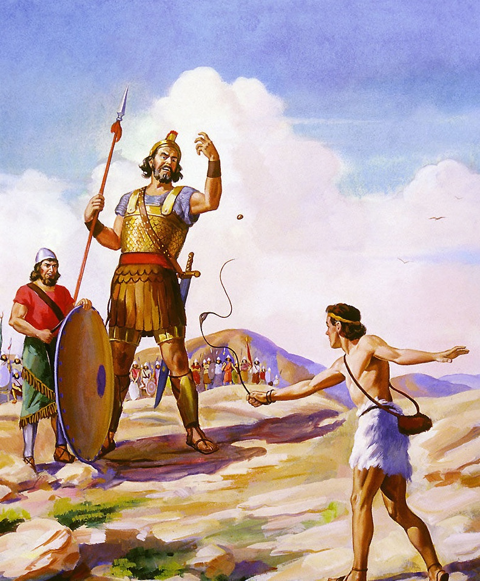
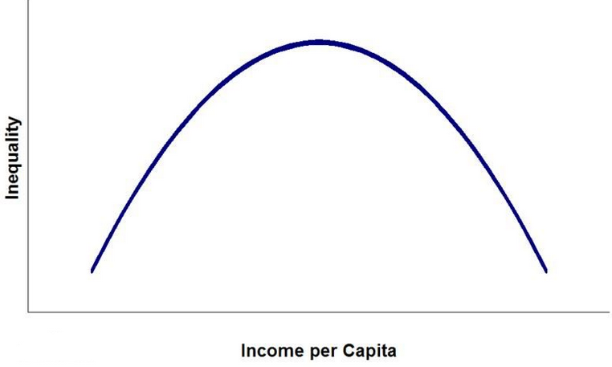

这本书读了一遍，感觉不是那么震撼，但作者确实是一个很会讲故事的人，通过各种人物经历把自己的观点引出、阐明，虽然有些地方略感牵强，但总的来说还是有点意思的。

##被误解的优势和劣势
书中开篇讲的是「弱小牧童」大卫战胜「强悍战士」歌利亚的故事。大卫没有剑没有盔甲，也没有久经战场的经验，他看起来只是一个瘦弱的牧童，而歌利亚穿着100多磅的青铜盔甲，头戴金属头盔，随身佩戴三件兵器，并且他是一个身高6英尺9英寸的巨人。乍看这场对决，简直就是歌利亚对大卫毫无悬念的碾压，而结果却是大卫用投石器和一颗石子直中歌利亚没有防护到的前额将其击倒昏厥，然后用歌利亚的剑斩下其头颅取得胜利。作者对这个故事进行了解析，从常规的眼光和思维定式中跳出来重新分析了这场对决中大卫的优势：轻装上阵十分敏捷、投石技术高超远距离也能一击必中，而这些优势正好克制着歌利亚的表面看起来强大却实际笨拙沉重的盔甲、近战武器以及巨大的身躯。所以，在这场对决中，优势的一方其实是大卫而非歌利亚。

这个故事引导我们从定式思维中跳出来重新思考优势和劣势。正如书中所说「这场决斗揭示了我们在认识力量大小方面的愚蠢」「力量也可以有其他形式：打破规则时产生的力量，用速度和出人意料攻克对手时产生的力量」「力量和强大并不总是它们看起来的那个样子」。

在后面谈到的维威克·拉纳迪夫带领一支看起来弱小的女子篮球队用全场紧逼这种非常规战术去战胜强队的故事时，作者也在反问「为什么弱队要用常规的方式打球，让强队可以更轻而易举地做自己擅长的事？」是啊，是该跳出既有的规则去思考一下了，不要屈从于常规，而要用自己的优势去战斗。和强者对抗尤其如此，不要和姚明拼身高，不要和闪电侠比速度，你才有胜算。

##倒U型曲线理论

作者在全书多处提到倒U型曲线理论，在班级学生学习成绩和班级规模的关系、父母教育与财富的关系以及后面的惩罚与犯罪的关系相关的故事上都有提到。这个理论说的简单点就是很多事情不是多多益善，而是过犹不及，刚刚好才是倒U型曲线的最高点，去找准那个临界区域吧。作者说「我们经常会混淆优势和劣势的一个原因是我们忘记自己身处U形世界了。」

##小池塘大鱼理论

在书中作者还提到了一种主张：「做小池塘里的大鱼而不是做大池塘里的小鱼」。通过印象派画家对美术展览会的选择以及卡洛琳·萨克斯对大学的选择等故事阐明了自己的主张，作者说「我们低估了那些看似是劣势的东西的发展空间。只有在小池塘，你才能获得最多的机会，去得到你想要的东西」。这也为我们在做选择做决定时提供了另外一种思路。

##值得经历的困难理论

在书中，作者谈到了阅读障碍症，以及一些有这些问题的成功人士如何从经受缺陷的过程中去获取另外的优势。这些故事给我的感觉就像是那句老话「上帝给你关上一扇门的时候，就会为你打开一扇窗。」作者提到的一种解读「也许他们的成功要部分归功于他们的缺陷，因为他们在与缺陷做斗争的过程中学到了不少东西。事实证明这种缺陷是一种巨大的优势」，在我看到未免有点牵强附会，但不妨是我们面对劣势和缺陷时一种更好的心态。

其中作者还提到一个概念叫「补偿学习」，他举了一个例子是一位有阅读障碍症的人---大卫·博伊斯要学习法律，由于他阅读能力差，所以他只能找到一种可以让他跟上别人脚步的方法，那就是听母亲念书，记住她的话，然后再复述一遍，在这个过程中，博伊斯不仅获得的是像普通人那样能轻易获得的知识，还获得了由于要克服障碍而必须练就的专注、坚韧的精神。在这个过程中，其实阅读障碍带来的结果是博伊斯获得了更多。

作者进一步挖掘缺陷带来的与众不同，而造成这些人的「不随和」，作者说「阅读障碍并不一定会导致人们变得更开放，变得更认真负责（虽然也有这种可能，就如同那些优秀的人在克服障碍中练就了品质一样）。阅读障碍最吸引人之初，是它有可能让人更容易变得不随和」。而「在这个社会中，不随和是不为人们所接受的。人类生来就有寻求周围人的认可的本能。但是如果没有挑战传统的意愿，一个激进、具有改革意义的想法寸步难行。」在这点上，萧伯纳也说过「一个理智的人会让自己去适应社会；而不理智的人则会固执地让社会去适应他。因此，这个社会所有的进步都依赖于这些不理智的人。」

总的说来，就是当我们面对困难、缺陷时，值得经历的困难理论告诉我们并不是所有的困难都是负面的，在某种情况下，这些原本负面的东西会起到正面的作用。

##权利的限制

在这一部分，有几个提法比较有趣。

「因为面对强权，所以我们才不守规矩。」

「权力的合法性原则：第一，那些被要求服从权力机构的人们必须要有发言的权利---如果他们发言的话，权力机构要能听到他们的声音；第二，法律要具备可预见性。人们要能合理地对法律进行预测，明天的法律大致和今天的法律一样；第三，权力机构必须公平。他们不能歧视任何一个群体。」

「使用权力时，必须让人看到它的合法性；使用不当的话，便会造成与预期效应相反的结果。」

就先整理这么多吧。作者在书中阐述观点时，引用了不少的故事，慢慢读来确实是挺有意思的，比空谈理论，堆砌概念要形象很多。作者的不少提法给了我们另一种思考问题的角度，值得琢磨，但总的看来却又显得意犹未尽，不够惊艳，或许是因为那些道理早已盘亘在我们身边，只是现在更清晰地被抽出来了而已。

[SamirChen]: http://samirchen.com "SamirChen"
[1]: {{ page.url }} ({{ page.title }})
[2]: http://samirchen.com/rn-art-of-battling-giants/
