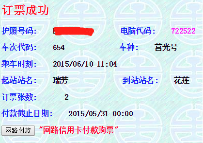

这次台湾旅行是我跟我老婆两个人的自由行，这一趟下来，首先要感谢老婆，整个过程她花费了不少心血，辛苦啦！我下面就来把这个过程梳理总结一下，希望对想去台湾自由行的朋友能有用。

我们在台湾的行程是 8 天 7 晚，大致如此：`桃园机场---台北(住 2 晚)---九份(住 1 晚)---花莲(住 1 晚)---垦丁(住 2 晚)---桃园(住 1 晚)---桃园机场`。两人包括来回机票在内的总共花费约 ￥1.2W。整个旅行的过程，给我印象最深的就是台湾人民的热情、闲适以及宝岛的美景和美食。

##准备

在我们动身出发之前，有些事情是需要提前准备的，就先说说这些事情：

###证件相关

- `大陆居民往来台湾通行证及个人旅游签注`。必备。通行证需要在各地公安机关的出入境管理部门办理，一般需要户口卡、身份证等证件。有了通行证后要记得办个人旅游签注(G 签)哦。办理一般需要 10 个工作日左右。
- `入台证`。必备。有了台湾通行证和有效签注后，接下来一般是找一家旅行社代为办理入台证。可以在淘宝上搜索`中青旅 入台证`或者`中国国旅 入台证`来拍相应的宝贝，让他们代为办理，具体流程可以找店小二咨询。**需要注意的是：入台证的办理周期在旅游旺季可能会是很长的，有时长达一个半月，所以记得计算好时间哦！**
- `华夏银行卡`。可备。华夏银行卡在大陆以外的银联取款机上每天的第一笔取款不收取手续费，还是值得一办的。

###住宿预订
去台湾旅行，可以根据自己的喜好选择你想去的城市，并规划好到各个地方游玩的先后顺序，当你制定好自己的行程后，就可以开始预订自己在各个城市的住宿了，我是比较推荐去住住各种民宿的，一般民宿的老板会很热情，能够给你在当地的游玩提供非常实用的参考建议，比如说去哪吃、去哪玩，甚至给你提供很多的帮助，比如车站接送、景点叫车等等。

住宿的预订可以选择:

- [Agoda][3]
- [Booking][4]

Agoda 是预定时就在网上付钱，支持支付宝、信用卡等。我基本上全部是在 Agoda 上预订的。Booking 据说是采用信用卡担保，到店后再付钱。

###台铁、高铁预订
在台湾旅行主要的交通形式包括了：高铁、台铁、客运（城市间）；捷运、公交（城市内）；机车、电动车（小区域）。

确定了行程后，就可以提前在网上预订高铁和台铁了，其他的就不必提前预订了。当然为了旅行便捷，可以提前下载一些工具应用：百度地图（可以提前下载好台湾离线地图）、台湾攻略、爱平生活通等等。

- [http://www.thsrc.com.tw/](http://www.thsrc.com.tw/)，预订高铁的网站。其实一般不必预订，台湾的高铁车次很多，频次很快，到站买就行了，但是高铁目前只在西海岸的几个城市(台北、新北、桃园、新竹、台中、嘉义、台南、高雄)开通了。
- [http://railway.hinet.net/](http://railway.hinet.net/)，预订台铁的网站。对，你没看错，界面是挺丑，而且用起来还很难用，能被 12306 甩开几条街，不过确实就是它。可以用护照、入台证预订，预订的时候记得记下证件号码和电脑代码，这是到时取票的凭证。预订的时候有可能出现没票的情况，这时候，可以往目的地后面多预订一站或几站，或者等到了台湾再买，一般是有票的。取票可以在 7-11 取，台湾遍地都是 7-11，里面一般都有取款机、取票机，非常便捷。

###到台湾后可以办理的

到了台湾后，为了方便旅行，可以先办这几件事：

- `兑换台币`。可以用华夏银行卡从银联取款机上直接取，也可以在机场的兑换窗口兑换，在窗口兑换要收一定的手续费。后面要乘大巴或打车马上就需要用到现金了。
- `电话卡`。一般有 7 天不限流量上网卡，并包含有限通话和短信服务的电话卡，在桃园机场就能办理。需要注意的是，有的电话卡只提供上网无限流量，但是不提供通话和短信服务，如果你需要打电话，那就别办错了。
- `青壮卡`。青壮卡是为鼓励青年认识探索台湾，带动青年旅行学习风气而发行的，建议办一个。在很多景点可以打折。比如在台北的故宫博物院，普通门票是 NT$250，而有青壮卡的话则是 NT$150。这个可以在桃园机场办理。
- `悠游卡`。捷运、公交等各种场合都可以使用，很方便，最好办一个。可以在 7-11 购买。

##我们的行程

###台北

####抵达

**桃园机场 ---(客运巴士)---> 台北车站**

在桃园机场落地后，从机场出来后便可以到巴士柜台买票坐客运巴士到台北，我们在台北住的旅店在台北车站附近，所以我们直接坐 1819 路客运巴士到台北车站，很方便。

####住宿

我们在台北住在：`玺爱旅店(Say Love Backpack House)`，地点在台北车站附近，步行 10 分钟左右。下午 6 点后入住，上午 11 点前退房，提前到的话可先寄存行李。我们住的房间很小，没有洗手间，这里是公共浴室，不过卫生做的很好，很干净。两晚费用 ￥540 左右，不包含早餐。 

具体地址：台北市中正区忠孝西路一段 72 号 3F。

联系方式：+886-223880808。

####游玩

我们在台北去的比较知名地方有这些：

- `中正纪念堂`。嗯嗯。
- `西门町夜市`。热闹，各种小店铺，可以砍价哦，我都是对半砍，再往上加。
- `台北故宫博物院`。宝贝很多，著名的`大白菜`和`红烧肉`。
- `士林夜市`。很热闹，卖水果的大妈太热情是要警惕一下的，那天我们一晚上吃了 NT$700 的水果，撑到，所以只吃了一点点别的小吃。我们是上午坐捷运到士林站下车，再转坐 18/19/255 等公交去了故宫博物院，玩到下午坐车回来捷运士林站，士林夜市就在附近，直接去逛就可以了。如果你的计划中要去故宫博物院和士林夜市，可以像我们这样安排。
- `诚品书店`。有很多分店，里面有很多在大陆看不到的书。

此外，我们便是在台北的街巷中到处瞎逛了。台北的街区有个特点，就是楼房下面都有檐廊道，代替了人行道，行人一般都在这些檐廊道下行进，下雨烈日都不用怕了，而一家家小店就排排坐一样靠在道旁。走两步突然香味扑鼻，对，这是一家包子店，或许不该叫包子，因为他家的包子是烤出来的。付钱时，老板娘会用好听的台湾腔说：谢谢！然后就可以开吃了，咬开酥脆的外衣，里面是又松又软的肉馅，咬上一口，肥而不腻，香气满溢，赶紧咬第二口，嗯，老婆已经过来开抢了(额，写着写着，我已经开始流口水，别问我店在哪，我也不记得了，你只需要去逛去遇见就行了，没准你碰到的是家牛肉面馆，他家有双宝牛肉面)。往前走到转角时，会突然感觉街旁这店似曾相识，这是你的潜意识开始起作用了，这条纹，这 Logo，对，又一家 7-11。走在街区，常常会听到耳旁呼啸而过的发动机声，那是机车，穿着热裤或短裙的女生露出修长白皙的美腿坐在后座，紧紧搂住正在猛加油门车手，他们带一黑一白的半头式头盔，在交通规则下飞驰，是一道别致的风景。

我们在台北还有很多想去的地方没去，比如 `101 大楼`、`台湾大学`等等，这些都是 Google 台北旅行攻略得到的建议。如果自由行来这边的话，还是建议多问问住宿店的老板，他们一般能给你更好更靠谱的游玩建议。在台北问路，人们会很热情的跟你说明，说着说着都能开始拉起家常，我们甚至遇到恨不得把我们直接带到目的地的路人，甚是感动。

在台北这两天的感受，总结下来可以打油一首：

> 机车满街跑，士林夜市闹，
> 街旁檐廊道，小店排排靠，
> 故宫好多宝，遍地 7-11。

哇，挺押韵的！

###九份

####抵达

推荐：**台北 ---(台铁)---> 台铁瑞芳站 ---(客运)---> 九份**

我们从台北到九份是遇到校友一起包车直接到九份老街的，每人 NT$200。不过，根据后来的经验，不建议这样去九份。推荐的方式是：到台北车站坐台铁到瑞芳站(台铁也就是一般火车啦，台铁票可以提前网上订好，也可以在台北车站现场买)，在瑞芳站下车后寄存行李，然后直接购买小火车线一日游套票，然后坐小火车游览线路上的各个地方。不过要根据情况控制好时间，对于每个站点，小火车频次都是 1 小时一趟，所以你可以选择几个站点各玩 1 小时，然后返回。游玩小火车沿线后，回瑞芳坐客运到九份。

####住宿

我们在九份是住在：`九份九重町民宿(Chiu Chunt Dint Inn)`，地点就在九份老街上，出门便是熙熙攘攘的人群和热闹的小店，下午 3 点后入住，上午 11 点前退房，提前到可以寄存行李。房间干净整洁，这次有浴室了，而且马桶很赞！一晚费用 ￥450 左右，包含早餐。这家还有山景房和海景房，不过价格就更高一些了。

具体地址：瑞芳区九份基山街29号。

联系方式：+886-224967680。

####游玩

我们当天主要游玩了这些地方：

- `九份老街`。各种小店，当然我们最关心的还是吃的，赖阿婆芋圆不错，其他吃过的居然不记得了。**需要注意的是，九份老街到晚上 6 点半左右就陆陆续续关门歇业了，这里不是夜市，这里不是夜市，这里不是夜市！**由于不知道这个情况，我们在街口的亭子看完日落才去逛老街，发现木有神马吃的了，哎！
- `瑞芳小火车沿线`。由于先去了九份逛了老街并在山上兜了一圈，所以下午才到瑞芳火车站游览小火车沿线，我们去了`猴硐站的猫村`(这里有超多的喵星人，三步一小黑，五步一小花)、`十分站的老街`就返程回瑞芳，再回九份了。

九份的夜景非常的美，站在山头往远处眺望可以看见海港边灿烂的灯光，一闪一闪，像天空里的繁星，如果你刚好是近视眼 500 度左右的话，摘下眼镜，你一定会被眼前的景象所吸引。收住视线往下看，是镶嵌在山间的一颗颗夜灯，微黄的灯光这边一团、那边一簇，映出了山路的轮廓，那轮廓一直延伸到远方某个转弯处后便消失在视野里。这时的九份没有了白天熙熙攘攘的人群，显得更加静谧恬淡了。睡了一晚，我们清晨起的还算早，于是便出门溜达了一下，此时老街上的小店几乎都还没开门，整条街空空荡荡非常安静，跟白天的热闹形成了强烈的对比。我们走出老街，顺着台阶向山上去，眼见前边是一堵石墙似乎没有路了，走近过去，石墙边角却又冒出一条石阶向上蔓延开去，一段一段这样的路，一次一次「山重水复疑无路，柳暗花明又一村」的感受。一路上，很少有行人，只有看不见的虫叫从树林出传出，偶尔路过一家小院，里面两位老人坐在树荫下的石凳上摇着大蒲扇，用我们听不懂的闽南口音拉着家常。越往上走，越能清楚的看到整个山城的面貌，远处的海港也渐渐清晰，从那边吹来的阵阵海风，吹干了头上的汗水，带来丝丝凉意。这是九份的清晨，这样的清晨，有一种神秘的氛围，叫你想就住在这山间的一院中，不计归日。

###花莲

####抵达

**九份 ---(客运)---> 台铁瑞芳站 ---(台铁)---> 台铁花莲站**

我们从九份到花莲的行程是这样的：从九份坐客运到瑞芳火车站，再坐台铁到花莲站。台铁票提前网上预订即可。一路风景颇赞，很多路段可以直接看到太平洋和白沙滩。

####住宿

我们在花莲的住宿是：`十街民宿(Ten Street B & B)`，地点在离花莲火车站还算近的地方，下午3点后入住，上午11点前退房。一晚费用 ￥270 左右，包含早餐。这家的老板非常好，刚到的时候是老板娘接待的，给我们提了很多游玩的建议；走的时候赶早车，老板开车把我们送到车站。房间布置的很有情调，屋子里很多书。老婆晚上不小心把卫生间的门反锁了，微信跟老板说，在老板的指导下，硬币开门技能 get！老板说我们是有史以来第一次把门反锁的游客哦，耶！(额，好像不是什么值得骄傲的事)

具体地址：花莲市，国富十街39号。

联系方式：+886-933482237。

####游玩

由于到的晚，走的早，我们在花莲基本上没玩什么。就去了：

- `七星潭`。很美的海岸线，碧蓝的太平洋，很美，在这里给老婆拍了很多她不满意的照片。晚上有小黑蚊，很厉害，记得涂防蚊液。
- `自强夜市`。吃的，吃的，还有投篮机。有家棺材板，哦不，官财板，很多人排队，就是面包夹一堆东西，味道还不错，他家旁边的那家果汁店也很多人排队，于是我跟我老婆分别都排了。如果我在这里开一家店，我每天就雇十几个人排队，我猜一定有像我们这样不明觉厉的游客跟风排队，科科。

花莲有很多地方还没去，准备下次来的时候再补上，比如：`太鲁阁`、`清水断崖`、`出海看海豚`、`金三角商圈美食`等等。

在花莲，进一步感受了台湾人民的热情和友善，我和老婆下午才到花莲，到住处休息一会后，在老板的帮助下叫车到了七星潭，司机在路上跟我们提示沿着沙滩往北走的风景很美，晚上有小黑蚊要注意涂防蚊液等等。以前在大连那边见过黄海，在天津那边见过渤海，现在终于见到了太平洋，这颜值简直甩开前两者好多个高圆圆。坐在沙滩上听海浪声，听困了的时候，突然见海面扑腾扑腾有东西在跳，Wow，飞鱼，窜来窜去，在海面激起的波纹跟小时候拿扁石头片在池塘打水漂的水花一个样。远处海天相接的地方，一朵一朵的云彩排排坐开，那色彩像是水墨泼上去的，飘在蓝色的海面上，看着看着总觉得是在看一副画。回头看远处的山，层峦叠嶂，深深浅浅的阴影和气势壮阔的云层黏在一起，很是美丽。

跟老婆这样拍那样拍，把太阳都拍到地平线下去了，依依不舍准备回花莲市区去自强夜市。打电话叫车，也说不清楚我们自己的位置，所以只好听电话那头的建议先往游客中心那边走。走到半道，一辆车朝我们开来，不是 Taxi，车子在我们身边停下，副驾驶的一位女生摇下车窗问我们是不是要去市区，我以为是遇到问路的游客了，正准备无奈地表示我们也是游客，司机凑过头来说，刚才他们从七星潭那边走的时候正好听到我们打电话叫车，他们去游客中心那边看了一下，好像没什么车在那边等客了，所以开回来，问我们要不要坐他们的车一起回市区。正在发愁的我们满心欢喜，一再表示感谢。上车后跟司机聊了起来，司机是一位男生，跟女生看起来是情侣的样子，他是以前在花莲读书，这次特意回来看看，也是从台北坐火车过来，在这边租车游玩。他问我们是去哪，我们说准备去自强夜市逛逛，他说他们也正准备去呢，于是直接载我们到自强夜市把我们放下，下车时再次道谢，他们祝我们玩的愉快。见他们的车离开，我才突然觉得有点后悔，后悔没留下个联系方式，也许等哪天他们去大陆的时候我能提供一点什么帮助，或者给他们寄去一张明信片表示一下谢意。我甚至开始担心和自责刚才打电话叫车了要不要再打电话过去取消，会不会有 Taxi 专门又跑去七星潭那边接驳呢？

花莲一行，短暂，却给了我很多不一样的感受。有时候，旅行的意义或许就是给我们一个视角去从他人身上看见自己。

###垦丁

####抵达

**花莲 ---(火车)---> 枋寮站 ---(客运)---> 垦丁**

从花莲到垦丁的路途算是这几天中最远的，我们是在花莲火车站坐台铁到枋寮火车站，在枋寮下车出站后再坐客运巴士到恒春转运站，我们住的地方就在恒春那里。花莲到枋寮的台铁有的会在中途比较多的站点停靠，其中就有池上站，据说这里的便当是台铁便当里最好吃的，可惜我们这次下车没有看到有卖的，听同路的人说，如果要买，最好能提前电话预约一下，他们好在准确的时间送到月台。需要注意的是，池上站停车也就 2 分钟左右，要买便当必须以迅雷不及掩耳的速度掏钱、找钱、拿便当。没吃到池上便当，是个遗憾。

####住宿

我们在垦丁的住宿是在：`Timehouse 恋恋时光渡假别墅(Time House Vacation Villa)`，下午 3 点后入住，上午 11 点前退房，提前到可以寄存行李，两晚花费 ￥550 左右，不包含早餐，本店提供电动车出租，NT$600 一天，租给房客比市价便宜，为什么提电动车，因为这是我们在垦丁游玩的重要伙伴，有了它，垦丁变得更好玩了。

我们到站后碰到一位同来自大陆，同去 Timehouse 的女生，电话联系老板后，老板带着一个店员来接我们了，开着电动车。老板把我们接到住处后又遇到一窝从大陆来的男生女生，其中好几个女生都是单独来玩，问她们为什么这么勇敢，她们说其他地方不敢单独去，台湾的话，敢。我们开心的加了群，晚上玩起了杀人游戏，这是后话。所以，旅行的时候住青旅或者住青旅一样的民宿是很有趣的事情。这家民宿的老板看起来很年轻，电话不时响起，看起来业务繁忙，一会在屋里，转眼间再找就没了踪影。女生们要老板帮忙的话，可以撒娇，他一般会不好意思拒绝。比如，一个女生租借的电动车到时了，她还想继续骑，老板说到期了，女生撒娇，老板允。

具体地址：垦丁，恒春镇，北门路 68 巷 23 号。

联系方式：+886-977449697，+886-955194002。

####游玩

垦丁沿着海岸线，以垦丁大街为中心，可以分为东西两线。我跟老婆两人租借了一台的电动车，借着它，我们用一天半的时间把两条线转了个遍，包括：

- `关山`。
- `白砂湾`。
- `猫头鼻`。
- `红柴坑`。一个小渔村，我们在这里的一个坝上看了海上日落，超美。
- `船帆石`。
- `鹅銮鼻灯塔`。
- `台湾最南点`。走过悠长的树荫道，尽头便是台湾最南点，远处的海景很美。
- `龙磐草原`。
- `风吹沙`。
- `佳乐水`。
- `垦丁大街`。第二天回来的时候转到了垦丁大街，在这里的一家餐馆吃了一道「情人的眼泪」的菜，但是不是那么好吃。
- `出火景观`。晚上跟同住民宿的几个女生一起去的，其中一个女生没电动车，请老板把他送过去，撒娇，老板允。这个景观据说是地下的天然气长期外泄到地表，被引燃而成，有人说这简直就是天然的烧烤摊嘛，对，有人在那里烤爆米花。晚上这里的蚊子很多，幸运的是一起同去的几个女生据说都是 O 型血，颇受蚊子喜爱，所以跟她们站在一起做起「电灯泡」的感觉真好，科科。
- `恒春老街`。
- `阿嘉的家`。

除了这些地方，垦丁还有`潜水`、`摩托艇`等项目，感兴趣的人可以试试。

看到上面的列表，对比前面我们游览的地方，这里明显数量暴增，这都是电动车的功劳。我刚到这里的时候还没骑过电动车，而走的时候已经能把速度上限 35 (额，不知道单位是啥) 的电动车开到 55，当然是借着下坡的势(此处提醒一句，安全第一，请勿模仿)。上面列出的这些景点都很美，我们沿着海岸线一路骑，不时就能遇到一个白色的沙滩，下去拍拍照，玩玩水，弄得一身湿，然后接着骑，在烈日下，过不了太久就又晒干了。说起烈日，真的很烈，我们准备不足，穿着短袖就出门了，路上反反复复擦了好几次防晒霜，回来却依然晒出了短袖印，直到今天还没有消退的意思。我的脚更惨，由于穿着人字拖出门，擦防晒霜时又没怎么照顾到，现在大黑脚上，一个「人」字一目了然。垦丁真是值得一来的地方，辽阔而美丽的大海、干净的白色沙滩、碧蓝的天空、繁星满满的夜空，都是那样的久违。

在这里遇到了不少从大陆来的男生女生，我跟老婆同另两个女生一同去吃小吃，调查户口的过程中，居然发现我们四个都是同省老乡；在民宿等老板的过程中，有新到的人来住宿，聊了一下天，居然是将要毕业去同一个公司工作的同事；晚上吃饭回来，跟一对情侣聊天，发现他们竟然也在是我们毕业要去的城市工作。这就是旅行的乐趣，好像总有一些连接能把你和路途中的陌生人关联起来，拉近彼此，让我们认识到更多的人，听到更多的故事。

###桃园

####抵达

推荐：**垦丁 ---(包车)---> 高雄左营高铁站 ---(高铁)---> 台北车站 ---(出租)---> 桃园住处 ---(出租)---> 桃园机场**

在老板的帮助下，我们坐私人的包车到高雄，路费每人 NT$300，然后从高雄左营高铁站坐高铁到台北车站，在台北 Shopping 了一下，便 Taxi 到桃园的住处，第二天让酒店帮忙预约车，直接到桃园机场登机，结束了台湾之行。如果不需要到台北购物，其实直接高铁到桃园高铁站即可。另外，从台北到桃园其实坐客运会更便宜，我们坐出租车花了 NT$1000。

####住宿

我们在桃园的住处是：城市商旅航空馆(City Suites Gateway Hotel)，下午 3 点后入住，上午 11 点前退房，一晚 ￥560 左右，包含早餐。这家酒店的好处在于离机场很近，但是出酒店步行过去却是不实际的，出酒店便连接着高速公路，没有人行道。酒店前台可以帮忙预约出租车，去机场的价格约定为 NT$200，还算便利。

具体地址：桃园市，大园区，中正东路442号。

联系方式：+886-33853017。

####游玩

从高雄到台北坐高铁的时候再次遇到了热情的台湾人，一位住在高雄的老爷爷，他从我们进站问路得知我们要去台北，刚好他也要去，于是便带着我们买票、上车，并约好坐在一起，老爷爷一路上给我们讲了很多故事，有他年轻时去大陆游玩的故事，有他孩子、孙子的故事，还有他朋友的故事。老爷爷自己在家种了很多竹笋，这次他去台北朋友家做客就带着早上亲自挖的竹笋当做礼物，他拿出来给我们看，确实新鲜，还带着泥土呢。他说他的竹笋不施化肥施农肥，注重环保，他家还种着芒果也是如此。我们吃午餐便当的时候，老爷爷看我们准备把不要的塑料袋扔掉，他便拿了过去，说袋子还有用，他可以用这个可以装竹笋，分给他的另一个朋友。我们同一排另一边的一位乘客脱了鞋把脚翘到前面的桌板上，老爷爷瞥见了，对我们说，在台湾很少有这样的人了。高铁的速度确实快，1 个多小时的路程，我们就到台北了，下车分开之前，老爷爷跟我互相加了微信，他说等我有机会再来高雄的时候可以跟他联系，他可以带我们去玩高雄好玩的地方。

在桃园这一晚主要就是为了方便赶第二天的飞机而备，所以没有游玩任何地方。我们住的酒店离机场很近，但是却是离市区比较偏僻的地方，而这里依然有 7-11，我们去 7-11 买东西遇到了一位非常热心的售货员大妈，他知道我们是大陆的游客想带一些特产回去，便耐心的给我们介绍起货架上的各种特产，从点心到白酒，从茶叶到泡菜，她还拿出自己常泡的茶、常吃的点心给我们看，并邀请我们尝尝看。整个过程中，看到我们犹豫不决时，也没见她脸上出现过一丝的不耐烦，知道老婆喜欢活动送的 Hello Kitty 的玩偶挂件，她便拿出自己拿积分换的一件重新包好送给了老婆。我们买完东西，她和一位大伯帮我们把每一件物品精心包装起来并打包到纸箱，最后在提手的位置垫上卫生纸防止我们勒手。我们出门时，大妈和大伯说，谢谢！欢迎你们再来哦！

有人看到这里会讲，他们就是想多卖你一些东西而已，我觉得这种想法挺「聪明」的，但是「聪明」和「智慧」是不尽相同的。

这就到了台湾一行的结尾了，如果是旅行，一定要自由行，自由的去遇见不一样的人，听不一样的故事，这才是旅行的乐趣。

##一些感受

本来想把一些感受汇总写在这里的，却都分散到各个地方了，现在我最大的感受是这篇游记没放图，还这么长，你们能看到这里真是太不容易了，赞！

[SamirChen]: http://samirchen.com "SamirChen"
[1]: {{ page.url }} ({{ page.title }})
[2]: http://samirchen.com/travel-in-taiwan/
[3]: http://www.agoda.com/
[4]: http://www.booking.com/

