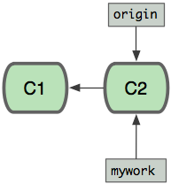

转自：[git rebase](http://gitbook.liuhui998.com/4_2.html)

## 场景
假设你现在基于远程分支 origin，创建一个叫 mywork 的分支。

    $ git checkout -b mywork origin

现在我们在这个分支做一些修改，然后生成两个提交(commit)：c5，c6。

    $ vi file.txt
    $ git commit
    $ vi otherfile.txt
    $ git commit
    ...
    
但是与此同时，有些人也在 origin 分支上做了一些修改并且做了提交了，这就意味着 origin 和 mywork 这两个分支各自**前进**了，它们之间**分叉**了。

## 使用git merge
在这里，你可以用 pull 命令把 origin 分支上的修改拉下来并且和你的修改合并；结果看起来就像一个新的**合并的提交**(merge commit)。

## 使用git rebase

但是，如果你想让 mywork 分支历史看起来像没有经过任何合并一样，你也许可以用 git rebase 命令。

    $ git checkout mywork
    $ git rebase origin

这些命令会把你的 mywork 分支里的每个提交(commit)取消掉，并且把它们临时保存为补丁(patch)(这些补丁放到 .git/rebase 目录中),然后把 mywork 分支更新到最新的 origin 分支，最后把保存的这些补丁应用到 mywork 分支上。

当 mywork 分支更新之后，它会指向这些新创建的提交(commit),而那些老的提交会被丢弃。如果运行垃圾收集命令(pruning garbage collection), 这些被丢弃的提交就会删除。详见[git-gc](https://www.kernel.org/pub/software/scm/git/docs/git-gc.html)。

现在我们可以看一下用 git merge 和用 rebase 所产生的历史的区别：

在 rebase 的过程中，也许会出现冲突(conflict)，在这种情况，Git 会停止 rebase 并会让你去解决冲突；在解决完冲突后，用 git stage(add) 命令去快照这些内容, 然后，你无需执行 git commit，只要执行:

    $ git rebase --continue

这样 Git 会继续应用(apply)余下的补丁。

在任何时候，你可以用 `--abort` 参数来终止 rebase 的行动，并且 mywork 分支会回到rebase开始前的状态。

    $ git rebase --abort

[SamirChen]: http://www.samirchen.com "SamirChen"
[1]: {{ page.url }} ({{page.title}})

