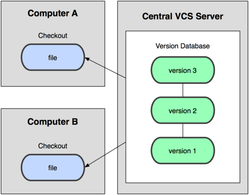
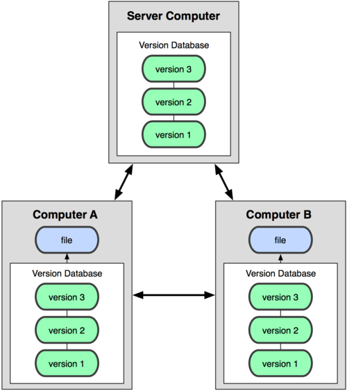
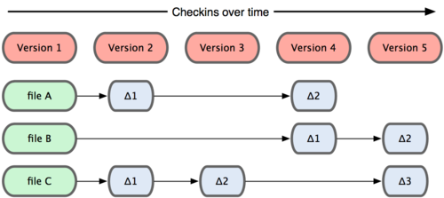
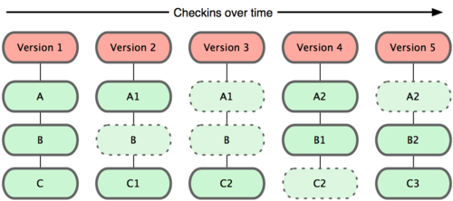
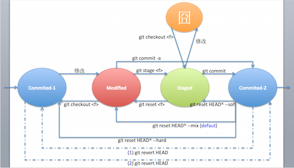

##Git 基本概念
[Git][] 最初由 [Linus Torvalds][] 编写，用于 Linux 内核开发的版本控制工具。Git 与常用的版本控制工具 [CVS][]、[Subversion][] 等不同，它采用了分布式版本库的方式，不必服务器端软件支持，使源代码的发布和交流极其方便。

###分布式而非集中式版本控制

一个集中式的版本控制系统如上图所示。其特点就是有一个单一的集中管理的服务器，保存所有文件的修订版本，而协同工作的人们都通过客户端连到这台服务器，取出最新的文件或者提交更新。这种做法的**好处**是：每个人都可以在一定程度上看到项目中的其他人正在做些什么。而管理员也可以轻松掌控每个开发者的权限，并且管理一个 CVCS 要远比在各个客户端上维护本地数据库来得轻松容易。这种做法最显著的**缺点**是：对于中央服务器的过度依赖，如果服务器宕机，那么大家将无法协同工作。甚至，如果中央服务器的磁盘发生故障，那还会有丢失数据的风险，最坏的情况可能会丢失整个项目所有的历史更改记录，而被客户端提取出来的某些快照数据除外。

一个分布式的版本控制系统如上图所示。其特点是客户端并不是只提取最近版本的文件快照，而是把原始的代码仓库完整地镜像下来。这样就算任何一处协同工作用的服务器发生故障，事后都可以用任何一个镜像出来的本地仓库来恢复。每次提取操作实际上都是一次对代码仓库的完整备份。甚至，许多这类系统可以指定和若干不同的远端代码仓库进行交互。这样，你就可以在同一个项目中分别和不同的工作小组的人协作，你可以设定分层式的工作流，这在集中式的版本控制系统中是无法做到的。

**Git 是一个分布式版本控制系统。**

###保存更新时的文件快照而非差异
Git 与其他的版本控制系统的主要差别还在于：**Git 只关心文件数据的整体是否发生变化，而大多数其他系统则只关心文件内容的具体差异。**

如下图，其他系统在每个版本中记录着各个文件的具体差异：

而如下图，Git 保存每次更新时的文件快照，Git 并不保存这些前后变化的差异数据。实际上，Git 更像是把变化的文件做快照后，记录在一个微型的文件系统中。每次提交更新时，它会纵览所有文件的指纹信息并对文件做快照，然后保存一个指向这次快照的索引。对于没有发生变化的文件，Git 不会再次保存，只做一个链接指向上次保存的快照来提高性能。**Git 更像是一个小型的文件系统。**

Git 采用这样的设计带来了这些好处：

- 近乎所有的操作都是本地执行。
- 时刻保持数据的完整性。在保存到 Git 之前，所有数据都要进行内容的校验和（checksum）计算，并将此结果作为数据的唯一标识和索引。如果文件在传输时变得不完整，或磁盘损坏导致文件数据缺失，Git 能立刻察觉。
- 大多数 Git 操作都只是添加数据。我们都知道数据删除了，那么想回退或重现就变得非常困难。在 Git 中大多数操作只是添加数据，回退和重现变得容易而有保障，所以提交快照后就完全不用担心丢失数据。

###Git 管理下文件的状态
对于在 Git 管理下的文件，只可能有三种状态：

- 已暂存(staged)，表示对这个被修改的文件做了快照，并把快照放在下次提交时要保存的清单中了。
- 已修改(modified)，表示该文件当前被修改过了，但是还没提交保存，当前的状态也没有做快照暂存。
- 已提交(commited)，表示该文件已经被安全地保存在本地数据库中了。

所以基本的 Git 工作流程一般是这样的：

`在工作目录中修改某些文件(modified)` ===> `对修改后的文件进行快照，然后保存到暂存区域(staged)` ===> `提交更新，将保存在暂存区域的文件快照永久转存到 Git 目录中(commited)`

下面就来粗略说一下在 Git 管理下的文件在这三种状态下切换的情况以及对应的 Git 命令。先上个状态转换图：

当我们从某个地方 git clone 一份代码后，通常这时你的 work directory 是 clean 的，所有代码都是 commited 状态，在图中表示为 `Commited-1` 状态，我们就从这里开始解释接下来文件状态的切换：

- `Commit-1 ===> Modified`，我们拿到代码开始干活，当我们**修改**了文件后，文件状态发生变化，由 Commit-1 变为 Modified。
- `Modified ===> Commit-1`，发现文件改的不对，一处一处恢复太麻烦，用 **git checkout <f>** 命令便可以把对文件的修改恢复到原 Modified 的状态。
- `Modified ===> Staged`，文件修改的差不多了，想提交对这个文件的修改到本地 git 版本库保存起来，在这时你直接用 git commit 是提交不了的，因为 git commit 是对文件暂存区域的文件快照进行提交。所以，你需要先把文件快照一下放到暂存区域，用 **git stage <f>** 命令搞定，另外，用 **git add <f>** 也是一样的。
- `Staged ===> Modified`，发现目前不想在下次 commit 时提交文件暂存区域的某个文件，还想再改改或再缓缓，这时你需要把它的快照撤回来，用 **git reset <f>** 命令搞定。
- `Staged ===> 囧`，已经把某个文件快照后放到暂存区域了，但是又对它进行了**修改**。这时文件的状态就很囧了。这时你如果使用 git commit 提交，那么提交的是放在暂存区域的快照，而这之后的修改是不会提交的。
- `囧 ===> Staged`，当然你可以用 **git checkout <f>** 命令从这种比较囧的状态撤销修改，这时文件状态就又回到了 Staged。这里多说一句，看了上节介绍的 Git 总是保存文件更新时的快照，这里就可以这样理解：Git 管理下的文件在我们的折腾下，不停的在各种状态下流转，在不同的情况下，我们使用一些 Git 命令时会对文件拍快照，Git 就可以操作文件的快照了，这些快照对应的是一个文件的不同时刻的照片，文件是流动的，而快照则是某一时刻的永恒。
- `Staged ===> Commit-2`，使用 **git commit** 命令就可以把暂存区域的文件快照提交到 Git 版本库永久存储了，这时文件状态转变为 Commit-2。记得养成写 commit message 的良好习惯。
- `Modified ===> Commit-2`，看了上面的流程，有人会问了，我每次改了都要先 stage 才能提交还麻烦啊，有没有便捷点的方法？答案是：有。用 **git commit -a** 就可以把 Git 管理下的文件的修改都提交了。这里要注意的是，新增的文件是不在 Git 管理下的，需要 git add(stage) 一下才行。
- 撤回提交。上面一切进行的还算顺利，各种状态跳来跳去都能搞定了，现在问题来了：我已经 commit 了后才发现，天啊，提交错了，我要撤回！别急，这也是可以搞定的，而且这里有两种选择，但是需要搞清楚它们的区别。另外，这两种撤回提交都可以指定撤回几次，感兴趣的可以再深入研究。
	- 用 **reset** 撤销提交。用 reset 撤销就是真的删除了提交信息，回退到之前的状态了。不过有下面几种情况：
		- `Commit-2 ===> Staged`，从这次提交回到上次提交后的 Stage 状态用 **git reset HEAD^ --soft** 命令。
		- `Commit-2 ===> Modified`，从这次提交回到上次提交后的 Modified 状态用 **git reset HEAD^ --mix** 命令。上次提交后的修改都还在。--mix 是默认选项。
		- `Commit-2 ===> Commit-1`，从这次提交回到上次提交后的 Commit-1 状态用 **git reset HEAD^ --hard** 命令。注意，所有你上次提交后的修改都没了哦！
	- 用 **revert** 反向提交。用 revert 也可以撤销此次提交，但是它跟 reset 是不一样的，revert 本质上也是一次提交，只不过是它是一次与上次提交相逆的提交。
		1. `Commit-2 ===> Commit-1`，我们在 Commit-2 这个状态使用 **git revert HEAD** 命令，就可以直接回到 Commit-1 状态了。
		2. `Commit-1 ===> Commit-2`，有意思的是，接着上次的 revert 我们在 Commit-1 这个状态再使用一次 **git revert HEAD** 命令，会发现我们又回到 Commit-2 状态了。这是合理的，逆提交的逆提交就变成正了嘛。

到这里，Git 管理下的文件状态的转变和相关的命令就简要介绍完了，相信理解了这些，对于更好的使用 Git 会有很大的帮助。如果对各种更加细节的信息感兴趣可以去更深入的研究。

###HEAD是什么
上面多处出现了一个叫 `HEAD` 的东西，这里简要介绍一下。HEAD 文件是一个指向你当前所在分支的引用标识符。这样的引用标识符——它看起来并不像一个普通的引用——其实并不包含 SHA-1 值，而是一个指向另外一个引用的指针。如果你看一下这个文件，通常你将会看到这样的内容：

	$ cat .git/HEAD
	ref: refs/heads/master

当你执行 `git branch <分支名称>` 这条命令的时候，Git 怎么知道最后一次提交的 SHA-1 值呢？答案就是 HEAD 文件。

如果你执行 `git checkout test`，Git 就会更新这个文件，看起来像这样：

	$ cat .git/HEAD
	ref: refs/heads/test

当你再执行 `git commit` 命令，它就创建了一个 commit 对象，把这个 commit 对象的父级设置为 HEAD 指向的引用的 SHA-1 值。

上面说的最后一句话不太好理解吧，接下来，看个例子。我们假设当前的代码分支情况如下图所示，当前，我们在 master 分支工作，HEAD 指向着当前的 master 分支。

我们执行 `git checkout testing` 转换到 testing 分支。这时变化如下图，HEAD 指向了 testing 分支。

这样的设计有什么好处呢？我们来修改文件并做一次提交试试：

	$ vim test.rb
	$ git commit -a -m 'made a change'

提交后发生的变化如下图所示，现在 testing 分支向前移动了一格，而 master 分支仍然指向原先 git checkout 时所在的 commit 对象。

现在我们使用 `git checkout master` 命令回到 master 分支，效果如下图所示，这条命令做了两件事。它把 HEAD 指针移回到 master 分支，并把工作目录中的文件换成了 master 分支所指向的快照内容。也就是说，现在开始所做的改动，将始于本项目中一个较老的版本。它的主要作用是将 testing 分支里作出的修改暂时取消，这样你就可以向另一个方向进行开发。

参考：

[Git 内部原理 - Git References](https://git-scm.com/book/zh/v1/Git-%E5%86%85%E9%83%A8%E5%8E%9F%E7%90%86-Git-References)

[Git 分支 - 何谓分支](https://git-scm.com/book/zh/v1/Git-%E5%88%86%E6%94%AF-%E4%BD%95%E8%B0%93%E5%88%86%E6%94%AF)

##常用 Git 命令
###本地(Local)

####1、初始化

####1.1、全局变量
	git config --global user.name "your_name"
	git config --global user.email "your@email.com"
	git config --list //列出git在该处找到的所有设置
	git config --global core.editor vim //设置你的缺省编辑器，Git在需要你输入一些消息时会使用该文本编辑器
	git config --global merge.tool diffmerge //设置merge工具

####1.2、初始化新版本库
	git init // 只会在根目录下创建 .git 文件夹

####1.3、设置忽略文件
设置每个人都想要忽略的文件：

- 1、在根目录创建一个 `.gitignore` 文件，在里面添加要忽略的文件或文件夹，一个一行；
- 2、将 `.gitignore` 文件加入版本库并提交

设置只有自己需要忽略的文件：

- 1、修改 `.git/info/exclude` 文件，可使用正则表达式

####1.4、添加新文件到版本库
	git add somefile.txt //添加单个文件
	git add *.txt //添加所有 txt 文件
	git add . //添加所有文件，包括子目录，但不包括空目录

####1.5、提交
	git commit -m "add all txt files"

####2、日常操作

####2.1、提交
	git commit -m "some msg" -a //提交所有修改
	git commit -m "add msg to readme.txt" readme.txt //提交单个文件
	git commit --amend -m "new commit message" // 提交了，发现提交信息写错了，修改上次提交的信息可以用这条命令
	git commit -C HEAD -a --amend //不会产生新的提交历史记录，复用HEAD留言，增补提交，而不增加提交记录

####2.2、撤销修改
撤销尚未提交的修改（即没有commit的）：

	git checkout HEAD readme.txt todo.txt //撤销1、2个文件
	git checkout HEAD *.txt //撤销所有txt文件
	git checkout HEAD . //撤销所有文件

撤销提交：

	//反转提交：
	git revert --no-commit HEAD //反转提交，相当于提交最近一次提交的反操作。--no-commit 是让你不用输入 commit 信息，这不是个好习惯！
	
	//复位：
	git reset HEAD //复位，取消暂存
	git reset HEAD <filename> //复位，取消暂存
	git reset --hard HEAD^ //复位到HEAD之前的那个版本，不会在版本库中留下痕迹

####2.3、分支

	git branch //列出本地分支
	git branch -a //列出所有分支
	git branch <branchname> //基于当前分支末梢创建新分支
	git checkout <branchname> //检出分支
	git checkout -b <branchname> //基于当前分支末梢创建新分支并检出分支
	
	//基于某次提交、分支或标签创建新分支
	git branch emputy bfe57de0 //用来查看某个历史断面很方便
	git branch emputy2 emputy

	//普通合并
	git merge <branchname> //合并分支<branchname>到当前所在分支并提交，如果发生了冲突就不会自动提交，不想立即解决这些冲突的话，可以用 git checkout HEAD . 撤销
	git merge --no-commit <branchname> //合并但不提交
	//压合合并
	git merge --squash <branchname> //压合合并后直接提交
	git merge --squash --no-commit <branchname> //当两个人合作开发一个新功能时，需要在一个分支提交多次，开发完成之后再压合成一次提交
	//拣选合并
	git cherry-pick --no-commit 5b62b6 //挑选某次提交合并但并不提交
	
	// rebase: 现有 origin 分支(c1-c2-c3-c4)和 mywork 分支(c1-c2-c5-c6)，在 mywork 分支和 origin 分支上各有提交，即：origin 上有 c3-c4，mywork 上又 c5-c6
	git checkout mywork
	git rebase origin // 这些命令会把"mywork"分支里的每个提交(commit)取消掉，并且把它们临时保存为补丁(patch)(这些补丁放到".git/rebase"目录中),然后把"mywork"分支更新到最新的"origin"分支，最后把保存的这些补丁应用到"mywork"分支上。
	// 在 rebase 的过程中如果出现冲突，那么 Git 会停止让你解决冲突。解决好冲突后：
	git add <fixed-conflict-file> // 更新这些文件的索引
	git rebase --continue // 继续 rebase
	// 如果你觉得当前的冲突无需修改，那么可以跳过，这样会直接使用 origin 分支的这部分内容：
	git rebase --skip
	// 在任何时候，你可以用 --abort 参数来终止 rebase 的行动，并且"mywork" 分支会回到rebase开始前的状态。
	git rebase --abort // 终止 rebase
	

	//重命名分支
	git branch -m <branchname> <newname> //不会覆盖已存在的同名分支
	git branch -M <branchname> <newname> //会覆盖已存在的同名分支

	//删除分支
	git branch -d new2 //如果分支没有被合并会删除失败
	git branch -D new2 //即使分支没有被合并也照删不误

####2.4、解决冲突
冲突很少时，直接编辑冲突的文件然后提交即可。

冲突比较复杂时，用 `git mergetool` 调用之前设定的merge工具来处理。

- 1、自动生成 BACKUP，BASE，LOCAL和REMOTE四个文件
- 2、调用设定好的merge工具
- 3、解决之后，关闭工具，BACKUP，BASE，LOCAL和REMOTE四个辅助文件会自动删除，但会同时生成一个 .orig 的文件来保存冲突前的现场。需手动删除这个文件
- 4、提交

####2.5、标签
	//创建标签
	git tag 1.0 //为当前分支最后一次提交创建标签，标签无法重命名
	git tag contacts_1.1 contacts //为contacts分支最近一次提交创建标签
	git tag 1.1 4e6861d5 //为某次历史提交创建标签

	git tag //显示标签列表

	git checkout 1.0 //检出标签，查看标签断面很方便

	git branch b1.1 1.1 //由标签创建分支
	git checkout -b b1.0 1.0

	git tag -d 1.0 //删除标签

####2.6、查看状态
	git status // 当前状态
	git log //历史记录
	git branch -v //每个分支最后的提交

####2.7、其他
	//导出版本库
	git archive --format=zip HEAD>nb.zip
	git archive --format=zip --prefix=nb1.0/ HEAD>nb.zip

###远端(Remote)

####1、初始化
####1.1、克隆版本库和添加远程版本库
1）当已经有一个远程版本库，只需要在本地克隆一份：

	git clone <giturl> //克隆，如：git clone https://github.com/me/test.git
	git clone <giturl> <dirname> //将远程库克隆到本地<dirname>目录下

克隆之后会自动添加四个config：

- remote.origin.fetch=+refs/HEADs/\*:refs/remotes/origin/\*
- remote.origin.url=https://github.com/me/test.git
- branch.master.remote=origin
- branch.master.merge=refs/HEADs/master

2）当在本地创建了一个工作目录，想把这个目录用 Git 管理，并初始化到远程版本库，可以在远程服务器上创建一个目录，并把URL记录下来。在本地进入工作目录，然后执行：
	
	git init //初始化，对本地工作目录下的文件进行版本控制
	git remote add origin https://github.com/me/another_test.git //将本地工作目录放到远程服务器上。这样会添加URL地址为https://github.com/me/another_test.git，别名为origin的远程库

	//将本地的文件都推到远程库
	git add .
	git commit -am "init commit"
	git push origin master 

####1.2、别名
	git remote add <别名> <远程版本库URL> //添加远程版本库别名
	git remote rm <别名> //删除远程库的别名和相关分支

	git remote set-url --push <name> <newURL> //修改远程库

添加别名后会自动添加两个config：

- remote.origin.url=https://github.com/me/test.git
- remote.origin.fetch=+refs/HEADs/\*:refs/remotes/origin/\*

####1.3、创建一个无本地分支的库
	git init --bare //当需要一个公用的中央库时，非常适合把它建成bare库

####2、日常操作
####2.1、分支

	git branch -r //列出远程分支
	git branch -a //列出所有分支（本地和远程）
	git remote prune origin //删除远程库中已经不存在的分支
	
	git push origin --delete <branchName> //删除远程分支
	git push origin :<branchName> //推送一个空分支到远程分支，相当于删除远程分支

####2.2、从远程库获取

	git remote -v //查看远程仓库

	//获取但不合并
	git fetch <远程版本库> 
	//如：
	git fetch origin //origin是远程库的默认别名
	git fetch https://github.com/me/test.git

	//获取并合并到当前本地分支
	git pull //等价于git pull origin，origin是远程库的默认别名
	git pull https://github.com/me/test.git master //当不是从默认远程库获取时，需要指定获取哪个分支，这里就是指定获取master分支

	git pull <remoteName> <localBranchName> //拉取远程库到本地分支
	git pull origin test //拉取远程库到本地test分支
	
**推荐用下列方式从远程库获取代码：**

	git fetch origin master:tmp //从远程库origin的master分支获取版本库到本地tmp分支
	git diff tmp //比较本地tmp分支和当前所在分支（一般为本地master分支）
	git merge tmp //合并本地tmp分支到当前分支（一般为本地master分支）
	//如果这里遇到冲突，则参考“本地（Local） 2.4 解决冲突”来解决冲突

####2.3、推入远程库
	git push origin master //推入远程库，这里远程库默认别名origin，本地默认分支master

	git push origin test:master //将本地test分支推入远程库，并作为远程库的master分支
	git push origin test:test //将本地test分支推入远程库，并作为远程库的test分支

##几个 Git 使用场景
###撤销一次公共提交
- 场景：你才用 git push 将本地的修改提交到了远程公共库，突然发现提交中有个错误忘了改了，你想撤销这次提交。
- 命令：git revert <SHA> 或者 git reset HEAD^
- 解释：详见前文讲「Git 管理下文件的状态」那节对这两个命令的解释。在本地撤销后，修改了错误后，再做一次新的提交并 git push 到远程公共库即可。

###修改最近一次的提交信息
- 场景：你用 git commit 命令做了一次提交操作，提交完才想起提交信息没有按规范写，在 git push 之前，你想把提交信息改一改
- 命令：git commit --amend
- 解释：上面的命令将使用一个包含了上一次提交所有变更的新提交，来更新并替换这个错误提交。由于这次提交除了修改了 commit message，没有其他 staged 的修改，所以就相当于修正了上一次的提交信息。

###撤销提交后重做
- 场景：你提交了一些内容，然后又用 git reset HEAD^ --hard 撤销了这些更改，然后纠结的你又发现：我还是得还原这些修改！
- 命令：git reflog 和 git reset
- 解释：我们对 git log 命令比较熟悉，它能显示提交列表，而 git reflog 则显示的 HEAD 变更列表。ref log 嘛，字面上也能理解。知道了 HEAD 变更的信息列表，那我们就可以用 git reset 来做我们想重做了。但是需要注意的是：git reflog 不会永远存储，Git 将定期清理那些**不可达(unreachable)**的对象，所以不要期望能在 reflog 里找到数据前的 HEAD 变更记录。

>
	// 我提交了一些内容
	$ git commit -m "commit 17"
>	
	// 接着我撤销了这些更改
	$ git reset HEAD^ --hard
>	
	// 额，我这时发现我得还原这些更改
	// Step 1: 用 git reflog 查看
	$ git reflog
	2750087 HEAD@{0}: reset: moving to HEAD^
	ad14ba3 HEAD@{1}: commit: commit 17
	...
	// 发现了刚才的那次撤销以及前面那次提交的信息
	// Step 2: 用 git reset 回到那次提交
	$ git reset ad14ba3
	HEAD is now at ad14ba3 commit 17
	// 打印出来的信息显示，我们做到了，更改被还原过来了
	// 再看看 reflog 信息和 log 信息
	$ git reflog
	ad14ba3 HEAD@{0}: reset: moving to ad14ba3
	2750087 HEAD@{1}: reset: moving to HEAD^
	ad14ba3 HEAD@{2}: commit: commit 17
	...
	$ git log
	commit ad14ba39c57b4b43b913ebc273500afa815bb0e3
	Author: sc <sc@sc-MacBookPro.local>
	Date:   Tue Jul 14 22:55:24 2015 +0800
>	
	    commit 17

###在master做了本该在分支上做的提交
- 场景：你提交了一些修改，却发现自己是在 master 上，但你本来是期望在 feature 分支上执行这些提交的。
- 命令：git branch feature, git reset HEAD^ --hard
- 解释：上面 3 条命令依次执行。第一条命令，先创建一个名为 feature 的分支，但不切换过去，这个分支指向了你最近的提交，保留了你最近的修改；第二条命令，这时你还在 master 上，这条命令撤销了 master 上的上一次提交。接下来，你可以 git checkout feature 将分支切换到 feature 分支上，这个分支保存着你最近的所有工作，你可以接着工作了。

###储藏当前工作
- 场景：经常有这样的事情发生，当你正在进行项目中某一部分的工作，里面的东西处于一个比较杂乱的状态，而你想转到其他分支上进行一些工作。问题是，你不想提交进行了一半的工作，否则以后你无法回到这个工作点。解决这个问题的办法就是 git stash 命令。
- 命令：git stash
- 解释：储藏可以获取你工作目录的中间状态——也就是你修改过的被追踪的文件和暂存的变更——并将它保存到一个未完结变更的堆栈中，随时可以重新应用。你可以使用 git stash list 来看储藏列表，可以用 git stash apply <stash-id> 来把之前储藏的工作拿出来继续。更详细的信息参见 [Git 工具 - 储藏（Stashing）](https://git-scm.com/book/zh/v1/Git-%E5%B7%A5%E5%85%B7-%E5%82%A8%E8%97%8F%EF%BC%88Stashing%EF%BC%89)

###停止跟踪一个已经被跟踪的文件
- 场景：你意外将 application.log 添加到仓库中，现在你每次运行程序，Git 都提示 application.log 中有 unstaged 的提交。你在 .gitignore 中写上 *.log，但仍旧没用。怎么告诉 Git 停止跟踪这个文件的变化呢？
- 命令：git rm --cached application.log
- 解释：尽管 .gitignore 可以阻止 Git 跟踪所指定的文件的变化甚至让 Git 不去提醒这些文件的存在，但是，一旦文件被 git add 或者 commit，Git 会开始持续跟踪这个文件的变化。如果你希望移除那些应当被忽略的文件，git rm –cached 命令可以帮助你，并将这些文件保留在磁盘上。因为这个文件现在被忽略了，你将不会在 git status 中看到它，也不会再把这个文件 commit 了。

参考：[如何在Git中撤销一切](http://www.jointforce.com/jfperiodical/article/show/796?m=d03)，翻译：李伟，审校：张帆，译自：[How to undo (almost) anything with Git](https://github.com/blog/2019-how-to-undo-almost-anything-with-git)。

[SamirChen]: http://samirchen.com "SamirChen"
[1]: {{ page.url }} ({{page.title}})
[Git]: http://zh.wikipedia.org/wiki/Git "Git"
[Linus Torvalds]: http://zh.wikipedia.org/wiki/%E6%9E%97%E7%BA%B3%E6%96%AF%C2%B7%E6%89%98%E7%93%A6%E5%85%B9 "Linus Torvalds"
[Subversion]: http://zh.wikipedia.org/wiki/Subversion "Subversion"
[CVS]: http://zh.wikipedia.org/wiki/%E5%8D%94%E4%BD%9C%E7%89%88%E6%9C%AC%E7%B3%BB%E7%B5%B1 "CVS"