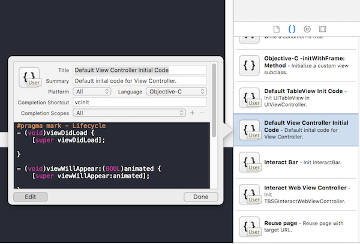
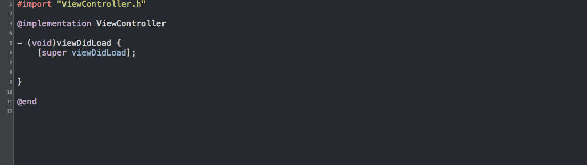

## 模板、规范和复用

### 规范

基本上对于每一种语言，在不同的公司或团队中都会形成自己的一套编码规范，编码规范的意义主要有两点：

- 通过规范减少程序员编码出 Bug 的几率。
- 通过规范尽量保证代码样式的一致性、提高代码的可读性，从而方便程序员之间的代码互阅和工作交接。

在实际工作中，大部分团队的编码规范落地下来应该仅是一份单纯的文档。大部分人可能根本不会去看完这样一份枯燥的文档，有心的工程师们可能还能好好学习一下，但真正写起代码来也不见得能拗过之前的习惯，最后时间久了、任务紧了，规范就抛在脑后了。

规范的推进和普及本身是一件很难的事，因为这个过程中要去跟每个人的习惯和惰性做斗争，但是如果能往前推进一小步，使得规范的普及率更高一些，对于团队来说，带来的收益也是很可观的。

### 复用

在我们的工程中通常有很多可以复用的代码，比如：设计模式类代码、业务相近的代码等等，我们在不同的场景下可能要反反复复写同样结构甚至同样内容的代码，如果这些代码能够被便捷的复用起来，那对于提高开发成员的开发效率将大有裨益。

想想当你创建一个包含 UITableView 的 UIViewController 时，那些基本的 UITableViewDelegate 和 UITableViewDataSource 方法和布局适配代码都已经自动生成了，并填充了基本的测试数据，运行即可见，会不会感觉世界更美好了一点点呢？

### 模板

现在，在 Xcode 提供出的接口中，提供给我们在 Xcode 中添加自定义代码模板的能力，通过代码模板，我们可以将编码规范从单纯的文档进一步推进到实际代码中去，使得开发人员在开发中能够更便捷快速的写出符合规范的代码，从而把规范的普及往前推动一些。并且，代码模板本身就是一种复用技术，而在 Xcode 中使用代码模板已经很是快捷，所以更好的利用 Xcode 的这些接口对于提高开发效率很有帮助。

## Xcode 代码模板

Xcode 提供了 3 个维度的代码模板接口：

- 代码片段（Code Snippet）
- 文件模板（File Template）
- 项目模板（Project Template）

通过这 3 个维度的代码模板，基本上覆盖了我们日常使用模板技术的场景。接下来，就分别说一说。

### Code Snippet

Code Snippet 在 Xcode 的位置如下图所示：

在使用时，通过每个 Code Snippet 对应的 Shortcut 我们可以在编码时快速使用它们，用熟了的话，真是有一种四两拨千斤感觉。

自定义的 Code Snippet 会以 `.codesnippet` 文件的形式存储在 `~/Library/Developer/Xcode/UserData/CodeSnippets` 目录下。目前不支持子目录，所有的 Code Snippet 文件只能直接放在这个目录下。

	<key>IDECodeSnippetIdentifier</key>
	<string>xtm-cs-table-view-delegate</string>

Code Snippet 文件中的 `IDECodeSnippetIdentifier` 这个字段需要注意，不要与其他的 Code Snippet 文件重复，否则 Xcode 会崩溃。当你在 Xcode 中创建一个 Code Snippet 时，Xcode 会为你自动生成对应的 Identifier。

### File Template

在 Xcode 中使用 File Template 就如同我们在工程中新添加文件的流程一样，只不过文件模板是我们可以自定义的。

File Template 是以后缀为 `.xctemplate` 的文件夹形式存储。

Xcode 的官方 File Template 存在 `/Applications/Xcode.app/Contents/Developer/Platforms/iPhoneOS.platform/Developer/Library/Xcode/Templates/File\ Templates` 和 `/Applications/Xcode.app/Contents/Developer/Library/Xcode/Templates/File\ Templates` 路径下。

我们自己的模板可以拷到上面的目录里去使用，但是建议的做法是放在 `~/Library/Developer/Xcode/Templates` 目录下，并且支持子目录，比如可以放在 `~/Library/Developer/Xcode/Templates/My\ Templates/My\ File\ Templates` 里。

### Project Template

在 Xcode 中使用 Project Template 就如同我们新创建一个工程的流程一样，只不过工程项目模板是我们可以自定义的。

Project Template 是以后缀为 `.xctemplate` 的文件夹形式存储。

Xcode 的官方 Project Templates 存在 `/Applications/Xcode.app/Contents/Developer/Platforms/iPhoneOS.platform/Developer/Library/Xcode/Templates/Project\ Templates` 和 `/Applications/Xcode.app/Contents/Developer/Library/Xcode/Templates/Project\ Templates` 路径下。

我们自己的模板可以拷贝到上面的目录里去使用，但是建议的做法是放在 `~/Library/Developer/Xcode/Templates` 目录下，并且支持子目录，比如可以放在 `~/Library/Developer/Xcode/Templates/My\ Templates/My\ Project\ Templates` 里。

### Xcode Plugin

Xcode Plugin 不是模板技术，但是好用的 Xcode 插件也能很好地协助我们的开发工作，所以这里捎带提一下。

Xcode Plugin 是以后缀为 `.xcplugin` 的文件夹形式存放在 `~/Library/Application\ Support/Developer/Shared/Xcode/Plug-ins` 目录下或者以后缀为 `.ideplugin` 文件形式存放在 `~/Library/Developer/Xcode/Plug-ins` 目录下。

这里推荐几个插件示例：

- Alcatraz。这是一个管理 Xcode 插件的插件，你可以用 Alcatraz 方便的搜索、安装、卸载其他 Xcode 插件。项目地址：[https://github.com/alcatraz/Alcatraz](https://github.com/alcatraz/Alcatraz)。
- VVDocumenter。这是一个帮助你快速生成方法规范注释的插件。项目地址：[https://github.com/onevcat/VVDocumenter-Xcode](https://github.com/onevcat/VVDocumenter-Xcode)。
- OMColorSence。当写 UIColor 时能够实时看到对应的颜色。可以在 Alcatraz 中搜到。

这些插件随着 Xcode 的升级有时可能并不稳定，出现问题时，到上面说到的目录下重装或卸载掉就好了。

[SamirChen]: http://www.samirchen.com "SamirChen"
[1]: {{ page.url }} ({{ page.title }})
[2]: http://www.samirchen.com/xcode-template-manager

