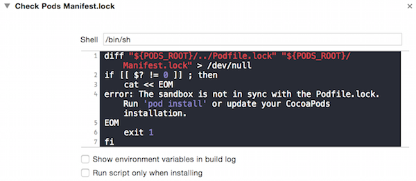

##发生了什么
你加入一个 iOS 项目，根据小伙伴给你的 git 仓库地址把代码 clone 下来，在项目目录下 `ls -al` 看一下：

	$ ls -al
	.
	..
	.DS_Store
	.git
	.gitignore
	Podfile
	TestProject
	TestProject.xcodeproj
	TestProject.xcworkspace

项目用了 CocoaPods 来管理依赖库，于是你找到 Podfile 所在的目录，执行 `pod install` 命令安装依赖库，一切都很正常。

- 先别看我：
- A: (Podfile.lock(A), Manifest.lock(A))
- Server: (Podfile.lock(无), Manifest.lock(无))
- Me: (Podfile.lock(Me), Manifest.lock(Me))

直到你安装完依赖库后，用 `git status` 命令看了一下本地 git 仓库的状态，发现提示：

	$ git status
	  (use "git add <file>..." to update what will be committed)
	  (use "git checkout -- <file>..." to discard changes in working directory)

		modified:   Podfile.lock

	no changes added to commit (use "git add" and/or "git commit -a")

你开始疑惑：我就安装了一下依赖库，啥都没干呢，Podfile.lock 是什么鬼？算了，不管了，先 Run 一下项目再说，嗯，没啥嘛，一切正常，项目成功跑起来了。上网搜了下 Podfile.lock，原来是用来锁定项目依赖库版本的文件。赶紧 `git commit`、`git push` 把 Podfile.lock 加入 git 管理，并提交到公共库。

- 先别看我：
- A: (Podfile.lock(A), Manifest.lock(A))
- Server: (Podfile.lock(Me), Manifest.lock(无))
- Me: (Podfile.lock(Me), Manifest.lock(Me))

写了两天代码，小伙伴告诉你项目代码更新了需要同步一下，于是你 `git commit`、`git pull`，还好，合并正常。

- 先别看我：
- A: (Podfile.lock(A), Manifest.lock(A))
- Server: (Podfile.lock(A), Manifest.lock(无))
- Me: (Podfile.lock(A), Manifest.lock(Me))

这时候你准备 Build 一下项目，却发现 Xcode 在报错：

	PhaseScriptExecution Check Pods Manifest.lock...
	...
	error: The sandbox is not in sync with the Podfile.lock. Run 'pod install' or update your CocoaPods installation.

又是 Podfile.lock 这鬼？等等，还有 Manifest.lock 又是啥？

##Podfile.lock 是啥

Podfile.lock 是在第一次运行 `pod install` 时生成的，Podfile.lock 中会标注项目当前依赖库的准确版本，其中包括了项目在 Podfile 中直接标注使用的库，以及这些库依赖的其他库。这样的好处是当你跟小伙伴协同开发时，你的小伙伴同步了你的 Podfile.lock 文件后，他执行 `pod install` 会安装 Podfile.lock 指定版本的依赖库，这样就可以防止大家的依赖库不一致而造成问题。因此，CocoaPods 官方强烈推荐把 Podfile.lock 纳入版本控制之下。

但是，Podfile.lock 并不是一成不变的，当你修改了 Podfile 文件里使用的依赖库或者运行 `pod update` 命令时，就会生成新的 Podfile.lock 文件。

所以，协同开发时需要注意使用 `pod install` 和 `pod update` 的区别：

- 使用 `pod install`，你只会安装 Podfile 中新改变的东西，并且会：优先遵循 Podfile 里指定的版本信息；其次遵循 Podfile.lock 里指定的版本信息来安装对应的依赖库。比如：下面在 Podfile 里没指定 iRate 的版本，但是 Podfile.lock 里指定了 iRate 的版本是 1.11.1，那么即使现在有最新的 1.11.4，最终也会安装 1.11.1。但是如果 Podfile 里指定了 iRate 版本是 1.11.3，那么则会安装 1.11.3，并更新 Podfile.lock 里的信息。

>
	// Podfile
	pod 'iRate'
>
	// Podfile.lock
	PODS:
	  - iRate (1.11.1)
>	
	DEPENDENCIES:
	  - iRate
>	
	SPEC CHECKSUMS:
	  iRate: 178e61bf5610493c363e2819056cf1a186b9ebd9
>	
	COCOAPODS: 0.35.0
	
- 使用 `pod update`，你会根据 Podfile 的规则更新所有依赖库，不会理睬现有的 Podfile.lock，而是根据安装依赖库的情况生成新的 Podfile.lock 文件。

##Manifest.lock 又是啥
Manifest.lock 是 Podfile.lock 的副本，每次只要生成 Podfile.lock 时就会生成一个一样的 Manifest.lock 存储在 Pods 文件夹下。在每次项目 Build 的时候，会跑一下脚本检查一下 Podfile.lock 和 Manifest.lock 是否一致：

如果不一致，你就会看到第一节说到的报错了：

	PhaseScriptExecution Check Pods Manifest.lock...
	...
	error: The sandbox is not in sync with the Podfile.lock. Run 'pod install' or update your CocoaPods installation.
	
这样做的原因是 Pods 目录并不总是被放到版本控制之下，有了这个检查机制就能保证开发团队的各个小伙伴能在运行项目前更新他们的依赖库，并保持这些依赖库的版本一致，从而防止在依赖库的版本不统一造成程序在一些不明显的地方编译失败或运行崩溃。

##到底发生了什么
说清楚了 Podfile.lock 和 Manifest.lock 到底是什么，现在我们回头再看看第一节到底发生了什么。现在你可以看第一节里的各种类似下面的信息了：

- A: (Podfile.lock(A), Manifest.lock(A))
- Server: (Podfile.lock(无), Manifest.lock(无))
- Me: (Podfile.lock(Me), Manifest.lock(Me))

这些是记录小伙伴 A、代码服务器 Server 和自己本地 Me 这三个地方的 Podfile.lock、Manifest.lock 在不同场景下的版本状态了。

第一个问题：

- 你第一次 `git clone` 项目下来后，`pod install` 安装依赖库，为什么 `git status` 会提示说你修改了 Podfile.lock 文件？
- 这是因为你的小伙伴并没有把 Podfile.lock 纳入版本控制，你 clone 下来的代码一开始就没有 Podfile.lock，所以你 `pod install` 的时候，会生成一份 Podfile.lock，并在 Pods 文件夹下生成它的副本 Manifest.lock。 Pods 文件夹这时候一般被 .gitignore 忽略了，但是 Podfile.lock 文件却没被忽略，文件夹下出现了新增的 Podfile.lock 文件，所以 git 会提醒你那些信息。这时候三个地方的 Podfile.lock、Manifest.lock 的状态是这样的：
	- A: (Podfile.lock(A), Manifest.lock(A))
	- Server: (Podfile.lock(无), Manifest.lock(无))
	- Me: (Podfile.lock(Me), Manifest.lock(Me))

第二个问题：

- 你写了几天代码后，同步了小伙伴线上的代码后为什么会 Build 报错？
- 这是因为你把 Podfile.lock 文件加入了版本控制，然后你的小伙伴提交代码时就会提交他本地的 Podfile.lock 文件到代码服务器。你同步后你们的 Podfile.lock、Manifest.lock 的状态是这样的：
	- A: (Podfile.lock(A), Manifest.lock(A))
	- Server: (Podfile.lock(A), Manifest.lock(无))
	- Me: (Podfile.lock(A), Manifest.lock(Me))
- 这时你的 Podfile.lock 文件更新了，但是本地的 Manifest.lock 却没有，二者不一致所以报错了。
- 这里就引出了一个新问题，你们的 Podfile 是同步一致的呀，那为什么你们俩的 Podfile.lock 会不一样呢？
- 造成这种情况的一个可能性是你们的 Podfile 里的一些 pod 语法并没有指定明确的依赖版本，或者你直接使用的依赖库在它们更深一层的依赖关系链中没有指定明确的版本。而你们俩 `pod install` 安装依赖库是在不同的时间点，这两个时间点的直接依赖库或间接依赖库的最新版本可能发生了变化，所以你们安装了不一样的依赖版本，那么 Podfile.lock 的记录就不一样了。建议可以执行 `pod repo update` 更新一下 spec repo，再 pod install。

除了上面这些问题，另外再提醒一下：注意 `pod install` 和 `pod update` 的区别。如果不合理的使用 `pod update` 也可能会给你带来一些困惑。

##怎么对待 Podfile.lock
讲完上面这些，那么究竟该怎样对待 Podfile.lock 呢？以下建议可供参考：

- Podfile.lock 应该加入版本控制，保证小伙伴们的依赖库版本一致，防止出现难以发现的 bug。另外，在初始创建项目的时候就应该加入版本控制。
- Podfile 的语法最好能尽量严谨，最好指定明确的依赖库版本。
- 理解 `pod install` 和 `pod update` 的区别以及它们对 Podfile.lock 的影响，合理使用。一般就是多用 `pod install`，在需要时使用 `pod update`。

[SamirChen]: http://samirchen.com "SamirChen"
[1]: {{ page.url }} ({{page.title}})