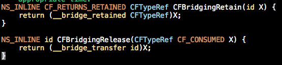

##前言
ARC 是编译器（时）特性，而不是运行时特性，更不是垃圾回收器(GC)。

>Automatic Reference Counting (ARC) is a compiler-level feature that simplifies the process of managing object lifetimes (memory management) in Cocoa applications.

ARC 特性下有几种修饰符需要我们关注：

- `__strong`
- `__weak`
- `__autoreleasing`
- `__unsafe_unretaied`

##关于 \_\_strong
`__strong` 表示强引用，对应定义 property 时用到的 `strong`。当对象没有任何一个强引用指向它时，它才会被释放。如果在声明引用时不加修饰符，那么引用将默认是强引用。当需要释放强引用指向的对象时，可以将强引用置为 nil 来做到。

##关于 \_\_weak
`__weak` 表示弱引用，对应定义 property 时用到的 `weak`。弱引用不会影响对象的释放，而当对象被释放时，所有指向它的弱引用都会自定被置为 nil，这样可以防止野指针。

\_\_weak 的几个应用场景：

- 用在 Delegate 关系中防止强引用循环。
- 用在 Block 中防止强引用循环。关于 Block 可以看这篇文章的详细探讨：[Block](http://www.samirchen.com/block-in-objc)
- 用来修饰指向 Interface Builder 编辑与生成的控件。比如：`@property (weak, nonatomic) IBOutlet UIButton *testButton;`。

##关于 \_\_autoreleasing
`__autoreleasing` 表示自动释放的引用，它修饰的对象会在 Autorelease Pool 中自动释放，和 MRC 时代的 autorelease 的用法相同。定义 property 时不能使用这个修饰符，因为任何一个对象的 property 都不应该是 autorelease 类型的。

\_\_autoreleasing 是使用场景：

- 参数传递返回值。
- 引用传递参数(pass-by-reference(id *))。

###参数传递返回值
为什么方法返回值的时候需要用到 \_\_autoreleasing 特性呢，因为你在方法中创建了一个对象，在返回之前你总不能把它释放了吧，这样你返回的就是 nil 了，而返回后，方法都调用结束了。参数值 return 出去后，外面接收它的要使用它就要强引用它，给它 retainCount +1，不用了就清理，retainCount -1，这是方法外面的事，但对于你这个方法来说你创建了它却没清理它，这是不负责任地搞内存泄露啊！所以得有一套机制保证创建这个对象的方法能在方法调用结束后清理掉这个对象，这就是 autorelease 机制。

当参数从方法返回时，会被放到正在使用的 Autorelease Pool 中，Autorelease Pool 自己销毁的时候会把它里面的对象都顺手清理掉，这样就把事干得很干净了。但是 Autorelease Pool 的生命周期是多久呢？在 [Objective-C Boot Camp][3] 这篇文章中把 \_\_autoreleasing 对象的生命周期讲的比较清楚。

>Autorelease Object Lifetime
So how long can you use an autorelease object? What guarantees do you have? The hard-and-fast rule is that the object is yours until the next item in the event loop gets processed. The event loop is triggered by user touches, by button presses, by “time passed” events, and so forth. In human reckoning, these times are impossibly short; in the iOS SDK device’s processor frame of reference, they’re quite large. As a more general rule, you can assume that an autoreleased object should persist throughout the duration of your method call.
>
Once you return from a method, guarantees go out the window. When you need to use an array beyond the scope of a single method or for extended periods of time (for example, you might start a custom run-loop within a method, prolonging how long that method endures), the rules change. You must retain autorelease objects to increase their count and prevent them from getting deallocated when the pool drains; when the autorelease pool calls release on their memory, they’ll maintain a count of at least +1.
>
Never rely on an object’s retainCount to keep track of how often it has already been retained. If you want to make absolutely sure you own an object, retain it, use it, and then release it when you’re done. If you’re looking at anything other than your own object’s relative retain counts and matching releases, you’re going to run into systemic development errors.

关于 Autorelease Pool 可以看一下这篇文章：[iOS 中的 Autorelease Pool](http://www.samirchen.com/ios-autorelease-pool)

###引用传递参数
看一个最常见的例子：

	NSError *__autoreleasing error; 
	if (![data writeToFile:filename options:NSDataWritingAtomic error:&error]) { 
	　　NSLog(@"Error: %@", error); 
	}
	
	// 即使上面你没有写 __autoreleasing 来修饰 error，编译器也会帮你做下面的事情：
	NSError *error; 
	NSError *__autoreleasing tempError = error; // 编译器添加 
	if (![data writeToFile:filename options:NSDataWritingAtomic error:&tempError]) 
	{ 
	　　error = tempError; // 编译器添加 
	　　NSLog(@"Error: %@", error); 
	}

error 对象在你调用的方法中被创建，然后被放到 Autorelease Pool 中，等到使用结束后随着 Autorelease Pool 的销毁而释放，所以函数外 error 对象的使用者不需要关心它的释放。

在 ARC 中，所有这种指针的指针类型（NSError **）的函数参数如果不加修饰符，编译器会默认将他们认定为 `__autoreleasing` 类型。

有一点特别需要注意的是，某些类的方法会隐式地使用自己的 Autorelease Pool，在这种时候使用 `__autoreleasing` 类型要特别小心。比如 NSDictionary 的 enumerateKeysAndObjectsUsingBlock 方法：

	- (void)loopThroughDictionary:(NSDictionary *)dict error:(NSError **)error {
	    [dict enumerateKeysAndObjectsUsingBlock:^(id key, id obj, BOOL *stop) {
	
	          // do stuff  
	          if (there is some error && error != nil) {
	                *error = [NSError errorWithDomain:@"MyError" code:1 userInfo:nil];
	          }
	
	    }];
	}
	
上面的代码中其实会隐式地创建一个 Autorelease Pool，类似于：

	- (void)loopThroughDictionary:(NSDictionary *)dict error:(NSError **)error {
	    [dict enumerateKeysAndObjectsUsingBlock:^(id key, id obj, BOOL *stop) {
	
	          @autoreleasepool {  // 被隐式创建。
	              if (there is some error && error != nil) {
	                    *error = [NSError errorWithDomain:@"MyError" code:1 userInfo:nil];
	              }
	          }
	    }];
	
	    // *error 在这里已经被dict的做枚举遍历时创建的 Autorelease Pool释放掉了。
	} 

为了能够正常的使用 *error，我们需要一个 strong 类型的临时引用，在 dict 的枚举 Block 中是用这个临时引用，保证引用指向的对象不会在出了 dict 的枚举 Block 后被释放，正确的方式如下：

	- (void)loopThroughDictionary:(NSDictionary *)dict error:(NSError **)error {
	　　NSError * __block tempError; // 加 __block 保证可以在Block内被修改。
	　　[dict enumerateKeysAndObjectsUsingBlock:^(id key, id obj, BOOL *stop) { 
	　　　　if (there is some error) { 
	　　　　　　*tempError = [NSError errorWithDomain:@"MyError" code:1 userInfo:nil]; 
	　　　　}  
	
	　　}] 
	
	　　if (error != nil) { 
	　　　　*error = tempError; 
	　　} 
	}
	

##关于 \_\_unsafe_unretained

ARC 是在 iOS 5 引入的，而 `__unsafe_unretained` 这个修饰符主要是为了在 ARC 刚发布时兼容 iOS 4 以及版本更低的设备，因为这些版本的设备没有 weak pointer system，简单的理解这个系统就是我们上面讲 weak 时提到的，能够在 weak 引用指向对象被释放后，把引用值自动设为 nil 的系统。这个修饰符在定义 property 时对应的是 `unsafe_unretained`，实际可以将它理解为 MRC 时代的 assign：纯粹只是将引用指向对象，没有任何额外的操作，在指向对象被释放时依然原原本本地指向原来被释放的对象（所在的内存区域）。所以非常不安全。

\_\_unsafe_unretained 的应用场景：

- 在 ARC 环境下但是要兼容 iOS 4.x 的版本，用 `__unsafe_unretained` 替代 `__weak` 解决强引用循环的问题。

##关于 Toll-Free Bridging

Toll-Free Briding 保证了在程序中，可以方便和谐的使用 Core Foundation 类型的对象和Objective-C 类型的对象。

在 MRC 时代，由于 Objective-C 类型的对象和 Core Foundation 类型的对象都是相同的 release 和 retain 操作规则，所以 Toll-Free Bridging 的使用比较简单，但是自从切换到 ARC 后，Objective-C 类型的对象内存管理规则改变了，而 Core Foundation 依然是之前的机制，换句话说，Core Foundation 不支持 ARC。

这个时候就必须要要考虑一个问题了，在做 Core Foundation 与 Objective-C 类型转换的时候，用哪一种规则来管理对象的内存。显然，对于同一个对象，我们不能够同时用两种规则来管理，所以这里就必须要确定一件事情：哪些对象用 Objective-C（也就是 ARC）的规则，哪些对象用 Core Foundation 的规则（也就是 MRC）的规则。或者说要确定对象类型转换了之后，内存管理的 ownership 的改变。于是苹果在引入 ARC 之后对 Toll-Free Bridging 的操作也加入了对应的方法与修饰符，用来指明用哪种规则管理内存，或者说是内存管理权的归属。这些方法和修饰符分别是：

- \_\_bridge（修饰符）
- \_\_bridge_retained（修饰符） or CFBridgingRetain（函数）
- \_\_bridge_transfer（修饰符） or CFBridgingRelease（函数）

###\_\_bridge
只是声明类型转变，但是不做内存管理规则的转变。

比如：

	CFStringRef s1 = (__bridge CFStringRef) [[NSString alloc] initWithFormat:@"Hello, %@!", name];
	
只是做了 NSString 到 CFStringRef 的转化，但管理规则未变，依然要用 Objective-C 类型的 ARC 来管理 s1，你不能用 CFRelease() 去释放 s1。

###\_\_bridge_retained or CFBridgingRetain
表示将指针类型转变的同时，将内存管理的责任由原来的 Objective-C  交给Core Foundation 来处理，也就是，将 ARC 转变为 MRC。

比如，还是上面那个例子

	NSString *s1 = [[NSString alloc] initWithFormat:@"Hello, %@!", name];
	CFStringRef s2 = (__bridge_retained CFStringRef)s1;
	// or CFStringRef s2 = (CFStringRef)CFBridgingRetain(s1);
	// do something with s2
	//...
	CFRelease(s2); // 注意要在使用结束后加这个

我们在第二行做了转化，这时内存管理规则由 ARC 变为了 MRC，我们需要手动的来管理 s2 的内存，而对于 s1，我们即使将其置为 nil，也不能释放内存。

###\_\_bridge_transfer or CFBridgingRelease
这个修饰符和函数的功能和上面那个 \_\_bridge_retained 相反，它表示将管理的责任由 Core Foundation 转交给 Objective-C，即将管理方式由 MRC 转变为 ARC。

比如：

	CFStringRef result = CFURLCreateStringByAddingPercentEscapes(. . .);
	NSString *s = (__bridge_transfer NSString *)result;
	//or NSString *s = (NSString *)CFBridgingRelease(result);
	return s;

这里我们将 result 的管理责任交给了 ARC 来处理，我们就不需要再显式地将 CFRelease() 了。

对了，这里你可能会注意到一个细节，和 ARC 中那个 4 个主要的修饰符（__strong, __weak, ...）不同，这里修饰符的位置是放在类型前面的，虽然官方文档中没有说明，但看官方的头文件可以知道。记得别把位置写错。

参考：

- [Transitioning to ARC Release Notes](https://developer.apple.com/library/ios/releasenotes/ObjectiveC/RN-TransitioningToARC/Introduction/Introduction.html)
- [iOS开发ARC内存管理技术要点](http://www.cnblogs.com/flyFreeZn/p/4264220.html)
- [Objective-C Boot Camp][3]

[SamirChen]: http://samirchen.com "SamirChen"
[1]: {{ page.url }} ({{ page.title }})
[2]: http://samirchen.com/ios-arc/
[3]: http://www.informit.com/articles/article.aspx?p=1765122&seqNum=7