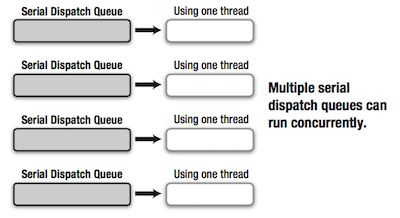
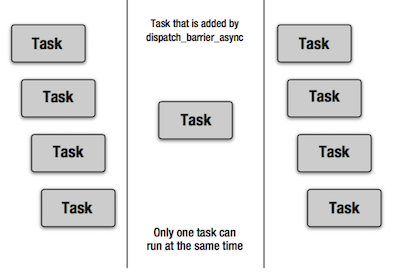

##前言
GCD(Grand Central Dispatch) 是 Apple 推出的一套在支持多核的并发技术。GCD 是基于 iOS 和 OS X 的核心 XNU 内核级的实现，其效率优于使用 pthreads 和 NSTread 这些多线程编程的 API，并且 GCD 结合了 Block 的语法特性，能够发挥出巨大的编程优势。

##GCD API

###1、Dispatch Queue 的工作模式

Dispatch Queue 看名字就知道，这是任务处理队列，通过 GCD 的 API，我们只用在 Block 中实现任务处理逻辑并将其添加到 Dispatch Queue 中去就行了。GCD 提供了两种 Dispatch Queue：

- Serial Dispatch Queue，按照添加的先后顺序执行的任务队列，使用一个线程处理队列。
- Concurrent Dispatch Queue，并发执行的任务队列，使用多个线程处理任务队列。

我们通过下面代码比较这两种队列的区别：

	dispatch_async(queue, blk0); 
	dispatch_async(queue, blk1); 
	dispatch_async(queue, blk2); 
	dispatch_async(queue, blk3); 
	dispatch_async(queue, blk4); 
	dispatch_async(queue, blk5); 

当上面的 queue 是 Serial Dispatch Queue 时，要等待现在执行中的任务处理结束才能执行下一个任务，所以执行的先后顺序是 blk0 执行完后才能执行 blk1，blk1 执行完后才执行 blk2，依次类推。

当变量 queue 是 Concurrent Dispatch Queue 时，不用等待现在执行的任务处理完就可以执行下一个任务，所以执行的先后顺序是首先执行 blk0，不管 blk0 是否结束，都开始执行后面的 blk1，不管 blk1 是否执行结束，都开始执行 blk2，依次内推。需要注意的是，这里能够并行处理的数量取决于当前系统的状态，即 XNU 内核根据 CPU 核数以及 CPU 负荷等当前系统状态来决定应当使用的线程数，并只生成所需的线程来执行任务。当处理结束后，XNU 内核会根据当前任务数量结束不再需要的线程。Concurrent Dispatch Queue 多线程执行任务的例子如下表所示。按表中所示，多个线程是并发的，首先 Thread0 中的 blk0 开始执行，不用等 blk0 执行完，Thread1 中的 blk1 就开始了，接着 Thread2 中的 blk2 也开始执行；Thread0 中的 blk0 执行完后，blk3 开始执行，以此类推。在 Concurrent Dispatch Queue 中的任务执行顺序会根据任务处理内容和系统状态而发生改变，不是固定的。

| Thread0 | Thread1 | Thread2  |
| ------- |:-------:| --------:|
| blk0    | blk1    | blk2     |
| blk3    | blk4    |          |
| bkk5    |         |          |

###2、获得 Dispatch Queue
上面讲了两种 Dispatch Queue 的工作模式，那么我们要使用它们时怎么去获得它们呢？有两种方式：

- 通过 `dispatch_queue_create` API 来创建。
- 获取系统提供的标准的 Dispatch Queue。
	
####自己创建 Dispatch Queue
- 自己创建 Serial 类型的任务队列，参数 `NULL`：

>
	dispatch_queue_t mySerialDispatchQueue = dispatch_queue_create("com.example.gcd.MySerialDispatchQueue", NULL);

- 自己创建 Concurrent 类型的任务队列，参数 `DISPATCH_QUEUE_CONCURRENT`：

>
	dispatch_queue_t myConcurrentDispatchQueue = dispatch_queue_create("com.example.gcd.MyConcurrentDispatchQueue", DISPATCH_QUEUE_CONCURRENT);

如前文所述，每一个 Serial Dispatch Queue 和 Concurrent Dispatch Queue 内使用的线程数量会受系统资源的限制，但是使用 `dispatch_queue_create` 是可以生成任意数量的 Dispatch Queue 的。

对于 `Serial Dispatch Queue` 存在一个需要注意的问题，当我们生成多个 Serial Dispatch Queue，虽然在一个 Queue 里的任务是顺序执行的，但是着多个 Queue 之间却是并发执行的。这就存在一个问题，当生成了过量的 Serial Dispatch Queue，那就会生成过量的线程，这样会消耗大量的内存，并且大量的线程上下文切换会大幅度降低系统的响应性能，这是我们设计程序时需要注意的。而对于 `Concurrent Dispatch Queue`，不管生成多少个 Queue，XNU 内核只使用有效管理的线程，因此不会存在 Serial Dispatch Queue 的上述问题。

一般在设计程序的时候，对于 Dispatch Queue 的使用，建议如下：

- 多个线程需要更新相同的资源而导致数据竞争时，推荐使用 Serial Dispatch Queue。
- 要并行执行不存在数据竞争的多个任务时，推荐使用 Concurrent Dispatch Queue。
- Dispatch Queue 的名称建议使用逆序全程域名。

通过 dispatch_queue_create 创建的 Dispatch Queue 的类型是 `dispatch_queue_t`。可以指定其执行的 Block：

	dispatch_async(myConcurrentDispatchQueue, ^{NSLog(@"block on myConcurrentDispatchQueue");});

在 iOS 6.0 或 Mac OS X 10.8 以前的版本，无论开不开启 ARC，生成的 Dispatch Queue 必须由程序员自己负责释放，需要用到 `dispatch_release` 和 `dispatch_retain`。iOS 6.0 或 Mac OS X 10.8 以后的版本，在 MRC 下还是需要自己 release 和 retain，在 ARC 下则不用自己 release 和 retain 了。

####系统提供的 Dispatch Queue

系统提供的 Dispatch Queue 也有两种：

- Main Dispatch Queue，这个是应用程序主线程对应的任务队列，是 Serial 类型的。追加到 Main Dispatch Queue 中的任务会在主线程的 RunLoop 中执行，像用户界面更新等一些任务必须在主线程中执行。

>
	dispatch_queue_t mainDispatchQueue = dispatch_get_main_queue();
- Global Dispatch Queue，这个是所有应用程序都能使用的任务队列，是 Concurrent 类型。一般情况下，没有必要通过 dispatch_queue_create 自己创建 Concurrent Dispatch Queue，只需要获取 Global Dispatch Queue 使用即可。Global Dispatch Queue 有 4 个执行优先级：DISPATCH_QUEUE_PRIORITY_HIGH、DISPATCH_QUEUE_PRIORITY_DEFAULT、DISPATCH_QUEUE_PRIORITY_LOW、DISPATCH_QUEUE_PRIORITY_BACKGROUND，但由于通过 XNU 内核用于 Global Dispatch Queue 的线程并不能保证实时性，所以执行优先级只是大致的判断。

>
	dispatch_queue_t globalDispatchQueueDefault = dispatch_get_global_queue(DISPATCH_QUEUE_PRIORITY_DEFAULT, 0);

对于 Main Dispatch Queue 和 Global Dispatch Queue 执行  dispatch_release 函数和 dispatch_retain 函数不会引起任何变化，也不会有任何问题。

对 Main Dispatch Queue 和 Global Dispatch Queue 常见的使用形式如下：

    // Execute a Block on a global dispatch queue of default priority.
    dispatch_async(dispatch_get_global_queue(DISPATCH_QUEUE_PRIORITY_DEFAULT, 0), ^{
        // 这里可以写一些并发执行的任务.
        // ...
        
        // Then, execute a Block on the main dispatch queue.
        dispatch_async(dispatch_get_main_queue(), ^{
            // 这里可以写只能在主线程执行的任务，比如更新界面等。
            // ...
        });
        
    });

###3、变更自己创建的 Dispatch Queue 的执行优先级

需求：有时候，我们需要变更自己创建的 Dispatch Queue 的执行优先级。这时我们要用到 `dispatch_set_target_queue` 函数，比如设定自己创建的 Dispatch Queue 在后台执行的方法如下：

	dispatch_queue_t mySerialDispatchQueue = dispatch_queue_create("com.example.gcd.MySerialDispatchQueue", NULL);
	dispatch_queue_t globalDispatchQueueBackground = dispatch_get_global_queue(DISPATCH_QUEUE_PRIORITY_BACKGROUND, 0);
	dispatch_set_target_queue(mySerialDispatchQueue, globalDispatchQueueBackground);

从示例代码中可以看到，`dispatch_set_target_queue` 函数的第一个参数是要被改变优先级的目标 Queue，第二个参数是优先级参照 Queue。请注意，上面讲的系统提供的 Main Dispatch Queue 和 Global Dispatch Queue 不能作为第一个参数，否则不知道会发生什么哦。

`dispatch_set_target_queue` 还有一个功能：如果在多个 Serial Dispatch Queue 中用 `dispatch_set_target_queue` 函数指定目标为某一个 Serial Dispatch Queue，那么原本应该并行执行的多个 Serial Dispatch Queue，在目标 Serial Dispatch Queue 上只能使用一个线程顺序处理。这个功能可以解决这样的需求：已经将多个任务放到多个 Serial Dispatch Queue 中了，并且这些任务还不能并行执行，那么可以用 `dispatch_set_target_queue` 将这些 Queue 的目标指定为某一个 Serial Dispatch Queue，即可防止他们并行处理。

###4、延时执行
需求：在 3 秒后执行处理某个任务。这时可以用 `dispatch_after` 函数。

	dispatch_time_t time = dispatch_time(DISPATCH_TIME_NOW, 3ull * NSEC_PER_SEC); 
	dispatch_after(time, dispatch_get_main_queue(), ^{
		NSLog(@"waited at least three seconds.");
	});

需要注意：`dispatch_after` 函数并不是在指定时间后执行任务，而只是在指定时间后把任务追加到对应的处理队列。比如上面的代码，因为 Main Dispatch Queue 在主线程的 RunLoop 中执行，假设每 1/60 秒执行一次 RunLoop，那么 Block 最快在 3 秒后执行，最慢在 3+1/60 秒后执行，并且在 Main Dispatch Queue 有大量新添加的任务或主线程本身有延迟时，这个时间会更长。所以，如果严格卡时间，`dispatch_after` 函数是有问题的，但是如果只是大致延迟时间，这个函数是很有效的。

###5、押尾任务

需求：在某个 Dispatch Queue 中的所有任务都结束后再执行一段代码。这种在多个任务完成后才执行的任务，我们这里叫做`押尾任务`。

如果，我们使用的只有一个 Serial Dispatch Queue，那就只用把押尾任务最后追加到 Queue 中就可以实现了。但是如果我们使用了 Concurrent Dispatch Queue 或者同时使用了多个 Serial Dispatch Queue 时，这时我们可以用到 Dispatch Group 来实现。

	// 获得系统提供的 Global Dispatch Queue。
    dispatch_queue_t queue = dispatch_get_global_queue(DISPATCH_QUEUE_PRIORITY_DEFAULT, 0);
    // 创建 Dispatch Group，注意跟 dispatch_queue_create 一样，在 MRC 环境下或者 iOS 6 之前的版本 ARC 环境下需要用 dispatch_release(group)。
    dispatch_group_t group = dispatch_group_create();
    
    // 添加任务 Block 到任务队列 queue 中。
    dispatch_group_async(group, queue, ^{NSLog(@"blk0");});
    dispatch_group_async(group, queue, ^{NSLog(@"blk1");});
    dispatch_group_async(group, queue, ^{NSLog(@"blk2");});
    
    // 通知 group，那几个任务都结束了。
    dispatch_group_notify(group, dispatch_get_main_queue(), ^{NSLog(@"done");});

以上代码某次执行的结果是：

	blk1
	blk2
	blk0
	done

其中前三个 blk0、blk1、blk2 因为是添加到了 Global Dispatch Queue 中，是并发的，所以顺序是无法保证的，但是能够确定 done 一定是最后。

`dispatch_group_async` 函数将第三个参数的任务 Block 追加到第二个参数指定的任务队列中，第一个参数是对应的 Dispatch Group。`dispatch_group_notify` 函数在第一个参数指定的 Dispatch Group 对应的所有队列中的任务都结束后，把第三个参数指定的任务 Block 追加到第二个参数指定的任务队列中。

此外我们还可以使用一个 `dispatch_group_wait` 函数，做一些「等待」：

	dispatch_queue_t queue = dispatch_get_global_queue(DISPATCH_QUEUE_PRIORITY_DEFAULT, 0);
    dispatch_group_t group = dispatch_group_create();
    
    dispatch_group_async(group, queue, ^{NSLog(@"blk0");});
    dispatch_group_async(group, queue, ^{NSLog(@"blk1");});
    dispatch_group_async(group, queue, ^{NSLog(@"blk2");});    
    
    // 等待一秒钟。可以指定 DISPATCH_TIME_FOREVER 来永久等待；可以指定 DISPATCH_TIME_NOW 立即判断。
    dispatch_time_t time = dispatch_time(DISPATCH_TIME_NOW, 1ull * NSEC_PER_SEC);
    long result = dispatch_group_wait(group, time);
    if (result == 0) {
        // 所有与 group 关联的任务都已经执行完成了。
    } else {
        // 与 group 关联的任务只有部分执行完了，还有没执行完的。
    }

这里的「等待」是什么意思呢？这意味着一旦调用 `dispatch_group_wait` 函数，该函数就处于调用状态而不返回，即执行 `dispatch_group_wait` 函数的当前线程停止了，在经过函数中指定的时间后或者对应的 Dispatch Group 关联的任务全部执行完后，这个函数才返回，当前线程才继续。**一般情况下，我们向上面一样用 `dispatch_group_notify` 函数追加押尾任务到 Main Dispatch Queue 中就行了，这样可以简化代码，不用判断来判断去的。**

###6、中间截断任务
需求：在访问数据库或文件时，存在着数据竞争的问题。当多个读取任务并行执行，一般是没有问题的。但是，一个写入任务和其他写入任务或读取任务并行处理时就有问题了，可能会数据出错。那么现在我们就是希望读取任务和写入任务能同时执行，并且无错的执行，有什么方案呢？一种方法就是利用前面所讲的 Dispatch Group 和 dispatch_set_target_queue 来实现，但是源代码会写的比较复杂。这里我们提供一共更简洁的方法：`dispatch_barrier_async` 函数，这个函数要皮诶和 Concurrent Dispatch Queue 一起使用。

    dispatch_queue_t queue = dispatch_queue_create( "com.example.gcd.ForBarrier", DISPATCH_QUEUE_CONCURRENT);
    dispatch_async(queue, blk0_for_reading);
    dispatch_async(queue, blk1_for_reading);
    dispatch_async(queue, blk2_for_reading);
    dispatch_async(queue, blk3_for_reading);
    dispatch_barrier_async(queue, blk_for_writing);
    dispatch_async(queue, blk4_for_reading);
    dispatch_async(queue, blk5_for_reading);
    dispatch_async(queue, blk6_for_reading);
    dispatch_async(queue, blk7_for_reading);

`dispatch_barrier_async` 函数会等待当前 Concurrent Dispatch Queue 中并行执行的读取任务都结束后，再将指定的 blk_for_writing 任务添加到 Concurrent Dispatch Queue 中，然后只有在这个任务执行完毕后，后面添加到 Concurrent Dispatch Queue 的任务才恢复正常的并行执行的模式。可见，Concurrent Dispatch Queue 和 dispatch_barrier_async 搭配使用可以使编码非常清晰，同时可以实现高效率的数据库访问和文件访问。

###7、同步执行
与异步执行相对的同步执行函数 `dispatch_sync` 会将任务 Block 同步添加到指定的 Dispatch Queue 中，在添加的这个任务的 Block 执行完毕前，`dispatch_sync` 函数会一直等待。

比如这种情况：执行 Main Dispatch Queue 时，使用另外的线程 Global Dispatch Queue 开始一个任务，而且需要在这个任务处理完成后立即使用它的结果，这时候就需要使用 `dispatch_sync` 函数。

	dispatch_queue_t queue = dispatch_get_global_queue(DISPATCH_QUEUE_PRIORITY_DEFAULT, 0);
	dispatch_sync(queue, ^{/* a task */});

就像前面讲过的「等待」的意思一样，等待意味着当前线程停止，一旦调用 `dispatch_sync` 函数，那么在指定的任务队列的任务执行结束之前，这个函数是不会返回的，`dispatch_sync` 函数可以简化代码，也可以说是简易版的 `dispatch_group_wait` 函数。虽然 `dispatch_sync` 函数使用简单，但是它也很容易引起问题：**死锁**。比如：

	// 死锁示例 1：我停掉当前线程，去等主线程完成后，再执行 Block。额，当前线程就是主线程，它被停掉了，怎么完成执行啊。
	dispatch_queue_t queue = dispatch_get_main_queue(); 
	dispatch_sync(queue, ^{NSLog(@"Hello?");});

	// 死锁示例 2：
	dispatch_queue_t queue = dispatch_get_main_queue(); 
	dispatch_async(queue, ^{
		dispatch_sync(queue, ^{NSLog(@"Hello?");}); 
	});

	// 死锁示例 3：
	dispatch_queue_t queue = dispatch_queue_create("com.example.gcd.MySerialDispatchQueue", NULL);
	dispatch_async(queue, ^{
		dispatch_sync(queue, ^{NSLog(@"Hello?");});
	});

所以在使用 `dispatch_sync` 函数时，一定要深思熟虑。


###8、等待并发任务完成
需求：有时候我们需要在当前线程上把一些任务分发到别的线程上并发执行，并且我们希望当前线程能等待这些任务执行完毕后再继续。比如，我现在在主线程上，我要读取 10000 条数据，这些读取任务是可以并发执行的，而且我要等他们都读取完后再继续主线程上的其他操作。这时候我们可以用 `dispatch_apply` 函数。

`dispatch_apply` 是 `dispatch_sync` 函数和 Dispatch Group 的关联 API。该函数按照指定的次数将指定的 Block 添加到指定的 Dispatch Queue 中，并在当前线程上等待全部任务执行结束，才继续往下执行。


	dispatch_queue_t queue = dispatch_get_global_queue(DISPATCH_QUEUE_PRIORITY_DEFAULT, 0);
	dispatch_apply(5, queue, ^(size_t index) {
		NSLog(@"%zu", index);
	}); 
	
	NSLog(@"done");

可以看到，`dispatch_apply` 的第一个参数是重复的次数，第二个参数是添加任务到哪个队列，第三个参数是添加的任务 Block，这里不同的是 Block 会带 index 参数，这个参数可以配合第一个参数来重复添加任务 Block 并标示各个 Block。

执行结果：

	4
	3
	1
	0
	2
	done

前面的顺序不是确定的，但是 done 一定是在最后。因为`dispatch_apply` 函数会等待任务执行结束，才让继续下面的执行，这样会阻塞它所在的线程，所以推荐在 `dispatch_async` 函数中异步地执行 `dispatch_apply` 函数。如下：


    dispatch_queue_t queue = dispatch_get_global_queue(DISPATCH_QUEUE_PRIORITY_DEFAULT, 0);
    
    // 在 Global Dispatch Queue 中异步执行的任务。
    dispatch_async(queue, ^{
        // 在 Global Dispatch Queue 中会等待 dispatch_apply 函数中的全部任务都结束才继续。
        dispatch_apply([array count], queue, ^(size_t index) {
            // 并行处理 array 中的全部对象。
            NSLog(@"%zu: %@", index, [array objectAtIndex:index]);
        });
        
        // dispatch_apply 函数中的任务全部执行结束。
        
        // 在 Main Dispatch Queue 中异步执行的任务。
        dispatch_async(dispatch_get_main_queue(), ^{
            // 执行用户界面刷新等操作。
            NSLog(@"done");
        });
    });

###9、挂起和恢复
需求：有时候我们会有挂起某一个任务队列的需要。比如任务队列中有一个任务执行了，在任务 Block 中需要处理一些事情，但是任务队列中的其他任务会对这些处理造成影响，这时我们就需要挂起任务队列，等处理完成后再恢复。这时候我们可以用到：

	// 挂起指定的 Dispatch Queue。
	dispatch_suspend(queue);
	// 恢复执行指定的 Dispatch Queue。
	dispatch_resume(queue);

这两个函数对任务队列中已经执行的任务不会产生影响。挂起任务队列后，Dispatch Queue 中尚未执行的任务会停止执行，当恢复后，才会继续执行。

###10、信号量
需求：我们前面讲到了并行处理数据时，可能由于并发的原因造成数据不一致的情况，比如并发的文件读写等，有时甚至造成程序异常结束。虽然通过使用 Serial Dispatch Queue 和 dispatch_barrier_async 函数可以避免这些类似的问题，但是当我们进行更细粒度的排他性控制时，可以使用信号量。这时候我们可以用到 Dispatch Semaphore。

来考虑一个场景，不考了顺序，将所有数据添加到 NSMutableArray 中去：

    dispatch_queue_t queue = dispatch_get_global_queue(DISPATCH_QUEUE_PRIORITY_DEFAULT, 0);
    NSMutableArray *array = [[NSMutableArray alloc] init];
    for (int i = 0; i < 100000; ++i) {
        dispatch_async(queue, ^{
            [array addObject:[NSNumber numberWithInt:i]];
        });
    }

上面的代码使用了 Global Dispatch Queue 来更新 NSMutableArray 类对象，执行后由于内存错误导致应用程序异常结束的概率很高。此时可以使用 Dispatch Semaphore 改造程序如下：

	dispatch_queue_t queue = dispatch_get_global_queue(DISPATCH_QUEUE_PRIORITY_DEFAULT, 0);
	
	// 创建 Dispatch Semaphore，计数初始值为 1，保证可访问 NSMutableArray 对象的线程同时只能有 1 个。
	dispatch_semaphore_t semaphore = dispatch_semaphore_create(1);
	NSMutableArray *array = [[NSMutableArray alloc] init];
	for (int i = 0; i < 100000; ++i) { 
		dispatch_async(queue, ^{
			// 一直等待，直到 Dispatch Semaphore 的计数值达到大于等于 1。
			// 当 Dispatch Semaphore 的值达到大于等于 1 时dispatch_semaphore_wait 函数将 dispatch_semaphore_wait 的计数值减去 1，函数返回。
			dispatch_semaphore_wait(semaphore, DISPATCH_TIME_FOREVER);
			
			// 这里 Dispatch Semaphore 的计数值恒为 0。
			// 此时访问 NSMutableArray 的线程只有 1 个，可以安全操作。
			[array addObject:[NSNumber numberWithInt:i]];
			
			// 排他控制结束，调用 dispatch_semaphore_signal 将 Dispatch Semaphore 计数值加 1。
			// 这时如果有在 dispatch_semaphore_wait 上等待的线程，就能让最先等待的线程执行。
			dispatch_semaphore_signal(semaphore);
		}); 
	}

通过上面的代码，我们大致了解了 Dispatch Semaphore 的几个函数 `dispatch_semaphore_create`、`dispatch_semaphore_wait`、`dispatch_semaphore_signal` 的用法。当进行细粒度的排他处理时，Dispatch Semaphore 可以发挥出威力。

###11、整个应用中的单次执行
需求：我们有时需要在整个程序中保证偶一些代码只执行一次。典型的案例就是单例模式。这时我们可以用到 `dispatch_once`  函数。

以前在实现单例模式时，经常出现如下形式的代码：

	static int initialized = NO;
	if (initialized == NO) {
		// 初始化...

		
		initialized = YES; 
	}

这段代码在大多数情况下是安全的，但是在多核 CPU 多线程环境下，当一个线程读取 initialized 而另一个线程正在更新 initialized 时，就可能出问题，造成多次执行初始化处理。

下面是使用 `dispatch_once` 来实现一个典型的单例模式，可以非常轻松的做到，而且能保证多线程环境下百分百的安全，尤其是多核 CPU 情况下的安全：

	+ (id)sharedInstance {
		static dispatch_once_t predicate;
		static MyService *instance = nil;
		dispatch_once(&predicate, ^{
			instance = [[self alloc] init];
		});
		
		return instance;
	}

###12、Dispatch I/O
需求：当读取较大的文件时，如果将文件分成合适的大小并使用 Global Dispatch Queue 并行兑取，速度应该会更快。现在的输入输出硬件已经可以做到一次使用多个线程更快地并行读取了。这时我们就可以使用 Dispatch I/O 和 Dispatch Data。

下面是使用 Global Dispatch Queue 来分块读取文件：

    dispatch_async(queue, ^{/* loading the file from between 0 to 8191 byte. */});
    dispatch_async(queue, ^{/* loading the file from between 8192 to 16383 byte */});
    dispatch_async(queue, ^{/* loading the file from between 16384 to 24575 byte */});
    dispatch_async(queue, ^{/* loading the file from between 24576 to 32767 byte */});
    dispatch_async(queue, ^{/* loading the file from between 32768 to 40959 byte */});
    dispatch_async(queue, ^{/* loading the file from between 40960 to 49151 byte */});
    dispatch_async(queue, ^{/* loading the file from between 49152 to 57343 byte */});
    dispatch_async(queue, ^{/* loading the file from between 57344 to 65535 byte */});

我们还可以使用 Dispatch I/O 和 Dispatch Data 来进行分割并行读取（摘自 Apple System Log API 用的源代码）：

    pipe_q = dispatch_queue_create("PipeQ", NULL);
    pipe_channel = dispatch_io_create(DISPATCH_IO_STREAM, fd, pipe_q, ^(int err){
        close(fd);
    });
    *out_fd = fdpair[1];

    // dispatch_io_set_low_water 设定一次读取文件块的大小。
    dispatch_io_set_low_water(pipe_channel, SIZE_MAX);

    // dispatch_io_read 函数使用 Global Dispatch Queue 并行读取。
    dispatch_io_read(pipe_channel, 0, SIZE_MAX, pipe_q, ^(bool done, dispatch_data_t pipedata, int err){
        if (err == 0) {
            size_t len = dispatch_data_get_size(pipedata);
            if (len > 0) {
                const char *bytes = NULL;
                char *encoded;
                dispatch_data_t md = dispatch_data_create_map(pipedata, (const void **)&bytes, &len);
                encoded = asl_core_encode_buffer(bytes, len);
                asl_set((aslmsg)merged_msg, ASL_KEY_AUX_DATA, encoded);
                free(encoded);
                _asl_send_message(NULL, merged_msg, -1, NULL);
                asl_msg_release(merged_msg);
                dispatch_release(md);
            }
        }
        if (done) {
            dispatch_semaphore_signal(sem);
            dispatch_release(pipe_channel);
            dispatch_release(pipe_q);
        }
    });

`dispatch_io_create` 函数生成 Dispatch I/O，并制定发生错误时的处理 Block。`dispatch_io_set_low_water` 设定一次读取文件块的大小。`dispatch_io_read` 函数使用 Global Dispatch Queue 并行读取，每当各个分割文件块读取结束时，将含有文件块数据的 Dispatch Data 传递给 dispatch_io_read 函数指定的读取结束时的回调 Block。回调用的 Block 分析传递过来的 Dispatch Data 并进行结合处理。

如果想要提高文件读取速度，可以尝试使用 Dispatch I/O。

###Dispatch Source
在前面讲的所有内容都是围绕着 Dispatch Queue。这节讲讲不常被提到的 Dispatch Source。Dispatch Source 是 BSD 系内核惯有功能 kqueue 的封装。kqueue 是在 XNU 内核中发生各种事件时，在应用程序编程方进行处理的技术。其 CPU 负载非常小。kqueue 可以说是应用程序处理 XNU 内核中发生的各种事件的方法中最优秀的一种。

Dispatch Source 可以处理的事件包括，当事件发生时，在指定的 Dispatch Queue 中可执行事件的处理：

| 事件名 | 事件描述 |
| ------- |:-------:| 
| DISPATCH_SOURCE_TYPE_DATA_ADD    | 数据增加    |
| DISPATCH_SOURCE_TYPE_DATA_OR    | 数据 OR    | 
| DISPATCH_SOURCE_TYPE_MACH_SEND    | 通过 MACH 端口发送        |
| DISPATCH_SOURCE_TYPE_MACH_RECV    | 通过 MACH 端口接收        |
| DISPATCH_SOURCE_TYPE_PROC    | 检测到进程相关的事件        |
| DISPATCH_SOURCE_TYPE_READ | 文件句柄(File Descriptor)变为可读 |
| DISPATCH_SOURCE_TYPE_SIGNAL | 接收到信号 |
| DISPATCH_SOURCE_TYPE_TIMER | 定时器 |
| DISPATCH_SOURCE_TYPE_VNODE | 文件系统发生变更 |
| DISPATCH_SOURCE_TYPE_WRITE | 文件句柄(File Descriptor)变为可写 |

下面的例子中我们使用 DISPATCH_SOURCE_TYPE_READ，异步读取文件映像：

    __block size_t total = 0;
    size_t size = 要读取的字节数;
    char *buff = (char *)malloc(size);
    
    // 设置 File Descriptor(sockfd) 为异步读取。
    fcntl(sockfd, F_SETFL, O_NONBLOCK);
    
    // 获取 Global Dispatch Queue。
    dispatch_queue_t queue = dispatch_get_global_queue(DISPATCH_QUEUE_PRIORITY_DEFAULT, 0);
    
    // 创建处理文件读取事件的 Dispatch Source。
    dispatch_source_t source = dispatch_source_create(DISPATCH_SOURCE_TYPE_READ, sockfd, 0, queue);
    
    // 设定处理事件的 handler。
    dispatch_source_set_event_handler(source, ^{
        // 得到可读取的字节数。
        size_t available = dispatch_source_get_data(source);
        // 读取数据。
        int length = read(sockfd, buff, available);
        // 当发生错误时，取消 Dispatch Source。
        if (length < 0) {
            dispatch_source_cancel(source);
        }
        total += length;
        if (total == size) {
            // 此处编写处理数据的代码...
            
            // 处理完成，取消 Dispatch Source。
            dispatch_source_cancel(source);
        }
    });
    
    // 设定取消 Dispatch Source 时的 handler。
    dispatch_source_set_cancel_handler(source, ^{
        free(buff);
        close(sockfd);
        
        // 释放 Dispatch Source。根据 ARC 环境以及系统版本决定是否要调用 dispatch_release。
        // dispatch_release(source);
    });
    
    // 启动 Dispatch Source。
    dispatch_resume(source);

最后再来一个示例，使用 DISPATCH_SOURCE_TYPE_TIMER 设置定时器，在网络编程的通信超时等情况下可使用这个例子：

    // 创建一个处理 DISPATCH_SOURCE_TYPE_TIMER 事件的 Dispatch Source。
    // 当经过一段指定的时间时，设定 Main Dispatch Queue 为添加任务的目标任务队列。
    dispatch_source_t timer = dispatch_source_create( DISPATCH_SOURCE_TYPE_TIMER, 0, 0, dispatch_get_main_queue());
    
    // 将定时器设定为 15 秒后触发，设定为不重复模式，并允许延迟 1 秒。
    dispatch_source_set_timer(timer, dispatch_time(DISPATCH_TIME_NOW, 15ull * NSEC_PER_SEC), DISPATCH_TIME_FOREVER, 1ull * NSEC_PER_SEC);
    
    // 设定定时器触发时的事件处理 handler。
    dispatch_source_set_event_handler(timer, ^{
        NSLog(@"wakeup!");
        
        // 取消 Dispatch Source。
        dispatch_source_cancel(timer); });
    
    // 设定取消 Dispatch Source 时的 handler。
    dispatch_source_set_cancel_handler(timer, ^{
        NSLog(@"canceled");
        
        // 释放 Dispatch Source。根据 ARC 环境以及系统版本决定是否要调用 dispatch_release。
        // dispatch_release(timer);
    });
    
    // 启动 Dispatch Source。
    dispatch_resume(timer);

通过上面的代码我们可以看到，Dispatch Queue 实际上没有「取消」这个概念，一旦任务添加到 Dispatch Queue 中就没有办法将其去除，也没有办法在执行中将任务取消。编程人员要么在任务处理逻辑中引入「取消」的机制，要么放弃「取消」，或者使用 NSOperationQueue 等其他方法。

Dispatch Source 与 Dispatch Queue 不同，Dispatch Source 是可以取消的，而且取消时可以指定回调用的 Block，所以使用 Dispatch Source 来实现 XNU 内核中发生事件时的一些处理比直接使用 kqueue 要更为简单，推荐使用。

[SamirChen]: http://samirchen.com "SamirChen"
[1]: {{ page.url }} ({{ page.title }})
[2]: http://samirchen.com/ios-gcd/

