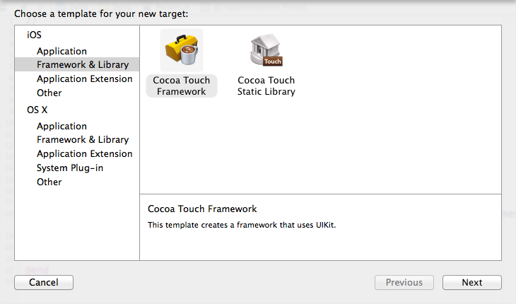
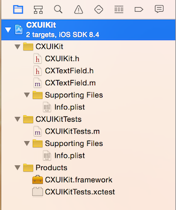
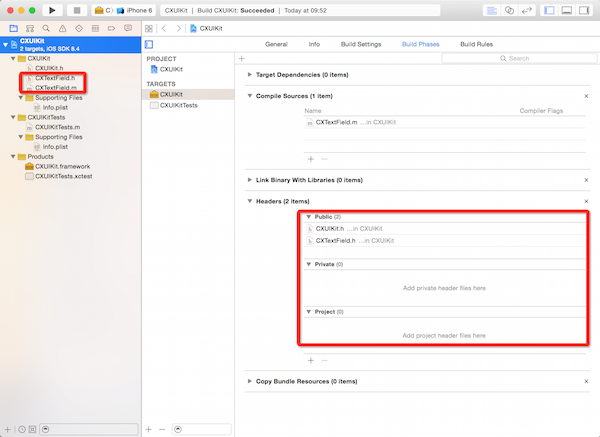
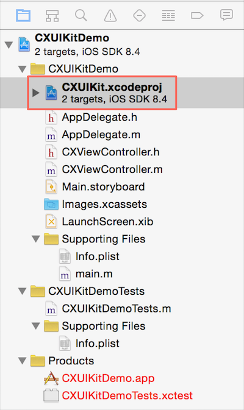
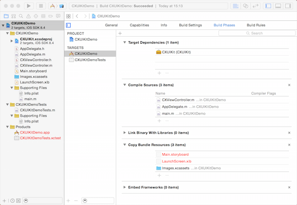
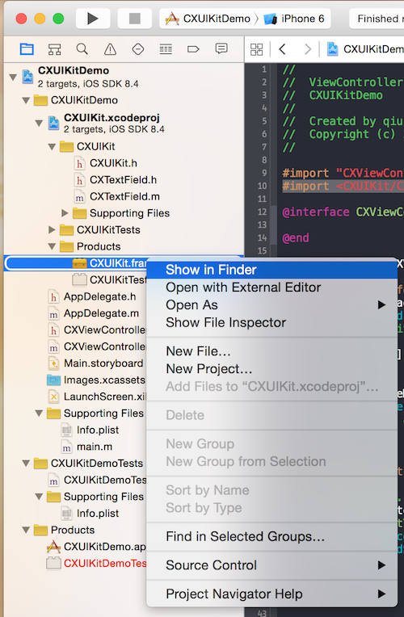
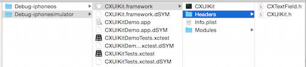
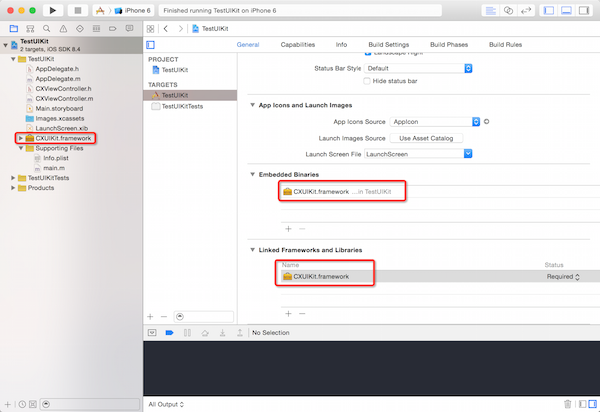
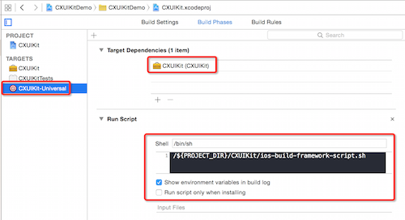
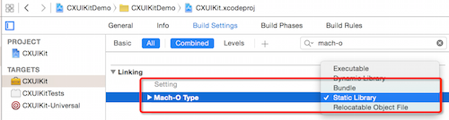

##什么是 Framework

Framework 是 Mac OS/iOS 平台用来打包代码的一种方式，它可以将代码文件、头文件和有关的资源文件一起打包提供给开发者使用。

谈到 Framework，不妨了解了解库的概念，所谓的库（Library）即一段编译好的二进制代码，再配上描述库接口的头文件从而可以提供给其他开发者使用。在使用库的时候需要对库的代码进行 Link，而 Link 有两种方式：静态和动态，从而产生了静态链接库和动态链接库的概念。

静态库的常见形式包括：Windows 下的 `.lib` 文件，Linux 和 Mac 下的 `.a` 文件。它的 Link 方式是在编译的时候直接拷贝一份库代码，复制到目标程序里，这段代码在目标程序中就不会再变动了。这样做的**好处**是编译完后，库文件实际就没啥用了，目标程序没有外部依赖，直接运行即可；**缺点**是会造成目标程序的体积增大。

动态库的常见形式包括：Windows 下的 `.dll` 文件，Linux 下的 `.so` 文件，Mac 下的 `.dylib` 文件。与静态库不同，动态库在编译时并不会被拷贝到目标程序中，目标程序中只会存储指向动态库的引用。等到程序运行时，动态库才会被真正加载进来。这样做的**好处**是不需要拷贝库代码到目标程序中，不会增大目标程序的体积，而且同一份库可以被多个程序使用（因此动态库也被叫做共享库）。此外，运行时才载入的特征也使得我们可以随时对动态库进行替换，而不需要重新编译代码，这点对开发者来说具有很大的吸引力。动态库的**缺点**主要是在载入时会需要一些性能消耗，而且动态库也使得目标程序需要依赖于外部环境，当目标程序依赖的动态库在外部环境中缺失或版本不符时，就会导致程序执行出错。

回过头来再说 Framework，它其实就是一种动态链接库，只不过它除了打包代码外还能打包资源文件。在 iOS 8 发布时，苹果开放了对动态 Framework 的支持，这应该是苹果为支持 Extension 这一特性而做出的选择（Extension 和 App 是两个分开的可执行文件，它们之间共享代码，所以需要 Framework 支持）。但是这种动态 Framework 和系统自带的 Framework 还是有区别的，系统的 Framework 是不需要我们拷贝到 App 里的，但是我们自己的 Framework 还是需要拷贝到 App 里的，因此这种 Framework 也叫做 Embedded Framework。可以使用动态 Framework 了，从服务器动态更新动态库的想法就显得自然而然了，但是在 iOS 上这样的做法是不被苹果支持的，会有被拒的风险。

如我们所知，跟着 iOS 8 和 Xcode 6 一起发布的还有 Swift，现在 Swift 是不支持静态库的，只能支持动态 Framework。造成这个问题的原因主要是 Swift 的 Runtime 没有被包含在 iOS 系统中，而是会打包进 App 中（这也是造成 Swift App 体积大的原因），静态库会导致最终的目标程序中包含重复的 Runtime。同时拷贝 Runtime 这种做法也会导致在纯 Objective-C 的项目中使用 Swift 库出现问题。苹果声称等到 Swift 的 Runtime 稳定之后会被加入到系统当中，到时候这个限制就会被去除了。

现在通过 Xcode 6 及以上的版本我们已经可以自己创建 Cocoa Touch Framework 了。现在就来讲一讲。

##创建一个 Framework 项目

1) 在 Xcode 中，File -> New -> Project -> Framework & Library -> Cocoa Touch Framework 来创建项目。

2) 向项目中添加代码。（CXTextField.h, CXTextField.m）

3) 在 CXUIKit.h 文件中添加公共代码的头文件：`#import <CXUIKit/CXTextField.h>`。

代码如下：

	#import <UIKit/UIKit.h>	
	//! Project version number for CXUIKit.
	FOUNDATION_EXPORT double CXUIKitVersionNumber;
	//! Project version string for CXUIKit.
	FOUNDATION_EXPORT const unsigned char CXUIKitVersionString[];
	// In this header, you should import all the public headers of your framework using statements like #import <CXUIKit/PublicHeader.h>
	#import <CXUIKit/CXTextField.h>

4) 开放公用代码的头文件。把需要曝光给外部的头文件放到 Targets -> Build Phases -> Headers -> Public 栏中。

接下来，应该就能编译成功了。但是需要注意的是，你选择的编译的目标平台不一样编译得到的 CXUIKit.framework 是不一样的。

##创建一个测试 Framework 的 Demo 项目

1) 在 Xcode 中，File -> New -> Project -> Application -> Single View Application 创建一个测试 Framework 的 Demo App：CXUIKitDemo。将上一节中创建的 Framework 项目的 CXUIKit.xcodeproj 文件拖到 CXUIKitDemo 中，位置如图所示。在拖之前，需要注意的是，你需要先关掉 CXUIKit 项目，因为 Xcode 不允许在两个不同的窗口打开同一个项目。

通过这种方式你能够同时开发 CXUIKit Framework 项目和测试它。

2) 在 CXUIKitDemo 项目的 Targets -> Build Phases -> Target Dependencies 中添加 CXUIKit Framework。

接下来，你就可以在 CXUIKitDemo 项目中使用 CXUIKit 提供的 CXTextField 等代码了，并且应该能正确编译执行。如果你修改了 CXUIKit Framework 项目中的代码，直接运行 CXUIKitDemo App 项目就能看到效果。

##在 App 项目中使用独立的 Framework

在上节我们通过添加子项目的方式实现能够同时开发和测试 CXUIKit Framework 的目的，但是在实际使用中，Framework 通常是单独拿出来提供给其他开发者使用的，所以这里讲讲这种方式。

1）在 Xcode 中，File -> New -> Project -> Application -> Single View Application 再创建一个测试 Framework 的 Test App：TestUIKit。

2）在 CXUIKit 项目中，Product -> CXUIKit.framework -> Show in finder 来找到打包好的 CXUIKit.framework 文件。

由于我们的测试项目 TestUIKit 是运行在模拟器上，所以我们选择 Debug-iphonesimulator 目录下面的 CXUIKit.framework 文件。

3）把 CXUIKit.framework 拷贝和添加到 TestUIKit 项目中。确保如图在 Targets -> TestUIKit -> General -> Embedded Binaries & Linked Frameworks and Libraries 中都添加了 CXUIKit.framework。

在代码中使用 CXUIKit：

	#import "CXViewController.h"
	#import <CXUIKit/CXUIKit.h>
	
	@interface CXViewController ()
	
	@end
	
	@implementation CXViewController
	
	#pragma mark - Lifecycle
	- (void)viewDidLoad {
	    [super viewDidLoad];
	    
	    // Text field.
	    CXTextField *textField = [[CXTextField alloc] initWithFrame:CGRectMake(10, 100, self.view.bounds.size.width-10*2, 40)];
	    textField.leftTitleText = @"名字";
	    textField.placeholder = @"请输入你的名字";
	    [self.view addSubview:textField];
	}
	
	- (void)didReceiveMemoryWarning {
	    [super didReceiveMemoryWarning];
	}
	@end

需要注意：如果 Embedded Binaries 中没添加 CXUIKit.framework，你在项目中使用 CXUIKit 时会遇到报错：

	dyld: Library not loaded: @rpath/CXUIKit.framework/CXUIKit
	  Referenced from: .../TestBlock.app/TestBlock
	  Reason: image not found

Embedded Binaries 的含义可以这样理解：在 Build 时需要拷贝进 App Bundle 里的库。这时相对 Apple 官方提供的那些 Cocoa Framework(Foundation.framework, UIKit.framework) 而言的，官方提供的 Framework 是在系统中就包含的，不需要我们拷贝到 App Bundle 里，而我们自己开发的 Framework 则需要，即通过在 Embedded Binaries 添加它们来实现。

##编译各架构通用的 Framework

在上面一节中，我们已经看到了如何在一个测试项目中使用独立的 Framework 的流程。但现在出现了一个问题：当我们在 TestUIKit 项目中把程序的编译目标改为 iOS Device 时，报错了。

报错信息：

	Undefined symbols for architecture armv7:
	  "_OBJC_CLASS_$_CXTextField", referenced from:
	      objc-class-ref in CXViewController.o
	ld: symbol(s) not found for architecture armv7
	clang: error: linker command failed with exit code 1 (use -v to see invocation)

这是因为我们之前拷贝过来的 CXUIKit.framework 文件是编译给模拟器用的，只支持模拟器所在的 PC 的架构 x86_64，而不针对所有平台。

这里插入一点小知识：如何查看 Framework 支持哪些平台？方式如下：

	$ lipo -info CXUIKit.framework/CXUIKit 
	Architectures in the fat file: CXUIKit.framework/CXUIKit are: x86_64

Xcode 编译 Framework 时针对模拟器和真机打的包是不一样的，支持的平台自然不一样。

那现在要在真机设备上运行 TestUIKit 程序要怎么办呢？一个办法是把编译给真机用的 CXUIKit.framework 文件拿过来替换掉当前的这个，但是这样一来，当在不同平台之间切换时就太麻烦了。另外一个办法就是我们接下来要讲的**编译各架构通用的 Framework**。

1）在 CXUIKit 项目中创建 Aggregate Target，路径为 File -> New -> Targets... -> Aggregate。命名 CXUIKit-Universal。

2）在 Targets -> CXUIKit-Universal -> Target Dependencies 中添加 CXUIKit 依赖项，这样使得在编译 CXUIKit-Universal 的时候会先走正常流程编译 CXUIKit.framework。

3）在 Targets -> CXUIKit-Universal -> Run Script 中添加执行脚本的命令 `/${PROJECT_DIR}/CXUIKit/ios-build-framework-script.sh`。效果如图：

对应的 ios-build-framework-script.sh 脚本内容为：

	set -e
	set +u

	### Avoid recursively calling this script.
	if [[ $UF_MASTER_SCRIPT_RUNNING ]]
	then
	exit 0
	fi
	set -u
	export UF_MASTER_SCRIPT_RUNNING=1

	### Constants.
	UF_TARGET_NAME=${PROJECT_NAME}
	FRAMEWORK_VERSION="A"
	UNIVERSAL_OUTPUTFOLDER=${BUILD_DIR}/${CONFIGURATION}-universal
	IPHONE_DEVICE_BUILD_DIR=${BUILD_DIR}/${CONFIGURATION}-iphoneos
	IPHONE_SIMULATOR_BUILD_DIR=${BUILD_DIR}/${CONFIGURATION}-iphonesimulator

	### Functions

	## List files in the specified directory, storing to the specified array.
	#
	# @param $1 The path to list
	# @param $2 The name of the array to fill
	#
	##
	list_files ()
	{
	    filelist=$(ls "$1")
	    while read line
	    do
	        eval "$2[\${#$2[*]}]=\"\$line\""
	    done <<< "$filelist"
	}

	### Take build target.
	if [[ "$SDK_NAME" =~ ([A-Za-z]+) ]]
	then
	SF_SDK_PLATFORM=${BASH_REMATCH[1]} # "iphoneos" or "iphonesimulator".
	else
	echo "Could not find platform name from SDK_NAME: $SDK_NAME"
	exit 1
	fi

	### Build simulator platform. (i386, x86_64)
	echo "========== Build Simulator Platform =========="
	echo "===== Build Simulator Platform: i386 ====="
	xcodebuild -project "${PROJECT_FILE_PATH}" -target "${TARGET_NAME}" -configuration "${CONFIGURATION}" -sdk iphonesimulator BUILD_DIR="${BUILD_DIR}" OBJROOT="${OBJROOT}" BUILD_ROOT="${BUILD_ROOT}" CONFIGURATION_BUILD_DIR="${IPHONE_SIMULATOR_BUILD_DIR}/i386" SYMROOT="${SYMROOT}" ARCHS='i386' VALID_ARCHS='i386' $ACTION

	echo "===== Build Simulator Platform: x86_64 ====="
	xcodebuild -project "${PROJECT_FILE_PATH}" -target "${TARGET_NAME}" -configuration "${CONFIGURATION}" -sdk iphonesimulator BUILD_DIR="${BUILD_DIR}" OBJROOT="${OBJROOT}" BUILD_ROOT="${BUILD_ROOT}" CONFIGURATION_BUILD_DIR="${IPHONE_SIMULATOR_BUILD_DIR}/x86_64" SYMROOT="${SYMROOT}" ARCHS='x86_64' VALID_ARCHS='x86_64' $ACTION

	### Build device platform. (armv7, arm64)
	echo "========== Build Device Platform =========="
	echo "===== Build Device Platform: armv7 ====="
	xcodebuild -project "${PROJECT_FILE_PATH}" -target "${TARGET_NAME}" -configuration "${CONFIGURATION}" -sdk iphoneos BUILD_DIR="${BUILD_DIR}" OBJROOT="${OBJROOT}" BUILD_ROOT="${BUILD_ROOT}"  CONFIGURATION_BUILD_DIR="${IPHONE_DEVICE_BUILD_DIR}/armv7" SYMROOT="${SYMROOT}" ARCHS='armv7 armv7s' VALID_ARCHS='armv7 armv7s' $ACTION

	echo "===== Build Device Platform: arm64 ====="
	xcodebuild -project "${PROJECT_FILE_PATH}" -target "${TARGET_NAME}" -configuration "${CONFIGURATION}" -sdk iphoneos BUILD_DIR="${BUILD_DIR}" OBJROOT="${OBJROOT}" BUILD_ROOT="${BUILD_ROOT}" CONFIGURATION_BUILD_DIR="${IPHONE_DEVICE_BUILD_DIR}/arm64" SYMROOT="${SYMROOT}" ARCHS='arm64' VALID_ARCHS='arm64' $ACTION

	### Build device platform. (arm64, armv7)
	echo "========== Build Universal Platform =========="
	## Copy the framework structure to the universal folder (clean it first).
	rm -rf "${UNIVERSAL_OUTPUTFOLDER}"
	mkdir -p "${UNIVERSAL_OUTPUTFOLDER}"
	## Copy the last product files of xcodebuild command.
	cp -R "${IPHONE_DEVICE_BUILD_DIR}/arm64/${PROJECT_NAME}.framework" "${UNIVERSAL_OUTPUTFOLDER}/${PROJECT_NAME}.framework"

	### Smash them together to combine all architectures.
	lipo -create  "${BUILD_DIR}/${CONFIGURATION}-iphonesimulator/i386/${PROJECT_NAME}.framework/${PROJECT_NAME}" "${BUILD_DIR}/${CONFIGURATION}-iphonesimulator/x86_64/${PROJECT_NAME}.framework/${PROJECT_NAME}" "${BUILD_DIR}/${CONFIGURATION}-iphoneos/armv7/${PROJECT_NAME}.framework/${PROJECT_NAME}" "${BUILD_DIR}/${CONFIGURATION}-iphoneos/arm64/${PROJECT_NAME}.framework/${PROJECT_NAME}" -output "${UNIVERSAL_OUTPUTFOLDER}/${PROJECT_NAME}.framework/${PROJECT_NAME}"

	### Create standard structure for framework.
	#
	# If we don't have "Info.plist -> Versions/Current/Resources/Info.plist", we may get error when use this framework.
	#
	# MyFramework.framework
	# |-- MyFramework -> Versions/Current/MyFramework
	# |-- Headers -> Versions/Current/Headers
	# |-- Resources -> Versions/Current/Resources
	# |-- Info.plist -> Versions/Current/Resources/Info.plist
	# `-- Versions
	#     |-- A
	#     |   |-- MyFramework
	#     |   |-- Headers
	#     |   |   `-- MyFramework.h
	#     |   `-- Resources
	#     |       |-- Info.plist
	#     |       |-- MyViewController.nib
	#     |       `-- en.lproj
	#     |           `-- InfoPlist.strings
	#     `-- Current -> A
	#
	echo "========== Create Standard Structure =========="
	mkdir -p "${UNIVERSAL_OUTPUTFOLDER}/${PROJECT_NAME}.framework/Versions/${FRAMEWORK_VERSION}/"
	mv "${UNIVERSAL_OUTPUTFOLDER}/${PROJECT_NAME}.framework/${PROJECT_NAME}" "${UNIVERSAL_OUTPUTFOLDER}/${PROJECT_NAME}.framework/Versions/${FRAMEWORK_VERSION}/"
	mv "${UNIVERSAL_OUTPUTFOLDER}/${PROJECT_NAME}.framework/Headers" "${UNIVERSAL_OUTPUTFOLDER}/${PROJECT_NAME}.framework/Versions/${FRAMEWORK_VERSION}/"
	mkdir -p "${UNIVERSAL_OUTPUTFOLDER}/${PROJECT_NAME}.framework/Resources"
	declare -a UF_FILE_LIST
	list_files "${UNIVERSAL_OUTPUTFOLDER}/${PROJECT_NAME}.framework/" UF_FILE_LIST
	for file_name in "${UF_FILE_LIST[@]}"
	do
		if [[ "${file_name}" == "Info.plist" ]] || [[ "${file_name}" =~ .*\.lproj$ ]]
		then
			mv "${UNIVERSAL_OUTPUTFOLDER}/${PROJECT_NAME}.framework/${file_name}" "${UNIVERSAL_OUTPUTFOLDER}/${PROJECT_NAME}.framework/Resources/"
		fi
	done
	mv "${UNIVERSAL_OUTPUTFOLDER}/${PROJECT_NAME}.framework/Resources" "${UNIVERSAL_OUTPUTFOLDER}/${PROJECT_NAME}.framework/Versions/${FRAMEWORK_VERSION}/"
	ln -sfh "Versions/Current/Resources/Info.plist" "${UNIVERSAL_OUTPUTFOLDER}/${PROJECT_NAME}.framework/Info.plist"
	ln -sfh "${FRAMEWORK_VERSION}" "${UNIVERSAL_OUTPUTFOLDER}/${PROJECT_NAME}.framework/Versions/Current"
	ln -sfh "Versions/Current/${PROJECT_NAME}" "${UNIVERSAL_OUTPUTFOLDER}/${PROJECT_NAME}.framework/${PROJECT_NAME}"
	ln -sfh "Versions/Current/Headers" "${UNIVERSAL_OUTPUTFOLDER}/${PROJECT_NAME}.framework/Headers"
	ln -sfh "Versions/Current/Resources" "${UNIVERSAL_OUTPUTFOLDER}/${PROJECT_NAME}.framework/Resources"

	### Open the universal folder.
	open "${UNIVERSAL_OUTPUTFOLDER}"

这个脚本大致的意思是：首先，Xcode 会根据选中的 Target 编译出对应的包；接着，在脚本执行的过程中，会依次编译出支持 i386、x86_64、arm64、armv7、armv7s 的包，然后把各个包中的库文件通过 lipo 工具合并为一个支持各平台的通用库文件，再基于最后一个 xcodebuild 命令打出的包的结构(arm64/CXUIKit.framework)和这个通用库文件生成一个支持各个平台的通用 Framwork；然后，脚本尝试把通用 Framework 的文件结构调整为比较常见的标注 Framework 结构；最后弹出存放这个通用 Framework 的文件夹。在我们这个 CXUIKit 项目中把打出来的通用的 CXUIKit.framework 文件拖到我们之前的 TestUIKit App 项目中发现不论在模拟器还是在 iOS 设备都可以正确执行了。

在实际操作的过程中我遇到了一些问题，小结一下：

- 对于一种 SDK (iphonesimulator 或 iphoneos)，连续调用 xcodebuild 时，后面的 build 过程中会删除前面 build 过程中生成的 Headers、Modules 等目录及文件。这个可以在 Xcode 的 Report Navigator 里看 Build Log 里的 Remove stale build products 后面的内容可知。所以这里拷贝最后一个 build 的 arm64/CXUIKit.framework 的结构。
- 在调整 CXUIKit.framework 的包结构为常见的标准结构的过程中，需要增加有一个 Symbolic Link：`Info.plist -> Versions/Current/Resources/Info.plist`，否则在提供给其他项目使用时会遇到错误：`The operation couldn’t be completed. (LaunchServicesError error 0.)`。参考：[Application with private framework “could not inspect application package” in Xcode 6. Missing framework info.plist](http://stackoverflow.com/questions/26001321/application-with-private-framework-could-not-inspect-application-package-in-xc)。

以上便是编译各架构通用的 Framework 的流程。当你需要提供出一个独立的并且通用的 CXUIKit.framework 时，在 CXUIKit 这个 Framework 项目中选择 CXUIKit-Universal -> iPhone Simulator 编译即可。

接下来回顾一下上面提到的把 CXUIKit Framework 项目作为子项目的 CXUIKitDemo App 项目。上面的这个编译通用 Framework 的流程对于 CXUIKitDemo App 项目是没有影响的，CXUIKitDemo App 项目的 Target Dependencies 仍然是 CXUIKit Framework 项目的 CXUIKit 这个 target，跟 CXUIKit-Universal 这个 Aggregate Target 是无关的。并且，CXUIKitDemo App 在编译执行时选择目标为模拟器或者 iOS 设备，CXUIKit Framework 都会为其编译出对应架构的 Framework 从而保证其引用正确的 CXUIKit.framework。

##编译静态库

动态 Framework 毫无疑问是我们优先考虑的代码打包方式，但是为了兼容一些低版本系统对动态库的限制，我们有时候还是需要打包静态库来使用，我们可以通过下面几步来实现：

1）在 Xcode 中 Targets -> CXUIKit -> Build Settings 下设置 Mach-O Type 值为 Static Library。这样你就可以编译出静态库了。你可以比较一下动态方式和静态方式编译出来的二进制文件的大小，它们是不一样的。

2）此外，在使用 CXUIKit 库的测试项目 TestUIKit App 中的 Targets -> TestUIKit -> General -> Embedded Binaries 中就可以去掉 CXUIKit.framework 了。

##参考

- [Framework vs Library (Cocoa, iOS)][3]
- [iOS 静态库、动态库与 Framework][4]
- [How to Create a Framework for iOS 8 on Xcode 6][5]

[SamirChen]: http://samirchen.com "SamirChen"
[1]: {{ page.url }} ({{ page.title }})
[2]: http://samirchen.com/create-a-framework/
[3]: http://www.knowstack.com/framework-vs-library-cocoa-ios/
[4]: http://skyline75489.github.io/post/2015-8-14_ios_static_dynamic_framework_learning.html
[5]: http://insert.io/framework-ios8-xcode6/