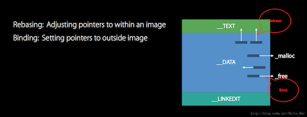

## 应用入口

通常，说到一个 App 的入口，我们会想到 `main()` 函数，但其实在 `main()` 调用之前还有一段过程，我们称之为 `pre-main`。


在 Xcode 新建一个项目，是通过 main() 来引导启动了一个 UIApplicationMain 方法来对 AppDelegate 进行回调。当断点在 main 函数里时，我们发现调用栈底多了一个 start 方法。这时的堆栈是：

```
* thread #1, queue = 'com.apple.main-thread', stop reason = breakpoint 1.1
  * frame #0: 0x00000001025d27ec MyApp`main(argc=1, argv=0x000000016d8339f8) at main.m:13
    frame #1: 0x000000018212dfc0 libdyld.dylib`start + 4
```

进入 start 栈帧可以看到如下代码：

```
libdyld.dylib`start:
    0x18212dfbc <+0>: nop    
    0x18212dfc0 <+4>: bl     0x182176244               ; exit
    0x18212dfc4 <+8>: brk    #0x3
```


通过注释可以猜到这是进入程序退出步骤的代码，也就是 main 函数执行后最终的去处。但是能发现 start() 方法是 libdyld.dylib 动态库中的。

这是在 main() 中发现的全部信息，我们再换一种方式去进入这个 pre-main：`+load` 函数。

+load() 是 NSObject 的类方法，我们都知道很多早于 main() 执行的代码都可以在继承类的 +load() 里完成。通过在 AppDelegate 类添加一个 +load() 方法，断点查看调用栈：


```
(lldb) thread backtrace
* thread #1, queue = 'com.apple.main-thread', stop reason = breakpoint 2.1
  * frame #0: 0x00000001025d2884 MyApp`+[AppDelegate load](self=AppDelegate, _cmd="load") at AppDelegate.m:19
    frame #1: 0x00000001819929f0 libobjc.A.dylib`call_load_methods + 184
    frame #2: 0x0000000181993b58 libobjc.A.dylib`load_images + 76
    frame #3: 0x00000001027060c8 dyld`dyld::notifySingle(dyld_image_states, ImageLoader const*, ImageLoader::InitializerTimingList*) + 384
    frame #4: 0x000000010271612c dyld`ImageLoader::recursiveInitialization(ImageLoader::LinkContext const&, unsigned int, char const*, ImageLoader::InitializerTimingList&, ImageLoader::UninitedUpwards&) + 440
    frame #5: 0x00000001027151cc dyld`ImageLoader::processInitializers(ImageLoader::LinkContext const&, unsigned int, ImageLoader::InitializerTimingList&, ImageLoader::UninitedUpwards&) + 136
    frame #6: 0x0000000102715288 dyld`ImageLoader::runInitializers(ImageLoader::LinkContext const&, ImageLoader::InitializerTimingList&) + 84
    frame #7: 0x0000000102706498 dyld`dyld::initializeMainExecutable() + 220
    frame #8: 0x000000010270b0fc dyld`dyld::_main(macho_header const*, unsigned long, int, char const**, char const**, char const**, unsigned long*) + 6176
    frame #9: 0x000000010270521c dyld`_dyld_start + 68
```


可以发现此时还未执行到 main()，而且看起来调用函数也不少。不过暂且忽略具体内容，直接进入最底部的 `_dyld_start()` 栈帧，在最底下的 br 指令加一个断点，并执行到此处，显示如下汇编指令：


```
dyld`_dyld_start:
    0x1027051d8 <+0>:   mov    x28, sp
    0x1027051dc <+4>:   and    sp, x28, #0xfffffffffffffff0
    0x1027051e0 <+8>:   mov    x0, #0x0
...
    0x102705218 <+64>:  bl     0x102705260               ; dyldbootstrap::start(macho_header const*, int, char const**, long, macho_header const*, unsigned long*)
    0x10270521c <+68>:  mov    x16, x0
...
->  0x10270525c <+132>: br     x16
```

上述代码大致经历了以下步骤：


- 1、移动栈底指针以及局部变量初始化等操作。
- 2、调用 `dyldbootstrap::start()` 方法。
- 3、将 `dyldbootstrap::start()` 的返回值会放入 x0 寄存器，随后赋给 x16 寄存器。
- 4、跳转 x16 寄存器所存储的地址。

那 x16 寄存器存的地址是什么？我们通过 lldb 查看：

```
(lldb) register read x16
     x16 = 0x00000001025d27d4  MyApp`main at main.m:12
```

通过注释说明，这正是指向 main() 函数的地址，结合开头我们获取的 main 的调用栈地址 0x00000001026ea7ec，br 后就是进入了 main 函数的主体代码，相差的几个字节是压栈时移动栈底指针的汇编指令。


到这里就知道了 main() 的源头，但又产生更多的疑问，`dyldbootstrap::start()` 里面做了什么？是如果得到并返回 main() 函数地址的？调用栈里出现频繁的的 dyld/libdyld 是什么？而这个 `_dyld_start` 又看起来比 main() 更像入口一点。

另外，仔细观察上述汇编指令的地址，有些是 0x102 开头的连续地址，而有些是开头 0x181 的地址，就运行情况来说 0x102 开头对应的函数地址每次运行都会改变，0x181 的那些地址就是固定的，这里有什么原因和差异。


## 应用的启动和加载

### 应用启动的大致流程

iOS 的 App 启动主要分为以下步骤：

- 1）内核初始化阶段。打开 App，系统内核进行初始化跳转到 dyld 执行。
- 2）动态链接阶段。进入 dyld 动态链接器，它负责将一个 App 处理为一个可运行的状态，包含：
	- 加载 MachO 可执行文件的依赖库（这些依赖库也是 MachO 格式的文件）。
	- Fix-ups（地址修正），包括 rebasing 和 binding 等。
	- ObjC 环境配置。
	- 执行各模块初始化器。
	- 查找并跳转到 main() 函数入口。
- 3）界面绘制阶段。进入 main() -> UIApplicationMain -> 初始化回调 -> 显示 UI。


### MachO 文件介绍


在讲解各个阶段之前，先来了解一下 MachO 文件。Mach-O 格式是 iOS/OS X 系统的可执行程序和库的文件格式，主要包含 MachO header 和 load command 以及对应的多个段（Segment）和区（section）。


MachO header 描述了文件类型、兼容 CPU 类型以及文件标识等特性信息。

```
$ cd MyApp.app 
$ otool -v -h MyApp 
Mach header
      magic cputype cpusubtype  caps    filetype ncmds sizeofcmds      flags
MH_MAGIC_64   ARM64        ALL  0x00     EXECUTE    21       2624   NOUNDEFS DYLDLINK TWOLEVEL PIE
```

除了 header 和 load Command 部分，也就是程序自身的代码和数据都在 Segment 中保存，主要由 `__TEXT`、`__DATA` 以及 `__LINKEDIT` Segment 以及其内的 sections 组成，几乎每个 MachO 文件都包含这些 Segment。可通过 size 命令查看 Segment/section 的偏移和大小信息：

```
$ size -m -l -x MyApp
Segment __PAGEZERO: 0x100000000 (vmaddr 0x0 fileoff 0)
Segment __TEXT: 0x8000 (vmaddr 0x100000000 fileoff 0)
	Section __text: 0x418 (addr 0x100006734 offset 26420)
	Section __stubs: 0x6c (addr 0x100006b4c offset 27468)
	Section __stub_helper: 0x84 (addr 0x100006bb8 offset 27576)
	Section __objc_methname: 0xa44 (addr 0x100006c3c offset 27708)
	Section __objc_classname: 0x3c (addr 0x100007680 offset 30336)
	Section __objc_methtype: 0x86d (addr 0x1000076bc offset 30396)
	Section __cstring: 0x7a (addr 0x100007f29 offset 32553)
	Section __unwind_info: 0x5c (addr 0x100007fa4 offset 32676)
	total 0x18cb
Segment __DATA: 0x4000 (vmaddr 0x100008000 fileoff 32768)
	Section __got: 0x10 (addr 0x100008000 offset 32768)
	Section __la_symbol_ptr: 0x48 (addr 0x100008010 offset 32784)
	Section __objc_classlist: 0x10 (addr 0x100008058 offset 32856)
	Section __objc_nlclslist: 0x8 (addr 0x100008068 offset 32872)
	Section __objc_protolist: 0x10 (addr 0x100008070 offset 32880)
	Section __objc_imageinfo: 0x8 (addr 0x100008080 offset 32896)
	Section __objc_const: 0xc20 (addr 0x100008088 offset 32904)
	Section __objc_selrefs: 0x18 (addr 0x100008ca8 offset 36008)
	Section __objc_classrefs: 0x8 (addr 0x100008cc0 offset 36032)
	Section __objc_superrefs: 0x8 (addr 0x100008cc8 offset 36040)
	Section __objc_ivar: 0x4 (addr 0x100008cd0 offset 36048)
	Section __objc_data: 0xa0 (addr 0x100008cd8 offset 36056)
	Section __data: 0xc0 (addr 0x100008d78 offset 36216)
	total 0xe34
Segment __LINKEDIT: 0x4000 (vmaddr 0x10000c000 fileoff 49152)
total 0x100010000
```


可以发现开头多了一个 `__PAGEZERO` 段，这是在虚拟内存预留的 empty 空间，64 位 CPU 预留空间为 4GB，即所有代码和数据都会被加载到 4GB 之后的地址。这段区域不可读写不可执行，这样内核可以识别空指针或指针截断的调用而抛出段异常，如 `EXC_BAD_ACCESS` 异常。

根据虚拟内存分页映射机制，相同的段（Segment）会映射到连续的页（Page）上，对应分页都会设置相应的权限，如 `__TEXT` 代码段所映射的页是只读可执行的（r-x）， `__DATA` 段为可读写不可执行（rw-）。


#### Load Commands


Load Command 紧跟着 MachO header，顾名思义，它是 MachO 文件的加载指导信息。它描述了一个 MachO 文件是如何组成的，包含了各个 segment、section 和 string/symbol table 等数据的偏移和大小、对应的保护模式，以及依赖库列表、main() 的入口地址等基本信息。


通过 `otool -l` 可查看 MachO 文件的 Load commands，相对 size 指令会更详细，比如查看 `__LINKEDIT` 段内各块数据基本信息：


```
$ otool -l MyApp 
Load command 3
      cmd LC_SEGMENT_64
  cmdsize 72
  segname __LINKEDIT
   vmaddr 0x000000010000c000
   vmsize 0x0000000000004000
  fileoff 49152
 filesize 15920
  maxprot 0x00000001
 initprot 0x00000001
   nsects 0
    flags 0x0
Load command 4
            cmd LC_DYLD_INFO_ONLY
        cmdsize 48
     rebase_off 49152
    rebase_size 200
       bind_off 49352
      bind_size 264
  weak_bind_off 0
 weak_bind_size 0
  lazy_bind_off 49616
 lazy_bind_size 248
     export_off 49864
    export_size 168
```

从上面的这段信息里可以发现，`__LINKEDIT` 和 `rebase_off` 是一致的，所以从 `LC_DYLD_INFO_ONLY` 开始都是属于 `__LINKEDIT` 段的数据。`LC_DYLD_INFO_ONLY` 描述了 fix-up 阶段需要处理的数据所在 MachO 文件的偏移和大小。


```
Load command 11
       cmd LC_MAIN
   cmdsize 24
  entryoff 26580
 stacksize 0
```

上面这段信息可以看到，main() 函数的偏移也在其中。


```
Load command 13
          cmd LC_LOAD_DYLIB
      cmdsize 88
         name /System/Library/Frameworks/Foundation.framework/Foundation (offset 24)
   time stamp 2 Thu Jan  1 08:00:02 1970
      current version 1452.23.0
compatibility version 300.0.0
Load command 14
          cmd LC_LOAD_DYLIB
      cmdsize 56
         name /usr/lib/libobjc.A.dylib (offset 24)
   time stamp 2 Thu Jan  1 08:00:02 1970
      current version 228.0.0
compatibility version 1.0.0
Load command 15
          cmd LC_LOAD_DYLIB
      cmdsize 56
         name /usr/lib/libSystem.B.dylib (offset 24)
   time stamp 2 Thu Jan  1 08:00:02 1970
      current version 1252.50.4
compatibility version 1.0.0
Load command 16
          cmd LC_LOAD_DYLIB
      cmdsize 80
         name /System/Library/Frameworks/UIKit.framework/UIKit (offset 24)
   time stamp 2 Thu Jan  1 08:00:02 1970
      current version 3698.52.10
compatibility version 1.0.0
```

程序所引用的依赖库会在这里列出，每个依赖库都是一条 Load command，他们都属于 `LC_LOAD_DYLIB` command。另外还有字符串表、符号表以及签名等信息都在 Load command 中


```
Load command 7
          cmd LC_LOAD_DYLINKER
      cmdsize 32
         name /usr/lib/dyld (offset 12)
```

而内核就是通过 `LC_LOAD_DYLINKER` 命令来加载动态链接器 dyld。


#### `__TEXT` 和 `__DATA` 段


`__TEXT` 和 `__DATA` 就是我们熟悉的代码段以及数据段。`__TEXT` 段中除了存放在 `__text` section 的汇编代码外，还包含 ObjC 相关的类和方法等信息，如 `__objc_methname`、`__objc_classname`。

此外 `__TEXT` 段预置了 stubs（桩）section 和 stub helper section，由于 `__text` section 的映射页（page）是不可写，在加载过程中就无法对指针引用进行修正，所以预先埋下了一个桩由 `__DATA` 段的数据引用，而 `__DATA` 段可读可写，从而间接地完成了地址的修正，在 fix-up 阶段进行说明。


#### `__LINKEDIT` 段


##### rebase/binding info


`__LINKEDIT` 包含了动态链接相关的信息，上文通过 otool 命令获取的 Load command 4，即 `LC_DYLD_INFO_ONLY` 加载指令，就包含了 rebase、bind 和 export 等偏移信息，这些数据可在 `<mach-o/loader.h>` 中 `dyld_info_command` 的结构体查看其注释说明：


```
struct dyld_info_command {
   uint32_t   cmd;      /* LC_DYLD_INFO or LC_DYLD_INFO_ONLY */
   uint32_t   cmdsize;      /* sizeof(struct dyld_info_command) */

    /*
     * Dyld rebases an image whenever dyld loads it at an address different from its preferred address.
     */
    uint32_t   rebase_off;  /* file offset to rebase info  */
    uint32_t   rebase_size; /* size of rebase info   */

    /*
     * Dyld binds an image during the loading process, if the image
     * requires any pointers to be initialized to symbols in other images.  
     */
    uint32_t   bind_off;    /* file offset to binding info   */
    uint32_t   bind_size;   /* size of binding info  */

    /*
     * Some uses of external symbols do not need to be bound immediately.
     */
    uint32_t   lazy_bind_off;   /* file offset to lazy binding info */
    uint32_t   lazy_bind_size;  /* size of lazy binding infs */

    /*
     * The symbols exported by a dylib are encoded in a trie. 
     */
    uint32_t   export_off;  /* file offset to lazy binding info */
    uint32_t   export_size; /* size of lazy binding infs */
};
```

由于 ASLR + PIE，使得程序在内存的加载地址是随机的，所以需要 dyld 在加载将内部地址进行修正。rebase 数据描述了哪些是对指向 MachO 内部的引用并将其修正，而 bind 数据描述哪些是指向外部的引用并进行修正。lazy_bind 部分的数据类似 lazy load，仅在第一次使用时才会绑定，不会在启动时进行，提高启动效率。




##### export info

export 数据描述了对外可见的符号，通过 objdump 命令可查看外部可见符号，当然 main 函数作为程序的入口是一定对外可见的：


```
$ objdump -exports-trie MyApp 

MyApp:	file format Mach-O arm64

Exports trie:
0x100000000  __mh_execute_header
0x1000067D4  _main
0x100008CD8  _OBJC_CLASS_$_ViewController
0x100008D50  _OBJC_CLASS_$_AppDelegate
0x100008D00  _OBJC_METACLASS_$_ViewController
0x100008D28  _OBJC_METACLASS_$_AppDelegate
```

export 用 trie 树结构来存储这些符号，以提高数据的查询效率和移动设备上的空间使用率。


##### symbol/string table


string table 记录了符号名、selector string 以及引用路径等字符串，他们拼接成一个长字符串，以 `\0` 作为间隔。symbol table 的每一个符号都存储了一个在 string table 的偏移值来从中获取符号名称，通过 `<mach-o/nlist.h>` 可查看符号表结构体：

```
/*
 * This is the symbol table entry structure for 64-bit architectures.
 */
struct nlist_64 {
    union {
        uint32_t  n_strx; /* index into the string table */
    } n_un;
    uint8_t n_type;        /* type flag, see below */
    uint8_t n_sect;        /* section number or NO_SECT */
    uint16_t n_desc;       /* see <mach-o/stab.h> */
    uint64_t n_value;      /* value of this symbol (or stab offset) */
};
```


`n_um.n_strx` 就是相对 string table 的偏移值，指向引用的字符串，其他字段都是对符号的描述如 section 的索引等，可在 `<mach-o/stab.h>` 查看。


### 内核初始化阶段

当用户点击 App 时，就开始了内核调用，内核主要进行了以下操作：


- 分配虚拟内存空间。
- fork 进程。
- 加载 MachO 到进程空间。
- 加载动态链接器 dyld 并将控制权交给 dyld 处理。


在这个过程中内核会产生 ASLR 随机数值，这个值用于加载的 MachO 起始地址在内存中的偏移，随机的地址可防止 MachO 代码扫描并被 hack，提升安全性。


除了是启动时间序的第一站，内核在 iOS 这个沙箱环境下的操控与管理是至关重要的，包括每个 App 所需的虚拟内存、I/O 以及安全管理等，这在后续 App 启动以及运行的阶段都会有内核的参与，包括 ASLR 以及虚拟内存的映射、写时覆盖等，我们先了解一下这些内核机制。


#### ASLR/PIE


- ASLR（Address space layout randomization），地址空间布局随机化：
	- 由具有分配入口权限的内核产生的随机数值，可随机化程序的加载地址。
	- ASLR 技术由 iOS 4.3 以及 Android 4.0 版本开始引入。在更早版本的系统中，程序代码加载地址以及栈地址都是固定的，这就使得恶意攻击者轻而易举的扫描并修改相关指令，如通过 buffer overflow 覆盖指定地址数值从而篡改程序逻辑。
	- 通过 ASLR 技术，可使得栈基址、堆地址以及库或可执行文件的加载地址都被随机化，提升安全性。


通过 ASLR 虽然可随机化各内存区基地址，但无法将程序内的代码段和数据段随机化，如果绕过（bypass） ASLR 依然可进行篡改，就需要结合 PIE 共同使用。


- PIE（Position Independent Executable），位置无关可执行文件：
	- 与之相似的还有 PIC（Position Independent Code），位置无关代码，作用于共享库代码。
	- PIE/PIC 技术需要在编译阶段开启。顾名思义，PIC 可将程序代码装载到任意地址，这样就内部的指针不能靠固定的绝对地址访问，而通过相对地址指令如 adrp 来获取代码和数据。
	- 通过 otool 工具可以看到 MachO header 中 PIE 是开启的。


```
$ otool -hv MyApp 
Mach header
      magic cputype cpusubtype  caps    filetype ncmds sizeofcmds      flags
MH_MAGIC_64   ARM64        ALL  0x00     EXECUTE    21       2624   NOUNDEFS DYLDLINK TWOLEVEL PIE
```

ASLR + PIE 技术增强了程序的安全性，使得依赖固定地址进行攻击的方法失效，但也增加了程序自身的复杂度，MachO 文件的 rebase 和 bind info 等部分以及启动时的 fix-ups 地址修正阶段就是配合它而产生的。


#### 虚拟内存/分页


每个进程实际上是一个逻辑地址空间，并没有直接映射 RAM，是通过虚拟内存间接的完成 RAM 映射，使得程序运行在一片连续的内存，有更高的执行效率。

这个进程的逻辑地址空间由分页（page）组成，这便于内核管理，如对某个页设置权限、创建、释放和多进程共享。在代码段（`__DATA`）映射的页一般是只读可执行的，数据段（`__DATA`）的页则是可读写不可执行，通过这个机制也增强了程序的安全性。

当加载程序或数据时，实际上它并没有在内存中，内核仅仅将虚拟内存的某些页（page）与磁盘上的文件进行了映射，直到有读取操作进来时，产生 page fault 内核异常，内核才去进行实际磁盘读取将所需数据加载到内存，这种方式提高了程序效率，相当于 lazy load。

当某个进程需要修改共享的页时，就发生了 COW（copy-on-write），新复制的页由此进程专属。共享的页只有在修改时才会触发 COW，实现了内存利用的最小化。


### 动态链接阶段


dyld 在被内核加载启动后开始执行 `__dyld_start()`，然后执行引导函数 `dyldbootstrap::start()` 到 dyld 的入口 `dyld::_main()`，这里就是我们开头在 `+load` 断点看到的调用栈底部的方法了。

dyld 的职责就是将加载的 MachO 处理为可用状态，有以下阶段：

Load dylibs -> Rebase -> Bind -> ObjC -> Initializers


这个过程也包括了其众多依赖库（MachO）文件的加载。


#### Load libs


通过在 Load command 中解析 `LC_LOAD_DYLIB` 加载指令获取依赖库列表后，dyld 主要进行以下几步操作：


- 在 dyld 的共享缓存中查找依赖库，如果找到就返回相应库的 ImageLoader 实例。
- 不在缓存就通过 loadPhase0 ~ 6 方法在多个路径下迭代查找，找到后加载返回。
- 对加载的 MachO 文件进行当前设备的 CPU 兼容性校验、文件格式校验等，检查类型为 EXECUTE、DYLIB 以及 BUNDLE。
- 将 MachO 实例化为 ImageLoader 对象并返回。
- 如果加载的 MachO 还有其依赖库，就重复第一步操作递归加载所有被依赖的库。


上述流程主要在递归地加载依赖库，根据 Apple 的描述，大部分 App 所加载的库在 100 到 400 个。不过 iOS 系统库已经被特殊优化过，如提前加入共享缓存，提前做好地址修正等。

加载完依赖库后，dyld 就开始进行可执行程序 MachO 内部引用地址修正了。


#### Fix-ups


因为 ASLR 的关系，内核在初始化过程中会生成一个随机数作为程序的偏移（slide），然后启动并传给 dyld，而 dyld 也是 MachO 文件，拿到 slide 随机值首先修正（rebase）自身内部的引用地址，然后执行 `dyld::_main()` 方法。

Fix-up 阶段主要进行 rebasing 和 binding，包括 `weak_bind` 以及 `lazy_bind`，他们在 `__LINKEDIT` 段内数据流的编码协议基本相同，都是以操作数（opcode）、立即数（immediate）以及 uleb128/sleb128 编码的偏移值组成。

dyld 通过有限状态机（FSA）对数据流进行遍历，直到遇到 0x00 结束。


##### rebasing

在进行 rebasing 之前，内核只是将 MachO 数据映射到虚拟内存，还未加载到内存。当 rebasing 阶段开始在 `__DATA` 段进行读取时，发现没有数据，产生了 page fault 内核异常，这个时候内核才会从磁盘将相应的页（page）读到内存继续进行 rebasing，所以 rebasing 阶段除了计算地址修正，IO 操作也在这一步完成。

rebasing 的协议和操作相对简单，都是找到地址后给其值加上偏移（slide）即可。

rebase 协议：通过 byte & 0xF0 得到 opcode，byte & 0x0F 得到 immediate（立即数），根据操作数（opcode）进行分支处理：

```
0x00    REBASE_OPCODE_DONE
rebasing 结束标志

0x10    REBASE_OPCODE_SET_TYPE_IMM
立即数（immediate）设置为 type，分为以下类型：
REBASE_TYPE_POINTER 1
REBASE_TYPE_TEXT_ABSOLUTE32 2
REBASE_TYPE_TEXT_PCREL32 3

0x20    REBASE_OPCODE_SET_SEGMENT_AND_OFFSET_ULEB
立即数（immediate）设置为当前上下文的指向 segment 索引，从而计算出当前 segment 首地址 segmentStartAddress
当前 byte 后的数据为 ULEB128 字节流的值，解码为相对 segmentStartAddress 的偏移，从而计算出操作地址 address

0x30    REBASE_OPCODE_ADD_ADDR_ULEB
操作地址 address 向后移动 ULEB128 数据对应的值，即 address += read_uleb128(p, end);

0x40    REBASE_OPCODE_ADD_ADDR_IMM_SCALED
操作地址 address 向后移动立即数（immediate）倍数的指针宽度，即 address += immediate*sizeof(uintptr_t);

0x50    REBASE_OPCODE_DO_REBASE_IMM_TIMES
将立即数（immediate）作为操作（循环）次数，依次将当前操作地址 address 对应的值进行 rebasing，即，将内部的值加上 slide 偏移
每次循环后操作地址 address 向后移动指针宽度的字节，进入下一个需要 rebase 的地址

0x60    REBASE_OPCODE_DO_REBASE_ULEB_TIMES
与上一个 0x50 值相似，唯一不同点就是立即数的值替换为 ULEB128 的值进行循环操作，这意为着需要 rebase 的地址超过了 4 位数能表示的最大值，即超过 16（0x0F）个.

0x70    REBASE_OPCODE_DO_REBASE_ADD_ADDR_ULEB
根据上下文数据执行 rebase 操作
随后操作地址 address 向后移动，偏移值为 ULEB128 加一个指针宽度的值，即 address += read_uleb128(p, end) + sizeof(uintptr_t);

0x80    REBASE_OPCODE_DO_REBASE_ULEB_TIMES_SKIPPING_ULEB
连续读取两个 ULEB128 值，依次为循环次数 count 和跳过的字节数 skip
执行循环，根据之前得出的上下文数据执行 rebasing
操作地址 address 向后移动 skip 加指针宽度的偏移量，即 address += skip + sizeof(uintptr_t);
```

通过以上协议得到操作地址 address、和 type 地址类型，再加上内核提供的 slide 偏移就可以完成对内部地址引用的修正（rebasing）了。


##### binding


binding 相对 rebasing 较复杂一些，它多了查找依赖库的部分，不过总体协议是相似的。包含 non-lazy binding、lazy binding 和 weak binding。在 ObjC 中，类继承关系以及 protocol 等是 non-lazy 的，启动时就需要开始绑定，而在函数里的调用外部函数等等都是 lazy binding，在第一次调用时才会进行绑定。


binding 协议：和 rebasing 相同，通过 byte & 0xF0 得到 opcode，byte & 0x0F 得到 immediate（立即数），根据操作数（opcode）进行分支处理：


```
0x00    BIND_OPCODE_DONE    
binding 结束标志

0x10     BIND_OPCODE_SET_DYLIB_ORDINAL_IMM
立即数（immediate）设置为依赖库索引 Ordinal，即 Load command 中的 LC_LOAD_DYLIB 按顺序排列的库，

0x20    BIND_OPCODE_SET_DYLIB_ORDINAL_ULEB
将随后的 ULEB128 值设置为依赖库索引 Ordinal

0x30    BIND_OPCODE_SET_DYLIB_SPECIAL_IMM
根据立即数计算索引 Ordinal
0x0为self，0xf(-1)为main executable，0xe(-2)为flat lookup。

0x40    BIND_OPCODE_SET_SYMBOL_TRAILING_FLAGS_IMM
从 byte 后获取以 \0 结尾的符号名字符串
立即数作为符号的标志（flag）

0x50    BIND_OPCODE_SET_TYPE_IMM
立即数（immediate）设置为 type，分为以下类型：
BIND_TYPE_POINTER 1
BIND_TYPE_TEXT_ABSOLUTE32 2
BIND_TYPE_TEXT_PCREL32 3

0x60    BIND_OPCODE_SET_ADDEND_SLEB
设置上下文的加数（addend）为随后的 SLEB128 值

0x70    BIND_OPCODE_SET_SEGMENT_AND_OFFSET_ULEB
立即数（immediate）设置为当前上下文的 segment 索引，从而计算出当前 segment 首地址 segmentStartAddress
将随后的 ULEB128 字节流的值作为 segmentStartAddress 的偏移，从而计算出操作地址 address

0x80    BIND_OPCODE_ADD_ADDR_ULEB
操作地址 address 向后移动 ULEB128 数据对应的值，即 address += read_uleb128(p, end);

0x90    BIND_OPCODE_DO_BIND 
利用之前计算的上下文数据执行 binding
操作地址 address 向后移动一个指针宽度

0xA0    BIND_OPCODE_DO_BIND_ADD_ADDR_ULEB
利用之前计算的上下文数据执行 binding
操作地址 address 向后移动 ULEB128 的值加一个指针宽度

0xB0    BIND_OPCODE_DO_BIND_ADD_ADDR_ULEB
利用之前计算的上下文数据执行 binding
操作地址 address 向后移动立即数倍数的指针宽度（immediate*sizeof(intptr_t)）再加一个指针宽度

0xC0    BIND_OPCODE_DO_BIND_ADD_ADDR_ULEB
连续读取两个 ULEB128 值，先后为循环次数 count 和跳过的字节数 skip
执行循环，根据上下文数据执行 binding 操作
操作地址 address 向后移动 skip 加指针宽度的偏移量，即 address += skip + sizeof(uintptr_t);
```


每次 binding 是在 rebasing 之后进行的，他们交替进行，每个 MachO 镜像加载完成后需要将内部的地址引用都修正为 slide 之后的正确地址，然后执行 binding 来修改外部引用地址。


#### ObjC Setup


经过了 MachO 程序和依赖库的加载以及地址修正之后，dyld 所做的大部分事情已经完成了。  

在这一阶段，dyld 开始对主程序的依赖库进行初始化工作，而初始化的执行部分会回调到依赖库内部执行，如 ObjC 的运行时环境所在的 libobjc.A.dylib 以及 libdispatch.dylib 等。

ObjC Setup 的过程，主要是对 ObjC 数据进行关联注册：

- dyld 将主程序 MachO 基址指针和包含的 ObjC 相关类信息传递到 libobjc。
- ObjC Runtime 从 `__DATA` 段中获取 ObjC 类信息，由于 ObjC 是动态语言，可以通过类名获取其实例，所以 Runtime 维护了一个映射所有类的全局类名表。当加载的数据包含了类的定义，类的名字就需要注册到全局表中。
- 获取 protocol、category 等类相关属性并与对应类进行关联。
ObjC 的调用都是基于 selector 的，所以需要对 selector 全局唯一性进行处理。

以上步骤由 dyld 启动 libSystem.dylib 统一对基础库进行调用执行，这里面就包含了 libobjc 的 Runtime，同时 Runtime 会在 dyld 绑定回调，当 dyld 处理完相关数据后就会调用 ObjC Runtime 执行 Setup 工作。


#### Initializer


从这一步就开始接近上（业务）层：

- 通过 ObjC Runtime 在 dyld 注册的通知，当 MachO 镜像准备完毕后，dyld 会回调到 ObjC 中执行 `+load` 方法，包括以下步骤：
	- 获取所有 non-lazy class 列表。
	- 按继承以及 category 的顺序将类排入待加载列表。
	- 对待加载列表中的类进行方法判断并调用 `+load` 方法。
- 执行 C/C++ 初始化构造器，如通过 `attribute((constructor))` 注解的函数。
- 如果包含 C++，则 dyld 同样会回调到 libc++ 库中对全局静态变量、隐式初始化等进行调用。


#### Main Entry


到了最后，dyld 回到 Load command，找到 `LC_MAIN`：


```
Load command 11
       cmd LC_MAIN
   cmdsize 24
  entryoff 26580
 stacksize 0
```


拿到 entryoff 再加上 MachO 在内存的加载首地址（首地址就是内核传来的 slide 偏移）就得到了 main() 的入口地址，从而进入我们显式的程序逻辑。


#### 优化分析与小结

通过上文已经了解了 pre-main 的各个阶段主要在于加载动态库、fix-up 和 ObjC Setup 以及初始化调用，对这几部分进行性能分析首先需要进行统计其时长，然后找到瓶颈再做针对性的优化，而 Xcode 内的 Instrument 工具所监控的是 main 之后的阶段，所以 dyld 提供配置环境变量来统计 pre-main 阶段的耗时。

在 Xcode - Edit Scheme - Environment Variable 中添加 `DYLD_PRINT_STATISTICS`，Value 为 1，启动 App 后就会在控制台打印出相关统计信息：

```
Total pre-main time: 106.95 milliseconds (100.0%)
         dylib loading time:  31.06 milliseconds (29.0%)
        rebase/binding time:  20.60 milliseconds (19.2%)
            ObjC setup time:  10.75 milliseconds (10.0%)
           initializer time:  44.36 milliseconds (41.4%)
           slowest intializers :
             libSystem.B.dylib :  10.08 milliseconds (9.4%)
   libBacktraceRecording.dylib :   6.62 milliseconds (6.1%)
    libMainThreadChecker.dylib :  21.91 milliseconds (20.4%)
```


dyld 将这四个阶段的具体执行时间都进行了统计，而且 dyld 已经排除了因为监控的指令插入以及调试中传输数据的耗时，以使得结果更加准确。


上面的输出结果是同一个空项目 MyApp 的执行时间，一般来说启动耗时（pre-main）在 400ms 内比较合适。

由于实际的 App 组成结构复杂，包含依赖静态库、动态库、不同数量的 Class，每个 Class 属性、方法、协议以及 category 数量不一，和一些必要的构造函数，所以下面我们对这几个阶段进行一些单维度的分析以观察其影响。


##### Load lib


上面的 dylib loading time 较少是自身只引用了基础的系统框架，我们添加 50 个 lib 到项目中，查看统计时间：


```
Total pre-main time: 520.19 milliseconds (100.0%)
         dylib loading time: 342.41 milliseconds (65.8%)
        rebase/binding time:  42.02 milliseconds (8.0%)
            ObjC setup time:  39.24 milliseconds (7.5%)
           initializer time:  96.35 milliseconds (18.5%)
           slowest intializers :
             libSystem.B.dylib :  13.56 milliseconds (2.6%)
    libMainThreadChecker.dylib :  26.07 milliseconds (5.0%)
                MyLaunchingApp :  45.92 milliseconds (8.8%)
```


dylib loading time 达到了 300 ms，我们再回顾一下 Load lib 阶段的处理流程：

- 在 dyld 的共享缓存中查找依赖库，找到后将其实例化 ImageLoader 返回。
- 在 loadPhase0 ~ 6 在多个路径下迭代查找，找到后实例化加载到内存返回。
- 对其 CPU 兼容性、文件格式校验，type 为 EXECUTE、DYLIB 以及 BUNDLE。
- 实例化 ImageLoader 返回。
- 重复第一步递归加载其依赖库。


如果是 50 个库，那么每一个都要进行缓存查找、路径查找、校验、实例化，如果这 50 个依赖库又有各自不同的依赖库，又需要不断重复进行上述操作，增加了上述方法的重复调用和 CPU 的上下文切换时间。所以最好的方式是将依赖库合并，在编译链接阶段就将他们统一到一个 lib 中，下面是合并为一个 lib 的统计时长：

```
Total pre-main time: 269.61 milliseconds (100.0%)
         dylib loading time:  94.76 milliseconds (35.1%)
        rebase/binding time:  22.97 milliseconds (8.5%)
            ObjC setup time:  58.69 milliseconds (21.7%)
           initializer time:  93.03 milliseconds (34.5%)
           slowest intializers :
             libSystem.B.dylib :  14.91 milliseconds (5.5%)
   libBacktraceRecording.dylib :   6.71 milliseconds (2.4%)
    libMainThreadChecker.dylib :  23.71 milliseconds (8.7%)
               combine_dynamic :  55.35 milliseconds (20.5%)
```


dylib loading time 从 340ms 缩减到了 100ms 以内，所以简单的缩减合并 lib 是最合适的方法，但在较大的 App 由多团队协同开发时，模块化又是提高开发效率、降低维护成本较好的方式，所以这里就需要架构上进行折中，或统一的出口以使得依赖库数量降低到最少。


#### rebasing/binding


这个阶段的目的是指针引用的修正，包括内部指针修正和外部引用的绑定。经过测试，在一个 Class 中分别加入 20000+ 个 property、selector、protocol 以及 category，耗时都没有太大影响：


```
Total pre-main time: 190.91 milliseconds (100.0%)
         dylib loading time:  36.16 milliseconds (18.9%)
        rebase/binding time:  20.05 milliseconds (10.5%)
            ObjC setup time:  76.93 milliseconds (40.2%)
           initializer time:  57.49 milliseconds (30.1%)
           slowest intializers :
             libSystem.B.dylib :  13.23 milliseconds (6.9%)
   libBacktraceRecording.dylib :   7.76 milliseconds (4.0%)
    libMainThreadChecker.dylib :  29.32 milliseconds (15.3%)
```

但如果 Class 本身数量非常多，对性能的影响就比较大了。这是添加了 20000 个 Class 的情况，实际上由于都是程序内的 Class，所以大部分时间都在 进行磁盘 IO 和 rebasing 操作，而继承类查找父类指针进行了 binding。

```
Total pre-main time: 555.75 milliseconds (100.0%)
         dylib loading time:  44.64 milliseconds (8.0%)
        rebase/binding time: 173.40 milliseconds (31.2%)
            ObjC setup time: 265.53 milliseconds (47.7%)
           initializer time:  71.90 milliseconds (12.9%)
           slowest intializers :
             libSystem.B.dylib :  11.56 milliseconds (2.0%)
   libBacktraceRecording.dylib :  14.94 milliseconds (2.6%)
    libMainThreadChecker.dylib :  24.09 milliseconds (4.3%)
  libViewDebuggerSupport.dylib :  12.45 milliseconds (2.2%)
```

与 Load lib 相似，在开发时我们建议较小的 Class，按子模块分类各司其职，方便模块划分及维护。不过数量众多的 Class 也会导致性能瓶颈，或者说这样有比较大的优化空间。这个问题同样需要做 trade off，在众多的模块和性能之间进行平衡。


#### ObjC Setup


过上面的图我们也可以发现 Class 的数量对 ObjC setup 阶段的影响是最大的，回顾 dyld 阶段的介绍得知 ObjC Runtime 需要维护一张全局唯一的类名表来对类进行映射，然后对 selector 和 category 等进行关联，所以类名的长度同样会产生影响，做确定唯一性的时候都在进行字符串比较，字符串越长，计算耗时就越多。


另外在 `__DATA` 段的 ObjC section 中会存储所有 class、selector 和 category，他们都包含 metadata，如果这些数据量较大也会在增加 fix-up 的计算。


#### Initializer


从前文介绍可知在这个阶段主要进行各依赖库的初始化调用以及每个 Class 的 `+load` 方法和 C/C++ 构造器和隐式初始化的调用。通过上文 dyld 的统计可以到看 Initializer 的耗时：

```
           initializer time:  71.90 milliseconds (12.9%)
           slowest intializers :
             libSystem.B.dylib :  11.56 milliseconds (2.0%)
   libBacktraceRecording.dylib :  14.94 milliseconds (2.6%)
    libMainThreadChecker.dylib :  24.09 milliseconds (4.3%)
  libViewDebuggerSupport.dylib :  12.45 milliseconds (2.2%)
```


如果是通过 `+load` 和初始化构造器执行的时间，也可以从中发现，我们在 `+load` 方法里添加一千万次的空循环，运行时间如下：


```
+load()
start loop
finish loop
Total pre-main time: 170.65 milliseconds (100.0%)
            ...
           initializer time:  96.97 milliseconds (56.8%)
           slowest intializers :
             libSystem.B.dylib :  10.82 milliseconds (6.3%)
            ...
                MyLaunchingApp :  98.10 milliseconds (57.4%)

```

可以看到 slowest intializers 多了 MyLaunchingApp，这就是程序自身在 initializer 阶段的耗时，所以尽量避免在 `+load` 以及构造器中执行操作也是提升性能的一环。


### 界面绘制阶段


界面绘制阶段包括了这些流程：进入 main() -> UIApplicationMain -> 初始化回调 -> 显示 UI。

这是我们比较熟悉的，这里就不再细讲，直接给出一些建议：


- 尽量不要使用 xib/storyboard，而是用纯代码作为首页 UI。
- 如果要用 xib/storyboard，不要在 xib/storyboard 中存放太多的视图。
- 对 `application:didFinishLaunchingWithOptions:` 里的任务尽量延迟加载或懒加载。
- 不要在 NSUserDefaults 中存放太多的数据，NSUserDefaults 是一个 plist 文件，plist 文件被反序列化一次。
- 避免在启动时打印过多的 log。
- 少用 NSLog，因为每一次 NSLog 的调用都会创建一个新的 NSCalendar 实例。
- 每一段 SQLite 语句都是一个段被编译的程序，调用 sqlite3_prepare 将编译 SQLite 查询到字节码，使用 `sqlite_bind_int` 绑定参数到 SQLite 语句。
- 为了防止使用 GCD 创建过多的线程，解决方法是创建串行队列, 或者使用带有最大并发数限制的 NSOperationQueue。
- 线程安全：UIKit只能在主线程执行，除了 UIGraphics、UIBezierPath 之外，UIImage、CG、CA、Foundation 都不能从两个线程同时访问。
- 不要在主线程执行磁盘、网络、Lock 或者 dispatch_sync、发送消息给其他线程等操作。


## 参考

- [WWDC 2016:Optimizing App Startup Time][3]
- [Mach-O Programming Topics][4]
- [DYLD Detailed][5]
- [Mach-O Binaries][6]
- [Mach-O 文件格式探索][7]
- [xnu open source][8]
- [dyld open source][10]


[SamirChen]: http://www.samirchen.com "SamirChen"
[1]: {{ page.url }} ({{ page.title }})
[2]: http://www.samirchen.com/ios-app-launching
[3]: https://developer.apple.com/library/archive/documentation/DeveloperTools/Conceptual/MachOTopics/0-Introduction/introduction.html#//apple_ref/doc/uid/TP40001827-SW1
[4]: https://developer.apple.com/videos/play/wwdc2016/406/?time=2272
[5]: http://newosxbook.com/articles/DYLD.html
[6]: http://www.m4b.io/reverse/engineering/mach/binaries/2015/03/29/mach-binaries.html
[7]: https://github.com/Desgard/iOS-Source-Probe/blob/master/C/mach-o/Mach-O%20%E6%96%87%E4%BB%B6%E6%A0%BC%E5%BC%8F%E6%8E%A2%E7%B4%A2.md
[8]: https://github.com/opensource-apple/xnu
[9]: https://opensource.apple.com/tarballs/xnu/
[10]: https://opensource.apple.com/tarballs/dyld/

