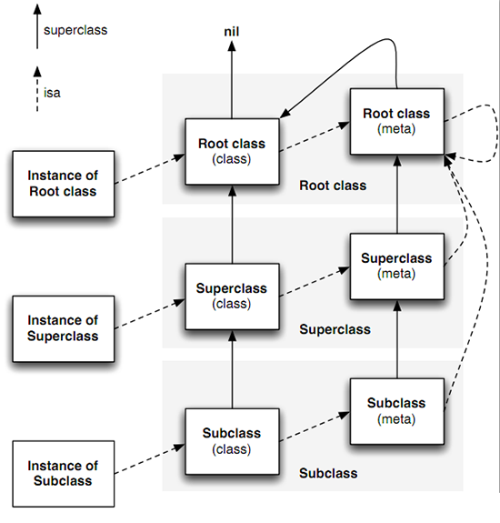
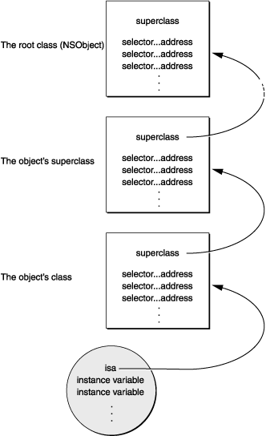
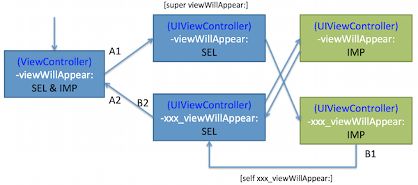

我们常常会听说 Objective-C 是一门动态语言，那么这个「动态」表现在哪呢？我想最主要的表现就是 Objective-C 把很多静态语言在编译和链接时做的事情放到了运行时去处理，它在运行时实现了对类、方法、成员变量、属性等信息的管理机制，这一套运行时机制为我们开发提供了极大的灵活性，比如：

- 在运行时创建或修改一个类。
- 在运行时修改成员变量、属性。
- 在运行时进行消息分发和方法绑定。

与之对应的实现就是 Objective-C 短小精悍的 Runtime。对于苹果维护的 Objective-C 的 Runtime 源码，你可以在这里看到： [Objective-C 源码](http://www.opensource.apple.com/source/objc4/)。

##运行时的类与对象

###相关函数
Objective-C 的 Runtime 为我们提供了很多运行时状态下跟类与对象相关的函数，比如：

- `const char *class_getName(Class cls)`，获取指定类的类名。
- `BOOL class_isMetaClass(Class cls)`，判断指定类是否是一个元类。
- `Class class_getSuperclass(Class cls)`，获取指定类的父类。
- `Class class_setSuperclass(Class cls, Class newSuper)`，设定指定类的父类。
- `int class_getVersion(Class cls)`，获取指定类的版本信息。
- `void class_setVersion(Class cls, int version)`，设定指定类的版本信息。
- `size_t class_getInstanceSize(Class cls)`，获取实例大小。
- `Ivar class_getInstanceVariable(Class cls, const char *name)`，获取指定名字的实例变量。
- `Ivar class_getClassVariable(Class cls, const char *name)`，获取指定名字的类变量。
- `Ivar *class_copyIvarList(Class cls, unsigned int *outCount)`，获取类的成员变量列表的拷贝。调用后需要自己 free()。
- `Method class_getInstanceMethod(Class cls, SEL name)`，获取指定名字的实例方法。
- `Method class_getClassMethod(Class cls, SEL name)`，获取指定名字的类方法。
- `IMP class_getMethodImplementation(Class cls, SEL name)`，获取指定名字的方法实现。
- `BOOL class_respondsToSelector(Class cls, SEL sel)`，类是否响应指定的方法。
- `Method *class_copyMethodList(Class cls, unsigned int *outCount)`，获取方法列表的拷贝。调用后需要自己 free()。
- `BOOL class_conformsToProtocol(Class cls, Protocol *protocol)`，类是否遵循指定的协议。
- `Protocol * __unsafe_unretained *class_copyProtocolList(Class cls, unsigned int *outCount)`，获取协议列表的拷贝。调用后需要自己 free()。
- `objc_property_t class_getProperty(Class cls, const char *name)`，获取指定名字的属性。
- `objc_property_t *class_copyPropertyList(Class cls, unsigned int *outCount)`，获取类的属性列表。调用后需要自己 free()。
- `BOOL class_addMethod(Class cls, SEL name, IMP imp, const char *types)`，为类添加方法。
- `IMP class_replaceMethod(Class cls, SEL name, IMP imp, const char *types)`，替代类的方法。
- `BOOL class_addIvar(Class cls, const char *name, size_t size, uint8_t alignment, const char *types)`，给指定的类添加成员变量。这个函数只能在 objc_allocateClassPair() 和 objc_registerClassPair() 之间调用，并且不能为一个已经存在的类添加成员变量。
- `BOOL class_addProtocol(Class cls, Protocol *protocol)`，为类添加协议。
- `BOOL class_addProperty(Class cls, const char *name, const objc_property_attribute_t *attributes, unsigned int attributeCount)`，为类添加属性。
- `void class_replaceProperty(Class cls, const char *name, const objc_property_attribute_t *attributes, unsigned int attributeCount)`，替代类的属性。
- `id class_createInstance(Class cls, size_t extraBytes)`，创建指定类的实例。
- `id objc_constructInstance(Class cls, void *bytes)`，在指定的位置创建类的实例。
- `void *objc_destructInstance(id obj)`，销毁实例。
- `Class objc_allocateClassPair(Class superclass, const char *name, size_t extraBytes)`，创建类和元类。
- `void objc_registerClassPair(Class cls)`，注册类到 Runtime。
- `void objc_disposeClassPair(Class cls)`，销毁类和对应的元类。

上面罗列的函数只是一部分，在使用这些函数时，有时候需要注意一些细节信息和使用规范，具体可以查阅 [Objective-C Runtime Reference][5]。

###类的数据结构
上面的函数非常丰富，我们可以看出这些函数为我们提供了在运行时改变一个类的结构、属性、方法、协议等信息的能力。那这些函数背后所操作的数据结构是什么样的呢？这个其实可以在 `objc/runtime.h` 的源码中查到：

	struct objc_class {
	    Class isa OBJC_ISA_AVAILABILITY;

	#if !__OBJC2__
	    Class super_class OBJC2_UNAVAILABLE; // 父类。
	    const char *name OBJC2_UNAVAILABLE; // 类名。
	    long version OBJC2_UNAVAILABLE; // 类的版本信息。
	    long info OBJC2_UNAVAILABLE; // 类信息，供运行时使用的一些位标识。
	    long instance_size OBJC2_UNAVAILABLE; // 类的实例变量大小。
	    struct objc_ivar_list *ivars OBJC2_UNAVAILABLE; // 类的成员变量列表。
	    struct objc_method_list **methodLists OBJC2_UNAVAILABLE; // 方法定义列表。
	    struct objc_cache *cache OBJC2_UNAVAILABLE; // 方法缓存。
	    struct objc_protocol_list *protocols OBJC2_UNAVAILABLE; // 协议列表。
	#endif

	} OBJC2_UNAVAILABLE;

这个结构其实就是类的基础数据结构，在 Objective-C 中`类`是由 `Class` 表示，而 Class 实际上是一个指向 `struct objc_class` 的指针。

	typedef struct objc_class *Class;

在这个类的数据结构中，有几个字段需要再解释一下：

- `isa`，在大多面向对象的语言中，都有**类**和**对象**的概念，其中，对象是类的实例，是通过类定义的结构生成出来的。而在 Objective-C 中，类本身也是一个对象，类作为对象时的 isa 指针指向的是元类(Meta Class)，这个我们后面再说。
- `super_class`，指向该类的父类，如果该类已经是根类（NSObject 或 NSProxy），则 super_class 为 NULL。
- `cache`，用于缓存最近使用的方法。一个对象可响应的方法列表中通常只有一部分是经常被调用的，cache 则是用来缓存最常调用的方法，从而避免每次方法调用时都去查找对象的整个方法列表。并且，在一些结构较为复杂的类关系中，一个对象的响应方法可能来自于它继承的类结构中，那么查找相应的响应方法时就会比较耗时，通过 cache 缓存也能降低查找时间。
- `version`，根据这个字段可以获得类的版本信息，在对象的序列化中可以通过类的版本信息来标识出不同版本的类定义中实例变量布局的改变。

###元类(Meta Class)

上面讲到一个类也是一个对象，那么它必然也是某一种类的实例，这种类就是：元类(Meta Class)。就如类是对应的实例的描述一样，元类则是类作为对象时的描述。元类的方法列表对应的则是类方法(Class Method)列表，这正是类作为一个对象时所需要的。当我们像 `[NSObject alloc]` 这样给一个类发送消息时，Runtime 就会去对应的元类查找其类方法列表，并匹配调用。

>Since a class is an object, it must be an instance of some other class: a metaclass. The metaclass is the description of the class object, just like the class is the description of ordinary instances. Class methods are described by the metaclass on behalf of the class object, just like instance methods are described by the class on behalf of the instance objects.

那在接着往下探究：元类又是谁的实例呢？它的 isa 又指向谁呢？答案如下图所示。

元类的 isa 都指向根元类(Root Meta Class)，也就是说元类都是根元类(Root Meta Class)的实例。而根元类(Root Meta Class)的 isa 则指向自己，这样就不会无休止的链下去了。

在图中还能看到类的继承关系以及对应的元类的继承关系，已经比较清晰了，不再详述。

###类的实例的数据结构

在 Objective-C 中类的实例的数据结构是定义在 `struct objc_object` 中(objc/objc.h)：

	// Represents an instance of a class.
	struct objc_object {
	    Class isa  OBJC_ISA_AVAILABILITY;
	};

可以看到，这个结构体只有一个字段，即指向该实例所属类的 isa 指针。这个跟上面讲的类的数据结构中的 isa 略有不同：类的 isa 指向对应的元类(Meta Class)，实例的 isa 则是指向对应的类(Class)，而这个 Class 里就如上所讲的包含了这个实例所属类的各种信息：父类、类名、方法列表等等。

在我们向一个类的实例发送消息时，Runtime 会根据实例对象的 isa 指针找到这个实例对象所属的类，接着再在这个类的方法列表和其父类的方法列表中查找与消息对应的 selector 指向的方法，然后执行它。

当创建某一个类的实例时，分配的内存中会包含一个 objc_object 数据结构，然后是类的实例变量的数据。

我们常见的 id 是一个 struct objc_object 类型的指针。id 类型的对象可以转换为任何一种类型的对象，它的作用有点类似 C 语言中的 void * 指针类型。

	// A pointer to an instance of a class.
	typedef struct objc_object *id;

###运行时操作类与对象的代码示例

####实例、类、父类、元类关系结构的示例代码

首先我创建了继承关系为 `SubClass -> SuperClass -> NSObject` 的几个类，下面就用 Runtime 提供的运行时方法来打印一下相关信息：

	#import <objc/runtime.h>
	#import "SuperClass.h"
	#import "SubClass.h"

	-(void)aboutClass {
	    
	    // Use "object_getClass()" to get "isa".
	    
	    SubClass *sub = [[SubClass alloc] init];
	    NSLog(@"%@, %@", object_getClass(sub), class_getSuperclass(object_getClass(sub))); // Print: SubClass, SuperClass
	    Class cls = objc_getMetaClass("SubClass");
	    if (class_isMetaClass(cls)) {
	        NSLog(@"YES, %@, %@, %@", cls, class_getSuperclass(cls), object_getClass(cls)); // Print: YES, SubClass, SuperClass, NSObject
	    }
	    else {
	        NSLog(@"NO");
	    }

	    
	    SuperClass *sup = [[SuperClass alloc] init];
	    NSLog(@"%@, %@", object_getClass(sup), class_getSuperclass(object_getClass(sup))); // Print: SuperClass, NSObject
	    cls = objc_getMetaClass("SuperClass");
	    if (class_isMetaClass(cls)) {
	        NSLog(@"YES, %@, %@, %@", cls, class_getSuperclass(cls), object_getClass(cls)); // Print: YES, SuperClass, NSObject, NSObject
	    }
	    else {
	        NSLog(@"NO");
	    }
	    
	    
	    cls = objc_getMetaClass("UIView");
	    if (class_isMetaClass(cls)) {
	        NSLog(@"YES, %@, %@, %@", cls, class_getSuperclass(cls), object_getClass(cls)); // Print: YES, UIView, UIResponder, NSObject
	    }
	    else {
	        NSLog(@"NO");
	    }

	    cls = objc_getMetaClass("NSObject");
	    if (class_isMetaClass(cls)) {
	        NSLog(@"YES, %@, %@, %@", cls, class_getSuperclass(cls), object_getClass(cls)); // Print: YES, NSObject, NSObject, NSObject
	    }
	    else {
	        NSLog(@"NO");
	    }

	}

打印信息如下：

	SubClass, SuperClass
	YES, SubClass, SuperClass, NSObject
	SuperClass, NSObject
	YES, SuperClass, NSObject, NSObject
	YES, UIView, UIResponder, NSObject
	YES, NSObject, NSObject, NSObject

这里需要注意的是: **`object_getClass()` 可以获得当前对象 `isa`**。这里以 SubClass 相关的打印信息为例，来解释一下：

	SubClass, SuperClass
	YES, SubClass, SuperClass, NSObject

首先我们通过 object_getClass() 获取实例 sub 所属的 Class(isa) 是 `SubClass`；通过 class_getSuperclass() 我们可以获取 SubClass 对应的父类是 `SuperClass`；通过 objc_getMetaClass() 指定类名，我们可以获取对应的元类，通过 class_isMetaClass() 我们可以判断一个 Class 是否为元类，这里确认后，打出 `YES`；接着，打印元类类名是 `SubClass`；打印元类的父类是 `SuperClass`；再通过 object_getClass() 获得元类的 isa，是 `NSObject`。

对于 SuperClass 和 UIView 的相关打印信息解释也同理。从这些的打印信息可以看出，与前文中给出的图中的关系结构是一致的。

####动态操作类与实例的示例代码

接着上面的代码，我们继续：

	int32_t testRuntimeMethodIMP(id self, SEL _cmd, NSDictionary *dic) {
	    NSLog(@"testRuntimeMethodIMP: %@", dic);
	    // Print:
	    // testRuntimeMethodIMP: {
	    //     a = "para_a";
	    //     b = "para_b";
	    // }
	    
	    return 99;
	}

	- (void)runtimeConstruct {
	    
	#pragma clang diagnostic push
	#pragma clang diagnostic ignored "-Wundeclared-selector"

		// 1: Create and register class, add method to class.
	    Class cls = objc_allocateClassPair(SuperClass.class, "RuntimeSubClass", 0);
	    // Method returns: "int32_t"; accepts: "id self", "SEL _cmd", "NSDictionary *dic". So use "i@:@" here.
	    class_addMethod(cls, @selector(testRuntimeMethod), (IMP) testRuntimeMethodIMP, "i@:@");
	    // You can only register a class once.
	    objc_registerClassPair(cls);
	    

	    // 2: Create instance of class, print some info about class and associated meta class.
	    id sub = [[cls alloc] init];
	    NSLog(@"%@, %@", object_getClass(sub), class_getSuperclass(object_getClass(sub))); // Print: RuntimeSubClass, SuperClass
	    Class metaCls = objc_getMetaClass("RuntimeSubClass");
	    if (class_isMetaClass(metaCls)) {
	        NSLog(@"YES, %@, %@, %@", metaCls, class_getSuperclass(metaCls), object_getClass(metaCls)); // Print: YES, RuntimeSubClass, SuperClass, NSObject
	    }
	    else {
	        NSLog(@"NO");
	    }
	    
	    
	    // 3: Methods of class.
	    unsigned int outCount = 0;
	    Method *methods = class_copyMethodList(cls, &outCount);
	    for (int32_t i = 0; i < outCount; i++) {
	        Method method = methods[i];
	        NSLog(@"%@, %s", NSStringFromSelector(method_getName(method)), method_getTypeEncoding(method));
	    }
	    // Print: testRuntimeMethod, i@:@
	    free(methods);
	    
	    
	    // 4: Call method.
	    int32_t result = (int) [sub performSelector:@selector(testRuntimeMethod) withObject:@{@"a":@"para_a", @"b":@"para_b"}];
	    NSLog(@"%d", result); // Print: 99
	    
	    
	    // 5: Destory instances and class.
	    // Destroy instances of cls class before destroy cls class.
	    sub = nil;
	    // Do not call this function if instances of the cls class or any subclass exist.
	    objc_disposeClassPair(cls);
	    
	#pragma clang diagnostic pop

	}

执行上面代码得到的打印信息如下：

	RuntimeSubClass, SuperClass
	YES, RuntimeSubClass, SuperClass, NSObject
	testRuntimeMethod, i@:@
	testRuntimeMethodIMP: {
    	a = "para_a";
    	b = "para_b";
	}
	99

在上面的代码中，我们在运行时动态创建了 SuperClass 的一个子类：RuntimeSubClass；接着为这个类添加了方法和实现；打印了 RuntimeSubClass 的类、父类、元类相关信息；遍历和打印了 RuntimeSubClass 的方法的相关信息；调用了 RuntimeSubClass 的方法；最后销毁了实例和类。

上面代码中，有几点在这里说明一下：

- 我们看到了几行 `#pragma clang diagnostic...` 代码，这是用于忽略编译器对于未声明的 @selector 的 warning。因为我们的代码中我们需要动态的为一个类创建方法，所以必然不会事先声明。
- `class_addMethod()` 函数的最后一个参数 types 是描述方法返回值和参数列表的字符串，我们的代码中的用到的 `i@:@` 四个字符分别对应着：返回值 int32_t、参数 id self、参数 SEL _cmd、参数 NSDictionary *dic。这个其实就是类型编码(Type Encoding)的概念。在 Objective-C 中，为了协助 Runtime 系统，编译器会将每个方法的返回值和参数列表编码为一个字符串，这个字符串会与方法对应的 selector 关联。更详细的知识可以查阅 [Type Encodings][6]。
- 使用 `objc_registerClassPair()` 函数需要注意，你不能注册已经注册过的类。
- 使用 `objc_disposeClassPair()` 函数需要注意，如果一个类的实例和子类还存在时，不要去销毁一个类。

关于更多 Runtime 函数的使用细节可以查阅 [Objective-C Runtime Reference][5]。

##运行时的成员变量与属性

###相关函数

Runtime 中与成员变量和属性相关的函数有很多，这里列出一些：

- `Ivar class_getClassVariable(Class cls, const char *name)`，返回指定类的指定名字的成员变量。
- `Ivar *class_copyIvarList(Class cls, unsigned int *outCount)`，返回指定类的成员变量列表。调用后需要自己 free()。
- `BOOL class_addIvar(Class cls, const char *name, size_t size, uint8_t alignment, const char *types)`，给指定的类添加成员变量。这个函数只能在 objc_allocateClassPair() 和 objc_registerClassPair() 之间调用，并且不能为一个已经存在的类添加成员变量。
- `id object_getIvar(id obj, Ivar ivar)`，获得对象的指定成员变量的值。速度比 object_getInstanceVariable() 快。
- `void object_setIvar(id obj, Ivar ivar, id value)`，设置对象指定成员变量的值。速度比 object_setInstanceVariable() 快。
- `Ivar object_getInstanceVariable(id obj, const char *name, void **outValue)`，获取指定名字的成员变量的值。
- `Ivar object_setInstanceVariable(id obj, const char *name, void *value)`，设置指定名字成员变量的值。
- `const char *ivar_getName(Ivar v)`，获取成员变量名。
- `const char *ivar_getTypeEncoding(Ivar v)`，获取成员变量的类型编码。
- `ptrdiff_t ivar_getOffset(Ivar v)`，获取成员变量的偏移量。
- `objc_property_t class_getProperty(Class cls, const char *name)`, 获取指定类指定名字的属性。
- `objc_property_t *class_copyPropertyList(Class cls, unsigned int *outCount)`, 获取指定类的属性列表。调用后需要自己 free()。
- `BOOL class_addProperty(Class cls, const char *name, const objc_property_attribute_t *attributes, unsigned int attributeCount)`， 给指定的类添加属性。
- `void class_replaceProperty(Class cls, const char *name, const objc_property_attribute_t *attributes, unsigned int attributeCount)`，替代指定类的属性。 
- `const char *property_getName(objc_property_t property)`，获取属性名。
- `const char *property_getAttributes(objc_property_t property)`，获取属性特性描述。
- `objc_property_attribute_t *property_copyAttributeList(objc_property_t property, unsigned int *outCount)`，获取属性特性列表。调用后需要自己 free()。
- `char *property_copyAttributeValue(objc_property_t property, const char *attributeName)`，获取属性特性值。调用后需要自己 free()。

###成员变量(Ivar)的数据结构

在 Objective-C 中成员变量即 `Ivar` 类型，是指向 `struct objc_ivar` 结构体的指针。可以在 objc/runtime.h 中查到：

	typedef struct objc_ivar *Ivar;

而 struct objc_ivar 结构体的数据结构如下：

	struct objc_ivar {
	    char *ivar_name OBJC2_UNAVAILABLE; // 变量名。
	    char *ivar_type OBJC2_UNAVAILABLE; // 变量类型。
	    int ivar_offset OBJC2_UNAVAILABLE; // 基地址偏移量，在对成员变量寻址时使用。
	#ifdef __LP64__
	    int space OBJC2_UNAVAILABLE;
	#endif
	} 

###属性的数据结构

属性(Property)的数据结构：

	typedef struct objc_property *objc_property_t;

属性特性(Attribute)的数据结构：

	/// Defines a property attribute
	typedef struct {
	    const char *name; /**< The name of the attribute */
	    const char *value; /**< The value of the attribute (usually empty) */
	} objc_property_attribute_t;

###属性和成员变量的联系

本质上一个属性背后必然对应着一个成员变量，但是属性又不仅仅只是一个成员变量，属性还会根据自己对应的属性特性的定义来对这个成员变量进行一系列的封装：提供 Getter/Setter 方法、内存管理策略、线程安全机制等等。

###运行时操作成员变量和属性的代码示例

接着放示例代码：

	NSString * runtimePropertyGetterIMP(id self, SEL _cmd) {
	    Ivar ivar = class_getInstanceVariable([self class], "_runtimeProperty");
	    
	    return object_getIvar(self, ivar);
	}

	void runtimePropertySetterIMP(id self, SEL _cmd, NSString *s) {
	    Ivar ivar = class_getInstanceVariable([self class], "_runtimeProperty");
	    NSString *old = (NSString *) object_getIvar(self, ivar);
	    if (![old isEqualToString:s]) {
	        object_setIvar(self, ivar, s);
	    }
	}

	- (void)aboutIvarAndProperty {
	#pragma clang diagnostic push
	#pragma clang diagnostic ignored "-Wundeclared-selector"

	    // 1: Add property and getter/setter.
	    Class cls = objc_allocateClassPair(SuperClass.class, "RuntimePropertySubClass", 0);
	    
	    BOOL b = class_addIvar(cls, "_runtimeProperty", sizeof(cls), log2(sizeof(cls)), @encode(NSString));
	    NSLog(@"%@", b ? @"YES" : @"NO"); // Print: YES
	    
	    objc_property_attribute_t type = {"T", "@\"NSString\""};
	    objc_property_attribute_t ownership = {"C", ""}; // C = copy
	    objc_property_attribute_t isAtomic = {"N", ""}; // N = nonatomic
	    objc_property_attribute_t backingivar  = {"V", "_runtimeProperty"};
	    objc_property_attribute_t attrs[] = {type, ownership, isAtomic, backingivar};
	    class_addProperty(cls, "runtimeProperty", attrs, 4);
	    class_addMethod(cls, @selector(runtimeProperty), (IMP) runtimePropertyGetterIMP, "@@:");
	    class_addMethod(cls, @selector(setRuntimeProperty), (IMP) runtimePropertySetterIMP, "v@:@");
	    
	    // You can only register a class once.
	    objc_registerClassPair(cls);

	    
	    // 2: Print all properties.
	    unsigned int outCount = 0;
	    objc_property_t *properties = class_copyPropertyList(cls, &outCount);
	    for (int32_t i = 0; i < outCount; i++) {
	        objc_property_t property = properties[i];
	        NSLog(@"%s, %s\n", property_getName(property), property_getAttributes(property));
	    }
	    // Print:
	    // runtimeProperty, T@"NSString",C,N,V_runtimeProperty
	    free(properties);
	    
	    
	    // 3: Print all ivars.
	    Ivar *ivars = class_copyIvarList(cls, &outCount);
	    for (int32_t i = 0; i < outCount; i++) {
	        Ivar ivar = ivars[i];
	        NSLog(@"%s, %s\n", ivar_getName(ivar), ivar_getTypeEncoding(ivar));
	    }
	    // Print:
	    // _runtimeProperty, {NSString=#}
	    free(ivars);
	    
	    
	    // 4: Use runtime property.
	    id sub = [[cls alloc] init];
	    [sub performSelector:@selector(setRuntimeProperty) withObject:@"It-is-a-runtime-property."];
	    NSString *s = [sub performSelector:@selector(runtimeProperty)]; //[sub valueForKey:@"runtimeProperty"];
	    NSLog(@"%@", s); // Print: It-is-a-runtime-property.
	    
	    
	    // 5: Clear.
	    // Destroy instances of cls class before destroy cls class.
	    sub = nil;
	    // Do not call this function if instances of the cls class or any subclass exist.
	    objc_disposeClassPair(cls);

	#pragma clang diagnostic pop
	}

上面代码的打印信息如下：

	YES
	runtimeProperty, T@"NSString",C,N,V_runtimeProperty
	_runtimeProperty, {NSString=#}
	It-is-a-runtime-property.

上面的代码中，我们在运行时动态创建了 SuperClass 的一个子类 `RuntimePropertySubClass`；然后为它动态添加了 Ivar：`_runtimeProperty`、对应的 Property：`runtimeProperty`、对应的 Getter/Setter：`runtimeProperty` `setRuntimeProperty`；接着我们遍历和打印了 RuntimePropertySubClass 的 Ivar 列表和 Property 列表；然后创建了 RuntimePropertySubClass 的一个实例 `sub`，并使用了 Property；最后我们清理了 sub 和 RuntimePropertySubClass。

这里有几点需要注意的：

- 我们不能用 class_addIvar() 函数为一个已经存在的类添加 Ivar。并且 class_addIvar() 只能在 objc_allocateClassPair() 和 objc_registerClassPair() 之间调用。
- 添加属性特性时的各种类型字符可以参考：[Property Type String][8]。
- 添加一个属性及对应的成员变量后，我们还能通过 `[obj valueForKey:@"propertyName"];` 获得属性值。

##运行时的消息分发

###相关函数

- `id objc_msgSend(id self, SEL op, ...)`，消息分发。(objc/message.h)
- `id method_invoke(id receiver, Method m, ...);`，调用指定方法的实现。
- `void method_invoke_stret(id receiver, Method m, ...);`，调用返回一个数据结构的方法的实现。
- `SEL method_getName(Method m);`，获取方法名。
- `IMP method_getImplementation(Method m);`，返回方法的实现。
- `const char * method_getTypeEncoding(Method m);`，获取描述方法参数和返回值类型的字符串。
- `char * method_copyReturnType(Method m);`，获取方法的返回值类型的字符串。
- `char * method_copyArgumentType(Method m, unsigned int index);`，获取方法的指定位置参数的类型字符串。
- `void method_getReturnType(Method m, char *dst, size_t dst_len);`，通过引用返回方法的返回值类型字符串。
- `unsigned int method_getNumberOfArguments(Method m);`，返回方法的参数的个数。
- `void method_getArgumentType(Method m, unsigned int index, char *dst, size_t dst_len);`，通过引用返回方法指定位置参数的类型字符串。
- `struct objc_method_description * method_getDescription(Method m);`，返回指定方法的方法描述结构体。
- `IMP method_setImplementation(Method m, IMP imp);`，设置方法的实现。注意该函数返回值是方法之前的实现。
- `void method_exchangeImplementations(Method m1, Method m2);`，交换两个方法的实现。
- `const char * sel_getName(SEL sel);`，返回给定选择器指定的方法的名称。
- `SEL sel_registerName(const char *str);`，在Objective-C Runtime系统中注册一个方法，将方法名映射到一个选择器，并返回这个选择器。
- `SEL sel_getUid(const char *str);`，在Objective-C Runtime系统中注册一个方法。
- `BOOL sel_isEqual(SEL lhs, SEL rhs);`，比较两个选择器。

###消息机制相关的数据结构

####选择器
选择器在 Objective-C 中即 SEL 类型。它的定义如下(objc/objc.h)：

	typedef struct objc_selector *SEL;

表示一个方法 selector 的指针。selector 用于表示运行时方法的名字，Objective-C 在编译时会根据每个方法的名字为方法生成一个唯一的整型标识来替代方法名，这个整型标识就是 SEL。比如：

	SEL sel = @selector(alloc);
    NSLog(@"%p", sel); // Print: 0x10338b545

只要方法名相同，即使方法是否在不同的类中，它生成的 SEL 也是一样的。所以，SEL 没干啥，它就是唯一标识一个方法名而已。

这样看来，在一个类中是不能存在两个同名的方法的，即使参数类型不同也不行。比如下面的两个方法放在同一个类中是无法编译通过的：

	- (void)test:(int)i;
	- (int)test:(double)d;

这个很好理解：一个类的实例去调用方法时会通过方法的 SEL 去映射，如果存在相同的 SEL，那就不知道调用谁了。

当然，不同的类是可以有相同的 SEL 的，即使这些类之间是继承关系也没问题。这是因为不同的类，他们调用方法时的对象实例是不一样的，那么对应的方法列表和 SEL 就是不一样的，不会有冲突。就算存在继承关系，也是先找子类的方法列表，没有时再找父类的方法列表，也不会有问题。

在一个工程中，所有的 SEL 会组成一个 Set 集合，这就意味着不会有重复的 SEL，这个也是可以理解的，首先这样可以去掉重复的 SEL（不同类的同名方法生成的相同 SEL），从而降低集合大小、提高查找性能；其次，调用时根据对象去查找对应的方法列表，也不会有问题。

所以综上所述，SEL 确实没干啥，它就是唯一标识一个方法名而已。

在编译时，我们通过 @selector 来获取指定方法名的 SEL：

	SEL aSelector = @selector(methodName);

在运行时，我们通过 NSSelectorFromString() 来获得指定方法名的 SEL：

	SEL aSelector = NSSelectorFromString(@"methodName");

####函数指针

函数指针在 Objective-C 中即 IMP 类型。它的定义如下(objc/objc.h)：

	typedef id (*IMP)(id, SEL, ...); 

IMP 其实就是 `implementation` 的缩写，表示方法实现的代码块地址，可以像 C 函数一样直接调用。通常情况下，我们都是通过 `[object method:parameter]` 或 `objc_msgSend()` 的方式调用方法或函数，然后 Runtime 去寻找消息匹配的 IMP 来调用，但有时候我们也可以直接获取 IMP 来调用。通过 IMP，我们可以跳过 Rumtime 的消息分发流程，直接执行 IMP 指向的代码块，这样会比直接向对象发送消息高效一些。这就是 IMP Caching 技术。

####方法
方法在 Objective-C 中即 Method 类型。它的定义如下(objc/runtime.h)：

	typedef struct objc_method *Method;

	struct objc_method {
	    SEL method_name OBJC2_UNAVAILABLE;
	    char *method_types OBJC2_UNAVAILABLE;
	    IMP method_imp OBJC2_UNAVAILABLE;
	} OBJC2_UNAVAILABLE;

我们可以看到 Method 是 `struct objc_method` 指针类型。struct objc_method 结构中包含了一个 SEL 和一个 IMP，实际上是做了一个 SEL 到 IMP 的映射，有了 SEL 我们就可以找到对应的 IMP 来调用对应的代码。

此外，还有一个方法描述的数据结构如下：

	struct objc_method_description {
		SEL name; /**< The name of the method */
		char *types; /**< The types of the method arguments */
	};

这里的描述了方法的 SEL 以及参数类型。

###消息分发机制说明

Objective-C 中的消息是直到运行时才绑定到具体的方法实现上。基本上代码中形如 `[receiver message]` 的消息表达式在编译阶段只是确定了要向 receiver 发送 message 这样一件事，这里的 message 是一个方法名 selector 以及相关的参数。这个消息会被编译器转化为对 `objc_msgSend()` 函数或相近函数的调用，在这个过程中，objc_msgSend() 函数会获取 receiver、selector 以及 message 中的参数作为自己的参数，调用形式如下：

	objc_msgSend(receiver, selector, arg1, arg2, ...)

这个消息分发函数会在运行时完成动态绑定相关的事情，大体步骤如下：

- 首先找到 selector 对应的确切的实现例程。由于同一个方法名可能会因为所在的类不同而实现不同，所以它对应的确切的实现要依赖于类和接受者 receiver。
- 调用对应的实现例程，传入 receiver 对象以及相关参数。
- 最后，将实现例程的返回值作为自己的返回值传递出去。

消息分发的奥义隐藏在编译器为每个类和对象构造的数据结构中，这个在我们前面的章节中以及介绍过了（struct objc_object 和 struct objc_class）。其中最关键的两个字段：

- 指向父类的指针(isa)。
- 类的分发表(methodLists)。

消息分发的流程如图所示：

当消息发送给一个对象时，objc_msgSend 通过对象的 isa 指针获取到类的结构体，然后在方法分发表里面查找方法的 selector。如果没有找到 selector，则通过 objc_msgSend 结构体中的指向父类的指针找到其父类，并在父类的分发表里面查找方法的 selector。依此，会一直沿着类的继承体系到达 NSObject 类。一旦定位到 selector，函数会就获取到了实现的入口点，并传入相应的参数来执行方法的具体实现。如果最后没有定位到 selector，则会走消息转发流程。

此外，为了加速消息的处理，运行时系统会缓存使用过的 selector 及对应的方法的地址。这点在前面已经讨论过，不再重复。

###运行时消息分发的代码示例

####Method Swizzling

在前文中讲 Method 的数据结构时我们说到过，方法的数据结构中包含了 SEL 和 IMP。selector 相当于一个方法的 id；IMP 是方法的实现。这样分开的一个便利之处是 selector 和 IMP 之间的对应关系可以被改变。比如一个 IMP 可以有多个 selectors 指向它。而本节所讲的 Method Swizzling 的概念则是交换两个方法的实现，从而「狸猫换太子」。

UIViewController+Runtime.m

	#import "UIViewController+Runtime.h"
	#import <objc/runtime.h>

	@implementation UIViewController (Runtime)

	+ (void)load {
	    static dispatch_once_t onceToken;
	    dispatch_once(&onceToken, ^{
	        Class aClass = [self class];
	        
	        SEL originalSelector = @selector(viewWillAppear:);
	        SEL swizzledSelector = @selector(xxx_viewWillAppear:);
	        
	        Method originalMethod = class_getInstanceMethod(aClass, originalSelector);
	        Method swizzledMethod = class_getInstanceMethod(aClass, swizzledSelector);
	        
	        // When swizzling a class method, use the following:
	        // Class aClass = object_getClass((id)self);
	        // ...
	        // Method originalMethod = class_getClassMethod(aClass, originalSelector);
	        // Method swizzledMethod = class_getClassMethod(aClass, swizzledSelector);
	        
	        BOOL didAddMethod = class_addMethod(aClass, originalSelector, method_getImplementation(swizzledMethod), method_getTypeEncoding(swizzledMethod));
	        
	        if (didAddMethod) {
	            class_replaceMethod(aClass, swizzledSelector, method_getImplementation(originalMethod), method_getTypeEncoding(originalMethod));
	        } else {
	            method_exchangeImplementations(originalMethod, swizzledMethod);
	        }
	    });
	}

	#pragma mark - Method Swizzling
	- (void)xxx_viewWillAppear:(BOOL)animated {
	    NSLog(@"B1: %@", self); // Print: B1: <ViewController: 0x7fd06422b6a0>
	    [self xxx_viewWillAppear:animated]; 
	    NSLog(@"B2: %@", self); // Print: B2: <ViewController: 0x7fd06422b6a0>
	}

	@end

ViewController.m

	@implementation ViewController

	#import "UIViewController+Runtime.h"

	- (void)viewWillAppear:(BOOL)animated {
	    NSLog(@"A1: %@", self); // Print: A1: <ViewController: 0x7fd06422b6a0>
	    [super viewWillAppear:animated];
	    NSLog(@"A2: %@", self); // Print: A2: <ViewController: 0x7fd06422b6a0>
	}

	@end

在加载展示 ViewController 后，打印出的信息如下：

	A1: <ViewController: 0x7fd06422b6a0>
	B1: <ViewController: 0x7fd06422b6a0>
	B2: <ViewController: 0x7fd06422b6a0>
	A2: <ViewController: 0x7fd06422b6a0>

上面的代码有几点需要说明的：

- 一般来说，Method Swizzling 应该在一个类的 `+load` 方法实现。`+load` 在一个类最开始被引用加载时就会调用。
- 使用 GCD 的 `dispatch_once` 来保证只调用一次，并且确保线程安全。
- 上面的代码体现了两个「分离」：
	- 方法 SEL 和 IMP 的分离。方法的 SEL 和 IMP 可以绑定，也可以拆开重绑。这是 Method Swizzling 的基础。
	- 对象和类的方法列表的分离。对象和类的方法列表的也是在运行时根据类的结构进行动态绑定。
- Method Swizzling 交换的是 UIViewController 类的 `-viewWillAppear:` 和 `-xxx_viewWillAppear:` 的实现，对其子类并无影响。在代码执行的过程中，对象始终是 ViewController 的一个实例，只不过有时候它去调用了父类 UIViewController 的方法(`[super viewWillAppear:animated];`)。代码的执行顺序如图所示：

####消息转发

当一个对象能接收一个消息时，就会走正常的方法调用流程。但如果一个对象无法接收指定消息时，又会发生什么事呢？默认情况下，如果是以 `[receiver message]` 的方式调用方法，如果 receiver 无法响应 message 消息时，编译器会报错。但如果是以 `performSelector…` 的形式来调用，则需要等到运行时才能确定 receiver 是否能接收 message 消息。如果不能，则程序崩溃。

通常，当我们不能确定一个对象是否能接收某个消息时，会先调用 `respondsToSelector:` 来判断一下：

	if ([self respondsToSelector:@selector(method)]) {
	    [self performSelector:@selector(method)];
	}

这里，我们想讨论一下当一个对象无法接收某一消息时的情况。一般这个时候，就会启动所谓`消息转发(message forwarding)`机制，通过这一机制，我们可以告诉对象如何处理未知的消息。默认情况下，对象接收到未知的消息，会导致程序崩溃：

	-[ViewController method]: unrecognized selector sent to instance 0x7fa09b784f40
	Terminating app due to uncaught exception 'NSInvalidArgumentException', reason: '-[ViewController method]: unrecognized selector sent to instance 0x7fa09b784f40'

这段异常信息实际上是由 NSObject 的 `doesNotRecognizeSelector` 方法抛出的。不过，我们可以采取一些措施，让我们的程序执行特定的逻辑，而避免程序的崩溃。

消息转发机制基本上分为三个步骤：

- 第一步：动态方法解析。
- 第二步：备用接收者。
- 第三步：完整转发。

#####第一步：动态方法解析

对象在接收到未知的消息时，首先会调用所属类的类方法 `+resolveInstanceMethod:` 或者 `+resolveClassMethod:`，前者处理实例方法调用，后者处理类方法调用。我们可以它们里面用 `class_addMethod()` 加入异常处理的方法，不过前提是我们以及实现了处理方法。示例代码如下：

	#import <objc/runtime.h>

	- (void)viewDidLoad {
	    [super viewDidLoad];

	    [self performSelector:@selector(unknownMethod)];
	}

	void dealWithExceptionForUnknownMethod(id self, SEL _cmd) {
	    NSLog(@"%@, %p", self, _cmd); // Print: <ViewController: 0x7ff96be33e60>, 0x1078259fc
	}

	+ (BOOL)resolveInstanceMethod:(SEL)sel {
	    NSString *selectorString = NSStringFromSelector(sel);
	    if ([selectorString isEqualToString:@"unknownMethod"]) {
	        class_addMethod(self.class, @selector(unknownMethod), (IMP) dealWithExceptionForUnknownMethod, "v@:");
	    }

	    return [super resolveInstanceMethod:sel];
	}

代码打印：
	
	<ViewController: 0x7ff96be33e60>, 0x1078259fc

可以发现对 `unknownMethod` 方法的调用被截获了并在 `dealWithExceptionForUnknownMethod` 函数中进行了处理，程序没有再崩溃。

`@dynamic` 属性就可以用这种方案来实现。

#####第二步：备用接收者

如果在第一步还是无法处理消息，则 Runtime 会继续调以下方法：

	- (id)forwardingTargetForSelector:(SEL)aSelector

如果一个对象实现了这个方法，并返回一个非 nil 的结果，则这个对象会作为消息的新接收者，且消息会被分发到这个对象。当然这个对象不能是 self 自身，否则就会出现无限循环。当然，如果我们没有指定相应的对象来处理 aSelector，则应该调用父类的实现来返回结果。示例代码如下：

RuntimeMethodHelper.h

	#import <Foundation/Foundation.h>

	@interface RuntimeMethodHelper : NSObject
	- (void)unknownMethod2;
	@end

RuntimeMethodHelper.m

	#import "RuntimeMethodHelper.h"

	@implementation RuntimeMethodHelper
	- (void)unknownMethod2 {
	    NSLog(@"%@, %p", self, _cmd); // Print: <RuntimeMethodHelper: 0x7fb61042f410>, 0x10170d99a
	}
	@end

ViewController.m

	#import <objc/runtime.h>

	- (void)viewDidLoad {
	    [super viewDidLoad];

	    [self performSelector:@selector(unknownMethod)];
	    [self performSelector:@selector(unknownMethod2)];
	}

	// Deal with unknownMethod.
	void dealWithExceptionForUnknownMethod(id self, SEL _cmd) {
	    NSLog(@"%@, %p", self, _cmd); // Print: <ViewController: 0x7ff96be33e60>, 0x1078259fc
	}

	+ (BOOL)resolveInstanceMethod:(SEL)sel {
	    NSString *selectorString = NSStringFromSelector(sel);
	    if ([selectorString isEqualToString:@"unknownMethod"]) {
	        class_addMethod(self.class, @selector(unknownMethod), (IMP) dealWithExceptionForUnknownMethod, "v@:");
	    }

	    return [super resolveInstanceMethod:sel];
	}

	// Deal with unknownMethod2.
	- (id)forwardingTargetForSelector:(SEL)aSelector {
	    NSString *selectorString = NSStringFromSelector(aSelector);
	    if ([selectorString isEqualToString:@"unknownMethod2"]) {
	        return [[RuntimeMethodHelper alloc] init];
	    }

	    return [super forwardingTargetForSelector:aSelector];
	}

代码打印信息：

	<ViewController: 0x7fca10d268f0>, 0x109c1f98c
	<RuntimeMethodHelper: 0x7fca11837d90>, 0x109c1f99a

可以看到，对于 `unknownMethod` 方法已经在`第一步：动态方法解析`中被 `+resolveInstanceMethod` 处理，而 `unknownMethod2` 则放到了`第二步：备用接收者`才被处理。

这一步适用于当我们只想将消息转发到另一个能处理该消息的对象上的情况，它无法进一步对消息进行处理，比如：操作消息的参数和返回值。

#####第三步：完整转发

如果`第二步：备用接收者`还是未能处理好消息，那么接下来只有启用完整的消息转发机制了，这时候会调用以下方法：

	- (void)forwardInvocation:(NSInvocation *)anInvocation

运行时系统会在这一步给消息接收者最后一次机会将消息转发给其它对象。对象会创建一个表示消息的 NSInvocation 对象，把与尚未处理的消息有关的全部细节都封装在 anInvocation 中，包括：selector、目标(target)和参数。我们可以在 `-forwardInvocation:` 方法中选择将消息转发给其它对象。

当你实现了 `-forwardInvocation:` 方法，你有两个任务需要完成：

- 定位可以响应封装在 anInvocation 中的消息的对象。这个对象不需要能处理所有未知消息。
- 使用 anInvocation 作为参数，将消息发送到选中的对象。anInvocation 将会保留调用结果，运行时系统会提取这一结果并将其发送到消息的原始发送者。

不过，在这个方法中我们可以实现一些更复杂的功能，我们可以对消息的内容进行修改，比如追回一个参数等，然后再去触发消息。另外，若发现某个消息不应由本类处理，则应调用父类的同名方法，以便继承体系中的每个类都有机会处理此调用请求。

另外还有一个重要的问题是我们必须重写下面方法：

	- (NSMethodSignature *)methodSignatureForSelector:(SEL)aSelector

消息转发机制使用从这个方法中获取的信息来创建 NSInvocation 对象。因此我们必须重写这个方法，为给定的 selector 提供一个合适的方法签名。

代码示例如下：

RuntimeMethodHelper.h

	#import <Foundation/Foundation.h>

	@interface RuntimeMethodHelper : NSObject
	- (void)unknownMethod2;
	- (void)unknownMethod3;
	@end

RuntimeMethodHelper.m

	#import "RuntimeMethodHelper.h"

	@implementation RuntimeMethodHelper
	- (void)unknownMethod2 {
	    NSLog(@"%@, %p", self, _cmd); // Print: <RuntimeMethodHelper: 0x7f814c8130b0>, 0x102d7991a
	}
	- (void)unknownMethod3 {
	    NSLog(@"%@, %p", self, _cmd); // Print: <RuntimeMethodHelper: 0x7f814b498ee0>, 0x102d79929
	}
	@end

ViewController.m

	- (void)viewDidLoad {
	    [super viewDidLoad];
	    
	    [self performSelector:@selector(unknownMethod)];
	    [self performSelector:@selector(unknownMethod2)];	    
	    [self performSelector:@selector(unknownMethod3)];
	}

	// Deal with unknownMethod.
	void dealWithExceptionForUnknownMethod(id self, SEL _cmd) {
	    NSLog(@"%@, %p", self, _cmd); // Print: <ViewController: 0x7f814b529190>, 0x102d7990c
	}

	+ (BOOL)resolveInstanceMethod:(SEL)sel {

	    NSString *selectorString = NSStringFromSelector(sel);
	    if ([selectorString isEqualToString:@"unknownMethod"]) {
	        class_addMethod(self.class, @selector(unknownMethod), (IMP) dealWithExceptionForUnknownMethod, "v@:");
	    }

	    return [super resolveInstanceMethod:sel];
	}

	// Deal with unknownMethod2.
	- (id)forwardingTargetForSelector:(SEL)aSelector {
	    NSString *selectorString = NSStringFromSelector(aSelector);
	    if ([selectorString isEqualToString:@"unknownMethod2"]) {
	        return [[RuntimeMethodHelper alloc] init];
	    }

	    return [super forwardingTargetForSelector:aSelector];
	}

	// Deal with unknownMethod3.
	- (NSMethodSignature *)methodSignatureForSelector:(SEL)aSelector {
	    
	    NSMethodSignature *signature = [super methodSignatureForSelector:aSelector];
	    if (!signature) {
	        if ([RuntimeMethodHelper instancesRespondToSelector:aSelector]) {
	            signature = [RuntimeMethodHelper instanceMethodSignatureForSelector:aSelector];
	        }
	    }
	    
	    return signature;
	}

	- (void)forwardInvocation:(NSInvocation *)anInvocation {
	    if ([RuntimeMethodHelper instancesRespondToSelector:anInvocation.selector]) {
	        [anInvocation invokeWithTarget:[[RuntimeMethodHelper alloc] init]];
	    }
	}

代码打印信息：

	<ViewController: 0x7f814b529190>, 0x102d7990c
	<RuntimeMethodHelper: 0x7f814c8130b0>, 0x102d7991a
	<RuntimeMethodHelper: 0x7f814b498ee0>, 0x102d79929

NSObject 的 `-forwardInvocation:` 方法实现只是简单调用了 `-doesNotRecognizeSelector:` 方法，它不会转发任何消息。这样，如果不在以上所述的三个步骤中处理未知消息，到了 NSObject 那则会引发一个异常。

从某种意义上来讲，`-forwardInvocation:` 就像一个未知消息的分发中心，将这些未知的消息转发给其它对象。或者也可以像一个运输站一样将所有未知消息都发送给同一个接收对象。这取决于具体的实现。

####消息转发与多重继承

回过头来看上面第二步和第三步，通过 `-forwardingTargetForSelector:` 和 `-forwardInvocation:` 这两个方法我们可以允许一个对象与其它对象建立关系，以处理某些未知消息，而表面上看仍然是该对象在处理消息。通过这种关系，我们可以模拟 `多重继承` 的某些特性，让对象可以继承其它对象的特性来处理一些事情。不过，这两者间有一个重要的区别：多重继承将不同的功能集成到一个对象中，它会让对象变得过大，涉及的东西过多；而消息转发将功能分解到独立的小的对象中，并通过某种方式将这些对象连接起来，并做相应的消息转发。

不过消息转发虽然类似于继承，但 NSObject 的一些方法还是能区分两者。如 `respondsToSelector:` 和 `isKindOfClass:` 只能用于继承体系，而不能用于转发链。便如果我们想让这种消息转发看起来像是继承，则可以重写这些方法，如以下代码所示：

	- (BOOL)respondsToSelector:(SEL)aSelector {

	    if ([super respondsToSelector:aSelector]) {
	    	return YES;
		}
	    else {
	        /* Here, test whether the aSelector message can     *
	         * be forwarded to another object and whether that  *
	         * object can respond to it. Return YES if it can.  */
	    }

	    return NO;  
	}

##参考

- [Objective-C Runtime Reference][5]
- [Classes and Metaclasses][3]
- [Objective-C Runtime 运行时][4]

[SamirChen]: http://www.samirchen.com "SamirChen"
[1]: {{ page.url }} ({{ page.title }})
[2]: http://www.samirchen.com/objective-c-runtime/
[3]: http://www.sealiesoftware.com/blog/archive/2009/04/14/objc_explain_Classes_and_metaclasses.html
[4]: http://southpeak.github.io/blog/2014/10/25/objective-c-runtime-yun-xing-shi-zhi-lei-yu-dui-xiang/
[5]: https://developer.apple.com/library/mac/documentation/Cocoa/Reference/ObjCRuntimeRef/index.html
[6]: https://developer.apple.com/library/mac/documentation/Cocoa/Conceptual/ObjCRuntimeGuide/Articles/ocrtTypeEncodings.html
[7]: https://developer.apple.com/library/ios/documentation/Cocoa/Conceptual/ObjCRuntimeGuide/Introduction/Introduction.html
[8]: https://developer.apple.com/library/ios/documentation/Cocoa/Conceptual/ObjCRuntimeGuide/Articles/ocrtPropertyIntrospection.html#//apple_ref/doc/uid/TP40008048-CH101-SW6
