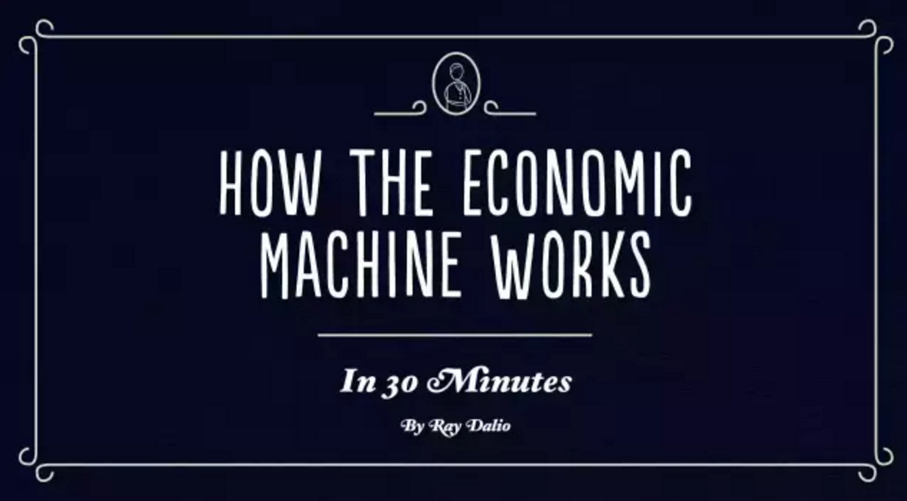
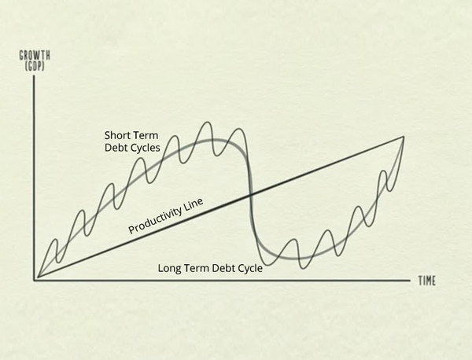

## 视频

中文版：[http://v.qq.com/page/z/2/f/z01685nf12f.html](http://v.qq.com/page/z/2/f/z01685nf12f.html)

<embed src="http://static.video.qq.com/TPout.swf?vid=z01685nf12f&auto=0" allowFullScreen="true" quality="high" width="480" height="400" align="middle" allowScriptAccess="always" type="application/x-shockwave-flash" />

英文版：[http://v.qq.com/boke/page/t/0/4/t0123ryxmc4.html](http://v.qq.com/boke/page/t/0/4/t0123ryxmc4.html)

<embed src="http://static.video.qq.com/TPout.swf?vid=t0123ryxmc4&auto=0" allowFullScreen="true" quality="high" width="480" height="400" align="middle" allowScriptAccess="always" type="application/x-shockwave-flash" />

## 笔记

### 经济活动的动力

视频所讲内容主要围绕着推动经济活动的主要三股动力而来，它们就是：

- 生产率的提高。
- 短期债务周期。
- 长期债务周期。

这三股动力组合在一起即构成了作者所提出的一种经济模型。大致样子如图：

### 交易

在经济活动中，`交易` 是一个基本概念。交易，即买方提供货币和信用来交换卖方的商品、服务和金融资产。交易是经济机器的最基本零件，由人的天性所驱动，所有的经济周期和动力都是交易造成的。

- 概念：买方、卖方、货币、信用、商品\服务\金融资产。
- 买方的货币 + 信用 = 支出总额。（信用在使用时和货币一样）
- 支出是经济的驱动力。
- 支出总额 / 产销总量 = 价格。
- 市场，一个市场由买卖同一商品的所有买方和卖方组成。比如：小麦市场、汽车市场等。经济，则是由全部市场内的交易构成，是无数交易的总和。
- 个人、企业、银行、政府都在以上述方式进行交易（用货币和信用交换商品、服务和金融资产）。
- 政府是最大的买方和卖方：
	- 中央政府：收税和花钱。
	- 中央银行：控制着经济中的货币和信贷数量。手段：利率、发行货币等。

### 信贷

信贷，是经济中最重要的组成部分，是经济中最大且最变幻莫测的部分。

- 贷款人、借款人。与在市场中交易的买方、卖方一样。
- 贷款人：用钱赚钱，利息；借款人：提前消费。
- 借贷 = 本金 + 利息。利率高时，借贷会减少；利率低时，借贷会增多。央行可以通过调整利率来控制信贷。
- 信贷行为即会产生债务。债务是贷款人的资产，是借款人的负债。将来借款人偿还了贷款和利息，则信贷产生的债务消失，交易完成。
- 借款人获得信贷，则会增加支出，一个人的支出是另一个人的收入，支出是经济的驱动力。
- 信贷触发了一系列机械的、可以预料的、将在未来发生的事件。
- 信贷不同于货币交易的地方在于：在交易中使用货币则交易立即完成；使用信用则是创造了一笔资产和一笔负债，只有将来清还了，交易才完成。
- 现实中大量所谓的钱实际上是信贷。美国国内的信贷总额大约为 50 万亿美元，货币只有大约 3 万亿美元。
- 没有信贷的经济运行中增加支出的唯一方式就是提高生产率增加生产。有信贷的经济运行可以通过借贷增加支出，使得收入的增长速度在短期内超过生产率，但在长期内不会如此。
- 不良信贷：借款无益于提高借款人的收入；良性信贷：借款有利于提高借款人收入。
- 信用 = 偿还能力(收入) + 抵押物。
- 收入增加，则借贷增加，从而增加借款人的支出。一个人的支出是另一个人的收入，他人收入增加，导致借贷进一步增加，并不断循环。这一自我驱动的模式导致经济增长。也是因为这样产生了经济周期。

### 周期

- 生产率在长期内最关键，因为决定了经济的增长；信贷在短期内最重要，因为决定了经济波动周期。
- 借贷时消费高于产出，还贷时消费低于产出。
- 经济的起伏主要取决于信贷的总和，而不是生产率的提高。因为从长期来看，生产率不会剧烈波动，而信贷会。
- 对于个人一旦你借钱，即制造了一个周期。你现在提前消费，未来就需要缩紧消费，你是向未来的自己借钱。对于整个经济运行也是这样。
- 债务量的波动有两大周期：短期债务周期和长期债务周期。

### 生产率的提高

我们的知识随着时间增多，知识的积累会提高我们的生活水平，此为生产率的提高。勤奋创新的人能更快的提高生产率。

从长期来看，生产率不会剧烈波动，因此不是经济起伏的重要动力。但是债务是动力，因为我们能通过借债让消费超过产出，但是在还债时不得不让消费低于产出。

### 短期债务周期

- 短期债务周期的几个阶段：
	- 扩张。随着经济活动的增加，则出现扩张。这是短期债务周期的第一阶段。
	- 通货膨胀。支出和收入的增长速度超过出售的商品的生产速度，价格就会上涨。因为：支出总额 / 产销总量 = 价格。
	- 通货紧缩。通货膨胀使得央行提高利率，通过一系列的反应会造成通货紧缩。
	- 衰退。通货紧缩持续则会造成衰退。
- 导致支出增加的原因是信贷。
- 短期债务周期的循环：扩张 -> 通货膨胀 -> 央行提高利率 -> 借贷减少 + 还债成本增加 -> 支出减少减慢 -> 收入减少 -> 价格下跌 -> 通货紧缩 -> 经济衰退 -> 央行降低利率 -> 借贷增加 + 还债成本降低 -> 支出增多加快 -> 收入增加 -> 扩张。
- 短期债务周期中，限制支出的唯一因素是贷款人和借款人的贷款和借款意愿：信贷易于获得，则经济会扩张；信贷不易获得，则经济会衰退。
- 短期债务周期主要由央行通过利率控制。短期债务通常持续 5-8 年。

### 长期债务周期

- 长期债务周期的几个阶段：
	- 杠杆化阶段。50 年。
	- 萧条阶段。去杠杆化处理不好，则通过紧缩，经济大萧条，社会动荡。2-3 年。
	- 通货再膨胀阶段。去杠杆化处理好，则平衡通过紧缩和通货膨胀，和谐去杠杆化，通货再膨胀。7-10 年。（失去的 10 年）
- 在每个短期债务周期的低谷和高峰之后，经济增长和债务都超过前一个周期，这是由人的本性决定，人总是想借更多钱花更多钱而不想偿还债务。在长期内，债务增长超过经济增长速度，从而形成长期债务周期。
- 债务负担 = 债务 / 收入。
- 尽管债务增长，但是借贷方会提供更宽松的借贷。这是因为大家只会看到当前的情况，以为形势一片大好。借钱购买商品、服务和金融资产很划算。资产价值上升，人们大量借钱购买资产，因为投资促使资产价值大幅增高，尽管负债增多，但是收入和资产价值上升帮助借款人保持良好信用。
- 长期内，随着偿债成本增加超过收入 -> 削减支出 -> 收入减少 -> 借贷减少 -> 偿债成本增加 -> 削减支出。到达长期债务周期的顶峰，周期逆转向下。经济进入去杠杆化时期。
- 去杠杆化时期：人们削减支出，收入下降，资产下跌，银行挤兑，股市暴跌，信贷减少，经济下滑并形成恶性循环：削减支出 -> 收入减少 -> 财富减少 -> 信贷减少 -> 减少借债 -> 削减支出。
- 与短期债务周期中的经济衰退不一样的是，去杠杆化过程中的利率已经很低，央行已经不能通过降低利率达到刺激目的。在此过程中，借债人的债务负担变得过重无法通过降低利率来减轻。整个经济体与个人一样失去信用度。
- 去杠杆化的办法：
	- 削减支出：个人、企业、银行减少支出实际上会带来与之对应的卖方的收入的减少，进一步造成更坏的情况，增加整体的债务负担。造成紧缩。
	- 债务违约和债务重组：发生大规模的债务违约会造成银行挤兑、企业破产，会造成经济萧条。债务重组意味着贷款人收回的贷款减少或还款期延长或利率低于原来水平等，债务重组会使得债务减少或消失，但其实也加剧了收入减少和消失，从而资产贬值，通货紧缩。
	- 财富再分配：上面的两个办法会导致政府税收减少，失业补助等支出增多。政府赤字飙升，需要举债。增加对富人征税，转移给穷人。这样会导致经济继续萧条，产生阶级矛盾，国家矛盾，导致社会动荡和变革。
	- 发行货币：以上三个办法会造成通货紧缩。经济萧条，信贷大规模减少。而现实中的钱大部分是信贷。所以人们会觉得钱不够花，需要更多货币。央行可以发行货币，购买金融资产和政府债券。推升资产价格，提高人们的信用，以及借钱给政府。政府用钱运行赤字预算，刺激经济。这样增加了政府的债务，但是降低了经济体中的总债务负担。但是有造成通货膨胀的风险。
- 去杠杆化过程是一个重要的时刻，需要合理运用以上四种办法保持通货膨胀和通货紧缩达到平衡，最终和谐去杠杆化。如果增发的货币提效降低的信贷就不会造成通货膨胀。重要的支出，每一块钱的支出，不论是货币还是信贷，对价格的影响都是一样的。通过增发的货币弥补消失的信贷。而且要维持收入的增长速度超过债务的利率，从而提高借款人信用，逐渐恢复借贷。
- 经济缓慢恢复，长期债务周期进入通货再膨胀阶段。

## 三条经验法则

- 不要让债务的增长速度超过收入。因为债务负担最重将把你压垮。
- 不要让收入的增长速度超过生产率。因为这最终将使你失去竞争力。
- 尽一切努力提高生产率。因为生产率在长期内起着最关键的作用。

[SamirChen]: http://www.samirchen.com "SamirChen"
[1]: {{ page.url }} ({{ page.title }})
[2]: http://www.samirchen.com/how-the-economic-machine-works