## Instruments 简介

[Instruments][3] 是 Xcode 的一个工具集，为我们提供了强大的程序性能分析及测试能力。使用 Instruments 你可以做下面这些事：

- 检查一个或多个应用或进程的行为。
- 检查设备相关的功能，比如：Wi-Fi、蓝牙等。
- 在真机或模拟器上进行性能测试。
- 创建自定义的 DTrace 来分析系统以及应用的各种行为。
- 跟踪源码中的问题。
- 对 App 进行性能分析。
- 查找 App 中的内存问题，比如：内存泄露(Leaked memory)、废弃内存(Abandoned memory)、僵尸(zombies)等。
- 给出程序优化的建议。
- 进行系统级别的问题定位。
- 通过脚本记录一个用户行为序列，从而可以通过运行脚本对你的 iOS 应用进行可重复多次的自动化测试。
- 保存测试配置模板以供复用。

可以看到 Instruments 功能很多，这里先介绍一下我们在开发中常用到的几种：CPU 性能测试、图形性能测试、内存性能测试。

虽然 Instruments 是 Xcode 的一个工具集，但是它是以一个独立的 App 的形式存在的，你可以在 `Xcode -> Open Developer Tool -> Instruments` 中打开它。

## CPU 性能

要看程序执行时间性能，主要有下面几步：

1、先在 Xcode 中对当前的项目做 Profile (Command-I)：

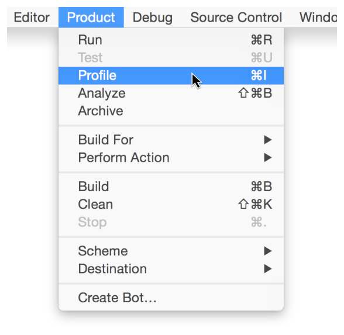

这时就会打开 Profiling Template 选项对话框：

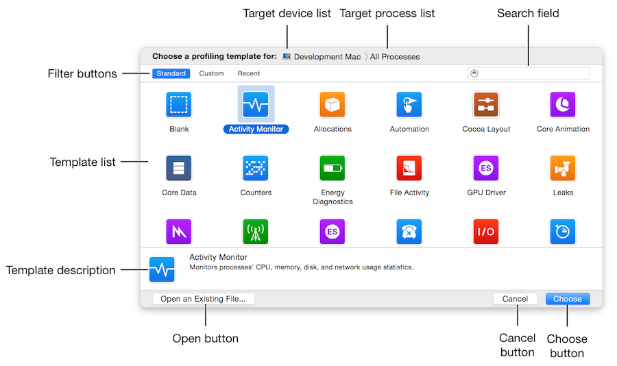

2、选择 `Time Profiler` 这个模板，并点击 `Choose` 按钮。

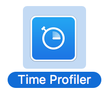

3、进入 Instruments 后，选择正确的设备和应用程序：

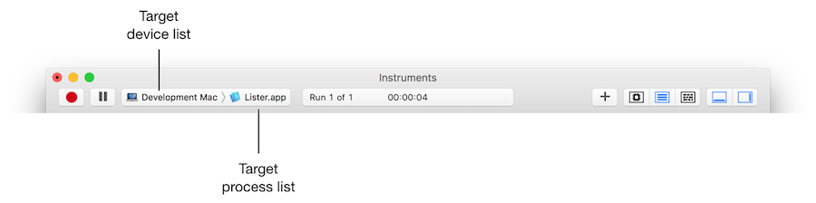

4、点击红色按钮运行后，就能得到 CPU 性能的结果了：

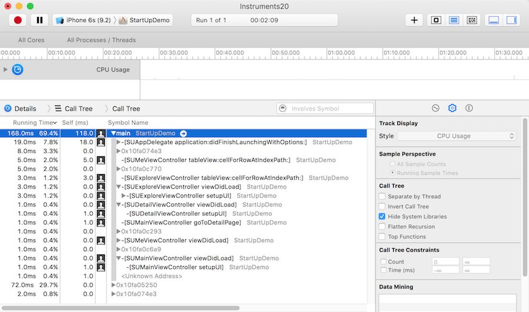

我们还能在时间轴面板里面去选择一段时间来查看该时间段里更为细节的 CPU 性能：

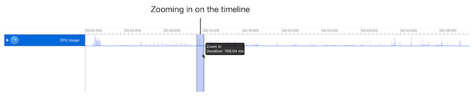

同时在中间的导航条以及右下角的控制面板中，我们还可以通过不同的选项来选择数据展示的形式和维度。

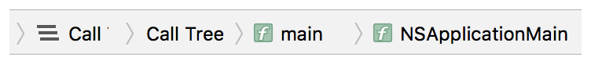

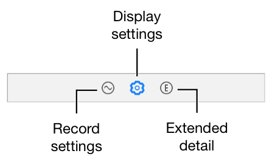

从这个结果中，我们可以看到不同的线程以及方法调用占用的时间，从而可以评估出 CPU 性能的瓶颈和优化方向。

5、除此之外，我们还能在 Instruments 选择使用 `Counters`、`Activity Monitor`、`System Trace` 等 Profiling Template 对程序做 CPU 性能考量。

6、需要注意的是，有时候如果你使用 Instruments 查看调用堆栈时可能看到的都是地址而不是函数名，这样就不太好定位问题了。这时候你可以把相关项目的 Build Settings - Debug Information Format 的 Debug 和 Release 都设置为 `DWARF with dSYM File`，这样就能将对应的堆栈信息符号化显示了。

## 图形性能

关于图形性能方面，我们平时最关注的应该就是「帧率」这个概念了。在 Instruments 中，我们可以使用 `Core Animation` + `Time Profiler` 来评估图形性能。使用步骤如下：

1、同「CPU 占用性能测试」一样，先在 Xcode 中对当前的项目执行 Profile (Command-I)，并在打开的对话框中选择 `Core Animaiton` 这个模板：

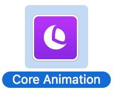

2、进入 Instruments 后，选择正确的设备和应用程序。

3、点击红色按钮运行应用程序，随着我们操作 App 界面，就可以看到帧率的变化和数据了：

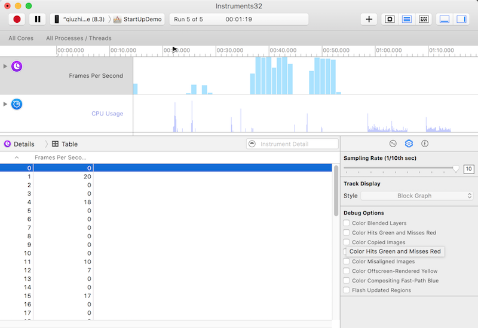

在滑动屏幕时，帧率越高表示性能越好，帧率过低则意味着屏幕可能会出现卡顿。

4、在右下角面板的 Display Settings 区域，我们可以看到多个 Debug Options：

- `Color Blended Layers`，这个选项选项基于渲染程度对屏幕中的混合区域进行绿到红的高亮显示，**越红表示性能越差**，会对帧率等指标造成较大的影响。红色通常是由于多个半透明图层叠加引起。<!-- Shows blended view layers. Multiple view layers that are drawn on top of each other with blending enabled are highlighted in red. Reducing the amount of red in your app when this option is selected can dramatically improve your app’s performance. Blended view layers often cause slow table scrolling. -->
- `Color Hits Green and Misses Red`，当 `UIView.layer.shouldRasterize = YES` 时，耗时的图片绘制会被缓存，并当做一个简单的扁平图片来呈现。这时候，如果页面的其他区块(比如 UITableViewCell 的复用)使用缓存直接命中，就显示绿色，反之，如果不命中，这时就显示红色。**红色越多，性能越差。**因为栅格化生成缓存的过程是有开销的，如果缓存能被大量命中和有效使用，则总体上会降低开销，反之则意味着要频繁生成新的缓存，这会让性能问题雪上加霜。<!-- Marks views in green or red. A view that is able to use a cached rasterization is marked in green. -->
- `Color Copied Images`，对于 GPU 不支持的色彩格式的图片只能由 CPU 来处理，把这样的图片标为蓝色。**蓝色越多，性能越差。**因为，我们不希望在滚动视图的时候，由 CPU 来处理图片，这样可能会对主线程造成阻塞。<!-- If an image is in a color format that the GPU can not directly work with, it will be converted in the CPU. Shows images that are copied by Core Animation in blue. -->
- `Color Immediately`，通常 Core Animation Instruments 以每毫秒 10 次的频率更新图层调试颜色。对某些效果来说，这显然太慢了。这个选项就可以用来设置每帧都更新（可能会影响到渲染性能，而且会导致帧率测量不准，所以不要一直都设置它）。<!-- Removes the 10 ms delay when performing color-flush operations. -->
- `Color Misaligned Images`，这个选项检查了图片是否被缩放，以及像素是否对齐。被放缩的图片会被标记为黄色，像素不对齐则会标注为紫色。**黄色、紫色越多，性能越差。**<!-- Places a magenta overlay over images where the source pixels are not aligned to the destination pixels. -->
- `Color Offscreen-Rendered Yellow`，这个选项会把那些离屏渲染的图层显示为黄色。**黄色越多，性能越差。**这些显示为黄色的图层很可能需要用 shadowPath 或者 shouldRasterize 来优化。<!-- Places a yellow overlay over content that is rendered offscreen. -->
- `Color OpenGL Fast Path Blue`，这个选项会把任何直接使用 OpenGL 绘制的图层显示为蓝色。**蓝色越多，性能越好。**如果仅仅使用 UIKit 或者 Core Animation 的 API，那么不会有任何效果。如果使用 GLKView 或者 CAEAGLLayer，那如果不显示蓝色块的话就意味着你正在强制 CPU 渲染额外的纹理，而不是绘制到屏幕。<!-- Places a blue overlay over content that is detached from the compositor. -->
- `Flash Updated Regions`，这个选项会把重绘的内容显示为黄色。**不该出现的黄色越多，性能越差。**通常我们希望只是更新的部分被标记完黄色。<!-- Colors regions on your iOS device in yellow when those regions are updated by the graphics processor. -->

我们可以使用这些选项，来监测更加具体的图形性能。

5、我们还可以选择使用 `OpenGL ES Analysis`、`GPU Driver` 等模板来监测图形相关性能。

## 内存性能

Instruments 可以帮我们了解到应用程序使用内存的几个方面：

- `全局内存使用情况(Overall Memory Use)`: 从全局的角度监测应用程序的内存使用情况，捕捉非预期的或大幅度的内存增长。<!-- Monitor at a high level how your app uses memory and compare it to the memory usage of other active processes on the system. Look for areas of large or unexpected memory growth. -->
- `内存泄露(Leaked memory)`: 未被你的程序引用，同时也不能被使用或释放的内存。<!-- This is memory that was allocated at some point, but was never released and is no longer referenced by your app. Since there are no references to it, there’s now no way to release it and the memory can’t be used again. For example, suppose you’ve written an app that creates rectangle objects in a drawing, but never releases the objects when the drawing is closed. In this case, your app would leak more and more memory whenever a drawing containing rectangles is closed. To fix the leak, you need to figure out which object isn’t being released, and then update your app to release it at the appropriate time. -->
- `废弃内存(Abandoned memory)`: 被你的程序引用，但是没什么卵用的内存。<!-- This is memory that your app has allocated for some reason, but it’s not needed and won’t be referenced. For example, suppose your app adds images to a cache after they’ve already been cached—using double the memory for the same images. Or, maybe your app maintains an array of objects in case you need to access them later, but you never actually do. Unlike leaked memory, abandoned memory like this is still referenced somewhere in your app. It just serves no purpose. Since it’s still technically valid, it’s more difficult for Instruments to identify and requires more detective work on your part to find. -->
- `僵尸对象(Zombies)`: 僵尸对象指的是对应的内存已经被释放并且不再会使用到，但是你的程序却在某处依然有指向它的引用。在 iOS 中有一个 NSZombie 机制，这个是为了内存调试的目的而设计的一种机制。在这个机制下，当你 NSZombieEnabled 为 YES 时，当一个对应的引用计数减为 0 时，这个对象不会被释放，当这个对象再收到任何消息时，它会记录一条 warning，而不是直接崩溃，以方便我们进行程序调试。<!-- This is memory that has been released and is no longer needed, but your code still references it somewhere. For example, suppose your app contains an image cache. Once the cache has been cleared, your app shouldn’t attempt to refer to the images that it previously contained. Calls to these nonexistent images are considered zombies—references to objects that are no longer living. -->

这里我们介绍下查找内存泄露的过程：

1、同「CPU 占用性能测试」一样，先在 Xcode 中对当前的项目执行 Profile (Command-I)，并在打开的对话框中选择 `Leaks` 这个模板：

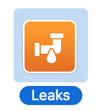

2、进入 Instruments 后，选择正确的设备和应用程序。

3、点击红色按钮运行应用程序，我们可以看到如下界面：

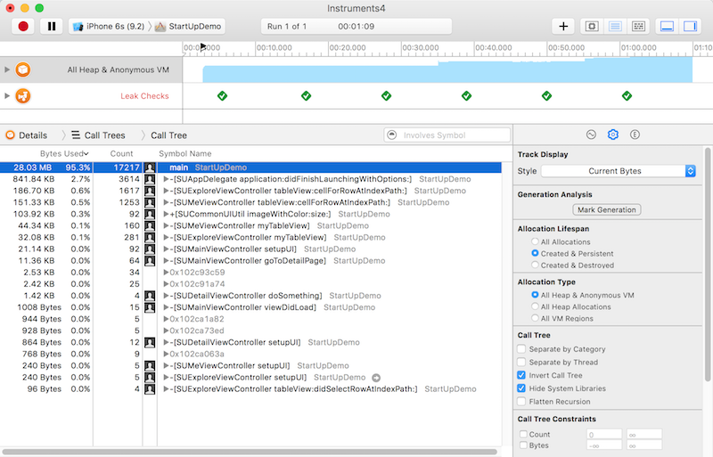

4、在 Display Settings 中勾选 `Invert Call Tree` 和 `Hide System Libraries` 或其他选项可以过滤显示的数据。

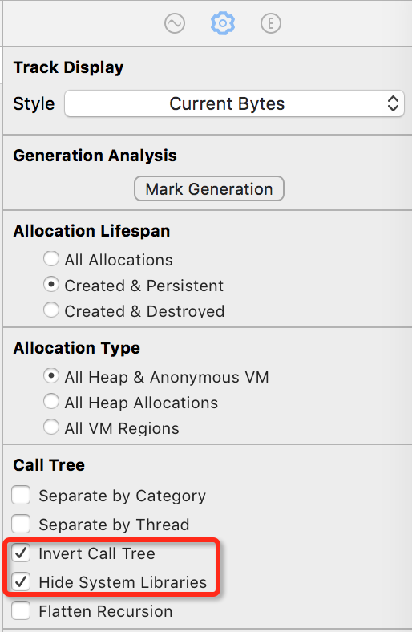

5、在导航栏的筛选框中，我们可以输入关键字来筛选数据。

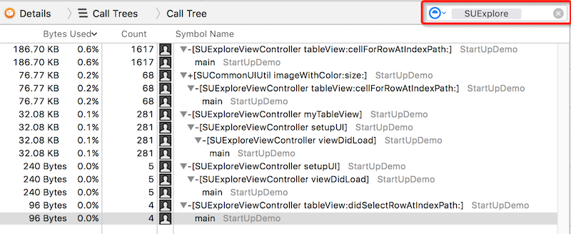

6、在实际使用中，我们进入一个页面后再退出，发现相关的内存分配没有清空，这时候就发生内存泄露了。我们查看更细节的调用信息，追踪到可能造成内存泄露的代码位置：

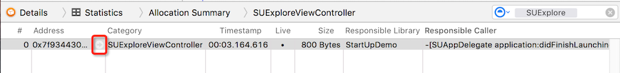

7、我们还可以使用 `Activity Monitor`、`Allocations`、`Zombies` 等模板来针对性地做内存监测。

## 参考

- [Instruments User Guide][3]

[SamirChen]: http://www.samirchen.com "SamirChen"
[1]: {{ page.url }} ({{ page.title }})
[2]: http://www.samirchen.com/use-instruments
[3]: https://developer.apple.com/library/ios/documentation/DeveloperTools/Conceptual/InstrumentsUserGuide/index.html

