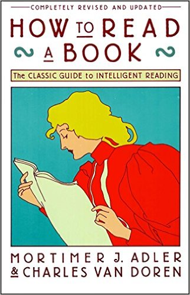

想读更多的书，但是时间总是不够，这时你可能需要一些能够帮助你高效阅读的方法，不妨试试《How to Read a Book》这本书，中文版是[《如何阅读一本书》][3]，也许里面有你需要的东西。

如果你当下连看这本书的时间都没有，那你可以看看我从这本书摘录的一点读书笔记，希望能有用。

## 主体目录

- 第一篇 阅读的层次
	- 第一章 阅读的活力与艺术
	- 第二章 阅读的层次
	- 第三章 阅读的第一个层次：基础阅读
	- 第四章 阅读的第二个层次：检视阅读
	- 第五章 如何做一个自我要求的读者
- 第二篇 阅读的第三个层次：分析阅读
	- 第六章 一本书的分类
	- 第七章 透视一本书
	- 第八章 与作者找出共通的词义
	- 第九章 判断作者的主旨
	- 第十章 公正地评断一本书
	- 第十一章 赞同或反对作者
	- 第十二章 辅助阅读
- 第三篇 阅读不同读物的方法
	- 第十三章 如何阅读实用型的书
	- 第十四章 如何阅读想像文学
	- 第十五章 阅读故事、戏剧与诗的一些建议
	- 第十六章 如何阅读历史书
	- 第十七章 如何阅读科学与数学
	- 第十八章 如何阅读哲学书
	- 第十九章 如何阅读社会科学
- 第四篇 阅读的最终目标
	- 第二十章 阅读的第四个层次：主题阅读
	- 第二十一章 阅读与心智的成长

这本书介绍了一套阅读方法论，讨论了阅读的四个层次，并总结了在各个层次的阅读中可以使用的技巧和应该遵循的规则。

在我摘录的笔记中，则主要包括了：阅读四个层次的概念、相关技巧和规则的总结；阅读时应该带着的问题；阅读做笔记的方法等。

## 阅读的层次

阅读的层次分为：

- 1、**基础阅读(Elementary Reading)**。在这个层次的阅读中，读者要搞清楚的是「这个句子在说什么？」这个问题最简单的那一面，读者关心的只是表面的语言。
 

- 2、**检视阅读(Inspectional Reading)**。检视阅读强调时间，即在一定的时间内抓住一本书的重点，也就是略读。这个层次的阅读，读者需要搞清楚「这本书在谈什么？」或是「这本书包含哪些内容？」

- 3、**分析阅读(Analytical Reading)**。分析阅读是全盘的、完整的阅读，也就是精读。在这个层次的阅读，读者是要咀嚼和消化一本书，去寻求理解，并提出许多系统性的问题。

- 4、**主题阅读(Syntopical Reading)**。在做主题阅读时，阅读者会阅读多本书，列出这些书之间的相关性，提出它们都谈到的主题，也就是比较阅读。主题阅读是最主动、最花力气的一种阅读。

### 基础阅读

基础阅读层次其实没有太多需要说的，主要是对于一些基本能力的准备。包括：

- 第一阶段：基本的视听能力、认知能力。
- 第二阶段：对字句的使用、理解和发音。
- 第三阶段：通过阅读时的上下文快速建立字汇的能力，以及对课文的运用。
- 第四阶段：精练和增进前面的技巧。

这些都应该是在小学阶段就得到培养的能力。

### 检视阅读

检视阅读的两个阶段：

1、第一个阶段：系统的略读。

其中有以下规则：

- 1、先看书名、序言，注意副标题、其他相关说明和宗旨、作者写作的独特角度等等。快速建立对这本书主题的概念，甚至对这本书进行一个分类，并联想一下相关的其他书。
- 2、研究目录。概括性的了解书的基本架构。
- 3、检阅索引。快速评估本书涵盖的议题范围和所提到的书籍种类和作者。识别重要词汇，做一些预先了解。
- 4、阅读出版者介绍、本书的宣传文案。
- 5、从目录中挑选几个与本书主题息息相关的篇章来阅读。仔细阅读这些篇章的摘要说明。
- 6、随机性阅读书中的段落或连续的几页(不要太多)。关注主要论点讯号和主题的基本脉络，关注书本的后记。

2、第二个阶段：粗浅的阅读。

其中有以下规则：

- 1、第一次面对一本难度的书，从头到尾先读一遍，只关注你能理解的部分，不要在不懂的地方停顿。
- 2、学会根据一本书的内容的难易程度来设定自己的阅读速度。慢不该慢到不值得，快不该快到有损于满足和理解。当然，这里的理解是基础级别的理解。
- 3、阅读一本书时，避免视线的停留或倒退。可以使用手指跟着文字移动，迫使眼睛跟着手指移动来训练自己，纠正停留或倒退。

### 分析阅读

分析阅读的三个阶段:

1、第一个阶段：找出一本书在谈些什么。

其中有以下规则：

- 1、依照书本的种类与主题做分类。
- 2、使用最简短的句子来叙述整本书的在谈些什么。
- 3、按照顺序与关系列出全书的重要部分。将全书的纲要拟出来之后，再将各个部分的纲要也一一列出。
- 4、找出作者在问的问题，或作者想要解决的问题。

2、第二个阶段：诠释一本书内容。

其中有以下规则：

- 1、诠释作者使用的关键字，与作者达成共识。
- 2、从最重要的句子中抓住作者的重要主旨。
- 3、找出作者的论述，重新架构这些论述的前因后果，以明白作者的主张。
- 4、确定作者已经解决的问题，还有哪些问题未解决。在未解决的问题中，确定哪些是作者认为自己无法解决的问题。

3、第三阶段：像沟通知识一样评论一本书。

其中有以下规则：

- A. 智慧礼节的一般规则
	- 1、非你已经完成大纲架构，也能诠释整本书了，否则不要轻易批评。（在你说出："我读懂了！"之前，不要说你同意、不同意或暂缓评论。）
	- 2、不要争强好胜，非辩到底不可。
	- 3、在说出评论之前，你要能证明自己区别得出真正的知识与个人观点的不同。
- B. 批评观点的特别标准
	- 4、证明作者的知识不足。
	- 5、证明作者的知识错误。
	- 6、证明作者不合逻辑。
	- 7、证明作者的分析与理由是不完整的。

关于最后这四点，4、5、6 这几点是表示不同意见的准则，如果你无法提出相关的佐证，就必须同意作者的说法，或至少一部分说法。你只能因为第 7 点理由，对这本书暂缓评论。

### 主题阅读

主题阅读有两个阶段：

1、第一个阶段：主题阅读的准备阶段，需要阅读者来观察研究范围。

- 1、针对研究的主题，设计一份试验性的书目。你可以参考图书馆目录、专家的建议与书中的书目索引。
- 2、浏览这些书目，确定哪些与你的主题相关，并就你的主题建立起清楚的概念。

2、第二个阶段：主题阅读阶段，需要阅读者阅读第一阶段收集到的书籍。

- 1、浏览所有在第一阶段被认定与主题相关的书，找出最相关的章节。
- 2、根据主题创造出一套中立的词汇，带引作者与你达成共识。无论作者是否实际用到这些词汇，所有的作者，或者至少大部分作者都可以用这套词汇来诠释。
- 3、建立一个中立的主旨，列出一连串的问题。使全部或者大部分作者能够解读为针对这些问题提供了他们的回答。
- 4、界定主要及次要的议题。然后将作者针对各个问题的不同意见整理陈列在各个议题之旁。需要注意的是，各个作者不见得一定直接提出了某个议题。有时候，你需要针对一些不是作者主要关心的事情，把他的观点解读，才能构建出这种议题。
- 5、分析这些讨论。把问题和议题按顺序排列，以突显主题。比较有共同性的议题要放在相对没有共同性的议题之前。各个议题直接的关系也要清楚的界定出来。

需要注意的是，理想上，要一直保持对话式的疏篱与客观。要做到这一点，每当你要解读一个作家对一个议题的观点时，你必须从他的文章中引用一段话来佐证。

至此，我们介绍完了阅读的四个层次，以及在每个层次阅读者需要做的事情和相关的规则。对于不同的书，结合你自己不同的需求，你应该选择合适的阅读层次以及相关的阅读技巧来阅读，这样才能保持好的阅读效率和效果。

## 主动阅读的四个基本问题

- 1、整体来说，这本书到底在谈什么？找到书的主题，分解出从属的关键议题。
- 2、作者细部说了什么？怎么说的？找出书的主要想法、声明和论点。
- 3、这本书说得有道理吗？是全部有道理，还是部分有道理？先了解整本书，在认真阅读后，做出自己对这本书的判断。
- 4、这本书跟你有什么关系？如果这本书给你提供了咨询，你要问问这些咨询对你有什么意义。如果这本书给你启发，你就更有必要找出其他相关的更深的含义或建议。

任何一种超越基础阅读的阅读层次，核心就在于你要努力提出问题，然后尽可能找出答案。

## 如何做阅读笔记

笔记的方式：

- 画底线。在主要的重点，或重要又有力量的句子下画线。
- 在画底线处的栏外再加画一道线。把你已经画线的部分再强调一遍，或是某一段很重要，但要画底线太长了，便在这一整段外加上一个记号。
- 在空白处做星号或其他符号。要慎用，只用来强调书中十来个最重要的声明或段落即可。你可能想要将做过这样记号的地方每页折一个角，或是夹一张书签，这样你随时从书架上拿起这本书，打开你做记号的地方，就能唤醒你的记忆。
- 在空白处编号。作者的某个论点发展出一连串的重要陈述时，可以做顺序编号。
- 在空白处记下其他的页码。强调作者在书中其他部分也有过同样的论点，或相关的要点，或是与此处观点不同的地方。这样做能让散布全书的想法统一集中起来。许多读者会用 Cf 这样的记号，表示比较或参照的意思。
- 将关键字或句子圈出来。这跟画底线是同样的功能。
- 在书页的空白处做笔记。在阅读某一章节时，你可能会有些问题（或答案），在空白处记下来，这样可以帮你回想起你的问题或答案。你也可以将复杂的论点简化说明在书页的空白处。或是记下全书所有主要论点的发展顺序。书中最后一页可以用来作为个人的索引页，将作者的主要观点依序记下来。

笔记的分类：

- **结构笔记**。在做检视阅读时，你可能没太多时间做详细几笔，这时候你需要关注的问题是：1）这是什么样的一本书？2）整本书在谈的是什么？3）作者是借着怎样的整体架构来发展他的观点或者陈述他对这个主题的解释？你应该做一些笔记，把这几个问题回答下来以便以后阅读时参考。
- **概念笔记**。当你做分析阅读时，对于这本书准确性和意义的问题，你就需要给出答案了。这时候你需要做的笔记不再跟结构有关，而是跟概念相关，这些概念是作者的观点，而当你读得越深越广时，便也会出现你自己的观点。
- **辩证笔记**。 在做主题阅读时，你需要同时阅读多本相同主题的书籍，这时在笔记中融入多位作者的观点，就好像他们在针对一个主题做讨论一样。这时你通常需要单独的一张纸来记载，用上概念的结构，就一个单一主题把所有相关的陈述和疑问顺序而列。

<!-- 
## 摘录

- 阅读的目标：为获得咨询而读，为求得理解而读。前者的意义是我们在阅读报纸、杂志，或其他东西时，凭我们的阅读技巧和聪明才智，一下子就能融汇贯通了。这样的读物能增加我们的咨询，却不能增进我们的理解力。后者的意义是一个人试着读一样一开始他并不怎么了解的东西。这个东西的水平就是比阅读的人的水平高上一截。这个作者想要表达的东西，能增进阅读者的理解能力。

- 所谓「吸收咨询」，就只是知道某件事发生了。而「想要被启发」，就是要去理解，搞清楚这到底是怎么回事：为什么会发生，与其他事情有什么关联；有什么类似的情况，同类的差异在哪里等等。 
-->

[SamirChen]: http://www.samirchen.com "SamirChen"
[1]: {{ page.url }} ({{ page.title }})
[2]: http://www.samirchen.com/how-to-read-a-book/
[3]: http://book.douban.com/subject/1013208/
