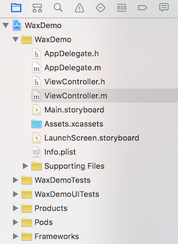

## Wax 简介

Wax 是一个开源项目，现在由 Alibaba 公司维护，项目地址：[https://github.com/alibaba/wax](https://github.com/alibaba/wax)。

Wax 是一个把 Lua 脚本语言与原生 Objective-C 底层 runtime 结合起来的框架，使得你可以在 Lua 里面使用任何 Objective-C 类及框架。由于 Wax 这样的特性，使得通过 Lua 来开发 iOS 应用成为一种可能，想当年著名的游戏「愤怒的小鸟」就是基于 Wax 框架编写的。不过，对于大多数 iOS 开发人员来说，由 Objective-C 转向 Lua 可能并不那么容易接受。不过在另外一个应用场景上，Wax 却是可以大展身手的，那就是这篇文章要讲的：**修复 iOS 应用的线上 Bug**。

下面就简要介绍一下。

## 原有项目

首先，我们创建一个简单的 iOS 应用项目。大致如下：

修改 `ViewController.m` 如下：

	#import "ViewController.h"

	@interface ViewController ()

	@end

	@implementation ViewController

	#pragma mark - Lifecycle
	- (void)viewDidLoad {
	    [super viewDidLoad];	    

	    [self setupUI];
	}

	#pragma mark - Setup
	- (void)setupUI {
	    NSLog(@"Hello, world!");
	    [self.view setBackgroundColor:[UIColor redColor]];
	}

	@end

大致意思就是，在加载 ViewController 页面的时候将页面背景颜色设置为红色。

运行程序，即可看到：

## 接入 Wax

我们在这里通过 CocoaPods 来接入和管理 Wax，对应的 Podfile 内容为：

	platform :ios

	target 'WaxDemo' do
		platform:ios, '7.0'
		pod 'wax', :git=>'https://github.com/alibaba/wax.git', :tag=>'1.1.0'
	    #pod 'wax', :git=>'https://github.com/alibaba/wax.git', :commit=>'5c762ad'
	    #pod 'wax', :path=>'../../../'
	end

可以看到，我们可以通过设置 Wax 项目的 tag 号、commit 号或者本地代码的形式来引入它。这里采用的是设置 tag 号。编辑好 Podfile 后，执行 `pod install` 即可把 Wax 库安装到项目中来。

## 修复 Bug

这时候，我们设想一个场景，我们上面创建的项目的应用程序上线了，但是现在我们发现不应该设置 ViewController 页面的背景色为红色，而应该设为蓝色，怎么办？除了走冗长的发版流程，我们还有什么选择？

这时 Wax 的作用就显现出来了。

在上一节我们在项目中接入了 Wax，现在我们做一些修改：

1）在工程里添加一个脚本文件 `my_hotpatch.lua`，内容如下：

	waxClass{"ViewController"}

	function setupUI(self)
	    print('Hello, wax!')
	    self:view():setBackgroundColor(UIColor:blueColor())
	end

2）修改 `AppDelegate.m` 如下：

	#import "AppDelegate.h"
	#import <wax/wax.h>

	@interface AppDelegate ()

	@end

	@implementation AppDelegate

	- (BOOL)application:(UIApplication *)application didFinishLaunchingWithOptions:(NSDictionary *)launchOptions {
	    // Override point for customization after application launch.
	    // Use Wax for hotpatch.
	    wax_start(nil, nil);
	    NSString* path=[[NSBundle mainBundle] pathForResource:@"my_hotpatch" ofType:@"lua"];
	    int result = wax_runLuaFile([path UTF8String]);
	    NSLog(@"%d", result);

	    return YES;
	}

	@end 

我们再次执行程序，你可以看到 ViewController 页面的背景色显示为蓝色了：

我们简单解释一下上面对项目的修改：

在 `AppDelegate.m` 中，我们在程序启动的入口启动了 Wax，并找到脚本文件 `my_hotpatch.lua` 去执行它。而 `my_hotpatch.lua` 这个脚本文件中，我们则是定义了 ViewController 的 `setupUI` 方法，将 ViewController 页面的颜色设置为蓝色。

由于 Wax 能够与 Objective-C 底层 runtime 结合，所以它当然能做到用 Lua 脚本的方法去覆盖对应的 Objective-C 的方法了。这就是我们实现修改页面颜色效果的原理。

不过需要注意的是：

- `wax_start` 需要在使用任何 Wax 接口前被调用。
- `wax_start` 要在主线程被调用。
- `wax_start` 只能被调用一次。

上面只是一个 Demo，并没有实实在在的实现修复 iOS 应用线上 Bug，但是却提供了一个明显的思路：我们可以通过用 Wax 提前加载 Lua 脚本来覆盖已有的 Objective-C 方法达到修复 Bug 的目的。

在这个思路下去完善修复线上 Bug 的解决方案你可能还有这些问题需要注意：

- 建立一套修复脚本的加载机制。提供 Lua 字节码编译、代码和资源打包、加密、签名、校验、运行等功能，同时还需要封装提供 patch 包的版本控制、更新、下载等功能。
- 熟悉 Lua 语法与 Objective-C 语法的对应关系和翻译技巧。
- 掌握 Lua 脚本的调试能力。

对于这些问题，你可以关注 [Wax 官方 Wiki][3]。

[SamirChen]: http://www.samirchen.com "SamirChen"
[1]: {{ page.url }} ({{ page.title }})
[2]: http://www.samirchen.com/use-wax-to-fix-bug/
[3]: https://github.com/alibaba/wax/wiki
