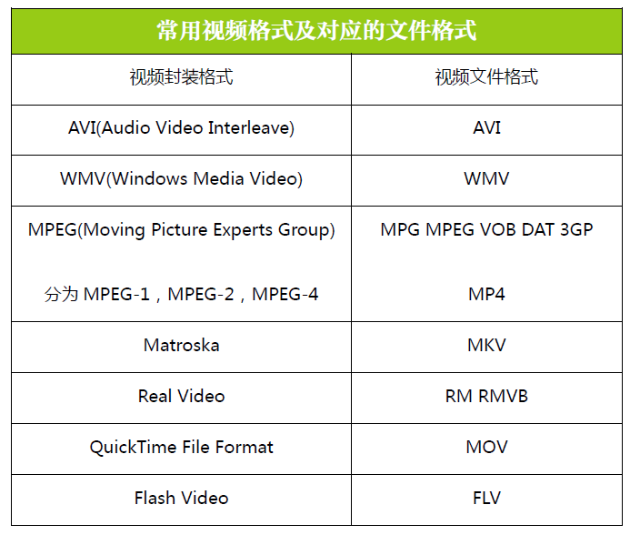
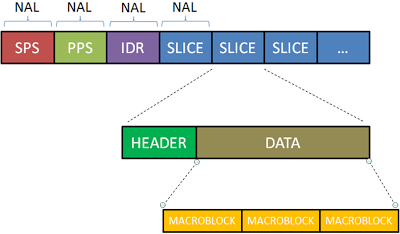
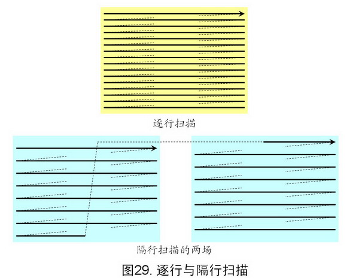
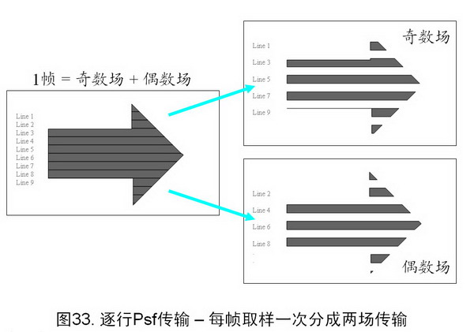
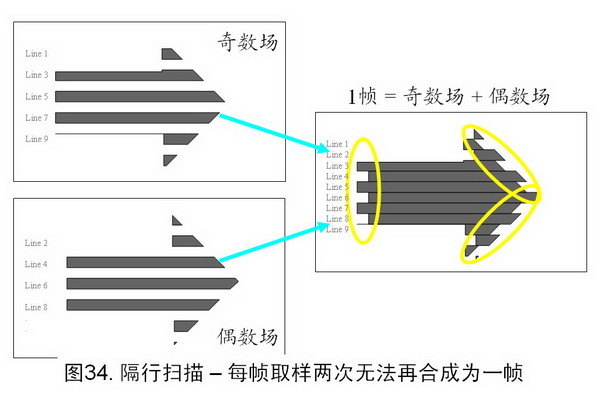
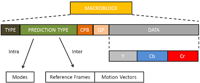

## 视频相关概念

### 视频文件格式

文件格式这个概念应该是我们比较熟悉的，比如我们常见的 Word 文档的文件格式是 `.doc`，JPG 图片的文件格式是 `.jpg` 等等。那对于视频来说，我们常见的文件格式则有：`.mov`、`.avi`、`.mpg`、`.vob`、`.mkv`、`.rm`、`.rmvb` 等等。文件格式通常表现为文件在操作系统上存储时的后缀名，它通常会被操作系统用来与相应的打开程序关联，比如你双击一个 `test.doc` 文件，系统会调用 Word 去打开它。你双击一个 `test.avi` 或者 `test.mkv` 系统会调用视频播放器去打开它。

同样是视频，为什么会有 `.mov`、`.avi`、`.mpg` 等等这么多种文件格式呢？那是因为它们通过不同的方式实现了视频这件事情，至于这个不同在哪里，那就需要了解一下接下来要说的「视频封装格式」这个概念了。

### 视频封装格式

视频封装格式，简称视频格式，相当于一种储存视频信息的容器，它里面包含了封装视频文件所需要的视频信息、音频信息和相关的配置信息(比如：视频和音频的关联信息、如何解码等等)。一种视频封装格式的直接反映就是对应着相应的视频文件格式。

下面我们就列举一些文件封装格式：

- **AVI 格式**，对应的文件格式为 `.avi`，英文全称 Audio Video Interleaved，是由 Microsoft 公司于 1992 年推出。这种视频格式的优点是图像质量好，无损 AVI 可以保存 alpha 通道。缺点是体积过于庞大，并且压缩标准不统一，存在较多的高低版本兼容问题。

- **DV-AVI 格式**，对应的文件格式为 `.avi`，英文全称 Digital Video Format，是由索尼、松下、JVC 等多家厂商联合提出的一种家用数字视频格式。常见的数码摄像机就是使用这种格式记录视频数据的。它可以通过电脑的 IEEE 1394 端口传输视频数据到电脑，也可以将电脑中编辑好的的视频数据回录到数码摄像机中。

- **WMV 格式**，对应的文件格式是 `.wmv`、`.asf`，英文全称 Windows Media Video，是微软推出的一种采用独立编码方式并且可以直接在网上实时观看视频节目的文件压缩格式。在同等视频质量下，WMV 格式的文件可以边下载边播放，因此很适合在网上播放和传输。

- **MPEG 格式**，对应的文件格式有 `.mpg`、`.mpeg`、`.mpe`、`.dat`、`.vob`、`.asf`、`.3gp`、`.mp4` 等等，英文全称 Moving Picture Experts Group，是由运动图像专家组制定的视频格式，该专家组于 1988 年组建，专门负责视频和音频标准制定，其成员都是视频、音频以及系统领域的技术专家。MPEG 格式目前有三个压缩标准，分别是 MPEG-1、MPEG-2、和 MPEG-4。MPEG-4 是现在用的比较多的视频封装格式，它为了播放流式媒体的高质量视频而专门设计的，以求使用最少的数据获得最佳的图像质量。

- **Matroska 格式**，对应的文件格式是 `.mkv`，Matroska 是一种新的视频封装格式，它可将多种不同编码的视频及 16 条以上不同格式的音频和不同语言的字幕流封装到一个 Matroska Media 文件当中。

- **Real Video 格式**，对应的文件格式是 `.rm`、`.rmvb`，是 Real Networks 公司所制定的音频视频压缩规范称为 Real Media。用户可以使用 RealPlayer 根据不同的网络传输速率制定出不同的压缩比率，从而实现在低速率的网络上进行影像数据实时传送和播放。

- **QuickTime File Format 格式**，对应的文件格式是 `.mov`，是 Apple 公司开发的一种视频格式，默认的播放器是苹果的 QuickTime。这种封装格式具有较高的压缩比率和较完美的视频清晰度等特点，并可以保存 alpha 通道。

- **Flash Video 格式**，对应的文件格式是 `.flv`，是由 Adobe Flash 延伸出来的一种网络视频封装格式。这种格式被很多视频网站所采用。

从上面的介绍中，我们大概对视频文件格式以及对应的视频封装方式有了一个概念，接下来则需要了解一下关于视频更本质的东西，那就是视频编解码。

### 视频编解码方式

视频编解码的过程是指对数字视频进行压缩或解压缩的一个过程。

在做视频编解码时，需要考虑以下这些因素的平衡：视频的质量、用来表示视频所需要的数据量（通常称之为码率）、编码算法和解码算法的复杂度、针对数据丢失和错误的鲁棒性（Robustness）、编辑的方便性、随机访问、编码算法设计的完美性、端到端的延时以及其它一些因素。

常见的视频编码方式有：

- **H.26X 系列**，由国际电传视讯联盟远程通信标准化组织(ITU-T)主导，包括 `H.261`、`H.262`、`H.263`、`H.264`、`H.265`。
	- `H.261`，主要用于老的视频会议和视频电话系统。是第一个使用的数字视频压缩标准。实质上说，之后的所有的标准视频编解码器都是基于它设计的。
	- `H.262`，等同于 `MPEG-2 第二部分`，使用在 DVD、SVCD 和大多数数字视频广播系统和有线分布系统中。
	- `H.263`，主要用于视频会议、视频电话和网络视频相关产品。在对逐行扫描的视频源进行压缩的方面，`H.263` 比它之前的视频编码标准在性能上有了较大的提升。尤其是在低码率端，它可以在保证一定质量的前提下大大的节约码率。
	- `H.264`，等同于 `MPEG-4 第十部分`，也被称为高级视频编码(Advanced Video Coding，简称 AVC)，是一种视频压缩标准，一种被广泛使用的高精度视频的录制、压缩和发布格式。该标准引入了一系列新的能够大大提高压缩性能的技术，并能够同时在高码率端和低码率端大大超越以前的诸标准。
	- `H.265`，被称为高效率视频编码(High Efficiency Video Coding，简称 HEVC)是一种视频压缩标准，是 `H.264` 的继任者。HEVC 被认为不仅提升图像质量，同时也能达到 `H.264` 两倍的压缩率（等同于同样画面质量下比特率减少了 50%），可支持 4K 分辨率甚至到超高画质电视，最高分辨率可达到 8192×4320（8K 分辨率），这是目前发展的趋势。

- **MPEG 系列**，由国际标准组织机构(ISO)下属的运动图象专家组(MPEG)开发。
	- `MPEG-1 第二部分`，主要使用在 VCD 上，有些在线视频也使用这种格式。该编解码器的质量大致上和原有的 VHS 录像带相当。
	- `MPEG-2 第二部分`，等同于 `H.262`，使用在 DVD、SVCD 和大多数数字视频广播系统和有线分布系统中。
	- `MPEG-4 第二部分`，可以使用在网络传输、广播和媒体存储上。比起 `MPEG-2 第二部分`和第一版的 `H.263`，它的压缩性能有所提高。
	- `MPEG-4 第十部分`，等同于 `H.264`，是这两个编码组织合作诞生的标准。

- 其他，AMV、AVS、Bink、CineForm 等等，这里就不做多的介绍了。

介绍了上面这些「视频编解码方式」后，我们来说说它和上一节讲的「视频封装格式」的关系。可以把「视频封装格式」看做是一个装着视频、音频、「视频编解码方式」等信息的容器。一种「视频封装格式」可以支持多种「视频编解码方式」，比如：QuickTime File Format(.MOV) 支持几乎所有的「视频编解码方式」，MPEG(.MP4) 也支持相当广的「视频编解码方式」。当我们看到一个视频文件名为 `test.mov` 时，我们可以知道它的「视频文件格式」是 `.mov`，也可以知道它的视频封装格式是 `QuickTime File Format`，但是无法知道它的「视频编解码方式」。那比较专业的说法可能是以 A/B 这种方式，A 是「视频编解码方式」，B 是「视频封装格式」。比如：一个 H.264/MOV 的视频文件，它的封装方式就是 QuickTime File Format，编码方式是 H.264。

## 关于 H.264

H.264 是现在广泛采用的一种编码方式。关于 H.264 相关的概念，从大到小排序依次是：序列、图像、片组、片、NALU、宏块、亚宏块、块、像素。

- **图像**。H.264 中，「图像」是个集合的概念，帧、顶场、底场都可以称为图像。一帧通常就是一幅完整的图像。当采集视频信号时，如果采用逐行扫描，则每次扫描得到的信号就是一副图像，也就是一帧。当采集视频信号时，如果采用隔行扫描（奇、偶数行），则扫描下来的一帧图像就被分为了两个部分，这每一部分就称为「场」，根据次序分为：「顶场」和「底场」。「帧」和「场」的概念又带来了不同的编码方式：帧编码、场编码。逐行扫描适合于运动图像，所以对于运动图像采用帧编码更好；隔行扫描适合于非运动图像，所以对于非运动图像采用场编码更好。

- **片(Slice)**，每一帧图像可以分为多个片。

- **宏块(Macroblock)**，分片是由宏块组成。

- **视频编码层(VCL, Video Coding Layer)**，VCL 数据即被压缩编码后的视频数据序列。在 VCL 数据要封装到 NALU 单元中之后，才可以用来传输或存储。

- **网络提取层单元(NALU, Network Abstraction Layer Unit)**，NALU 是用来将编码的数据进行打包的，一个分片(Slice)可以编码到一个 NALU 单元。不过一个 NALU 单元中除了容纳分片(Slice)编码的码流外，还可以容纳其他数据，比如序列参数集 SPS。对于客户端其主要任务则是接收数据包，从数据包中解析出 NALU 单元，然后进行解码播放。

## 参考

- [知乎-视频格式相关][4]
- [维基百科-视频编解码器][3]

[SamirChen]: http://www.samirchen.com "SamirChen"
[1]: {{ page.url }} ({{ page.title }})
[2]: http://www.samirchen.com/video-concept
[3]: https://zh.wikipedia.org/zh/%E8%A7%86%E9%A2%91%E7%BC%96%E8%A7%A3%E7%A0%81%E5%99%A8
[4]: https://www.zhihu.com/question/20997688

