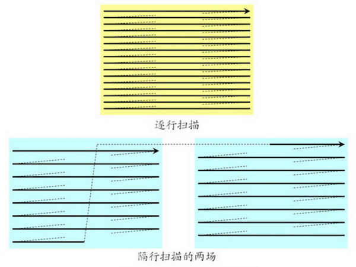
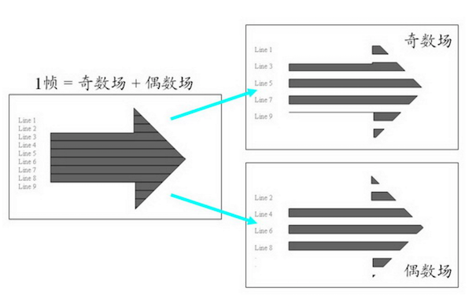
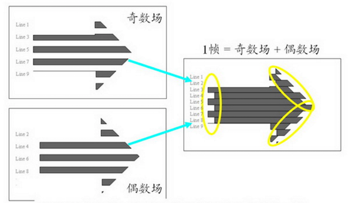
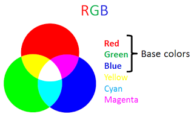
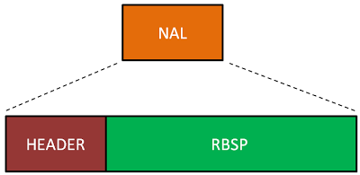
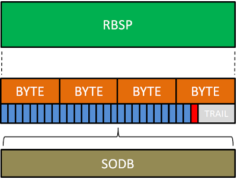
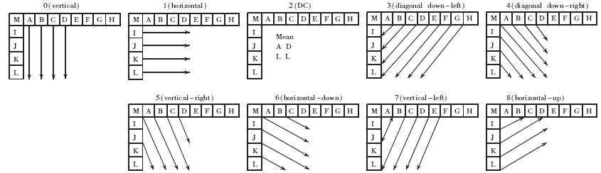
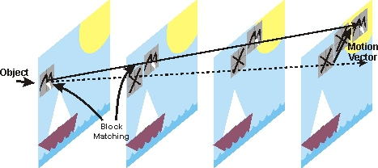
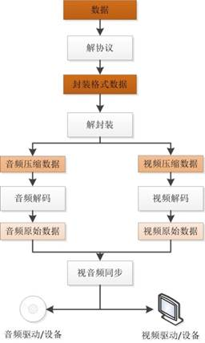

## 视频相关概念

### 视频文件格式

文件格式这个概念应该是我们比较熟悉的，比如我们常见的 Word 文档的文件格式是 `.doc`，JPG 图片的文件格式是 `.jpg` 等等。那对于视频来说，我们常见的文件格式则有：`.mov`、`.avi`、`.mpg`、`.vob`、`.mkv`、`.rm`、`.rmvb` 等等。文件格式通常表现为文件在操作系统上存储时的后缀名，它通常会被操作系统用来与相应的打开程序关联，比如你双击一个 `test.doc` 文件，系统会调用 Word 去打开它。你双击一个 `test.avi` 或者 `test.mkv` 系统会调用视频播放器去打开它。

同样是视频，为什么会有 `.mov`、`.avi`、`.mpg` 等等这么多种文件格式呢？那是因为它们通过不同的方式实现了视频这件事情，至于这个不同在哪里，那就需要了解一下接下来要说的「视频封装格式」这个概念了。

### 视频封装格式

视频封装格式，简称视频格式，相当于一种储存视频信息的容器，它里面包含了封装视频文件所需要的视频信息、音频信息和相关的配置信息(比如：视频和音频的关联信息、如何解码等等)。一种视频封装格式的直接反映就是对应着相应的视频文件格式。

下面我们就列举一些文件封装格式：

- **AVI 格式**，对应的文件格式为 `.avi`，英文全称 Audio Video Interleaved，是由 Microsoft 公司于 1992 年推出。这种视频格式的优点是图像质量好，无损 AVI 可以保存 alpha 通道。缺点是体积过于庞大，并且压缩标准不统一，存在较多的高低版本兼容问题。
- **DV-AVI 格式**，对应的文件格式为 `.avi`，英文全称 Digital Video Format，是由索尼、松下、JVC 等多家厂商联合提出的一种家用数字视频格式。常见的数码摄像机就是使用这种格式记录视频数据的。它可以通过电脑的 IEEE 1394 端口传输视频数据到电脑，也可以将电脑中编辑好的的视频数据回录到数码摄像机中。
- **WMV 格式**，对应的文件格式是 `.wmv`、`.asf`，英文全称 Windows Media Video，是微软推出的一种采用独立编码方式并且可以直接在网上实时观看视频节目的文件压缩格式。在同等视频质量下，WMV 格式的文件可以边下载边播放，因此很适合在网上播放和传输。
- **MPEG 格式**，对应的文件格式有 `.mpg`、`.mpeg`、`.mpe`、`.dat`、`.vob`、`.asf`、`.3gp`、`.mp4` 等等，英文全称 Moving Picture Experts Group，是由运动图像专家组制定的视频格式，该专家组于 1988 年组建，专门负责视频和音频标准制定，其成员都是视频、音频以及系统领域的技术专家。MPEG 格式目前有三个压缩标准，分别是 MPEG-1、MPEG-2、和 MPEG-4。MPEG-4 是现在用的比较多的视频封装格式，它为了播放流式媒体的高质量视频而专门设计的，以求使用最少的数据获得最佳的图像质量。
- **Matroska 格式**，对应的文件格式是 `.mkv`，Matroska 是一种新的视频封装格式，它可将多种不同编码的视频及 16 条以上不同格式的音频和不同语言的字幕流封装到一个 Matroska Media 文件当中。
- **Real Video 格式**，对应的文件格式是 `.rm`、`.rmvb`，是 Real Networks 公司所制定的音频视频压缩规范称为 Real Media。用户可以使用 RealPlayer 根据不同的网络传输速率制定出不同的压缩比率，从而实现在低速率的网络上进行影像数据实时传送和播放。
- **QuickTime File Format 格式**，对应的文件格式是 `.mov`，是 Apple 公司开发的一种视频格式，默认的播放器是苹果的 QuickTime。这种封装格式具有较高的压缩比率和较完美的视频清晰度等特点，并可以保存 alpha 通道。
- **Flash Video 格式**，对应的文件格式是 `.flv`，是由 Adobe Flash 延伸出来的一种网络视频封装格式。这种格式被很多视频网站所采用。

从上面的介绍中，我们大概对视频文件格式以及对应的视频封装方式有了一个概念，接下来则需要了解一下关于视频更本质的东西，那就是视频编解码。

### 视频编解码方式

视频编解码的过程是指对数字视频进行压缩或解压缩的一个过程。

在做视频编解码时，需要考虑以下这些因素的平衡：视频的质量、用来表示视频所需要的数据量（通常称之为码率）、编码算法和解码算法的复杂度、针对数据丢失和错误的鲁棒性（Robustness）、编辑的方便性、随机访问、编码算法设计的完美性、端到端的延时以及其它一些因素。

常见的视频编码方式有：

- **H.26X 系列**，由国际电传视讯联盟远程通信标准化组织(ITU-T)主导，包括 `H.261`、`H.262`、`H.263`、`H.264`、`H.265`。
	- `H.261`，主要用于老的视频会议和视频电话系统。是第一个使用的数字视频压缩标准。实质上说，之后的所有的标准视频编解码器都是基于它设计的。
	- `H.262`，等同于 `MPEG-2 第二部分`，使用在 DVD、SVCD 和大多数数字视频广播系统和有线分布系统中。
	- `H.263`，主要用于视频会议、视频电话和网络视频相关产品。在对逐行扫描的视频源进行压缩的方面，`H.263` 比它之前的视频编码标准在性能上有了较大的提升。尤其是在低码率端，它可以在保证一定质量的前提下大大的节约码率。
	- `H.264`，等同于 `MPEG-4 第十部分`，也被称为高级视频编码(Advanced Video Coding，简称 AVC)，是一种视频压缩标准，一种被广泛使用的高精度视频的录制、压缩和发布格式。该标准引入了一系列新的能够大大提高压缩性能的技术，并能够同时在高码率端和低码率端大大超越以前的诸标准。
	- `H.265`，被称为高效率视频编码(High Efficiency Video Coding，简称 HEVC)是一种视频压缩标准，是 `H.264` 的继任者。HEVC 被认为不仅提升图像质量，同时也能达到 `H.264` 两倍的压缩率（等同于同样画面质量下比特率减少了 50%），可支持 4K 分辨率甚至到超高画质电视，最高分辨率可达到 8192×4320（8K 分辨率），这是目前发展的趋势。
- **MPEG 系列**，由国际标准组织机构(ISO)下属的运动图象专家组(MPEG)开发。
	- `MPEG-1 第二部分`，主要使用在 VCD 上，有些在线视频也使用这种格式。该编解码器的质量大致上和原有的 VHS 录像带相当。
	- `MPEG-2 第二部分`，等同于 `H.262`，使用在 DVD、SVCD 和大多数数字视频广播系统和有线分布系统中。
	- `MPEG-4 第二部分`，可以使用在网络传输、广播和媒体存储上。比起 `MPEG-2 第二部分`和第一版的 `H.263`，它的压缩性能有所提高。
	- `MPEG-4 第十部分`，等同于 `H.264`，是这两个编码组织合作诞生的标准。
- 其他，AMV、AVS、Bink、CineForm 等等，这里就不做多的介绍了。

介绍了上面这些「视频编解码方式」后，我们来说说它和上一节讲的「视频封装格式」的关系。可以把「视频封装格式」看做是一个装着视频、音频、「视频编解码方式」等信息的容器。一种「视频封装格式」可以支持多种「视频编解码方式」，比如：QuickTime File Format(.MOV) 支持几乎所有的「视频编解码方式」，MPEG(.MP4) 也支持相当广的「视频编解码方式」。当我们看到一个视频文件名为 `test.mov` 时，我们可以知道它的「视频文件格式」是 `.mov`，也可以知道它的视频封装格式是 `QuickTime File Format`，但是无法知道它的「视频编解码方式」。那比较专业的说法可能是以 A/B 这种方式，A 是「视频编解码方式」，B 是「视频封装格式」。比如：一个 H.264/MOV 的视频文件，它的封装方式就是 QuickTime File Format，编码方式是 H.264。

### 音频编解码方式

视频中除了画面通常还有声音，所以这就涉及到音频编解码。在视频中经常使用的音频编码方式有：

- **AAC**，英文全称 Advanced Audio Coding，是由 Fraunhofer IIS、杜比实验室、AT&T、Sony等公司共同开发，在 1997 年推出的基于 MPEG-2 的音频编码技术。2000 年，MPEG-4 标准出现后，AAC 重新集成了其特性，加入了 SBR 技术和 PS 技术，为了区别于传统的 MPEG-2 AAC 又称为 MPEG-4 AAC。
- **MP3**，英文全称 MPEG-1 or MPEG-2 Audio Layer III，是当曾经非常流行的一种数字音频编码和有损压缩格式，它被设计来大幅降低音频数据量。它是在 1991 年，由位于德国埃尔朗根的研究组织 Fraunhofer-Gesellschaft 的一组工程师发明和标准化的。MP3 的普及，曾对音乐产业造成极大的冲击与影响。
- **WMA**，英文全称 Windows Media Audio，由微软公司开发的一种数字音频压缩格式，本身包括有损和无损压缩格式。

## 关于 H.264

### 概念

H.264 是现在广泛采用的一种编码方式。关于 H.264 相关的概念，从大到小排序依次是：序列、图像、片组、片、NALU、宏块、亚宏块、块、像素。

我们先来解释几个概念：

- **图像**。H.264 中，「图像」是个集合的概念，帧、顶场、底场都可以称为图像。一帧通常就是一幅完整的图像。当采集视频信号时，如果采用逐行扫描，则每次扫描得到的信号就是一副图像，也就是一帧。当采集视频信号时，如果采用隔行扫描（奇、偶数行），则扫描下来的一帧图像就被分为了两个部分，这每一部分就称为「场」，根据次序分为：「顶场」和「底场」。「帧」和「场」的概念又带来了不同的编码方式：帧编码、场编码。逐行扫描适合于运动图像，所以对于运动图像采用帧编码更好；隔行扫描适合于非运动图像，所以对于非运动图像采用场编码更好。

- **片(Slice)**，每一帧图像可以分为多个片。

- **网络提取层单元(NALU, Network Abstraction Layer Unit)**，NALU 是用来将编码的数据进行打包的，一个分片(Slice)可以编码到一个 NALU 单元。不过一个 NALU 单元中除了容纳分片(Slice)编码的码流外，还可以容纳其他数据，比如序列参数集 SPS。对于客户端其主要任务则是接收数据包，从数据包中解析出 NALU 单元，然后进行解码播放。

- **宏块(Macroblock)**，分片是由宏块组成。

### 颜色模型

我们听过最多的颜色模型应该就是经典的 RGB 模型了。

在 RGB 模型中每种颜色需要 3 个数字，分别表示 R、G、B，比如 (255, 0, 0) 表示红色，通常一个数字占用 1 字节，那么表示一种颜色需要 24 bits。那么有没有更高效的颜色模型能够用更少的 bit 来表示颜色呢？

现在我们假设我们定义一个「亮度(Luminance)」的概念来表示颜色的亮度，那它就可以用含 R、G、B 的表达式表示为：

	Y = kr*R + kg*G + kb*B

Y 即「亮度」，kr、kg、kb 即 R、G、B 的权重值。

这时，我们可以定义一个「色度(Chrominance)」的概念来表示颜色的差异：

	Cr = R – Y
	Cg = G – Y
	Cb = B – Y

Cr、Cg、Cb 分别表示在 R、G、B 上的色度分量。上述模型就是 YCbCr 颜色模型基本原理。

YCbCr 是属于 YUV 家族的一员，是在计算机系统中应用最为广泛的颜色模型，就比如在本文所讲的视频领域。在 YUV 中 Y 表示的是「亮度」，也就是灰阶值，U 和 V 则是表示「色度」。**YUV 的关键是在于它的亮度信号 Y 和色度信号 U、V 是分离的。那就是说即使只有 Y 信号分量而没有 U、V 分量，我们仍然可以表示出图像，只不过图像是黑白灰度图像。**在YCbCr 中 Y 是指亮度分量，Cb 指蓝色色度分量，而 Cr 指红色色度分量。

现在我们从 ITU-R BT.601-7 标准中拿到推荐的相关系数，就可以得到 YCbCr 与 RGB 相互转换的公式：
	
	Y = 0.299R + 0.587G + 0.114B
	Cb = 0.564(B - Y)
	Cr = 0.713(R - Y)
	R = Y + 1.402Cr
	G = Y - 0.344Cb - 0.714Cr
	B = Y + 1.772Cb

这样对于 YCbCr 这个颜色模型我们就有个初步认识了，但是我们会发现，这里 YCbCr 也仍然用了 3 个数字来表示颜色啊，有节省 bit 吗？为了回答这个问题，我们来结合视频中的图像和图像中的像素表示来说明。

图片是由类似下面的像素组成：

一副图片就是一个像素阵列：

上图中，每个像素的 3 个分量的信息是完整的，YCbCr 4:4:4。

上图中，对于每个像素点都保留「亮度」值，但是省略每行中偶素位像素点的「色度」值，从而节省了 bit。

上图中，做了更多的省略，但是对图片质量的影响却不会太大。

对于更细节的内容，可以查询与 YCbCr 4:2:0、YCbCr 4:2:2、YCbCr 4:1:1 和 YCbCr 4:4:4 相关的知识。

### 码流格式

在上节中，我们简单的介绍了和 H.264 编码相关的图片、像素以及颜色模型相关的概念，那这一节就接着简要介绍一下 H.264 码流的结构，以及如何从 H.264 的码流中找到那些像素。

对于一个解码器来说，它的工作对象就是从一个特定结构的数据流中去获取有效的 bit 流，而这个数据流则是结构化后分为数据包传输的，其大致结构如下：

我们可以看到，在 NAL 包之间存在着一些间隔标记。

NAL 包的第一个字节是定义包类型的头文件，NAL 包有这样一些类型：

| 类型 | 定义 |
|---|---|
| 0 | Undefined |
| 1 | Slice layer without partitioning non IDR |
| 2 | Slice data partition A layer |
| 3 | Slice data partition B layer |
| 4 | Slice data partition C layer |
| 5 | Slice layer without partitioning IDR |
| 6 | Additional information (SEI) |
| 7 | Sequence parameter set |
| 8 | Picture parameter set |
| 9 | Access unit delimiter |
| 10 | End of sequence |
| 11 | End of stream |
| 12 | Filler data |
| 13..23 | Reserved |
| 24..31 | Undefined |

NAL 的类型说明了当前这个 NAL 包的数据结构和数据含义，它可能是片(Slice)，参数集或者填充数据等等。

如上图所示，NAL 包将其负载数据存储在 RBSP(Raw Byte Sequence Payload) 中，RBSP 是一系列的 SODB(String Of Data Bits)。

<!-- As can be seen from the figure, the payload of NAL-packet identified as RBSP (Raw Byte Sequence Payload). RBSP describes a row of bits specified order of SODB (String Of Data Bits). 
So RBSP contains SODB. According to the ITU-T specification if SODB empty (zero bits in length), RBSP is also empty. The first byte of RBSP (most significant, far left) contains the eight bits SODB; next byte of RBSP shall contain the following eight SODB and so on, until there is less than eight bits SODB. This is followed by a stop-bits and equalizing bit. -->

下面，我们来具体看看 H.264 的码流结构：

<!-- Any coded image contains slices, which in turn are divided into macroblocks. Most often, one encoded image corresponds to one slice. Also, one image can have multiple slices. -->

一张图片可以包含一个或多个分片(Slice)，而每一个分片(Slice)又会被分为了若干宏块(Macroblock)。对于分片(Slice)来说，有如下这些类型：

| 类型 | 定义 |
|---|---|
| 0 | P-slice. Consists of P-macroblocks (each macro block is predicted using one reference frame) and / or I-macroblocks. |
| 1 | B-slice. Consists of B-macroblocks (each macroblock is predicted using one or two reference frames) and / or I-macroblocks. |
| 2 | I-slice. Contains only I-macroblocks. Each macroblock is predicted from previously coded blocks of the same slice. |
| 3 | SP-slice. Consists of P and / or I-macroblocks and lets you switch between encoded streams. |
| 4 | SI-slice. It consists of a special type of SI-macroblocks and lets you switch between encoded streams. |
| 5 | P-slice. |
| 6 | B-slice. |
| 7 | I-slice. |
| 8 | SP-slice. |
| 9 | SI-slice. |

<!-- Types 5 - 9 mean that all other slices of the current image will be the same type.  -->

<!-- As you noticed every slice consists of header and data. Slice header contains the information about the type of slice, the type of macroblocks in the slice, number of the slice frame. Also in the header contains information about the reference frame settings and quantification parameters. And finally the slice data – macroblocks. This is where our pixels are hiding. -->

如我们所见，每个分片也包含着头和数据两部分，分片头中包含着分片类型、分片中的宏块类型、分片帧的数量以及对应的帧的设置和参数等信息，而分片数据中则是宏块，这里就是我们要找的存储像素数据的地方。

<!-- Macroblocks are the main carriers of information, because they contain sets of luminance and chrominance components corresponding to individual pixels. Without going into details it can be concluded that the video decoding is ultimately reduced to the search and retrieval of macroblocks out of a bit stream with subsequent restoration of pixels colors with help of luminance and chrominance components. -->

宏块是视频信息的主要承载者，因为它包含着每一个像素的亮度和色度信息。视频解码最主要的工作则是提供高效的方式从码流中获得宏块中的像素阵列。

<!-- Here we have macroblock type, prediction type (which is the subject of the next article), Coded Block Pattern, Quantization Parameter (if we have CPB) and finally – data: the sets of luminance and chrominance components. -->

从上图中，可以看到，宏块中包含了宏块类型、预测类型、Coded Block Pattern、Quantization Parameter、像素的亮度和色度数据集等等信息。

至此，我们对 H.264 的码流数据结构应该有了一个大致的了解。

### 帧内预测和帧间预测

在上一节的末尾，我们介绍了宏块的数据结构，其中提到了「预测类型」这个字段，这里就接着说说「帧内预测」和「帧间预测」这两种在视频编码中常用到的压缩方法，也可以称为「帧内压缩」和「帧间压缩」。

帧内压缩类似于图片压缩，跟这一帧的前面（或后面）一帧（或几帧）无关，由当前帧中，已编码的部分来推测当前待编码的这一部分数据是什么。帧间压缩是由这一帧的前（或后）一帧（或几帧）来推测当前待压缩的这一部分数据是什么。

上节中，我们说过图片可以划分为宏块。一般来说，运动多细节多的部分，划分成小块来编码，无变化的大片的部分，划分成大块来编码。其大致效果如下：

#### 帧内预测

对于帧内压缩，我们可以看下图示例：

我们可以通过第 1、2、3、4、5 块的编码来推测和计算第 6 块的编码，因此就不需要对第 6 块进行编码了，从而压缩了第 6 块，节省了空间。

帧内预测在 H.264 编码标准里有以下几种预测方法：

#### 帧间预测

对于帧间压缩，可以看下面连续的两帧：

可以看到前后两帧的差异其实是很小的，这时候用帧间压缩就很有意义。

做帧间压缩常用的方式就是块匹配(Block Matching)，就是找找看前面已经编码的几帧里面，和我当前这个块最类似的一个块，这样我就不用编码当前块的内容了，只需要编码当前块和我找到的那个块的差异（称为残差）即可。找最像的块的过程叫运动搜索（Motion Search），又叫运动估计（Motion Estimation）。用残差和原来的块就能推算出当前块的过程叫运动补偿（Motion Compensation）。

## 视频业务

我们平常最常接触到的视频相关的业务方式通常有：**本地视频文件播放**、**网络视频点播**、**网络视频直播**等等几种。对于网络视频点播、网络视频直播，整个过程大致如下图所示：

而本地视频文件播放就更简单了，是在上面的过程中省略掉解协议的过程。

### 流媒体协议

随着互联网基础设施越来越完善，网络视频点播和直播业务也越来越多，这其中少不了流媒体协议的支持。常见的流媒体协议有：

- **RTP**，实时传输协议，Real-time Transport Protocol，是一种网络传输协议，运行在 UDP 协议之上，RTP协议详细说明了在互联网上传递音频和视频的标准数据包格式。RTP协议常用于流媒体系统（配合 RTSP 协议）。
- **RTCP**，实时传输控制协议，Real-time Transport Control Protocol，是实时传输协议（RTP）的一个姐妹协议。RTCP为RTP媒体流提供信道外（out-of-band）控制。RTCP 本身并不传输数据，但和 RTP 一起协作将多媒体数据打包和发送。RTCP 定期在流多媒体会话参加者之间传输控制数据。RTCP 的主要功能是为 RTP 所提供的服务质量（Quality of Service）提供反馈。
- **RTSP**，实时流传输协议，Real Time Streaming Protocol，该协议定义了一对多应用程序如何有效地通过 IP 网络传送多媒体数据。RTSP 在体系结构上位于 RTP 和 RTCP 之上，它使用 TCP 或 UDP 完成数据传输。使用 RTSP 时，客户机和服务器都可以发出请求，即 RTSP 可以是双向的。
- **RTMP**，实时消息传输协议，Real Time Messaging Protocol，是 Adobe Systems 公司为 Flash 播放器和服务器之间音频、视频和数据传输开发的开放协议。协议基于 TCP，是一个协议族，包括 RTMP 基本协议及 RTMPT/RTMPS/RTMPE 等多种变种。RTMP 是一种设计用来进行实时数据通信的网络协议，主要用来在 Flash/AIR 平台和支持RTMP协议的流媒体/交互服务器之间进行音视频和数据通信。
- **RTMFP**，是 Adobe 公司开发的一套新的通信协议，全称 Real Time Media Flow Protocol，协议基于 UDP，支持 C/S 模式和 P2P 模式，即该协议可以让使用 Adobe Flash Player 的终端用户之间进行直接通信。
- **HTTP**，超文本传输协议，HyperText Transfer Protocol，运行在 TCP 之上，这个协议是大家非常熟悉的，它也可以用到视频业务中来。

### 业务方案

在国内主流的一些视频业务相关的公司中，主要采用的视频业务方案有：

**网络视频点播**

| 公司 | 协议 | 封装 | 视频编码 | 音频编码 | 播放器 |
|---|---|---|---|---|---| 
| CNTV | HTTP | MP4 | H.264 | AAC | Flash |
| CNTV（部分） | RTMP | FLV | H.264 | AAC | Flash |
| 华数 TV | HTTP | MP4 | H.264 | AAC | Flash |
| 优酷网 | HTTP | FLV | H.264 | AAC | Flash |
| 土豆网 | HTTP | F4V | H.264 | AAC | Flash |
| 56网 | HTTP | FLV | H.264 | AAC | Flash |
| 音悦台 | HTTP | MP4 | H.264 | AAC | Flash |
| 乐视网 | HTTP | FLV | H.264 | AAC | Flash |
| 新浪视频 | HTTP | FLV | H.264 | AAC | Flash |

网络视频点播业务采用 HTTP 有两方面优势：

- HTTP 是基于 TCP 协议的应用层协议，媒体传输过程中不会出现丢包等现象，从而保证了视频的质量。
- HTTP 是绝大部分的 Web 服务器支持的协议，因而流媒体服务机构不必投资购买额外的流媒体服务器，从而节约了开支。

网络视频点播服务采用的封装格式有多种：MP4，FLV，F4V 等，它们之间的区别不是很大。

视频编码标准和音频编码标准是 H.264 和 AAC，这两种标准分别是当今实际应用中编码效率最高的视频标准和音频标准。

视频播放器方面则都使用了 Flash 播放器。

**网络视频直播**

| 公司 | 协议 | 封装 | 视频编码 | 音频编码 | 播放器 |
|---|---|---|---|---|---| 
| 华数 TV | RTMP | FLV | H.264 | AAC | Flash |
| 六间房 | RTMP | FLV | H.264 | AAC | Flash |
| 中国教育电视台 | RTMP | FLV | H.264 | AAC | Flash |
| 北广传媒移动电视 | RTMP | FLV | H.264 | AAC | Flash |
| 上海IPTV | RTSP+RTP | TS | H.264 | MP2 | 机顶盒 |

网络视频直播服务采用 RTMP 作为直播协议的好处是可以直接被 Flash 播放器支持，而 Flash 播放器在 PC 时代有着极高的普及率，并且与浏览器结合的很好。因此这种流媒体直播平台基本上可以实现了「无插件直播」，极大降低了用户使用成本。

封装格式、视频编码、音频编码、播放器方面几乎全部采用了 FLV、H.264、AAC、Flash。FLV、RTMP、Flash 都是 Adobe 公司的产品，天生有着良好的结合性。

在现在看来，以上的数据已经有些过时了，比如现在随着移动互联网时代的爆发，H5 以及客户端应用的普及，行业中对视频业务技术方案的选择也逐渐在发生着变化，而我们则需要结合眼下的实际情况和技术发展的趋势去做出合适的技术选型。

## 参考

- [知乎 - 视频格式相关 - 胡虎航的回答][4]
- [维基百科 - 视频编解码器][3]
- [Exploring H.264. Part 1: Color models][5]
- [Exploring H.264. Part 2: H.264 Bitstream format][6]
- [知乎 - 视频的帧内压缩和帧间压缩 - 王婷婷的回答][7]
- [维基百科 - 音频文件格式][8]
- [视音频编解码技术][9]

[SamirChen]: http://www.samirchen.com "SamirChen"
[1]: {{ page.url }} ({{ page.title }})
[2]: http://www.samirchen.com/video-concept
[3]: https://zh.wikipedia.org/zh/%E8%A7%86%E9%A2%91%E7%BC%96%E8%A7%A3%E7%A0%81%E5%99%A8
[4]: https://www.zhihu.com/question/20997688
[5]: http://gentlelogic.blogspot.com/2011/11/exploring-h264-part-1-color-models.html
[6]: http://gentlelogic.blogspot.com/2011/11/exploring-h264-part-2-h264-bitstream.html
[7]: https://www.zhihu.com/question/20237091
[8]: https://zh.wikipedia.org/zh-cn/%E9%9F%B3%E9%A2%91%E6%96%87%E4%BB%B6%E6%A0%BC%E5%BC%8F
[9]: http://blog.csdn.net/leixiaohua1020/article/details/18893769

