本文主要讲的是如何快速建立一个 iOS 项目并运行起来，以及如何使用 CocoaPods 管理第三方库。本文的内容只包含最基本的知识点。

目录：

- 1、安装 Xcode
- 2、第一个 iOS 项目
	- 2.1、创建和运行一个 iOS 项目
	- 2.2、添加一个交互事件
- 3、使用第三方库
	- 3.1、安装 CocoaPods
	- 3.2、在当前项目中引入 CocoaPods 和第三方库
	- 3.3、在代码中使用第三方库

## 1、安装 Xcode

安装 Xcode 一般有两种方式：

- 通过 App Store 安装。在 App Store 搜索并安装即可。
- 到苹果提供的站点下载 Xcode 安装包，自己在本地安装即可。
	- [资源下载中心](https://developer.apple.com/downloads/)(需要 Apple Developer 账号登录，这里的资源非常全面)
	- [Xcode 下载](https://developer.apple.com/xcode/download/)(这里可以下载到最新 Beta 版，已发布的版本还是会引导你去 App Store 下载)

## 2、第一个 iOS 项目

### 2.1、创建和运行一个 iOS 项目

在安装好 Xcode 后，我们就可以开始我们的第一个 iOS 项目了。

创建一个 iOS 项目非常简单：

1）打开 Xcode，然后 `File -> New -> Project...`，就进入了项目创建的对话框。

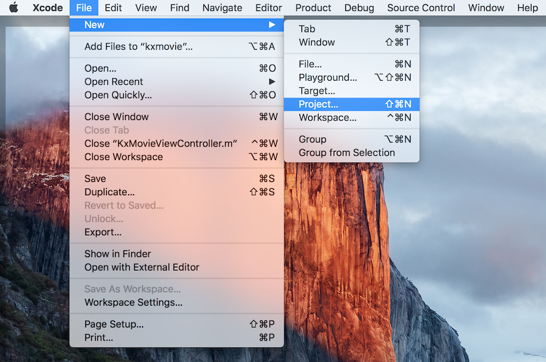

2）在弹出的对话框中，选择 `iOS -> Applicaiton -> Single View Application`，然后一路 Next 填写好项目信息即可。

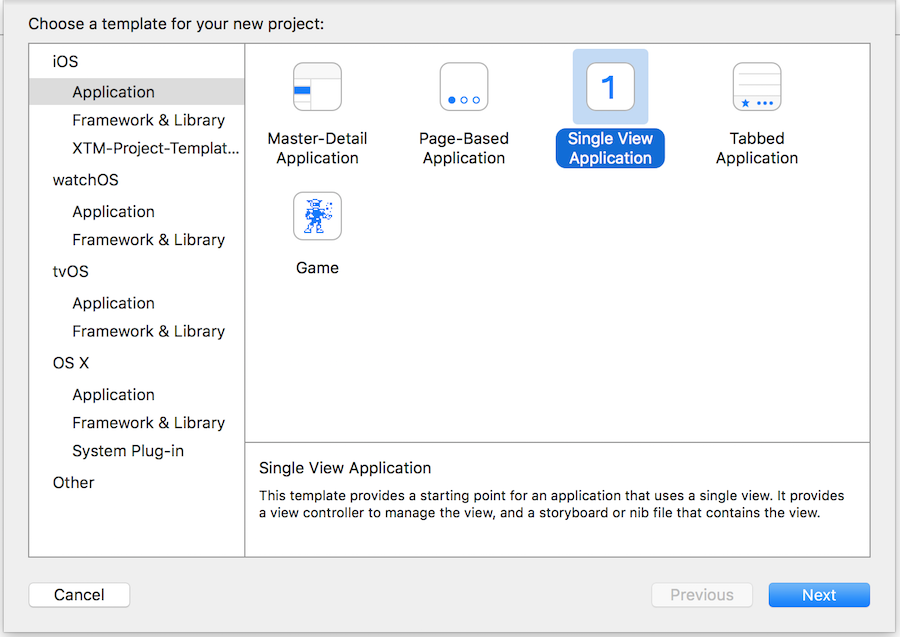

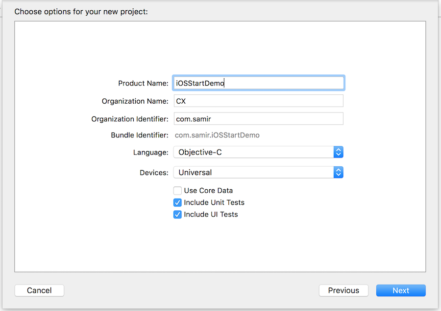

3）项目创建完成后，选择一下执行目标的模拟器或设备，就可以直接编译执行了，但这时候你运行起来的是一个空白的页面。

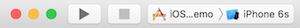

接下来，我们就开始在这个空白页面上动手做点东西。

### 2.2、添加一个交互事件

1）首先我们要做一件事：给自己的类名加前缀。这是用 Objective-C 做 iOS 开发时必须遵循的一个习惯。修改方式：在对应类的 `.h` 文件中选中类名 -> 鼠标右键 -> Refactor -> Rename。下面我们要给这个项目中的所有类加一个前缀 `ST`，表示 Start 的意思。

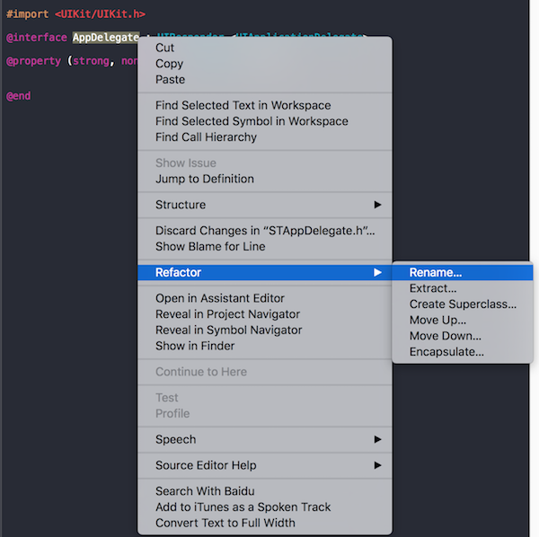

改完名后：

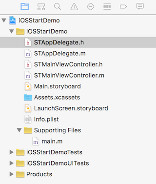

2）在应用程序的入口添加加载页面的代码。

修改 `STAppDelegate.m` 代码如下：

	#import "STAppDelegate.h"
	#import "STMainViewController.h"

	@interface STAppDelegate ()

	@end

	@implementation STAppDelegate

	#pragma mark - UIApplicationDelegate
	- (BOOL)application:(UIApplication *)application didFinishLaunchingWithOptions:(NSDictionary *)launchOptions {

	    // Override point for customization after application launch.
	    
	    // Init root view controller of the application.
	    STMainViewController *vc = [[STMainViewController alloc] init];
	    self.window.backgroundColor = [UIColor whiteColor];
	    self.window.rootViewController = vc;
	    [self.window makeKeyAndVisible];
	    
	    return YES;
	}

	@end

代码解释：在 app 启动的入口，创建一个 STMainViewController 实例，将它设置为 self.window 的 rootViewController。

3）在页面上添加按钮、对应的交互事件和响应事件。

修改 `STMainViewController.m` 代码如下：

	#import "STMainViewController.h"

	@interface STMainViewController ()

	@end

	@implementation STMainViewController

	#pragma mark - Lifecycle
	- (void)viewDidLoad {
	    [super viewDidLoad];
	    
	    // Do any additional setup after loading the view, typically from a nib.
	    
	    // Setup.
	    [self setupUI];
	}

	#pragma mark - Setup
	- (void)setupUI {
	    // Hello button.
	    UIButton *helloButton = [UIButton buttonWithType:UIButtonTypeSystem];
	    [helloButton setTitle:@"Hello" forState:UIControlStateNormal];
	    [helloButton addTarget:self action:@selector(onHelloButtonClicked:) forControlEvents:UIControlEventTouchUpInside];
	    [self.view addSubview:helloButton];
	    //// Layout with frame.
	    //[helloButton setFrame:CGRectMake(0, 0, 60, 40)];
	    //helloButton.center = self.view.center;
	    //// Layout with constraint.
	    helloButton.translatesAutoresizingMaskIntoConstraints = NO; // If you want to use Auto Layout to dynamically calculate the size and position of your view, you must set this property to NO.
	    [self.view addConstraints:@[
	        [NSLayoutConstraint constraintWithItem:helloButton attribute:NSLayoutAttributeWidth relatedBy:NSLayoutRelationEqual toItem:nil attribute:NSLayoutAttributeNotAnAttribute multiplier:1.0 constant:60.0],
	        [NSLayoutConstraint constraintWithItem:helloButton attribute:NSLayoutAttributeHeight relatedBy:NSLayoutRelationEqual toItem:nil attribute:NSLayoutAttributeNotAnAttribute multiplier:1.0 constant:40.0],
	        [NSLayoutConstraint constraintWithItem:helloButton attribute:NSLayoutAttributeCenterX relatedBy:NSLayoutRelationEqual toItem:self.view attribute:NSLayoutAttributeCenterX multiplier:1.0 constant:0],
	        [NSLayoutConstraint constraintWithItem:helloButton attribute:NSLayoutAttributeCenterY relatedBy:NSLayoutRelationEqual toItem:self.view attribute:NSLayoutAttributeCenterY multiplier:1.0 constant:0]
	    ]];
	}

	#pragma mark - Action
	- (void)onHelloButtonClicked:(id)sender {
	    NSLog(@"Hello, world!");

	    UIAlertController *alertController = [UIAlertController alertControllerWithTitle:@"Hello" message:@"Hello, world!" preferredStyle:UIAlertControllerStyleAlert];
	    UIAlertAction *cancelAction = [UIAlertAction actionWithTitle:@"Cancel" style:UIAlertActionStyleCancel handler:^(UIAlertAction *action) {
	        NSLog(@"Cancle Action");
	    }];
	    UIAlertAction *okAction = [UIAlertAction actionWithTitle:@"OK" style:UIAlertActionStyleDefault handler:^(UIAlertAction *action) {
	        NSLog(@"OK Action");
	    }];
	    [alertController addAction:cancelAction];
	    [alertController addAction:okAction];
	    [self presentViewController:alertController animated:YES completion:nil];
	}

	@end

代码解释：在 STMainViewController 页面加载完成的入口，给页面添加一个按钮和对应的事件响应方法。在按钮点击事件的响应方法中，使用 UIAlertController 弹出提示信息和相关的交互界面。

再运行程序，点击按钮你会看到这些页面：

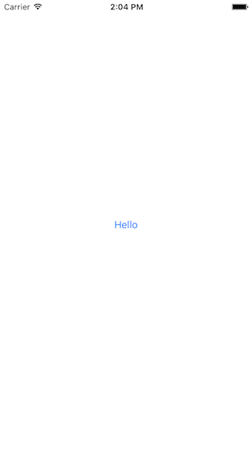

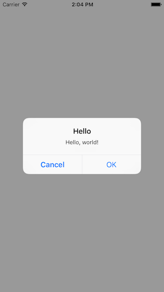

### Demo 

你可以按照下面的步骤获取这一节对应的 Demo 的代码：

	$ git clone https://github.com/samirchen/iOSStartDemo.git
	$ cd iOSStartDemo/iOSStartDemo
	$ git fetch origin s1
	$ git checkout s1
	$ open iOSStartDemo.xcodeproj

## 3、使用第三方库

代码复用是提高工程开发效率的重要方法，使用第三方库就是一种普遍的方式。在 iOS 开发中使用最广泛的管理第三方库的方案就是使用 CocoaPods。

### 3.1、安装 CocoaPods

1）安装 Ruby 环境。CocoaPods 是使用 Ruby 实现的，可以通过 gem 命令来安装，Mac OS X 中一般自带 Ruby 环境。接下来将默认的 RubyGems 替换为淘宝的 RubyGems 镜像，速度要快很多。

	sudo gem sources -a https://ruby.taobao.org/
	sudo gem sources -r https://rubygems.org/
	sudo gem sources -l

2）安装 CocoaPods。

	sudo gem update
	sudo gem install -n /usr/local/bin cocoapods -v 0.39
	pod setup
	pod --version

### 3.2、在当前项目中引入 CocoaPods 和第三方库

1）安装好 CocoaPods 后，接着我们前面讲的项目，在项目的根目录下创建一个名为 `Podfile` 的文件。

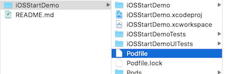

在文件中添加如下内容：

	source 'https://github.com/CocoaPods/Specs.git'

	platform :ios, "8.0"
	target "iOSStartDemo" do
		pod 'SVProgressHUD', '1.1.3'
		pod 'Masonry', '0.6.3'
	end

代码解释：我们通过 CocoaPods 引用了两个第三方库：`SVProgressHUD` 一个展示各种类型提示信息的库；`Masonry` 是一个封装了 Autolayout API 使得它们更易使用的库。

2）在 Terminal 命令行中进入项目的根目录（即上面创建的 Podfile 所在的目录）。执行下列命令来安装第三方库：

	$ pod install

如果成功执行，将会为你生成一个 `iOSStartDemo.xcworkspace` 文件。如果你在 Xcode 中已经打开了 iOSStartDemo 项目，那么先关闭它，然后双击 iOSStartDemo.xcworkspace 文件或者在命令行下执行：

	$ open iOSStartDemo.xcworkspace

即可用 Xcode 打开新的项目。

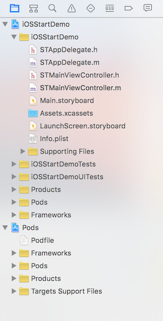

### 3.3、在代码中使用第三方库。

修改 `STMainViewController.m` 代码如下：

	#import "STMainViewController.h"
	#import <Masonry/Masonry.h>
	#import <SVProgressHUD/SVProgressHUD.h>

	@interface STMainViewController ()

	@end

	@implementation STMainViewController

	#pragma mark - Lifecycle
	- (void)viewDidLoad {
	    [super viewDidLoad];
	    
	    // Do any additional setup after loading the view, typically from a nib.
	    
	    // Setup.
	    [self setupUI];
	}

	#pragma mark - Setup
	- (void)setupUI {
	    // Hello button.
	    UIButton *helloButton = [UIButton buttonWithType:UIButtonTypeSystem];
	    [helloButton setTitle:@"Hello" forState:UIControlStateNormal];
	    [helloButton addTarget:self action:@selector(onHelloButtonClicked:) forControlEvents:UIControlEventTouchUpInside];
	    [self.view addSubview:helloButton];
	    [helloButton mas_makeConstraints:^(MASConstraintMaker *make) {
	        make.width.equalTo(@60.0);
	        make.height.equalTo(@40.0);
	        make.center.equalTo(self.view);
	    }];
	}

	#pragma mark - Action
	- (void)onHelloButtonClicked:(id)sender {
	    NSLog(@"Hello, world!");
	    
	    [SVProgressHUD showSuccessWithStatus:@"Hello, world!" maskType:SVProgressHUDMaskTypeBlack];
	}

	@end

代码解释：通过 `#import <Masonry/Masonry.h>` 和 `#import <SVProgressHUD/SVProgressHUD.h>` 引用第三方库。将 `helloButton` 的布局代码用 `Masonry` 重写；用 `SVProgressHUD` 替代 `UIAlertController` 展示信息。

修改后你看到的界面如下：

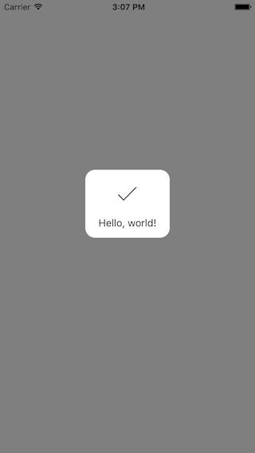

最后，我一直认为对于一门语言的初学者来说，了解该语言的标准编码风格是十分紧要的事情之一，这样可以使得你的代码与周围的环境和谐一致，也能便于你去了解这门语言的一些设计思想。如果你想要了解 Objective-C 的编码风格，你可以看看：[Objective-C 编码风格指南][3]。

### Demo

如果你还没有下载 iOSStartDemo，请先执行下列命令下载：

	$ git clone https://github.com/samirchen/iOSStartDemo.git
	$ cd iOSStartDemo/iOSStartDemo

如果已经下载过了，则接着进入正确的目录并执行下列命令：

	$ git fetch origin s2
	$ git checkout s2
	$ pod install
	$ open iOSStartDemo.xcworkspace

[SamirChen]: http://www.samirchen.com "SamirChen"
[1]: {{ page.url }} ({{ page.title }})
[2]: http://www.samirchen.com/ios-start-1
[3]: http://www.samirchen.com/objective-c-style-guide

