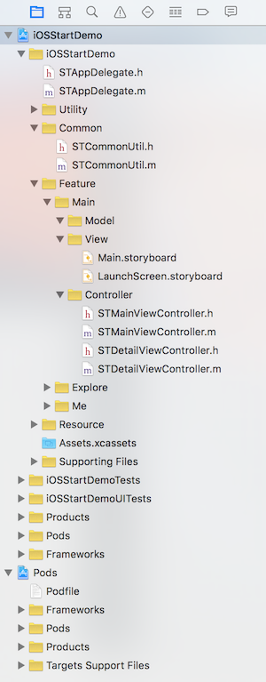
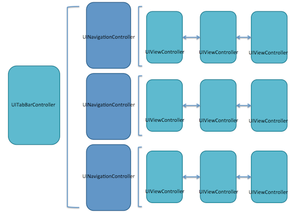
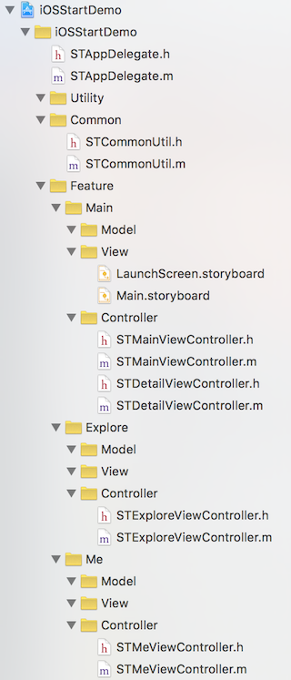
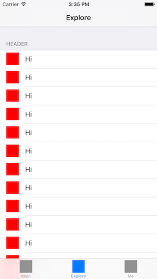

本文主要讲解基于 UITabBarController 和 UINavigationController 搭建一个多页面 App 项目。本文的内容只包含最基本的知识点。

目录：

- 1、项目目录结构调整
- 2、Tab 式 + Navigation 式的项目架构实现
- 3、使用 UITableView


## 1、项目目录结构调整

这一节，我们会基于 UITabBarController、UINavigationController 做一个多页面 App 项目。我们这里说的「页面」一般对应的是 UIViewController。

做一个项目时，建立一个清晰的目录结构，对于提高自己和其他合作伙伴的效率都是大有好处的。对于具体的目录结构，每个人都有自己的偏好，这里列出一种供参考：


```
|—MyProject
    |—Utility // 自己实现的一些通用性较好的功能代码，这些代码有比较好的接口且与本项目不存在耦合，可直接复用于其他项目。
    |—Common // 本项目的一些全局性代码，这些代码通常与本项目的业务逻辑存在一些耦合，所以不放在 Utility 目录中。
    |—Feature // 本项目的功能模块目录，该目录下将项目的功能划分为多个模块，每个模块穿透 MVC，可以作为独立任务划分出去。当然，在模块下你不采用 MVC，采用 MVVM 或其他架构方式也没问题的。
        |—Base // 定义本项目中各种 Controller、View、Model 的基础类或基础接口。
            |—Controller
            |—View
            |—Model
        |—Main // 示例 Feature 1。
            |—Controller
            |—View
            |—Model
        |—User // 示例 Feature 2。
            |—Controller
            |—View
            |—Model
    |—Resource // 本项目的资源目录，放置图片、音频等资料。
        |—Image
        |—Sound
|—Pods // 采用 CocoaPods 管理的第三方库。
```

那么对应到我们现在讲的这个项目中，我们调整后的项目目录结构大致如下：



你可以看看 [iOS 项目的目录结构][3]来了解更多。


## 2、Tab 式 + Navigation 式的项目架构实现

我们在实现一个多页面的 App 项目时，苹果官方提供的常用页面容器有 UITabBarController 和 UINavigationController。

UITabBarController 是通过**数组**的形式管理容器内的所有 UIViewController，UINavigationController 则是通过**栈**的形式管理容器内所有 UIViewController。这两种容器是可以嵌套使用的，标准嵌套的方式是以 UITabBarController 为主容器，而 UINavigationController 为辅助容器。大致结构如图：



下面，我们来看看代码：

1）在项目中添加新页面的代码：

- iOSStartDemo/Feature/Main/Controller/STDetailViewController.h(.m)
- iOSStartDemo/Feature/Explore/Controller/STExploreViewController.h(.m)
- iOSStartDemo/Feature/Me/Controller/STMeViewController.h(.m)

添加工具类代码：

- iOSStartDemo/Common/STCommonUtil.h(.m) 

大致结构如图：




2) 添加工具方法。

修改 `STCommonUtil.h` 代码如下：

	#import <Foundation/Foundation.h>
	#import <UIKit/UIKit.h>

	@interface STCommonUtil : NSObject

	#pragma mark - Image Util
	+ (UIImage *)imageWithColor:(UIColor *)color;
	+ (UIImage *)imageWithColor:(UIColor *)color size:(CGSize)size;

	@end


修改 `STCommonUtil.m` 代码如下：

	#import "STCommonUtil.h"

	@implementation STCommonUtil

	#pragma mark - Image Util
	+ (UIImage *)imageWithColor:(UIColor *)color {
	    return [STCommonUtil imageWithColor:color size:CGSizeMake(1.0, 1.0)];
	}

	+ (UIImage *)imageWithColor:(UIColor *)color size:(CGSize)size {
	    CGRect rect = CGRectMake(0.0f, 0.0f, size.width, size.height);
	    UIGraphicsBeginImageContext(rect.size);
	    CGContextRef context = UIGraphicsGetCurrentContext();
	    CGContextSetFillColorWithColor(context, [color CGColor]);
	    CGContextFillRect(context, rect);
	    UIImage *image = UIGraphicsGetImageFromCurrentImageContext();
	    UIGraphicsEndImageContext();
	    
	    return image;
	}

	@end


代码解释：添加了两个用代码生成图片的工具方法。


3) 在应用程序的入口构建项目的框架。

修改 `STAppDelegate.m` 代码如下：

	#import "STAppDelegate.h"
	#import "STMainViewController.h"
	#import "STExploreViewController.h"
	#import "STMeViewController.h"
	#import "STCommonUtil.h"

	@interface STAppDelegate ()

	@end

	@implementation STAppDelegate

	#pragma mark - UIApplicationDelegate
	- (BOOL)application:(UIApplication *)application didFinishLaunchingWithOptions:(NSDictionary *)launchOptions {
	    
	    // Override point for customization after application launch.
	    
	    // Init.
	    UIImage *tabImage = nil;
	    UIImage *tabImageHighlight = nil;
	    
	    //// Main.
	    STMainViewController *mainViewController = [[STMainViewController alloc] init];
	    mainViewController.title = @"Main";
	    tabImage = [[STCommonUtil imageWithColor:[UIColor redColor] size:CGSizeMake(30, 30)] imageWithRenderingMode:UIImageRenderingModeAlwaysTemplate];
	    tabImageHighlight = [[STCommonUtil imageWithColor:[UIColor grayColor] size:CGSizeMake(30, 30)] imageWithRenderingMode:UIImageRenderingModeAlwaysTemplate];
	    mainViewController.tabBarItem = [[UITabBarItem alloc] initWithTitle:mainViewController.title image:tabImage selectedImage:tabImageHighlight];
	    UINavigationController *mainNavigationController = [[UINavigationController alloc] initWithRootViewController:mainViewController];
	    
	    //// Explore.
	    STExploreViewController *exploreViewController = [[STExploreViewController alloc] init];
	    exploreViewController.title = @"Explore";
	    tabImage = [[STCommonUtil imageWithColor:[UIColor greenColor] size:CGSizeMake(30, 30)] imageWithRenderingMode:UIImageRenderingModeAlwaysTemplate];
	    tabImageHighlight = [[STCommonUtil imageWithColor:[UIColor grayColor] size:CGSizeMake(30, 30)] imageWithRenderingMode:UIImageRenderingModeAlwaysTemplate];
	    exploreViewController.tabBarItem = [[UITabBarItem alloc] initWithTitle:exploreViewController.title image:tabImage selectedImage:tabImageHighlight];
	    UINavigationController *exploreNavigationController = [[UINavigationController alloc] initWithRootViewController:exploreViewController];
	    
	    //// Me.
	    STMeViewController *meViewController = [[STMeViewController alloc] init];
	    meViewController.title = @"Me";
	    tabImage = [[STCommonUtil imageWithColor:[UIColor blueColor] size:CGSizeMake(30, 30)] imageWithRenderingMode:UIImageRenderingModeAlwaysTemplate];
	    tabImageHighlight = [[STCommonUtil imageWithColor:[UIColor grayColor] size:CGSizeMake(30, 30)] imageWithRenderingMode:UIImageRenderingModeAlwaysTemplate];
	    meViewController.tabBarItem = [[UITabBarItem alloc] initWithTitle:meViewController.title image:tabImage selectedImage:tabImageHighlight];
	    UINavigationController *meNavigationController = [[UINavigationController alloc] initWithRootViewController:meViewController];
	    
	    //// Main tab bar controller.
	    UITabBarController *mainTabBarController = [[UITabBarController alloc] init];
	    mainTabBarController.viewControllers = @[mainNavigationController, exploreNavigationController, meNavigationController];
	    
	    self.window.backgroundColor = [UIColor whiteColor];
	    self.window.rootViewController = mainTabBarController;
	    [self.window makeKeyAndVisible];
	    
	    return YES;
	}

	@end


代码解释：在上面的代码中，我们构建了这个 App 的基本页面框架。以 UITabBarController 为主容器，并为其添加了 3 个 UINavigationController 子容器，初始化了每个 UINavigationController 的初始的 UIViewController，每个子容器独立管理其栈内的页面流。


4）使用 UINavigationController 来管理页面跳转。

修改 `STMainViewController.m` 代码如下：

	#import "STMainViewController.h"
	#import <Masonry/Masonry.h>
	#import <SVProgressHUD/SVProgressHUD.h>
	#import "STDetailViewController.h"

	@interface STMainViewController ()

	@end

	@implementation STMainViewController

	#pragma mark - Lifecycle
	- (void)viewDidLoad {
	    [super viewDidLoad];
	    
	    // Do any additional setup after loading the view, typically from a nib.
	    
	    // Setup.
	    [self setupUI];
	}

	#pragma mark - Setup
	- (void)setupUI {
	    // Use full screen layout.
	    self.edgesForExtendedLayout = UIRectEdgeAll;
	    self.automaticallyAdjustsScrollViewInsets = YES;
	    self.extendedLayoutIncludesOpaqueBars = YES;
	    
	    // Navigation item.
	    UIBarButtonItem *detailBarButton = [[UIBarButtonItem alloc] initWithTitle:@"Detail" style:UIBarButtonItemStylePlain target:self action:@selector(goToDetailPage)];
	    self.navigationItem.rightBarButtonItem = detailBarButton;
	    
	    // Hello button.
	    UIButton *helloButton = [UIButton buttonWithType:UIButtonTypeSystem];
	    [helloButton setTitle:@"Hello" forState:UIControlStateNormal];
	    [helloButton addTarget:self action:@selector(onHelloButtonClicked:) forControlEvents:UIControlEventTouchUpInside];
	    [self.view addSubview:helloButton];
	    [helloButton mas_makeConstraints:^(MASConstraintMaker *make) {
	        make.width.equalTo(@60.0);
	        make.height.equalTo(@40.0);
	        make.center.equalTo(self.view);
	    }];
	}

	#pragma mark - Navigation
	- (void)goToDetailPage {
	    STDetailViewController *detailViewController = [[STDetailViewController alloc] init];
	    detailViewController.hidesBottomBarWhenPushed = YES;
	    [self.navigationController pushViewController:detailViewController animated:YES];
	}

	#pragma mark - Action
	- (void)onHelloButtonClicked:(id)sender {
	    NSLog(@"Hello, world!");
	    
	    [SVProgressHUD showSuccessWithStatus:@"Hello, world!" maskType:SVProgressHUDMaskTypeBlack];
	}

	@end


修改 `STDetailViewController.m` 代码如下：

	#import "STDetailViewController.h"

	@interface STDetailViewController ()

	@end

	@implementation STDetailViewController

	#pragma mark - Lifecycle
	- (void)viewDidLoad {
	    [super viewDidLoad];
	    
	    // Setup.
	    [self setupUI];
	}

	#pragma mark - Setup
	- (void)setupUI {
	    // Use full screen layout.
	    self.edgesForExtendedLayout = UIRectEdgeAll;
	    self.automaticallyAdjustsScrollViewInsets = YES;
	    self.extendedLayoutIncludesOpaqueBars = YES;
	    self.view.backgroundColor = [UIColor whiteColor];
	    
	    // Title.
	    self.title = @"Detail";
	}

	@end


代码解释：在 STMainViewController 的 `setupUI` 方法中，我们添加了 detailBarButton，通过这个点击这个按钮，我们可以跳转到一个 STDetailViewController 页面，跳转的代码实现就在 `goToDetailPage` 方法中。


## 3、使用 UITableView

UITableView 是 iOS 开发中最常使用的数据展示控件之一，它体现了大多数 Cocoa UI 组件的设计思路，也是我们封装自定义组件时的重要参考模板。


我们在 Explore 页面中添加 UITableView 来做一些基础内容展示，修改 `STExploreViewController.m` 文件代码如下：


	#import "STExploreViewController.h"
	#import "STCommonUtil.h"
	#import <Masonry/Masonry.h>

	NSString * const STExploreCellIdentifier = @"STExploreCellIdentifier";

	@interface STExploreViewController () <UITableViewDataSource, UITableViewDelegate>

	@property (strong, nonatomic) UITableView *myTableView;
	
	@end

	@implementation STExploreViewController

	#pragma mark - Property
	- (UITableView *)myTableView {
	    if (!_myTableView) {
	        _myTableView = [[UITableView alloc] initWithFrame:self.view.bounds style:UITableViewStyleGrouped];
	        [_myTableView registerClass:[UITableViewCell class] forCellReuseIdentifier:STExploreCellIdentifier];
	        _myTableView.delegate = self;
	        _myTableView.dataSource = self;
	    }
	    
	    return _myTableView;
	}

	#pragma mark - Lifecycle
	- (void)viewDidLoad {
	    [super viewDidLoad];
	    
	    // Setup.
	    [self setupUI];
	}

	#pragma mark - Setup
	- (void)setupUI {
	    // Use full screen layout.
	    self.edgesForExtendedLayout = UIRectEdgeAll;
	    self.automaticallyAdjustsScrollViewInsets = YES;
	    self.extendedLayoutIncludesOpaqueBars = YES;
	    
	    // myTableView.
	    [self.view addSubview:self.myTableView];
	    [self.myTableView mas_makeConstraints:^(MASConstraintMaker *make) {
	        make.edges.equalTo(self.view);
	    }];
	}

	#pragma mark - UITableViewDelegate
	- (void)tableView:(UITableView *)tableView didSelectRowAtIndexPath:(NSIndexPath *)indexPath {
	    [tableView deselectRowAtIndexPath:indexPath animated:YES];
	}

	- (CGFloat)tableView:(UITableView *)tableView heightForRowAtIndexPath:(NSIndexPath *)indexPath {
	    return 44;
	}

	#pragma mark - UITableViewDataSource
	- (NSInteger)numberOfSectionsInTableView:(UITableView *)tableView {
	    return 1;
	}

	- (NSString *) tableView:(UITableView *)tableView titleForHeaderInSection:(NSInteger)section {
	    return @"Header";
	}

	- (NSInteger)tableView:(UITableView *)tableView numberOfRowsInSection:(NSInteger)section {
	    return 1000;
	}

	- (UITableViewCell *)tableView:(UITableView *)tableView cellForRowAtIndexPath:(NSIndexPath *)indexPath {
	    UITableViewCell *cell = [tableView dequeueReusableCellWithIdentifier:STExploreCellIdentifier forIndexPath:indexPath];
	    cell.textLabel.text = @"Hi";
	    cell.imageView.image = [STCommonUtil imageWithColor:[UIColor redColor] size:CGSizeMake(30, 30)];
	    cell.layer.shouldRasterize = YES;
	    cell.layer.rasterizationScale = [[UIScreen mainScreen] scale];
	    
	    return cell;
	}

	@end


代码解释：我们在 STExploreViewController 中添加了一个 UITableView 作为 subview 来展示数据。UITableView 作为一个封装良好的组件，是通过 Delegate 的方式把它的数据和交互接口暴露给外部。所以在代码中，我们可以看到：

- STExploreViewController 实现了 UITableViewDataSource 和 UITableViewDelegate 接口。

代码：

	@interface STExploreViewController () <UITableViewDataSource, UITableViewDelegate>

- myTableView 设置了自己的 delegate 和 datasource 为 self(表示当前的 STExploreViewController 实例)。

代码：

    _myTableView.delegate = self;
    _myTableView.dataSource = self;


- STExploreViewController 中实现了 UITableViewDataSource 和 UITableViewDelegate 接口一系列的方法。

代码：

	- (void)tableView:(UITableView *)tableView didSelectRowAtIndexPath:(NSIndexPath *)indexPath{...}
	- (NSInteger)numberOfSectionsInTableView:(UITableView *)tableView{...}
	...


运行项目你应该能看到下面的界面：



## Demo

你可以接着前面继续下面的步骤来获取这一节对应的 Demo 代码：

如果你还没有下载 iOSStartDemo，请先执行下列命令下载：

	$ git clone https://github.com/samirchen/iOSStartDemo.git
	$ cd iOSStartDemo/iOSStartDemo

如果已经下载过了，则接着进入正确的目录并执行下列命令：

	$ git fetch origin s3
	$ git checkout s3
	$ pod install
	$ open iOSStartDemo.xcworkspace


[SamirChen]: http://www.samirchen.com "SamirChen"
[1]: {{ page.url }} ({{ page.title }})
[2]: http://www.samirchen.com/ios-start-3
[3]: http://www.samirchen.com/ios-project-structure
