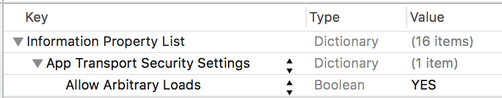
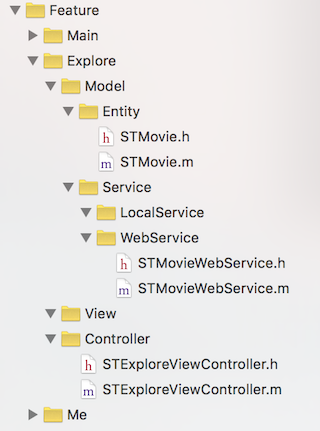
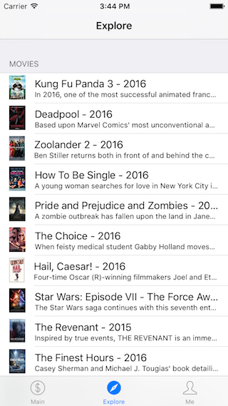

本文主要讲解如何使用 [AFNetworking][3] 从网络请求数据并在相应的页面进行展示，同时还引用了 [SDWebImage][4] 库来实现图片异步加载和图片缓存。本文的内容只包含最基本的知识点。

目录：

- 1、修改 App Transport Security 策略
- 2、引用 AFNetworking 库和 SDWebImage 库
- 3、实现网络数据请求和展示
	- 3.1、添加 Model/Entity 层代码
	- 3.2、添加 Model/Service/WebService 层代码
	- 3.3、完成 Controller 层代码逻辑

## 1、修改 App Transport Security 策略

iOS 9 中新增了 App Transport Security 特性, 主要影响是使得原来请求网络数据时用到的 HTTP 协议都必须换成 HTTPS 协议。

但是实际情况中，我们的数据服务可能还并未升级到 HTTPS，所以这时候我们需要对项目进行一些设置来允许 HTTP 数据请求，也就是修改 App Transport Security 策略。步骤是：

在项目的 `Info.plist` 文件中添加如下字段：

对应的字段如下：

	<key>NSAppTransportSecurity</key>
	<dict>
	    <key>NSAllowsArbitraryLoads</key>
	    <true/>
	</dict>

## 2、引用 AFNetworking 库和 SDWebImage 库

修改 `Podfile` 如下来增加对 AFNetworking 库和 SDWebImage 库的引用：

	source 'https://github.com/CocoaPods/Specs.git'

	platform :ios, "8.0"
	target "iOSStartDemo" do
	    pod 'SVProgressHUD', '1.1.3'
	    pod 'Masonry', '0.6.3'
	    pod 'AFNetworking', '3.0.4'
	    pod 'SDWebImage', '3.7.5'
	end

然后在项目目录下执行下列命令来安装新增的库：

	$ pod install

代码解释：`AFNetworking` 是一个帮助我们更方便的完成网络请求相关功能的库。`SDWebImage` 是一个帮助我们完成图片异步加载、图片缓存等功能的库。

## 3、实现网络数据请求和展示

现在我们的需求是在 Explore 页面从网络请求一个电影数据列表，展示电影信息和电影海报图片。

Explore 模块相关的代码如下：

### 3.1、添加 Model/Entity 层代码

`STMovie.h` 代码如下：

	#import <Foundation/Foundation.h>

	@interface STMovie : NSObject

	@property (assign, nonatomic) int64_t rowid;
	@property (copy, nonatomic) NSString *name;
	@property (copy, nonatomic) NSString *year;
	@property (copy, nonatomic) NSString *synopsis;
	@property (copy, nonatomic) NSString *thumbnailImageURLString;

	@end

代码解释：STMovie 是一个实体类，里面主要封装了一些实体相关的属性。`STMovie.m` 并没有添加什么代码。

### 3.2、添加 Model/Service/WebService 层代码

`STMovieWebService.h` 代码如下：

	#import <Foundation/Foundation.h>
	#import "STMovie.h"

	@interface STMovieWebService : NSObject

	#pragma mark - Movie Data WebService
	+ (void)requestMovieDataWithParameters:(id)parameters start:(void (^)(void))start success:(void (^)(NSDictionary *result))success failure:(void (^)(NSError *error))failure;

	@end

`STMovieWebService.m` 代码如下：

	#import "STMovieWebService.h"
	#import <AFNetworking/AFNetworking.h>

	static NSString * const STRequestMovieDataURL = @"http://api.rottentomatoes.com/api/public/v1.0/lists/movies/in_theaters.json?apikey=7waqfqbprs7pajbz28mqf6vz&page_limit=%@&page=%@";

	@implementation STMovieWebService

	#pragma mark - Movie Data WebService
	+ (void)requestMovieDataWithParameters:(id)parameters start:(void (^)(void))start success:(void (^)(NSDictionary *result))success failure:(void (^)(NSError *error))failure {
	    start();
	    // Start.
	    start();
	    
	    NSURLSessionConfiguration *configuration = [NSURLSessionConfiguration defaultSessionConfiguration];
	    AFURLSessionManager *manager = [[AFURLSessionManager alloc] initWithSessionConfiguration:configuration];
	    
	    NSString *pageLimit = [NSString stringWithFormat:@"%d", (int32_t) [parameters[@"pageLimit"] intValue]];
	    NSString *pageNum = [NSString stringWithFormat:@"%d", (int32_t) [parameters[@"pageNum"] intValue]];
	    NSString *URLString = [NSString stringWithFormat:STRequestMovieDataURL, pageLimit, pageNum];
	    NSURL *URL = [NSURL URLWithString:URLString];
	    NSURLRequest *request = [NSURLRequest requestWithURL:URL];
	    
	    NSURLSessionDataTask *dataTask = [manager dataTaskWithRequest:request completionHandler:^(NSURLResponse *response, id responseObject, NSError *error) {
	        if (error) {
	            //NSLog(@"Error: %@", error);
	            failure(error);
	        } else {
	            //NSLog(@"%@ %@", response, responseObject);
	            NSArray *movieList = [STMovieWebService parseMovieListFromData:responseObject];
	            NSDictionary *result = @{@"movieList" : movieList};
	            success(result);
	        }
	    }];
	    [dataTask resume];
	}

	#pragma mark - Utility
	+ (NSArray *)parseMovieListFromData:(NSDictionary *)data {
	    if (!data) {
	        return nil;
	    }
	    
	    NSMutableArray *movieList = [[NSMutableArray alloc] init];
	    
	    NSArray *movieDataList = [data objectForKey:@"movies"];
	    for (int32_t i = 0; i < movieDataList.count; i++) {
	        STMovie *movie = [[STMovie alloc] init];

	        NSDictionary *movieData = movieDataList[i];
            movie.rowid = [[movieData objectForKey:@"id"] longLongValue];
	        movie.name = [movieData objectForKey:@"title"];
	        movie.year = [movieData objectForKey:@"year"];
	        movie.synopsis = [movieData objectForKey:@"synopsis"];
	        NSDictionary *postersData = [movieData objectForKey:@"posters"];
	        if (postersData) {
	            movie.thumbnailImageURLString = [postersData objectForKey:@"thumbnail"];
	        } else {
	            movie.thumbnailImageURLString = nil;
	        }
	        
	        [movieList addObject:movie];
	    }
	    
	    return [movieList copy];
	}

	@end

代码解释：`STMovieWebService` 类主要完成从网络请求数据并处理为实体类对象的相关逻辑，这里用到了 AFNetworking 库来简化网络数据处理的代码。

### 3.3、完成 Controller 层代码逻辑

`STExploreViewController.m` 代码如下：

	#import "STExploreViewController.h"
	#import "STCommonUtil.h"
	#import <SVProgressHUD/SVProgressHUD.h>
	#import <Masonry/Masonry.h>
	#import <SDWebImage/UIImageView+WebCache.h>
	#import "STMovieWebService.h"

	static NSString * const STExploreCellIdentifier = @"STExploreCellIdentifier";

	@interface STExploreViewController () <UITableViewDataSource, UITableViewDelegate>

	@property (strong, nonatomic) UITableView *myTableView;
	@property (strong, nonatomic) NSArray *movieList;

	@end

	@implementation STExploreViewController

	#pragma mark - Property
	- (UITableView *)myTableView {
	    if (!_myTableView) {
	        _myTableView = [[UITableView alloc] initWithFrame:self.view.bounds style:UITableViewStyleGrouped];
	        _myTableView.delegate = self;
	        _myTableView.dataSource = self;
	    }
	    
	    return _myTableView;
	}

	#pragma mark - Lifecycle
	- (void)viewDidLoad {
	    [super viewDidLoad];
	    
	    // Setup.
	    [self setupUI];
	    
	    // Load data.
	    [self requestData];
	}

	#pragma mark - Setup
	- (void)setupUI {
	    // Use full screen layout.
	    self.edgesForExtendedLayout = UIRectEdgeAll;
	    self.automaticallyAdjustsScrollViewInsets = YES;
	    self.extendedLayoutIncludesOpaqueBars = YES;
	    
	    // myTableView.
	    [self.view addSubview:self.myTableView];
	    [self.myTableView mas_makeConstraints:^(MASConstraintMaker *make) {
	        make.edges.equalTo(self.view);
	    }];
	}

	#pragma mark - Utility
	- (void)requestData {
	    NSDictionary *parameters = @{@"pageLimit" : @30, @"pageNum" : @1};
	    [STMovieWebService requestMovieDataWithParameters:parameters start:^{
	        [SVProgressHUD show];
	    } success:^(NSDictionary *result) {
	        self.movieList = [result objectForKey:@"movieList"];
	        [self.myTableView reloadData];
	        [SVProgressHUD dismiss];
	    } failure:^(NSError *error) {
	        [SVProgressHUD dismiss];
	    }];
	}

	#pragma mark - UITableViewDelegate
	- (void)tableView:(UITableView *)tableView didSelectRowAtIndexPath:(NSIndexPath *)indexPath {
	    [tableView deselectRowAtIndexPath:indexPath animated:YES];
	}

	- (CGFloat)tableView:(UITableView *)tableView heightForRowAtIndexPath:(NSIndexPath *)indexPath {
	    return 50;
	}

	#pragma mark - UITableViewDataSource
	- (NSInteger)numberOfSectionsInTableView:(UITableView *)tableView {
	    return 1;
	}

	- (NSString *) tableView:(UITableView *)tableView titleForHeaderInSection:(NSInteger)section {
	    return @"Movies";
	}

	- (NSInteger)tableView:(UITableView *)tableView numberOfRowsInSection:(NSInteger)section {
	    return self.movieList.count;
	}

	- (UITableViewCell *)tableView:(UITableView *)tableView cellForRowAtIndexPath:(NSIndexPath *)indexPath {
	    if (indexPath.row >= self.movieList.count) {
	        return nil;
	    }
	    
	    UITableViewCell *cell = [tableView dequeueReusableCellWithIdentifier:STExploreCellIdentifier];
	    if (!cell) {
	        cell = [[UITableViewCell alloc] initWithStyle:UITableViewCellStyleSubtitle reuseIdentifier:STExploreCellIdentifier];
	    }
	    
	    STMovie *movie = [self.movieList objectAtIndex:indexPath.row];
	    
	    cell.textLabel.text = [NSString stringWithFormat:@"%@ - %@", movie.name, movie.year];
	    cell.detailTextLabel.text = movie.synopsis;
	    [cell.imageView sd_setImageWithURL:[NSURL URLWithString:movie.thumbnailImageURLString] placeholderImage:[STCommonUtil imageWithColor:[UIColor grayColor] size:CGSizeMake(27, 40)] completed:nil];
	    cell.layer.shouldRasterize = YES;
	    cell.layer.rasterizationScale = [[UIScreen mainScreen] scale];
	    
	    return cell;
	}

	@end

代码解释：上面的代码主要是在 STExploreViewController 页面第一次加载时调用 STMovieWebService 提供的接口从网络请求数据，请求成功后，获取处理好的一组 STMovie 对象并通过 UITableView 的形式展示出来。展示图片时，使用了 SDWebImage 库来实现异步加载图片的功能。

运行项目你应该能看到下面的界面：

## Demo

你可以接着前面的教程继续下面的步骤来获取这一节对应的 Demo 代码：

如果你还没有下载 iOSStartDemo，请先执行下列命令下载：

	$ git clone https://github.com/samirchen/iOSStartDemo.git
	$ cd iOSStartDemo/iOSStartDemo

如果已经下载过了，则直接进入正确的目录并执行下列命令：

	$ git fetch origin s4
	$ git checkout s4
	$ pod install
	$ open iOSStartDemo.xcworkspace

[SamirChen]: http://www.samirchen.com "SamirChen"
[1]: {{ page.url }} ({{ page.title }})
[2]: http://www.samirchen.com/ios-start-4
[3]: https://github.com/AFNetworking/AFNetworking
[4]: https://github.com/rs/SDWebImage
