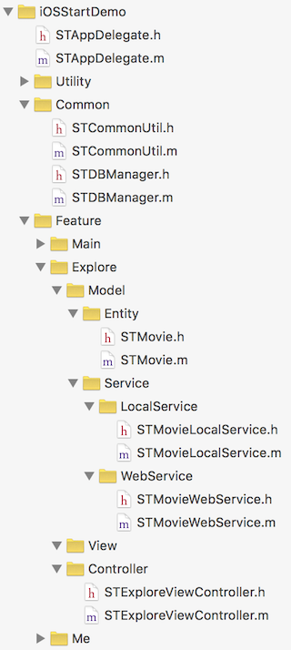
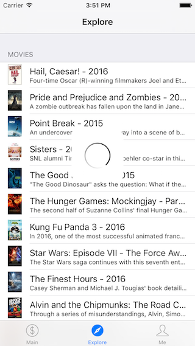

本文主要讲解如何使用 SQLite + FMDB 来存储数据到本地数据库。本文的内容只包含最基本的知识点。

## 教程

目录：

- 1、引用 FMDB 库
- 2、使用 SQLite 数据库来存储本地数据
	- 2.1、实现数据库管理代码 STDBManager
	- 2.2、实现 Model/Entity 层代码
	- 2.2、实现 Model/Service/LocalService 层代码
	- 2.3、完成 Controller 层代码逻辑

### 1、引用 FMDB 库

修改 `Podfile` 如下来增加对 FMDB 库的引用：

	source 'https://github.com/CocoaPods/Specs.git'

	platform :ios, "8.0"
	target "iOSStartDemo" do
	    pod 'SVProgressHUD', '1.1.3'
	    pod 'Masonry', '0.6.3'
	    pod 'AFNetworking', '3.0.4'
	    pod 'SDWebImage', '3.7.5'
	    pod 'FMDB', '2.6'
	end

然后在项目目录下执行下列命令来安装新增的库：

	$ pod install

代码解释：`FMDB` 是一个帮助我们更方便的使用 SQLite 数据库的库。

### 2、使用 SQLite 数据库来存储本地数据

在上一节教程中，我们实现了从网络请求数据。在这一节中，我们的需求是每次从网络请求数据成功后，将本次请求到的数据存储到本地数据库，并清理掉上一次存储的数据。在每次加载页面时，首先从本地数据库加载数据进行展示，再从网络请求数据对页面进行刷新。

在项目中添加新代码文件：

- iOSStartDemo/Common/STDBManager.h(.m)
- iOSStartDemo/Feature/Explore/Model/Service/LocalService/STMovieLocalService.h(.m)

项目代码如下：

#### 2.1、实现数据库管理代码 STDBManager

`STDBManager.h` 代码如下：

	#import <Foundation/Foundation.h>

	@interface STDBManager : NSObject

	@property (strong, readonly, nonatomic) NSString *dbFilePath;

	+ (instancetype)sharedInstance;
	- (void)setupDB;

	@end

`STDBManager.m` 代码如下：

	#import "STDBManager.h"
	#import <FMDB/FMDB.h>

	static NSString * const STDBFileName = @"stdb.sqlite";

	@interface STDBManager ()

	@property (strong, readwrite, nonatomic) NSString *dbFilePath;

	@end

	@implementation STDBManager

	#pragma mark - Property
	- (NSString *)dbFilePath {
	    if (!_dbFilePath) {
	        NSArray *searchPaths = NSSearchPathForDirectoriesInDomains(NSDocumentDirectory, NSUserDomainMask, YES);
	        NSString *documentFolderPath = searchPaths[0];
	        _dbFilePath = [documentFolderPath stringByAppendingPathComponent:STDBFileName];
	    }
	    
	    return _dbFilePath;
	}

	#pragma mark - Lifecycle
	+ (instancetype)sharedInstance {
	    static STDBManager *sharedInstance = nil;
	    static dispatch_once_t onceToken;
	    dispatch_once(&onceToken, ^{
	        sharedInstance = [[self alloc] init];
	    });
	    
	    return sharedInstance;
	}

	#pragma mark - Utility
	- (void)setupDB {
	    if ([self isDBFileExist]) {
	        return;
	    }
	    
	    BOOL isSuccess = [self copyDBFileFromMainBundle];
	    if (isSuccess) {
	        return;
	    }
	    
	    if ([self createDB]) {
	        [self updateDB];
	    }
	}

	- (BOOL)isDBFileExist {
	    return [[NSFileManager defaultManager] fileExistsAtPath:self.dbFilePath];
	}

	- (BOOL)copyDBFileFromMainBundle {
	    BOOL result = NO;
	    
	    // Not find db file, need to copy backup db file.
	    NSString *backupDBPath = [[NSBundle mainBundle] pathForResource:@"stdb" ofType:@"sqlite"];
	    if (!backupDBPath) {
	        // Not find backup db file.
	        result = NO;
	    } else {
	        BOOL isSuccess = [[NSFileManager defaultManager] copyItemAtPath:backupDBPath toPath:self.dbFilePath error:nil];
	        if (!isSuccess) {
	            // Copy backup db file failed.
	            result = NO;
	        } else {
	            result = YES;
	        }
	    }
	    
	    return result;
	}

	- (BOOL)createDB {
	    if ([FMDatabase databaseWithPath:self.dbFilePath]) {
	        return YES;
	    }
	    
	    return NO;
	}

	- (void)updateDB {
	    FMDatabaseQueue *dbQ = [FMDatabaseQueue databaseQueueWithPath:self.dbFilePath];
	    [dbQ inTransaction:^(FMDatabase *db, BOOL *rollback) {
	        [db executeUpdate:[NSString stringWithFormat:@"Create Table If Not Exists st_movie (rowid integer primary key not null, name text, year text, synopsis text, thumbnail_url text)"]];
	    }];
	}

	@end

代码解释：STDBManager 主要是提供对本地数据库文件的管理功能，包括：创建数据库文件、初始化数据库表结构等等。

#### 2.2、实现 Model/Entity 层代码

这里我们复用上一节教程中的 `STMovie` 类。

#### 2.2、实现 Model/Service/LocalService 层代码

`STMovieLocalService.h` 代码如下：

	#import <Foundation/Foundation.h>
	#import "STMovie.h"

	@interface STMovieLocalService : NSObject

	#pragma mark - STMovieLocalService
	+ (NSArray *)getAllMovies;
	+ (int64_t)addOrUpdateMovie:(STMovie *)movie;
	+ (BOOL)removeAllMovies;

	@end

`STMovieLocalService.m` 代码如下：

	#import "STMovieLocalService.h"
	#import <FMDB/FMDB.h>
	#import "STDBManager.h"

	@implementation STMovieLocalService

	#pragma mark - STMovieLocalService
	+ (NSArray *)getAllMovies {
	    NSMutableArray * __block objs = [[NSMutableArray alloc] init];
	    
	    NSString *sql = @"Select * From st_movie";
	    FMDatabaseQueue *dbQ = [FMDatabaseQueue databaseQueueWithPath:[STDBManager sharedInstance].dbFilePath];
	    [dbQ inDatabase:^(FMDatabase *db) {
	        FMResultSet *resultSet = [db executeQuery:sql];
	        while ([resultSet next]) {
	            [objs addObject:[STMovieLocalService getObjectFromResultSet:resultSet]];
	        }
	        [resultSet close];
	    }];
	    
	    return [objs copy];
	}

	+ (int64_t)addOrUpdateMovie:(STMovie *)movie {
	    int64_t __block result = -1;
	    
	    NSString *sql = [NSString stringWithFormat:@"Replace Into st_movie (rowid, name, year, synopsis, thumbnail_url) Values (?, ?, ?, ?, ?)"];
	    FMDatabaseQueue *dbQ = [FMDatabaseQueue databaseQueueWithPath:[STDBManager sharedInstance].dbFilePath];
	    [dbQ inDatabase:^(FMDatabase *db) {
	        if ([db executeUpdate:sql, [NSNumber numberWithLongLong:movie.rowid], movie.name, movie.year, movie.synopsis, movie.thumbnailImageURLString]) {
	            result = (int64_t) [db lastInsertRowId];
	        }
	    }];
	    
	    return result;
	}

	+ (BOOL)removeAllMovies {
	    BOOL __block result = NO;
	    
	    NSString *sql = @"Delete From st_movie";
	    FMDatabaseQueue *dbQ = [FMDatabaseQueue databaseQueueWithPath:[STDBManager sharedInstance].dbFilePath];
	    [dbQ inDatabase:^(FMDatabase *db) {
	        result = [db executeUpdate:sql];
	    }];
	    
	    return result;
	}

	#pragma mark - Utility
	+ (STMovie *)getObjectFromResultSet:(FMResultSet *)resultSet {
	    STMovie *movie = [[STMovie alloc] init];
	    
	    movie.rowid = [resultSet longLongIntForColumn:@"rowid"];
	    movie.name = [resultSet stringForColumn:@"name"];
	    movie.year = [resultSet stringForColumn:@"year"];
	    movie.synopsis = [resultSet stringForColumn:@"synopsis"];
	    movie.thumbnailImageURLString = [resultSet stringForColumn:@"thumbnail_url"];
	    
	    return movie;
	}

	@end

代码解释：这里主要封装了对本地数据库的 `st_movie` 表的数据进行增删查改的相关接口。

#### 2.3、完成 Controller 层代码逻辑

修改 `STExploreViewController.m` 代码如下：

	#import "STExploreViewController.h"
	#import "STCommonUtil.h"
	#import <SVProgressHUD/SVProgressHUD.h>
	#import <Masonry/Masonry.h>
	#import <SDWebImage/UIImageView+WebCache.h>
	#import "STMovieWebService.h"
	#import "STDBManager.h"
	#import "STMovieLocalService.h"

	static NSString * const STExploreCellIdentifier = @"STExploreCellIdentifier";

	@interface STExploreViewController () <UITableViewDataSource, UITableViewDelegate>

	@property (strong, nonatomic) UITableView *myTableView;
	@property (strong, nonatomic) NSArray *movieList;

	@end

	@implementation STExploreViewController

	#pragma mark - Property
	- (UITableView *)myTableView {
	    if (!_myTableView) {
	        _myTableView = [[UITableView alloc] initWithFrame:self.view.bounds style:UITableViewStyleGrouped];
	        _myTableView.delegate = self;
	        _myTableView.dataSource = self;
	    }
	    
	    return _myTableView;
	}

	#pragma mark - Lifecycle
	- (void)viewDidLoad {
	    [super viewDidLoad];
	    
	    // Setup.
	    [[STDBManager sharedInstance] setupDB];
	    [self setupUI];
	    
	    // Load data.
	    [self requestData];
	}

	#pragma mark - Setup
	- (void)setupUI {
	    // Use full screen layout.
	    self.edgesForExtendedLayout = UIRectEdgeAll;
	    self.automaticallyAdjustsScrollViewInsets = YES;
	    self.extendedLayoutIncludesOpaqueBars = YES;
	    
	    // myTableView.
	    [self.view addSubview:self.myTableView];
	    [self.myTableView mas_makeConstraints:^(MASConstraintMaker *make) {
	        make.edges.equalTo(self.view);
	    }];
	}

	#pragma mark - Utility
	- (void)requestData {
	    // Load data from local db.
	    self.movieList = [STMovieLocalService getAllMovies];
	    if (self.movieList.count > 0) {
	        [self.myTableView reloadData];
	    }
	    
	    // Load new data from server and update local db data.
	    NSDictionary *parameters = @{@"pageLimit" : @30, @"pageNum" : @1};
	    [STMovieWebService requestMovieDataWithParameters:parameters start:^{
	        [SVProgressHUD show];
	    } success:^(NSDictionary *result) {
	        NSArray *newMovieList = [result objectForKey:@"movieList"];

	        // Update local db data.
	        [STMovieLocalService removeAllMovies];
	        for (STMovie *movie in newMovieList) {
	            [STMovieLocalService addOrUpdateMovie:movie];
	        }
	        
	        // Update displayed data.
	        self.movieList = newMovieList;
	        [self.myTableView reloadData];
	        [SVProgressHUD dismiss];
	    } failure:^(NSError *error) {
	        [SVProgressHUD dismiss];
	    }];
	}

	#pragma mark - UITableViewDelegate
	- (void)tableView:(UITableView *)tableView didSelectRowAtIndexPath:(NSIndexPath *)indexPath {
	    [tableView deselectRowAtIndexPath:indexPath animated:YES];
	}

	- (CGFloat)tableView:(UITableView *)tableView heightForRowAtIndexPath:(NSIndexPath *)indexPath {
	    return 50;
	}

	#pragma mark - UITableViewDataSource
	- (NSInteger)numberOfSectionsInTableView:(UITableView *)tableView {
	    return 1;
	}

	- (NSString *) tableView:(UITableView *)tableView titleForHeaderInSection:(NSInteger)section {
	    return @"Movies";
	}

	- (NSInteger)tableView:(UITableView *)tableView numberOfRowsInSection:(NSInteger)section {
	    return self.movieList.count;
	}

	- (UITableViewCell *)tableView:(UITableView *)tableView cellForRowAtIndexPath:(NSIndexPath *)indexPath {
	    if (indexPath.row >= self.movieList.count) {
	        return nil;
	    }
	    
	    UITableViewCell *cell = [tableView dequeueReusableCellWithIdentifier:STExploreCellIdentifier];
	    if (!cell) {
	        cell = [[UITableViewCell alloc] initWithStyle:UITableViewCellStyleSubtitle reuseIdentifier:STExploreCellIdentifier];
	    }
	    
	    STMovie *movie = [self.movieList objectAtIndex:indexPath.row];
	    
	    cell.textLabel.text = [NSString stringWithFormat:@"%@ - %@", movie.name, movie.year];
	    cell.detailTextLabel.text = movie.synopsis;
	    [cell.imageView sd_setImageWithURL:[NSURL URLWithString:movie.thumbnailImageURLString] placeholderImage:[STCommonUtil imageWithColor:[UIColor grayColor] size:CGSizeMake(27, 40)] completed:nil];
	    cell.layer.shouldRasterize = YES;
	    cell.layer.rasterizationScale = [UIScreen mainScreen].scale;
	    
	    return cell;
	}

	@end

代码解释：主要修改了 `- (void)requestData` 方法中的逻辑来完成我们前面说的需求：每次从网络请求数据成功后，将本次请求到的数据存储到本地数据库，并清理掉上一次存储的数据。在每次加载页面时，首先从本地数据库加载数据进行展示，再从网络请求数据对页面进行刷新。

运行项目你应该能看到下面的界面：

## Demo

你可以接着前面的教程继续下面的步骤来获取这一节对应的 Demo 代码：

如果你还没有下载 iOSStartDemo，请先执行下列命令下载：

	$ git clone https://github.com/samirchen/iOSStartDemo.git
	$ cd iOSStartDemo/iOSStartDemo

如果已经下载过了，则直接进入正确的目录并执行下列命令：

	$ git fetch origin s5
	$ git checkout s5
	$ pod install
	$ open iOSStartDemo.xcworkspace

[SamirChen]: http://www.samirchen.com "SamirChen"
[1]: {{ page.url }} ({{ page.title }})
[2]: http://www.samirchen.com/ios-start-5