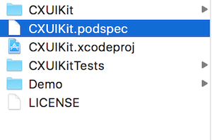

CocoaPods 是一个开发 OS X 和 iOS 应用程序时管理第三方库依赖的工具。之前写过一篇 [iOS 入门(2)：管理第三方库][3] 简要介绍了 CocoaPods 的基本安装和使用。这里接着介绍一下如何使用 CocoaPods 管理和集成本地私有库。


## 创建 Framework 项目

首先，我们需要创建一个 Framework 项目，具体可以参考 [创建一个 iOS Framework 项目][4]。项目的结构大致如下：


## 编辑 Podspec 描述文件

我们都知道，在使用 CocoaPods 去管理和引用第三方库的时候，我们需要创建一个 Podfile 来添加相关的 Pod 引用，那么当我们想把一个库提供给其他方使用时，我们则需要创建一个 Podspec 文件来描述这个库，以便 CocoaPods 知道如何去使用这个库。创建 Podspec 文件的方式大致如下：

```
// 在项目目录下(xxx.xcodeproj 所在目录)，执行下列命令：
$ pod spec create #你的项目名#

// 编辑 podspec 文件
...

// 检查 podspec 文件是否规范：
$ pod spec lint xxx.podspec
```


比如在上面的示例项目中，在项目目录下创建一个 podspec 文件如下：



图中 `CXUIKit.podspec` 文件的内容大致为：

```
Pod::Spec.new do |s|

	s.name = 'CXUIKit'
	s.summary = 'Some customized UI components.'
	s.version = '0.0.1'
	s.license = { :type => 'MIT', :file => 'LICENSE' }
	s.authors = { 'SamirChen' => '#你的邮箱地址#' }
	s.homepage = '#你的项目主页地址#'

	s.ios.deployment_target = '8.0'

	s.source = { :git => '#你的项目 Git 地址#', :tag => s.version.to_s }

	s.requires_arc = true
	s.source_files = 'CXUIKit/*.{h,m}'
	s.public_header_files = 'CXUIKit/*.{h}'

	s.frameworks = 'Foundation', 'UIKit'

end
```

关于 Podspec 文件语法相关的内容，参见 [Podspec Syntax Reference][5]。


## 引用私有 Framework

用 CocoaPods 来引用上文创建的私有 Framework 就很简单了，就是在 App 项目的 Podfile 中添加如下内容：

```
pod 'CXUIKit', :path=>'../CXUIKit'
```

其中 `:path` 的值应该是上面 CXUIKit 这个 Framework 项目的 Podspec 文件所在的路径。


比如，我们创建一个 Test 项目，它的 Podfile 如下：

```
source 'https://github.com/CocoaPods/Specs.git'

use_frameworks!

platform:ios, '8.0'

target 'MyTest' do
	platform:ios, '8.0'

    pod 'SVProgressHUD'
    pod 'CXUIKit', :path=>'../CXUIKit'
end
```

执行 `pod install` 就可以把 CXUIKit 这个库给引用到这个 Test 项目中了。


[SamirChen]: http://www.samirchen.com "SamirChen"
[1]: {{ page.url }} ({{ page.title }})
[2]: http://www.samirchen.com/use-cocoapods-to-manage-private-libs
[3]: http://www.samirchen.com/ios-start-2
[4]: http://www.samirchen.com/create-a-framework/
[5]: https://guides.cocoapods.org/syntax/podspec.html

