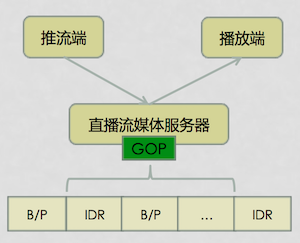
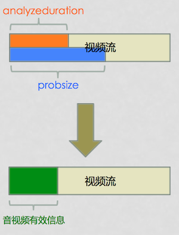

直播中的首屏加载时间指的是进入直播间时从播放器加载到第一帧画面渲染出来的时间，这个时间是直播体验中的一项重要的指标。这篇文章就简要介绍一下优化直播首屏加载时间的一些经验。


## 客户端业务侧优化

说到优化，首先要看客户端上进入直播间的业务场景是什么样的？一般而言，都是从一个直播列表页面，点击某一个直播卡片（Cell）即进入直播间。这个过程中，数据流是怎么走的呢？最简单的做法是，从直播列表页点击某个直播卡片到直播间后，从服务器请求直播流地址以及各种直播间信息（主播信息、聊天信息、点赞信息、礼物信息等等），拿到直播流地址后，交给播放器播放。

在这个过程中，我们可以看到播放器必须等到进入直播间请求到直播流地址后才能开始播放，这个时间点其实是可以提前的：**我们可以在直播列表页就拿到每个直播间对应的直播流地址，在进入直播间时直接传过去，这样一进入直播间播放器就可以拿着直播流地址开始播放了，省去了从服务器请求直播流地址的时间（虽然这个时间可能没多少）。**

甚至，**我们可以在直播列表页当滑到一个卡片就让播放器拿着直播流地址预加载，进入直播间时则直接展示画面。**


另外，**客户端业务侧还可以在进入直播间之前通过 HTTPDNS 来选择网络情况最好的 CDN 节点，在进入直播间时从最好的节点拉取直播流播放从而优化网络加载的时间，加快首屏渲染。**


## 流媒体服务器侧优化

### 协议的选择

当前流行的直播拉流协议主要有 RTMP 和 HTTP-FLV。经过大量的测试发现，移动端拉流时在相同的 CDN 策略以及播放器控制策略的条件下，HTTP-FLV 协议相比 RTMP 协议，首屏时间要减少 300～400ms 左右。主要是在 RTMP 协议建连过程中，与服务端的交互耗时会更久。所以我们应该优先使用 HTTP-FLV 协议。


### 服务端 GOP 缓存

除了客户端业务侧的优化外，我们还可以从流媒体服务器侧进行优化。我们都知道直播流中的图像帧分为：I 帧、P 帧、B 帧，其中只有 I 帧是能不依赖其他帧独立完成解码的，这就意味着当播放器接收到 I 帧它能马上渲染出来，而接收到 P 帧、B 帧则需要等待依赖的帧而不能立即完成解码和渲染，这个期间就是「黑屏」了。


所以，**在服务器端可以通过缓存 GOP（在 H.264 中，GOP 是封闭的，是以 I 帧开头的一组图像帧序列），保证播放端在接入直播时能先获取到 I 帧马上渲染出画面来，从而优化首屏加载的体验。**

这里有一个 IDR 帧的概念需要讲一下，所有的 IDR 帧都是 I 帧，但是并不是所有 I 帧都是 IDR 帧，IDR 帧是 I 帧的子集。I 帧严格定义是帧内编码帧，由于是一个全帧压缩编码帧，通常用 I 帧表示「关键帧」。IDR 是基于 I 帧的一个扩展，带了控制逻辑，IDR 图像都是 I 帧图像，当解码器解码到 IDR 图像时，会立即将参考帧队列清空，将已解码的数据全部输出或抛弃。重新查找参数集，开始一个新的序列。这样如果前一个序列出现重大错误，在这里可以获得重新同步的机会。IDR 图像之后的图像永远不会使用 IDR 之前的图像的数据来解码。在 H.264 编码中，GOP 是封闭式的，一个 GOP 的第一帧都是 IDR 帧。



通常我们可以在 CDN 的边缘节点做 GOP 缓存。


### 服务端快速下发策略

快速启动优化则是会在 GOP 缓存基本上根据播放器缓冲区大小设定一定的 GOP 数量用于填充播放器缓冲区。

这个优化项并不是客户端播放器来控制的，而是在 CDN 服务端来控制下发视频数据的带宽和速度。因为缓冲区耗时不仅跟缓冲需要的帧数有关，还跟下载数据的速度优化，以网宿 CDN 为例，他们可以配置快速启动后，在拉取直播流时，服务端将以 5 倍于平时带宽的速度下发前面缓存的 1s 的数据，这样的效果除了首屏速度更快以外，首屏秒开也会更稳定，因为有固定 1s 的缓存快速下发。这个优化的效果可以使首屏秒开速度提升 100ms 左右。


## 直播播放器侧优化


### 耗时分析

HTTP-FLV 协议就是专门拉去 FLV 文件流的 HTTP 协议，所以它的请求流程就是一个 HTTP 的下载流程，如下图：


从上图中可以看出，首屏耗时的组成主要以下基本组成：

- DNS 解析耗时
- TCP 建连耗时
- HTTP 响应耗时
- 音视频流探测耗时
- Buffer 填充耗时

下面我们来分别从这几个方面讨论如何优化。


### 优化 DNS 解析耗时

DNS 解析是网络请求的第一步，在我们用基于 FFmpeg 实现的播放器 ffplay 中，所有的 DNS 解析请求都是 FFmpeg 调用 `getaddrinfo` 方法来获取的。

我们如何在 FFmpeg 中统计 DNS 耗时呢？

可以在 `libavformat/tcp.c` 文件中的 `tcp_open` 方法中，按以下方法统计：

```
int64_t start = av_gettime();
if (!hostname[0])
    ret = getaddrinfo(NULL, portstr, &hints, &ai);
else
    ret = getaddrinfo(hostname, portstr, &hints, &ai);
int64_t end = av_gettime();
```


如果在没有缓存的情况下，实测发现一次域名的解析会花费至少 300ms 左右的时间，有时候更长，如果本地缓存命中，耗时很短，几个 ms 左右，可以忽略不计。缓存的有效时间是在DNS 请求包的时候，每个域名会配置对应的缓存 TTL 时间，这个时间不确定，根据各域名的配置，有些长有些短，不确定性比较大。

为什么 DNS 的请求这么久呢？一般理解，DNS 包的请求，会先到附近的运营商的 DNS 服务器上查找，如果没有，会递归到根域名服务器，这个耗时就很久。一般如果请求过一次，这些服务器都会有缓存，而且其他人也在不停的请求，会持续更新，下次再请求的时候就会比较快。


在测试 DNS 请求的过程中，有时候通过抓包发现每次请求都会去请求 `A` 和 `AAAA` 查询，这是去请求 IPv6 的地址，但由于我们的域名没有 IPv6 的地址，所以每次都要回根域名服务器去查询。为什么会请求 IPV6 的地址呢，因为 FFmpeg 在配置 DNS 请求的时候是按如下配置的：

```
hints.ai_family = AF_UNSPEC;
```

它是一个兼容 IPv4 和 IPv6 的配置，如果修改成 `AF_INET`，那么就不会有 `AAAA` 的查询包了。通过实测发现，如果只有 IPv4 的请求，即使是第一次，也会在 100ms 内完成，后面会更短。这里是一个优化点，但是要考虑将来兼容 IPv6 的问题。


DNS 的解析一直以来都是网络优化的首要问题，不仅仅有时间解析过长的问题，还有小运营商 DNS 劫持的问题。采用 HTTPDNS 是优化 DNS 解析的常用方案，不过 HTTPDNS 在部分地区也可能存在准确性问题，综合各方面可以采用 HTTPDNS 和 LocalDNS 结合的方案，来提升解析的速度和准确率。大概思路是，App 启动的时候就预先解析我们指定的域名，因为拉流域名是固定的几个，所以完全可以先缓存在 App 本地。然后会根据各个域名解析的时候返回的有效时间，过期后再去解析更新缓存。至于 DNS 劫持的问题，如果 LocalDNS 解析出来的 IP 无法正常使用，或者延时太高，就切换到 HTTPDNS 重新解析。这样就保证了每次真正去拉流的时候，DNS 解析的耗时几乎为 0，因为可以定时更新缓存池，使每次获得的 DNS 都是来自缓存池。


那么怎么去实现 HTTPDNS 呢？

方案一：IP 直连。

假设原直播流的 URL 是：http://www.example.com/abc.flv。假设从 HTTPDNS 服务获取的 www.example.com 这个 Host 对应的 IP 是：192.168.1.1。那么处理后的 URL 是：http://192.168.1.1/abc.mp4。如果直接用这个 URL 去发起 HTTP 请求，有些情况可以成功，但很多情况是不行的。如果这个 IP 的机器只部署了 www.example.com 对应的服务，就能解析出来，如果有多个域名的服务，CDN 节点就无法正确的解析。这个时候一般需要设置 HTTP 请求的 header 里面的 Host 字段。

```
AVDictionary **dict = ffplayer_get_opt_dict(ffplayer, opt_category);
av_dict_set(dict, "headers", "Host: www.example.com", 0);
```

但是这个方案有两个问题：

1）服务端采用 302/307 跳转的方式调度资源，则 IP 直连会有问题。

如果在客户端发出请求（如：http://www.example.com/abc.flv）的时候，服务端是通过 302/307 调度方式返回直播资源的真实地址（如：http://www.realservice.com/abc.flv），这时 IP 直连会有问题。因为客户端并不知道跳转逻辑，而客户端做了 IP 直连，用的是 www.example.com 获取到的直连 IP 并替换成了 http://192.168.1.1/abc.mp4，这个请求到达服务器，服务器又没有对应的资源，则会导致错误。这种情况可以让服务端采用不下发 302 跳转的方式，但这样就不通用了，会给将来留下隐患。所以常见的做法是做一层播控服务，客户端请求播控服务获取到实际的播放地址以及各种其他的信息，然后再走 IP 直连就没问题。

还可以参考：[iOS 302 等重定向业务场景IP直连方案说明][7]。


2）使用 HTTPS 时，IP 直连会有问题。


这种方案在使用 HTTPS 时，是会失败的。因为 HTTPS 在证书验证的过程，会出现 domain 不匹配导致 SSL/TLS 握手不成功。这时候的方案参考 [HTTPS（含SNI）业务场景“IP直连”方案说明][6] 和 [iOS HTTPS SNI 业务场景“IP直连”方案说明][7]。


方案二：替换 FFmpeg 的 DNS 实现。

另一种方案是替换原来的 DNS 解析的实现。在 FFmpeg 中即替换掉 `tcp.c` 中 `getaddreinfo` 方法，这个方法就是实际解析 DNS 的方法，比如下面代码：

```
if (my_getaddreinfo) {
    ret = my_getaddreinfo(hostname, portstr, &hints, &ai);
} else {
    ret = getaddrinfo(hostname, portstr, &hints, &ai);

}
```

在 `my_getaddreinfo` 中可以自己实现 HTTPDNS 的解析逻辑从而优化原来的 DNS 解析速度。


总体来说，DNS 优化后，直播首屏时间能减少 100ms～300ms 左右，特别是针对很多首次打开，或者 DNS 本地缓存过期的情况下，能有很好的优化效果。


### 优化 TCP 建连耗时

TCP 建连耗时在这里即调用 Socket 的 connect 方法建立连接的耗时，它是一个阻塞方法，它会一直等待 TCP 的三次握手完成。它直接反应了客户端到 CDN 服务器节点的点对点延时情况，实测在一般的 Wifi 网络环境下耗时在 50ms 以内，基本是没有太大的优化空间，不过它的时间反应了客户端的网络情况或者客户端到节点的网络情况。

要统计这段耗时，可以在 libavformat/tcp.c 文件中的 `tcp_open` 方法中，按以下方法统计：

```
int64_t start = av_gettime();
if ((ret = ff_listen_connect(fd, cur_ai->ai_addr, cur_ai->ai_addrlen,
                             s->open_timeout / 1000, h, !!cur_ai->ai_next)) < 0) {
    if (ret == AVERROR_EXIT)
        goto fail1;
    else
        goto fail;
}
int64_t end = av_gettime();
```


TCP 连接耗时可优化的空间主要是针对建连节点链路的优化，主要受限于三个因素影响：用户自身网络条件、用户到 CDN 边缘节点中间链路的影响、CDN 边缘节点的稳定性。因为用户网络条件有比较大的不可控性，所以优化主要会在后面两个点。可以结合着用户所对应的城市、运营商的情况，同时结合优化服务端的 CDN 调度体系，给用户下发更合适的 CDN 服务域名，然后通过 HTTPDNS SDK 来优化 DNS 解析的结果。


### 优化 HTTP 响应耗时

HTTP 响应耗时是指客户端发起一个 HTTP Request 请求，然后等待 HTTP 响应的 Header 返回这部分耗时。直播拉流 HTTP-FLV 协议也是一个 HTTP 请求，客服端发起请求后，服务端会先将 HTTP 的响应头部返回，不带音视频流的数据，响应码如果是 200，表明视频流存在，紧接着就开始下发音视频数据。HTTP 响应耗时非常重要，它直接反应了 CDN 服务节点处理请求的能力。它与 CDN 节点是否有缓存这条流有关，如果在请求之前有缓存这条流，节点就会直接响应客户端，这个时间一般也在 50ms 左右，最多不会超过 200ms，如果没有缓存，节点则会回直播源站拉取直播流，耗时就会很久，至少都在 200ms 以上，大部分时间都会更长，所以它反应了这条直播流是是冷流还是热流，以及 CDN 节点的缓存命中情况。

如果需要统计它的话，可以在 libavformat/http.c 文件中的 `http_open` 方法：

```
int64_t start = av_gettime();
ret = http_open_cnx(h, options);
int64_t end = av_gettime();
```


通常 CDN 的缓存命中策略是与访问资源的 URL 有关。如果命中策略是 URL 全匹配，那么就要尽量保证 URL 的变化性较低。比如：尽量不要在 URL 的参数中带上随机性的值，这样会造成 CDN 缓存命中下降，从而导致不断回源，这样访问资源耗时也就增加了。当然这样就失去了一些灵活性。

CDN 方面其实可以提供一些配置策略，比如：根据域名可配置对其缓存命中策略忽略掉某些参数。这样就能保证一定的灵活性了。


### 优化音视频流探测耗时

当我们做直播业务时，播放端需要一个播放器来播放视频流，当一个播放器支持的视频格式有很多种时，问题就来了。一个视频流来了，播放器是不清楚这个视频流是什么格式的，所以它需要去探测到一定量的视频流信息，去检测它的格式并决定如何去处理它。这就意味着在播放视频前有一个数据预读过程和一个分析过程。但是对于我们的直播业务来说，我们的提供的直播方案通常是固定的，这就意味着视频流的格式通常是固定的，所以一些数据预读和分析过程是不必要的。**在直播流协议格式固定的情况下，只需要读取固定的信息即可开始播放。这样就缩短了数据预读和分析的时间，使得播放器能够更快地渲染出首屏画面。**




基于 FFmpeg 实现的播放器，在播放视频时都会调用到一个 `avformat_find_stream_info` (libavformat/utils.c) 函数，该函数的作用是读取一定长度的码流数据，来分析码流的基本信息，为视频中各个媒体流的 AVStream 结构体填充好相应的数据。这个函数中做了查找合适的解码器、打开解码器、读取一定的音视频帧数据、尝试解码音视频帧等工作，基本上完成了解码的整个流程。这时一个同步调用，在不清楚视频数据的格式又要做到较好的兼容性时，这个过程是比较耗时的，从而会影响到播放器首屏秒开。

可以在 ijkplayer 的工程中 ff_ffplay.c 文件中的 `read_thread` 方法统计其耗时：

```
int64_t start = av_gettime();
avformat_find_stream_info(ic, opts);
int64_t end = av_gettime();
```


在外部可以通过设置 `probesize` 和 `analyzeduration` 两个参数来控制该函数读取的数据量大小和分析时长为比较小的值来降低 `avformat_find_stream_info` 的耗时，从而优化播放器首屏秒开。但是，需要注意的是这两个参数设置过小时，可能会造成预读数据不足，无法解析出码流信息，从而导致播放失败、无音频或无视频的情况。所以，在服务端对视频格式进行标准化转码，从而确定视频格式，进而再去推算 `avformat_find_stream_info` 分析码流信息所兼容的最小的 `probesize` 和 `analyzeduration`，就能在保证播放成功率的情况下最大限度地区优化首屏秒开。

在我们能控制视频格式达到标准化后，我们可以直接修改 `avformat_find_stream_info` 的实现逻辑，针对该视频格式做优化，进而优化首屏秒开。

在 FFmpeg 中的 `utils.c` 文件中的函数实现中有一行代码是 `int fps_analyze_framecount = 20;`，这行代码的大概用处是，如果外部没有额外设置这个值，那么 `avformat_find_stream_info ` 需要获取至少 20 帧视频数据，这对于首屏来说耗时就比较长了，一般都要 1s 左右。而且直播还有实时性的需求，所以没必要至少取 20 帧。你可以试试将这个值初始化为 0 看看效果。在开发中，我们可以去掉这个条件来实现优化：

```
av_dict_set_int(&ffp->format_opts, "fpsprobesize", 0, 0);
```

这样，`avformat_find_stream_info ` 的耗时就可以缩减到 100ms 以内。


甚至，我们可以进一步直接去掉 `avformat_find_stream_info` 这个过程，自定义完成解码环境初始化。参见：[VLC优化（1） avformat_find_stream_info 接口延迟降低][4] 和 [FFMPEG avformat_find_stream_info 替换][5]。


对 `avformat_find_stream_info` 代码的分析，还可以看看这里：[FFmpeg源代码简单分析：avformat_find_stream_info()][3]。


### 优化 Buffer 填充耗时

缓冲耗时是指播放器的缓冲的数据达到了预先设定的阈值，可以开始播放视频了。这个值是可以动态设置的，所以不同的设置给首屏带来的影响是不一样的。

缓冲耗时的统计方法，不像前面几个那么简单，因为它涉及到的代码有多处，所以需要在多个地方计时。开始计时可以直接从 `avformat_find_stream_info` 后面开始，结束计时可以在第一帧视频渲染出来的时候结束。


```
avformat_find_stream_info(ic, opts);
start = av_gettime();

...

if (!ffp->first_video_frame_rendered) {
    ffp->first_video_frame_rendered = 1;
    ffp_notify_msg1(ffp, FFP_MSG_VIDEO_RENDERING_START);
    end = av_gettime();
}
```

优化一：调整 `BUFFERING_CHECK_PER_MILLISECONDS` 设置。

缓冲区填充耗时跟播放器里面的一个设置 `BUFFERING_CHECK_PER_MILLISECONDS` 值有关，因为播放器 check 缓冲区的数据是否达到目标值不是随意检测的，因为 check 本身会有一定的浮点数运算，所以 ijkplayer 最初给他设置了 500ms 时间间隔去定时检查，这个时间明显比较大，所以会对缓冲耗时有比较大的影响。可以把这个值改小一些。

```
#define BUFFERING_CHECK_PER_MILLISECONDS        (500)
```

这个值会在 ijkplayer 工程中 `ff_ffplay.c` 文件中的 `read_thread` 方法中用到：

```
if (ffp->packet_buffering) {
    io_tick_counter = SDL_GetTickHR();
    if (abs((int)(io_tick_counter - prev_io_tick_counter)) > BUFFERING_CHECK_PER_MILLISECONDS){
        prev_io_tick_counter = io_tick_counter;
        ffp_check_buffering_l(ffp);
    }
}
```

从这个代码逻辑中可以看出，每次调用 `ffp_check_buffering_l` 去检查 buffer 是否满足条件的时间间隔是 500ms 左右，如果刚好这次只差一帧数据就满足条件了，那么还需要再等 500ms 才能再次检查了。这个时间，对于直播来说太长了。我们当前的做法是降低到 50ms，从实测效果来看平均可以减少 200ms 左右。


优化二：调整 `MIN_MIN_FRAMES` 设置。


另外一个跟缓冲区相关的设置是 `MIN_MIN_FRAMES`，其对应的使用逻辑在 `ffp_check_buffering_l(ffp)` 函数中：

```
#define MIN_MIN_FRAMES      10

if (is->buffer_indicator_queue && is->buffer_indicator_queue->nb_packets > 0) {
    if (   (is->audioq.nb_packets > MIN_MIN_FRAMES || is->audio_stream < 0 || is->audioq.abort_request)
        && (is->videoq.nb_packets > MIN_MIN_FRAMES || is->video_stream < 0 || is->videoq.abort_request)) {
        printf("ffp_check_buffering_l buffering end \n");
        ffp_toggle_buffering(ffp, 0);
    }
}
```


这里大概的意思需要缓冲的数据至少要有 11 帧视频和 11 个音频数据包，才能离开缓冲区开始播放。音频数据很容易满足条件，因为如果采样率是 44.1k 的音频，那么 1s 的数据平均有 44 个音频包，0.25s 的数据就能达到 11 个音频包。但对于视频，如果是 24 帧的帧率，至少需要 0.4s 左右的数据才能达到 11 帧。如果视频采集的编码帧率较低（美颜、AR 情况下由于处理消耗较大可能采集的帧率较低），只有 10~15，那就需要接近 1s 的数据才能达到 11 帧，缓冲区需要这么多数据才能开始播放，这个时长太大。

缓冲区里达到这么多数据时，实际上播放器已经下载了多少数据呢？我们深入 `ff_ffplay.c` 源码可以看到视频解码后会放到一个 `frame_queue` 里面，用于渲染数据。可以看到视频数据的流程是这样的：下载缓冲区 -> 解码 -> 渲染缓冲区 -> 渲染。其中渲染的缓冲区就是 `frame_queue`。下载的数据会先经过解码线程将数据输出到 `frame_queue` 中，然后等 `frame_queue` 队列满了，才开始渲染。在 `ff_ffplay.c` 中，可以找到如下代码：


```
#define VIDEO_PICTURE_QUEUE_SIZE_MIN        (3)
#define VIDEO_PICTURE_QUEUE_SIZE_MAX        (16)
#define VIDEO_PICTURE_QUEUE_SIZE_DEFAULT    (VIDEO_PICTURE_QUEUE_SIZE_MIN)

ffp->pictq_size = VIDEO_PICTURE_QUEUE_SIZE_DEFAULT; // option

/* start video display */
if (frame_queue_init(&is->pictq, &is->videoq, ffp->pictq_size, 1) < 0)
    goto fail;
```

所以目前来看，如果设置 `MIN_MIN_FRAMES` 为 10，播放器开始播放时至少有 14 帧视频。对于低帧率的视频来说，也相当大了。在实践中我们把它调整到 5，首屏时间减少了 300ms 左右，并且卡顿率只上升了 2 个百分点左右。


## 参考

- [SRS 低延时直播应用][5]
- [美拍直播优化][6]
- [快手直播优化][8]
- [移动直播技术秒开优化经验][9]
- [低延时超清直播传输技术][10]


[SamirChen]: http://www.samirchen.com "SamirChen"
[1]: {{ page.url }} ({{ page.title }})
[2]: http://www.samirchen.com/first-screen-loading
[4]: http://mp.weixin.qq.com/s?__biz=MzAwMDU1MTE1OQ==&mid=2653547042&idx=1&sn=26d8728548a6b5b657079eeab121e283&scene=2&srcid=0428msEitG9LJ3JaKGaRCEjg&from=timeline&isappinstalled=0
[5]: https://github.com/ossrs/srs/wiki/v1_CN_LowLatency
[6]: https://mp.weixin.qq.com/s/hCsUKbkaO-254XVAT23wVg
[7]: https://helpcdn.aliyun.com/knowledge_detail/60148.html
[8]: https://mp.weixin.qq.com/s/Mn1qpE_mau_PQlN5mLpZCw
[9]: https://mp.weixin.qq.com/s?__biz=MzAwMDU1MTE1OQ==&mid=2653547042&idx=1&sn=26d8728548a6b5b657079eeab121e283&scene=2&srcid=0428msEitG9LJ3JaKGaRCEjg&from=timeline&isappinstalled=0#wechat_redirect
[10]: https://mp.weixin.qq.com/s?__biz=MzAwMDU1MTE1OQ==&mid=2653547697&idx=1&sn=acc748b7fcf0058b58e244970e51eabc&scene=0&from=groupmessage&isappinstalled=0#wechat_redirect
