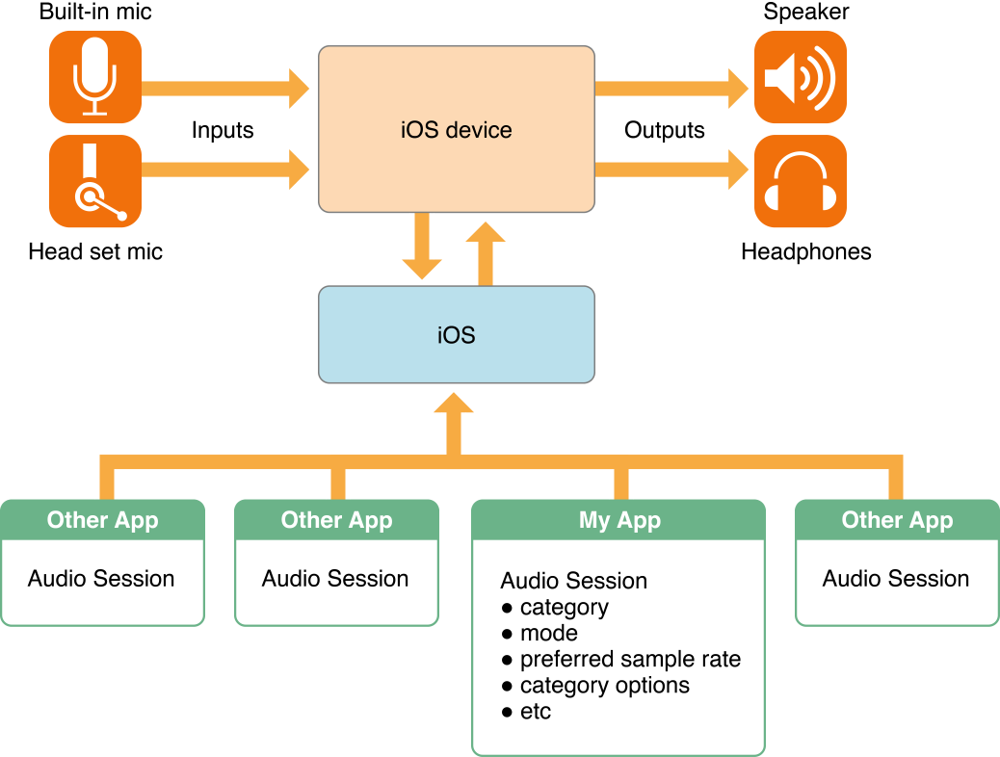

本文内容主要来源于 [Audio Session Programming Guide][3]。

## Audio Session 概览

在 iOS 系统中，开发者可以通过 AVAudioSession 相关的 API 来处理 App 内部、App 之间以及设备级别的音频行为。比如：你的 App 的声音是否应该受到手机的静音键的控制；当你的 App 的音频开始播放时，其他音乐播放器的声音是否应停止；用户拔掉耳麦、电话来了、带声音播放的系统通知响起等情况下，你的 App 的声音应该怎么处理等等。

总的来说，使用 AVAudioSession 你可以做到：

- 选择合适的音频输入或输出路径。
- 决定你的 App 的音频如何与其他 App 的音频共存。
- 处理来自其他 App 的中断。
- 根据你的 App 的类别自动做音频相关配置。

<!-- 
- Select the appropriate input and output routes for your app
- Determine how your app integrates audio from other apps
- Handle interruptions from other apps
- Automatically configure audio for the type of app your are creating
-->

在 AVAudioSession 中如何支持你做到上述这些呢？

- 用 Category 来描述音频使用者的角色。最主要的用来表述音频相关行为的机制即 Audio Session Category。Category 反映了诸如「你的 App 使不使用音频输入或输出」、「其他音乐能否和你的 Audio 共存播放」等等角色能力。不同的 Category 可以`支持播放`、`录制`、`边播放边录制`等不同的行为模式，系统通过 Audio Session Category 知道你的角色，从而赋予你与角色匹配的硬件访问权限。同时，系统保障还其他 App 的音频行为与你的角色相匹配。比如，你希望 Music 应用会被你的音频播放打断。

- 用 Mode 来定制 Category 的具体行为。比如，你的 App 使用 Video Recording Mode 模式时，系统可能会选择一个与 Default Mode 模式不同的内置麦克风来采集音频。

- 用 Notification 来支持中断消息通知。产生中断通常是因为另一个和你的 App 存在竞争性音频行为的 App 此时被激活，而这个 App 设置的 Category 不支持 mix 你的音频。这时你的 App 的音频可能就直接被停掉了。如果要做到合乎逻辑的处理，这时候则需要你监听中断通知 [AVAudioSessionInterruptionNotification][4]：当你的 Audio Session 被中断而失效时，系统会发送给你一个通知信息，这时候你可以做一些状态信息存储、更新用户界面之类的动作。

- 用 Notification 来支持 Audio Route 切换消息通知。当手机被锁屏或解锁、插上或拔出了耳麦时，音频的输入或输出路径是会发生改变的，这时候你需要监听 [AVAudioSessionRouteChangeNotification][5] 通知，来做相应的处理以符合用户的期望。

- 用 Category 来支持更高级的功能。你可以通过各种方式调优 Category，从而做到这些：
	- 允许其他 App 的音频与你的音频 mix 在一起播放。
	- 将音频输出路径从听筒改到扬声器。
	- 允许通过蓝牙做音频输入。
	- 当你的音频播放时，指定其他的音频降低音量。
	- 在运行状态下根据硬件行为和用户行为优化你的 App 音频行为。比如，用户插上耳机时将音量降低以免吵到用户。

[SamirChen]: http://www.samirchen.com "SamirChen"
[1]: {{ page.url }} ({{ page.title }})
[2]: http://www.samirchen.com/ios-avaudiosession-1
[3]: https://developer.apple.com/library/ios/documentation/Audio/Conceptual/AudioSessionProgrammingGuide/Introduction/Introduction.html
[4]: https://developer.apple.com/library/ios/documentation/AVFoundation/Reference/AVAudioSession_ClassReference/index.html#//apple_ref/c/data/AVAudioSessionInterruptionNotification
[5]: https://developer.apple.com/library/ios/documentation/AVFoundation/Reference/AVAudioSession_ClassReference/index.html#//apple_ref/c/data/AVAudioSessionRouteChangeNotification
[6]: https://developer.apple.com/library/ios/documentation/UIKit/Reference/UIDevice_Class/index.html#//apple_ref/occ/instm/UIDevice/playInputClick
[7]: https://developer.apple.com/library/ios/documentation/AVFoundation/Reference/AVCaptureDevice_Class/index.html#//apple_ref/occ/cl/AVCaptureDevice
[8]: https://developer.apple.com/library/ios/documentation/AVFoundation/Reference/AVCaptureSession_Class/index.html#//apple_ref/occ/cl/AVCaptureSession

