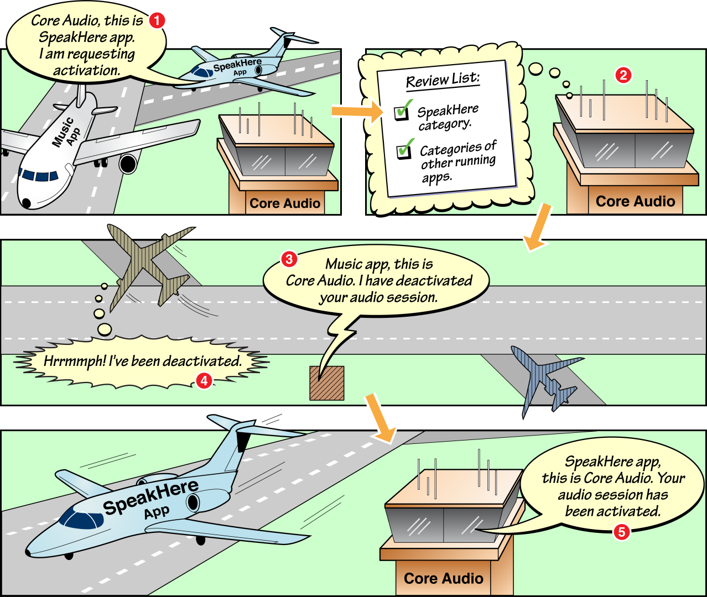

本文内容主要来源于 [Defining an Audio Session][3]。


## Audio Session 的默认行为

AVAudioSession 的默认行为如下：

- 音频播放能力是开启的，但是音频录制能力是关闭的。
- 当用户通过静音键切换到静音模式时，你的音频会被静音。
- 当用户通过锁屏键锁定屏幕或者自动锁屏定时触发时，你的音频会被静音。
- 当你的音频开始播放时，正在播放的其他 App 的音频会被静音。

这些行为是由默认的 AVAudioSessionCategorySoloAmbient Category 设定的。通常默认设置是不能满足你的需求的，除非你的 App 对音频的控制场景如下：

- 你的 App 只使用 System Sound Services 或者 UIKit 中的 [playInputClick][6] 方法来处理音频，而没有用到其他音频相关的 API 时。
- 你的 App 不使用任何音频。

## 系统如何解决竞争性的音频请求

流程大致如下图，还是挺好理解的：




需要注意的是，系统永远遵循一个原则：电话的优先级最高。


## 和 AVCaptureSession 协同

在 AV Foundatin capture 相关的 API 中（[AVCaptureDevice][7], [AVCaptureSession][8]）允许你从摄像头和麦克风采集同步的音视频数据。其中表示麦克风的 AVCaptureDevice 对象可以共享你的 AVAudioSession。通常情况下，如果 AVCaptureSession 需要使用麦克风进行音频录制时，它会去修改优化你的 AVAudioSession 配置。如果你不希望这样，则需要设置对应的 AVCaptureSession 对象的 automaticallyConfiguresApplicationAudioSession 属性为 NO 来让 AVCaptureSession 使用你当前的 AVAudioSession 配置而不会修改它。


## 初始化 Audio Session

代码如下：

```
// implicitly initializes your audio session
AVAudioSession *session = [AVAudioSession sharedInstance];
```

## 音量和路径控制

苹果官方推荐使用 [MPVolumeView][9] 来控制音频音量和路径，MPVolumeView 提供了一个 Slider 来控制音量，提供了一个按钮来供你选择音频输出路径。

你可以通过如下代码来设置音频输出路径到话筒：

```
[[AVAudioSession sharedInstance] overrideOutputAudioPort:AVAudioSessionPortOverrideSpeaker error:nil];
```

但苹果推荐你用 MPVolumeView 提供的路径选择按钮来实现音频输出路径切换。


## 响应远程控制事件

通过响应 Remote Control Events 能让你在播放音视频内容时，可以响应来自锁屏界面、外部设备等 App 外部的控制。

具体参见 [Remote Control Events][10] 和 [MPNowPlayingInfoCenter Class Reference][11]。


## 激活和关闭 Audio Session

苹果官方建议如果你需要用到 Audio Session，总是应该显示地激活你的 Audio Session。并且参考 [Setting Preferred Hardware Values][12] 来设置相应的硬件参数。这样可以在你使用 Audio Session 前来测试是否能成功激活，以便于做出正确的处理逻辑。

激活 Audio Session 代码如下：

```
NSError *activationError = nil;
BOOL success = [[AVAudioSession sharedInstance] setActive:YES error:&activationError]; // Pass 'NO' when deactivate your audio session.
if (!success) { /* handle the error in activationError */ }

```

值得注意的是，大部分时候我们不需要关闭 Audio Session，除非是在 VoIP(Voice over Internet Protocol) 类应用、turn-by-turn 导航类应用和某些录制类应用中。这时你需要注意：

- 对于 VoIP 类应用，要确保 Audio Session 只在电话接听中是 Active 的。当应用处于后台时，保持应用为准备接听电话的状态，但应用的 Audio Session 应该是 Inactive 的。
- 对于定位于 Recording Category 来使用 Audio Session 的应用，要确保只在录制中设置 Audio Session 为 Active 状态，在录制开始前和录制结束后要确保 Audio Session 为 Inactive 状态以允许其他音频的播放。


## 检查是否有其他音频正在播放

你可以通过 [otherAudioPlaying][13] 来检查是否当前有其他应用的音频正在播放。

比如你是一个自带音效的游戏，当一个正在听音乐的用户打开你的游戏时，iOS 设计指南会建议你不要关闭用户正在听的音乐而播放你的游戏音效，这时候你怎么处理呢？你可以用上面的接口检查一下，如果有声音在播放则将你的音效静音并设置 AVAudioSessionCategorySoloAmbient。


## Inter-App Audio 特性

Inter-App Audio 特性允许一个 Node App 将它的音频输出给一个 Host App。也可以由 Host App 发送它的音频给 Node App 进行处理，处理完后再发回给 Host App。Host App 需要设置一个 Active 的 Audio Session，而 Node App 则只在从 Host App 或系统接收音频输入时才需要一个 Active 的 Audio Session。

你可以使用下面这些规则来搭建 Inter-App Audio：

- 为 Node App 和 Host App 都设置 「inter-app-audio」的 entitlement。
- 为 Host App 设置 [UIBackgroundModes][14] 的 audio flag。
- 为那些在与 Host App 连接时使用音频输入或输出路径的 Node App 设置 [UIBackgroundModes][14] 的 audio flag。
- 为 Node App 和 Host App 都设置 [AVAudioSessionCategoryOptionMixWithOthers][15] 这个 Category。
- 确保连接着 inter-app host 的 Node App 在接收来自系统的音频或者输出音频时的 Audio Session 是 Active 的。


[SamirChen]: http://www.samirchen.com "SamirChen"
[1]: {{ page.url }} ({{ page.title }})
[2]: http://www.samirchen.com/ios-avaudiosession-2
[3]: https://developer.apple.com/library/ios/documentation/Audio/Conceptual/AudioSessionProgrammingGuide/ConfiguringanAudioSession/ConfiguringanAudioSession.html#//apple_ref/doc/uid/TP40007875-CH2-SW1
[4]: https://developer.apple.com/library/ios/documentation/AVFoundation/Reference/AVAudioSession_ClassReference/index.html#//apple_ref/c/data/AVAudioSessionInterruptionNotification
[5]: https://developer.apple.com/library/ios/documentation/AVFoundation/Reference/AVAudioSession_ClassReference/index.html#//apple_ref/c/data/AVAudioSessionRouteChangeNotification
[6]: https://developer.apple.com/library/ios/documentation/UIKit/Reference/UIDevice_Class/index.html#//apple_ref/occ/instm/UIDevice/playInputClick
[7]: https://developer.apple.com/library/ios/documentation/AVFoundation/Reference/AVCaptureDevice_Class/index.html#//apple_ref/occ/cl/AVCaptureDevice
[8]: https://developer.apple.com/library/ios/documentation/AVFoundation/Reference/AVCaptureSession_Class/index.html#//apple_ref/occ/cl/AVCaptureSession
[9]: https://developer.apple.com/library/ios/documentation/MediaPlayer/Reference/MPVolumeView_Class/index.html#//apple_ref/occ/cl/MPVolumeView
[10]: https://developer.apple.com/library/ios/documentation/EventHandling/Conceptual/EventHandlingiPhoneOS/Remote-ControlEvents/Remote-ControlEvents.html#//apple_ref/doc/uid/TP40009541-CH7
[11]: https://developer.apple.com/library/ios/documentation/MediaPlayer/Reference/MPNowPlayingInfoCenter_Class/index.html#//apple_ref/doc/uid/TP40010927
[12]: https://developer.apple.com/library/ios/documentation/Audio/Conceptual/AudioSessionProgrammingGuide/OptimizingForDeviceHardware/OptimizingForDeviceHardware.html#//apple_ref/doc/uid/TP40007875-CH6-SW9
[13]: https://developer.apple.com/library/ios/documentation/AVFoundation/Reference/AVAudioSession_ClassReference/index.html#//apple_ref/occ/instp/AVAudioSession/otherAudioPlaying
[14]: https://developer.apple.com/library/ios/documentation/General/Reference/InfoPlistKeyReference/Articles/iPhoneOSKeys.html#//apple_ref/doc/uid/TP40009252-SW22
[15]: https://developer.apple.com/library/ios/documentation/AVFoundation/Reference/AVAudioSession_ClassReference/index.html#//apple_ref/c/econst/AVAudioSessionCategoryOptionMixWithOthers


