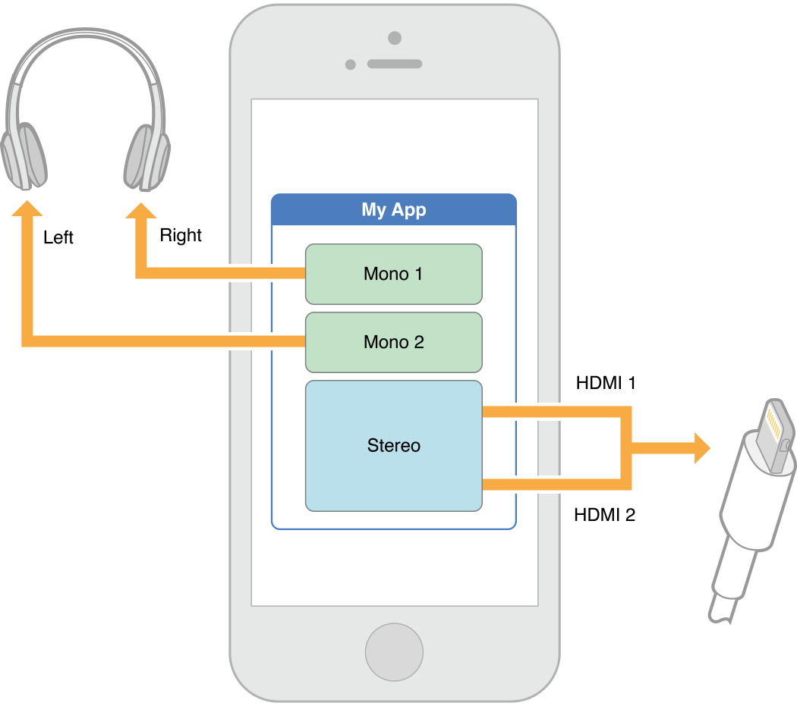

本文内容主要来源于 [Working with Categories][3]。

对于 Audio Session 来说，与之对应的 Category 是阐释其音频行为的关键信息。比如：你的 App 的声音是否应该受到手机的静音键的控制、你的 App 使不使用音频输入或输出、其他音乐能否和你的 Audio 共存播放等等。

每一种 Category 都指定了是否支持下列这些能力：

- `Interrupts non-mixable apps audio`：是否打断不支持混音播放的应用。如果是，则当你的应用的音频开始播放时，则那些不支持混音播放的应用的音频会被打断。
- `Silenced by the Silent switch`：是否响应手机静音键。如果是，则当手机静音键被拨至静音状态时，你的音频会被静音。
- `Supports audio input`：是否支持音频输入。如果是，你的应用就可以录音。
- `Supports audio output`：是否支持音频输出。如果是，你的应用就可以播放音频。

下面是各种 Category 的能力表格：

| Category | 是否会被静音键或锁屏键静音  | 是否打断不支持混音播放的应用  | 是否允许音频输入/输出  |
|---|---|---|---|
| AVAudioSessionCategoryAmbient  | Yes  | NO  | 只输出  |
| AVAudioSessionCategoryAudioProcessing  | -  | YES  | 无输入和输出  |
| AVAudioSessionCategoryMultiRoute  | NO  | YES  | 支持输入和输出  |
| AVAudioSessionCategoryPlayAndRecord  | NO  | 默认 YES，可重写开关置为 NO  | 支持输入和输出  |
| AVAudioSessionCategoryPlayback  | NO  | 默认 YES，可重写开关置为 NO | 只输出  |
| AVAudioSessionCategoryRecord  | NO（锁屏时依然保持录制） | YES  | 只输入  |
| AVAudioSessionCategorySoloAmbient  | YES  | YES  | 只输出  |


大部分应用只需要在启动时设置一下 Category 即可，不过你是可以随时修改 Audio Session 的 Category，也可以随时激活和关闭 Audio Session。当你的 Audio Session 是 Inactive 的，Category 的请求会在你激活它时发送，如果是 Active 的，则立即发送。


## 选择最合适的 Category

每一种 Category 最准确的行为定义是由系统控制而不是你的应用，苹果可能会在将来重新定义不同的 Category 的行为，所以你最好是选择一种与你的应用使用音频方式匹配的 Category 来用。

下面列一下各种 Category 的使用场景：

- AVAudioSessionCategoryAmbient，只支持音频播放。适用于把音频作为辅助性元素而非不可获取特性的应用，使用这个 Category，你的音频会被静音键和锁屏键静音。

- AVAudioSessionCategorySoloAmbient，这个是默认使用的 Category，只支持音频播放。音频会被静音键和锁屏键静音。这个 Category 和 AVAudioSessionCategoryAmbient 的唯一不同在于它会打断其他应用的音频播放。

- AVAudioSessionCategoryPlayback，只支持音频播放。你的音频不会被静音键和锁屏键静音。当你的应用把音频播放作为重要功能时，你可以使用这个 Category。

> 有一点需要注意的是，当你选择那些支持在静音键切到静音状态以及锁屏键切到锁屏状态下仍然支持你的音频继续播放的 Category 时，你必须在你的应用中开启 Background Audio 的能力，详见 [UIBackgroundModes][4]。并且，通常你不应该通过 [idleTimerDisabled][5] 接口关闭系统的 Sleep Timer。如果你关闭了，那你应该把 idleTimerDisabled 置回 NO，以免你的应用会禁止自动屏幕锁定，毕竟锁屏并不会影响你的音频播放，你干嘛关闭它呢。Sleep Timer 可以确保你的屏幕在用户无操作一段时间后自动变暗并锁定来省电。

- AVAudioSessionCategoryRecord，只支持音频录制。如果你的应用既要录制还要播放，那你应该用 AVAudioSessionCategoryPlayAndRecord。
- AVAudioSessionCategoryPlayAndRecord，支持音频播放和录制。音频的输入和输出不需要同步进行，当然也可以同步进行。对于音频通话类应用，可以使用这个 Category。
- AVAudioSessionCategoryAudioProcessing，只支持离线音频处理。支持离线音频处理，并且不支持播放和录制。
- AVAudioSessionCategoryMultiRoute，支持音频播放和录制。允许多条音频流的同步输入和输出。比如：USB 和耳麦同时音频输出。

除了 AVAudioSessionCategoryMultiRoute 外，其他的 Category 都遵循 **last in wins** 原则，即最后接入的音频设备作为输入或输出的主设备。


## 使用 AVAudioSessionCategoryMultiRoute 来扩展音频选择

AVAudioSessionCategoryMultiRoute 并不是简单的遵循 **last in wins** 原则，AVAudioSessionCategoryMultiRoute 允许你的使用所有连接的输出接口而不仅是最后连上的接口。比如，当你正在通过 HDMI 输出路径听音频，这时又插上了耳麦，你的应用可以同时在 HDMI 和耳麦都输出音频。

在 AVAudioSessionCategoryMultiRoute 下，你的应用可以发送不同的音频流到不同的输出路径。例如，你的应用可以将一条音频流发送到你的左耳麦，另一条音频流发送到右耳麦，并将第三条流发送到 HDMI 路径。如下图所示：



AVAudioSessionCategoryMultiRoute 支持下列输出组合：

- USB + 耳麦
- HDMI + 耳麦
- LineOut + 耳麦

AVAudioSessionCategoryMultiRoute 支持单输入接口。


## 设置 Audio Session Category

代码如下：

```
NSError *setCategoryError = nil;
BOOL success = [[AVAudioSession sharedInstance] setCategory:AVAudioSessionCategoryAmbient error:&setCategoryError];
// BOOL success = [[AVAudioSession sharedInstance] setCategory:AVAudioSessionCategoryPlayback withOptions:AVAudioSessionCategoryOptionMixWithOthers | AVAudioSessionCategoryOptionDuckOthers error:&setCategoryError];
if (!success) { /* handle the error in setCategoryError */ }
```


## 使用 Mode 来定制 Category

正如使用 Category 可以定制应用的音频行为，我们使用 Mode 则可以定制 Category 的行为。可选的 Mode 有这些：

| Mode  | 兼容的 Category  |
|---|---|
| AVAudioSessionModeDefault  | All |
| AVAudioSessionModeVoiceChat  | AVAudioSessionCategoryPlayAndRecord |
| AVAudioSessionModeGameChat  | AVAudioSessionCategoryPlayAndRecord  |
| AVAudioSessionModeVideoRecording  | AVAudioSessionCategoryPlayAndRecord AVAudioSessionCategoryRecord  |
| AVAudioSessionModeMoviePlayback  | AVAudioSessionCategoryPlayback  |
| AVAudioSessionModeMeasurement  | AVAudioSessionCategoryPlayAndRecord AVAudioSessionCategoryRecord AVAudioSessionCategoryPlayback |
| AVAudioSessionModeVideoChat  | AVAudioSessionCategoryPlayAndRecord  |

除了这些 Mode 外，有时在定制你的 Category 时，你还需要使用到一些 Option：

| Option  | 说明 | 兼容的 Category |
|---|---|---|
| AVAudioSessionCategoryOptionMixWithOthers  | 允许和其他音频 mix  | AVAudioSessionCategoryPlayAndRecord AVAudioSessionCategoryPlayback AVAudioSessionCategoryMultiRoute  | 
| AVAudioSessionCategoryOptionDuckOthers  | 智能调低冲突音频音量  | AVAudioSessionCategoryPlayAndRecord AVAudioSessionCategoryPlayback AVAudioSessionCategoryMultiRoute | 
| AVAudioSessionCategoryOptionAllowBluetooth  | 允许蓝牙音频输入  | AVAudioSessionCategoryRecord AVAudioSessionCategoryPlayAndRecord | 
| AVAudioSessionCategoryOptionDefaultToSpeaker  | 默认输出音频到扬声器  | AVAudioSessionCategoryPlayAndRecord | 


- AVAudioSessionModeDefault，默认模式可以与所有的 Category 兼容使用，并配置设备用于一般用途。

- AVAudioSessionModeVoiceChat，一般用于 VoIP 类型的应用。这个模式只用于 AVAudioSessionCategoryPlayAndRecord Category。在这个模式下，用于音频的信号会由系统提供的信号处理程序优化，并且这个模式会配置上 AVAudioSessionCategoryOptionAllowBluetooth 这个选项。这个设置下，当系统内置麦克风被使用时，系统会自动选择最佳内置麦克风组合支持语音聊天，从而优化语音聊天体验。

- AVAudioSessionModeVideoChat，一般用于视频聊天应用，比如 FaceTime。这个模式只用于 AVAudioSessionCategoryPlayAndRecord Category。在这个模式下，用于音频的信号会由系统提供的信号处理程序优化，并且这个模式会配置上 AVAudioSessionCategoryOptionAllowBluetooth 和 AVAudioSessionCategoryOptionDefaultToSpeaker 选项。这个设置下，当系统内置麦克风被使用时，系统会自动选择最佳内置麦克风组合支持视频聊天，从而优化视频聊天体验。

> 苹果推荐音频或视频聊天应用也使用 [Voice-Processing I/O Unit][6]，这个模块提供了一系列的特性来支持 VoIP 类应用。

- AVAudioSessionModeGameChat，一般用于游戏类应用。使用 GKVoiceChat 对象的应用会自动设置这个模式和 AVAudioSessionCategoryPlayAndRecord Category。这个模式使用的路径参数和 AVAudioSessionModeVideoChat 一致。

- AVAudioSessionModeVideoRecording，一般用于需要使用摄像头采集视频的应用。这个模式只用于 AVAudioSessionCategoryPlayAndRecord 和 AVAudioSessionCategoryRecord 这两个 Category。在这个模式下，信号会被系统提供的信号处理程序修改。这个模式与 AVCaptureSession API 结合来用可以更好地控制音视频的输入输出路径。比如，通过设置 automaticallyConfiguresApplicationAudioSession 属性可以让系统根据所使用的设备自动选择最佳输出路径。

- AVAudioSessionModeMeasurement，一般用于那些要最小化系统自带的音视频信号处理流程对信号的影响的应用。这个模式只用于 AVAudioSessionCategoryPlayAndRecord、AVAudioSessionCategoryRecord、AVAudioSessionCategoryPlayback 这几种 Category。输入信号由设备的主麦克风来路由。

- AVAudioSessionModeMoviePlayback，一般用于播放电影或其他视频的应用。这个模式只用于 AVAudioSessionCategoryPlayback Category。


## 支持 AirPlay 的 Category 和 Mode

以下 Category 支持「镜像」和「非镜像」版本的 AirPlay：

- AVAudioSessionCategorySoloAmbient
- AVAudioSessionCategoryAmbient
- AVAudioSessionCategoryPlayback

此外：

- AVAudioSessionCategoryPlayAndRecord 只支持「镜像」版本的 AirPlay。

Mode 只有在和 AVAudioSessionCategoryPlayAndRecord Category 配合使用时才支持 AirPlay，下面的 Mode 只支持「镜像」版本的 AirPlay：

- AVAudioSessionModeDefault
- AVAudioSessionModeVideoChat
- AVAudioSessionModeGameChat


## Category 使用调优

你可以有多种方式来调优 Category，下面举几个例子：

- 允许其他 App 的音频与你的音频 mix 在一起播放。你可以改写 AVAudioSessionCategoryPlayback、AVAudioSessionCategoryPlayAndRecord、AVAudioSessionCategoryMultiRoute 这些 Category 的中断特性。改写时，你需要应用 AVAudioSessionCategoryOptionMixWithOthers 选项到你的 Audio Session。如果你的应用是 mixable 的，当一个 non-mixable 应用的 Audio Session 被激活时，你的应用不会中断它的音频。同样，你的应用的音频在播放时也不会被其他 non-mixable 的应用中断。
- 将音频输出路径从听筒改到扬声器。当你使用 AVAudioSessionCategoryPlayAndRecord 这个 Category 时，音频默认是从听筒输出的，你可以通过 [overrideOutputAudioPort:error:][7] 方法将音频输出路径改到扬声器。
- 当你的音频播放时，你可以强制其他的音频降低音量。这时候你需要将 AVAudioSessionCategoryOptionDuckOthers 应用到你的 Category 上，使用这个特性的应用需要管理自己的 Audio Session，在播放音频前激活 Audio Session，在播放完成后关闭 Audio Session。


## 音频录制权限申请

从 iOS7 之后，录制音频的权限需要用户授权才能获得。如果用户不给你权限，那么你录制的就是静音。当你使用一个需要录制权限的 Category 来定制你的 Audio Session 时，系统会自动弹出权限申请提示给用户。

除了让系统自动弹出权限申请提示外，你还可以通过 [requestRecordPermission:][8] 方法来向用户请求权限。


[SamirChen]: http://www.samirchen.com "SamirChen"
[1]: {{ page.url }} ({{ page.title }})
[2]: http://www.samirchen.com/ios-avaudiosession-3
[3]: https://developer.apple.com/library/ios/documentation/Audio/Conceptual/AudioSessionProgrammingGuide/AudioSessionBasics/AudioSessionBasics.html#//apple_ref/doc/uid/TP40007875-CH3-SW1
[4]: https://developer.apple.com/library/ios/documentation/General/Reference/InfoPlistKeyReference/Articles/iPhoneOSKeys.html#//apple_ref/doc/uid/TP40009252-SW22
[5]: https://developer.apple.com/library/ios/documentation/UIKit/Reference/UIApplication_Class/index.html#//apple_ref/occ/instp/UIApplication/idleTimerDisabled
[6]: https://developer.apple.com/library/ios/documentation/MusicAudio/Conceptual/AudioUnitHostingGuide_iOS/UsingSpecificAudioUnits/UsingSpecificAudioUnits.html#//apple_ref/doc/uid/TP40009492-CH17-SW6
[7]: https://developer.apple.com/library/ios/documentation/AVFoundation/Reference/AVAudioSession_ClassReference/index.html#//apple_ref/occ/instm/AVAudioSession/overrideOutputAudioPort:error:
[8]: https://developer.apple.com/library/ios/documentation/AVFoundation/Reference/AVAudioSession_ClassReference/index.html#//apple_ref/occ/instm/AVAudioSession/requestRecordPermission:


