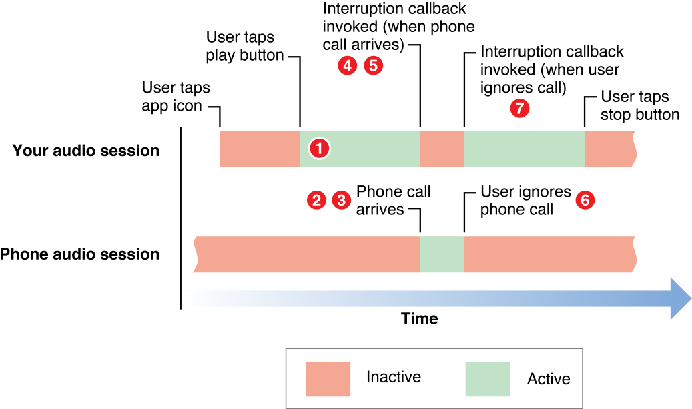

本文内容主要来源于 [Responding to Interruptions][3]。

当一个音频中断到来时，会关闭你的 Audio Session，这通常就意味着停止或暂停你的音频播放。产生中断通常是因为另一个和你的应用存在竞争性音频行为的应用此时被激活，而这个应用设置的 Category 不支持 mix 你的音频。正确的处理音频中断事件能够让你的应用提供给用户更好的体验。

当用户电话响起的时候，你的应用还会因中断而被挂起。当电话结束，你的应用才会被继续运行。这时你的 Audio Session 需要被重新激活。

## 音频中断处理技术

你可以通过监听音频中断相关的通知 [AVAudioSessionInterruptionNotification][4] 来处理中断事件。

当音频中断发生时，你应该做的事情大致如下：

- 中断开始后  
	- 1）保持状态和上下文；
	- 2）更新用户界面。 
- 中断结束后  
	- 1）恢复状态和上下文；
	- 2）在应用准备好时激活 Audio Session；
	- 3）更新用户界面。  

根据使用的音频技术不同，相应的处理中断的技术也会有所差别，大致如下：

- `AV Foundation framework`：AVAudioPlayer 类和 AVAudioRecorder 类提供了中断开始和结束的 Delegate 回调方法来供你处理中断。你可以实现这些回调方法来在对应的时候更新你的用户界面，以及在中断结束后恢复播放。使用这两个类播放或录制音频，当发生中断时，系统会自动暂停播放或录制，在中断结束时，当你恢复播放或录制时，系统会自动激活你的 Audio Session。如果你想要在应用退出/启动时，记录/恢复播放位置，那么在发生中断时，你也要记得记录一下播放位置。

- `Audio Queue Services, I/O audio unit`：这些技术需要你的应用自己来处理中断，你需要负责记录播放或录制的位置，以便在中断结束恢复 Audio Session 时用到。

- `OpenAL`：当使用 OpenAL 播放时，你需要注册对应的通知事件来监听中断。并且你还需要自己管理 OpenAL 的上下文。

- `System Sound Services`：使用 System Sound Services 播发音频，当中断发生时，音频播放会静音，当中断结束后，音频播放会恢复。你的应用则无法影响音频中断时的行为。

## 中断的生命周期

音频中断发生的过程大致如下图所示：

- 1）你的应用正在运行，在播放音频。
- 2）来了一个电话。系统激活电话应用的 Audio Session。
- 3）系统关闭你的 Audio Session。这时，你的应用里的音频播放被停止了。
- 4）系统调用你应用的中断监听回调方法，通知你：你的 Audio Session 已经被关闭了。
- 5）你的回调方法做出合适的处理，比如：更新用户界面，保持当前状态信息和上下文以便于恢复播放时用。
- 6）当用户解除中断，比如挂掉了电话，系统会调用你的回调方法，通知你：中断结束了。
- 7）你的回调方法做出合适的处理，比如：更新用户界面，重新激活 Audio Session，恢复播放。
- 8）如果在 6 中用户没有解除中断，比如接听了电话，系统会将你的应有挂起，当通话结束后，中断结束的消息会通知给你。

需要注意的是，有一个中断开始消息不一定会有一个中断结束消息，这就意味着你在中断结束的回调里的处理逻辑可能会没有被执行到。所以你的应用需要关注当切到前台运行状态时或者用户点击了播放按钮时，是不是需要重新激活你的 Audio Session，因为有可能这时候你的 Audio Session 还因为一次有开始通知没结束通知的中断给关闭着呢。

[SamirChen]: http://www.samirchen.com "SamirChen"
[1]: {{ page.url }} ({{ page.title }})
[2]: http://www.samirchen.com/ios-avaudiosession-4
[3]: https://developer.apple.com/library/ios/documentation/Audio/Conceptual/AudioSessionProgrammingGuide/HandlingAudioInterruptions/HandlingAudioInterruptions.html#//apple_ref/doc/uid/TP40007875-CH4-SW1
[4]: https://developer.apple.com/library/ios/documentation/AVFoundation/Reference/AVAudioSession_ClassReference/index.html#//apple_ref/c/data/AVAudioSessionInterruptionNotification

