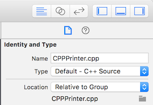

在有些 iOS 项目中，可能会用到一些用 C、C++ 开发的第三方代码或外部库，这时候可能就会涉及到 OC、C、C++ 代码的混编。

我创建了一个示例项目，地址在：[CrossCompileDemo][3]。

项目的结构大致是这样的：

- `AppDemo`，一个 App Project。其中主要为 OC 代码，依赖 `CrossCompileDemo`。
- `CrossCompileDemo`，一个 Framework Project。其中包含了 OC、C、C++ 代码混编，还依赖 `LogHelper`。
- `LogHelper`，一个 Static Library Project。其中主要为 C++ 代码。

具体的代码我这里就不贴了，可以直接 clone 项目来看。

Xcode 在编译代码时默认是根据文件的后缀名来匹配相应的编译命令，所以需要注意下面几点：

- 在 OC 中调用 C++ 代码时，需要将 OC 代码所在的 `.m` 文件后缀名修改为 `.mm`。
- 在 OC 的 `.mm` 文件中调用 C 代码，需要将 C 代码所在的文件后缀名(通常为 `.c`)修改为 `.mm`。
- AppDemo 中需要在 `Build Settings -> Other Link Flags` 添加 `-lstdc++`。

如果你不想修改文件后缀名，也希望 Xcode 正确编译，那么可以在 File inspector 中修改文件的类型来告诉 Xcode 每个文件的实际类型：

在一些情况下，你已经有一个 C、C++ 实现的项目，你现在需要把它编译为支持 armv7、arm64 等架构来适配 iOS 设备，这时你可以了解一下 [GYP][4] 这个工具，它可以帮助你把一个平台无关的项目迁移为一个 Xcode 项目从而支持对 armv7、arm64 等架构的编译。

[SamirChen]: http://www.samirchen.com "SamirChen"
[1]: {{ page.url }} ({{ page.title }})
[2]: http://www.samirchen.com/cross-compile-in-xcode
[3]: https://github.com/samirchen/CrossCompileDemo
[4]: https://gyp.gsrc.io/docs/UserDocumentation.md

