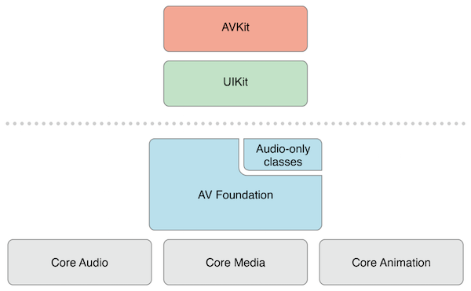
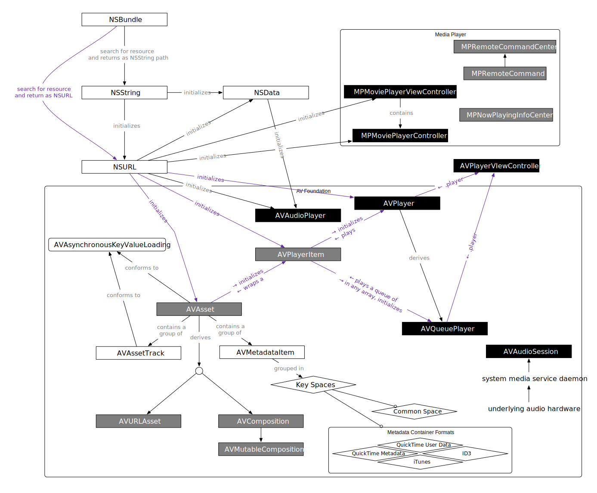
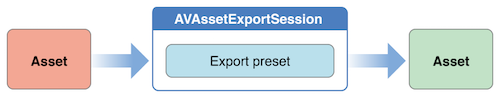

本文主要内容来自 [AVFoundation Programming Guide][3]。


要了解 iOS 上的音视频相关的内容，首先需要了解的就是 `AVFoundation` 这个框架。

下图是 `AVFoundation` 框架大的层级结构：



下图是 `AVFoundation` 框架中各个类的关系结构：



在 `AVFoundation` 框架中，最主要的表示媒体的类就是 `AVAsset`，甚至可以认为 `AVFoundation` 框架的大部分能力都是围绕着 `AVAsset` 展开的。

一个 `AVAsset` 实例表示的是一份或多份音视频数据（audio and video tracks）的集合，它描述的是这个集合作为一个整体对象的一些属性，比如：标题、时长、大小等，而不与具体的数据格式绑定。通常，在实际使用时我们可能会基于某个 URL 创建对应的媒体资源对象（AVURLAsset），或者直接创建 compositions（AVComposition），这些类都是 `AVAsset` 的子类。

一个 `AVAsset` 中的每一份音频或视频数据都称为一个**轨道（track）**。在最简单的情况下，一个媒体文件中可能只有两个轨道，一个音频轨道，一个视频轨道。而复杂的组合中，可能包含多个重叠的音频轨道和视频轨道。此外 `AVAsset` 也可能包含**元数据（metadata）**。

在 `AVFoundation` 中另一个非常重要的概念是，初始化一个 `AVAsset` 或者一个 `AVAssetTrack` 时并不一定意味着它已经可以立即使用，因为这需要一段时间来做计算，而这个计算可能会阻塞当前线程，所以通常你可以选用异步的方式来初始化，并通过回调来得到异步返回。


我们可以从一个文件或者用户的相册中来创建 asset。获得一个视频 asset 时，我们可以从中提出静态图，对其进行转码，裁剪器内容。


## 创建 Asset

当使用一个 URL 来创建 asset 时，可以用 `AVURLAsset`：

```
NSURL *url = <#A URL that identifies an audiovisual asset such as a movie file#>;
AVURLAsset *anAsset = [[AVURLAsset alloc] initWithURL:url options:nil];
```


### 设置 Asset 选项

可以看到当我们创建一个 `AVURLAsset` 时，是可以设置一个对象的 options 的，这里可选的设置项包括：

- `AVURLAssetPreferPreciseDurationAndTimingKey`，这个选项对应的值是布尔值，默认为 `@(NO)`，当设为 `@(YES)` 时表示 asset 应该提供精确的时长，并能根据时间准确地随机访问，提供这样的能力是需要开销更大的计算的。当你只是想播放视频时，你可以不设置这个选项，但是如果你想把这个 asset 添加到一个 composition（AVMutableComposition）中去做进一步编辑，你通常需要精确的随机访问，这时你最好设置这个选项为 YES。
- `AVURLAssetReferenceRestrictionsKey`，这个选项对应的值是 `AVAssetReferenceRestrictions` enum。有一些 asset 可以保护一些指向外部数据的引用，这个选项用来表示对外部数据访问的限制。具体含义参见 `AVAssetReferenceRestrictions`。
- `AVURLAssetHTTPCookiesKey`，这个选项用来设置 asset 通过 HTTP 请求发送的 HTTP cookies，当然 cookies 只能发给同站。具体参见文档。
- `AVURLAssetAllowsCellularAccessKey`，这个选项对应的值是布尔值，默认为 `@(YES)`。表示 asset 是否能使用移动网络资源。

不过你要注意这几个选项适用的 iOS 版本。


```
NSURL *url = <#A URL that identifies an audiovisual asset such as a movie file#>;
NSDictionary *options = @{ AVURLAssetPreferPreciseDurationAndTimingKey : @YES };
AVURLAsset *anAssetToUseInAComposition = [[AVURLAsset alloc] initWithURL:url options:options];
```


### 访问用户的 Asset

获取用户相册的资源时，你需要借用 `ALAssetsLibrary` 的相关接口：

```
ALAssetsLibrary *library = [[ALAssetsLibrary alloc] init];
 
// Enumerate just the photos and videos group by using ALAssetsGroupSavedPhotos.
[library enumerateGroupsWithTypes:ALAssetsGroupSavedPhotos usingBlock:^(ALAssetsGroup *group, BOOL *stop) {
 
// Within the group enumeration block, filter to enumerate just videos.
[group setAssetsFilter:[ALAssetsFilter allVideos]];
 
// For this example, we're only interested in the first item.
[group enumerateAssetsAtIndexes:[NSIndexSet indexSetWithIndex:0]
                        options:0
                     usingBlock:^(ALAsset *alAsset, NSUInteger index, BOOL *innerStop) {
 
                         // The end of the enumeration is signaled by asset == nil.
                         if (alAsset) {
                             ALAssetRepresentation *representation = [alAsset defaultRepresentation];
                             NSURL *url = [representation url];
                             AVAsset *avAsset = [AVURLAsset URLAssetWithURL:url options:nil];
                             // Do something interesting with the AV asset.
                         }
                     }];
                 }
                 failureBlock: ^(NSError *error) {
                     // Typically you should handle an error more gracefully than this.
                     NSLog(@"No groups");
                 }];
```


## 加载 Asset 来使用

初始化一个 `AVAsset` 或者一个 `AVAssetTrack` 时并不一定意味着它已经可以立即使用，因为这需要一段时间来做计算，而这个计算可能会阻塞当前线程，所以通常你可以选用异步的方式来初始化，并通过回调来得到异步返回。

这时你可以使用 `AVAsynchronousKeyValueLoading` protocol 来获取加载 asset 的状态，并在对应的 completion handler 中做对应的处理。`AVAsset` 和 `AVAssetTrack` 都是遵循 `AVAsynchronousKeyValueLoading` protocol 的。下面是一个示例：

```
NSURL *url = <#A URL that identifies an audiovisual asset such as a movie file#>;
AVURLAsset *anAsset = [[AVURLAsset alloc] initWithURL:url options:nil];
NSArray *keys = @[@"duration"];
 
[asset loadValuesAsynchronouslyForKeys:keys completionHandler:^() {
 
    NSError *error = nil;
    AVKeyValueStatus tracksStatus = [asset statusOfValueForKey:@"duration" error:&error];
    switch (tracksStatus) {
        case AVKeyValueStatusLoaded:
            [self updateUserInterfaceForDuration];
            break;
        case AVKeyValueStatusFailed:
            [self reportError:error forAsset:asset];
            break;
        case AVKeyValueStatusCancelled:
            // Do whatever is appropriate for cancelation.
            break;
   }
}];
```

需要注意的是：当你需要加载一个 asset 来点播，你应该加载它的 `tracks` 属性。


## 获取视频截图


我们可以用一个 `AVAssetImageGenerator` 实例来获取视频中的截图。即使初始化时在 asset 中没有检查到视觉 track，`AVAssetImageGenerator` 的初始化也可能会成功，所以必要的情况下，你可以用 `tracksWithMediaCharacteristic:` 方法去检查一下 asset 是否有可用的视觉 track。

```
AVAsset anAsset = <#Get an asset#>;
if ([[anAsset tracksWithMediaType:AVMediaTypeVideo] count] > 0) {
    AVAssetImageGenerator *imageGenerator = [AVAssetImageGenerator assetImageGeneratorWithAsset:anAsset];
    // Implementation continues...
}
```

我们可以配置一下 `AVAssetImageGenerator`，比如用 `maximumSize` 和 `apertureMode` 来指定生成图像的最大尺寸和光圈模式。接下来，可以生成指定时间的一张截图或者一系列图集。必须保证在生成图片时对 `AVAssetImageGenerator` 实例的强引用。


### 获取一张图片


我们可以用 `copyCGImageAtTime:actualTime:error:` 来获得指定时间的截图。`AVFoundation` 也许无法精确地获得你指定时间的截图，所以你需要传入一个 actualTime 参数来获得截图所对应的实际时间。


```
AVAsset *myAsset = <#An asset#>];
AVAssetImageGenerator *imageGenerator = [[AVAssetImageGenerator alloc] initWithAsset:myAsset];
 
Float64 durationSeconds = CMTimeGetSeconds([myAsset duration]);
CMTime midpoint = CMTimeMakeWithSeconds(durationSeconds/2.0, 600);
NSError *error;
CMTime actualTime;
 
CGImageRef halfWayImage = [imageGenerator copyCGImageAtTime:midpoint actualTime:&actualTime error:&error];
 
if (halfWayImage != NULL) {
 
    NSString *actualTimeString = (NSString *)CMTimeCopyDescription(NULL, actualTime);
    NSString *requestedTimeString = (NSString *)CMTimeCopyDescription(NULL, midpoint);
    NSLog(@"Got halfWayImage: Asked for %@, got %@", requestedTimeString, actualTimeString);
 
    // Do something interesting with the image.
    CGImageRelease(halfWayImage);
}
```

### 获取一组截图


我们可以用 `generateCGImagesAsynchronouslyForTimes:completionHandler:` 接口来传入一组时间来获取相应的一组截图。同样的，必须保证在生成图片时对 `AVAssetImageGenerator` 实例的强引用。示例代码如下：


```
AVAsset *myAsset = <#An asset#>];
// Assume: @property (strong) AVAssetImageGenerator *imageGenerator;
self.imageGenerator = [AVAssetImageGenerator assetImageGeneratorWithAsset:myAsset];
 
Float64 durationSeconds = CMTimeGetSeconds([myAsset duration]);
CMTime firstThird = CMTimeMakeWithSeconds(durationSeconds/3.0, 600);
CMTime secondThird = CMTimeMakeWithSeconds(durationSeconds*2.0/3.0, 600);
CMTime end = CMTimeMakeWithSeconds(durationSeconds, 600);
NSArray *times = @[NSValue valueWithCMTime:kCMTimeZero],
                  [NSValue valueWithCMTime:firstThird], [NSValue valueWithCMTime:secondThird],
                  [NSValue valueWithCMTime:end]];
 
[imageGenerator generateCGImagesAsynchronouslyForTimes:times
                completionHandler:^(CMTime requestedTime, CGImageRef image, CMTime actualTime, AVAssetImageGeneratorResult result, NSError *error) {
 
                NSString *requestedTimeString = (NSString *)
                    CFBridgingRelease(CMTimeCopyDescription(NULL, requestedTime));
                NSString *actualTimeString = (NSString *)
                    CFBridgingRelease(CMTimeCopyDescription(NULL, actualTime));
                NSLog(@"Requested: %@; actual %@", requestedTimeString, actualTimeString);
 
                if (result == AVAssetImageGeneratorSucceeded) {
                    // Do something interesting with the image.
                }
 
                if (result == AVAssetImageGeneratorFailed) {
                    NSLog(@"Failed with error: %@", [error localizedDescription]);
                }
                if (result == AVAssetImageGeneratorCancelled) {
                    NSLog(@"Canceled");
                }
}];
```

我们还能使用 `cancelAllCGImageGeneration` 接口来中断截图。


## 对视频进行裁剪和转码


我们可以使用一个 `AVAssetExportSession` 实例来对视频进行裁剪或格式转换。流程如下图所示：





`AVAssetExportSession` 实例用来控制异步的导出 asset。使用 export session 时，首先我们需要传入要导出的 asset 和对应的 preset 配置，我们可以用 `allExportPresets` 接口来查看所有可用的 preset 配置。接着，你需要设置导出的 URL 和文件类型。此外，我们还能设置导出视频文件的 metadata 以及导出的是否应该针对网络访问优化。


在下面的示例代码中，我们用 `exportPresetsCompatibleWithAsset:` 接口检查可用的 preset，用 `outputURL` 和 `outputFileType` 接口设置导出 URL 和导出文件类型，通过 `timeRange` 设置导出时间段。此外，我们还能用 `shouldOptimizeForNetworkUse` 接口设置是否针对网络使用优化以方便秒开，用 `maxDuration`、`fileLengthLimit` 设置导入限制等等。

我们用 `exportAsynchronouslyWithCompletionHandler:` 接口来开始导出。

```
AVAsset *anAsset = <#Get an asset#>;
NSArray *compatiblePresets = [AVAssetExportSession exportPresetsCompatibleWithAsset:anAsset];
if ([compatiblePresets containsObject:AVAssetExportPresetLowQuality]) {
    AVAssetExportSession *exportSession = [[AVAssetExportSession alloc] initWithAsset:anAsset presetName:AVAssetExportPresetLowQuality];

    exportSession.outputURL = <#A file URL#>;
    exportSession.outputFileType = AVFileTypeQuickTimeMovie;
 
    CMTime start = CMTimeMakeWithSeconds(1.0, 600);
    CMTime duration = CMTimeMakeWithSeconds(3.0, 600);
    CMTimeRange range = CMTimeRangeMake(start, duration);
    exportSession.timeRange = range;

    [exportSession exportAsynchronouslyWithCompletionHandler:^{
 
        switch ([exportSession status]) {
            case AVAssetExportSessionStatusFailed:
                NSLog(@"Export failed: %@", [[exportSession error] localizedDescription]);
                break;
            case AVAssetExportSessionStatusCancelled:
                NSLog(@"Export canceled");
                break;
            default:
                break;
        }
    }];
}
```

此外，我们还可以用 `cancelExport` 接口来取消导出。

当我们想要覆盖已有的文件，或者向应用沙盒外写文件时，导出会失败。此外，在导出时突然来了电话、导出时应用在后台状态并且其他应用开始播放时导出也可能会失败。在这些情况下，你需要提示用户导出失败，并允许用户重新导出。


[SamirChen]: http://www.samirchen.com "SamirChen"
[1]: {{ page.url }} ({{ page.title }})
[2]: http://www.samirchen.com/ios-av-asset
[3]: https://developer.apple.com/library/content/documentation/AudioVideo/Conceptual/AVFoundationPG/Articles/00_Introduction.html


