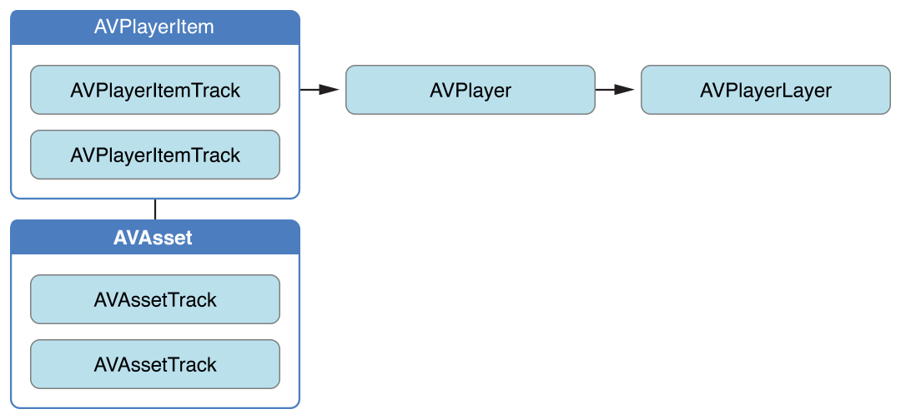
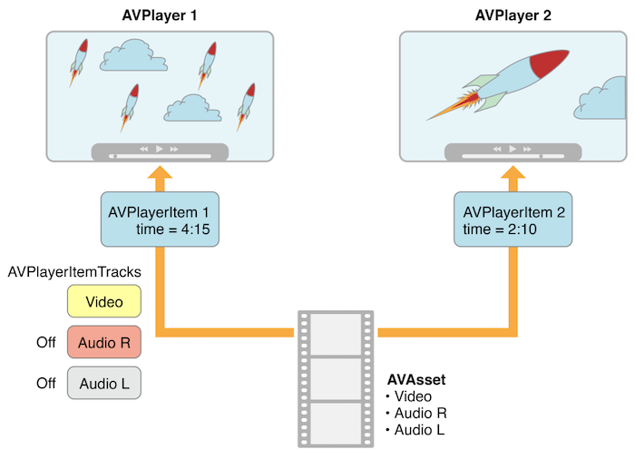

本文主要内容来自 [AVFoundation Programming Guide][3]。


要播放 `AVAsset` 可以使用 `AVPlayer`。在播放期间，可以使用一个 `AVPlayerItem` 实例来管理 asset 的整体的播放状态，使用 `AVPlayerItemTrack` 来管理各个 track 的播放状态。对于视频的渲染，使用 `AVPlayerLayer` 来处理。


## 播放 Asset


`AVPlayer` 是一个控制 asset 播放的控制器，它的功能包括：开始播放、停止播放、seek 等等。你可以使用 `AVPlayer` 来播放单个 asset。如果你想播放一组 asset，你可以使用 `AVQueuePlayer`，`AVQueuePlayer` 是 `AVPlayer` 的子类。

`AVPlayer` 也会提供当前的播放状态，这样我们就可以根据当前的播放状态调整交互。我们需要将 `AVPlayer` 的画面输出到一个特定的 Core Animation Layer 上，通常是一个 `AVPlayerLayer` 或 `AVSynchronizedLayer` 实例。

需要注意的是，你可以从一个 `AVPlayer` 实例创建多个 `AVPlayerLayer` 对象，但是只有最新创建的那个才会渲染画面到屏幕。


对于 `AVPlayer` 来说，虽然最终播放的是 asset，但是我们并不直接提供一个 `AVAsset` 给它，而是提供一个 `AVPlayerItem` 实例。`AVPlayerItem` 是用来管理与之关联的 asset 的播放状态的，一个 `AVPlayerItem` 包含了一组 `AVPlayerItemTrack` 实例，对应着 asset 中的音视频轨道。它们直接的关系大致如下图所示：



注意：该图的原图是苹果官方文档上的，但是原图是有错的，把 `AVPlayerItemTrack` 所属的框标成了 `AVAsset`，这里做了修正。


这种实现方式就意味着，我们可以用多个播放器同时播放一个 asset，并且各个播放器可以使用不同的模式来渲染。下图就展示了一种用两个不同的 `AVPlayer` 采用不同的设置播放同一个 `AVAsset` 的场景。在播放中，还可以禁掉某些 track 的播放。




我们可以通过网络来加载 asset，通常简单的初始化 `AVPlayerItem` 后并不意味着它就直接能播放，所以我们可以 KVO `AVPlayerItem` 的 `status` 属性来监听它是否已经可播再决定后续的行为。


## 处理不同类型的 Asset


我们配置 asset 来播放的方式多多少少会依赖 asset 的类型，一般我们有两种不同类型的 asset：

- 1）基于文件的 asset，一般可以来源于本地视频文件、相册资源库等等。
- 2）流式 asset，比如 HLS 格式的视频。


加载基于文件的 asset 一般分为如下几步：

- 基于文件路径的 URL 创建 `AVURLAsset` 实例。
- 基于 `AVURLAsset` 实例创建 `AVPlayerItem` 实例。
- 将 `AVPlayerItem` 实例与一个 `AVPlayer` 实例关联。
- KVO 监测 `AVPlayerItem` 的 `status` 属性来等待其已经可播，即加载完成。


创建并加载一个 HTTP Live Stream（HLS）格式的资源来播放时，可以按照下面几步来做：

- 基于资源的 URL 初始化一个 `AVPlayerItem` 实例，因为你无法直接创建一个 `AVAsset` 来表示 HLS 资源。
- 当你将 `AVPlayerItem` 和 `AVPlayer` 实例关联起来后，他就开始为播放做准备，当一切就绪时 `AVPlayerItem` 会创建出  `AVAsset` 和 `AVAssetTrack` 实例以用来对接 HLS 视频流的音视频内容。
- 要获取视频流的时长，你需要 KVO 监测 `AVPlayerItem` 的 `duration` 属性，当资源可以播放时，它会被更新为正确的值。


```
NSURL *url = [NSURL URLWithString:@"<#Live stream URL#>];
// You may find a test stream at <http://devimages.apple.com/iphone/samples/bipbop/bipbopall.m3u8>.
self.playerItem = [AVPlayerItem playerItemWithURL:url];
[playerItem addObserver:self forKeyPath:@"status" options:0 context:&ItemStatusContext];
self.player = [AVPlayer playerWithPlayerItem:playerItem];
```

当你不知道一个 URL 对应的是什么类型的 asset 时，你可以这样做：

- 尝试基于 URL 来初始化一个 `AVURLAsset`，并加载它的 `tracks` 属性。如果 `tracks` 属性加载成功，就基于 asset 来创建一个 `AVPlayerItem` 实例。
- 如果 `tracks` 属性加载失败，那么就直接基于 URL 创建一个 `AVPlayerItem` 实例，并 KVO 监测 `AVPlayer` 的 `status` 属性来看它何时可以播放。
- 如果上述尝试都失败，那就清理掉 `AVPlayerItem`。


## 播放一个 AVPlayerItem


[SamirChen]: http://www.samirchen.com "SamirChen"
[1]: {{ page.url }} ({{ page.title }})
[2]: http://www.samirchen.com/ios-av-playback
[3]: https://developer.apple.com/library/content/documentation/AudioVideo/Conceptual/AVFoundationPG/Articles/00_Introduction.html