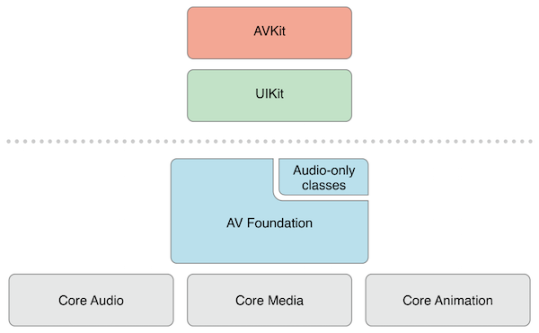
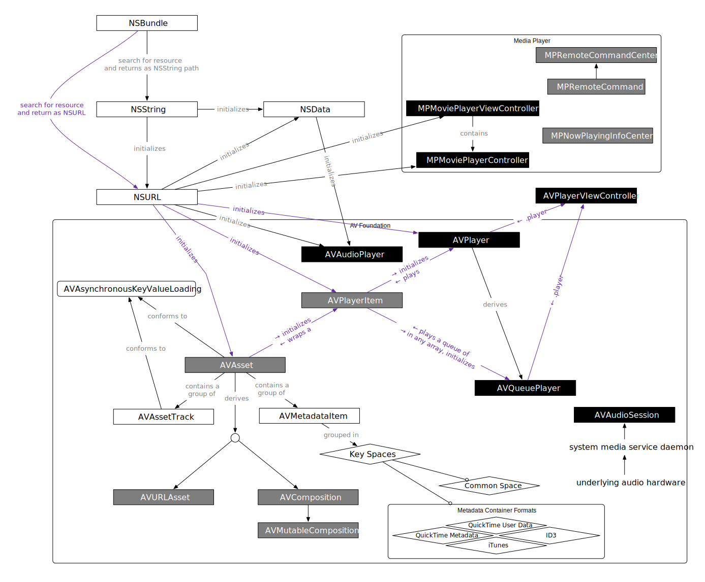
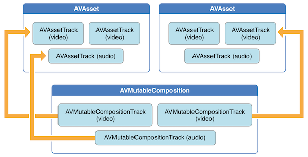
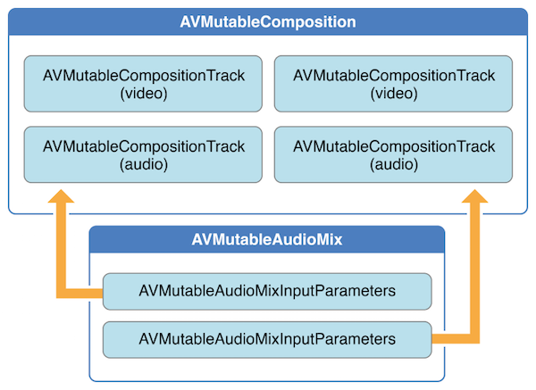
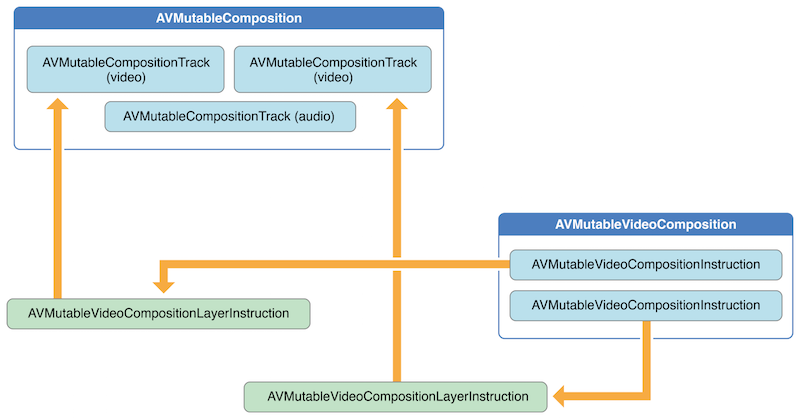
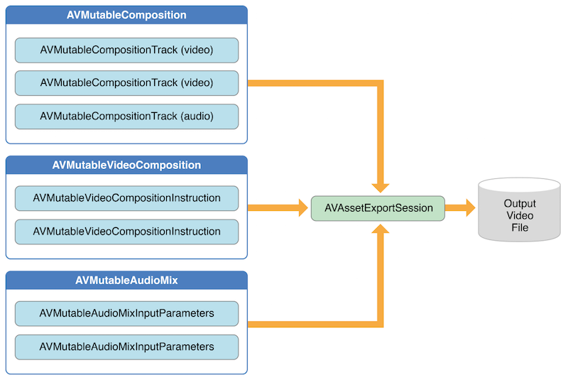

要了解 iOS 上的音视频编辑相关的内容，首先需要了解的就是 `AVFoundation` 这个框架。

下图是 `AVFoundation` 框架大的层级结构：

下图是 `AVFoundation` 框架中各个类的关系结构：

在 `AVFoundation` 框架中，最主要的表示媒体的类就是 `AVAsset`，甚至可以认为 `AVFoundation` 框架的大部分能力都是围绕着 `AVAsset` 展开的。

一个 `AVAsset` 实例表示的是一份或多份音视频数据（audio and video tracks）的集合，它描述的是这个集合作为一个整体对象的一些属性，比如：标题、时长、大小等，而不与具体的数据格式绑定。通常，在实际使用时我们可能会基于某个 URL 创建对应的媒体资源对象（AVURLAsset），或者直接创建 compositions（AVComposition），这些类都是 `AVAsset` 的子类。

一个 `AVAsset` 中的每一份音频或视频数据都称为一个**轨道（track）**。在最简单的情况下，一个媒体文件中可能只有两个轨道，一个音频轨道，一个视频轨道。而复杂的组合中，可能包含多个重叠的音频轨道和视频轨道。此外 `AVAsset` 也可能包含**元数据（metadata）**。

在 `AVFoundation` 中另一个非常重要的概念是，初始化一个 `AVAsset` 或者一个 `AVAssetTrack` 时并不一定意味着它已经可以立即使用，因为这需要一段时间来做计算，而这个计算可能会阻塞当前线程，所以通常你可以选用异步的方式来初始化，并通过回调来得到异步返回。

## 音视频编辑

上面简单了解了下 `AVFoundation` 框架后，我们来看看跟音视频编辑相关的接口。

一个 composition 可以简单的认为是一组轨道（tracks）的集合，这些轨道可以是来自不同媒体资源（asset）。`AVMutableComposition` 提供了接口来插入或者删除轨道，也可以调整这些轨道的顺序。

下面这张图反映了一个新的 composition 是怎么从已有的 asset 中获取对应的 track 并进行拼接形成新的 asset。

在处理音频时，你可以在使用 `AVMutableAudioMix` 类的接口来做一些自定义的操作，如下图所示。现在，你可以做到指定一个最大音量或设置一个音频轨道的音量斜坡。

如下图所示，我们还可以使用 `AVMutableVideoComposition` 来直接处理 composition 中的视频轨道。处理一个单独的 video composition 时，你可以指定它的渲染尺寸、缩放比例、帧率等参数并输出最终的视频文件。通过一些针对 video composition 的指令（AVMutableVideoCompositionInstruction 等），我们可以修改视频的背景颜色、应用 layer instructions。这些 layer instructions（AVMutableVideoCompositionLayerInstruction 等）可以用来对 composition 中的视频轨道实施图形变换、添加图形变换坡道、透明度变换、增加透明度变换坡道。此外，你还能通过设置 video composition 的 `animationTool` 属性来应用 Core Animation Framework 框架中的动画效果。

如下图所示，你可以使用 `AVAssetExportSession` 相关的接口来合并你的 composition 中的 audio mix 和 video composition。你只需要初始化一个 `AVAssetExportSession` 对象，然后将其 `audioMix` 和 `videoComposition` 属性分别设置为你的 audio mix 和 video composition 即可。

## 创建 Composition

上面简单介绍了集中音视频编辑的场景，现在我们来详细介绍具体的接口。从 `AVMutableComposition` 开始。

[SamirChen]: http://www.samirchen.com "SamirChen"
[1]: {{ page.url }} ({{ page.title }})
[2]: http://www.samirchen.com/ios-av-edit
[3]: http://www.jianshu.com/p/5433143cccd8
[4]: https://developer.apple.com/library/content/samplecode/AVSimpleEditoriOS/Introduction/Intro.html
[5]: http://www.jianshu.com/p/02e872ecf0d1
[6]: http://yoferzhang.com/post/20160724AVFoundation/
[7]: https://developer.apple.com/library/content/documentation/AudioVideo/Conceptual/AVFoundationPG/Articles/00_Introduction.html

<!-- AVCam-iOS: Using AVFoundation to Capture Images and Movies is the canonical sample code for implementing any program that uses the camera functionality. It is a complete sample, well documented, and covers the majority of the functionality showing the best practices. -->
[8]: https://developer.apple.com/library/content/samplecode/AVCam/Introduction/Intro.html

<!-- AVCamManual: Extending AVCam to Use Manual Capture API is the companion application to AVCam. It implements Camera functionality using the manual camera controls. It is also a complete example, well documented, and should be considered the canonical example for creating camera applications that take advantage of manual controls. -->
[9]: https://developer.apple.com/library/content/samplecode/AVCamManual/Introduction/Intro.html

<!-- RosyWriter is an example that demonstrates real time frame processing and in particular how to apply filters to video content. This is a very common developer requirement and this example covers that functionality. -->
[10]: https://developer.apple.com/library/content/samplecode/RosyWriter/Introduction/Intro.html

<!-- AVLocationPlayer: Using AVFoundation Metadata Reading APIs demonstrates using the metadata APIs. -->
[11]: https://developer.apple.com/library/content/samplecode/AVLocationPlayer/Introduction/Intro.html
