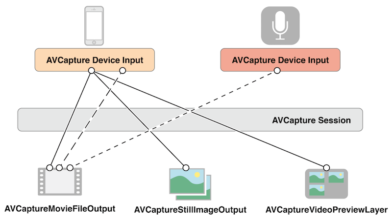
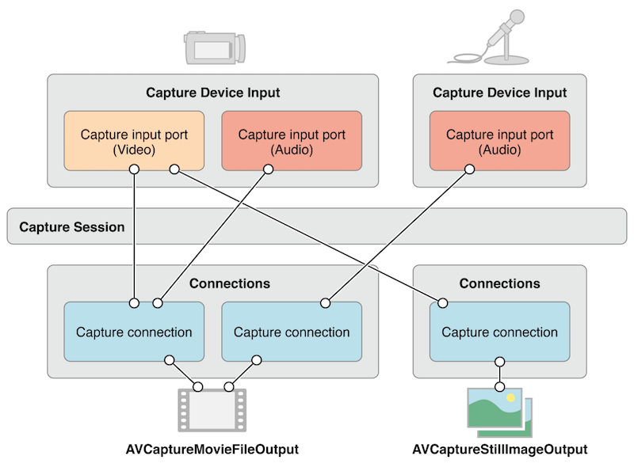

本文主要内容来自 [AVFoundation Programming Guide][3]。


采集设备的音视频时，我们需要组装各路数据，这时可以使用 `AVCaptureSession` 对象来协调。

- 一个 `AVCaptureDevice` 对象表示输入设备，比如摄像头或者麦克风。
- 一个 `AVCaptureInput` 具体子类的实例可以用来配置输出设备的端口。
- 一个 `AVCaptureOutput` 具体子类的实例可以用来将音视频数据输出到一个视频文件或静态图片。
- 一个 `AVCaptureSession` 实例用来协调输入输出的数据流。

在录制视频时，为了让用户看到预览效果，我们可以使用 `AVCaptureVideoPreviewLayer`。

下图展示了通过一个 capture session 实例来协调多路输入输出数据：




对于大多数应用场景，这些细节已经足够我们用了。但是对于有些操作，比如当我们想要监测一个音频通道的强度，我们需要了解不同的输入设备的端口对应的对象，以及这些端口和输出是如何连接起来的。


在音视频录制时，输入和输出之间的连接是用 `AVCaptureConnection` 来表示的。输入方(`AVCaptureInput`)包含一个或多个输入端口(`AVCaptureInputPort`)，输出端(`AVCaptureOutput`)可以从一个或多个数据源接收数据，比如一个 `AVCaptureMovieFileOutput` 就可以同时接收视频和音频数据。


当你往一次录制 session 中添加一个输入或输出时，这个 session 会生成所有兼容的输入和输出端口间的连接，由 `AVCaptureConnection` 对象表示。





You can use a capture connection to enable or disable the flow of data from a given input or to a given output. You can also use a connection to monitor the average and peak power levels in an audio channel.

我们可以用 connetion 对象来控制输入输出端之间的数据流的断开或连接，我们还能用它来监控 audio 通道的平均值和峰值。


## 使用 Capture Session 来协调数据流


`AVCaptureSession` 是我们用来管理数据捕获的核心协调者，我们用它来协调音视频输入和输出端的数据流。我们可以将我们需要的捕获设备添加到 session 中，然后用 `startRunning` 接口启动数据流，用 `stopRunning` 停止数据流。

```
AVCaptureSession *session = [[AVCaptureSession alloc] init];
// Add inputs and outputs.
[session startRunning];
```


### 配置 Session


我们可以给 session 设置我们需要的图像质量和分辨率。以下是其中的几个配置选项：

- AVCaptureSessionPresetHigh，高分辨率，具体值取决于设备能提供的最高分辨率。
- AVCaptureSessionPresetMedium，中等分辨率，具体值取决于设备。
- AVCaptureSessionPresetLow，低分辨率，具体指取决于设备。
- AVCaptureSessionPreset640x480，分辨率为 640x480，常称为 480P。
- AVCaptureSessionPreset1280x720，分辨率为 1280x720，常称为 720P。
- AVCaptureSessionPresetPhoto，全尺寸相片的分辨率，这个选项不支持输出视频。


如果要使用某种分辨率选项，我们需要先测试一下设备是否支持：


```
if ([session canSetSessionPreset:AVCaptureSessionPreset1280x720]) {
    session.sessionPreset = AVCaptureSessionPreset1280x720;
}
else {
    // Handle the failure.
}
```


如果想对 session 的配置参数做更细粒度的控制，或者想修改已经在运行状态的 session 的配置参数，我们需要在 `beginConfiguration` 和 `commitConfiguration` 方法直接做修改。这两个方法的配合，可以使得我们队设备的修改是以一个 group 的方式提交，从而尽量避免视觉或者状态上的不一致性。在调用了 `beginConfiguration` 之后，我们可以增加或删除输出端，修改 `sessionPreset` 值，单独配置视频捕获的输入或输出参数。知道我们调用了 `commitConfiguration`，这些修改采用被提交并一起应用。


```
[session beginConfiguration];
// Remove an existing capture device.
// Add a new capture device.
// Reset the preset.
[session commitConfiguration];
```


### 监控 Session 状态


录制过程中 session 会发出通知来告知其对应的状态，比如 session 开始、结束、被打断。我们可以从 `AVCaptureSessionRuntimeErrorNotification` 来接收 session 运行时的错误。我们也可以差选 session 的运行时属性来获取其状态是在运行中还是被打断。此外，这些属性都是支持 KVO 监测的，并且通知会被发送到主线程。


## 使用 AVCaptureDevice 来表示输入设备


`AVCaptureDevice` 是由我们现实中物理的提供输入数据（比如音频或视频输入）的设备抽象而来，每个 `AVCaptureDevice` 对象都对应着一个输入设备，比如我们常见的前置摄像头、后置摄像头、麦克风。它们采集的数据将会输出给 `AVCaptureSession` 实例。

我们可以使用 `AVCaptureDevice` 的 `devices` 和 `devicesWithMediaType:` 类方法来检查哪些是当前可用的设备。如果需要，我们还可以获取设备支持哪些功能。当前可用的设备列表是会动态变化的，有些设备会因为被别的应用使用而变得不可用，有的设备也有可能突然就可用了，所以我们需要注册 `AVCaptureDeviceWasConnectedNotification` 和 `AVCaptureDeviceWasDisconnectedNotification` 通知来感知当前可用设备的变化情况。

我们可以使用 capture input 来想向一个 `AVCaptureSession` 中添加输入设备。


### 设备特性


[SamirChen]: http://www.samirchen.com "SamirChen"
[1]: {{ page.url }} ({{ page.title }})
[2]: http://www.samirchen.com/ios-av-asset
[3]: https://developer.apple.com/library/content/documentation/AudioVideo/Conceptual/AVFoundationPG/Articles/00_Introduction.html