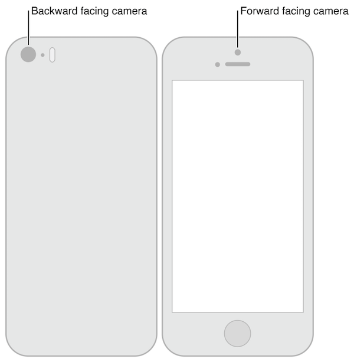

本文主要内容来自 [AVFoundation Programming Guide][3]。


采集设备的音视频时，我们需要组装各路数据，这时可以使用 `AVCaptureSession` 对象来协调。

- 一个 `AVCaptureDevice` 对象表示输入设备，比如摄像头或者麦克风。
- 一个 `AVCaptureInput` 具体子类的实例可以用来配置输出设备的端口。
- 一个 `AVCaptureOutput` 具体子类的实例可以用来将音视频数据输出到一个视频文件或静态图片。
- 一个 `AVCaptureSession` 实例用来协调输入输出的数据流。

在录制视频时，为了让用户看到预览效果，我们可以使用 `AVCaptureVideoPreviewLayer`。

下图展示了通过一个 capture session 实例来协调多路输入输出数据：


对于大多数应用场景，这些细节已经足够我们用了。但是对于有些操作，比如当我们想要监测一个音频通道的强度，我们需要了解不同的输入设备的端口对应的对象，以及这些端口和输出是如何连接起来的。


在音视频录制时，输入和输出之间的连接是用 `AVCaptureConnection` 来表示的。输入方(`AVCaptureInput`)包含一个或多个输入端口(`AVCaptureInputPort`)，输出端(`AVCaptureOutput`)可以从一个或多个数据源接收数据，比如一个 `AVCaptureMovieFileOutput` 就可以同时接收视频和音频数据。


当你往一次录制 session 中添加一个输入或输出时，这个 session 会生成所有兼容的输入和输出端口间的连接，由 `AVCaptureConnection` 对象表示。


You can use a capture connection to enable or disable the flow of data from a given input or to a given output. You can also use a connection to monitor the average and peak power levels in an audio channel.

我们可以用 connetion 对象来控制输入输出端之间的数据流的断开或连接，我们还能用它来监控 audio 通道的平均值和峰值。


## 使用 Capture Session 来协调数据流


`AVCaptureSession` 是我们用来管理数据捕获的核心协调者，我们用它来协调音视频输入和输出端的数据流。我们可以将我们需要的捕获设备添加到 session 中，然后用 `startRunning` 接口启动数据流，用 `stopRunning` 停止数据流。

```
AVCaptureSession *session = [[AVCaptureSession alloc] init];
// Add inputs and outputs.
[session startRunning];
```


### 配置 Session


我们可以给 session 设置我们需要的图像质量和分辨率。以下是其中的几个配置选项：

- AVCaptureSessionPresetHigh，高分辨率，具体值取决于设备能提供的最高分辨率。
- AVCaptureSessionPresetMedium，中等分辨率，具体值取决于设备。
- AVCaptureSessionPresetLow，低分辨率，具体指取决于设备。
- AVCaptureSessionPreset640x480，分辨率为 640x480，常称为 480P。
- AVCaptureSessionPreset1280x720，分辨率为 1280x720，常称为 720P。
- AVCaptureSessionPresetPhoto，全尺寸相片的分辨率，这个选项不支持输出视频。


如果要使用某种分辨率选项，我们需要先测试一下设备是否支持：


```
if ([session canSetSessionPreset:AVCaptureSessionPreset1280x720]) {
    session.sessionPreset = AVCaptureSessionPreset1280x720;
}
else {
    // Handle the failure.
}
```


如果想对 session 的配置参数做更细粒度的控制，或者想修改已经在运行状态的 session 的配置参数，我们需要在 `beginConfiguration` 和 `commitConfiguration` 方法直接做修改。这两个方法的配合，可以使得我们队设备的修改是以一个 group 的方式提交，从而尽量避免视觉或者状态上的不一致性。在调用了 `beginConfiguration` 之后，我们可以增加或删除输出端，修改 `sessionPreset` 值，单独配置视频捕获的输入或输出参数。知道我们调用了 `commitConfiguration`，这些修改采用被提交并一起应用。


```
[session beginConfiguration];
// Remove an existing capture device.
// Add a new capture device.
// Reset the preset.
[session commitConfiguration];
```


### 监控 Session 状态


录制过程中 session 会发出通知来告知其对应的状态，比如 session 开始、结束、被打断。我们可以从 `AVCaptureSessionRuntimeErrorNotification` 来接收 session 运行时的错误。我们也可以差选 session 的运行时属性来获取其状态是在运行中还是被打断。此外，这些属性都是支持 KVO 监测的，并且通知会被发送到主线程。


## 使用 AVCaptureDevice 来表示输入设备


`AVCaptureDevice` 是由我们现实中物理的提供输入数据（比如音频或视频输入）的设备抽象而来，每个 `AVCaptureDevice` 对象都对应着一个输入设备，比如我们常见的前置摄像头、后置摄像头、麦克风。它们采集的数据将会输出给 `AVCaptureSession` 实例。

我们可以使用 `AVCaptureDevice` 的 `devices` 和 `devicesWithMediaType:` 类方法来检查哪些是当前可用的设备。如果需要，我们还可以获取设备支持哪些功能。当前可用的设备列表是会动态变化的，有些设备会因为被别的应用使用而变得不可用，有的设备也有可能突然就可用了，所以我们需要注册 `AVCaptureDeviceWasConnectedNotification` 和 `AVCaptureDeviceWasDisconnectedNotification` 通知来感知当前可用设备的变化情况。

我们可以使用 capture input 来想向一个 `AVCaptureSession` 中添加输入设备。


### 设备特性


我们可以查询采集设备的不同特性。比如，我们可以使用 `hasMediaType:` 接口来判断采集设备是否支持某种媒体类型，也可以使用 `supportsAVCaptureSessionPreset:` 接口来判断采集设备是否支持预设的 session preset。我们还能获取设备的位置、本地化命名等信息以便于展示给用户。




下面的示例代码展示了如何遍历设备，并打印设备名：

```
NSArray *devices = [AVCaptureDevice devices];
 
for (AVCaptureDevice *device in devices) {
 
    NSLog(@"Device name: %@", [device localizedName]);
 
    if ([device hasMediaType:AVMediaTypeVideo]) {
 
        if ([device position] == AVCaptureDevicePositionBack) {
            NSLog(@"Device position : back");
        }
        else {
            NSLog(@"Device position : front");
        }
    }
}
```

此外，你还能查出设备的 model ID 和 unique ID。


### 设备录制设置

不同的设备有不同的能力，比如有些设备支持不同的对焦或刷新模式。下面的代码展示了如何找到一个支持手电筒以及预设的 preset 的设备。


```
NSArray *devices = [AVCaptureDevice devicesWithMediaType:AVMediaTypeVideo];
NSMutableArray *torchDevices = [[NSMutableArray alloc] init];
 
for (AVCaptureDevice *device in devices) {
    [if ([device hasTorch] &&
         [device supportsAVCaptureSessionPreset:AVCaptureSessionPreset640x480]) {
        [torchDevices addObject:device];
    }
}
```

如果你找到多个设备，你可以向用户展示设备的 `localizedName` 来让用户选择他们需要的设备。在使用对应的设备时，我们可以设置设备的各种工作模式，但是有一点需要注意的是在设置前需要对设备加锁。


#### 聚焦模式

目前支持的聚焦模式有以下几种：

- `AVCaptureFocusModeLocked`：聚焦点固定。通常以拍摄场景的中点作为焦点。
- `AVCaptureFocusModeAutoFocus`：自动聚焦。这种模式可以让用户选择一件事物来进行对焦，即使对于的位置不是拍摄场景的中点。
- `AVCaptureFocusModeContinuousAutoFocus`：相机将持续自动对焦。


我们可以使用 `isFocusModeSupported:` 接口来检查设备是否支持相应的聚焦模式，然后设置对应的 `focusMode` 属性。

我们还能用 `focusPointOfInterestSupported` 来检查设备是否支持指定焦点，如果支持，我们就可以设置对应的 `focusPointOfInterest` 属性。其中 `{0, 0}` 表示左上角，`{1, 1}` 表示右下角。

我们可以访问 `adjustingFocus` 属性来获知相机是否正在对焦，这个属性是支持 KVO 的，所以我们可以监测它来获知对焦状态的变化。

如果你修改过了相机的对焦模式相关的设置，你可以用下面的代码将其恢复到默认状态：

```
if ([currentDevice isFocusModeSupported:AVCaptureFocusModeContinuousAutoFocus]) {
    CGPoint autofocusPoint = CGPointMake(0.5f, 0.5f);
    [currentDevice setFocusPointOfInterest:autofocusPoint];
    [currentDevice setFocusMode:AVCaptureFocusModeContinuousAutoFocus];
}
```


#### 曝光模式

目前支持的曝光模式有以下几种：


- `AVCaptureExposureModeLocked`，曝光等级锁定。
- `AVCaptureExposureModeAutoExpose`，相机自动根据情况调整一次曝光等级，然后将曝光模式切换到 `AVCaptureExposureModeLocked`。
- `AVCaptureExposureModeContinuousAutoExposure`，相机随时根据情况调整曝光等级。
- `AVCaptureExposureModeCustom`，用户自定义曝光等级。

我们可以通过 `isExposureModeSupported:` 来检查设备是否支持对应的模式，然后设置对应的 `exposureMode` 属性。


我们还能用 `exposurePointOfInterestSupported` 来检查设备是否支持指定曝光点，如果支持，我们就可以设置对应的 `exposurePointOfInterest` 属性。其中 `{0, 0}` 表示左上角，`{1, 1}` 表示右下角。

我们可以访问 `adjustingExposure` 属性来获知相机是否正在改变曝光设置，这个属性是支持 KVO 的，所以我们可以监测它来获知曝光状态的变化。

如果你修改过了相机的曝光模式相关的设置，你可以用下面的代码将其恢复到默认状态：

```
if ([currentDevice isExposureModeSupported:AVCaptureExposureModeContinuousAutoExposure]) {
    CGPoint exposurePoint = CGPointMake(0.5f, 0.5f);
    [currentDevice setExposurePointOfInterest:exposurePoint];
    [currentDevice setExposureMode:AVCaptureExposureModeContinuousAutoExposure];
}
```


#### 闪光灯模式

目前支持的闪光灯模式有如下几种：

- `AVCaptureFlashModeOff`，不会闪光。
- `AVCaptureFlashModeOn`，会闪光。
- `AVCaptureFlashModeAuto`，根据具体情况决定是否闪光。

我们可以通过 `hasFlash` 检查设备是否有闪光灯，可以通过 `isFlashModeSupported:` 检查设备是否支持对应的模式，通过 `flashMode` 设置对应的模式。


#### 手电筒模式

在手电筒模式下，闪光灯会以低耗电量模式持续打开来为图像录制来照明。目前支持的模式有以下几种：

- `AVCaptureTorchModeOff`，关闭。
- `AVCaptureTorchModeOn`，开启。
- `AVCaptureTorchModeAuto`，自动。


我们可以通过 `hasTorch` 检查设备是否有闪光灯，可以通过 `isTorchModeSupported:` 检查设备是否支持对应的手电筒模式，通过 `torchMode` 设置对应的模式。


#### 视频防抖

视频防抖主要依赖于硬件，虽然如此，也不是所有的视频格式和分辨率都能支持。此外，开启防抖也会带来为视频录制带来一定的延迟。我们可以通过 `videoStabilizationEnabled` 来检查是否启动了防抖，通过 `enablesVideoStabilizationWhenAvailable` 来允许应用在条件支持的情况下自动开启防抖。


#### 白平衡


目前支持面几种白平衡模式：


- `AVCaptureWhiteBalanceModeLocked`，固定模式。
- `AVCaptureWhiteBalanceModeAutoWhiteBalance`，自动模式。相机根据情况调整一次白平衡，然后切换至 `AVCaptureWhiteBalanceModeLocked` 模式。
- `AVCaptureWhiteBalanceModeContinuousAutoWhiteBalance`，相机随时根据情况调整白平衡。


我们可以通过 `isWhiteBalanceModeSupported:` 检查是否支持给定的模式，然后通过 `whiteBalanceMode` 设置对应模式。


我们可以访问 `adjustingWhiteBalance` 属性来获知相机是否正在改变白平衡设置，这个属性是支持 KVO 的，所以我们可以监测它来获知白平衡状态的变化。


#### 设置方向


我们可以通过 `AVCaptureConnection` 实例来设置想要在 AVCaptureOutput(AVCaptureMovieFileOutput, AVCaptureStillImageOutput, AVCaptureVideoDataOutput) 获得的图像方向。

我们通过 `isVideoOrientationSupported` 检查是否支持改变视频方向，通过 `videoOrientation` 设置方向。

下面是示例代码：

```
AVCaptureConnection *captureConnection = <#A capture connection#>;
if ([captureConnection isVideoOrientationSupported]) {
    AVCaptureVideoOrientation orientation = AVCaptureVideoOrientationLandscapeLeft;
    [captureConnection setVideoOrientation:orientation];
}
```


### 配置设备

在设置设备的相关属性前，我们需要使用 `lockForConfiguration:` 来获取一个对设备操作的锁，这样可以避免你在使用设备时被别的应用更改了设置而导致不兼容等问题。

```
if ([device isFocusModeSupported:AVCaptureFocusModeLocked]) {
    NSError *error = nil;
    if ([device lockForConfiguration:&error]) {
        device.focusMode = AVCaptureFocusModeLocked;
        [device unlockForConfiguration];
    }
    else {
        // Respond to the failure as appropriate.
```

你应该只在希望设备的设置不能被修改时保持设备锁，不正确的持有设备锁可能会影响其他程序的录制质量。


### 设备切换

有时候你可能需要在使用时切换设备，比如切换前后摄像头。这时为了避免卡顿或者闪屏，我们可以重新配置一个正在执行的 session，但是我们在修改前后需要分别使用 `beginConfiguration` 和 `commitConfiguration`：

```
AVCaptureSession *session = <#A capture session#>;
[session beginConfiguration];
 
[session removeInput:frontFacingCameraDeviceInput];
[session addInput:backFacingCameraDeviceInput];
 
[session commitConfiguration];
```


当最外的 `commitConfiguration` 被调用时，所有的配置修改会被一起提交，这样可以保证平滑的切换。


## 使用 Capture Inputs 来给一个 Session 添加设备


我们可以用 `AVCaptureDeviceInput` 来给一个 session 添加设备。`AVCaptureDeviceInput` 是用来管理设备的端口。


```
NSError *error;
AVCaptureDeviceInput *input = [AVCaptureDeviceInput deviceInputWithDevice:device error:&error];
if (!input) {
    // Handle the error appropriately.
}
```

我们用 `addInput:` 来添加设备。我们还可以在添加前用 `canAddInput:` 来检查一下。


```
AVCaptureSession *captureSession = <#Get a capture session#>;
AVCaptureDeviceInput *captureDeviceInput = <#Get a capture device input#>;
if ([captureSession canAddInput:captureDeviceInput]) {
    [captureSession addInput:captureDeviceInput];
}
else {
    // Handle the failure.
}
```


`AVCaptureInput` 声明一个或者多个媒体数据流。例如，输入设备可以同时提供音频和视频数据。输入提供的每个媒体流都被一个 `AVCaptureInputPort` 所表示。一个会话使用 `AVCaptureConnection` 对象来定义一组 `AVCaptureInputPort` 对象和一个 `AVCaptureOutput` 之间的映射。


## 使用 Capture Outputs 来从一个 Session 获取输出

要从一个 capture session 中获取输出，我们需要给它添加一个或多个输出实例，输出实例都是 `AVCaptureOutput` 的子类。比如：

- `AVCaptureMovieFileOutput`，输出电影文件。
- `AVCaptureVideoDataOutput`，当我们需要处理录制得到的视频帧时（比如创建自定义的渲染层），可以用这个。
- `AVCaptureAudioDataOutput`，当我们需要处理录制到的音频数据时，可以用这个。
- `AVCaptureStillImageOutput`，当我们需要获取静态图片以及对应的 metadata 时，可以用这个。


我们可以使用 `addOutput:` 向 session 中添加输出实例，我们也可以在加之前，通过 `canAddOutput:` 来检测要添加的输出实例是否是兼容的。我们可以往一个正在运行状态的 session 中添加输出实例。

```
AVCaptureSession *captureSession = <#Get a capture session#>;
AVCaptureMovieFileOutput *movieOutput = <#Create and configure a movie output#>;
if ([captureSession canAddOutput:movieOutput]) {
    [captureSession addOutput:movieOutput];
} else {
    // Handle the failure.
}
```

### 保存电影文件

使用 `AVCaptureMovieFileOutput` 将音视频数据保存到文件中时，我们可以做一些输出设置，比如最大录制时长、最大文件尺寸等等。我们还能够在硬盘空间不够时停止录制。

```
AVCaptureMovieFileOutput *aMovieFileOutput = [[AVCaptureMovieFileOutput alloc] init];
CMTime maxDuration = <#Create a CMTime to represent the maximum duration#>;
aMovieFileOutput.maxRecordedDuration = maxDuration;
aMovieFileOutput.minFreeDiskSpaceLimit = <#An appropriate minimum given the quality of the movie format and the duration#>;
```


录制时输出的分辨率和码率是根据 capture session 的 `sessionPreset` 属性而定的。其中视频的编码类型是 H.264，音频的编码类型是 AAC，这个也是由不同的设备类型决定的。


#### 开始录制

我们通过 `startRecordingToOutputFileURL:recordingDelegate:` 来开始录制，这时你需要提供一个文件 URL 和一个 delegate。这个 URL 不能指向已存在的文件，因为这里的音视频输出不会去覆盖已有的资源。同时我们也必须要有对这个 URL 指向位置的写权限。这里的 delegate 必须遵循 `AVCaptureFileOutputRecordingDelegate` 协议，而且必须实现 `captureOutput:didFinishRecordingToOutputFileAtURL:fromConnections:error:` 方法。


```
AVCaptureMovieFileOutput *aMovieFileOutput = <#Get a movie file output#>;
NSURL *fileURL = <#A file URL that identifies the output location#>;
[aMovieFileOutput startRecordingToOutputFileURL:fileURL recordingDelegate:<#The delegate#>];
```

在 `captureOutput:didFinishRecordingToOutputFileAtURL:fromConnections:error:` 方法中，delegate 可以将最终输出的文件写入相册，同时也需要检查和处理各种可能出现的错误。


#### 确保文件写入成功

要确保文件是否成功，我们可以在 `captureOutput:didFinishRecordingToOutputFileAtURL:fromConnections:error:` 方法中检查 `AVErrorRecordingSuccessfullyFinishedKey`。

```
- (void)captureOutput:(AVCaptureFileOutput *)captureOutput didFinishRecordingToOutputFileAtURL:(NSURL *)outputFileURL fromConnections:(NSArray *)connections error:(NSError *)error {
 
    BOOL recordedSuccessfully = YES;
    if ([error code] != noErr) {
        // A problem occurred: Find out if the recording was successful.
        id value = [[error userInfo] objectForKey:AVErrorRecordingSuccessfullyFinishedKey];
        if (value) {
            recordedSuccessfully = [value boolValue];
        }
    }
    // Continue as appropriate...
```

我们需要检查 error 的 `userInfo` 的 `AVErrorRecordingSuccessfullyFinishedKey` 对应的值，因为有时候即使我们收到了错误，文件也可能是保存成功的，这时候，有可能是触及了我们设置的某些限制，比如 `AVErrorMaximumDurationReached` 或者 `AVErrorMaximumFileSizeReached`，其他的原因还有：

- `AVErrorDiskFull`，磁盘空间不够。
- `AVErrorDeviceWasDisconnected`，录制设备断开连接。
- `AVErrorSessionWasInterrupted`，录制 session 被打断了，比如来电话了。


#### 给文件添加 Metadata

我们可以在任何时候给录制的文件设置 metadata，即使是在录制过程中。文件的 metadata 是由一系列的 `AVMetadataItem` 对象表示，我们可以用 `AVMutableMetadataItem` 来创建我们自己的 metadata。

```
AVCaptureMovieFileOutput *aMovieFileOutput = <#Get a movie file output#>;
NSArray *existingMetadataArray = aMovieFileOutput.metadata;
NSMutableArray *newMetadataArray = nil;
if (existingMetadataArray) {
    newMetadataArray = [existingMetadataArray mutableCopy];
} else {
    newMetadataArray = [[NSMutableArray alloc] init];
}
 
AVMutableMetadataItem *item = [[AVMutableMetadataItem alloc] init];
item.keySpace = AVMetadataKeySpaceCommon;
item.key = AVMetadataCommonKeyLocation;
 
CLLocation *location - <#The location to set#>;
item.value = [NSString stringWithFormat:@"%+08.4lf%+09.4lf/" location.coordinate.latitude, location.coordinate.longitude];
 
[newMetadataArray addObject:item];
 
aMovieFileOutput.metadata = newMetadataArray;
```


### 处理视频帧

`AVCaptureVideoDataOutput` 对象使用代理来对外暴露视频帧，我们通过 `setSampleBufferDelegate:queue:` 来设置代理。除了设置代理以外，还需要设置一个 serial queue 来供代理调用，这里必须使用 serial queue 来保证传给 delegate 的帧数据的顺序正确。我们可以使用这个 queue 来分发和处理视频帧，这里可以参考一下例子 [SquareCam][4]。

`captureOutput:didOutputSampleBuffer:fromConnection:` 中输出的视频帧数据是用 `CMSampleBufferRef` 来表示的。默认情况下，这个 buffer 的数据格式来自于相机能最高效处理的格式。我们可以通过 `videoSettings` 来设置一个自定义的输出格式，这个值是一个字典，现在支持的键包括 `kCVPixelBufferPixelFormatTypeKey`。推荐的 pixel formats 可以通过 `availableVideoCVPixelFormatTypes` 属性获得，此外还能通过 `availableVideoCodecTypes` 获得支持编码类型。Core Graphics 和 OpenGL 都能很好地处理 `BGRA` 格式。


```
AVCaptureVideoDataOutput *videoDataOutput = [AVCaptureVideoDataOutput new];
NSDictionary *newSettings = @{(NSString *) kCVPixelBufferPixelFormatTypeKey: @(kCVPixelFormatType_32BGRA)};
videoDataOutput.videoSettings = newSettings;
 
 // discard if the data output queue is blocked (as we process the still image
[videoDataOutput setAlwaysDiscardsLateVideoFrames:YES];)
 
// create a serial dispatch queue used for the sample buffer delegate as well as when a still image is captured
// a serial dispatch queue must be used to guarantee that video frames will be delivered in order
// see the header doc for setSampleBufferDelegate:queue: for more information
videoDataOutputQueue = dispatch_queue_create("VideoDataOutputQueue", DISPATCH_QUEUE_SERIAL);
[videoDataOutput setSampleBufferDelegate:self queue:videoDataOutputQueue];
 
AVCaptureSession *captureSession = <#The Capture Session#>;
 
if ([captureSession canAddOutput:videoDataOutput]) {
    [captureSession addOutput:videoDataOutput];
}
 
```

#### 处理视频的性能问题


[SamirChen]: http://www.samirchen.com "SamirChen"
[1]: {{ page.url }} ({{ page.title }})
[2]: http://www.samirchen.com/ios-av-asset
[3]: https://developer.apple.com/library/content/documentation/AudioVideo/Conceptual/AVFoundationPG/Articles/00_Introduction.html
[4]: https://developer.apple.com/library/content/samplecode/SquareCam/Introduction/Intro.html#//apple_ref/doc/uid/DTS40011190