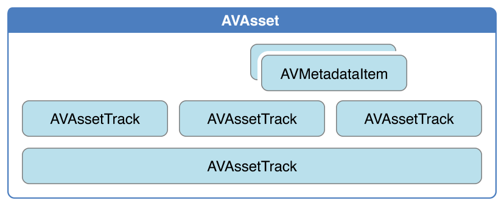

本文主要内容来自 [AVFoundation Programming Guide][3]。


基于时间的音视频数据，例如电影文件或视频流，在 AVFoundation 框架中用 `AVAsset` 来表示。AV Foundation 用于表示时间和媒体的几个底层数据结构，来自 Core Media 框架。


## 资源的表示方式

`AVAsset` 是 AVFoundation 框架中的核心类。它对基于时间的音视频数据的进行了抽象，例如电影文件或视频流。主要关系如下图所示。在许多情况下，我们需要使用其子类之一。


Asset 包含了将在一起显示或处理的多个轨道，每个轨道均包含（但不限于）音频、视频、文本、可隐藏字幕和字幕。 Asset 提供了关于资源的完整信息，比如时长、标题，以及渲染时的提示、视频源尺寸等等。 资产还可以包含由 `AVMetadataItem` 表示的元数据。


轨道用 `AVAssetTrack` 的实例表示，如下图所示。在典型的简单情况下，一个轨道表示音频分量，另一个表示视频分量; 在复杂的组合中，音频和视频可能有多个重叠的轨道。





轨道具有许多属性，例如其类型（视频或音频），视频和/或音频特征，元数据和时间轴。轨道有一个数组用来描述其格式。该数组包含一组 `CMFormatDescription` 对象，每个对象描述轨道对应的媒体样本的格式。包含统一媒体的轨道（比如，都使用相同的设置来编码）将提供一个计数为 1 的数组。

轨道本身可以被划分成多段，由 `AVAssetTrackSegment` 的实例表示。段是从源到资产轨道时间轴的时间映射。


## 时间的表示

AVFoundation 中用来表示时间的数据结构主要来自于 Core Media 框架。


### 用 CMTime 表示时长

`CMTime` 是一个 C 的数据结构，它表示时间为有理数，包含分子和分母。分子表示时间值，分母表示时间刻度，分子除以分母则表示时间，单位为秒。比如当时间刻度是 10，则表示每个单位的时间值表示 1/10 秒。最常用的时间刻度是 600，因为在场景的场景中，我们用 24 fps 的电影，30 fps 的 NTSC，25 fps 的 PAL。使用 600 的时间刻度，可以准确地表示这些系统中的任何数量的帧。


除了简单的时间值之外，`CMTime` 结构可以表示非数值的值：正无穷大，负无穷大和无定义。 它也可以指示时间是否在某一点被舍入，并且它能保持一个纪元数字。


### 使用 CMTime

下面是一些使用 `CMTime` 示例：

```
CMTime time1 = CMTimeMake(200, 2); // 200 half-seconds
CMTime time2 = CMTimeMake(400, 4); // 400 quarter-seconds
 
// time1 and time2 both represent 100 seconds, but using different timescales.
if (CMTimeCompare(time1, time2) == 0) {
    NSLog(@"time1 and time2 are the same");
}
 
Float64 float64Seconds = 200.0 / 3;
CMTime time3 = CMTimeMakeWithSeconds(float64Seconds , 3); // 66.66... third-seconds
time3 = CMTimeMultiply(time3, 3);
// time3 now represents 200 seconds; next subtract time1 (100 seconds).
time3 = CMTimeSubtract(time3, time1);
CMTimeShow(time3);
 
if (CMTIME_COMPARE_INLINE(time2, ==, time3)) {
    NSLog(@"time2 and time3 are the same");
}
```

### CMTime 的特殊值


```
CMTime myTime = <#Get a CMTime#>;
if (CMTIME_IS_INVALID(myTime)) {
    // Perhaps treat this as an error; display a suitable alert to the user.
}
```


[SamirChen]: http://www.samirchen.com "SamirChen"
[1]: {{ page.url }} ({{ page.title }})
[2]: http://www.samirchen.com/ios-av-asset
[3]: https://developer.apple.com/library/content/documentation/AudioVideo/Conceptual/AVFoundationPG/Articles/00_Introduction.html