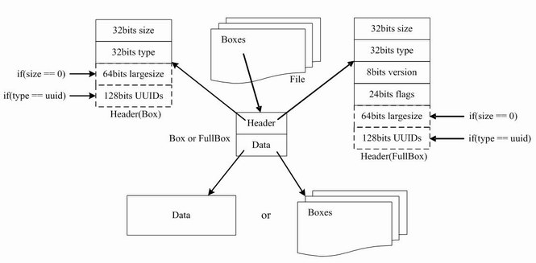

## 视频格式的基本介绍

这两年短视频成了内容创业的风口，各种短视频应用、短视频创作者异军突起，遍地开花，迅速成为各种 App 的重要甚至是主要的内容呈现形式。

短视频是一种点播形式的视频，点播视频的格式有挺多种的，比如：AVI、MKV、RM、FLV、MP4 等等，这些都是指的视频的封装格式。


关于视频的一些基础概念可以看看这篇[关于视频的一些概念][3]。

在 PC Web 时代，由于 Flash 插件极高的覆盖率，FLV 是使用非常广泛的一种视频格式，被几乎所有的视频网站支持并作为主要的点播视频格式所使用。但是，随着 App 时代的到来以及 H5 的兴起，Flash 插件逐渐被抛弃，同时随着 H.264 编码技术的普及、手机等硬件设备的升级，MP4 逐渐崛起成为了使用较为广泛的点播视频格式。

- **Flash Video 格式**，对应的文件格式是 `.flv`，是由 Adobe Flash 延伸出来的一种网络视频封装格式。这种格式被很多视频网站所采用。
- **MPEG 格式**，对应的文件格式有 `.mpg`、`.mpeg`、`.mpe`、`.dat`、`.vob`、`.asf`、`.3gp`、`.mp4` 等等，英文全称 Moving Picture Experts Group，是由运动图像专家组制定的视频格式，该专家组于 1988 年组建，专门负责视频和音频标准制定，其成员都是视频、音频以及系统领域的技术专家。MPEG 格式目前有三个压缩标准，分别是 MPEG-1、MPEG-2、和 MPEG-4。MPEG-4 是现在用的比较多的视频封装格式，它为了播放流式媒体的高质量视频而专门设计的，以求使用最少的数据获得最佳的图像质量。


但是，MP4 也有个问题，它的文件格式比较复杂，所以处理成本较高，而且由于索引表复杂度高，所以通常当视频时长大于 5 分钟时，MP4 文件在线播放时加载速度会比较慢。所以，在长视频场景，通常还会使用苹果公司力推的 HLS 协议：

- **HLS**，是苹果公司实现的基于 HTTP 的流媒体传输协议，全称 HTTP Live Streaming，可支持流媒体的直播和点播，主要应用在 iOS 系统，为 iOS 设备（如 iPhone、iPad）提供音视频直播和点播方案。对于 HLS 点播，基本上就是常见的分段 HTTP 点播，不同在于，它的分段非常小。要实现HLS点播，重点在于对媒体文件分段。对于 HLS 直播，相对于常见的流媒体直播协议，例如 RTMP 协议、RTSP 协议等，HLS 最大的不同在于直播客户端获取到的并不是一个完整的数据流，而是连续的、短时长的媒体文件（MPEG-TS 格式），客户端不断的下载并播放这些小文件。由于数据通过 HTTP 协议传输，所以完全不用考虑防火墙或者代理的问题，而且分段文件的时长很短，客户端可以很快的选择和切换码率，以适应不同带宽条件下的播放。同时其精简的 M3U8 索引结构可以规避 MP4 索引慢的问题，在点播场景是非常不错的选择。不过 HLS 的这种技术特点，决定了它在直播场景的延迟一般总是会高于普通的流媒体直播协议。

但是，作为时长通常为一两分钟或者几十秒的短视频场景，MP4 仍然是一个不错的选择。


无论是 AVI、FLV 还是 MP4 格式的文件，都会包含一个 metadata 的数据块，这里记录了当前文件的图像尺寸、编码格式、帧率、码率等信息。播放器在网络点播场景下去请求 MP4 视频数据，需要先获取到文件的 metadata 信息，解析出该文件的编码、帧率等信息后才能实现边下载数据，边送给解码器进行解码，最后通过渲染层将解码后的数据播放出来。

需要注意的是，我们有时候会遇到所请求的 MP4 短视频播放非常缓慢，这时候你就需要看看这个文件的 metadata 数据块是不是被编码在了 MP4 文件尾部，这种情况会导致播放器只有下载完整个文件后才能成功解析并播放这个视频。对于这种视频，我们最好能够在服务端将其重新编码，将 metadata 数据块转移到文件头部，保证播放器在线请求时能较快播放。比如 FFmpeg 的下列命令就可以支持这个操作：

```
ffmpeg -i bad.mp4 -movflags faststart good.mp4
```


此外，需要注意的是，在通过网络请求 MP4 视频文件进行边下载边播放时，由于接收到的每帧音视频数据是需要根据时间戳来决定何时送入解码器解码，以及何时显示，如果时间没到只能等待。尤其是当视频编码存在 B 帧时，解码时间戳 DTS 与显示时间戳顺序 PTS 通常不一致，这时候就会出现已经下载好的一帧数据可能还不能立即解码和显示，需要等待其依赖的数据下载完成和解码完成。这时在播放的过程中就可能因为网络抖动而出现播放卡顿。

关于音视频时间戳的概念，可以看一下[理解音视频 PTS 和 DTS][5]。


## MP4 格式解析

如上文介绍，MP4 是现在用的比较多的视频封装格式，它为了播放流式媒体的高质量视频而专门设计的，以求使用最少的数据获得最佳的图像质量。但是它的文件格式复杂，索引慢，时长较长的 MP4 视频在线播放时加载较慢。那么它的格式到底有着怎样的特点呢？

MP4 文件的数据都是封装一个又一个的名为 Box 的单元中，一个 MP4 文件由若干个 Box 组成，Box 有不同的类型，Box 中又可以包含其他 Box。

下面的图是对 MP4 文件结构的基本描述：



MP4 文件由许多 Box 或 FullBox 组成。其中，每个 Box 包含了 Header 和 Data。FullBox 是 Box 的扩展，其包含的 Header 增加了 version(8bits) 和 flags(24bits) 部分。

Header 部分包含了 size 和 type 部分。size 用于描述整个 Box 的长度，type 用于描述 Box 的类型。当 size 为 0 时，表示这是文件中最后一个 Box；当 size 为 1 时，表示 Box 长度需要更多 bits 来描述，这时在后面会定义一个 64bits 的 largesize 来描述 Box 的长度。当 type 是 uuid 时，代表 Box 中的数据是用户自定义扩展类型。

Data 部分是 Box 的实际数据，可以是纯数据也可以是更多的子 Boxes。

当一个 Box 的 Data 部分是一系列子 Boxes 时，这个 Box 又可称为 Container Box。


由于 MP4 文件的 Box 类型非常多，[http://mp4ra.org/atoms.html][8] 列出了当前注册过的一些 Box 类型，这么多的 Box 类型要完全支持还是很复杂的。好在大部分 MP4 文件不会包含这么多的 Box 类型，常见的主要是：ftyp、moov、mdat 三种。

- ftyp：File Type Box，包含文件的类型、版本、兼容信息等。
- moov：Movie Box，包含文件中所有媒体数据的宏观描述信息。实际的音视频数据都存储在 mdat 中，那么多的数据，我们怎么确定每一帧数据的位置呢，这就需要解析 moov 中的数据。moov 通常包含一个 mvhd 和若干个 trak。
	- mvhd：Movie Header Box，包含与具体媒体数据无关，但与整体播放相关的信息，比如 timescale、duration 等信息。
	- trak：Track Box，包含媒体轨道数据信息。有两种类型的 trak：media track 和 hint track，media track 包含媒体轨道的信息，一个文件至少会包含一个 media track 类型的 Box；hint track 包含用于流媒体协议的打包信息。每个 trak 都是独立的，包含自己的空域和时域信息。每个 trak 包含一个 tkhd 和 mdia。
		- tkhd：Track Header Box，包含该轨道的创建时间、标识该轨道 的 ID、轨道的播放时长、音量、宽高等信息。
		- mdia：Media Box，包含声明当前轨道信息的所有对象。这个 Box 下面包含众多类型的子 Boxes，其中比较重要的包括：
			- hdlr：Handler Reference Box，包含了表明该轨道类型的信息：Video Track、Audio Track 或者 Hint Track。
			- minf：Media Information Box，包含了描述该轨道媒体数据的所有特征信息。其中 minf 下 最重要的 Box 是 stbl。
				- stbl：Sample Tables Box，是包含媒体数据信息最多的 Box，也是最复杂的 Box。主要包含了时间和媒体采样数据的映射表，使用这部分数据可以按照时间检索出采样数据的位置、类型、大小、实际偏移位置。其下最重要的 Box 分别是：stts、stss、stsc、stsz、stco。
					- stts：Decoding Time to Sample Box，包含时间戳与 Sample 序号的映射关系。
					- stsc：Sample To Chunk Box，包含 Sample 和 Chunk 的映射关系。
					- stsz：Sample Size Boxes，包含每个 Sample 的大小。
					- stz2：Sample Size Boxes，包含另一种 Sample 大小的存储算法，压缩，更节省空间。
					- stss：Sync Sample Box，包含可随机访问的 Sample 列表，即关键帧列表。
					- stco：Chunk Offset Box，每个 Chunk 的偏移。
					- co64：Chunk Offset Box，64-bit Chunk 的偏移。
- mdat：Media Data Box，包含具体的媒体数据，即实际的音视频数据。比如我们需要的第一帧图片的数据就存放在这个 Box 里。这个 Box 中的数据是没有结构的，所以依赖于 moov 中的 trak 信息来进行索引。对于一个 track 的媒体数据来说，它包含多个 chunk，而每个 chunk 又包含多个 sample。

此外，文件的元数据信息 metadata 存储在 meta Box 中。

- meta：Meta Box，包含文件的元数据信息，它的位置比较灵活，可以放在文件中作为一级 Box，也可以放在  moov(Movie Box) 或者 trak(Track Box) 中。通常对于播放器来说，可能需要读取到 MP4 的 metadata 才能开始进行下一步的解码工作，所以在网络点播中通常需要把 meta Box 位置放在文件靠前的位置以加快开始播放的速度，如上文所介绍的那样。


关于 MP4 文件格式更加完整的信息参见：[MP4 格式文档][6]。


## 操作 MP4 文件

### Seek

那么我们如果对 MP4 文件做 Seek 操作呢？步骤如下：

- 1、根据 mvhd(Movie Header Box) 中的 timescale 确定给定时间 t 在媒体时间坐标系统中的位置 p，即 t * timescale。
- 2、根据 stts(Decoding Time to Sample Box) 查询指定 track 在时间坐标 p 之前的第一个 sample number。
- 3、根据 stss(Sync Sample Box) 查询 sample number 前的第一个关键帧 sync sample。
- 4、根据 stsc(Sample To Chunk Box) 查询对应 sync sample 的 chunk。
- 5、根据 stco(Chunk Offset Box) 查询该 chunk 的在文件中的偏移量。
- 6、根据 stsc(Sample To Chunk Box) 和 stsz(Sample Size Boxes) 的信息计算出该 chunk 中需要读取的 sample 数据，即完成 seek。

### 分割 MP4 文件

通过上面对 Seek 操作的介绍，我们不难发现其实我们可以将一个 MP4 文件中的所有关键帧的信息提取出来，也就是获得这个 MP4 文件的「关键帧列表」。在这个基础上我们就可以对 MP4 文件进行分割了，把大文件分割成小文件。这样对于优化 MP4 长视频的网络点播，是一种思路。

分割 MP4 文件的步骤大致如下：

- 1、获取关键帧列表。
- 2、选择分割的时间段。注意需要从各个时间段的第一个关键帧开始分割。
- 3、重新生成 moov Box。注意所有相关的 Box 以及 box size 都要做修改。
- 4、拷贝对应的数据，生成新的文件。


[SamirChen]: http://www.samirchen.com "SamirChen"
[1]: {{ page.url }} ({{ page.title }})
[2]: http://www.samirchen.com/video-playback-format
[3]: http://www.samirchen.com/video-concept/
[4]: http://www.360doc.com/content/13/0822/21/153944_309197656.shtml
[5]: http://www.samirchen.com/about-pts-dts/ 
[6]: http://l.web.umkc.edu/lizhu/teaching/2016sp.video-communication/ref/mp4.pdf
[7]: https://www.cnblogs.com/haibindev/archive/2011/10/17/2214518.html
[8]: http://mp4ra.org/atoms.html

