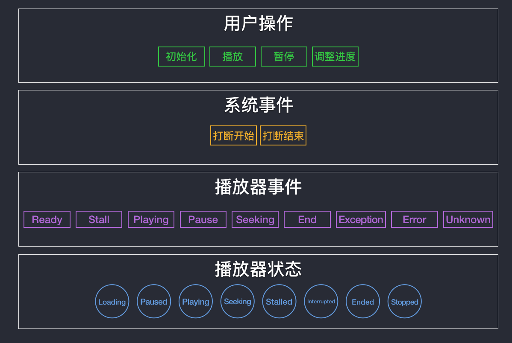
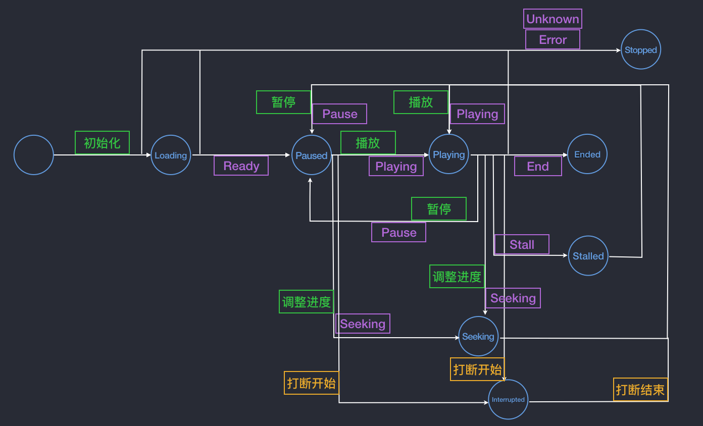

layout: post
title: 点播中的状态机完善
description: 介绍在点播中完善播放器状态机的一些思路。
category: blog
tag: Audio, Video, MP4, State
---


完善的播放器状态机是优秀的视频交互体验的基础。这一点在直播场景还好，在点播场景则尤为重要。毕竟直播时的用户交互相对来说要少一些，一方面因为实时性，直播不支持 seek 操作，另一方面，为了保证低延时，遇到问题尝试刷新直播即可。而点播场景下，用户可以前后 seek，在 seek 中可能还会穿插着暂停、播放操作，这些过程中又可能遇到弱网、断网等场景，这么多情况糅杂在一起，如果播放器的状态机不完善，那么就很可能造成用户交互上的状态错乱，比如：视频没在播放，但界面上没有任何提示；视频已经在播放，但界面上出现加载的动画效果等等，这些都会让用户产生疑惑。


## 播放器状态机示例

下面的图中是播放器状态机的一个示例：





图中画出了用户在使用播放器过程中可能遇到的播放器状态机的流转，但并没有包含所有情况，要想做的更完备，播放器的状态机可能更复杂，很多过程的逻辑在具体实现起来也会更复杂。


## 播放中状态


拿播放器的「播放中」状态来说，在 iOS 中使用 AVPlayer 时，如果我们测试的够仔细会发现在调用了 `play` 接口后，播放器并一定会进入真正的播放状态，甚至我们在收到 `AVPlayerItemStatusReadyToPlay` 消息后也不一定。尤其在弱网的情况下，播放器可能还会继续等待数据加载。这样一来，我们就很尴尬了，因为不能准确地给出播放器真正的播放的状态，对于视频播放中的交互影响是很大的。

这里有一个思路可供参考，我们可以使用 AVPlayer 的这个接口：

```
- (id)addPeriodicTimeObserverForInterval:(CMTime)interval queue:(nullable dispatch_queue_t)queue usingBlock:(void (^)(CMTime time))block;
```

这个接口会在播放器播放时间变化时通过回调告诉你。在其回调中增加一些状态判断逻辑，从而提供准确的「播放中」状态。

此外，AVPlayer 还提供了另一个接口：

```
- (id)addBoundaryTimeObserverForTimes:(NSArray<NSValue *> *)times queue:(nullable dispatch_queue_t)queue usingBlock:(void (^)(void))block;
```

这个接口会在播放器的播放时间跨过某个区间时通过回调告诉你。但是在实际使用中，我发现在一些情况下会碰到 boundary time observer 设定的时间线被跨过但回调不能触发。所以这个接口还是谨慎使用。


## Seeking 状态

调整播放进度也是用户观看点播视频时常见的行为，在使用 AVPlayer 时可以通过这个接口来做 Seek 操作：


```
- (void)seekToTime:(CMTime)time toleranceBefore:(CMTime)toleranceBefore toleranceAfter:(CMTime)toleranceAfter completionHandler:(void (^)(BOOL finished))completionHandler NS_AVAILABLE(10_7, 5_0);
```


通过设置 `toleranceBefore` 和 `toleranceAfter` 可以设置 Seek 的精度。同时，值得注意 `completionHandler` 中的 `finished` 可以标记一次 Seek 操作最终有没有完成。如果在一次 Seek 还未结束时再次调用 Seek，则前一次 Seek 会立即返回并且 `finished` 为 `NO`。这是在 Seek 操作中需要注意的点，即用户在上一次 Seek 还未完成时又做了下一次 Seek 该怎么处理。以及最后一次 Seek 完成后播放状态该是恢复播放呢，还是暂停呢，这都是需要细细考虑的。


## 卡顿状态

使用 AVPlayer 播放视频当发生卡顿时，可以通过监听 `AVPlayerItemPlaybackStalledNotification` 通知来获取卡顿事件。问题是当发生卡顿时，播放器的 player rate 会被置为 0，这样即使缓冲数据足够了，AVPlayer 也不会自己恢复播放，这就需要我们去在合适的时机恢复播放。

这时候我们可以 KVO 监听 AVPlayerItem 的 `loadedTimeRanges` 属性，在加载到一定时长的数据后来调用 AVPlayer 的 `play` 接口来恢复播放。当然，这里是可以做一点算法来防止视频频繁卡顿的，比如：根据已经发生卡顿的频率来调整恢复播放前加载数据的长度；根据网络带宽情况和视频总时长来调整恢复播放前加载数据的长度等等。


[SamirChen]: http://www.samirchen.com "SamirChen"
[1]: {{ page.url }} ({{ page.title }})
[2]: http://www.samirchen.com/video-playback-state

