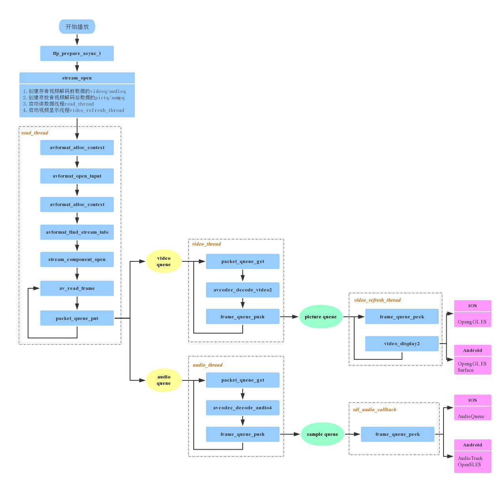
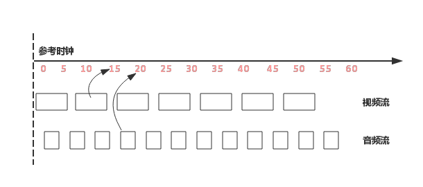
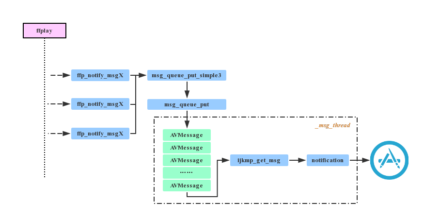

本文主要参考：[https://www.jianshu.com/p/daf0a61cc1e0][3]。


## 项目介绍

[IJKPlayer][5] 是一个优秀的开源播放器，它基于 FFmpeg 开发，在播放内核层面实现了 iOS、Android 跨平台，对 iOS、Android 平台相关的接口提供了方便接入的封装，同时对于 FFmpeg 底层支持的编解码库可以通过配置灵活地进行裁剪，便于控制包大小。

IJKPlayer 在 iOS 和 Android 平台上实现的主要差异表现在视频硬解码方案和音视频渲染方案上：

- iOS
	- 视频硬解码：VideoToolbox
	- 音频渲染：AudioQueue
	- 视频渲染：OpenGL ES
- Android
	- 视频硬解码：MediaCodec
	- 音频渲染：OpenSL ES、AudioTrack
	- 视频渲染：OpenGL ES、MediaCodec

IJKPlayer 项目的目录结构大致如下：

- tool：初始化项目工程脚本。
- config：编译 FFmpeg 使用的配置文件。
- extra：存放编译 IJKPlayer 所需的依赖源文件, 如 FFmpeg、OpenSSL 等。
- ijkmedia：核心代码。
	- ijkplayer：播放器数据下载及解码相关。
	- ijksdl：音视频数据渲染相关。
- ios：iOS平台上的上层接口封装以及平台相关方法。
- android：android平台上的上层接口封装以及平台相关方法。


一般来讲播放器的工作流程如下图所示：


下面就结合 ijkplayer(k0.7.6) 的 iOS 代码具体讲讲 IJKPlayer 的工作流程。


## 播放器初始化流程

播放器的初始化是调用 ijkplayer/ios/IJKMediaPlayer/IJKMediaPlayer/IJKFFMoviePlayerController.m 文件中对应的初始化方法，具体如下：

```
- (id)initWithContentURL:(NSURL *)aUrl
             withOptions:(IJKFFOptions *)options
{
    if (aUrl == nil)
        return nil;

    // Detect if URL is file path and return proper string for it
    NSString *aUrlString = [aUrl isFileURL] ? [aUrl path] : [aUrl absoluteString];

    return [self initWithContentURLString:aUrlString
                              withOptions:options];
}

- (id)initWithContentURLString:(NSString *)aUrlString
                   withOptions:(IJKFFOptions *)options
{
    if (aUrlString == nil)
        return nil;

    self = [super init];
    if (self) {
        ......
        // init player
        _mediaPlayer = ijkmp_ios_create(media_player_msg_loop);
        ......
    }
    return self;
}
```

这里的重点在于创建了 `IjkMediaPlayer` 结构体实例 `_mediaPlayer`：

```
IjkMediaPlayer *ijkmp_ios_create(int (*msg_loop)(void*))
{
    IjkMediaPlayer *mp = ijkmp_create(msg_loop);
    if (!mp)
        goto fail;

    mp->ffplayer->vout = SDL_VoutIos_CreateForGLES2();
    if (!mp->ffplayer->vout)
        goto fail;

    mp->ffplayer->pipeline = ffpipeline_create_from_ios(mp->ffplayer);
    if (!mp->ffplayer->pipeline)
        goto fail;

    return mp;

fail:
    ijkmp_dec_ref_p(&mp);
    return NULL;
}
```

在上面的方法中主要完成了三个动作：

1）创建 `IjkMediaPlayer` 对象：

```
IjkMediaPlayer *ijkmp_create(int (*msg_loop)(void*))
{
    IjkMediaPlayer *mp = (IjkMediaPlayer *) mallocz(sizeof(IjkMediaPlayer));
    ......
    mp->ffplayer = ffp_create();
    ......
    mp->msg_loop = msg_loop;
    ......
    return mp;
}
```

通过 `ffp_create` 方法创建了 `FFPlayer` 对象，并设置消息处理函数。

2）创建图像渲染对象 `SDL_Vout`：

```
SDL_Vout *SDL_VoutIos_CreateForGLES2()
{
    SDL_Vout *vout = SDL_Vout_CreateInternal(sizeof(SDL_Vout_Opaque));
    if (!vout)
        return NULL;

    SDL_Vout_Opaque *opaque = vout->opaque;
    opaque->gl_view = nil;
    vout->create_overlay = vout_create_overlay;
    vout->free_l = vout_free_l;
    vout->display_overlay = vout_display_overlay;

    return vout;
}
```

3）创建平台相关的 `IJKFF_Pipeline` 对象，包括视频解码以及音频输出部分：

```
IJKFF_Pipeline *ffpipeline_create_from_ios(FFPlayer *ffp)
{
    IJKFF_Pipeline *pipeline = ffpipeline_alloc(&g_pipeline_class, sizeof(IJKFF_Pipeline_Opaque));
    if (!pipeline)
        return pipeline;

    IJKFF_Pipeline_Opaque *opaque     = pipeline->opaque;
    opaque->ffp                       = ffp;
    pipeline->func_destroy            = func_destroy;
    pipeline->func_open_video_decoder = func_open_video_decoder;
    pipeline->func_open_audio_output  = func_open_audio_output;

    return pipeline;
}
```

到这里则完成了 `IJKPlayer` 播放器初始化的相关流程，简单来说，就是：创建播放器对象、完成音视频解码和音视频渲染的准备工作。在下一章节中，会重点介绍播放的核心代码。

## 视频播放核心实现

`IJKPlayer` 实际上是参考 `ffplay.c` 的代码来实现的，本章节将以该文件为主线，从数据接收、音视频解码、音视频渲染与同步这三大方面进行讲解：

`ffplay.c` 中主要的代码调用流程如下图所示：




当外部调用 `prepareToPlay` 启动播放时，`IJKPlayer` 内部最终会调用到 `ffplay.c` 中的

```
int ffp_prepare_async_l(FFPlayer *ffp, const char *file_name)
```

方法，该方法是启动播放器的入口函数，在此会设置 player 选项，打开 audio output，最重要的是调用 `stream_open` 方法。

```
static VideoState *stream_open(FFPlayer *ffp, const char *filename, AVInputFormat *iformat)
{  
    ......           
    /* start video display */
    if (frame_queue_init(&is->pictq, &is->videoq, ffp->pictq_size, 1) < 0)
        goto fail;
    if (frame_queue_init(&is->sampq, &is->audioq, SAMPLE_QUEUE_SIZE, 1) < 0)
        goto fail;

    if (packet_queue_init(&is->videoq) < 0 ||
        packet_queue_init(&is->audioq) < 0 )
        goto fail;

    ......
    
    is->video_refresh_tid = SDL_CreateThreadEx(&is->_video_refresh_tid, video_refresh_thread, ffp, "ff_vout");
    
    ......
    
    is->read_tid = SDL_CreateThreadEx(&is->_read_tid, read_thread, ffp, "ff_read");
    
    ......
}
```

从代码中可以看出，`stream_open` 主要做了以下几件事情：

- 创建存放 `video/audio` 解码前数据的 `videoq/audioq`。
- 创建存放 `video/audio` 解码后数据的 `pictq/sampq`。
- 创建视频渲染线程 `video_refresh_thread`。
- 创建读数据线程 `read_thread`。


说明：subtitle 是与 video、audio 平行的一个 stream，ffplay 中也支持对它的处理，即创建存放解码前后数据的两个 queue，并且当文件中存在 subtitle 时，还会启动 subtitle 的解码线程，由于篇幅有限，本文暂时忽略对它的相关介绍。


### 数据读取

数据读取的整个过程都是由 FFmpeg 内部完成的，接收到网络过来的数据后，FFmpeg 完成了解协议、解封装的动作，我们得到的是音视频分离开的解码前的数据，这整个过程步骤如下：

1）创建上下文结构体，这个结构体是最上层的结构体，表示输入上下文。

```
ic = avformat_alloc_context();
```

2）设置中断函数，如果出错或者退出，就可以立刻退出。

```
ic->interrupt_callback.callback = decode_interrupt_cb;
ic->interrupt_callback.opaque = is;
```

3）打开文件，主要是探测协议类型，如果是网络文件则创建网络链接等。

```
err = avformat_open_input(&ic, is->filename, is->iformat, &ffp->format_opts);
```


4）探测媒体类型，可得到当前文件的封装格式，音视频编码参数等信息。

```
err = avformat_find_stream_info(ic, opts);
```

5）打开视频、音频解码器。在此会打开相应解码器，并创建相应的解码线程。

```
stream_component_open(ffp, st_index[AVMEDIA_TYPE_AUDIO]);
```

6）读取媒体数据，得到的是音视频分离的解码前数据。

```
ret = av_read_frame(ic, pkt);
```


7）将音视频数据分别送入相应的 queue 中。

```
if (pkt->stream_index == is->audio_stream && pkt_in_play_range) {
    packet_queue_put(&is->audioq, pkt);
} else if (pkt->stream_index == is->video_stream && pkt_in_play_range && !(is->video_st && (is->video_st->disposition & AV_DISPOSITION_ATTACHED_PIC))) {
    packet_queue_put(&is->videoq, pkt);
    ......
} else {
    av_packet_unref(pkt);
}
```


重复上述第 6、7 步，即可不断获取待播放的数据。


### 音视频解码

IJKPlayer 在视频解码上支持软解和硬解两种方式，可在起播前配置优先使用的解码方式，播放过程中不可切换。iOS 平台上硬解使用 `VideoToolbox`，Android 平台上使用 `MediaCodec`。IJKPlayer 中的音频解码只支持软解，暂不支持硬解。

#### 视频解码方式选择

在打开解码器的方法中：

```
static int stream_component_open(FFPlayer *ffp, int stream_index)
{
    ......
    codec = avcodec_find_decoder(avctx->codec_id);
    ......
    if ((ret = avcodec_open2(avctx, codec, &opts)) < 0) {
        goto fail;
    }
    ......  
    case AVMEDIA_TYPE_VIDEO:
        ......
        decoder_init(&is->viddec, avctx, &is->videoq, is->continue_read_thread);
        ffp->node_vdec = ffpipeline_open_video_decoder(ffp->pipeline, ffp);
        if (!ffp->node_vdec)
            goto fail;
        if ((ret = decoder_start(&is->viddec, video_thread, ffp, "ff_video_dec")) < 0)
            goto out;       
    ......
}
```

首先会打开 FFmpeg 的解码器，然后通过 `ffpipeline_open_video_decoder` 创建 `IJKFF_Pipenode`。

在创建 `IJKMediaPlayer` 对象时，通过 `ffpipeline_create_from_ios` 创建了 pipeline，则

```
IJKFF_Pipenode* ffpipeline_open_video_decoder(IJKFF_Pipeline *pipeline, FFPlayer *ffp)
{
    return pipeline->func_open_video_decoder(pipeline, ffp);
}
```

`func_open_video_decoder` 函数指针最后指向的是 `ffpipeline_ios.c` 中的 `func_open_video_decoder`，其定义如下：


```
static IJKFF_Pipenode *func_open_video_decoder(IJKFF_Pipeline *pipeline, FFPlayer *ffp)
{
    IJKFF_Pipenode* node = NULL;
    IJKFF_Pipeline_Opaque *opaque = pipeline->opaque;
    if (ffp->videotoolbox) {
        node = ffpipenode_create_video_decoder_from_ios_videotoolbox(ffp);
        if (!node)
            ALOGE("vtb fail!!! switch to ffmpeg decode!!!! \n");
    }
    if (node == NULL) {
        node = ffpipenode_create_video_decoder_from_ffplay(ffp);
        ffp->stat.vdec_type = FFP_PROPV_DECODER_AVCODEC;
        opaque->is_videotoolbox_open = false;
    } else {
        ffp->stat.vdec_type = FFP_PROPV_DECODER_VIDEOTOOLBOX;
        opaque->is_videotoolbox_open = true;
    }
    ffp_notify_msg2(ffp, FFP_MSG_VIDEO_DECODER_OPEN, opaque->is_videotoolbox_open);
    return node;
}
```

如果配置了 `ffp->videotoolbox`，会优先去尝试打开硬件解码器：

```
node = ffpipenode_create_video_decoder_from_ios_videotoolbox(ffp);
```

如果没有配置使用 `VideoToolbox` 或者硬件解码器打开失败，则会自动切换至软解：

```
node = ffpipenode_create_video_decoder_from_ffplay(ffp);
```


`ffp->videotoolbox` 需要在起播前通过如下方法配置：


```
ijkmp_set_option_int(_mediaPlayer, IJKMP_OPT_CATEGORY_PLAYER, "videotoolbox", 1);
```


#### 音视频解码实现

视频的解码线程为 `video_thread`，音频的解码线程为 `audio_thread`。

不管视频解码还是音频解码，其基本流程都是从解码前的数据缓冲区中取出一帧数据进行解码，完成后放入相应的解码后的数据缓冲区。


本文以视频的软解流程为例进行分析，音频的流程可对照研究。

视频解码线程：

```
static int video_thread(void *arg)
{
    FFPlayer *ffp = (FFPlayer *)arg;
    int       ret = 0;

    if (ffp->node_vdec) {
        ret = ffpipenode_run_sync(ffp->node_vdec);
    }
    return ret;
}
```

`ffpipenode_run_sync` 中调用的是 `IJKFF_Pipenode` 对象中的 `func_run_sync`：

```
int ffpipenode_run_sync(IJKFF_Pipenode *node)
{
    return node->func_run_sync(node);
}
```


`func_run_sync` 取决于播放前配置的软硬解，假设为软解，则调用：


```
static int ffplay_video_thread(void *arg)
{
    FFPlayer *ffp = arg;
    
    ......

    for (;;) {
        ret = get_video_frame(ffp, frame);
        ......
        ret = queue_picture(ffp, frame, pts, duration, av_frame_get_pkt_pos(frame), is->viddec.pkt_serial);
    }
    return 0;
}
```

`get_video_frame` 中调用了 `decoder_decode_frame`，其定义如下：


```
static int decoder_decode_frame(FFPlayer *ffp, Decoder *d, AVFrame *frame, AVSubtitle *sub) {
    int got_frame = 0;

    do {
        int ret = -1;
        ......
        if (!d->packet_pending || d->queue->serial != d->pkt_serial){
            AVPacket pkt;
            do {
                ......
                if (packet_queue_get_or_buffering(ffp, d->queue, &pkt, &d->pkt_serial, &d->finished) < 0)
                    return -1;
                ......
            } while (pkt.data == flush_pkt.data || d->queue->serial != d->pkt_serial);
            ......
        }

        switch (d->avctx->codec_type) {
            case AVMEDIA_TYPE_VIDEO: {
                ret = avcodec_decode_video2(d->avctx, frame, &got_frame, &d->pkt_temp);
                ......
               }
                break;
        }
        ......
    } while (!got_frame && !d->finished);

    return got_frame;
}
```

该方法中从解码前的 video queue 中取出一帧数据，送入 decoder 进行解码，解码后的数据在 `ffplay_video_thread` 中送入 `pictq`。


### 音视频渲染及同步

#### 音频输出

IJKPlayer 中 Android 平台使用 OpenSL ES 或 AudioTrack 输出音频，iOS 平台使用 AudioQueue 输出音频。

audio output 节点，在 `ffp_prepare_async_l` 方法中被创建：

```
ffp->aout = ffpipeline_open_audio_output(ffp->pipeline, ffp);
```

`ffpipeline_open_audio_output` 方法实际上调用的是 `IJKFF_Pipeline` 对象的函数指针 `func_open_audio_output`，该函数指针在初始化中的 `ijkmp_ios_create` 方法中被赋值，最后指向的是 `func_open_audio_output`。

```
static SDL_Aout *func_open_audio_output(IJKFF_Pipeline *pipeline, FFPlayer *ffp)
{
    return SDL_AoutIos_CreateForAudioUnit();
}
```


`SDL_AoutIos_CreateForAudioUnit` 定义如下，主要完成的是创建 `SDL_Aout` 对象：

```
SDL_Aout *SDL_AoutIos_CreateForAudioUnit()
{
    SDL_Aout *aout = SDL_Aout_CreateInternal(sizeof(SDL_Aout_Opaque));
    if (!aout)
        return NULL;

    // SDL_Aout_Opaque *opaque = aout->opaque;

    aout->free_l = aout_free_l;
    aout->open_audio  = aout_open_audio;
    aout->pause_audio = aout_pause_audio;
    aout->flush_audio = aout_flush_audio;
    aout->close_audio = aout_close_audio;

    aout->func_set_playback_rate = aout_set_playback_rate;
    aout->func_set_playback_volume = aout_set_playback_volume;
    aout->func_get_latency_seconds = auout_get_latency_seconds;
    aout->func_get_audio_persecond_callbacks = aout_get_persecond_callbacks;
    return aout;
}
```


回到 `ffplay.c` 中，如果发现待播放的文件中含有音频，那么在调用 `stream_component_open` 打开解码器时，该方法里面也调用 `audio_open` 打开了 audio output 设备。

```
static int audio_open(FFPlayer *opaque, int64_t wanted_channel_layout, int wanted_nb_channels, int wanted_sample_rate, struct AudioParams *audio_hw_params)
{
    FFPlayer *ffp = opaque;
    VideoState *is = ffp->is;
    SDL_AudioSpec wanted_spec, spec;
    ......
    wanted_nb_channels = av_get_channel_layout_nb_channels(wanted_channel_layout);
    wanted_spec.channels = wanted_nb_channels;
    wanted_spec.freq = wanted_sample_rate;
    wanted_spec.format = AUDIO_S16SYS;
    wanted_spec.silence = 0;
    wanted_spec.samples = FFMAX(SDL_AUDIO_MIN_BUFFER_SIZE, 2 << av_log2(wanted_spec.freq / SDL_AoutGetAudioPerSecondCallBacks(ffp->aout)));
    wanted_spec.callback = sdl_audio_callback;
    wanted_spec.userdata = opaque;
    while (SDL_AoutOpenAudio(ffp->aout, &wanted_spec, &spec) < 0) {
        .....
    }
    ......
    return spec.size;
}
```


在 `audio_open` 中配置了音频输出的相关参数 `SDL_AudioSpec`，并通过

```
int SDL_AoutOpenAudio(SDL_Aout *aout, const SDL_AudioSpec *desired, SDL_AudioSpec *obtained)
{
    if (aout && desired && aout->open_audio)
        return aout->open_audio(aout, desired, obtained);

    return -1;
}
```

设置给了 audio output, iOS 平台上即为 `AudioQueue`。

`SDL_AoutIos_CreateForAudioUnit` 中可以看到 `SDL_Aout` 对象的 `open_audio` 指针是指向 `aout_open_audio` 函数的，在该函数中主要是通过 `IJKSDLAudioUnitController` 对象来处理音频渲染，其中的 `AudioQueue` 模块在工作过程中，通过不断的 callback 来获取 pcm 数据进行播放。

有关 `AudioQueue` 的具体内容此处不再介绍。


#### 视频渲染


iOS 平台上采用 OpenGL 渲染解码后的 YUV 图像，渲染线程为 `video_refresh_thread`，最后渲染图像的方法为 `video_image_display2`，定义如下：


```
static void video_image_display2(FFPlayer *ffp)
{
    VideoState *is = ffp->is;
    Frame *vp;
    Frame *sp = NULL;

    vp = frame_queue_peek_last(&is->pictq);
    ......
    
    SDL_VoutDisplayYUVOverlay(ffp->vout, vp->bmp);
    ......
}
```


从代码实现上可以看出，该线程的主要工作为：


1）调用 `frame_queue_peek_last` 从 `pictq` 中读取当前需要显示视频帧。

2）调用 `SDL_VoutDisplayYUVOverlay` 进行绘制。

```
int SDL_VoutDisplayYUVOverlay(SDL_Vout *vout, SDL_VoutOverlay   *overlay)
{
    if (vout && overlay && vout->display_overlay)
        return vout->display_overlay(vout, overlay);

    return -1;
}
```


`display_overlay` 函数指针在前面初始化流程有介绍过，它在

```
SDL_Vout *SDL_VoutIos_CreateForGLES2()
```

方法中被赋值为 `vout_display_overlay`，该方法就是通过创建 `IJKSDLGLView` 对象来调用 `OpengGL` 绘制图像。


#### 音视频同步

对于播放器来说，音视频同步是一个关键点，同时也是一个难点，同步效果的好坏，直接决定着播放器的质量。通常音视频同步的解决方案就是选择一个参考时钟，播放时读取音视频帧上的时间戳，同时参考当前时钟参考时钟上的时间来安排播放。如下图所示：



如果音视频帧的播放时间大于当前参考时钟上的时间，则不急于播放该帧，直到参考时钟达到该帧的时间戳；如果音视频帧的时间戳小于当前参考时钟上的时间，则需要尽快播放该帧或丢弃，以便播放进度追上参考时钟。

参考时钟的选择也有多种方式：

- 选取视频时间戳作为参考时钟源
- 选取音频时间戳作为参考时钟源
- 选取外部时间作为参考时钟源

考虑人对视频、和音频的敏感度，在存在音频的情况下，优先选择音频作为主时钟源。


IJKPlayer 在默认情况下也是使用音频作为参考时钟源，处理同步的过程主要在视频渲染 `video_refresh_thread` 的线程中：

```
static int video_refresh_thread(void *arg)
{
    FFPlayer *ffp = arg;
    VideoState *is = ffp->is;
    double remaining_time = 0.0;
    while (!is->abort_request) {
        if (remaining_time > 0.0)
            av_usleep((int)(int64_t)(remaining_time * 1000000.0));
        remaining_time = REFRESH_RATE;
        if (is->show_mode != SHOW_MODE_NONE && (!is->paused || is->force_refresh))
            video_refresh(ffp, &remaining_time);
    }

    return 0;
}
```

从上述实现可以看出，该方法中主要循环做两件事情：

- 1、休眠等待，`remaining_time` 的计算在 `video_refresh` 中。
- 2、调用 `video_refresh` 方法，刷新视频帧。

可见同步的重点是在 `video_refresh` 中，下面着重分析该方法：


```
lastvp = frame_queue_peek_last(&is->pictq);
vp = frame_queue_peek(&is->pictq);
......
/* compute nominal last_duration */
last_duration = vp_duration(is, lastvp, vp);
delay = compute_target_delay(ffp, last_duration, is);
```


`lastvp` 是上一帧，`vp` 是当前帧，`last_duration` 则是根据当前帧和上一帧的 pts，计算出来上一帧的显示时间，经过 `compute_target_delay` 方法，计算出显示当前帧需要等待的时间。


```
static double compute_target_delay(FFPlayer *ffp, double delay, VideoState *is)
{
    double sync_threshold, diff = 0;

    /* update delay to follow master synchronisation source */
    if (get_master_sync_type(is) != AV_SYNC_VIDEO_MASTER) {
        /* if video is slave, we try to correct big delays by
           duplicating or deleting a frame */
        diff = get_clock(&is->vidclk) - get_master_clock(is);

        /* skip or repeat frame. We take into account the
           delay to compute the threshold. I still don't know
           if it is the best guess */
        sync_threshold = FFMAX(AV_SYNC_THRESHOLD_MIN, FFMIN(AV_SYNC_THRESHOLD_MAX, delay));
        /* -- by bbcallen: replace is->max_frame_duration with AV_NOSYNC_THRESHOLD */
        if (!isnan(diff) && fabs(diff) < AV_NOSYNC_THRESHOLD) {
            if (diff <= -sync_threshold)
                delay = FFMAX(0, delay + diff);
            else if (diff >= sync_threshold && delay > AV_SYNC_FRAMEDUP_THRESHOLD)
                delay = delay + diff;
            else if (diff >= sync_threshold)
                delay = 2 * delay;
        }
    }

    .....

    return delay;
}
```


在 `compute_target_delay` 方法中，如果发现当前主时钟源不是 video，则计算当前视频时钟与主时钟的差值：


- 如果当前视频帧落后于主时钟源，则需要减小下一帧画面的等待时间；
- 如果视频帧超前，并且该帧的显示时间大于显示更新门槛，则显示下一帧的时间为超前的时间差加上上一帧的显示时间；
- 如果视频帧超前，并且上一帧的显示时间小于显示更新门槛，则采取加倍延时的策略。

回到 `video_refresh` 中

```
time= av_gettime_relative()/1000000.0;
if (isnan(is->frame_timer) || time < is->frame_timer)
    is->frame_timer = time;
if (time < is->frame_timer + delay) {
    *remaining_time = FFMIN(is->frame_timer + delay - time, *remaining_time);
    goto display;
}
```

`frame_timer` 实际上就是上一帧的播放时间，而 `frame_timer + delay` 实际上就是当前这一帧的播放时间，如果系统时间还没有到当前这一帧的播放时间，直接跳转至 `display`，而此时 `is->force_refresh` 变量为 0，不显示当前帧，进入 `video_refresh_thread` 中下一次循环，并睡眠等待。

```
is->frame_timer += delay;
if (delay > 0 && time - is->frame_timer > AV_SYNC_THRESHOLD_MAX)
    is->frame_timer = time;

SDL_LockMutex(is->pictq.mutex);
if (!isnan(vp->pts))
    update_video_pts(is, vp->pts, vp->pos, vp->serial);
SDL_UnlockMutex(is->pictq.mutex);

if (frame_queue_nb_remaining(&is->pictq) > 1) {
    Frame *nextvp = frame_queue_peek_next(&is->pictq);
    duration = vp_duration(is, vp, nextvp);
    if(!is->step && (ffp->framedrop > 0 || (ffp->framedrop && get_master_sync_type(is) != AV_SYNC_VIDEO_MASTER)) && time > is->frame_timer + duration) {
        frame_queue_next(&is->pictq);
        goto retry;
    }
}
```

如果当前这一帧的播放时间已经过了，并且其和当前系统时间的差值超过了 `AV_SYNC_THRESHOLD_MAX`，则将当前这一帧的播放时间改为系统时间，并在后续判断是否需要丢帧，其目的是为后面帧的播放时间重新调整 `frame_timer`，如果缓冲区中有更多的数据，并且当前的时间已经大于当前帧的持续显示时间，则丢弃当前帧，尝试显示下一帧。

```
{
   frame_queue_next(&is->pictq);
   is->force_refresh = 1;

   SDL_LockMutex(ffp->is->play_mutex);
   
    ......
    
display:
    /* display picture */
    if (!ffp->display_disable && is->force_refresh && is->show_mode == SHOW_MODE_VIDEO && is->pictq.rindex_shown)
        video_display2(ffp);
```


否则进入正常显示当前帧的流程，调用 `video_display2` 开始渲染。


## 播放事件处理

在播放过程中，某些行为的完成或者变化，如准备完成、首帧完成渲染、开始播放、播放暂停等，需要以事件形式通知到外部，以便上层作出具体的业务处理。


IJKPlayer 支持的事件比较多，具体定义在 ijkplayer/ijkmedia/ijkplayer/ff_ffmsg.h 中：

```
#define FFP_MSG_FLUSH                       0
#define FFP_MSG_ERROR                       100     /* arg1 = error */
#define FFP_MSG_PREPARED                    200
#define FFP_MSG_COMPLETED                   300
#define FFP_MSG_VIDEO_SIZE_CHANGED          400     /* arg1 = width, arg2 = height */
#define FFP_MSG_SAR_CHANGED                 401     /* arg1 = sar.num, arg2 = sar.den */
#define FFP_MSG_VIDEO_RENDERING_START       402
#define FFP_MSG_AUDIO_RENDERING_START       403
#define FFP_MSG_VIDEO_ROTATION_CHANGED      404     /* arg1 = degree */
#define FFP_MSG_BUFFERING_START             500
#define FFP_MSG_BUFFERING_END               501
#define FFP_MSG_BUFFERING_UPDATE            502     /* arg1 = buffering head position in time, arg2 = minimum percent in time or bytes */
#define FFP_MSG_BUFFERING_BYTES_UPDATE      503     /* arg1 = cached data in bytes,            arg2 = high water mark */
#define FFP_MSG_BUFFERING_TIME_UPDATE       504     /* arg1 = cached duration in milliseconds, arg2 = high water mark */
#define FFP_MSG_SEEK_COMPLETE               600     /* arg1 = seek position,                   arg2 = error */
#define FFP_MSG_PLAYBACK_STATE_CHANGED      700
#define FFP_MSG_TIMED_TEXT                  800
#define FFP_MSG_VIDEO_DECODER_OPEN          10001
```


### 消息上报初始化

在 `IJKFFMoviePlayerController` 的初始化方法中：

```
- (id)initWithContentURLString:(NSString *)aUrlString
                   withOptions:(IJKFFOptions *)options
{
    ......  
    // init player
    _mediaPlayer = ijkmp_ios_create(media_player_msg_loop);   
    ......          
}
```


可以看到在创建播放器时，`media_player_msg_loop` 函数地址作为参数传入了 `ijkmp_ios_create`，继续跟踪代码，可以发现，该函数地址最终被赋值给了 `IjkMediaPlayer` 中的 `msg_loop` 函数指针：

```
IjkMediaPlayer *ijkmp_create(int (*msg_loop)(void*))
{
    ......
    mp->msg_loop = msg_loop;
    ......
}
```

开始播放时，会启动一个消息线程：

```
static int ijkmp_prepare_async_l(IjkMediaPlayer *mp)
{
    ......
    mp->msg_thread = SDL_CreateThreadEx(&mp->_msg_thread, ijkmp_msg_loop, mp, "ff_msg_loop");
    ......
}
```

`ijkmp_msg_loop` 方法中调用的即是 `mp->msg_loop`。

至此已经完成了播放消息发送的准备工作。


### 消息上报处理

播放器底层上报事件时，实际上就是将待发送的消息放入消息队列，另外有一个线程会不断从队列中取出消息，上报给外部，其代码流程大致如下图所示：



这里以准备完成事件为例，看看代码中事件上报的具体流程。

`ffplay.c` 中上报 `PREPARED` 完成时调用：

```
ffp_notify_msg1(ffp, FFP_MSG_PREPARED);
```


`ffp_notify_msg1` 方法实现如下：

```
inline static void ffp_notify_msg1(FFPlayer *ffp, int what) {
    msg_queue_put_simple3(&ffp->msg_queue, what, 0, 0);
}
```

`msg_queue_put_simple3` 中将事件及其参数封装成了 `AVMessge` 对象：


```
inline static void msg_queue_put_simple3(MessageQueue *q, int what, int arg1, int arg2)
{
    AVMessage msg;
    msg_init_msg(&msg);
    msg.what = what;
    msg.arg1 = arg1;
    msg.arg2 = arg2;
    msg_queue_put(q, &msg);
}
```

继续跟踪代码，可以发现最后在

```
inline static int msg_queue_put_private(MessageQueue *q, AVMessage *msg)
```


方法中，消息对象被放在了消息队列里。但是哪里读取的队列里的消息呢？在前面，我们有提到在创建播放器时，会传入 `media_player_msg_loop` 函数地址，最后作为一个单独的线程运行，现在来看一下 `media_player_msg_loop` 方法的实现：

```
int media_player_msg_loop(void* arg)
{
    @autoreleasepool {
        IjkMediaPlayer *mp = (IjkMediaPlayer*)arg;
        __weak IJKFFMoviePlayerController *ffpController = ffplayerRetain(ijkmp_set_weak_thiz(mp, NULL));
        while (ffpController) {
            @autoreleasepool {
                IJKFFMoviePlayerMessage *msg = [ffpController obtainMessage];
                if (!msg)
                    break;

                int retval = ijkmp_get_msg(mp, &msg->_msg, 1);
                if (retval < 0)
                    break;

                // block-get should never return 0
                assert(retval > 0);
                [ffpController performSelectorOnMainThread:@selector(postEvent:) withObject:msg waitUntilDone:NO];
            }
        }

        // retained in prepare_async, before SDL_CreateThreadEx
        ijkmp_dec_ref_p(&mp);
        return 0;
    }
}
```


由此可以看出，最后是在该方法中读取消息，并采用 Notification 通知到 App 上层。


[SamirChen]: http://www.samirchen.com "SamirChen"
[1]: {{ page.url }} ({{ page.title }})
[2]: http://www.samirchen.com/ijkplayer
[3]: https://www.jianshu.com/p/daf0a61cc1e0
[4]: https://mp.weixin.qq.com/s/hCsUKbkaO-254XVAT23wVg
[5]: https://github.com/Bilibili/ijkplayer