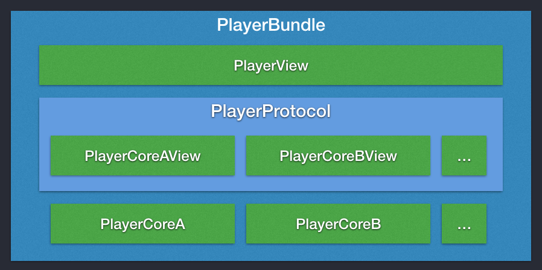
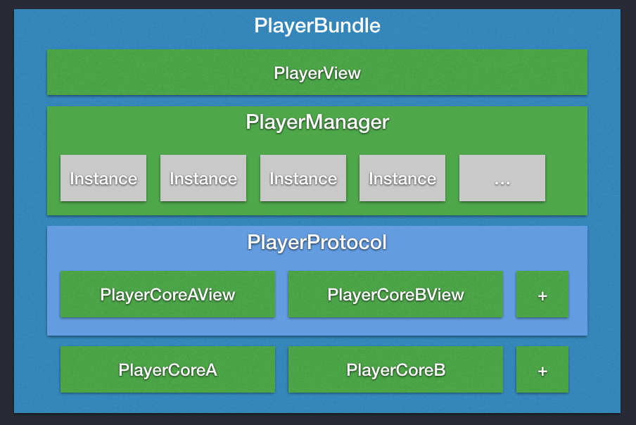

在一个重度使用视频的 App 里，在业务开发的各种场景中我们可能会创建出多个播放器的实例，其中当前正在播放视频的一般只有一个，其他的便只是空耗着内存。在这样的场景下，我们可以设计一个统一的机制来管理播放器的多个实例，将当前不使用的实例回收掉，记录下相关的上下文信息，当需要恢复时将其再恢复即可。

## 播放器组件的架构

那我们该怎么设计一个管理播放器多实例的框架呢？首先，我们先看看该怎么设计一个播放器组件。

上图是一个可供参考的播放器组件的基础架构。最底下是播放器的内核层，比如 PlayerCoreA、PlayerCoreB 可以是不同的内核（比如基于 FFmpeg 的播放器内核、基于 AVFoudation 的 AVPlayer 等等）。往上一层是播放器内核的封装层，通过一个 PlayerProtocol 协议将接口统一规范，以 UIView 子类的形式提供出来。再往上一层是对外接口层，提供一个 PlayerView 供业务使用，其中组装一个具体的实现了 PlayerProtocol 协议的播放器实例，再基于 PlayerProtocol 提供统一的播放器接口，同时可以提供一些配置来供业务选择不同的播放内核。这样一来，如果我们要接入新的播放内核，那么只需要在内核层接入，再在封装层按照协议统一封装即可。使得整个播放器组件能够保持一个良好的扩展性，同时对外的接口能够保持稳定。

在这样的播放器组件架构上，我们要实现多实例管理就会变得容易许多，甚至可以做到对接口层无改动，从而对业务保持透明。因为对外接口层的 PlayerView 是一层壳，其实际的播放器实例是组装在 PlayerView 里实现了 PlayerProtocol 协议的对象。那么现在要做的就是把这个实例的管理交给一个 PlayerManager 即可。

## 实例的新建

PlayerManager 采用单例的模式实现，它管理着一个 PlayerProtocol 实例的队列。

在业务需要一个播放器时，直接初始化一个 PlayerView 对象，这个 PlayerView 会生成一个 token（比如根据 PlayerView 实例的内存地址），然后用这个 token 去找 PlayerManager 获取一个 PlayerProtocol 实例。如果 PlayerManager 管理的队列中有这个 token，则直接取得其对应的实例返回；如果没有，则新建一个实例将其放到队列中，以传入的 token 为 key，同时也将这个实例的句柄返回给 PlayerView 使用。

## 实例的淘汰

当 PlayerManager 管理的实例个数超过设定的限制个数，则根据最近最少使用算法去销毁队列里的一个播放器实例，销毁前将这个实例的上下文信息（比如当前视频地址、配置信息、播放时间、音量等）保存在其对应的 PlayerView 壳实例中，用于后续恢复用。在此时，业务方还持有着 PlayerView 壳实例。

如果业务方主动销毁 PlayerView 实例，则销毁前 PlayerView 通知 PlayerManager 同时销毁对应的 PlayerProtocol 实例。

## 实例的恢复

当 PlayerView 壳实例对应的 PlayerProtocol 实例已经被销毁，而这个 PlayerView 又被业务方再次调用时（一般是调用 play），这时则根据 PlayerView 之前销毁实例时保存的 PlayerProtocol 的上下文信息重新创建它，恢复其之前的播放状态，并通知 PlayerManager 将这个实例管理起来。

[SamirChen]: http://www.samirchen.com "SamirChen"
[1]: {{ page.url }} ({{ page.title }})
[2]: http://www.samirchen.com/player-instances-management