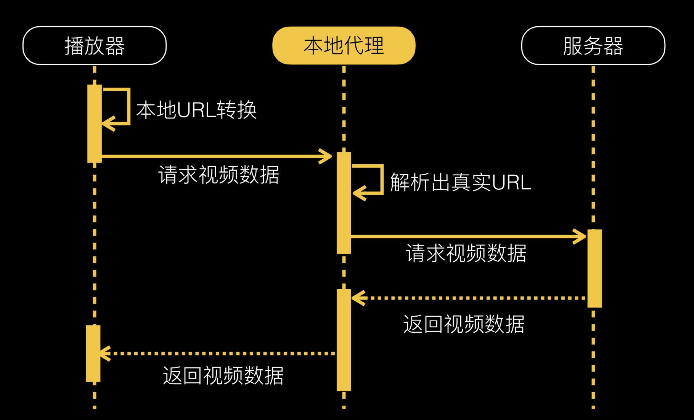

## 视频缓存

对于高频使用短视频的应用，缓存是一种节约流量成本非常有效的方式。其中一个重点在于能够实现边下边播边缓存，避免因为缓存影响第一次播放视频的体验，另外一个重点在于提高缓存的命中率。

在[十亿级视频播放技术优化揭秘][3]一文中，介绍了一种方案：

其核心思想就是将以往播放器直连服务端的方式改为由本地代理服务器中转，这样播放器和服务器之间的数据往来本地代理可以完全把控，这样实现边下边播边缓存自然就很方便了。思路大致如此，接下来主要介绍一下目前在 iOS 平台可直接拿来用的实现方案。

对于 iOS 端代理服务器的实现，可以参考和使用 [CocoaHTTPServer][4]。对于 iOS 端的视频缓存管理，可以参考和使用 [KTVHTTPCache][4]。

## H.265

[SamirChen]: http://www.samirchen.com "SamirChen"
[1]: {{ page.url }} ({{ page.title }})
[2]: http://www.samirchen.com/video-playback-bandwidth-cost
[3]: http://www.infoq.com/cn/presentations/one-billion-levels-of-video-playback-technology-optimization-secret
[4]: https://github.com/robbiehanson/CocoaHTTPServer
[5]: https://github.com/ChangbaDevs/KTVHTTPCache
